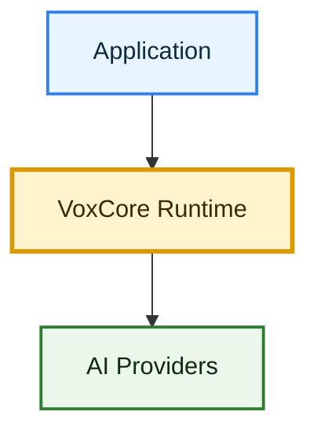

# VoxCore

Open-source runtime for building real-time conversational AI.


## Introduction

VoxCore is an open-source voice AI runtime for developers who want to build real-time conversational applications without tying their product to a single vendor, model, or hosted voice platform.

## Problem

Voice AI applications require speech recognition, conversation state, language models, tool execution, memory, speech synthesis, and real-time streaming. Hosted platforms make this easier to start, but teams that need deeper control, local deployment, provider flexibility, and transparent runtime behavior often outgrow closed abstractions.

## Solution

VoxCore provides the reusable runtime layer for voice-first applications. It is designed to manage voice sessions, stream audio, coordinate AI providers, execute tools, preserve context, and return spoken responses through clean developer-facing interfaces.

## Features

VoxCore is designed around these core capabilities:

- Streaming speech-to-text
- Conversation engine
- Tool calling
- Session memory
- Text-to-speech
- Python and TypeScript SDKs
- Provider-agnostic architecture

## Architecture Overview



## Why VoxCore

| Dimension | Vapi | VoxCore |
| --- | --- | --- |
| Primary goal | Build and deploy voice AI agents quickly | Own and extend an open-source voice runtime |
| Operating model | Hosted developer platform | Developer-managed runtime |
| Philosophy | Managed voice AI product | Reusable backend infrastructure |
| Customization | Configuration-first | Code-first and extensible |
| Provider control | Provider choice through platform workflows | Provider independence through runtime ownership |
| Best fit | Teams that want speed and managed voice workflows | Teams that want transparency, local control, and runtime ownership |

## Quick Start

```bash
git clone <repository-url>
cd voxcore
uv sync
make help
```

## Documentation

- [Software Requirements Specification](docs/01-software-requirements-specification.md)
- System Architecture: planned
- Module Design: planned
- API Reference: planned
- [Roadmap](ROADMAP.md)

## Roadmap

VoxCore is in early development; see the [roadmap](ROADMAP.md) for planned releases and long-term direction.

## Contributing

Contributions are welcome as the runtime takes shape. Please read [CONTRIBUTING.md](CONTRIBUTING.md) before opening issues, discussions, or pull requests.

## License

VoxCore is released under the [MIT License](LICENSE).
