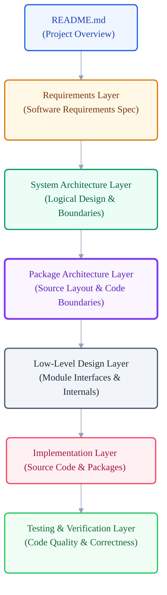

# VoxCore Engineering Documentation Guide

This document serves as the authoritative entry point and navigation hub for the entire engineering documentation ecosystem of VoxCore. It explains the hierarchy, relationships, and responsibilities of each documentation layer to guide developers, architects, and maintainers to the correct document for any technical inquiry.

---

## 1. Purpose

The Engineering Documentation Guide defines the organization and structure of VoxCore's technical specs. Each document in the ecosystem is designed to answer a single, distinct architectural or engineering concern, deliberately avoiding duplicate explanations across files.

By establishing a clear hierarchy, this guide ensures that:
- Every document possesses a unique, non-overlapping responsibility.
- Readers can locate the exact file containing the rules or specs they need.
- The documentation remains internally consistent, decoupled, and easy to maintain.

---

## 2. Documentation Philosophy

VoxCore uses a **documentation-driven development** methodology. The documentation is not a retrospective record of the codebase; rather, it is the authoritative blueprint that constrains and guides the implementation.

```
[README]
   │
   ▼
[Software Requirements Specification]
   │
   ▼
[System Architecture]
   │
   ▼
[Package Architecture]
   │
   ▼
[Low-Level Design (LLD)]
   │
   ▼
[Implementation]
   │
   ▼
[Testing & Verification]
```

Under this philosophy, design decisions flow strictly downwards:
- **Downward Constraints**: Higher-level documents define constraints that lower-level documents must respect. For example, System Architecture logical layers constrain the physical layout defined in Package Architecture.
- **No Reverse Redefinition**: Lower-level documents must never redefine or contradict decisions made in higher-level documents.
- **Traceability**: Every implementation decision must be traceable back to its underlying package rules, component design, and product requirements.

---

## 3. Documentation Layers

The following table defines the purpose and scope of each documentation layer in the VoxCore ecosystem, specifying the core engineering questions each layer answers.

| Documentation Layer | Purpose | Answers Engineering Question |
| --- | --- | --- |
| **Project** | Project landing page, high-level introduction, and administrative guides. | What is VoxCore, what is the roadmap, and how can contributors participate? |
| **Requirements** | Establishes the product requirements and externally observable behavior. | *What* must the system do? |
| **System Architecture** | Defines the logical structure, runtime flows, and system-wide design patterns. | *How* is the system logically designed? |
| **Package Architecture** | Establishes the physical source tree structure, dependency rules, and package boundaries. | *Where* does each responsibility reside in the repository? |
| **Low-Level Design (LLD)** | Translates package-level concerns into detailed component interfaces, modules, and schemas. | *How* are individual modules and internal components structured? |
| **Public Interfaces** | Authoritative definition of public protocol boundaries and client integration APIs. | *How* do external clients and SDKs integrate with VoxCore? |
| **Implementation** | The actual source code and runtime behavior. | *How* is the logic built and compiled? |
| **Testing** | Verification protocols, test coverage constraints, and testing frameworks. | *How* is the correctness of the implementation verified? |
| **Operations** | Deployability, infrastructure environments, configuration, and monitoring rules. | *How* is the system deployed, monitored, and operated in production? |

---

## 4. Documentation Hierarchy

The vertical alignment of the documentation stack illustrates how abstract goals are refined into concrete, testable code.



---

## 5. Documentation Map

The VoxCore documentation is organized into the following categories:

### Project Documentation
These files reside in the repository root and cover administrative and operational concerns:
- **[README](../README.md)**: High-level landing page introducing the project, features, and setup.
- **[Roadmap](../ROADMAP.md)**: Details the planned features, milestones, and release windows.
- **[Contributing](../CONTRIBUTING.md)**: Guidelines for contributing code, submitting issues, and building components.
- **[Changelog](../CHANGELOG.md)**: Historic record of changes, fixes, and architectural adjustments.

### Requirements Layer
- **[Software Requirements Specification](01-software-requirements-specification.md)**: Authoritative functional and non-functional requirements.

### System Architecture Layer
Located in [docs/02-system-architecture/](02-system-architecture/README.md), this layer defines logical runtime and structural design:
- **[README](02-system-architecture/README.md)**: System Architecture introduction and overview.
- **[Architectural Goals](02-system-architecture/01-architectural-goals.md)**: Core objectives driving VoxCore design.
- **[Quality Attributes](02-system-architecture/02-quality-attributes.md)**: Latency, reliability, scalability, and security constraints.
- **[Architectural Principles](02-system-architecture/03-architectural-principles.md)**: Structural paradigms and design guidelines.
- **[Layered Architecture](02-system-architecture/04-layered-architecture.md)**: Subsystem layering and boundary definitions.
- **[Runtime Architecture](02-system-architecture/05-runtime-architecture.md)**: Execution models, concurrency, and loops.
- **[Component Architecture](02-system-architecture/06-component-architecture.md)**: Core components and modular units.
- **[Communication Architecture](02-system-architecture/07-communication-architecture.md)**: Message routing and data flow.
- **[Infrastructure Architecture](02-system-architecture/08-infrastructure-architecture.md)**: Deployment topologies and host environments.
- **[Deployment Architecture](02-system-architecture/09-deployment-architecture.md)**: Packaging, execution containers, and dependencies.
- **[Extension Points](02-system-architecture/10-extension-points.md)**: Core framework plugin and custom behavior hook boundaries.

### Package Architecture Layer
Located in [docs/03-package-architecture/](03-package-architecture/README.md), this layer maps logical systems to the physical source layout:
- **[README](03-package-architecture/README.md)**: Package Architecture introduction and overview.
- **[Source Tree](03-package-architecture/01-source-tree.md)**: Physical directory layout and file organization guidelines.
- **[Dependency Rules](03-package-architecture/02-package-dependency-rules.md)**: Import direction constraints and dependency directions.
- **[Package Guidelines](03-package-architecture/03-package-guidelines.md)**: Structural layout and file structure conventions inside a package.
- **[Responsibilities](03-package-architecture/04-package-responsibilities.md)**: Explicit ownership and boundaries of backend packages.
- **[Communication](03-package-architecture/05-package-communication.md)**: Interface-driven collaboration rules between packages.
- **[Extension Rules](03-package-architecture/06-package-extension-rules.md)**: Rules for adding packages, providers, tools, and plugins.

### Low-Level Design (LLD) *(Planned)*
This layer translates Package Architecture and contracts into implementation-ready module specs, describing internal classes, data schemas, and helper utilities.
- **Module Design**: Internal class interactions, algorithms, and helper boundaries.

### Public Interfaces *(Planned)*
Detailed API specifications for external consumers:
- **REST API**: HTTP endpoints, request payloads, and status codes.
- **WebSocket Protocol**: Real-time streaming connection rules, events, and audio transmission frames.
- **SDK Specifications**: Framework bindings and usage guidelines for client integrations.

### Operations & Architecture Records *(Planned)*
- **Architecture Decision Records (ADRs)**: Documentation of key design decisions, trade-offs, and approvals.
- **Deployment Guides**: System scaling guidelines, Docker instructions, and environment configuration guides.
- **Testing**: Testing criteria, coverage metrics, and integration test setup.

---

## 6. Recommended Reading Paths

To help readers navigate the documentation efficiently, we recommend distinct reading paths tailored to specific roles:


### Path 1: New Visitors (Understanding the Project Goal)
1. **[README](../README.md)**: High-level overview.
2. **[Roadmap](../ROADMAP.md)**: Intended target features.
3. **[Software Requirements Specification](01-software-requirements-specification.md)**: Understand the functional requirements.

### Path 2: Contributors (Writing Code)
1. **[README](../README.md)** & **[Software Requirements Specification](01-software-requirements-specification.md)**.
2. **[System Architecture Layer](02-system-architecture/README.md)**: Logical design context.
3. **[Package Architecture Layer](03-package-architecture/README.md)**: Focus on Source Tree layout and Dependency Rules.
4. **[Low-Level Design (LLD)](04-package-responsibilities.md)**: Details on classes and modules (when available).
5. **[Contributing](../CONTRIBUTING.md)**: Style guides, PR templates, and workflow rules.

### Path 3: Software Architects (System Integrity)
1. **[Software Requirements Specification](01-software-requirements-specification.md)**: Trace system requirements.
2. **[System Architecture Layer](02-system-architecture/README.md)**: Analyze logical layers, quality attributes, and runtime loops.
3. **[Package Architecture Layer](03-package-architecture/README.md)**: Verify physical package responsibilities and dependencies.
4. **Low-Level Design (LLD)**: Analyze module coupling and cohesion.
5. **ADRs**: Track design decisions and architectural trade-offs.

### Path 4: Maintainers (Releasing & Operating)
1. **All Architect Docs**: Complete understanding of system limits.
2. **Testing**: Understand coverage verification rules.
3. **Operations & Deployment Guides**: Production settings, metrics tracking, and scaling limits.

---

## 7. Documentation Principles

Every document added or updated in the VoxCore repository must adhere to the following principles:

* **Single Responsibility Concern**: One document must answer exactly one architectural question.
* **Referential Decoupling**: Documentation must reference other files via links rather than copying content. Zero duplication.
* **Hierarchical Constraint**: Higher-level documents constrain lower-level ones.
* **Architecture-First Ordering**: Architecture design must precede and govern code implementation.
* **Deliberate Evolution**: Architectural documents evolve only through approved Architecture Decision Records (ADRs).
* **Internal Consistency**: No document shall contain statements contradicting other active documentation.
* **Traceable Implementation**: Code files, class interfaces, and tests must trace back to the responsibilities and dependencies defined in the architecture layer.

---

## 8. Relationship Between Documentation Layers

The relationships between documentation layers are structured as follows:

- **[README](../README.md)**: Introduces the project scope and sets the context.
- **[Software Requirements Specification](01-software-requirements-specification.md)**: Defines *what* the system must build.
- **[System Architecture](02-system-architecture/README.md)**: Defines the logical *how* (concurrency, loops, modules).
- **[Package Architecture](03-package-architecture/README.md)**: Defines *where* the logical code lives physically.
- **Low-Level Design (LLD)**: Defines the internal structures (classes, interfaces) of individual packages.
- **Implementation**: Realizes the design as source code.
- **Testing**: Verifies that the implementation conforms to both the Requirements and the architectural constraints.

| Layer | Input Source | Primary Goal | Verifies Against |
| --- | --- | --- | --- |
| **Requirements (SRS)** | User Needs | Define behavior | UAT / Product Goals |
| **System Architecture** | SRS | Define logical design | System Limits / Goals |
| **Package Architecture** | System Architecture | Define code layout | Dependency matrix |
| **Low-Level Design (LLD)** | Package Architecture | Define module classes | Design constraints |
| **Implementation** | LLD | Build code | Code compilation |
| **Testing** | Implementation | Verify functionality | SRS / Architecture rules |

---

## 9. Future Evolution

As VoxCore expands to support new capability integrations, its engineering documentation must scale correspondingly:
- New documentation files must fit within the existing layered hierarchy.
- Adding a new document requires defining a single unique concern that does not overlap with any existing document.
- Changes to documentation structure or introducing new layers must go through the formal **Architectural Governance** review before implementation.

---

## 10. Conclusion

The Engineering Documentation Guide is the authoritative directory and map for navigating VoxCore design specifications. By directing readers to the correct document, establishing clean layers of abstraction, and prohibiting content duplication, this guide preserves a highly modular, readable, and maintainable documentation ecosystem.
