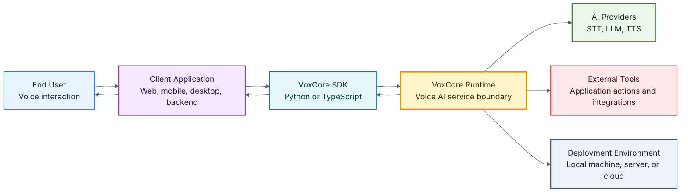
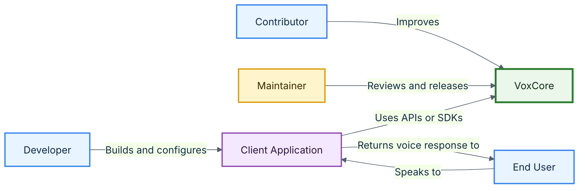

# VoxCore Software Requirements Specification

**Project:** VoxCore  
**Version:** v0.1.0  
**Document Type:** Software Requirements Specification (SRS)  
**Document Status:** Draft 1.0  
**Author:** Naman Singh  
**Last Updated:** 2026-07-02  
**License:** MIT  

---

## Document Control

| Item | Value |
| --- | --- |
| Project Name | VoxCore |
| Project Type | Open-source Voice AI Runtime |
| Current Project Version | v0.1.0 |
| Document Version | Draft 1.0 |
| Repository | GitHub |
| Primary Runtime Language | Python |
| Development Approach | Incremental, modular, and testable development |
| Document Style | IEEE-inspired Software Requirements Specification |
| Target Audience | Developers, maintainers, reviewers, contributors, and technical evaluators |

## Revision History

| Version | Date | Author | Description |
| --- | --- | --- | --- |
| 1.0 | 2026-07-02 | Naman Singh | Initial professional SRS draft for VoxCore v0.1.0. |
| 1.1 | 2026-07-02 | Naman Singh | Refined SRS boundaries, moved architecture-level content out of scope, and added applicable references. |

## Table of Contents

1. [Introduction](#1-introduction)
2. [Applicable References](#2-applicable-references)
3. [Overall Description](#3-overall-description)
4. [Problem Statement](#4-problem-statement)
5. [Vision and Mission](#5-vision-and-mission)
6. [Product Scope](#6-product-scope)
7. [Product Context Diagram](#7-product-context-diagram)
8. [Stakeholders](#8-stakeholders)
9. [User Roles](#9-user-roles)
10. [Functional Requirements](#10-functional-requirements)
11. [Non-Functional Requirements](#11-non-functional-requirements)
12. [External Interfaces](#12-external-interfaces)
13. [Constraints](#13-constraints)
14. [Assumptions](#14-assumptions)
15. [Success Criteria](#15-success-criteria)
16. [Future Scope](#16-future-scope)
17. [Appendix A: Requirement Traceability Matrix](#appendix-a-requirement-traceability-matrix)

---

## 1. Introduction

### 1.1 Purpose

VoxCore is an open-source Voice AI Runtime for building real-time conversational voice applications. It provides the backend runtime capabilities required to receive audio, convert speech to text, maintain conversation context, interact with language models, execute tools, synthesize speech, and stream responses back to clients.

This document defines the software requirements for VoxCore. It describes what the system shall provide, the expected qualities of the system, the external interfaces it must expose, and the success criteria for evaluating the product.

This SRS intentionally avoids detailed runtime architecture, internal component design, sequence diagrams, state machines, deployment diagrams, and adapter implementation details. Those artifacts belong in a separate System Architecture or Software Design document.

### 1.2 Intended Audience

| Audience | Purpose |
| --- | --- |
| Software Engineers | Understand required runtime behavior and implementation boundaries. |
| Machine Learning Engineers | Understand where speech, language, and synthesis providers integrate with the product. |
| Backend Developers | Understand API, session, streaming, and provider requirements. |
| Open-source Contributors | Understand the scope of acceptable contributions and extension points. |
| Maintainers | Preserve product intent, requirement quality, and release readiness. |
| Technical Reviewers | Evaluate completeness, feasibility, risks, and professional quality. |
| Recruiters and Hiring Teams | Review VoxCore as a serious engineering portfolio project. |

### 1.3 Definitions, Acronyms, and Abbreviations

| Term | Description |
| --- | --- |
| Runtime | The executable environment that coordinates the voice AI pipeline for active sessions. |
| Session | A single isolated conversational interaction between a client and VoxCore. |
| Client Application | Any web, mobile, desktop, backend, or embedded application that connects to VoxCore. |
| STT | Speech-to-text; conversion of spoken audio into text. |
| TTS | Text-to-speech; conversion of text into spoken audio. |
| LLM | Large language model used for response generation, reasoning, and tool selection. |
| Tool | A callable function or external capability that may be invoked during a conversation. |
| Provider | An implementation or service that supplies STT, LLM, TTS, memory, or tool capabilities. |
| SDK | A client library that simplifies communication with VoxCore APIs. |
| API | A documented interface exposed by VoxCore for client applications and integrations. |
| Control Plane | Operations used to create, inspect, configure, or terminate sessions. |
| Streaming Plane | Real-time exchange of audio, transcripts, events, and synthesized responses. |

---

## 2. Applicable References

This document is inspired by established software engineering and API documentation practices. VoxCore does not claim formal certification against these standards, but uses them as guidance where applicable.

| Reference | Version or Identifier | Relevance |
| --- | --- | --- |
| [ISO/IEC/IEEE 29148:2018](https://standards.ieee.org/standard/29148-2018.html) | Requirements engineering | Guidance for writing clear, testable, lifecycle-aware requirements. |
| [Semantic Versioning](https://semver.org/) | 2.0.0 | Versioning guidance for public releases and compatibility expectations. |
| [Conventional Commits](https://www.conventionalcommits.org/en/v1.0.0/) | 1.0.0 | Commit message structure for maintainable release history. |
| [PEP 8](https://peps.python.org/pep-0008/) | Python style guide | Python code style guidance for the primary runtime implementation. |
| [RFC 6455](https://www.rfc-editor.org/info/rfc6455/) | WebSocket Protocol | Protocol reference for real-time bidirectional communication. |
| [RFC 9110](https://www.rfc-editor.org/info/rfc9110/) | HTTP Semantics | Protocol reference for REST-style HTTP API behavior. |
| [OpenAPI Specification](https://spec.openapis.org/oas/v3.2.0.html) | v3.2.0 | API description guidance for future HTTP API documentation. |
| [JSON Schema](https://json-schema.org/specification) | Draft 2020-12 | Schema guidance for structured request, response, and event payloads. |

---

## 3. Overall Description

### 3.1 Product Perspective

VoxCore is a backend runtime that sits between client applications and AI providers. It is not a complete end-user application by itself. Instead, it provides reusable voice AI infrastructure that application developers can integrate into their own products.

The runtime is intended to support multiple application domains, including assistants, customer support agents, educational tools, workflow automation, accessibility tools, and voice-first prototypes.

### 3.2 Product Functions

At a product level, VoxCore shall support the following functions:

- Create and manage conversational voice sessions.
- Receive streaming microphone audio from client applications.
- Convert speech input into text through speech recognition providers.
- Maintain conversation history and session context.
- Generate assistant responses through language model providers.
- Execute registered tools when required by the conversation.
- Convert assistant responses into speech through synthesis providers.
- Stream response audio back to client applications.
- Expose documented APIs and SDKs for application integration.
- Allow providers and application tools to be replaced or extended without changing the product purpose.

### 3.3 Product Users

The primary users of VoxCore are developers and technical teams building voice-enabled software. End users interact with applications built on top of VoxCore, but they do not typically interact with VoxCore directly.

### 3.4 Document Boundary

This SRS defines product requirements. It does not define the final internal architecture.

The following artifacts are intentionally excluded from this document and should be maintained in a future architecture or design document:

- Runtime component diagrams
- Layered architecture diagrams
- Internal sequence diagrams
- Session state machines
- Deployment diagrams
- Module dependency diagrams
- Provider adapter design
- Event flow diagrams
- Audio pipeline internals
- Conversation pipeline internals
- Tool execution pipeline internals
- Memory flow internals
- Interface contract implementation details

---

## 4. Problem Statement

Voice interfaces are becoming increasingly important for modern applications because they allow users to interact naturally, quickly, and hands-free. However, building high-quality voice AI systems remains difficult.

Existing commercial voice platforms can accelerate early development, but they often introduce constraints that limit long-term flexibility:

- Vendor lock-in
- Recurring platform costs
- Limited customization
- Restricted model and provider selection
- Difficult offline or local deployment
- Limited architectural transparency
- Reduced experimentation capability
- Inflexible integration with custom tools and business systems

Developers who need complete control over the voice AI pipeline often must manually integrate speech recognition, language models, tool execution, memory, and speech synthesis. This leads to duplicated engineering effort, inconsistent architecture, and higher maintenance cost across projects.

VoxCore addresses this problem by providing an open-source, reusable, provider-agnostic runtime for real-time conversational voice applications.

---

## 5. Vision and Mission

### 5.1 Vision

VoxCore aims to become an open-source foundation for real-time conversational AI, enabling developers to build scalable voice-first applications without being locked into a single vendor, model, or deployment style.

### 5.2 Mission

VoxCore simplifies the development of production-quality voice applications by providing a modular runtime for speech recognition, conversation management, language model interaction, tool execution, memory, and speech synthesis behind documented interfaces.

---

## 6. Product Scope

### 6.1 In Scope

VoxCore shall provide runtime infrastructure for voice-enabled applications. The following capabilities are in scope:

- Voice session lifecycle management
- Streaming audio ingestion
- Speech recognition orchestration
- Conversation state management
- Language model interaction
- Tool registration and execution
- Session-scoped memory
- Text response generation
- Speech synthesis
- Audio response streaming
- REST APIs for control-plane operations
- WebSocket APIs for real-time streaming operations
- Python SDK support
- TypeScript SDK support
- Provider replacement through stable product interfaces

### 6.2 Out of Scope

The following capabilities are outside the scope of the initial product:

| Area | Out-of-Scope Capability |
| --- | --- |
| Model Development | Training foundation models or building custom speech models. |
| Infrastructure | Distributed GPU clusters, multi-region orchestration, or Kubernetes-first deployment. |
| Enterprise Platform | Billing systems, enterprise identity management, and hosted account administration. |
| Application Logic | Domain-specific workflows, business policies, or product-specific user journeys. |
| Analytics Product | Full analytics dashboards or business intelligence interfaces. |
| Commercial Marketplace | Paid plugin marketplace, licensing marketplace, or provider billing broker. |

### 6.3 Functional Goals

VoxCore shall enable:

- Real-time conversational voice interaction.
- Streaming audio communication.
- Streaming speech recognition.
- Context-aware response generation.
- Multiple STT, LLM, and TTS providers.
- Tool execution during conversations.
- REST and WebSocket integration.
- Reusable SDK-based application development.
- Adoption across multiple application domains.

### 6.4 Engineering Goals

VoxCore should be:

- Modular
- Testable
- Maintainable
- Provider-agnostic
- Observable
- Extensible
- Well documented
- Production-oriented
- Easy to debug
- Friendly to open-source contributors

---

## 7. Product Context Diagram

The following diagram shows VoxCore in its product context. It describes the system boundary and its relationship to clients, providers, tools, and deployment environments. It does not prescribe internal runtime architecture.

---

## 8. Stakeholders

| Stakeholder | Interest |
| --- | --- |
| Developers | Build voice-enabled applications with less infrastructure overhead. |
| ML Engineers | Integrate, evaluate, and replace speech, language, and synthesis providers. |
| Open-source Contributors | Extend the runtime, improve documentation, and add provider support. |
| Maintainers | Preserve project quality, release stability, and architectural direction. |
| End Users | Experience natural, responsive voice interactions in applications built on VoxCore. |
| Technical Reviewers | Evaluate correctness, completeness, maintainability, and production readiness. |

---

## 9. User Roles

### 9.1 User Role Diagram

### 9.2 Role Descriptions

| Role | Description |
| --- | --- |
| Developer | Builds client applications using VoxCore APIs, SDKs, tools, and provider configuration. |
| Contributor | Adds features, fixes bugs, improves documentation, or extends provider support. |
| Maintainer | Reviews changes, manages releases, protects project quality, and preserves product direction. |
| Client Application | Integrates with VoxCore and owns product-specific user experience and business logic. |
| End User | Interacts with a VoxCore-powered application through spoken conversation. |

---

## 10. Functional Requirements

### 10.1 Priority Definitions

| Priority | Meaning |
| --- | --- |
| Must | Required for the core runtime to be considered functional. |
| Should | Important for production readiness, but may be staged after the minimum viable runtime. |
| Could | Valuable enhancement that can be implemented after core requirements are satisfied. |

### 10.2 Session Management

| ID | Priority | Requirement | Acceptance Criteria |
| --- | --- | --- | --- |
| FR-001 | Must | The system shall establish conversational sessions. | A client can create a session and receive a unique session identifier. |
| FR-002 | Must | The system shall terminate sessions gracefully. | Session resources are released after client disconnect, timeout, or explicit termination. |
| FR-003 | Must | The system shall isolate each active session. | Audio, transcripts, memory, tool results, and generated responses do not leak across sessions. |

### 10.3 Audio Processing

| ID | Priority | Requirement | Acceptance Criteria |
| --- | --- | --- | --- |
| FR-004 | Must | The system shall receive streaming microphone audio from clients. | A supported client can send audio frames during an active session. |
| FR-005 | Must | The system shall process audio continuously during a session. | Audio frames are accepted and forwarded for recognition while the session remains active. |
| FR-006 | Must | The system shall stream synthesized audio responses to clients. | Clients receive playable audio chunks for assistant responses. |

### 10.4 Speech Recognition

| ID | Priority | Requirement | Acceptance Criteria |
| --- | --- | --- | --- |
| FR-007 | Must | The system shall convert speech input into text. | Spoken input produces transcript output through an STT provider. |
| FR-008 | Must | The system shall support interchangeable speech recognition providers. | At least one STT provider can be replaced without changing client application behavior. |
| FR-009 | Must | The system shall expose transcription results to the conversation process. | Transcript chunks are associated with the correct session and made available for response generation. |

### 10.5 Conversation Management

| ID | Priority | Requirement | Acceptance Criteria |
| --- | --- | --- | --- |
| FR-010 | Must | The system shall maintain dialogue history for each active session. | Prior user and assistant turns are available during response generation. |
| FR-011 | Must | The system shall maintain session context. | Session metadata, transcript history, memory, and tool results can be considered when generating responses. |
| FR-012 | Must | The system shall generate context-aware assistant responses. | Responses remain coherent with the current user input and relevant session history. |

### 10.6 Language Model Integration

| ID | Priority | Requirement | Acceptance Criteria |
| --- | --- | --- | --- |
| FR-013 | Must | The system shall support language model providers. | The runtime can request text generation from at least one configured LLM provider. |
| FR-014 | Must | The system shall support replacing language model providers. | LLM provider replacement does not require changes to client application code. |
| FR-015 | Must | The system shall avoid dependence on a single LLM vendor. | Product behavior is described independently from any one vendor API. |

### 10.7 Tool Execution

| ID | Priority | Requirement | Acceptance Criteria |
| --- | --- | --- | --- |
| FR-016 | Must | The system shall allow developers to register callable tools. | A developer can make an application capability available to the runtime as a named tool. |
| FR-017 | Must | The system shall invoke registered tools when required by a conversation. | A tool can be called during a session and return a structured result. |
| FR-018 | Must | Tool execution results shall be available for response generation. | The assistant can use tool results when producing the final response. |

### 10.8 Memory

| ID | Priority | Requirement | Acceptance Criteria |
| --- | --- | --- | --- |
| FR-019 | Must | The system shall maintain session-scoped memory. | Session data persists for the duration of the active session. |
| FR-020 | Must | The system shall keep memory isolated by session. | Memory from one session cannot be read by unrelated sessions. |

### 10.9 Speech Synthesis

| ID | Priority | Requirement | Acceptance Criteria |
| --- | --- | --- | --- |
| FR-021 | Must | The system shall convert assistant text into speech. | Valid assistant text can be synthesized into audio output. |
| FR-022 | Must | The system shall support interchangeable speech synthesis providers. | At least one TTS provider can be replaced without changing client application behavior. |
| FR-023 | Must | The system shall stream synthesized speech to clients. | Clients can receive response audio through a supported streaming interface. |

### 10.10 APIs

| ID | Priority | Requirement | Acceptance Criteria |
| --- | --- | --- | --- |
| FR-024 | Must | The system shall expose REST APIs for control-plane operations. | Clients can perform supported session and configuration operations over HTTP. |
| FR-025 | Must | The system shall expose WebSocket APIs for real-time streaming operations. | Clients can exchange audio, transcript events, and response events over WebSocket. |
| FR-026 | Must | APIs shall return structured success and error responses. | API responses use documented schemas for normal and failure states. |

### 10.11 SDKs

| ID | Priority | Requirement | Acceptance Criteria |
| --- | --- | --- | --- |
| FR-027 | Should | The project shall provide a Python SDK. | Python applications can create sessions and stream audio through a supported package. |
| FR-028 | Should | The project shall provide a TypeScript SDK. | TypeScript applications can create sessions and stream audio through a supported package. |
| FR-029 | Should | SDKs shall abstract networking complexity. | Developers can use high-level session and stream operations without managing low-level protocol details. |

### 10.12 Extensibility

| ID | Priority | Requirement | Acceptance Criteria |
| --- | --- | --- | --- |
| FR-030 | Must | New providers shall be added without changing product-level behavior. | Provider additions do not require changing the externally observable purpose of VoxCore. |
| FR-031 | Must | New tools shall be registerable through public extension points. | Developers can add application-specific tools without modifying unrelated runtime features. |
| FR-032 | Must | New application domains shall reuse the runtime without product redesign. | Domain-specific behavior can be supplied by client applications, configuration, prompts, tools, or providers. |

---

## 11. Non-Functional Requirements

### 11.1 Performance

| ID | Priority | Requirement | Measurement Guidance |
| --- | --- | --- | --- |
| NFR-001 | Must | Interactive conversations shall maintain low perceived latency. | Latency should be measured across audio ingestion, transcription, response generation, synthesis, and streaming. |
| NFR-002 | Must | Streaming behavior shall minimize avoidable response delay. | Partial outputs should be emitted as soon as they are safe and useful to clients. |

### 11.2 Reliability

| ID | Priority | Requirement | Measurement Guidance |
| --- | --- | --- | --- |
| NFR-003 | Must | Failure in one session shall not terminate unrelated active sessions. | Error handling tests should verify session isolation under failure conditions. |
| NFR-004 | Should | Recoverable provider and network failures should be handled gracefully. | Timeouts, invalid payloads, and provider errors should produce structured error events or responses. |

### 11.3 Scalability

| ID | Priority | Requirement | Measurement Guidance |
| --- | --- | --- | --- |
| NFR-005 | Should | The system should support multiple concurrent sessions. | Load tests should evaluate concurrent session handling and resource usage. |
| NFR-006 | Should | The product should be compatible with horizontal scaling strategies. | Runtime behavior should avoid unnecessary assumptions that prevent multiple instances. |

### 11.4 Maintainability

| ID | Priority | Requirement | Measurement Guidance |
| --- | --- | --- | --- |
| NFR-007 | Must | Major capabilities shall be organized with clear ownership boundaries. | Code review should reject unclear responsibility mixing in core modules. |
| NFR-008 | Must | Public behavior shall be documented before it is treated as stable. | Stable APIs, SDK methods, and provider expectations should have user-facing documentation. |
| NFR-009 | Must | Requirements and implementation should remain traceable. | Requirements should map to tests, documentation, or implementation tasks where practical. |

### 11.5 Modularity and Extensibility

| ID | Priority | Requirement | Measurement Guidance |
| --- | --- | --- | --- |
| NFR-010 | Must | Major external capabilities shall be replaceable where the product promises provider choice. | STT, LLM, and TTS provider replacement should not change the product-level contract. |
| NFR-011 | Must | Application-specific tools shall not require product redesign. | New tools should be added through documented extension mechanisms. |

### 11.6 Portability

| ID | Priority | Requirement | Measurement Guidance |
| --- | --- | --- | --- |
| NFR-012 | Should | The runtime should support Linux, Windows, and macOS for local development. | Development setup and test commands should avoid unnecessary platform-specific assumptions. |

### 11.7 Observability

| ID | Priority | Requirement | Measurement Guidance |
| --- | --- | --- | --- |
| NFR-013 | Must | The system shall produce useful operational logs. | Logs should include event type, session identifier, timing information, and safe error metadata. |
| NFR-014 | Should | The system should expose metrics for important runtime stages. | Metrics should cover session count, latency, provider calls, stream events, and error rates. |

### 11.8 Testability

| ID | Priority | Requirement | Measurement Guidance |
| --- | --- | --- | --- |
| NFR-015 | Must | Core behavior shall be testable without requiring live external providers. | Tests should support mocked or fake STT, LLM, TTS, and tool dependencies. |
| NFR-016 | Should | Streaming behavior should be covered by integration tests. | Tests should verify session creation, streaming input, event output, and response streaming. |

### 11.9 Security and Privacy

| ID | Priority | Requirement | Measurement Guidance |
| --- | --- | --- | --- |
| NFR-017 | Must | Session data shall not be exposed across unrelated clients. | Tests and reviews should verify session isolation and safe error handling. |
| NFR-018 | Should | Sensitive configuration values should not appear in logs. | Provider credentials, tokens, and secrets should be redacted from operational output. |

### 11.10 Documentation

| ID | Priority | Requirement | Measurement Guidance |
| --- | --- | --- | --- |
| NFR-019 | Must | Public APIs and SDKs shall include developer documentation. | Developers should be able to create a basic voice session using documented examples. |
| NFR-020 | Should | Major product decisions should be captured in project documentation. | Future architecture and design documents should explain significant technical decisions. |

---

## 12. External Interfaces

### 12.1 Client API Interface

| ID | Priority | Requirement | Acceptance Criteria |
| --- | --- | --- | --- |
| EI-001 | Must | VoxCore shall expose an HTTP interface for supported control-plane operations. | Clients can perform documented session and configuration operations over HTTP. |
| EI-002 | Must | VoxCore shall expose a WebSocket interface for real-time streaming. | Clients can exchange audio and runtime events over a persistent WebSocket connection. |
| EI-003 | Must | External API payloads shall use structured formats. | Requests, responses, and events use documented schemas. |

### 12.2 SDK Interface

| ID | Priority | Requirement | Acceptance Criteria |
| --- | --- | --- | --- |
| EI-004 | Should | VoxCore shall provide SDK interfaces for common client workflows. | SDK users can create sessions, stream audio, receive events, and terminate sessions. |
| EI-005 | Should | SDK interfaces shall hide low-level protocol details. | SDK users do not need to manually construct every WebSocket frame or HTTP payload. |

### 12.3 Provider Interface

| ID | Priority | Requirement | Acceptance Criteria |
| --- | --- | --- | --- |
| EI-006 | Must | VoxCore shall support external speech recognition providers. | The product can receive transcripts from at least one configured STT provider. |
| EI-007 | Must | VoxCore shall support external language model providers. | The product can request generated responses from at least one configured LLM provider. |
| EI-008 | Must | VoxCore shall support external speech synthesis providers. | The product can receive synthesized audio from at least one configured TTS provider. |

### 12.4 Tool Interface

| ID | Priority | Requirement | Acceptance Criteria |
| --- | --- | --- | --- |
| EI-009 | Must | VoxCore shall allow client applications to expose callable tools. | A registered tool can be invoked during a conversation and return a structured result. |
| EI-010 | Must | Tool results shall be represented in a structured format. | Tool output can be consumed by the response generation process without relying on unstructured logs. |

### 12.5 Audio Interface

| ID | Priority | Requirement | Acceptance Criteria |
| --- | --- | --- | --- |
| EI-011 | Must | VoxCore shall document supported input audio formats. | Developers can identify accepted codecs, sample rates, and transport expectations. |
| EI-012 | Must | VoxCore shall document supported output audio formats. | Developers can identify response audio format and playback requirements. |

---

## 13. Constraints

| ID | Constraint | Description |
| --- | --- | --- |
| C-001 | Open-source first | The project should remain understandable, inspectable, and extendable by the community. |
| C-002 | Python-based runtime | The initial runtime implementation targets Python. |
| C-003 | Streaming-first product behavior | Real-time audio and event streaming are core product expectations. |
| C-004 | Provider-agnostic positioning | VoxCore must not require a single fixed STT, LLM, or TTS vendor. |
| C-005 | Local development support | Developers should be able to run and test VoxCore locally. |
| C-006 | Cloud deployment compatibility | The runtime should be suitable for server or cloud-hosted deployments. |
| C-007 | Application-owned business logic | Domain-specific product behavior remains outside the VoxCore core product. |
| C-008 | Architecture documented separately | Detailed internal architecture shall be maintained outside this SRS. |

---

## 14. Assumptions

| ID | Assumption |
| --- | --- |
| A-001 | Client applications can maintain persistent network connections for streaming use cases. |
| A-002 | Client applications can capture microphone audio and play response audio. |
| A-003 | Audio input follows formats supported by VoxCore. |
| A-004 | AI providers are available through compatible local or remote interfaces. |
| A-005 | Host systems provide sufficient compute, memory, network, and audio processing capacity. |
| A-006 | Client applications provide domain-specific business logic, prompts, tools, and policies. |
| A-007 | Developers configure provider credentials and runtime settings for their deployment environment. |

---

## 15. Success Criteria

VoxCore v1.0 shall be considered successful when the following outcomes are demonstrable:

| ID | Success Criterion |
| --- | --- |
| SC-001 | A client can establish a voice session. |
| SC-002 | The system can receive streaming audio during an active session. |
| SC-003 | Speech input can be transcribed continuously. |
| SC-004 | Conversation context can be preserved across turns. |
| SC-005 | The system can generate context-aware assistant responses. |
| SC-006 | Tools can be executed during conversations. |
| SC-007 | Tool results can influence assistant responses. |
| SC-008 | Text responses can be synthesized into audio. |
| SC-009 | Audio responses can be streamed back to clients. |
| SC-010 | SDK integration requires minimal configuration for a basic session. |
| SC-011 | STT, LLM, and TTS providers can be replaced without changing client application behavior. |
| SC-012 | A new application domain can adopt VoxCore without redesigning the runtime product. |

---

## 16. Future Scope

Potential future enhancements include:

| Area | Future Capability |
| --- | --- |
| Ecosystem | Plugin marketplace and reusable provider packages. |
| Runtime | Distributed runtime and advanced model routing. |
| Intelligence | Multi-agent orchestration and long-term memory. |
| Operations | Advanced observability, benchmarking, and deployment automation. |
| Enterprise | Enterprise authentication and policy controls. |
| Voice Experience | Voice cloning, emotion-aware conversations, and adaptive speech output. |
| Edge Computing | Edge deployment optimization for local and offline voice applications. |
| Documentation | Dedicated architecture, design, API, and engineering principles documents. |

---

## Appendix A: Requirement Traceability Matrix

| Capability Area | Related Functional Requirements | Related Non-Functional Requirements | Related External Interfaces |
| --- | --- | --- | --- |
| Session Management | FR-001 to FR-003 | NFR-003, NFR-007, NFR-015, NFR-017 | EI-001, EI-002, EI-004 |
| Audio Processing | FR-004 to FR-006 | NFR-001, NFR-002, NFR-016 | EI-002, EI-011, EI-012 |
| Speech Recognition | FR-007 to FR-009 | NFR-001, NFR-004, NFR-010, NFR-015 | EI-006, EI-011 |
| Conversation Management | FR-010 to FR-012 | NFR-007, NFR-008, NFR-009, NFR-015 | EI-003, EI-004 |
| Language Model Integration | FR-013 to FR-015 | NFR-004, NFR-010, NFR-015 | EI-007 |
| Tool Execution | FR-016 to FR-018 | NFR-004, NFR-011, NFR-013 | EI-009, EI-010 |
| Memory | FR-019 to FR-020 | NFR-003, NFR-007, NFR-017 | EI-003 |
| Speech Synthesis | FR-021 to FR-023 | NFR-001, NFR-002, NFR-010, NFR-015 | EI-008, EI-012 |
| APIs | FR-024 to FR-026 | NFR-008, NFR-013, NFR-019 | EI-001, EI-002, EI-003 |
| SDKs | FR-027 to FR-029 | NFR-008, NFR-012, NFR-019 | EI-004, EI-005 |
| Extensibility | FR-030 to FR-032 | NFR-010, NFR-011, NFR-020 | EI-006 to EI-010 |

