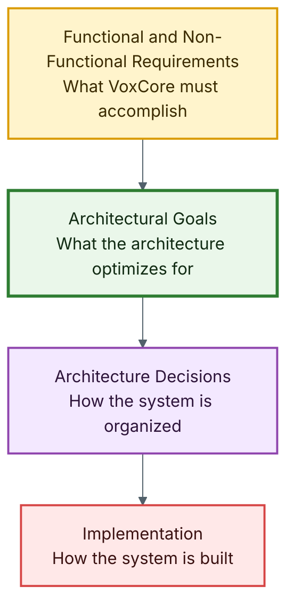
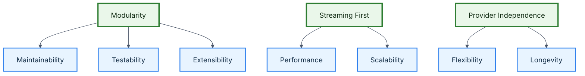

# VoxCore Architectural Goals

This document defines the architectural goals that guide every design decision throughout the VoxCore project.

Unlike the Software Requirements Specification, which defines what the system must accomplish, architectural goals define the engineering objectives that shape how the system is organized.

Every subsequent architecture document should align with the goals described here. Whenever multiple architectural alternatives exist, the solution that best satisfies these goals should be preferred.

---

## Purpose

The purpose of this document is to answer one foundational architecture question:

> Why is VoxCore designed this way?

Architectural goals are not implementation decisions. Technologies such as web frameworks, model providers, databases, queues, and transport libraries may help satisfy architectural goals, but they are not goals by themselves.

This document establishes the long-term engineering direction for VoxCore before lower-level architecture documents describe layers, runtime components, provider boundaries, sessions, audio flow, tools, memory, observability, deployment, and extension points.

---

## Scope

This document covers:

- The relationship between requirements and architectural goals.
- The primary architectural drivers for VoxCore.
- The ten architectural goals that guide runtime design.
- The relationships and trade-offs between those goals.
- The success measures used to evaluate whether the architecture satisfies each goal.

This document intentionally does not define:

- Framework selection
- Provider selection
- Source code structure
- Class or function design
- Deployment topology
- Data storage implementation
- Protocol payload schemas
- Runtime algorithms

Those details belong in later architecture, design, API, and implementation documents.

---

## Relationship With The SRS

The [Software Requirements Specification](../01-software-requirements-specification.md) establishes the functional and non-functional requirements of VoxCore.

Architectural goals translate those requirements into engineering objectives that influence architectural decisions.

For example:

- A requirement for provider replacement becomes the architectural goal of provider independence.
- A requirement for maintainability becomes the architectural goal of modularity.
- A requirement for extensibility becomes the architectural goal of explicit extension points.
- A requirement for low perceived latency becomes the architectural goal of streaming-first runtime design.

Every architectural goal should be traceable back to one or more requirements in the SRS.

This document influences:

- Quality Attributes
- Architectural Principles
- Layered Architecture
- Runtime Architecture
- Component Architecture
- Communication Architecture
- Infrastructure Architecture
- Deployment Architecture
- Extension Points

---

## Architectural Drivers

The architecture of VoxCore is primarily driven by four factors:

| Driver | Architectural Meaning |
| --- | --- |
| Functional requirements | The runtime must support real-time voice sessions, provider interaction, tools, memory, APIs, SDKs, and streaming communication. |
| Quality attributes | The runtime must be maintainable, testable, observable, scalable, extensible, and performant enough for interactive voice use cases. |
| Long-term maintainability | The architecture must remain understandable as providers, tools, protocols, and deployment options grow. |
| Developer experience | Developers integrating or extending VoxCore should encounter predictable APIs, clear boundaries, and minimal configuration friction. |

These drivers collectively determine how the runtime should evolve.

---

## Primary Architectural Goals

VoxCore has ten primary architectural goals.

Each goal defines a desired property of the system architecture. Later architecture documents should explain how their local decisions support these goals.

### Goal 1: Modularity

The runtime should be divided into independently maintainable components that follow explicit ownership boundaries.

Each runtime component should own one responsibility, one category of state, and one public interface.

Each component should encapsulate a single major capability while exposing explicit public interfaces. Changes within one component should have minimal impact on unrelated components.

**Success measure:** A major capability, such as provider integration, tool execution, memory, or session management, can evolve without requiring unrelated runtime components to change.

**Primary SRS traceability:** NFR-007, NFR-010, NFR-011, FR-030 to FR-032

### Goal 2: Provider Independence

The runtime shall remain independent of specific AI providers.

Provider independence is achieved through Domain Contracts and Provider Adapters rather than direct provider integration.

The Runtime should remain unaware of concrete provider implementations.

Speech recognition, language models, speech synthesis, embedding models, memory providers, and related external services should be replaceable without modifying the runtime's core business logic.

**Success measure:** An STT, LLM, TTS, memory, or embedding provider implementation can be replaced through stable Domain Contracts and Provider Adapters without changing client application behavior or unrelated runtime components.

**Primary SRS traceability:** FR-008, FR-014, FR-015, FR-022, FR-030, EI-006 to EI-008, NFR-010

### Goal 3: Streaming First

The runtime shall be optimized for continuous bidirectional communication rather than request-response interaction alone.

Streaming should be the default communication model for real-time audio input, transcript events, response generation, synthesized audio output, and runtime event delivery.

**Success measure:** The architecture supports active sessions in which audio, transcripts, events, and response audio can flow continuously without waiting for each full conversational turn to complete.

**Primary SRS traceability:** FR-004 to FR-006, FR-023, FR-025, NFR-001, NFR-002, NFR-016, EI-002

### Goal 4: Scalability

The architecture should support independent scaling of runtime components without requiring major structural changes.

Scalability should primarily be achieved through modular decomposition, session isolation, and explicit dependencies rather than premature optimization.

**Success measure:** The runtime can support multiple concurrent sessions and can evolve toward horizontal scaling without redesigning its core session, provider, or streaming boundaries.

**Primary SRS traceability:** NFR-003, NFR-005, NFR-006, FR-001 to FR-003

### Goal 5: Extensibility

Future capabilities should integrate through extension points rather than modification of existing components.

Future versions should support:

- New AI providers
- New SDKs
- New transport protocols
- New runtime services
- New provider adapters
- New plugin modules
- New communication patterns
- Future deployment models

Adding new providers, tools, memory backends, application integrations, runtime services, adapters, or plugins should require minimal changes to existing components.

**Success measure:** A new tool type, provider implementation, runtime service, adapter, plugin module, or application-specific capability can be added through documented extension interfaces without changing unrelated runtime internals.

**Primary SRS traceability:** FR-016 to FR-018, FR-030 to FR-032, EI-009, EI-010, NFR-011, NFR-020

### Goal 6: Maintainability

The architecture should prioritize readability, simplicity, explicit dependencies, and predictable behavior.

Future contributors should be able to understand the runtime without extensive onboarding or hidden implementation knowledge.

**Success measure:** Major runtime responsibilities are documented, dependency directions are explicit, and code review can identify the owner of a behavior without inspecting the entire system.

**Primary SRS traceability:** NFR-007, NFR-008, NFR-009, NFR-019, NFR-020

### Goal 7: Testability

Business logic should remain independently testable from infrastructure concerns.

Business rules should remain isolated inside focused Runtime Services, while interchangeable policies live in Runtime Strategies and mutable state lives in Stores and Registries. Pipeline stages, services, strategies, and stores should be testable independently without requiring external providers, networking infrastructure, or full runtime initialization.

Every major component should support isolated testing, and core behavior should be verifiable without requiring live external AI providers.

**Success measure:** Session management, pipeline execution, conversation rules, tool execution, memory behavior, provider selection strategies, and store-backed state can be tested with fake or mocked providers.

**Primary SRS traceability:** NFR-015, NFR-016, NFR-003, NFR-017

### Goal 8: Performance

The runtime should minimize end-to-end conversational latency while maintaining architectural simplicity.

The runtime should process conversational workflows through the Runtime Execution Pipeline and Runtime Scheduler, minimizing unnecessary blocking operations while supporting continuous streaming throughout the conversation lifecycle.

Performance optimizations should not compromise maintainability unless the benefit is measurable and relevant to interactive voice behavior.

**Success measure:** Latency can be measured across audio ingestion, transcription, response generation, synthesis, and response streaming, and performance improvements can be evaluated against those measurements.

**Primary SRS traceability:** NFR-001, NFR-002, FR-004 to FR-006, FR-023

### Goal 9: Observability

Runtime behavior should be transparent through structured logging, metrics, and traceable execution paths.

Operational visibility should be designed into the architecture rather than added after failures become difficult to diagnose.

**Success measure:** Important runtime stages, provider calls, session events, stream events, errors, and latency measurements can be traced safely by session without exposing sensitive data.

**Primary SRS traceability:** NFR-013, NFR-014, NFR-018, FR-026

### Goal 10: Developer Experience

Developers integrating VoxCore should experience consistent APIs, clear documentation, predictable behavior, and minimal configuration complexity.

Architecture should be discoverable through documentation.

Developers should be able to identify component ownership, dependency direction, and runtime execution flow without inspecting implementation code.

The architecture should optimize both runtime performance and developer productivity.

**Success measure:** A developer can configure providers, create a session, stream audio, receive events, register tools, and understand errors through documented APIs and SDK workflows.

**Primary SRS traceability:** FR-024 to FR-029, EI-001 to EI-005, NFR-008, NFR-019

---

## Goal Relationships

Architectural goals influence one another. Some goals reinforce each other directly, while others introduce trade-offs that must be balanced.

The relationships in this diagram do not imply that one goal is less important than another. They show how foundational goals create conditions that make other qualities easier to achieve.

---

## Goal Prioritization

Not every architectural goal has equal priority when trade-offs are required.

For VoxCore, the recommended priority order is:

| Priority | Goal |
| --- | --- |
| Critical | Maintainability |
| Critical | Extensibility |
| Critical | Runtime Simplicity |
| Critical | Provider Independence |
| High | Performance |
| High | Reliability |
| High | Testability |
| High | Developer Experience |
| Medium | Observability |
| Medium | Scalability |

Runtime simplicity is critical because VoxCore now depends on explicit runtime ownership, pipeline execution, RuntimeContext, scheduler behavior, focused Runtime Services, Runtime Strategies, Stores, Registries, Domain Contracts, Provider Adapters, and infrastructure boundaries. These concepts should make the runtime easier to reason about, not harder.

---

## Trade-Offs

Every architectural goal introduces trade-offs.

| Goal | Benefit | Trade-off |
| --- | --- | --- |
| Modularity | Improves clarity, ownership, and independent evolution. | Increases the number of components and interfaces that must be maintained. |
| Provider Independence | Reduces vendor lock-in and supports experimentation. | Introduces abstraction layers that may hide provider-specific capabilities. |
| Streaming First | Improves real-time conversational experience. | Requires more careful session, backpressure, error, and lifecycle handling. |
| Scalability | Allows the runtime to grow with demand. | Can increase architectural complexity if introduced before actual load patterns are understood. |
| Extensibility | Makes future capabilities easier to add. | Requires stable extension contracts and compatibility discipline. |
| Maintainability | Keeps the project understandable over time. | May reject clever shortcuts that appear faster in the short term. |
| Testability | Increases confidence and supports safer refactoring. | Requires dependency boundaries, fake providers, and test harnesses to be designed early. |
| Performance | Improves conversational responsiveness. | Can conflict with simplicity if optimizations are introduced without measurement. |
| Observability | Makes runtime behavior diagnosable. | Adds logging, metrics, and trace metadata that must avoid leaking sensitive data. |
| Developer Experience | Improves adoption and contributor productivity. | Requires additional attention to documentation, naming, defaults, and error messages. |

Architectural decisions throughout VoxCore should balance these trade-offs according to the priorities established in this document.

---

## Measuring Success

Architectural goals are useful only when they can influence evaluation.

The following table summarizes how each goal should be assessed during design review, implementation review, and future architecture updates.

| Goal | Review Question |
| --- | --- |
| Modularity | Can this change be made within the responsible component without modifying unrelated components? |
| Provider Independence | Can the affected provider be replaced through Domain Contracts and Provider Adapters without changing core runtime business logic? |
| Streaming First | Does the design support continuous audio, transcript, event, and response flow where real-time behavior matters? |
| Scalability | Does the design avoid assumptions that prevent concurrent sessions or future horizontal scaling? |
| Extensibility | Can future providers, tools, plugins, or integrations use an explicit extension point? |
| Maintainability | Are responsibilities, dependencies, and behavior understandable from the documentation and component boundaries? |
| Testability | Can the behavior be tested without live external providers or fragile infrastructure setup? |
| Performance | Can latency and resource impact be measured before introducing complexity? |
| Observability | Can important runtime behavior be traced safely through structured logs, metrics, or events? |
| Developer Experience | Will an integrating developer encounter predictable APIs, useful errors, and clear documentation? |

Architecture changes should be reconsidered when they cannot satisfy the relevant review questions.

---

## Traceability

The following table maps architectural goals to the architecture documents that primarily support them.

| Goal | Architectural Documents |
| --- | --- |
| Maintainability | Layered Architecture, Component Architecture |
| Extensibility | Runtime Architecture, Extension Points |
| Provider Independence | Component Architecture |
| Performance | Runtime Architecture, Communication Architecture |
| Reliability | Runtime Architecture, Infrastructure Architecture |
| Testability | Component Architecture |
| Observability | Infrastructure Architecture |
| Developer Experience | Architectural Principles |

---

## Rationale

These goals reflect VoxCore's intended role as an open-source Voice AI Runtime rather than a single-purpose application.

Because VoxCore coordinates clients, sessions, streaming audio, speech recognition, language models, tools, memory, synthesis, and external providers, the architecture must emphasize stable boundaries and replaceable integrations. The project should be useful across multiple application domains without forcing users into one provider, one deployment style, or one conversation model.

The goals also protect the project from overfitting to early implementation choices. A framework, provider, or storage mechanism may change over time, but the architectural goals should remain stable enough to guide those changes.

---

## Alternatives Considered

| Alternative | Reason Rejected |
| --- | --- |
| Provider-specific architecture | It would simplify the first implementation but conflict with provider independence, extensibility, and the product positioning defined in the SRS. |
| Request-response-first architecture | It would be simpler for traditional HTTP workflows but would not match VoxCore's real-time voice interaction requirements. |
| Monolithic runtime design | It would reduce initial coordination overhead but make provider replacement, isolated testing, and long-term maintenance harder. |
| Optimization-first architecture | It could improve isolated benchmarks but risks premature complexity before real latency and load data are available. |
| Plugin-first architecture for every capability | It would maximize flexibility but add unnecessary abstraction before core runtime responsibilities are stable. |

---

## Consequences

The architectural goals in this document create the following expectations for future architecture work:

- Later architecture documents must explain how their decisions support these goals.
- Provider-specific logic should remain behind Domain Contracts and Provider Adapters.
- Streaming behavior should be treated as a core runtime concern.
- Runtime components should have clear ownership and explicit dependencies.
- Test design should be considered during architecture design, not after implementation.
- Observability should be part of the runtime model from the beginning.
- Performance improvements should be guided by measurement.
- Developer-facing behavior should remain documented, predictable, and consistent.

These consequences should be treated as architecture review criteria as VoxCore evolves.

---

## Architectural Goal Validation

The architectural goals defined in this document serve as evaluation criteria for future architectural decisions.

Whenever a significant architectural change is proposed, it should be evaluated against the following questions:

- Does the change improve maintainability?
- Does it preserve provider independence?
- Does it respect ownership boundaries?
- Does it improve or preserve runtime simplicity?
- Does it reduce unnecessary coupling?
- Does it support future extensibility?
- Does it remain consistent with the Runtime Architecture?

If a proposed change negatively affects one or more critical goals, it should be justified through an Architecture Decision Record before implementation.

---

## Related Documents

| Document | Relationship |
| --- | --- |
| [System Architecture README](README.md) | Defines the structure and reading order for architecture documentation. |
| [Software Requirements Specification](../01-software-requirements-specification.md) | Defines the requirements that these architectural goals translate into engineering objectives. |
| [Quality Attributes](02-quality-attributes.md) | Defines the quality attributes that make these goals measurable in more detail. |
| [Architectural Principles](03-architectural-principles.md) | Defines the rules and design principles used to satisfy these goals. |
| [Component Architecture](06-component-architecture.md) | Defines runtime ownership boundaries that support these goals. |
| [Communication Architecture](07-communication-architecture.md) | Will explain runtime communication and event flow. |
| [Infrastructure Architecture](08-infrastructure-architecture.md) | Will explain cross-cutting infrastructure concerns. |
| [Extension Points](10-extension-points.md) | Will explain how extensibility is exposed safely. |

---

## Conclusion

The architectural goals in this document are the foundation for VoxCore's system architecture.

They explain why the runtime should be modular, provider-independent, streaming-first, scalable, extensible, maintainable, testable, performant, observable, and developer-friendly.

Future design decisions should be evaluated against these goals before being treated as part of the VoxCore architecture.
