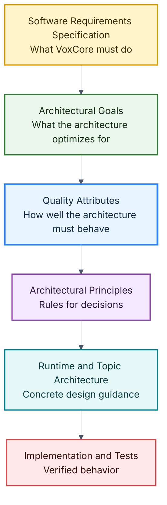
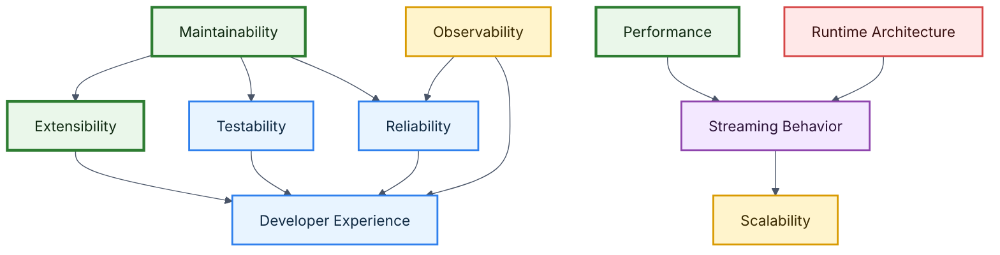

# VoxCore Quality Attributes

This document defines the quality attributes that drive the architecture of VoxCore.

Unlike functional requirements, which describe what the system must do, quality attributes describe how well the system must perform those functions.

Quality attributes influence architectural decisions, technology selection, module boundaries, communication patterns, dependency management, and implementation strategies.

Every architectural decision within VoxCore should improve one or more quality attributes while balancing any associated trade-offs.

---

## Purpose

The purpose of this document is to answer one architecture question:

> Which engineering qualities must VoxCore preserve as it evolves?

Quality attributes translate the product and engineering requirements in the [Software Requirements Specification](../01-software-requirements-specification.md) into measurable architectural concerns.

These attributes act as a bridge between requirements and architecture. They help reviewers evaluate whether a design is merely functional or whether it is maintainable, extensible, responsive, reliable, testable, observable, scalable, and pleasant for developers to use.

---

## Scope

This document covers:

- The primary quality attributes for VoxCore.
- The architectural impact of each attribute.
- Success criteria for evaluating each attribute.
- Relationships and trade-offs between attributes.
- Priority guidance for resolving design conflicts.
- Quality attribute scenarios that make each attribute concrete.
- Traceability between SRS requirements and quality attributes.

This document intentionally does not define:

- Runtime component internals
- Source code package structure
- Provider adapter implementation details
- API payload schemas
- Deployment topology
- Logging field names
- Test case implementation
- Performance benchmarks

Those details belong in later architecture, design, API, implementation, testing, and operations documents.

---

## Relationship With The SRS

The SRS defines functional requirements, non-functional requirements, external interface expectations, constraints, assumptions, and success criteria.

This document refines the SRS non-functional requirements into architecture-level quality attributes. It also connects functional requirements to the qualities they depend on.

For example:

- A requirement to support interchangeable STT, LLM, and TTS providers depends on extensibility and maintainability.
- A requirement to stream audio in real time depends on performance, reliability, and observability.
- A requirement to isolate sessions depends on reliability, scalability, and testability.
- A requirement to provide SDKs depends on developer experience and maintainability.

Every architecture document after this one should be evaluated against the quality attributes defined here.

---

## Design Drivers

VoxCore is a voice AI runtime rather than a single end-user application. Its architecture must therefore preserve qualities that allow many applications, providers, tools, and deployment environments to reuse the runtime safely.

The most important design drivers are:

| Driver | Architectural Meaning |
| --- | --- |
| Real-time voice interaction | The runtime must reduce avoidable delay and support streaming behavior. |
| Provider choice | External AI capabilities must remain replaceable through stable boundaries. |
| Session isolation | Each conversation must remain independent from unrelated conversations. |
| Long-term evolution | The project must remain understandable as providers, tools, memory, APIs, and plugins grow. |
| Open-source contribution | New contributors should be able to understand responsibilities, interfaces, and expected behavior. |
| Test confidence | Core runtime behavior must be verifiable without live external AI providers. |

These drivers shape the eight primary quality attributes defined below.

---

## Primary Quality Attributes

VoxCore defines exactly eight primary quality attributes.

These attributes should remain stable throughout the lifetime of the project, even when implementation technologies change.

### 1. Maintainability

The architecture should make future modifications straightforward without introducing unnecessary complexity or widespread code changes.

VoxCore is intended to evolve over many versions, providers, tools, deployment styles, and application domains. Poor maintainability would rapidly increase development cost and make the runtime difficult to review or extend.

**Architectural impact:**

- Modular components
- Explicit interfaces
- Clear responsibilities
- Minimal coupling
- Consistent documentation
- Predictable dependency direction

**Success criterion:** A developer can modify one module without requiring changes to unrelated modules.

### 2. Extensibility

The runtime should support new capabilities through extension rather than modification.

Future versions may introduce new STT providers, LLM providers, TTS providers, memory implementations, tools, plugins, and application integration patterns. The architecture should anticipate this growth without turning every capability into an early abstraction.

**Architectural impact:**

- Provider abstractions
- Tool registration boundaries
- Extension interfaces
- Dependency inversion
- Stable contracts for replaceable behavior

**Success criterion:** New providers, tools, or memory implementations can integrate without changing existing runtime orchestration logic.

### 3. Performance

The runtime should minimize conversational latency while maintaining architectural simplicity.

Voice conversations are highly sensitive to delay. Users perceive even short pauses quickly, especially during turn-taking, transcription, response generation, synthesis, and response playback.

**Architectural impact:**

- Streaming-first execution
- Async processing where appropriate
- Efficient pipeline boundaries
- Lightweight abstractions
- Latency measurement points
- Avoidance of unnecessary blocking operations

**Success criterion:** Architectural decisions minimize avoidable blocking in the audio, transcription, conversation, synthesis, and response streaming path.

### 4. Scalability

The architecture should support increasing workloads without major structural redesign.

Applications using VoxCore may eventually serve multiple concurrent conversations. The initial implementation does not need to over-optimize for large distributed deployments, but it should avoid decisions that prevent future scaling.

**Architectural impact:**

- Session isolation
- Independent modules
- Stateless APIs where appropriate
- Clear ownership of stateful resources
- Horizontal scaling readiness
- Avoidance of process-wide conversational state

**Success criterion:** Additional runtime instances or concurrent sessions do not require redesigning the core architecture.

### 5. Reliability

The runtime should continue operating correctly despite recoverable failures.

External providers, network connections, client streams, tool calls, and audio processing can fail. A failure in one conversation should not impact unrelated conversations.

**Architectural impact:**

- Error boundaries
- Session isolation
- Graceful degradation
- Timeout handling
- Retry strategies where safe
- Structured failure events

**Success criterion:** Recoverable failures remain localized and are reported through predictable error behavior.

### 6. Testability

Every major component should support independent verification.

Testing reduces regressions and increases confidence in architectural changes. Core runtime logic should be verifiable without depending on live STT, LLM, TTS, memory, or tool providers.

**Architectural impact:**

- Interface-driven design
- Dependency injection
- Isolated business logic
- Mockable providers
- Fake runtime dependencies
- Deterministic behavior where practical

**Success criterion:** Core runtime logic can be tested with fake providers and controlled inputs.

### 7. Observability

The runtime should expose sufficient operational information to diagnose issues and understand runtime behavior.

Debugging distributed conversational systems is difficult without visibility into sessions, provider calls, stream events, tool execution, errors, and latency.

**Architectural impact:**

- Structured logging
- Metrics
- Trace identifiers
- Runtime event recording
- Safe error metadata
- Sensitive value redaction

**Success criterion:** Major runtime events can be traced across the system without exposing sensitive data.

### 8. Developer Experience

Developers integrating VoxCore should encounter minimal friction.

Good architecture benefits both runtime users and contributors. APIs, SDKs, configuration, documentation, and errors should help developers build successfully without requiring hidden knowledge of runtime internals.

**Architectural impact:**

- Consistent APIs
- Predictable behavior
- Clear documentation
- Simple configuration
- Useful error messages
- Low-friction local development

**Success criterion:** A new developer can understand the architecture and integrate the runtime with minimal onboarding.

---

## Attribute Relationships

Quality attributes influence each other. Some attributes reinforce one another, while others create trade-offs that must be resolved deliberately.

Maintainability is the foundation for most long-term qualities. Extensibility, testability, reliability, and developer experience are easier to preserve when responsibilities and dependencies remain clear.

Performance is closely tied to streaming behavior. Streaming also supports future scalability because it encourages explicit session, lifecycle, and backpressure boundaries.

Observability reinforces reliability and developer experience by making runtime behavior easier to understand when something goes wrong.

---

## Attribute Prioritization

Not every quality attribute has equal priority in every decision.

For VoxCore, the recommended priority order is:

| Priority | Attribute |
| --- | --- |
| Critical | Maintainability |
| Critical | Extensibility |
| Critical | Performance |
| High | Reliability |
| High | Testability |
| High | Developer Experience |
| Medium | Observability |
| Medium | Scalability |

This priority order guides trade-off decisions when two attributes conflict.

For example, a performance optimization that makes the runtime difficult to understand should be rejected unless the latency benefit is measurable and important to real-time voice behavior. Similarly, an extensibility mechanism that adds unnecessary complexity should be delayed until the extension point is justified by actual provider, tool, memory, or plugin needs.

---

## Architectural Trade-Offs

Every quality attribute introduces trade-offs.

| Attribute | Benefit | Trade-off |
| --- | --- | --- |
| Maintainability | Makes future changes easier to reason about. | Can require more documentation and discipline during early development. |
| Extensibility | Allows new capabilities to integrate through stable boundaries. | Can introduce abstraction before behavior is fully understood. |
| Performance | Improves conversational responsiveness. | Can increase complexity if optimizations are not measured. |
| Scalability | Allows the runtime to support more sessions and deployment shapes. | Can add coordination overhead if introduced before usage patterns are clear. |
| Reliability | Keeps failures localized and predictable. | Requires careful error boundaries, timeouts, and recovery paths. |
| Testability | Increases confidence in refactoring and provider replacement. | Requires interfaces, fakes, and deterministic test harnesses. |
| Observability | Makes runtime behavior diagnosable. | Adds logs, metrics, and trace metadata that must avoid sensitive data exposure. |
| Developer Experience | Improves adoption and contributor productivity. | Requires sustained attention to naming, documentation, defaults, and error design. |

Architectural decisions should balance these trade-offs according to the priority order above and the requirements being satisfied.

---

## Quality Attribute Scenarios

Quality attribute scenarios make quality goals concrete and testable.

Each scenario describes a source, stimulus, environment, response, and response measure.

### Maintainability Scenario

| Element | Description |
| --- | --- |
| Source | Contributor |
| Stimulus | Modifies session lifecycle behavior |
| Environment | Existing runtime with provider and tool integrations |
| Response | The change is implemented in the session lifecycle boundary without modifying unrelated provider, tool, memory, or SDK modules. |
| Response measure | No changes are required outside the responsible module and its documented integration points. |

### Extensibility Scenario

| Element | Description |
| --- | --- |
| Source | Provider maintainer |
| Stimulus | Adds a new TTS provider |
| Environment | Existing runtime with an established provider abstraction |
| Response | The provider is implemented through the provider interface and registered through the supported extension mechanism. |
| Response measure | Existing runtime orchestration logic and client API behavior do not change. |

### Performance Scenario

| Element | Description |
| --- | --- |
| Source | End user speaking through a client application |
| Stimulus | Sends streaming microphone audio during an active conversation |
| Environment | Active voice session with configured STT, LLM, and TTS providers |
| Response | Audio is processed continuously, intermediate events are emitted when useful, and response audio begins streaming without waiting for unnecessary full-turn completion. |
| Response measure | Avoidable blocking operations are not introduced in the critical audio-to-response path. |

### Scalability Scenario

| Element | Description |
| --- | --- |
| Source | Client application |
| Stimulus | Starts multiple concurrent voice sessions |
| Environment | Runtime instance handling independent conversations |
| Response | Sessions maintain isolated state, provider calls, events, memory, and errors. |
| Response measure | Adding a session does not require global mutable conversation state or changes to the core runtime model. |

### Reliability Scenario

| Element | Description |
| --- | --- |
| Source | External provider |
| Stimulus | Returns a timeout or recoverable error |
| Environment | One active session encounters the provider failure while other sessions continue |
| Response | The runtime localizes the failure, emits a structured error event or response, and keeps unrelated sessions running. |
| Response measure | No unrelated session is terminated or exposed to the failed session's state. |

### Testability Scenario

| Element | Description |
| --- | --- |
| Source | Developer |
| Stimulus | Verifies conversation flow behavior |
| Environment | Local test environment without live AI provider credentials |
| Response | The developer supplies fake STT, LLM, TTS, memory, and tool dependencies to test the flow deterministically. |
| Response measure | Core conversation behavior is testable without network calls to external providers. |

### Observability Scenario

| Element | Description |
| --- | --- |
| Source | Maintainer |
| Stimulus | Investigates a delayed response in a voice session |
| Environment | Runtime producing structured logs, metrics, and trace identifiers |
| Response | The maintainer can follow session creation, audio ingestion, transcription, model generation, synthesis, stream output, and error events. |
| Response measure | The delay can be localized to a runtime stage or provider boundary without exposing secrets or sensitive user data. |

### Developer Experience Scenario

| Element | Description |
| --- | --- |
| Source | Integrating developer |
| Stimulus | Builds a minimal client application using VoxCore |
| Environment | Fresh local development setup |
| Response | The developer can configure providers, create a session, stream audio, receive events, and handle errors using documented APIs or SDKs. |
| Response measure | The basic integration does not require reading internal runtime source code. |

---

## Traceability To SRS Requirements

The following table maps SRS requirements to the quality attributes they influence.

| SRS Requirement Area | Related Requirements | Primary Quality Attributes |
| --- | --- | --- |
| Session management | FR-001 to FR-003 | Reliability, Scalability, Testability |
| Audio processing | FR-004 to FR-006 | Performance, Reliability, Observability |
| Speech recognition | FR-007 to FR-009, EI-006 | Extensibility, Performance, Testability |
| Conversation management | FR-010 to FR-012 | Maintainability, Reliability, Testability |
| Language model integration | FR-013 to FR-015, EI-007 | Extensibility, Reliability, Testability |
| Tool execution | FR-016 to FR-018, EI-009, EI-010 | Extensibility, Reliability, Observability |
| Memory | FR-019 to FR-020 | Reliability, Scalability, Testability |
| Speech synthesis | FR-021 to FR-023, EI-008 | Extensibility, Performance, Testability |
| APIs | FR-024 to FR-026, EI-001 to EI-003 | Developer Experience, Observability, Reliability |
| SDKs | FR-027 to FR-029, EI-004, EI-005 | Developer Experience, Maintainability |
| Extensibility | FR-030 to FR-032 | Extensibility, Maintainability, Developer Experience |
| Performance | NFR-001, NFR-002 | Performance, Observability |
| Reliability | NFR-003, NFR-004 | Reliability, Testability |
| Scalability | NFR-005, NFR-006 | Scalability, Maintainability |
| Maintainability | NFR-007 to NFR-009 | Maintainability, Developer Experience |
| Modularity and extensibility | NFR-010, NFR-011 | Extensibility, Maintainability |
| Portability | NFR-012 | Developer Experience, Testability |
| Observability | NFR-013, NFR-014 | Observability, Reliability |
| Testability | NFR-015, NFR-016 | Testability, Maintainability |
| Security and privacy | NFR-017, NFR-018 | Reliability, Observability |
| Documentation | NFR-019, NFR-020 | Developer Experience, Maintainability |

Traceability should be revisited when SRS requirements change.

---

## Measuring Success

The following review questions should be used during architecture review, implementation review, and future documentation updates.

| Attribute | Review Question |
| --- | --- |
| Maintainability | Can the change be understood and modified within clear module boundaries? |
| Extensibility | Can future providers, tools, memory implementations, or plugins use a documented extension point? |
| Performance | Does the design avoid unnecessary latency in the interactive voice path? |
| Scalability | Does the design avoid assumptions that prevent concurrent sessions or future horizontal scaling? |
| Reliability | Are recoverable failures localized and reported predictably? |
| Testability | Can the behavior be tested with fake dependencies and without live external providers? |
| Observability | Can important runtime behavior be traced safely through logs, metrics, or events? |
| Developer Experience | Will an integrating developer encounter clear APIs, useful errors, and practical documentation? |

A design should be reconsidered when it weakens a critical quality attribute without a documented reason.

---

## Rationale

These eight quality attributes reflect VoxCore's intended role as a reusable voice AI runtime.

The runtime coordinates real-time audio, transcripts, language model calls, tool execution, memory, synthesis, streaming responses, APIs, SDKs, and external providers. That combination creates two long-term architectural pressures:

- The runtime must stay responsive enough for voice interaction.
- The runtime must stay modular enough to support provider replacement, testing, and future extension.

The selected attributes balance those pressures. Maintainability and extensibility protect the project over time. Performance protects the user experience. Reliability, testability, observability, scalability, and developer experience make the runtime practical to operate, verify, and adopt.

---

## Alternatives Considered

| Alternative | Reason Rejected |
| --- | --- |
| Treat all SRS non-functional requirements as separate quality attributes | This would create too many overlapping attributes and weaken architectural focus. |
| Prioritize scalability above performance | Large-scale deployment matters, but real-time responsiveness is more central to the initial voice runtime experience. |
| Prioritize observability as critical from the beginning | Observability is important, but maintainability, extensibility, and performance are more foundational for early architecture decisions. |
| Use only generic attributes such as correctness and usability | Generic labels would be less useful for the specific runtime, provider, streaming, and developer-facing decisions VoxCore must make. |
| Define provider independence as a quality attribute | Provider independence is already a primary architectural goal. In this document it is expressed mainly through extensibility, maintainability, and testability. |

---

## Consequences

The quality attributes in this document create the following expectations for future architecture work:

- Architecture documents should state which quality attributes they support.
- Runtime modules should keep responsibilities clear and dependencies explicit.
- Provider-specific behavior should remain behind stable interfaces.
- Streaming behavior should be evaluated for latency impact.
- Session state should remain isolated.
- Core behavior should be testable without live external providers.
- Logs, metrics, and traces should be designed with privacy and debugging needs in mind.
- Public APIs, SDKs, and configuration should remain consistent and documented.
- Architectural trade-offs should be explicit when a critical quality attribute is weakened.

These consequences should be treated as design review criteria as VoxCore evolves.

---

## Related Documents

| Document | Relationship |
| --- | --- |
| [System Architecture README](README.md) | Defines the structure and reading order for architecture documentation. |
| [Software Requirements Specification](../01-software-requirements-specification.md) | Defines the requirements that these quality attributes refine. |
| [Architectural Goals](01-architectural-goals.md) | Defines the broader architecture goals that these attributes make measurable. |
| [Architectural Principles](03-architectural-principles.md) | Will define rules and design principles used to satisfy these attributes. |
| [Runtime Architecture](05-runtime-architecture.md) | Will explain how runtime execution supports performance, reliability, scalability, and observability. |
| [Provider Architecture](07-provider-architecture.md) | Will explain how provider boundaries support extensibility, maintainability, and testability. |
| [Logging and Observability](16-logging-observability.md) | Will explain how observability is implemented architecturally. |
| [Extension Points](19-extension-points.md) | Will explain how extensibility is exposed safely. |

---

## Conclusion

The quality attributes defined in this document represent the engineering characteristics that the VoxCore architecture must preserve throughout its evolution.

They make architectural goals testable, provide a basis for trade-off decisions, and keep future design work aligned with the SRS.

Future architectural decisions should be evaluated against these attributes before they are treated as part of the VoxCore architecture.
