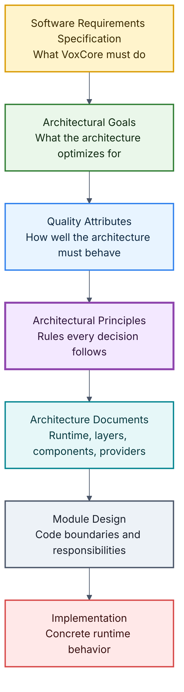
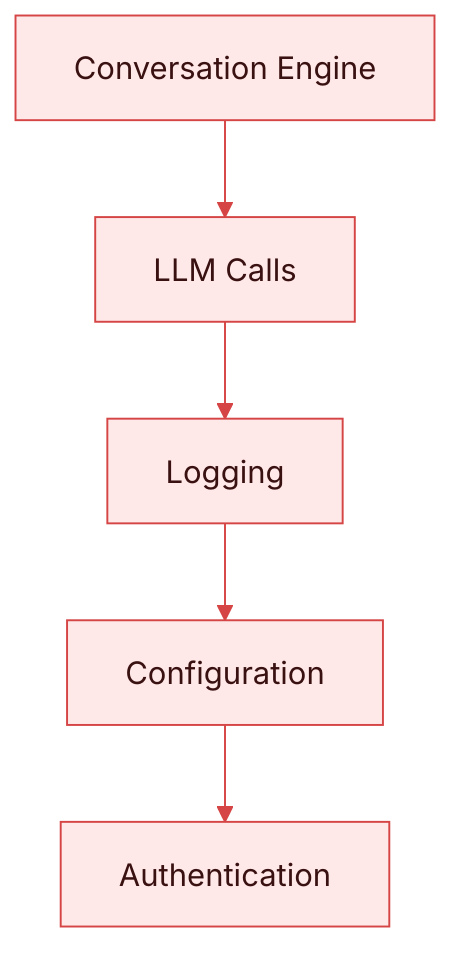
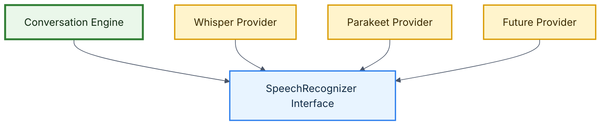
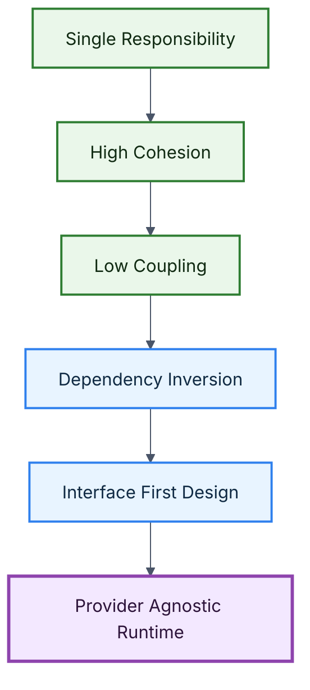

# VoxCore Architectural Principles

This document defines the architectural principles that govern the design and evolution of VoxCore.

Unlike architectural goals, which describe the engineering outcomes the project seeks to achieve, architectural principles define the mandatory engineering rules that guide architecture, module design, and implementation decisions.

These principles establish consistency across the project and ensure that contributors follow a common design philosophy.

Whenever multiple implementation approaches are possible, the solution that best aligns with these principles should be preferred.

---

## Purpose

The purpose of this document is to answer one architecture question:

> Which engineering rules must every VoxCore design decision follow?

Architectural principles convert the project's goals and quality attributes into decision rules. They protect the runtime from architectural drift as modules, providers, APIs, SDKs, tools, memory, observability, and deployment options evolve.

No module, component, interface, or implementation should violate these principles without a documented Architecture Decision Record.

---

## Scope

This document covers:

- The mandatory architectural principles for VoxCore.
- The reason each principle exists.
- Examples of how the principles guide design decisions.
- Relationships between principles.
- How principles are enforced during review.
- Traceability between principles and quality attributes.

This document intentionally does not define:

- Source code package names
- Class or function signatures
- Provider-specific adapter logic
- Framework configuration
- API payload schemas
- Deployment infrastructure
- Test case implementation

Those details belong in later architecture, design, API, implementation, testing, and deployment documents.

---

## Relationship With Other Documents

This document builds upon:

| Document | Relationship |
| --- | --- |
| [Software Requirements Specification](../01-software-requirements-specification.md) | Defines what VoxCore must provide and which non-functional requirements must be satisfied. |
| [Architectural Goals](01-architectural-goals.md) | Defines the engineering outcomes the architecture optimizes for. |
| [Quality Attributes](02-quality-attributes.md) | Defines the measurable qualities that the architecture must preserve. |

This document influences every subsequent architecture and design document.

---

## Why Architectural Principles Exist

Without common engineering principles, different contributors naturally make different design decisions.

Over time this can lead to:

- Inconsistent module boundaries
- Tightly coupled components
- Duplicated responsibilities
- Difficult testing
- Unpredictable behavior
- Hidden dependencies
- Provider lock-in
- Architectural drift

Architectural principles provide a shared engineering language that keeps VoxCore coherent as it evolves.

---

## Design Drivers

The principles in this document are driven by the following architecture needs:

| Driver | Architectural Meaning |
| --- | --- |
| Runtime clarity | Each component should have an obvious purpose and owner. |
| Provider replacement | STT, LLM, TTS, memory, embedding, and tool capabilities should remain interchangeable. |
| Real-time interaction | Runtime design should support streaming and low perceived latency. |
| Contributor safety | New contributors should be able to change one area without accidentally breaking unrelated areas. |
| Test confidence | Business logic should be testable without live providers or framework infrastructure. |
| Long-term evolution | The architecture should support future features without repeated structural rewrites. |

These drivers are reflected in the principles below.

---

## Architectural Principles

VoxCore defines fourteen architectural principles.

These principles should be treated as non-negotiable engineering rules unless an exception is explicitly documented through an Architecture Decision Record.

### Principle 1: Single Responsibility

Every module, package, and component shall own one primary responsibility.

A responsibility represents a single reason for change. Components should not combine unrelated concerns such as conversation orchestration, provider implementation, logging configuration, authentication, and transport handling.

**Design rule:** If a module has multiple unrelated reasons to change, split the responsibilities.

**Good examples:**

- Speech Recognition
- Conversation Engine
- Tool Engine
- Memory Manager
- Provider Registry

**Bad example:**

The example above combines orchestration, provider calls, logging, configuration, and authentication in one responsibility chain. That design should be split into clearer module boundaries.

### Principle 2: High Cohesion

Responsibilities that naturally belong together should remain within the same module.

Modules should expose complete capabilities rather than fragmented behavior scattered across unrelated packages. A cohesive module is easier to understand, test, document, and maintain.

**Design rule:** Keep related behavior together when it serves one capability and changes for the same reason.

### Principle 3: Low Coupling

Modules should depend on as few other modules as possible.

Dependencies should be explicit, directional, and stable. Changes within one module should have minimal impact on unrelated modules. Communication should occur through well-defined interfaces rather than internal implementation details.

**Design rule:** A module should know what it needs from another module, but not how that module performs its internal work.

### Principle 4: Dependency Inversion

High-level business logic shall not depend directly on low-level implementations.

Instead, high-level modules and low-level implementations should depend on abstractions. This keeps runtime orchestration independent from provider-specific APIs, database drivers, transport frameworks, and concrete infrastructure choices.

**Design rule:** Core runtime logic depends on interfaces; concrete implementations depend on those interfaces.

The Conversation Engine should never reference a concrete provider directly.

### Principle 5: Interface First Design

Every major subsystem shall expose a stable public interface.

Consumers should interact with interfaces, not implementation details. Implementations remain replaceable when interfaces define clear contracts between modules.

**Design rule:** Define the contract before depending on a subsystem's behavior.

### Principle 6: Provider Agnostic Architecture

No architectural decision should assume a specific AI provider.

Speech recognition, language models, speech synthesis, memory, embeddings, and related external capabilities should remain interchangeable. Providers are implementation details rather than architectural dependencies.

**Design rule:** Provider-specific logic belongs behind provider interfaces or adapters.

### Principle 7: Framework Independence

Business logic shall remain independent of frameworks.

Frameworks should adapt external requests into runtime or domain objects. Business logic should not depend directly on FastAPI, WebSocket implementation details, database drivers, SDK internals, or provider SDK-specific transport behavior.

**Design rule:** Framework code belongs at the edge; runtime decisions belong in framework-independent modules.

### Principle 8: Streaming First

Streaming shall be the preferred communication model throughout the runtime.

Whenever feasible:

- Audio should stream.
- Transcription should stream.
- Runtime events should stream.
- Generation should stream.
- Speech synthesis should stream.
- Response audio should stream.

Batch processing should be reserved for workflows that do not require real-time interaction.

**Design rule:** Design the runtime for continuous flow before adding request-response shortcuts.

### Principle 9: Explicit Dependencies

Every dependency should be visible.

Hidden dependencies increase complexity and reduce maintainability. Dependencies should be declared, injected, or constructed at clear composition boundaries rather than created implicitly inside business logic whenever practical.

**Design rule:** A reader should be able to identify a component's dependencies from its interface, constructor, configuration, or composition root.

### Principle 10: Composition Over Inheritance

Behavior should be assembled through composition rather than deep inheritance hierarchies.

Inheritance should only represent genuine "is-a" relationships. Composition provides greater flexibility, simpler testing, easier provider replacement, and clearer dependency ownership.

**Design rule:** Prefer composing small collaborators over extending large base classes.

### Principle 11: Fail Gracefully

Failures should remain localized.

Whenever possible, the runtime should isolate failures, recover automatically, preserve active sessions, and provide meaningful diagnostics. One component failure should not terminate the entire runtime.

**Design rule:** Failure handling should preserve session isolation and produce predictable error behavior.

### Principle 12: Documentation Driven Development

Architecture and module documentation shall be completed before implementation is treated as stable.

Implementation should realize documented design rather than invent architecture during coding. Documentation is considered part of the source code and should evolve with the system.

**Design rule:** If behavior is stable enough to rely on, it should be documented.

### Principle 13: Backward Compatibility

Public interfaces should evolve carefully.

Breaking changes should be minimized. When breaking changes become necessary, they should be documented, versioned, justified, and accompanied by migration guidance.

**Design rule:** Public contracts should change deliberately, not accidentally.

### Principle 14: Developer Experience First

Engineering decisions should optimize not only runtime performance but also developer productivity.

Simple systems are easier to extend, debug, document, operate, and maintain. Developers integrating VoxCore should encounter consistent APIs, useful defaults, clear errors, and practical documentation.

**Design rule:** Prefer designs that make correct usage obvious and incorrect usage diagnosable.

---

## Principle Relationships

The principles reinforce one another. The first several principles create the foundation for provider independence and extensibility.

The later principles support runtime behavior, operational safety, and long-term project usability.

| Principle Group | Reinforces |
| --- | --- |
| Single Responsibility, High Cohesion, Low Coupling | Maintainable module boundaries |
| Dependency Inversion, Interface First Design, Provider Agnostic Architecture | Replaceable providers and extension points |
| Framework Independence, Explicit Dependencies, Composition Over Inheritance | Testable and adaptable business logic |
| Streaming First, Fail Gracefully | Responsive and reliable runtime behavior |
| Documentation Driven Development, Backward Compatibility, Developer Experience First | Sustainable public contracts and contributor productivity |

---

## Principle Enforcement

Architectural principles should be enforced during:

- Architecture reviews
- Pull request reviews
- Module design reviews
- Code reviews
- API and SDK reviews
- Documentation reviews

Any intentional violation should be documented through an Architecture Decision Record that explains:

- Why the exception exists
- Which principles are affected
- Alternatives considered
- Expected consequences
- Future mitigation plan

Principle violations that are not documented should be treated as design issues.

---

## Traceability To Quality Attributes

The following table maps each principle to the quality attributes it primarily supports.

| Principle | Primary Quality Attributes Supported |
| --- | --- |
| Single Responsibility | Maintainability, Testability |
| High Cohesion | Maintainability, Testability, Developer Experience |
| Low Coupling | Maintainability, Extensibility, Testability |
| Dependency Inversion | Extensibility, Testability, Maintainability |
| Interface First Design | Extensibility, Maintainability, Developer Experience |
| Provider Agnostic Architecture | Extensibility, Maintainability, Testability |
| Framework Independence | Maintainability, Testability, Developer Experience |
| Streaming First | Performance, Scalability, Reliability |
| Explicit Dependencies | Maintainability, Testability, Reliability |
| Composition Over Inheritance | Extensibility, Maintainability, Testability |
| Fail Gracefully | Reliability, Observability, Developer Experience |
| Documentation Driven Development | Developer Experience, Maintainability |
| Backward Compatibility | Developer Experience, Reliability, Maintainability |
| Developer Experience First | Developer Experience, Maintainability |

The traceability table should be updated if the quality attributes are revised.

---

## Traceability To Architectural Goals

The following table maps each principle to the architectural goals it most directly supports.

| Principle | Primary Architectural Goals Supported |
| --- | --- |
| Single Responsibility | Modularity, Maintainability |
| High Cohesion | Modularity, Maintainability |
| Low Coupling | Modularity, Extensibility, Maintainability |
| Dependency Inversion | Provider Independence, Extensibility, Testability |
| Interface First Design | Provider Independence, Extensibility, Developer Experience |
| Provider Agnostic Architecture | Provider Independence, Extensibility |
| Framework Independence | Maintainability, Testability |
| Streaming First | Streaming First, Performance, Scalability |
| Explicit Dependencies | Maintainability, Testability, Reliability |
| Composition Over Inheritance | Extensibility, Maintainability |
| Fail Gracefully | Reliability, Observability |
| Documentation Driven Development | Developer Experience, Maintainability |
| Backward Compatibility | Developer Experience, Maintainability |
| Developer Experience First | Developer Experience |

---

## Measuring Success

The following review questions should be used when evaluating architecture, module design, implementation, and documentation changes.

| Principle | Review Question |
| --- | --- |
| Single Responsibility | Does this module have one primary reason to change? |
| High Cohesion | Are related responsibilities kept together behind a clear capability? |
| Low Coupling | Can this module change without forcing unrelated modules to change? |
| Dependency Inversion | Does core logic depend on abstractions instead of concrete infrastructure? |
| Interface First Design | Is there a clear contract for other modules to depend on? |
| Provider Agnostic Architecture | Does the design avoid assuming one provider, model, or vendor? |
| Framework Independence | Can business logic be tested without framework infrastructure? |
| Streaming First | Does the design support continuous flow for real-time voice behavior? |
| Explicit Dependencies | Are dependencies visible and supplied through clear boundaries? |
| Composition Over Inheritance | Is behavior assembled from collaborators instead of deep inheritance? |
| Fail Gracefully | Are failures localized, structured, and recoverable where practical? |
| Documentation Driven Development | Is stable behavior documented before it is relied on? |
| Backward Compatibility | Are public contract changes deliberate, versioned, and documented? |
| Developer Experience First | Is the design understandable and practical for integrators and contributors? |

A design should be reconsidered when it fails the relevant review questions.

---

## Rationale

VoxCore coordinates real-time audio, speech recognition, conversation state, language model interaction, tool execution, memory, speech synthesis, APIs, SDKs, observability, and external providers.

Without strong architectural principles, those concerns can quickly collapse into tightly coupled runtime logic. That would make provider replacement difficult, reduce test confidence, increase latency risks, and make the project harder for contributors to understand.

The principles in this document are intentionally conservative. They favor clear boundaries, explicit contracts, replaceable implementations, and documented behavior over clever shortcuts.

---

## Alternatives Considered

| Alternative | Reason Rejected |
| --- | --- |
| Keep principles informal | Informal principles are easy to ignore during design and code review. |
| Define only SOLID principles | SOLID provides useful guidance, but VoxCore also needs provider independence, streaming-first behavior, documentation discipline, and developer experience rules. |
| Let implementation establish architecture organically | This increases the risk of architectural drift and hidden coupling. |
| Make every subsystem plugin-based immediately | This could over-abstract early runtime behavior before the core responsibilities stabilize. |
| Optimize only for runtime performance | Voice performance matters, but maintainability, extensibility, reliability, and developer experience are also required for a reusable runtime. |

---

## Consequences

The architectural principles in this document create the following expectations:

- Modules should have clear ownership and one primary reason to change.
- Runtime orchestration should depend on abstractions, not concrete providers.
- Provider-specific logic should remain behind adapters or interfaces.
- Framework code should stay near the system boundary.
- Streaming should be considered the default runtime communication model.
- Dependencies should be explicit and reviewable.
- Composition should be preferred over deep inheritance.
- Recoverable failures should remain localized.
- Stable public behavior should be documented.
- Breaking public interface changes should be rare, versioned, and explained.
- Developer-facing APIs, SDKs, configuration, and errors should remain predictable.
- Intentional exceptions should be documented through ADRs.

These consequences should be treated as design review criteria as VoxCore evolves.

---

## Related Documents

| Document | Relationship |
| --- | --- |
| [System Architecture README](README.md) | Defines the structure and reading order for architecture documentation. |
| [Software Requirements Specification](../01-software-requirements-specification.md) | Defines the requirements these principles help satisfy. |
| [Architectural Goals](01-architectural-goals.md) | Defines the outcomes these principles support. |
| [Quality Attributes](02-quality-attributes.md) | Defines the measurable qualities these principles preserve. |
| [Layered Architecture](04-layered-architecture.md) | Will apply these principles to runtime layers and dependency direction. |
| [Runtime Architecture](05-runtime-architecture.md) | Will apply these principles to session and streaming execution. |
| [Provider Architecture](07-provider-architecture.md) | Will apply provider agnostic, dependency inversion, and interface first principles. |
| [Dependency Rules](13-dependency-rules.md) | Will define concrete dependency constraints for modules. |
| [Extension Points](19-extension-points.md) | Will explain how extensibility is exposed safely. |

---

## Conclusion

The architectural principles defined in this document represent the non-negotiable engineering rules that govern the evolution of VoxCore.

Every architectural decision, module design, implementation, and future contribution should remain consistent with these principles. Where exceptions are necessary, they should be explicit, documented, and justified through an Architecture Decision Record.
