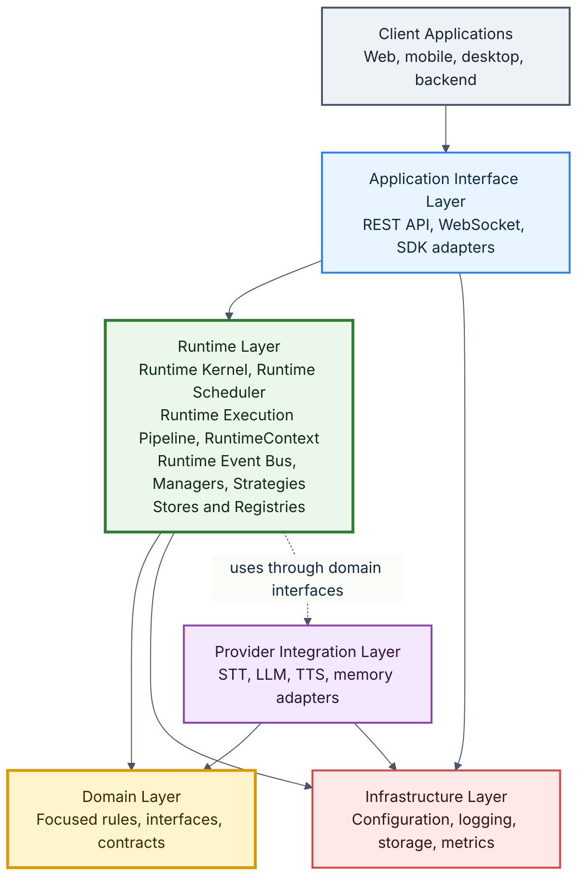
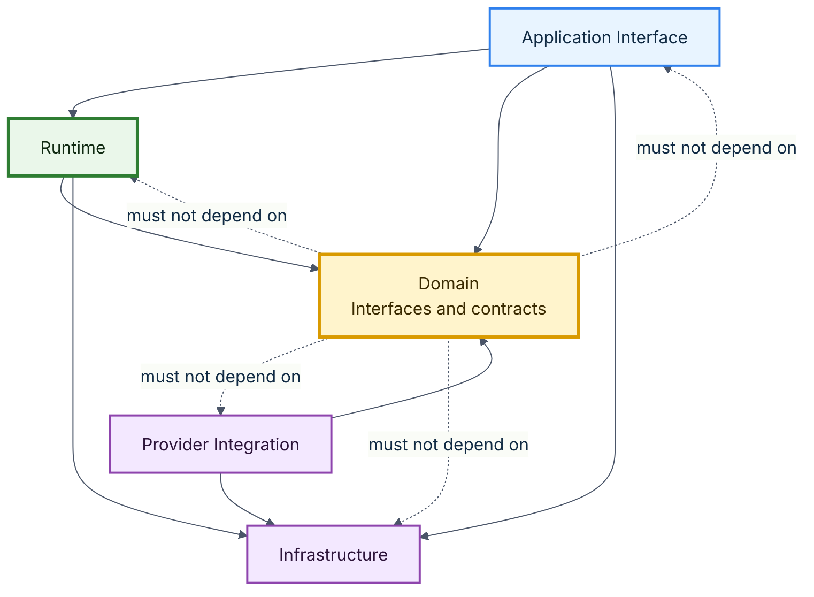
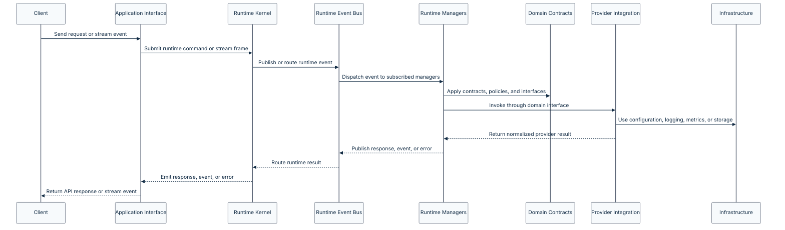

# VoxCore Layered Architecture

This document defines the logical layering of the VoxCore runtime.

The purpose of the layered architecture is to establish clear boundaries between different categories of responsibilities within the system.

Layering improves maintainability, reduces coupling, simplifies testing, and enables individual parts of the runtime to evolve independently.

This document defines the responsibilities of each architectural layer, the permitted communication paths between layers, and the dependency rules that every implementation must follow.

It does not describe individual runtime components. Component responsibilities are documented separately in the [Component Architecture](06-component-architecture.md) document.

---

## Purpose

The purpose of this document is to answer one architecture question:

> How is the VoxCore runtime divided into logical layers?

The layered architecture provides the structural foundation for runtime design. It defines where different responsibilities belong and how source-code dependencies should flow between those responsibilities.

Every runtime component introduced later should belong to exactly one internal architectural layer.

---

## Scope

This document covers:

- The logical layers of the VoxCore runtime.
- The responsibility of each layer.
- What each layer may and may not contain.
- Allowed communication and dependency paths.
- Constraints that prevent architectural drift.
- Traceability between SRS requirements and the layered architecture.

This document intentionally does not define:

- Concrete module names
- Class or function signatures
- Runtime component internals
- API payload schemas
- Provider adapter implementation details
- Deployment topology
- Physical process boundaries
- Package manager or build configuration

Those details belong in later architecture, design, API, implementation, and deployment documents.

---

## Relationship With Other Documents

This document builds upon:

| Document | Relationship |
| --- | --- |
| [Software Requirements Specification](../01-software-requirements-specification.md) | Defines the functional and non-functional requirements the layered architecture must support. |
| [Architectural Goals](01-architectural-goals.md) | Defines the outcomes the layered architecture optimizes for. |
| [Quality Attributes](02-quality-attributes.md) | Defines the maintainability, extensibility, performance, reliability, testability, observability, scalability, and developer experience expectations. |
| [Architectural Principles](03-architectural-principles.md) | Defines the rules that layering must enforce, especially single responsibility, low coupling, dependency inversion, interface first design, framework independence, and explicit dependencies. |

This document directly influences:

| Document | Relationship |
| --- | --- |
| [Runtime Architecture](05-runtime-architecture.md) | Will explain how runtime execution operates within these layer boundaries. |
| [Component Architecture](06-component-architecture.md) | Will assign concrete runtime components to these layers. |
| [Communication Architecture](07-communication-architecture.md) | Will explain event flow and runtime communication across these layers. |
| [Infrastructure Architecture](08-infrastructure-architecture.md) | Will explain cross-cutting infrastructure concerns within these boundaries. |

---

## Why Layered Architecture Exists

VoxCore is expected to grow over time.

Future versions may include:

- Multiple AI providers
- Plugin systems
- Distributed execution
- New SDKs
- Additional transports
- Persistent memory
- Monitoring infrastructure
- More deployment options

Without architectural layers, unrelated responsibilities gradually become intertwined. This increases maintenance cost, reduces extensibility, makes testing harder, and encourages provider or framework details to leak into core runtime behavior.

Layering provides predictable responsibility boundaries and prevents architectural drift.

---

## Design Drivers

The layered architecture has five primary objectives:

| Objective | Architectural Meaning |
| --- | --- |
| Separate business logic from infrastructure | Core behavior should not depend on frameworks, storage, transports, or provider SDKs. |
| Prevent framework leakage | HTTP, WebSocket, and SDK concerns should stay near the application interface boundary. |
| Minimize coupling | Modules should depend on stable contracts rather than concrete implementation details. |
| Enable independent testing | Runtime and domain behavior should be testable without live providers or framework infrastructure. |
| Support replaceable infrastructure | Providers, storage, logging, metrics, and transports should evolve without changing core behavior. |

These objectives apply to every layer.

---

## Layer Overview

The VoxCore runtime is divided into five internal logical layers, with client applications outside the runtime boundary.

This diagram represents logical architecture rather than deployment architecture.

Layers are not required to become separate processes, services, packages, or repositories. Physical boundaries may evolve later, but logical responsibilities should remain clear from the beginning.

---

## Runtime Position

Although the Runtime Layer contains the execution engine of VoxCore, the Layered Architecture intentionally does not describe how runtime execution occurs.

Runtime execution is documented separately in the [Runtime Architecture](05-runtime-architecture.md) and [Runtime Execution Pipeline](11-runtime-execution-pipeline.md).

This document defines where the Runtime Layer belongs in the static structure of VoxCore.

The Runtime Architecture defines how the Runtime Layer behaves during initialization, pipeline execution, scheduling, event routing, session execution, provider interaction, tool execution, memory coordination, streaming, cancellation, and shutdown.

---

## Layer 1: Application Interface Layer

The Application Interface Layer acts as the entry point into the runtime.

It converts external communication into internal requests understood by the runtime. It may expose HTTP endpoints, WebSocket endpoints, SDK-facing adapters, and future transport adapters.

This layer contains no business logic.

**Examples:**

- REST endpoints
- WebSocket endpoints
- Python SDK adapters
- TypeScript SDK adapters
- Request and response transport mapping

**Responsibilities:**

- Receive external requests
- Validate transport-level input
- Authenticate and authorize requests when security features are introduced
- Convert transport objects into runtime or domain objects
- Return structured responses and events
- Translate runtime errors into API or SDK error formats

**Must not:**

- Contain conversation logic
- Call providers directly
- Maintain business state
- Implement tool execution logic
- Embed provider-specific behavior

---

## Layer 2: Runtime Layer

The Runtime Layer represents the execution engine of VoxCore.

It owns the Runtime Kernel, Runtime Scheduler, Runtime Execution Pipeline, RuntimeContext model, Runtime Event Bus, Runtime Managers, Runtime Strategies, Stores, and Registries.

Every conversational session executes inside the Runtime Layer through a pipeline-driven execution model supported by meaningful runtime events.

This layer contains runtime coordination behavior, not provider-specific implementation details or application-specific business logic.

**Examples:**

- Runtime Kernel
- Runtime Scheduler
- Runtime Execution Pipeline
- RuntimeContext
- Runtime Event Bus
- Runtime Managers
- Runtime Strategies
- Stores and Registries
- Session Manager
- Conversation Manager
- Audio Manager
- Memory Manager
- Provider Manager
- Plugin Manager
- Tool Manager

**Responsibilities:**

- Manage runtime lifecycle
- Schedule runtime work
- Execute conversational turns through the Runtime Execution Pipeline
- Route runtime events
- Coordinate runtime managers
- Manage session lifecycle
- Maintain session isolation
- Use Stores and Registries for active runtime state
- Invoke providers through domain-defined interfaces
- Coordinate streaming flow through runtime events
- Localize recoverable runtime failures

**Must not:**

- Depend on concrete provider implementations
- Contain provider-specific API logic
- Depend directly on HTTP or WebSocket frameworks
- Own long-term persistence details
- Mix unrelated infrastructure concerns into runtime orchestration

---

## Layer 3: Domain Layer

The Domain Layer represents the core business rules and contracts of VoxCore.

This layer defines the concepts that other layers depend on: domain models, interfaces, policies, contracts, validation rules, and provider capability expectations.

The Domain Layer is framework-independent. It should be possible to execute and test this layer without FastAPI, WebSocket infrastructure, provider SDKs, database drivers, or live AI providers.

**Examples:**

- Session domain concepts
- Conversation domain concepts
- Provider interfaces
- Tool contracts
- Memory contracts
- Runtime event contracts
- Domain validation rules

**Responsibilities:**

- Define interfaces
- Define domain objects
- Define contracts
- Define runtime policies
- Define invariants and validation that are independent of frameworks

**Must not:**

- Import infrastructure implementations
- Access external providers
- Know about HTTP routes
- Know about WebSocket frames
- Depend on provider SDKs
- Depend on database drivers

---

## Layer 4: Provider Integration Layer

The Provider Integration Layer implements domain interfaces using concrete providers.

Each provider implementation adapts a specific external technology into the contracts defined by the Domain Layer. Provider details should remain contained in this layer.

**Examples:**

- Speech recognition providers
- Language model providers
- Speech synthesis providers
- Memory providers
- Embedding providers
- Provider-specific request and response translators

**Responsibilities:**

- Implement provider interfaces defined by the Domain Layer
- Translate domain requests into provider-specific requests
- Translate provider responses into domain results
- Handle provider-specific configuration
- Normalize provider errors into runtime-understandable failures
- Encapsulate provider SDK behavior

**Must not:**

- Contain business rules
- Communicate with other providers directly unless explicitly required by a documented provider composition design
- Know about HTTP API routes or SDK surface design
- Own session lifecycle decisions
- Expose provider-specific objects to the Runtime Layer

---

## Layer 5: Infrastructure Layer

The Infrastructure Layer provides technical capabilities required by the runtime.

Infrastructure supports the runtime but does not define business behavior. It should be used through clear boundaries so core logic remains testable and replaceable.

**Examples:**

- Configuration loading
- Logging
- Metrics
- Tracing
- Persistence
- Caching
- Serialization
- Filesystem access
- Dependency composition
- Shared technical utilities

**Responsibilities:**

- Load configuration
- Provide logging and metrics mechanisms
- Provide persistence mechanisms
- Provide serialization helpers
- Provide technical adapters for external resources
- Support dependency wiring at composition boundaries

**Must not:**

- Own business rules
- Own conversation behavior
- Own provider contracts
- Require the Domain Layer to import infrastructure code
- Become a dumping ground for unrelated business behavior

---

## Dependency Rules

Layering only works when dependency direction is enforced.

The most important rule is that business and domain behavior must not depend on frameworks, concrete providers, storage mechanisms, or transport details.

### Rule 1: Domain Independence

The Domain Layer shall not depend on any other layer.

Domain contracts and business rules should be independent of transport frameworks, provider SDKs, storage systems, logging implementations, and deployment infrastructure.

### Rule 2: Runtime Uses Domain Contracts

The Runtime Layer shall coordinate behavior through Domain Layer contracts.

Runtime orchestration may depend on domain interfaces and domain objects, but it should not depend on concrete provider implementations.

### Rule 3: Providers Implement Domain Interfaces

Provider implementations shall depend on domain-defined interfaces and contracts.

Providers adapt external systems into domain-compatible behavior. They should not change the domain model to match one provider's API.

### Rule 4: Application Interfaces Do Not Call Providers Directly

Application Interface code shall not communicate directly with Provider Integration code.

All client-facing operations should pass through the Runtime Layer so lifecycle, session isolation, error handling, and observability remain consistent.

### Rule 5: Infrastructure Does Not Own Business Behavior

Infrastructure may provide technical capabilities, but it shall not own conversation behavior, session policy, provider contracts, or tool execution rules.

Business decisions belong in the Runtime or Domain layers.

### Rule 6: Cross-Layer Shortcuts Are Prohibited

Modules should not bypass their layer boundaries for convenience.

Shortcuts such as an API handler calling a TTS provider directly, a provider adapter mutating session state, or a domain object reading environment variables should be treated as architectural violations.

---

## Communication Flow

Normal execution follows a controlled flow from clients into the runtime and back.

This flow should remain consistent throughout the runtime.

Some infrastructure interactions may occur from Application Interface, Runtime, or Provider Integration code, but infrastructure should remain technical support rather than the owner of business decisions.

---

## Layer Assignment Rules

Every future runtime module should be assigned to exactly one primary layer.

| Module Concern | Expected Layer |
| --- | --- |
| REST endpoint handlers | Application Interface |
| WebSocket connection adapters | Application Interface |
| SDK transport adapters | Application Interface |
| Runtime Kernel | Runtime |
| Runtime Event Bus | Runtime |
| Session Manager | Runtime |
| Conversation Manager | Runtime |
| Audio Manager | Runtime |
| Memory Manager | Runtime |
| Provider Manager | Runtime |
| Plugin Manager | Runtime |
| Tool Manager | Runtime |
| Domain models and contracts | Domain |
| Provider interfaces | Domain |
| Runtime policies and invariants | Domain |
| STT provider adapter | Provider Integration |
| LLM provider adapter | Provider Integration |
| TTS provider adapter | Provider Integration |
| Memory provider adapter | Provider Integration |
| Configuration loader | Infrastructure |
| Logging and metrics implementation | Infrastructure |
| Persistence adapter | Infrastructure |

If a module appears to belong to multiple layers, it should usually be split.

---

## Benefits Of This Architecture

The layered architecture provides:

- Clear responsibilities
- Explicit dependencies
- Provider independence
- Framework independence
- Improved maintainability
- Improved testability
- Easier debugging
- Simpler onboarding
- Safer future extension
- More predictable code review

These benefits depend on consistently enforcing the layer boundaries.

---

## Architectural Constraints

The following constraints apply to future architecture and implementation work:

- Every runtime module must belong to exactly one primary architectural layer.
- No module should violate dependency direction.
- Cross-layer shortcuts are prohibited.
- Business logic must not migrate into infrastructure.
- Framework-specific code must remain isolated.
- Provider-specific objects must not leak into runtime or domain APIs.
- Domain contracts should remain stable enough for multiple provider implementations.
- Runtime orchestration should remain provider-agnostic.
- Layer violations should be fixed or documented through an Architecture Decision Record.

---

## Traceability To SRS Requirements

The following table maps SRS requirement areas to the layer decisions that help satisfy them.

| SRS Requirement Area | Related Requirements | Addressed By |
| --- | --- | --- |
| Session management | FR-001 to FR-003 | Runtime Layer session coordination and Domain Layer session contracts |
| Audio processing | FR-004 to FR-006 | Application Interface streaming adapters and Runtime Layer audio flow coordination |
| Speech recognition | FR-007 to FR-009, EI-006 | Domain provider interfaces and Provider Integration adapters |
| Conversation management | FR-010 to FR-012 | Runtime Layer orchestration and Domain Layer conversation contracts |
| Language model integration | FR-013 to FR-015, EI-007 | Domain provider interfaces and Provider Integration adapters |
| Tool execution | FR-016 to FR-018, EI-009, EI-010 | Runtime Layer tool coordination and Domain Layer tool contracts |
| Memory | FR-019 to FR-020 | Domain memory contracts, Runtime Layer coordination, and Provider Integration memory adapters |
| Speech synthesis | FR-021 to FR-023, EI-008 | Domain provider interfaces and Provider Integration adapters |
| APIs | FR-024 to FR-026, EI-001 to EI-003 | Application Interface Layer |
| SDKs | FR-027 to FR-029, EI-004, EI-005 | Application Interface Layer and documented runtime contracts |
| Extensibility | FR-030 to FR-032 | Domain contracts, Provider Integration Layer, and dependency inversion |
| Performance | NFR-001, NFR-002 | Runtime Layer streaming orchestration |
| Reliability | NFR-003, NFR-004, NFR-017 | Runtime Layer error boundaries and session isolation |
| Scalability | NFR-005, NFR-006 | Isolated runtime sessions and replaceable infrastructure |
| Maintainability | NFR-007 to NFR-009 | Layer separation and explicit dependency rules |
| Modularity and extensibility | NFR-010, NFR-011 | Domain interfaces and Provider Integration adapters |
| Observability | NFR-013, NFR-014, NFR-018 | Infrastructure Layer logging, metrics, tracing, and safe redaction support |
| Testability | NFR-015, NFR-016 | Domain independence and runtime dependency injection |
| Documentation | NFR-019, NFR-020 | Documented layer responsibilities and related architecture docs |

---

## Measuring Success

The following review questions should be used when evaluating architecture, module design, and implementation work.

| Concern | Review Question |
| --- | --- |
| Layer ownership | Does each module have one clear primary layer? |
| Domain independence | Can the Domain Layer be tested without frameworks, providers, storage, or network calls? |
| Runtime orchestration | Does runtime logic coordinate through interfaces instead of concrete providers? |
| Provider isolation | Are provider-specific details contained inside provider adapters? |
| Framework isolation | Are REST, WebSocket, and SDK details kept near the application interface boundary? |
| Infrastructure boundary | Does infrastructure provide technical support without owning business behavior? |
| Dependency direction | Are imports and calls consistent with the permitted dependency rules? |
| Testability | Can core behavior be exercised with fakes or mocks? |

A design should be reconsidered when it cannot answer these questions clearly.

---

## Rationale

The layered architecture follows the architectural principles defined earlier in this documentation set.

Single responsibility and high cohesion require clear ownership boundaries. Low coupling, dependency inversion, and interface first design require stable contracts between layers. Provider agnostic architecture requires provider-specific behavior to remain outside core runtime logic. Framework independence requires HTTP, WebSocket, SDK, storage, and provider SDK details to stay at the edges.

The selected layering gives VoxCore a stable structure for future runtime, provider, component, dependency, and module design work.

---

## Alternatives Considered

| Alternative | Reason Rejected |
| --- | --- |
| Single monolithic runtime layer | Simpler at first, but would mix transports, orchestration, domain contracts, providers, and infrastructure. |
| Provider-first architecture | Would make early provider integration easier but risk provider lock-in and weaker runtime abstractions. |
| Framework-first architecture | Would speed up API implementation but leak framework behavior into core runtime logic. |
| Microservice-first architecture | Would add operational complexity before the logical boundaries and workload patterns are stable. |
| Plugin-first architecture for every layer | Would maximize flexibility but add unnecessary abstraction before core responsibilities are proven. |

---

## Consequences

The layered architecture creates the following expectations:

- Runtime components must be assigned to clear layers.
- Domain contracts should be designed before concrete provider adapters depend on them.
- Application interface code should remain thin.
- Runtime orchestration should remain provider-agnostic.
- Provider adapters should normalize provider-specific behavior.
- Infrastructure should support the runtime without owning business behavior.
- Tests should target Domain and Runtime behavior without requiring live external systems.
- Future architecture documents should preserve these boundaries.
- Intentional layer violations should be documented through ADRs.

These consequences should be treated as review criteria as VoxCore evolves.

---

## Related Documents

| Document | Relationship |
| --- | --- |
| [System Architecture README](README.md) | Defines the structure and reading order for architecture documentation. |
| [Software Requirements Specification](../01-software-requirements-specification.md) | Defines the requirements this architecture must satisfy. |
| [Architectural Goals](01-architectural-goals.md) | Defines the goals supported by layer separation. |
| [Quality Attributes](02-quality-attributes.md) | Defines the quality attributes supported by layered boundaries. |
| [Architectural Principles](03-architectural-principles.md) | Defines the principles enforced by layered architecture. |
| [Runtime Architecture](05-runtime-architecture.md) | Will explain runtime execution within these layer boundaries. |
| [Component Architecture](06-component-architecture.md) | Will assign concrete components to layers. |
| [Communication Architecture](07-communication-architecture.md) | Will describe event flow and component collaboration in detail. |
| [Infrastructure Architecture](08-infrastructure-architecture.md) | Will describe infrastructure services and cross-cutting concerns in detail. |

---

## Conclusion

The layered architecture establishes the structural foundation of VoxCore.

By separating responsibilities into clearly defined layers with explicit dependency rules, the architecture promotes maintainability, extensibility, testability, provider independence, and framework independence while ensuring that future growth does not compromise the integrity of the runtime.
