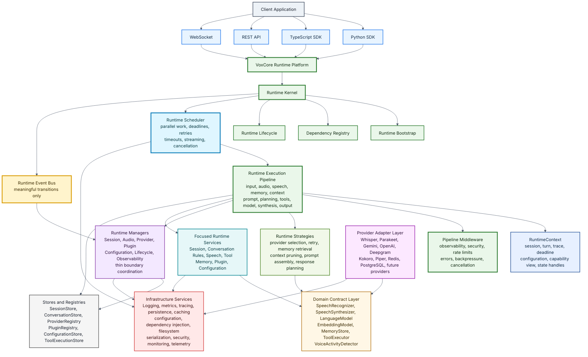
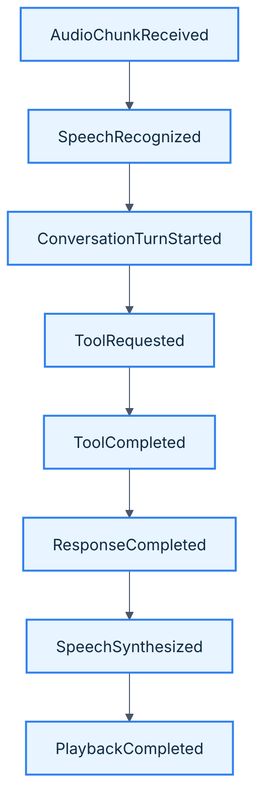
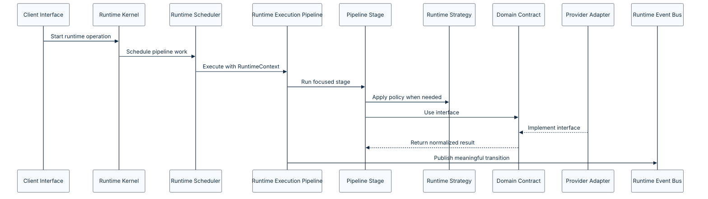
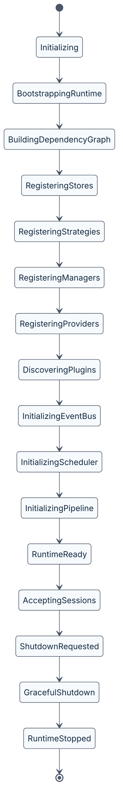

# VoxCore Runtime Architecture

This document defines the runtime architecture of VoxCore.

The runtime architecture describes how VoxCore executes real-time conversational sessions through the Runtime Kernel, Runtime Execution Pipeline, RuntimeContext, Runtime Scheduler, Runtime Event Bus, focused runtime components, domain contracts, provider adapters, and infrastructure services.

Unlike the [Layered Architecture](04-layered-architecture.md), which defines where responsibilities live, the Runtime Architecture defines how work flows at runtime.

This document establishes the execution blueprint for the runtime platform. Every runtime component, module, and implementation should conform to the execution model described here.

---

## Purpose

The purpose of this document is to answer one architecture question:

> How does VoxCore execute real-time conversational sessions as a runtime platform?

VoxCore should not behave like a thin AI backend wrapped around provider APIs, and it should not behave like a traditional service-oriented backend with renamed controllers and services. It should behave like infrastructure for conversations: the runtime owns execution, the pipeline executes conversational turns, RuntimeContext carries execution-scoped metadata, strategies define interchangeable policy, stores and registries own state, contracts define interfaces, adapters connect external systems, and infrastructure supports execution.

This document defines that runtime platform model.

---

## Scope

This document covers:

- The runtime platform philosophy.
- The high-level runtime execution model.
- The Runtime Kernel.
- The Runtime Execution Pipeline.
- RuntimeContext.
- The Runtime Scheduler.
- The Runtime Event Bus.
- Runtime Managers.
- Focused Runtime Services.
- Runtime Strategies.
- Stores and Registries.
- Capability model.
- Event semantics.
- Synchronous, asynchronous, streaming, and scheduled execution boundaries.
- Domain contracts.
- Provider adapters.
- Infrastructure services.
- Runtime communication rules.
- Runtime state ownership.
- Runtime lifecycle expectations.
- Runtime extension rules.
- Traceability between SRS requirements and runtime architecture decisions.

This document intentionally does not define:

- Source code package names
- Concrete class names
- Function signatures
- Event payload schemas
- API endpoint schemas
- SDK method design
- Provider SDK implementation details
- Database schemas
- Deployment topology

Those details belong in component architecture, provider architecture, API specification, module design, implementation, and deployment documents.

---

## Relationship With Other Documents

This document builds upon:

| Document | Relationship |
| --- | --- |
| [Software Requirements Specification](../01-software-requirements-specification.md) | Defines the functional and non-functional requirements the runtime must satisfy. |
| [Architectural Goals](01-architectural-goals.md) | Defines the outcomes the runtime execution model optimizes for. |
| [Quality Attributes](02-quality-attributes.md) | Defines the qualities the runtime must preserve during execution. |
| [Architectural Principles](03-architectural-principles.md) | Defines the engineering rules that constrain runtime design. |
| [Layered Architecture](04-layered-architecture.md) | Defines the static layer boundaries that contain runtime behavior. |

This document directly influences:

| Document | Relationship |
| --- | --- |
| [Component Architecture](06-component-architecture.md) | Defines concrete runtime component categories and ownership boundaries. |
| [Communication Architecture](07-communication-architecture.md) | Will define event flow and runtime communication in detail. |
| [Infrastructure Architecture](08-infrastructure-architecture.md) | Will define cross-cutting infrastructure concerns in detail. |
| [Deployment Architecture](09-deployment-architecture.md) | Will define deployment topology and runtime hosting concerns. |
| [Extension Points](10-extension-points.md) | Will define runtime extension mechanisms in detail. |

The Runtime Architecture serves as the execution contract for future implementation work.

---

## Runtime Philosophy

The runtime is the operating environment for every conversation.

Everything else exists to support the runtime:

- Not the web framework
- Not the WebSocket transport
- Not a single speech recognition provider
- Not a single language model provider
- Not a single speech synthesis provider

The runtime owns conversational execution.

This philosophy keeps VoxCore from becoming a provider-specific backend. It makes VoxCore a platform that can host many providers, tools, memory implementations, plugins, SDKs, and application domains while preserving one coherent execution model.

---

## Runtime Platform Overview

VoxCore Runtime Architecture v1.1 is organized around the following execution structure.



This diagram represents logical runtime architecture, not physical deployment topology.

---

## Runtime Kernel

The Runtime Kernel owns the lifetime of the runtime.

It is responsible for bringing VoxCore from stopped state to ready state, maintaining runtime health, and coordinating shutdown. It is analogous to a kernel in the sense that it owns lifecycle and coordination, but it does not implement application or conversation business logic.

**Responsibilities:**

- Startup
- Shutdown
- Runtime bootstrap
- Manager registration
- Service registration
- Provider registration
- Plugin discovery
- Dependency graph initialization
- Runtime lifecycle transitions
- Runtime health status

**Must not:**

- Build prompts
- Execute tools
- Call AI providers directly
- Maintain conversation history
- Implement speech, memory, or tool business rules

The Runtime Kernel should remain small, deterministic, and easy to reason about.

---

## Runtime Event Bus

The Runtime Event Bus is the communication backbone of the runtime.

The Event Bus is used for meaningful runtime transitions, not for every internal method call. VoxCore is event-driven at runtime boundaries and state transitions; it is not event-only inside every pipeline stage.

The Event Bus is responsible for:

- Event publishing
- Event subscription
- Event routing
- Event fan-out
- Event ordering expectations
- Event correlation metadata
- Runtime-wide notifications
- Safe event propagation for observability

A typical event progression may look like:



Events should represent facts other components may need to observe, react to, trace, or persist. Internal helper activity remains inside pipeline stages, services, strategies, or middleware.

Good runtime events include:

- `SessionStarted`
- `SpeechRecognized`
- `ConversationTurnStarted`
- `ToolCompleted`
- `ResponseCompleted`
- `ProviderFailed`
- `PluginLoaded`
- `PipelineCancelled`
- `PipelineFailed`

Poor runtime events include:

- `PromptBuilderCalled`
- `MemoryListFiltered`
- `ProviderRequestObjectCreated`
- `ContextArrayAppended`
- `LoggerInvoked`

Every component subscribes only to the events it needs.

---

### Event Ownership

Runtime events should be published by the component that owns the state transition.

Typical ownership includes:

| Event Category | Primary Publisher |
|----------------|-------------------|
| Runtime lifecycle events | Runtime Kernel |
| Pipeline execution events | Runtime Execution Pipeline |
| Session boundary events | Session Manager |
| Conversation boundary events | Conversation Manager |
| Tool completion events | Tool Execution Stage |
| Provider lifecycle events | Provider Manager |
| Plugin lifecycle events | Plugin Manager |

Execution events should originate from the Runtime Execution Pipeline rather than Managers whenever the Pipeline owns the execution state.

Managers primarily publish boundary events rather than internal execution events.

## Runtime Execution Pipeline

The Runtime Execution Pipeline owns conversational turn execution.

Managers do not imperatively orchestrate every speech, memory, model, tool, and synthesis step. Instead, the Runtime Kernel starts pipeline execution, the Runtime Scheduler schedules work, RuntimeContext flows through the pipeline, and focused stages perform the work.

### Pipeline stages:


| Stage | Responsibility |
| --- | --- |
| Input Intake | Normalize input from SDK, REST, or WebSocket interfaces. |
| Audio Ingestion | Accept streamed audio and preserve Session correlation. |
| Voice Activity | Detect speech boundaries. |
| Speech Recognition | Convert audio into transcript data through speech contracts. |
| Conversation Update | Apply transcript or tool results to conversation state. |
| Memory Resolution | Retrieve relevant memory through memory policy. |
| Context Assembly | Assemble conversation, memory, configuration, and tool context. |
| Prompt Assembly | Build model-ready prompt or message data. |
| Response Planning | Decide whether to answer, call tools, clarify, or continue. |
| Tool Resolution | Select and validate tools. |
| Tool Execution | Execute tools through tool contracts. |
| Provider Resolution | Resolve the provider capable of satisfying the requested model behavior. |
| Capability Validation | Verify that the selected provider supports the requested capabilities. |
| Model Invocation | Execute the selected language model through domain contracts. |
| Response Normalization | Convert provider output into runtime response data. |
| Speech Synthesis | Produce output audio when required. |
| Output Delivery | Stream or return final output. |

The Runtime Execution Pipeline described in this section is the authoritative execution model for VoxCore. All runtime components, communication patterns, and future implementations must conform to this execution model.

---

### Pipeline Stage Contract

Every stage in the Runtime Execution Pipeline represents one focused unit of execution.

A stage should:

- Receive the active RuntimeContext.
- Perform one cohesive responsibility.
- Read or update only the state it owns or is explicitly permitted to access.
- Produce a normalized execution result for the next stage.
- Avoid knowledge of unrelated pipeline stages.
- Remain independently testable.

Pipeline stages may invoke strategies, services, contracts, stores, or infrastructure services as required, but they should not coordinate the overall execution flow. Pipeline progression remains the responsibility of the Runtime Execution Pipeline itself.

---

## RuntimeContext

RuntimeContext is the execution-scoped envelope that flows through pipeline stages.

It carries:

- Runtime identifier.
- Session identifier.
- Conversation identifier.
- Turn identifier.
- Trace context.
- Deadline.
- Cancellation token.
- Effective configuration view.
- Capability view.
- State handles.
- Event publisher.
- Logger.

RuntimeContext does not own durable state. It carries references and metadata for the active operation. Mutable state remains in Stores and Registries.

### RuntimeContext Design Rule

RuntimeContext is an execution-scoped context object.

It exists solely to carry information required for the execution of a single conversational turn.

RuntimeContext **must never become a dependency container or service locator**.

Specifically, RuntimeContext must not expose:

- Runtime Managers
- Runtime Services
- Provider Adapters
- Infrastructure Services
- Dependency Injection Containers

Instead, it should expose only execution-scoped metadata, immutable configuration views, lightweight capability views, cancellation primitives, tracing information, and references to the specific state required for the active execution.

Keeping RuntimeContext lightweight preserves clear dependency boundaries and prevents architectural drift over time.

---

## Runtime Scheduler

The Runtime Scheduler owns execution scheduling.

It coordinates:

- Parallel execution.
- Streaming tasks.
- Tool execution.
- Provider streaming.
- Background work.
- Retries.
- Timeouts.
- Deadlines.
- Cancellation.
- Resume after interruption.

The scheduler does not decide conversation policy. It decides when and how executable work runs.

---

## Runtime Managers

Managers coordinate runtime boundaries.

Managers do not implement business logic, and they do not own durable mutable state. A manager coordinates one runtime boundary or subsystem, uses Stores and Registries through explicit interfaces, and may publish or consume meaningful runtime events.

Managers should be thin.

| Manager | Runtime Responsibility |
| --- | --- |
| Session Manager | Coordinates session creation, lookup, access, isolation, and closure through SessionStore. |
| Conversation Manager | Coordinates conversation boundary events and starts pipeline work; it does not orchestrate every turn step. |
| Audio Manager | Coordinates audio input and output boundaries. |
| Tool Manager | Coordinates tool request, execution, completion, and failure events. |
| Memory Manager | Coordinates memory access boundaries through memory contracts and stores. |
| Provider Manager | Coordinates provider registration, lookup, lifecycle, capability declarations, and provider policies. |
| Plugin Manager | Coordinates plugin discovery, lifecycle, and event subscriptions through PluginRegistry. |
| Configuration Manager | Coordinates runtime configuration availability through ConfigurationStore. |
| Lifecycle Manager | Coordinates runtime lifecycle events and graceful shutdown. |
| Observability Manager | Coordinates runtime metrics, traces, diagnostics, and observable event flow. |

**Manager rule:** Managers coordinate boundaries; the pipeline executes turns.

---

## Focused Runtime Services

Focused Runtime Services contain cohesive runtime business rules.

Services should not become large objects that absorb unrelated policies. A service owns a narrow domain rule set and delegates interchangeable policy to strategies.

| Service | Runtime Responsibility |
| --- | --- |
| Session Service | Implements session rules, session validation, and session invariants. |
| Conversation Service | Implements conversation state rules and conversation invariants only. |
| Speech Service | Implements speech-related runtime behavior independent of concrete STT or TTS providers. |
| Response Service | Implements response normalization and response readiness rules. |
| Tool Service | Implements tool validation and tool result rules. |
| Memory Service | Implements memory scoping and memory validation. |
| Plugin Service | Implements plugin eligibility, activation, and plugin policy. |
| Configuration Service | Implements runtime configuration validation and effective configuration behavior. |

Services depend on domain contracts rather than concrete adapters.

The following responsibilities should be explicit strategy or stage components, not hidden inside large services:

- Prompt assembly.
- Response planning.
- Context pruning.
- Memory retrieval policy.
- Provider selection.
- Capability matching.
- Retry policy.
- Tool selection.

A separate provider decision service is intentionally not part of the core service set. Provider policy belongs to Provider Manager and explicit provider strategies such as ProviderSelectionStrategy, CapabilityMatchingStrategy, and FailoverStrategy.

---

## Runtime Strategies

Runtime Strategies define interchangeable runtime policies.

| Strategy | Purpose |
| --- | --- |
| ProviderSelectionStrategy | Selects a provider for a required capability. |
| CapabilityMatchingStrategy | Matches requested behavior to declared provider capabilities. |
| RetryStrategy | Defines retry limits, backoff, and retry eligibility. |
| MemoryRetrievalStrategy | Retrieves memory for a turn. |
| ContextPruningStrategy | Keeps context inside model and runtime limits. |
| PromptAssemblyStrategy | Produces model-ready prompts or messages. |
| ResponsePlanningStrategy | Decides answer, tool use, clarification, or continuation. |
| ToolSelectionStrategy | Selects eligible tools for a request. |
| FailoverStrategy | Defines fallback behavior after provider failure. |

Strategies prevent managers and services from growing into God Objects.

---

## Stores And Registries

Stores and Registries own mutable runtime state.

Managers and services use them through explicit interfaces. The runtime does not treat managers as durable state owners.

| Store or Registry | Owns |
| --- | --- |
| RuntimeStateStore | Runtime lifecycle state |
| SessionStore | Session state |
| ConversationStore | Conversation state |
| AudioStateStore | Audio state |
| MemoryStore | Memory state |
| ToolExecutionStore | Tool execution state |
| ProviderRegistry | Provider registrations and declared capabilities |
| PluginRegistry | Plugin registrations |
| ConfigurationStore | Runtime configuration |
| ObservabilityStore | Runtime diagnostic state when local ownership is required |

---

## Domain Contracts

Domain Contracts define runtime interfaces.

This is one of the most important parts of the architecture. Runtime logic depends on interfaces, never concrete provider implementations.

Contracts are grouped by abstraction level.

| Contract Group | Examples | Purpose |
| --- | --- | --- |
| Runtime Contracts | `RuntimeEventPublisher`, `RuntimeScheduler`, `RuntimeClock` | Runtime execution interfaces. |
| Speech Contracts | `SpeechRecognizer`, `SpeechSynthesizer`, `VoiceActivityDetector` | Speech and voice behavior. |
| Model Contracts | `LanguageModel`, `EmbeddingModel` | LLM and embedding behavior. |
| Memory Contracts | `MemoryStore`, `ConversationStore` | Memory and conversation persistence interfaces. |
| Tool Contracts | `ToolExecutor`, `ToolRegistry` | Tool execution and lookup interfaces. |
| Provider Contracts | `ProviderRegistry`, `CapabilityDescriptor` | Provider registration and capability declaration. |
| Infrastructure Contracts | `Logger`, `Tracer`, `MetricsSink`, `ConfigurationProvider` | Technical support interfaces. |

Contracts are interfaces only. They should not import provider SDKs or expose provider-native objects.

---

## Provider Adapters

Provider Adapters translate between VoxCore contracts and external systems.

Adapters connect VoxCore to providers and infrastructure-backed capabilities. They do not contain business logic. Their job is translation.

Examples include:

- Whisper Adapter
- Parakeet Adapter
- Gemini Adapter
- OpenAI Adapter
- Deepgram Adapter
- Kokoro Adapter
- Piper Adapter
- Redis Adapter
- PostgreSQL Adapter
- Future provider adapters

Adapters translate:


The runtime should never need to know whether the implementation behind `SpeechRecognizer` is Whisper, Parakeet, or a future provider.

---

## Infrastructure Services

Infrastructure Services provide technical capabilities required by the runtime.

Infrastructure supports the runtime but does not define runtime behavior.

Examples include:

- Logging
- Metrics
- Tracing
- Persistence
- Caching
- Configuration loading
- Dependency injection
- Filesystem access
- Serialization
- Security utilities
- Monitoring
- Telemetry

Infrastructure must not contain conversation rules, provider selection policy, session policy, or tool execution rules.

---

## Runtime Communication Model

Runtime communication uses the correct execution mode for each interaction.



The runtime should avoid direct chains such as:

```text
Conversation calls Memory calls Tool calls Provider
```

That style gradually creates tightly coupled runtime behavior.

The preferred model is:

```text
Kernel -> Scheduler -> Pipeline -> Stage -> Strategy / Contract -> Store -> Meaningful Event
```

The Runtime Event Bus remains central for observable transitions, but pipeline stages may use synchronous in-process calls for local strategy, service, contract, and store interactions.

---

## Runtime Error Flow

Errors are treated as part of normal runtime execution rather than exceptional architectural cases.

Whenever a pipeline stage encounters a recoverable failure, execution should follow a deterministic recovery path.

Typical flow:

```text
Pipeline Stage
        │
        ▼
Failure Detected
        │
        ▼
Recovery Strategy
        │
        ├────────► Retry (optional)
        │
        ▼
Failure Event
        │
        ▼
Observability
        │
        ▼
Pipeline Cleanup
        │
        ▼
Execution Result
```

The Runtime Scheduler owns retry timing.

Recovery Strategies determine retry eligibility.

The Runtime Execution Pipeline owns cleanup.

The Runtime Event Bus publishes observable failure events.

Errors should never leave runtime state in an inconsistent condition.

---

## Runtime State Ownership

Every state category has one owner, and the owner is a Store or Registry.

| State Category | Owner |
| --- | --- |
| Runtime lifecycle state | RuntimeStateStore |
| Session state | SessionStore |
| Conversation state | ConversationStore |
| Audio state | AudioStateStore |
| Memory state | MemoryStore |
| Tool execution state | ToolExecutionStore |
| Provider registrations and capabilities | ProviderRegistry |
| Plugin registrations | PluginRegistry |
| Runtime configuration | ConfigurationStore |
| Local diagnostic state | ObservabilityStore |

One owner per state category is mandatory.

Shared mutable state without a clear owner should be treated as an architecture issue.

---

## Runtime Lifecycle

Every runtime instance follows a deterministic lifecycle owned by the Runtime Kernel.



The runtime should not accept sessions until the required stores, registries, strategies, managers, providers, plugins, infrastructure services, scheduler, pipeline, and event routing are ready.

---

## Session Lifecycle

Every conversation executes inside exactly one Session.

The Session lifecycle is coordinated by the Session Manager, validated by the Session Service, and stored in SessionStore. The Runtime Kernel owns runtime lifecycle, but it does not own individual Session behavior.

```text
SessionCreated
|
SessionStarted
|
SessionActive
|
SessionClosing
|
SessionClosed
```

Session lifecycle expectations:

- Session creation is coordinated by the Session Manager.
- Session policy and validation belong to the Session Service.
- Session state belongs to SessionStore.
- Session state remains isolated from all other Sessions.
- Session-related communication occurs through Runtime Events.
- Session closure should release runtime resources associated with that Session.
- Session failure should remain localized whenever possible.

The Runtime must not store Session-specific conversation data in global runtime state.

---

## Conversation Lifecycle

A Conversation is the evolving conversational state inside a Session.

The Conversation lifecycle is executed by the Runtime Execution Pipeline. The Conversation Manager coordinates conversation boundary events. The Conversation Service enforces conversation rules. ConversationStore owns conversation state.

```text
SpeechRecognized
|
ConversationTurnStarted
|
ToolRequested (optional)
|
ToolCompleted (optional)
|
ResponsePlanningCompleted
|
ResponseCompleted
|
SpeechSynthesized
|
PlaybackCompleted
```

Conversation lifecycle expectations:

- Conversation state belongs to ConversationStore.
- Conversation execution belongs to the Runtime Execution Pipeline.
- Conversation boundary coordination belongs to the Conversation Manager.
- Conversation invariants belong to the Conversation Service.
- Tool behavior is handled through pipeline stages, Tool Service rules, ToolExecutionStore, and `ToolExecutor`.
- Memory behavior is handled through memory pipeline stages, Memory Service rules, MemoryStore, and memory strategies.
- Provider-specific behavior remains behind Domain Contracts and Provider Adapters.
- Conversation events must remain scoped to the active Session.

The Conversation lifecycle should support streaming where provider capability and runtime policy allow it.

---

## Runtime Principles

Every runtime component must follow these rules:

| Rule | Description |
| --- | --- |
| 1 | One owner per responsibility. |
| 2 | One owner per state category. |
| 3 | The Runtime Execution Pipeline owns conversational turn execution. |
| 4 | RuntimeContext flows through pipeline execution. |
| 5 | The Runtime Scheduler owns scheduling, deadlines, retries, streaming, and cancellation. |
| 6 | Managers coordinate boundaries. |
| 7 | Services implement focused business rules. |
| 8 | Strategies own interchangeable runtime policy. |
| 9 | Stores and Registries own mutable state. |
| 10 | Business logic does not live inside managers, providers, or infrastructure. |
| 11 | Events represent meaningful transitions, not every internal method call. |
| 12 | Runtime code depends on interfaces rather than implementations. |
| 13 | The runtime owns conversations; applications configure and interact with conversations through public interfaces. |

These rules should be enforced during architecture review, module design review, and code review.

---

## Runtime Extension Model

Every new feature should usually be implementable by one or more of the following:

- Adding a pipeline stage
- Adding pipeline middleware
- Adding a strategy
- Adding a domain service
- Adding a domain contract
- Adding a provider adapter
- Adding a Store or Registry interface when state ownership is required
- Registering a provider
- Registering a plugin
- Registering a tool
- Subscribing to runtime events
- Publishing approved runtime events

Routine extension should not require modifying unrelated runtime code.

If a new feature requires changing many pipeline stages, managers, services, strategies, adapters, and infrastructure utilities at once, the runtime ownership boundaries should be reviewed before implementation continues.

---

## Runtime Guarantees

The runtime architecture is intended to guarantee:

- Session isolation
- Provider independence
- Deterministic lifecycle management
- Explicit event routing
- Stable manager boundaries
- Business logic isolated in services
- Interface-driven provider integration
- Framework-independent business execution
- Consistent execution flow
- Modular extensibility
- Observable runtime behavior
- Localized recoverable failures

These guarantees depend on enforcing the pipeline model, communication model, state ownership rules, strategy boundaries, and contract-adapter boundaries.

---

## Architectural Decisions

The runtime adopts the following architectural decisions:

| Decision | Reason |
| --- | --- |
| Runtime platform over provider wrapper | Keeps VoxCore provider-agnostic and suitable for many application domains. |
| Runtime Kernel owns lifecycle | Provides one owner for startup, dependency graph initialization, readiness, health, and shutdown. |
| Runtime Execution Pipeline owns turn execution | Keeps conversational execution runtime-oriented rather than manager-driven. |
| RuntimeContext flows through execution | Makes execution metadata, deadlines, cancellation, trace data, and state handles explicit. |
| Runtime Scheduler owns scheduling | Keeps parallel work, streaming, retries, timeouts, deadlines, and cancellation consistent. |
| Runtime Event Bus owns transition publication | Reduces direct coupling and makes meaningful runtime transitions observable. |
| Managers coordinate boundaries | Keeps managers thin, focused, and easier to test. |
| Focused services implement cohesive rules | Keeps domain rules testable and separated from orchestration and infrastructure. |
| Strategies own policy variation | Keeps provider selection, retry behavior, memory retrieval, prompt assembly, and response planning replaceable. |
| Stores and Registries own state | Keeps mutable state explicit and testable. |
| Domain contracts define interfaces | Preserves provider independence and makes fake implementations easy to use in tests. |
| Provider adapters translate only | Keeps external provider APIs from leaking into runtime logic. |
| Infrastructure supports but does not decide | Prevents technical utilities from becoming hidden owners of business rules. |
| One owner per state category | Prevents state leakage, unclear ownership, and cross-session contamination. |

These decisions define the long-term direction of VoxCore runtime execution.

---

## Traceability To Quality Attributes

The following table maps quality attributes to runtime architecture support.

| Quality Attribute | Runtime Architecture Support |
| --- | --- |
| Maintainability | Pipeline stages, focused services, strategies, stores, contracts, adapters, and infrastructure services. |
| Extensibility | Pipeline stages, middleware, strategies, plugin model, provider adapters, and stable domain contracts. |
| Performance | Streaming-first pipeline execution and explicit scheduler ownership. |
| Scalability | Session isolation, scheduler ownership, store boundaries, and explicit state ownership. |
| Reliability | Session isolation, lifecycle management, deadlines, cancellation, and one owner per state category. |
| Testability | Focused stages, services, strategies, stores, and provider behavior hidden behind contracts. |
| Observability | RuntimeContext trace metadata, Event Bus transition metadata, metrics, tracing, and structured diagnostics. |
| Developer Experience | Clear ownership, predictable extension points, explicit capabilities, and provider-agnostic contracts. |

---

## Traceability To SRS Requirements

The following table maps SRS requirement areas to runtime architecture decisions.

| SRS Requirement Area | Related Requirements | Runtime Architecture Decision |
| --- | --- | --- |
| Session management | FR-001 to FR-003 | Session Manager, Session Service, SessionStore, and session isolation |
| Audio processing | FR-004 to FR-006 | Audio pipeline stages, Audio Manager boundary coordination, Speech Service, and streaming support |
| Speech recognition | FR-007 to FR-009, EI-006 | `SpeechRecognizer` contract, Provider Manager, and STT provider adapters |
| Conversation management | FR-010 to FR-012 | Runtime Execution Pipeline, Conversation Manager, Conversation Service, ConversationStore, and conversation state ownership |
| Language model integration | FR-013 to FR-015, EI-007 | `LanguageModel` contract, Provider Manager, provider strategies, capability model, and LLM adapters |
| Tool execution | FR-016 to FR-018, EI-009, EI-010 | Tool pipeline stages, Tool Manager, Tool Service, ToolExecutionStore, `ToolExecutor`, and tool events |
| Memory | FR-019 to FR-020 | Memory pipeline stages, Memory Service, MemoryStore, and memory strategies |
| Speech synthesis | FR-021 to FR-023, EI-008 | `SpeechSynthesizer` contract, Speech Service, and TTS provider adapters |
| APIs | FR-024 to FR-026, EI-001 to EI-003 | Application interface boundary, Runtime Kernel entry, and event translation |
| SDKs | FR-027 to FR-029, EI-004, EI-005 | Stable runtime interfaces and event-based session behavior |
| Extensibility | FR-030 to FR-032 | Pipeline stages, middleware, strategies, Event Bus, Provider Manager, Plugin Manager, Tool Manager, contracts, and adapters |
| Performance | NFR-001, NFR-002 | Streaming-first pipeline execution and scheduler coordination |
| Reliability | NFR-003, NFR-004, NFR-017 | Runtime lifecycle management, session isolation, and localized failures |
| Scalability | NFR-005, NFR-006 | Session isolation, scheduler boundaries, Store and Registry ownership, and explicit state ownership |
| Maintainability | NFR-007 to NFR-009 | Pipeline-stage-strategy-store-contract-adapter separation and explicit runtime responsibilities |
| Modularity and extensibility | NFR-010, NFR-011 | Provider abstraction, event subscribers, tools, plugins, and adapters |
| Observability | NFR-013, NFR-014, NFR-018 | Observability Manager, event metadata, metrics, tracing, and structured runtime notifications |
| Testability | NFR-015, NFR-016 | Focused stages, strategies, services, stores, domain contracts, fake providers, and controlled event tests |
| Documentation | NFR-019, NFR-020 | Documented execution model and related architecture documents |

---

## Measuring Success

The following review questions should be used when evaluating runtime architecture and implementation work.

| Concern | Review Question |
| --- | --- |
| Runtime ownership | Does every runtime behavior belong to a clear pipeline stage, manager, service, strategy, store, contract, adapter, or infrastructure service? |
| Pipeline ownership | Does conversational turn execution flow through the Runtime Execution Pipeline? |
| RuntimeContext | Does execution metadata flow through RuntimeContext rather than long argument chains? |
| Scheduler ownership | Are deadlines, retries, streaming, cancellation, and parallel work owned by the Runtime Scheduler? |
| Event-driven communication | Are meaningful transitions published as events without turning internal helper calls into event noise? |
| Manager responsibility | Does the manager coordinate rather than implement business logic? |
| Service responsibility | Does the service own a cohesive rule set rather than unrelated policy? |
| Strategy responsibility | Are interchangeable policies modeled as strategies? |
| Session isolation | Can this behavior execute without leaking state across sessions? |
| Provider independence | Does runtime logic depend on contracts rather than concrete provider implementations? |
| Lifecycle control | Does the Runtime Kernel own initialization, readiness, health, and shutdown transitions? |
| State ownership | Is there exactly one owner for the affected state? |
| Observability | Can runtime activity be traced through events, logs, metrics, or trace identifiers? |
| Testability | Can this behavior be tested with fake contracts, fake providers, or controlled events? |
| Extensibility | Can future providers, tools, plugins, or subscribers integrate without modifying unrelated runtime code? |

A runtime design should be reconsidered when it cannot satisfy the relevant review questions.

---

## Rationale

Real-time conversational systems become difficult to maintain when session state, audio processing, provider calls, memory, tool execution, logging, configuration, and streaming are connected through direct call chains.

The runtime platform model prevents that drift. The Runtime Kernel owns lifetime. The Runtime Execution Pipeline owns conversational turn execution. RuntimeContext carries execution-scoped metadata. The Runtime Scheduler owns scheduling. The Event Bus publishes meaningful transitions. Managers coordinate boundaries. Focused services contain cohesive rules. Strategies define replaceable policies. Stores and Registries own mutable state. Contracts define stable interfaces. Adapters isolate external providers. Infrastructure supports execution without owning business rules.

This structure satisfies the project's critical quality attributes while keeping VoxCore independent from any one framework, provider, protocol, or application domain.

---

## Alternatives Considered

| Alternative | Reason Rejected |
| --- | --- |
| Traditional request-response backend | Too limited for real-time bidirectional audio, transcript, event, and response streaming. |
| Thin provider wrapper | Would make VoxCore look like another AI backend and weaken its platform architecture. |
| Managers contain all business logic | Would make managers large, overlapping, and difficult to test. |
| Services contain all runtime policies | Would create God Objects and make prompt assembly, memory retrieval, response planning, and provider selection hard to evolve. |
| Event bus as the whole execution model | Would create event noise and obscure the actual conversational execution path. |
| Direct manager-to-manager calls | Simpler initially, but creates hidden coupling and weakens observability. |
| Provider-driven runtime | Would make early provider integration easier but risk provider lock-in. |
| Infrastructure-owned runtime behavior | Would hide business rules inside technical utilities. |
| Distributed runtime from the beginning | Adds operational complexity before logical runtime boundaries are stable. |

---

## Consequences

The runtime architecture creates the following expectations:

- Runtime behavior should be organized around the Runtime Kernel, Runtime Execution Pipeline, RuntimeContext, Runtime Scheduler, Event Bus, managers, focused services, strategies, stores, contracts, adapters, and infrastructure services.
- Managers should remain thin coordination components.
- Services should own cohesive business rules only.
- Strategies should own interchangeable runtime policy.
- Stores and Registries should own mutable state.
- Contracts should define the interfaces other runtime components depend on.
- Adapters should translate between VoxCore and external systems without owning business rules.
- Infrastructure should support execution without owning conversation behavior.
- Runtime events should represent meaningful runtime transitions.
- Session-specific state should remain isolated.
- Every state category should have one owner.
- Future extensions should integrate through pipeline stages, middleware, strategies, services, adapters, contracts, plugins, tools, or event subscribers.
- Exceptions to runtime communication or ownership rules should be documented through ADRs.

These consequences should be treated as review criteria as VoxCore evolves.

---

## Related Documents

| Document | Relationship |
| --- | --- |
| [System Architecture README](README.md) | Defines the structure and reading order for architecture documentation. |
| [Software Requirements Specification](../01-software-requirements-specification.md) | Defines the requirements this runtime architecture must satisfy. |
| [Architectural Goals](01-architectural-goals.md) | Defines the goals supported by this runtime execution model. |
| [Quality Attributes](02-quality-attributes.md) | Defines the quality attributes preserved by runtime boundaries. |
| [Architectural Principles](03-architectural-principles.md) | Defines the principles enforced by the runtime model. |
| [Layered Architecture](04-layered-architecture.md) | Defines the static layer boundaries that contain runtime behavior. |
| [Component Architecture](06-component-architecture.md) | Defines runtime components and ownership in more detail. |
| [Communication Architecture](07-communication-architecture.md) | Will define runtime communication and event flow in detail. |
| [Infrastructure Architecture](08-infrastructure-architecture.md) | Will define observability, configuration, storage, and other infrastructure concerns. |
| [Deployment Architecture](09-deployment-architecture.md) | Will define deployment topology and runtime hosting concerns. |
| [Extension Points](10-extension-points.md) | Will define provider, plugin, tool, and event extension mechanisms. |

---

## Conclusion

The Runtime Architecture establishes VoxCore as a pipeline-driven conversational runtime platform rather than a traditional request-response service or provider wrapper.

The Kernel boots. The Scheduler runs. The Pipeline executes. Context carries. Managers coordinate. Services guard rules. Strategies decide policy. Stores own state. Interfaces define. Adapters connect. Infrastructure supports.

This architecture provides the execution foundation required to satisfy the functional and non-functional requirements defined in the SRS while enabling future extensions through pipeline stages, middleware, strategies, services, contracts, adapters, providers, plugins, tools, event subscribers, and infrastructure integrations without compromising the integrity of the core runtime.
