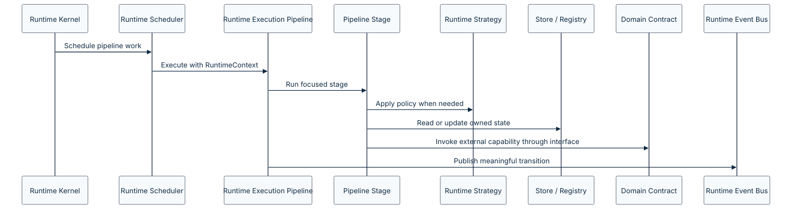

# VoxCore Component Architecture

This document defines the logical decomposition of the VoxCore Runtime into independently maintainable runtime components.

Where the [Runtime Architecture](05-runtime-architecture.md) defines how the runtime executes, the Component Architecture defines how responsibilities are distributed across the runtime.

Each component owns a well-defined responsibility, exposes explicit interfaces, and collaborates through the Runtime Execution Pipeline, RuntimeContext, Runtime Scheduler, Stores, Registries, Domain Contracts, and Runtime Events.

The purpose of this document is to establish clear ownership boundaries, prevent overlapping responsibilities, and provide an implementation blueprint for the runtime.

---

## Purpose

The purpose of this document is to answer one architecture question:

> Which runtime components exist in VoxCore, and what does each component own?

This document refines the runtime platform model into concrete component categories. It defines ownership for runtime lifecycle, pipeline execution, context, scheduling, events, managers, focused services, strategies, stores, registries, contracts, adapters, infrastructure, state, and communication.

---

## Scope

This document covers:

- Runtime component hierarchy.
- Runtime Kernel responsibilities.
- Runtime Execution Pipeline responsibilities.
- RuntimeContext responsibilities.
- Runtime Scheduler responsibilities.
- Runtime Event Bus responsibilities.
- Runtime Manager responsibilities.
- Runtime Service responsibilities.
- Runtime Strategy responsibilities.
- Store and Registry responsibilities.
- Domain Contract responsibilities.
- Provider Adapter responsibilities.
- Infrastructure Service responsibilities.
- Component communication model.
- State ownership matrix.
- Component dependency rules.
- Component collaboration principles.

This document intentionally does not define:

- Source code package names
- Concrete class names
- Function signatures
- Event payload schemas
- API endpoint schemas
- Provider SDK implementation details
- Database schemas
- Deployment topology

Those details belong in module design, API specification, provider architecture, implementation, testing, and deployment documentation.

---

## Relationship With Other Documents

This document builds upon:

| Document | Relationship |
| --- | --- |
| [Software Requirements Specification](../01-software-requirements-specification.md) | Defines the requirements these components must satisfy. |
| [Architectural Goals](01-architectural-goals.md) | Defines the outcomes supported by component boundaries. |
| [Quality Attributes](02-quality-attributes.md) | Defines the qualities preserved by component separation. |
| [Architectural Principles](03-architectural-principles.md) | Defines the engineering rules that components must follow. |
| [Layered Architecture](04-layered-architecture.md) | Defines where component categories belong in the static architecture. |
| [Runtime Architecture](05-runtime-architecture.md) | Defines how these components execute at runtime. |

This document directly influences:

| Document | Relationship |
| --- | --- |
| Module Design | Will define package-level and module-level organization. |
| Package Structure | Will map components to source code directories and dependency boundaries. |
| Service Design | Will define service interfaces and business behavior in detail. |
| Event Definitions | Will define event payloads, metadata, and routing behavior. |
| API Design | Will define how external interfaces interact with runtime components. |
| Testing Strategy | Will define how managers, services, contracts, and adapters are verified. |
| [Communication Architecture](07-communication-architecture.md) | Will define event flow and component collaboration in detail. |
| [Infrastructure Architecture](08-infrastructure-architecture.md) | Will define infrastructure services and cross-cutting concerns in detail. |
| [Deployment Architecture](09-deployment-architecture.md) | Will define deployment topology and runtime hosting concerns. |
| [Extension Points](10-extension-points.md) | Will define provider, plugin, tool, and event extension mechanisms. |

---

## Component Design Philosophy

The VoxCore Runtime follows eight fundamental ownership principles.

1. Every responsibility has exactly one owner.
2. Every piece of mutable state has exactly one owner.
3. The Runtime Execution Pipeline owns conversational turn execution.
4. Managers coordinate boundaries but do not implement business logic.
5. Services implement cohesive business rules but do not absorb unrelated policies.
6. Strategies own interchangeable runtime policy.
7. Stores and Registries own mutable state.
8. Components publish runtime events for meaningful transitions, not every internal method call.

These principles minimize coupling, maximize cohesion, and enable independent evolution of runtime subsystems.

---

## Component Hierarchy

The VoxCore Runtime is decomposed into the following major component categories.

```mermaid
%%{init: {"theme": "base", "themeVariables": {"primaryColor": "#F7FAFC", "primaryTextColor": "#102A43", "primaryBorderColor": "#4A5568", "lineColor": "#4A5568", "fontFamily": "Inter, Segoe UI, Arial"}}}%%
flowchart TD
    runtime["VoxCore Runtime"]:::runtime
    kernel["Runtime Kernel"]:::kernel
    scheduler["Runtime Scheduler"]:::scheduler
    context["RuntimeContext"]:::context
    pipeline["Runtime Execution Pipeline"]:::pipeline
    bus["Runtime Event Bus"]:::bus
    managers["Managers<br/>Orchestration"]:::manager
    services["Focused Services<br/>Business Rules"]:::service
    strategies["Strategies<br/>Runtime Policy"]:::strategy
    stores["Stores and Registries<br/>Mutable State"]:::store
    contracts["Domain Contracts<br/>Interfaces"]:::contract
    adapters["Provider Adapters<br/>External Integrations"]:::adapter
    infra["Infrastructure Services<br/>Technical Capabilities"]:::infra

    runtime --> kernel
    runtime --> scheduler
    runtime --> context
    runtime --> pipeline
    runtime --> bus
    runtime --> managers
    runtime --> services
    runtime --> strategies
    runtime --> stores
    runtime --> contracts
    runtime --> adapters
    runtime --> infra

    classDef runtime fill:#EAF7EA,stroke:#2E7D32,color:#102A12,stroke-width:3px;
    classDef kernel fill:#EAF7EA,stroke:#2E7D32,color:#102A12,stroke-width:2px;
    classDef scheduler fill:#DFF6FF,stroke:#0077B6,color:#083A40,stroke-width:2px;
    classDef context fill:#E7F0FF,stroke:#315C9E,color:#102A43,stroke-width:2px;
    classDef pipeline fill:#EAF7EA,stroke:#2E7D32,color:#102A12,stroke-width:2px;
    classDef bus fill:#FFF4CC,stroke:#D99A00,color:#3A2A00,stroke-width:2px;
    classDef manager fill:#F3E8FF,stroke:#8E44AD,color:#2D143A,stroke-width:2px;
    classDef service fill:#E6F7F8,stroke:#00838F,color:#083A40,stroke-width:2px;
    classDef strategy fill:#F1F8E9,stroke:#558B2F,color:#102A12,stroke-width:2px;
    classDef store fill:#F5F5F5,stroke:#616161,color:#1A202C,stroke-width:2px;
    classDef contract fill:#FFF7E6,stroke:#B7791F,color:#3A2A00,stroke-width:2px;
    classDef adapter fill:#FCE8FF,stroke:#9C27B0,color:#2D143A,stroke-width:2px;
    classDef infra fill:#FFE8E8,stroke:#D64545,color:#3A1111,stroke-width:2px;
```



Each category owns a different type of responsibility.

| Category | Primary Responsibility |
| --- | --- |
| Runtime Kernel | Runtime lifecycle and initialization. |
| Runtime Scheduler | Execution scheduling, streaming, retries, deadlines, timeouts, cancellation, and parallel work. |
| RuntimeContext | Execution-scoped metadata, state handles, trace context, deadline, and cancellation token. |
| Runtime Execution Pipeline | Conversational turn execution. |
| Runtime Event Bus | Meaningful runtime transition routing. |
| Managers | Boundary coordination. |
| Focused Services | Cohesive business rules. |
| Runtime Strategies | Interchangeable runtime policy. |
| Stores and Registries | Mutable state and registered capabilities. |
| Domain Contracts | Stable interfaces and abstractions. |
| Provider Adapters | External provider integration. |
| Infrastructure Services | Technical capabilities required by the runtime. |

---

## Runtime Kernel

The Runtime Kernel is the central coordinator of the runtime.

It owns the lifecycle of the runtime instance and initializes every subsystem required for execution. The Runtime Kernel exists exactly once for every runtime instance.

**Responsibilities:**

- Runtime initialization
- Runtime shutdown
- Manager registration
- Service registration
- Provider registration
- Plugin discovery
- Dependency initialization
- Health monitoring
- Runtime lifecycle transitions

**Owns:**

- Runtime lifecycle state
- Runtime bootstrap state
- Dependency graph

**Never owns:**

- Conversation logic
- Audio processing
- Provider execution
- Memory behavior
- Tool execution behavior

**Publishes events:**

- `RuntimeInitializing`
- `RuntimeInitialized`
- `RuntimeStarted`
- `RuntimeStopping`
- `RuntimeStopped`

**Consumes events:**

- None

The Runtime Kernel should remain deterministic and free of business logic.

---

## Runtime Event Bus

The Runtime Event Bus provides asynchronous communication between runtime components.


Every runtime event is published, routed, and delivered through the Event Bus. The Runtime Event Bus is the approved mechanism for publishing and observing meaningful runtime transitions.


It complements the Runtime Execution Pipeline rather than replacing direct synchronous execution between pipeline stages.

**Responsibilities:**

- Event publication
- Event subscription
- Event routing
- Event delivery
- Event propagation
- Event correlation metadata

**Owns:**

- Event registry
- Subscriber registry

**Never owns:**

- Business logic
- Session state
- Provider behavior
- Conversation state

The Event Bus makes runtime collaboration observable without becoming the owner of runtime decisions.

---

## Runtime Execution Pipeline

The Runtime Execution Pipeline owns conversational turn execution.

**Responsibilities:**

- Execute pipeline stages.
- Apply pipeline middleware.
- Carry RuntimeContext through execution.
- Invoke strategies for interchangeable policies.
- Use Stores and Registries through explicit interfaces.
- Use Domain Contracts for external capabilities.
- Publish meaningful transition events.

**Owns:**

- Active pipeline execution flow.
- Pipeline stage ordering.
- Pipeline middleware ordering.

**Never owns:**

- Durable Session state.
- Durable Conversation state.
- Provider SDK behavior.
- Infrastructure implementation details.

Pipeline stages should be focused enough to test independently.

---

## RuntimeContext

RuntimeContext is the execution envelope passed through pipeline work.

**Responsibilities:**

- Carry Session, Conversation, and turn identifiers.
- Carry trace and correlation metadata.
- Carry deadline and cancellation metadata.
- Provide effective configuration view.
- Provide capability view.
- Provide handles to Stores and Registries.
- Provide event publisher and logger abstractions.

**Never owns:**

- Durable state.
- Provider instances.
- Business policy.
- Global configuration mutation.

RuntimeContext is not a service locator for arbitrary dependencies. It is an execution-scoped context object.

---

## Runtime Scheduler

The Runtime Scheduler owns when and how executable work runs.

**Responsibilities:**

- Schedule pipeline work.
- Coordinate parallel work.
- Support streaming execution.
- Enforce deadlines and timeouts.
- Propagate cancellation.
- Apply retry scheduling.
- Coordinate background cleanup work.

**Never owns:**

- Conversation policy.
- Provider selection policy.
- Tool selection policy.
- Durable state.

The scheduler makes execution behavior consistent across audio, model, tool, memory, and output workflows.

---

## Runtime Managers

Managers coordinate runtime boundaries.

Managers do not contain business logic and do not own durable mutable state. Each manager coordinates one runtime boundary or subsystem and collaborates with other runtime components through the pipeline, Stores, Registries, Domain Contracts, and meaningful events.

### Session Manager

The Session Manager coordinates the lifecycle of runtime sessions.

**Responsibilities:**

- Create sessions
- Close sessions
- Lookup sessions
- Coordinate session cleanup
- Use SessionStore

**Uses:**

- SessionStore

**Publishes events:**

- `SessionCreated`
- `SessionStarted`
- `SessionClosed`

**Consumes events:**

- `RuntimeInitialized`

### Conversation Manager

The Conversation Manager coordinates conversation boundary events.

**Responsibilities:**

- Receive conversation boundary events
- Start or resume pipeline execution for conversation turns
- Publish approved conversation transition events

**Uses:**

- Runtime Execution Pipeline
- ConversationStore

**Publishes events:**

- `ConversationOpened`
- `ConversationClosed`

**Consumes events:**

- `SpeechRecognized`
- `ToolCompleted`

### Audio Manager

The Audio Manager coordinates audio stream behavior.

**Responsibilities:**

- Coordinate audio streams
- Coordinate voice activity behavior
- Route synthesized speech for playback
- Use AudioStateStore

**Publishes events:**

- `AudioChunkReceived`
- `SpeechDetected`
- `AudioPlaybackStarted`
- `AudioPlaybackCompleted`

**Consumes events:**

- `SessionStarted`
- `SpeechSynthesized`

### Tool Manager

The Tool Manager coordinates runtime tool workflows.

**Responsibilities:**

- Coordinate runtime tools
- Coordinate tool execution boundaries
- Use ToolExecutionStore

**Publishes events:**

- `ToolRequested`


Tool completion events originate from the Runtime Execution Pipeline after successful or failed tool execution.


The Tool Manager coordinates tool boundaries but does not own execution state.

**Consumes events:**

- `ToolRequested`

### Memory Manager

The Memory Manager coordinates memory operations.

**Responsibilities:**

- Coordinate memory access boundaries between the Runtime Execution Pipeline and MemoryStore.
- Use MemoryStore
- Publish memory events

**Publishes events:**

- `MemoryUpdated`

**Consumes events:**

- `ConversationTurnStarted`
- `ConversationTurnCompleted`

### Provider Manager

The Provider Manager coordinates provider availability, capability declaration, and provider policy.

**Responsibilities:**

- Provider registration
- Provider discovery
- Provider selection
- Provider capability declaration
- Provider lifecycle coordination
- Provider selection strategy coordination
- Capability matching strategy coordination
- Failover strategy coordination

**Uses:**

- ProviderRegistry
- ProviderSelectionStrategy
- CapabilityMatchingStrategy
- FailoverStrategy

**Publishes events:**

- `ProviderRegistered`

**Consumes events:**

- `RuntimeInitialized`

### Plugin Manager

The Plugin Manager coordinates runtime plugins.

**Responsibilities:**

- Plugin loading
- Plugin discovery
- Plugin lifecycle coordination
- Plugin event subscription registration

**Uses:**

- PluginRegistry

**Publishes events:**

- `PluginLoaded`

**Consumes events:**

- `RuntimeInitialized`

### Configuration Manager

The Configuration Manager coordinates runtime configuration availability.

**Responsibilities:**

- Runtime configuration
- Environment loading
- Configuration validation coordination
- Use ConfigurationStore

**Publishes events:**

- `ConfigurationLoaded`

**Consumes events:**

- `RuntimeInitializing`

### Observability Manager

The Observability Manager coordinates runtime observability.

**Responsibilities:**

- Metrics
- Runtime tracing
- Performance events
- Diagnostic event capture

**Uses:**

- ObservabilityStore
- MetricsSink
- Tracer

**Publishes events:**

- `MetricRecorded`

**Consumes events:**

- Almost every runtime event

---

## Focused Runtime Services

Unlike Managers, Services contain focused business rules.

Services are framework-independent rule components. They should be testable without HTTP, WebSocket infrastructure, provider SDKs, or live external AI providers. Services should not become large policy containers; interchangeable behavior belongs in strategies and executable flow belongs in pipeline stages.

### Session Service

The Session Service owns session policies.

**Owns:**

- Session rules
- Session validation
- Session invariants

### Conversation Service

The Conversation Service owns conversation rules and invariants.

**Owns:**

- Conversation invariants
- Conversation state transition rules
- Conversation validation

**Does not own:**

- Prompt construction
- Context window policy
- Response planning
- LLM request preparation
- ConversationStore

### Speech Service

The Speech Service owns speech-related runtime behavior.

**Owns:**

- Speech validation rules
- Speech normalization rules
- Speech provider-independent behavior

**Does not own:**

- Provider-specific speech translation
- Streaming scheduling
- AudioStateStore

### Tool Service

The Tool Service owns tool business behavior.

**Owns:**

- Tool validation
- Tool result processing
- Tool invariants

**Does not own:**

- Tool scheduling
- ToolExecutionStore
- Tool provider implementation

### Memory Service

The Memory Service owns memory behavior.

**Owns:**

- Memory scope rules
- Memory validation rules
- Memory update rules

**Does not own:**

- Memory retrieval strategy
- Memory persistence implementation
- MemoryStore

### Plugin Service

The Plugin Service owns plugin behavior.

**Owns:**

- Plugin eligibility
- Plugin permissions
- Plugin lifecycle policies

### Configuration Service

The Configuration Service owns configuration behavior.

**Owns:**

- Runtime configuration model
- Default configuration
- Configuration validation

---

## Runtime Strategies

Runtime Strategies own interchangeable policies that should not be embedded inside managers or services.

| Strategy | Responsibility |
| --- | --- |
| ProviderSelectionStrategy | Selects a provider for a required capability. |
| CapabilityMatchingStrategy | Matches requested behavior to provider capability declarations. |
| RetryStrategy | Defines retry behavior, limits, and backoff. |
| MemoryRetrievalStrategy | Retrieves memory for a turn. |
| ContextPruningStrategy | Keeps context inside model and runtime limits. |
| PromptAssemblyStrategy | Builds model-ready prompts or messages. |
| ResponsePlanningStrategy | Decides whether to answer, call tools, clarify, or continue. |
| ToolSelectionStrategy | Selects eligible tools for a request. |
| FailoverStrategy | Defines provider fallback behavior. |

Strategies should be small, replaceable, and easy to test with fake Stores, Registries, and Contracts.

---

## Stores And Registries

Stores and Registries own mutable state and registered capabilities.

| Store or Registry | Responsibility |
| --- | --- |
| RuntimeStateStore | Runtime lifecycle state. |
| SessionStore | Session state and lookup. |
| ConversationStore | Conversation state and history. |
| AudioStateStore | Audio stream state. |
| MemoryStore | Owns runtime conversational memory state. |
| ToolExecutionStore | Tool execution state and results. |
| ProviderRegistry | Provider registrations and capability declarations. |
| PluginRegistry | Plugin registrations and activation state. |
| ConfigurationStore | Effective runtime configuration. |
| ObservabilityStore | Runtime diagnostic state when local storage is needed. |

Managers and services use Stores and Registries through explicit interfaces. They do not own the underlying mutable state.

---

## Domain Contracts

The Domain Contract layer defines the interfaces that isolate the runtime from external implementations.

Contracts contain no implementation.

Examples include:

| Contract Group | Examples | Responsibility |
| --- | --- | --- |
| Runtime Contracts | `RuntimeEventPublisher`, `RuntimeScheduler`, `RuntimeClock` | Runtime execution interfaces. |
| Speech Contracts | `SpeechRecognizer`, `SpeechSynthesizer`, `VoiceActivityDetector` | Speech and voice interfaces. |
| Model Contracts | `LanguageModel`, `EmbeddingModel` | LLM and embedding interfaces. |
| Memory Contracts | `MemoryRepository`, `ConversationRepository` | Memory and conversation persistence interfaces. |
| Tool Contracts | `ToolExecutor`, `ToolRegistry` | Tool execution and lookup interfaces. |
| Provider Contracts | `ProviderCatalog`, `CapabilityDescriptor` | Provider registration and capability interfaces. |
| Infrastructure Contracts | `Logger`, `Tracer`, `MetricsSink`, `ConfigurationProvider` | Technical support interfaces. |

Domain contracts should be stable enough for multiple implementations and fake test implementations.

---

## Provider Adapters

Provider Adapters implement Domain Contracts using concrete third-party technologies.

Adapters translate between external APIs and internal contracts. They do not contain runtime business logic.

Examples include:

- Whisper Adapter
- Parakeet Adapter
- Gemini Adapter
- OpenAI Adapter
- Kokoro Adapter
- Piper Adapter
- Redis Adapter
- PostgreSQL Adapter
- Future provider adapters

**Adapter rules:**

- Implement domain contracts.
- Translate VoxCore requests into provider-specific requests.
- Translate provider responses into VoxCore results.
- Normalize provider errors.
- Avoid business logic.
- Avoid manager-to-manager communication.

---

## Infrastructure Services

Infrastructure Services provide cross-cutting technical capabilities required by the runtime.

These include:

- Logging
- Metrics
- Tracing
- Persistence
- Dependency injection
- Configuration storage
- Caching
- Monitoring
- Telemetry
- File system access

Infrastructure supports the runtime but does not define business behavior.

---

## Component Communication Model

Runtime components collaborate through pipeline execution, explicit interfaces, and meaningful transition events.

The preferred execution pattern is:



Direct Manager-to-Manager communication should be avoided unless no pipeline, store, contract, strategy, or event-based alternative exists and the exception is documented.

---

## State Ownership Matrix

Every mutable state category has exactly one Store or Registry owner.

| State Category | Owner |
| --- | --- |
| Runtime lifecycle | RuntimeStateStore |
| Active sessions | SessionStore |
| Conversation context and history | ConversationStore |
| Audio processing state | AudioStateStore |
| Conversational memory | MemoryStore |
| Tool execution state | ToolExecutionStore |
| Provider registrations and capabilities | ProviderRegistry |
| Plugin registrations | PluginRegistry |
| Runtime configuration | ConfigurationStore |
| Local diagnostics | ObservabilityStore |

Shared mutable state without a clear owner should be treated as an architecture issue.

---

## Component Dependency Rules

Component dependencies must remain explicit and directional.

| Rule | Description |
| --- | --- |
| 1 | The Runtime Kernel initializes Stores, Registries, Strategies, Scheduler, Pipeline, Managers, Contracts, Adapters, and Infrastructure. |
| 2 | The Runtime Execution Pipeline depends on stages, middleware, strategies, Stores, Registries, and Domain Contracts. |
| 3 | Managers coordinate boundaries and depend on Stores, Registries, Services, Strategies, and Events through explicit interfaces. |
| 4 | Services depend on Stores, Strategies, and Domain Contracts through interfaces. |
| 5 | Strategies depend on Stores, Registries, and Domain Contracts through interfaces. |
| 6 | Domain Contracts never depend on implementations. |
| 7 | Provider Adapters implement Domain Contracts. |
| 8 | Infrastructure provides technical capabilities. |
| 9 | Runtime events are used for meaningful state transitions and cross-component notifications. |

These rules preserve provider independence, testability, and maintainability.

---

## Dependency Flow

The following diagram illustrates the permitted dependency direction between the major runtime component categories.


```text
Runtime Kernel
        │
        ▼
Runtime Scheduler
        │
        ▼
Runtime Execution Pipeline
        │
        ├──────────────► Runtime Strategies
        │
        ├──────────────► Stores / Registries
        │
        ├──────────────► Domain Contracts
        │                      │
        │                      ▼
        │               Provider Adapters
        │
        └──────────────► Infrastructure Services
```

---

## Component Collaboration Principles

Every component must:

- Own exactly one responsibility.
- Expose explicit public interfaces.
- Minimize mutable shared state.
- Publish meaningful runtime events.
- Subscribe only to relevant events.
- Remain independently testable.
- Avoid knowledge of unrelated runtime components.

These principles should be enforced during architecture review, module design review, and code review.

---

## Traceability To Quality Attributes

The following table maps runtime goals and quality attributes to component decisions.

| Runtime Goal Or Quality Attribute | Component Decision |
| --- | --- |
| Maintainability | Pipeline stages, focused services, strategies, stores, and adapters have separate reasons to change. |
| Extensibility | New behavior can enter through stages, middleware, strategies, contracts, adapters, plugins, tools, and events. |
| Testability | Stages, services, strategies, stores, and contracts can be tested independently. |
| Provider Independence | Domain contracts and provider adapters. |
| Performance | Runtime Scheduler and streaming-first pipeline execution. |
| Reliability | Session isolation, lifecycle management, deadlines, cancellation, and Store-owned state. |
| Observability | RuntimeContext trace metadata, Event Bus transition metadata, metrics, tracing, and diagnostics. |
| Scalability | Independent pipeline stages, stores, registries, scheduler boundaries, and explicit state ownership. |

---

## Traceability To SRS Requirements

The following table maps SRS requirement areas to primary component responsibilities.

| SRS Requirement Area | Related Requirements | Primary Components |
| --- | --- | --- |
| Session management | FR-001 to FR-003 | Session Manager, Session Service, SessionStore |
| Audio processing | FR-004 to FR-006 | Audio pipeline stages, Audio Manager, Speech Service, AudioStateStore, `VoiceActivityDetector` |
| Speech recognition | FR-007 to FR-009, EI-006 | Speech Service, `SpeechRecognizer`, STT provider adapters |
| Conversation management | FR-010 to FR-012 | Runtime Execution Pipeline, Conversation Manager, Conversation Service, ConversationStore |
| Language model integration | FR-013 to FR-015, EI-007 | Model execution stage, Provider Manager, ProviderSelectionStrategy, CapabilityMatchingStrategy, `LanguageModel`, LLM adapters |
| Tool execution | FR-016 to FR-018, EI-009, EI-010 | Tool pipeline stages, Tool Manager, Tool Service, ToolExecutionStore, `ToolExecutor` |
| Memory | FR-019 to FR-020 | Memory pipeline stages, Memory Service, MemoryRetrievalStrategy, `MemoryStore` |
| Speech synthesis | FR-021 to FR-023, EI-008 | Speech Service, `SpeechSynthesizer`, TTS provider adapters |
| APIs | FR-024 to FR-026, EI-001 to EI-003 | Application interface adapters, Runtime Kernel, Event Bus |
| SDKs | FR-027 to FR-029, EI-004, EI-005 | SDK adapters, runtime contracts |
| Extensibility | FR-030 to FR-032 | Pipeline stages, middleware, strategies, Provider Manager, Plugin Manager, Event Bus, contracts, adapters |
| Observability | NFR-013, NFR-014, NFR-018 | Observability Manager, `Logger`, metrics, tracing, telemetry |
| Testability | NFR-015, NFR-016 | Pipeline stages, strategies, focused Runtime Services, Stores, Domain Contracts, fake provider adapters |

---

## Measuring Success

The following review questions should be used when evaluating component design.

| Concern | Review Question |
| --- | --- |
| Ownership | Does this component have one clear responsibility and one reason to change? |
| State | Is the affected mutable state owned by exactly one Store or Registry? |
| Pipeline | Does conversational turn behavior live in the Runtime Execution Pipeline rather than in a manager chain? |
| RuntimeContext | Does execution-scoped metadata flow through RuntimeContext? |
| Scheduler | Are streaming, parallel work, retries, timeouts, deadlines, and cancellation handled through the Runtime Scheduler? |
| Managers | Does the manager coordinate rather than implement business logic? |
| Services | Does the service own cohesive rules rather than unrelated policy? |
| Strategies | Are interchangeable policies modeled as strategies? |
| Contracts | Does runtime logic depend on interfaces rather than implementations? |
| Adapters | Are provider-specific details contained inside adapters? |
| Infrastructure | Does infrastructure support behavior without owning business rules? |
| Events | Are events reserved for meaningful transitions rather than internal helper calls? |
| Testing | Can the component be tested with fake providers, fake contracts, or controlled events? |
| Extension | Can a similar future capability be added without modifying unrelated components? |

A component design should be reconsidered when it fails the relevant review questions.

---

## Rationale

The Component Architecture separates pipeline execution, scheduling, context, boundary coordination, focused rules, strategies, state ownership, contracts, external integration, and infrastructure.

This separation is important because conversational runtimes can easily become tangled. Audio handling, provider calls, memory, tool execution, conversation state, logging, configuration, and streaming all interact. Without strict ownership, a small feature can require changes across unrelated components.

The explicit runtime responsibility separation prevents that drift:

- The Runtime Execution Pipeline keeps conversational turn execution explicit.
- RuntimeContext keeps execution metadata explicit.
- The Runtime Scheduler keeps streaming, deadlines, retries, and cancellation consistent.
- Managers keep boundary coordination visible.
- Services keep cohesive rules testable.
- Strategies keep runtime policies replaceable.
- Stores and Registries keep state ownership explicit.
- Contracts keep integrations replaceable.
- Adapters keep provider details isolated.
- Infrastructure keeps technical support out of domain behavior.

---

## Alternatives Considered

| Alternative | Reason Rejected |
| --- | --- |
| Managers contain all business logic | This would make managers large, difficult to test, and likely to overlap responsibilities. |
| Services coordinate the whole runtime | This would blur orchestration and business logic responsibilities. |
| Services own all runtime policies | This would create God Objects and make behavior difficult to extend safely. |
| Event Bus as the execution pipeline | This would create excessive event noise and hide the actual execution path. |
| Managers own mutable state | This would make managers hard to test and would blur coordination with persistence. |
| Direct manager-to-manager communication | This would increase coupling and make runtime behavior harder to trace. |
| Provider adapters expose provider-native objects | This would leak provider details into runtime behavior and weaken provider independence. |
| Infrastructure utilities own runtime rules | This would hide business behavior inside technical utilities. |
| Single runtime controller owns everything | This would be simpler initially but would not scale as providers, tools, memory, and plugins grow. |

---

## Consequences

The component architecture creates the following expectations:

- Every component should have one primary responsibility.
- Every mutable state category should have one owner.
- The Runtime Execution Pipeline should own conversational turn execution.
- RuntimeContext should carry execution-scoped metadata.
- The Runtime Scheduler should own scheduling, streaming, deadlines, retries, and cancellation.
- Managers should remain thin boundary coordination components.
- Services should own cohesive business rules only.
- Strategies should own interchangeable runtime policies.
- Stores and Registries should own mutable state.
- Contracts should define the interfaces other components depend on.
- Provider adapters should translate between VoxCore and external systems without owning business rules.
- Infrastructure should support runtime behavior without defining business rules.
- Runtime events should represent meaningful transitions.
- New features should usually be added through pipeline stages, middleware, strategies, services, adapters, contracts, plugins, tools, or event subscribers.
- Intentional exceptions should be documented through Architecture Decision Records.

These consequences should be treated as design review criteria as VoxCore evolves.

---

## Related Documents

| Document | Relationship |
| --- | --- |
| [System Architecture README](README.md) | Defines the structure and reading order for architecture documentation. |
| [Software Requirements Specification](../01-software-requirements-specification.md) | Defines the requirements these components must satisfy. |
| [Architectural Goals](01-architectural-goals.md) | Defines the goals supported by component boundaries. |
| [Quality Attributes](02-quality-attributes.md) | Defines the quality attributes supported by component separation. |
| [Architectural Principles](03-architectural-principles.md) | Defines the principles enforced by component ownership. |
| [Layered Architecture](04-layered-architecture.md) | Defines where component categories belong in the static architecture. |
| [Runtime Architecture](05-runtime-architecture.md) | Defines how these components execute at runtime. |
| [Communication Architecture](07-communication-architecture.md) | Will define event flow and component collaboration in detail. |
| [Infrastructure Architecture](08-infrastructure-architecture.md) | Will define infrastructure services and cross-cutting concerns in detail. |
| [Deployment Architecture](09-deployment-architecture.md) | Will define deployment topology and runtime hosting concerns. |
| [Extension Points](10-extension-points.md) | Will define provider, plugin, tool, and event extension mechanisms. |

---

## Conclusion

The Component Architecture defines the structural organization of the VoxCore Runtime by assigning every responsibility, state, and interaction to a dedicated runtime component.

The separation between Managers for orchestration, Services for business logic, Domain Contracts for abstractions, Provider Adapters for external integrations, and Infrastructure Services for technical capabilities ensures that the runtime remains modular, provider-agnostic, testable, observable, and extensible.

This ownership model forms the implementation blueprint for the VoxCore codebase and establishes clear boundaries that guide future development while preserving the architectural principles defined throughout the project.
