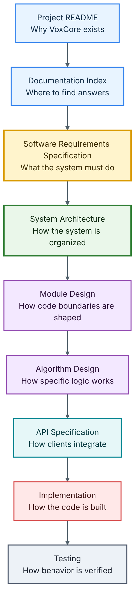

# VoxCore System Architecture

This document is the entry point for the VoxCore system architecture documentation. It explains how the architecture documents should be read, how they relate to the Software Requirements Specification, and where each architectural topic belongs.

This file is a navigation and orientation document. It intentionally does not describe the implementation of any runtime component.

---

## Purpose

The purpose of this document is to help readers understand:

- What the architecture documentation is responsible for.
- How architecture documents are organized.
- Which document answers which architectural question.
- Which documents should be read first.
- How architectural decisions remain traceable to requirements.

Every architecture document in this directory should answer one primary question and avoid overlapping responsibilities with other documents.

---

## Introduction

The architecture of VoxCore is divided into focused documents instead of one large specification.

As VoxCore evolves, the architecture will grow across runtime behavior, provider integration, streaming, session management, memory, tools, deployment, observability, and extension points. Separating these concerns improves readability, maintainability, and traceability while preventing unrelated decisions from becoming tightly coupled.

This organization follows the same design philosophy expected from the system itself:

- High cohesion
- Low coupling
- Clear responsibilities
- Explicit interfaces
- Modular design

---

## Relationship With The SRS

The [Software Requirements Specification](../01-software-requirements-specification.md) defines what VoxCore must accomplish.

The system architecture documentation defines how the system is organized to satisfy those requirements.

Every architectural decision should be traceable to one or more functional or non-functional requirements in the SRS. The architecture must never contradict the SRS. When requirements evolve, the architecture should be reviewed and updated accordingly.



---

## Scope

The architecture documentation covers:

- Architectural goals and engineering quality attributes.
- Architectural principles and design constraints.
- Layered system organization.
- Runtime execution model.
- Runtime component organization.
- Runtime communication and event flow.
- Infrastructure architecture.
- Deployment architecture.
- Runtime extension mechanisms.
- Architectural Decision Records (ADRs).

The architecture documentation intentionally excludes implementation-specific details such as source code organization, algorithms, function signatures, class definitions, provider SDK usage, and deployment scripts.

Those topics belong in the Module Design, API Specification, Implementation, and Testing documentation.

---

## Architecture Philosophy

The architecture of VoxCore is guided by the following principles:

- Modular architecture
- Provider independence
- Streaming-first communication
- API-first development
- Explicit dependencies
- Separation of concerns
- Framework-independent business logic
- Replaceable implementations
- Documentation-driven development

These principles influence every architectural decision throughout the project.

---

## Architecture Viewpoints

The architecture of VoxCore is intentionally described through multiple complementary viewpoints.

Each document answers one architectural question rather than attempting to describe the entire system.

The primary viewpoints are:

| Viewpoint | Question |
| --- | --- |
| Layered Architecture | Where do responsibilities belong? |
| Runtime Architecture | How does the runtime execute? |
| Component Architecture | Who owns each responsibility? |
| Communication Architecture | How do components collaborate? |
| Infrastructure Architecture | How are cross-cutting concerns implemented? |
| Deployment Architecture | How is the runtime deployed? |
| Extension Points | How can the runtime evolve safely? |

Together these viewpoints provide a complete architectural description while minimizing duplication between documents.

---

## Architecture Documentation Map

The architecture documents should be read in dependency order. Each document introduces concepts that are refined by the documents that follow.

```text
README
|
|-- 01 Architectural Goals
|
|-- 02 Quality Attributes
|
|-- 03 Architectural Principles
|
|-- 04 Layered Architecture
|
|-- 05 Runtime Architecture
|
|-- 11 Runtime Execution Pipeline
|
|-- 06 Component Architecture
|
|-- 07 Communication Architecture
|
|-- 08 Infrastructure Architecture
|
|-- 09 Deployment Architecture
|
`-- 10 Extension Points

Supporting Directories

diagrams/
Shared architectural diagrams used across multiple documents.

decisions/
Architecture Decision Records (ADRs) documenting significant design decisions.
```

---

## Reading Order

| Order | Document | Primary Question |
| --- | --- | --- |
| 0 | [README](README.md) | How should this architecture documentation be read? |
| 1 | [Architectural Goals](01-architectural-goals.md) | What are we optimizing for? |
| 2 | [Quality Attributes](02-quality-attributes.md) | Which engineering qualities matter most? |
| 3 | [Architectural Principles](03-architectural-principles.md) | Which rules govern every architectural decision? |
| 4 | [Layered Architecture](04-layered-architecture.md) | Where do responsibilities belong? |
| 5 | [Runtime Architecture](05-runtime-architecture.md) | How does VoxCore execute? |
| 6 | [Runtime Execution Pipeline](11-runtime-execution-pipeline.md) | How does a conversational turn execute? |
| 7 | [Component Architecture](06-component-architecture.md) | Which component owns what? |
| 8 | [Communication Architecture](07-communication-architecture.md) | How do runtime components communicate? |
| 9 | [Infrastructure Architecture](08-infrastructure-architecture.md) | How are cross-cutting concerns implemented? |
| 10 | [Deployment Architecture](09-deployment-architecture.md) | How is VoxCore deployed? |
| 11 | [Extension Points](10-extension-points.md) | How does VoxCore evolve safely? |

---

## Standard Document Template

Each architecture document should use the same structure unless there is a strong reason not to:

1. Purpose
2. Scope
3. Design Drivers
4. Design
5. Rationale
6. Alternatives Considered
7. Consequences
8. Related Documents

This template ensures that documents explain not only what was chosen, but why the choice was made.

---

## Architecture Decision Records

Major architectural choices should be recorded in the `decisions/` directory as Architecture Decision Records.

Future ADR examples may include:

- `ADR-001-provider-abstraction.md`
- `ADR-002-streaming-first.md`
- `ADR-003-websocket-over-http.md`
- `ADR-004-plugin-system.md`

ADRs should be used for decisions that are difficult to reverse, affect multiple documents, or define long-term architectural direction.

---

## Traceability Rules

Every architecture document should satisfy the following rules:

- Address one architectural concern.
- Avoid duplicating information from other architecture documents.
- Reference related documents instead of repeating their content.
- Remain consistent with the SRS.
- Provide enough detail to guide implementation.
- Avoid source-code-level implementation detail.
- Document rationale, alternatives, and consequences for meaningful decisions.

These rules keep architecture understandable as the project grows.

---

## Relationship With Other Documentation

| Document | Responsibility |
| --- | --- |
| Project README | Introduces VoxCore and explains the project's purpose. |
| Documentation Index | Helps contributors navigate the documentation. |
| Software Requirements Specification | Defines what the system must accomplish. |
| System Architecture | Defines how the system is organized. |
| Module Design | Defines the internal structure of each runtime module. |
| API Specification | Defines public interfaces exposed by VoxCore. |
| Implementation | Contains the production source code. |
| Testing | Verifies that the implementation satisfies the architecture and requirements. |
| Roadmap | Describes planned architectural and product evolution. |

---

## Expected Audience

This documentation is intended for:

- Software architects
- Backend engineers
- Machine learning engineers
- Open-source contributors
- Technical reviewers
- Project maintainers

Readers unfamiliar with the project should begin with the [Project README](../../README.md), then the [Documentation Index](../00-documentation-index.md), and then the [SRS](../01-software-requirements-specification.md) before studying architecture documents.

---

## Future Evolution

The architecture is expected to evolve as VoxCore matures.

Whenever significant architectural decisions are introduced, modified, or deprecated, the relevant architecture document and any related ADR should be updated. Architectural changes should be driven by documented requirements, measurable quality improvements, or validated engineering needs rather than implementation convenience.

---

## Architecture Governance

The architecture described in this directory should be treated as the authoritative design reference for VoxCore.

Any architectural change should:

1. Begin with an Architecture Decision Record (ADR) when appropriate.
2. Remain consistent with the Software Requirements Specification.
3. Preserve the Architectural Principles.
4. Maintain the Runtime Architecture ownership model.
5. Update all affected architecture documents before implementation begins.

Implementation should follow architecture, not redefine it.

---

## Conclusion

This architecture documentation is the authoritative design reference for VoxCore.

Its purpose is to provide a clear, modular, and maintainable blueprint that guides implementation while preserving consistency with the project's requirements and long-term vision.

Every implementation decision within VoxCore should be traceable back to the architectural decisions documented in this directory.
