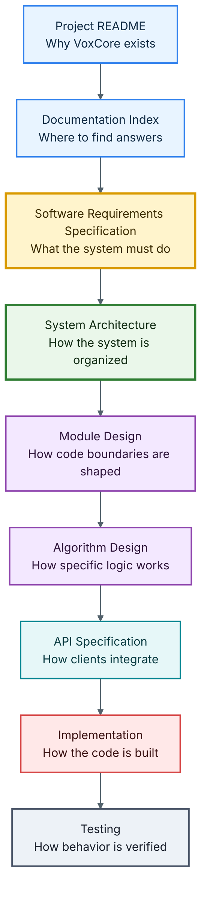
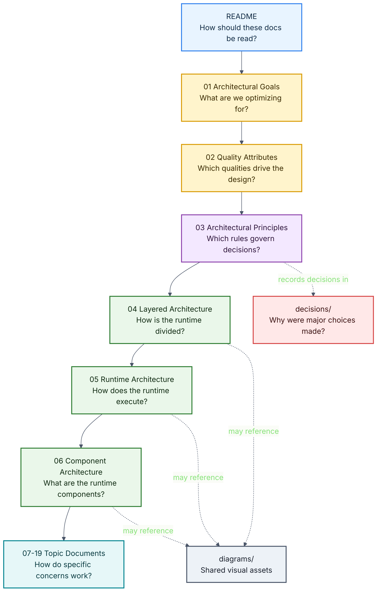

# VoxCore System Architecture

This document is the entry point for the VoxCore system architecture documentation. It explains how the architecture documents should be read, how they relate to the Software Requirements Specification, and where each architectural topic belongs.

This file is a navigation and orientation document. It intentionally does not describe the implementation of any runtime component.

---

## Purpose

The purpose of this document is to help readers understand:

- What the architecture documentation is responsible for.
- How architecture documents are organized.
- Which document answers which architectural question.
- Which documents should be read first.
- How architectural decisions remain traceable to requirements.

Every architecture document in this directory should answer one primary question and avoid overlapping responsibilities with other documents.

---

## Introduction

The architecture of VoxCore is divided into focused documents instead of one large specification.

As VoxCore evolves, the architecture will grow across runtime behavior, provider integration, streaming, session management, memory, tools, deployment, observability, and extension points. Separating these concerns improves readability, maintainability, and traceability while preventing unrelated decisions from becoming tightly coupled.

This organization follows the same design philosophy expected from the system itself:

- High cohesion
- Low coupling
- Clear responsibilities
- Explicit interfaces
- Modular design

---

## Relationship With The SRS

The [Software Requirements Specification](../01-software-requirements-specification.md) defines what VoxCore must accomplish.

The system architecture documentation defines how the system is organized to satisfy those requirements.

Every architectural decision should be traceable to one or more functional or non-functional requirements in the SRS. The architecture must never contradict the SRS. When requirements evolve, the architecture should be reviewed and updated accordingly.

---

## Scope

The architecture documentation covers:

- Overall runtime organization
- Architectural goals
- Quality attributes
- Architectural principles
- Architectural layers
- Runtime architecture
- Component interactions
- Provider integration
- Session lifecycle
- Conversation lifecycle
- Audio processing pipeline
- Tool execution
- Memory management
- Dependency rules
- Configuration management
- Error handling
- Logging and observability
- Security boundaries
- Deployment architecture
- Extension mechanisms

The architecture documentation intentionally excludes implementation-specific details such as class definitions, function signatures, algorithms, and source code. Those topics belong in module design, algorithm design, API specification, or implementation documentation.

---

## Architecture Philosophy

The architecture of VoxCore is guided by the following principles:

- Modular architecture
- Provider independence
- Streaming-first communication
- API-first development
- Explicit dependencies
- Separation of concerns
- Framework-independent business logic
- Replaceable implementations
- Documentation-driven development

These principles influence every architectural decision throughout the project.

---

## Architecture Documentation Map

The architecture documents should be read in dependency order. Each document builds on the decisions and vocabulary introduced before it.

---

## Reading Order

| Order | Document | Primary Question |
| --- | --- | --- |
| 0 | [README](README.md) | How should this architecture documentation be read? |
| 1 | [Architectural Goals](01-architectural-goals.md) | What are we optimizing for? |
| 2 | [Quality Attributes](02-quality-attributes.md) | Which quality attributes drive the design? |
| 3 | [Architectural Principles](03-architectural-principles.md) | Which engineering rules govern every decision? |
| 4 | [Layered Architecture](04-layered-architecture.md) | How is the runtime divided into layers? |
| 5 | [Runtime Architecture](05-runtime-architecture.md) | How does the runtime execute? |
| 6 | [Component Architecture](06-component-architecture.md) | What are the runtime components? |
| 7 | [Provider Architecture](07-provider-architecture.md) | How are providers integrated? |
| 8 | [Session Lifecycle](08-session-lifecycle.md) | How does a session live and die? |
| 9 | [Conversation Lifecycle](09-conversation-lifecycle.md) | How does a conversation flow? |
| 10 | [Audio Pipeline](10-audio-pipeline.md) | How does audio travel? |
| 11 | [Tool Execution](11-tool-execution.md) | How are tools executed? |
| 12 | [Memory Architecture](12-memory-architecture.md) | How is memory managed? |
| 13 | [Dependency Rules](13-dependency-rules.md) | What dependency rules are enforced? |
| 14 | [Configuration Architecture](14-configuration-architecture.md) | How is configuration loaded? |
| 15 | [Error Handling](15-error-handling.md) | How are failures handled? |
| 16 | [Logging and Observability](16-logging-observability.md) | How are logs and metrics produced? |
| 17 | [Security Boundaries](17-security-boundaries.md) | What are the trust boundaries? |
| 18 | [Deployment Architecture](18-deployment-architecture.md) | How is the runtime deployed? |
| 19 | [Extension Points](19-extension-points.md) | How can the architecture evolve? |

---

## Standard Document Template

Each architecture document should use the same structure unless there is a strong reason not to:

1. Purpose
2. Scope
3. Design Drivers
4. Design
5. Rationale
6. Alternatives Considered
7. Consequences
8. Related Documents

This template ensures that documents explain not only what was chosen, but why the choice was made.

---

## Architecture Decision Records

Major architectural choices should be recorded in the `decisions/` directory as Architecture Decision Records.

Future ADR examples may include:

- `ADR-001-provider-abstraction.md`
- `ADR-002-streaming-first.md`
- `ADR-003-websocket-over-http.md`
- `ADR-004-plugin-system.md`

ADRs should be used for decisions that are difficult to reverse, affect multiple documents, or define long-term architectural direction.

---

## Traceability Rules

Every architecture document should satisfy the following rules:

- Address one architectural concern.
- Avoid duplicating information from other architecture documents.
- Reference related documents instead of repeating their content.
- Remain consistent with the SRS.
- Provide enough detail to guide implementation.
- Avoid source-code-level implementation detail.
- Document rationale, alternatives, and consequences for meaningful decisions.

These rules keep architecture understandable as the project grows.

---

## Relationship With Other Documentation

| Document | Responsibility |
| --- | --- |
| [Project README](../../README.md) | Introduces VoxCore and helps visitors decide whether to explore the project. |
| [Documentation Index](../00-documentation-index.md) | Explains which project document answers which question. |
| [Software Requirements Specification](../01-software-requirements-specification.md) | Defines what VoxCore must do. |
| System Architecture | Defines how VoxCore is organized to satisfy requirements. |
| Module Design | Defines internal code boundaries and module responsibilities. |
| API Specification | Defines public integration contracts. |
| Implementation | Provides the actual runtime code. |
| Testing | Verifies that implementation satisfies requirements and architecture. |
| [Roadmap](../../ROADMAP.md) | Describes product direction and planned milestones. |

---

## Expected Audience

This documentation is intended for:

- Software architects
- Backend engineers
- Machine learning engineers
- Open-source contributors
- Technical reviewers
- Project maintainers

Readers unfamiliar with the project should begin with the [Project README](../../README.md), then the [Documentation Index](../00-documentation-index.md), and then the [SRS](../01-software-requirements-specification.md) before studying architecture documents.

---

## Future Evolution

The architecture is expected to evolve as VoxCore matures.

Whenever significant architectural decisions are introduced, modified, or deprecated, the relevant architecture document and any related ADR should be updated. Architectural changes should be driven by documented requirements, measurable quality improvements, or validated engineering needs rather than implementation convenience.

---

## Conclusion

This architecture documentation is the authoritative design reference for VoxCore.

Its purpose is to provide a clear, modular, and maintainable blueprint that guides implementation while preserving consistency with the project's requirements and long-term vision.

Every implementation decision within VoxCore should be traceable back to the architectural decisions documented in this directory.
