# VoxCore Voice Pipeline Architecture

This document provides a comprehensive flowchart and explanation of the VoxCore real-time voice pipeline, detailing audio grouping, Smart Interrupts (cough rejection), and real-time sentence streaming.

## Flowchart

```mermaid
graph TD
    classDef client fill:#3498db,stroke:#2980b9,stroke-width:2px,color:#fff,rx:5px,ry:5px;
    classDef ws fill:#9b59b6,stroke:#8e44ad,stroke-width:2px,color:#fff,rx:5px,ry:5px;
    classDef vad fill:#e67e22,stroke:#d35400,stroke-width:2px,color:#fff,rx:5px,ry:5px;
    classDef stt fill:#e74c3c,stroke:#c0392b,stroke-width:2px,color:#fff,rx:5px,ry:5px;
    classDef interrupt fill:#f1c40f,stroke:#f39c12,stroke-width:2px,color:#333,rx:5px,ry:5px;
    classDef pipeline fill:#2ecc71,stroke:#27ae60,stroke-width:2px,color:#fff,rx:5px,ry:5px;
    classDef memory fill:#1abc9c,stroke:#16a085,stroke-width:2px,color:#fff,rx:5px,ry:5px;
    classDef llm fill:#34495e,stroke:#2c3e50,stroke-width:2px,color:#fff,rx:5px,ry:5px;

    %% 1. Streaming & VAD
    Client[Browser Microphone Stream<br/>PCM Audio]:::client --> WS[WebSocket Controller<br/>Receives Audio Chunks]:::ws
    WS --> VAD{Silero VAD<br/>is_speech?}:::vad

    %% 2. Smart Interrupt (Initial)
    VAD -- "YES & was_speaking=False" --> IntStart[User Started Speaking]:::interrupt
    IntStart --> WS_Pause[Send 'pause' signal to Browser]:::ws
    WS_Pause --> Suspend[Frontend Suspends WebAudio]:::client
    Suspend --> Buffer[Append chunk to 'audio_buffer']:::ws

    VAD -- "YES & was_speaking=True" --> Buffer

    %% 3. Triggers
    Buffer --> TriggerCheck{Trigger Conditions}:::stt
    VAD -- "NO" --> SilenceCheck[Increment Silence Frames]:::stt
    SilenceCheck --> TriggerCheck

    %% 4. STT Phase
    TriggerCheck -- "Buffer > 30s OR Silence > 1.5s" --> STT[Speech-to-Text<br/>Groq Whisper]:::stt
    STT --> STT_Result{"Is Transcript Empty?"}:::stt

    %% 5. Smart Decision (Resume vs Interrupt)
    STT_Result -- "YES (Cough/Noise)" --> WS_Resume[Send 'resume' signal to Browser]:::ws
    WS_Resume --> Unpause[Frontend Resumes WebAudio]:::client
    
    STT_Result -- "NO (Valid Speech)" --> Cancel[Cancel Active LLM Task]:::interrupt
    Cancel --> WS_Int[Send 'interrupt' signal to Browser]:::ws
    WS_Int --> Flush[Frontend Flushes Queue & Resumes]:::client
    Flush --> ExecPipe[Runtime Execution Pipeline]:::pipeline

    %% 6. Context & Memory
    ExecPipe --> MemSaveUser[IMemoryService<br/>Save User Message]:::memory
    MemSaveUser --> CtxBuild[ContextBuilder<br/>Assemble Full History]:::memory

    %% 7. Streaming Sentence Pipeline
    CtxBuild --> LLM[LLM Token Stream]:::llm
    LLM --> SentBuf{Sentence Buffer<br/>Check for . ? !}:::pipeline
    SentBuf -- "No Boundary" --> LLM
    SentBuf -- "Boundary Found" --> Normalize[Text Normalization<br/>Strip markdown, fix symbols]:::pipeline
    Normalize --> TTSQueue[Asyncio TTS Queue]:::pipeline
    
    %% 8. TTS Worker
    TTSQueue --> TTS[Piper TTS Adapter<br/>Synthesize WAV Audio]:::pipeline
    TTS --> WSSend[WebSocket Sends Sentence to Browser]:::ws
    
    %% 9. Client Playback Queue
    WSSend --> ClientQueue[Frontend AudioBuffer Queue]:::client
    ClientQueue --> Play[Play Sequential Sentences]:::client
```

## Stage-by-Stage Explanation

### 1. Audio Streaming & Grouping
- **Browser to Server:** The browser streams raw binary PCM audio chunks over the WebSocket to `websocket_controller.py`. 
- **Silero VAD Gating:** Every chunk is passed through the Silero Neural VAD to determine if human speech is present (`is_speech`). 
- **Pre-Speech Buffer:** A 5-frame rolling buffer is maintained when the user is silent. The moment speech is detected, these 5 frames are prepended to the main `audio_buffer` to ensure the sharp consonants at the beginning of words (which VAD might miss) are captured.

### 2. Smart Interrupts (The "Cough" Fix)
VoxCore uses a highly intelligent, non-destructive interrupt mechanism identical to top-tier voice AI systems (like Gemini Live).
- **Instant Suspension:** The millisecond you make a noise (`is_speech = True`), the server sends a `{"type": "pause"}` signal to the browser. The browser instantly suspends its `AudioContext`, freezing the AI mid-word.
- **The Decision Phase:** Once you stop making noise (silence > 1.5s), the server transcribes your audio. 
  - **False Alarm:** If the transcript is empty (a cough or throat clear), the server realizes it was a false alarm. It sends a `{"type": "resume"}` signal. The browser seamlessly resumes the audio exactly where it paused, and the backend AI task was never interrupted!
  - **True Interrupt:** If the transcript contains valid speech, the server officially cancels the running AI task, sends an `{"type": "interrupt"}` to flush the browser's audio queue, and generates a new response.

### 3. Concurrency Safety
Audio is transcribed under two strict conditions:
1. **Silence Trigger:** The user has stopped speaking for 1.5 seconds (`MAX_SILENCE_FRAMES = 12`).
2. **Safety Cutoff Trigger:** The user has spoken continuously for 30 seconds (`MAX_AUDIO_BYTES = 960000`).
If the user starts a *second* sentence while the STT engine is still processing the *first* sentence, the system automatically cancels the old STT task and merges the audio buffers to prevent fragmentation.

### 4. Memory & Context Feature
- **Memory Storage:** The transcript is synchronously committed to the `InMemoryStore` via the `IMemoryService`.
- **ContextBuilder:** Dynamically pulls the last 10 turns of the conversation and prepends the hardcoded System Prompt (the wrapper that dictates the AI's persona and rules). 
- **Full History:** The LLM receives an array of messages representing the entire chronological conversation, allowing it to remember past concepts naturally.

### 5. Sentence Chunking & Streaming
VoxCore eliminates the "wait 15 seconds for a response" problem by aggressively streaming text to speech.
- **Token Buffering:** The `RuntimeExecutionPipeline` listens to raw tokens coming from Groq. It buffers them into a string until it detects a punctuation boundary (`.`, `?`, `!`).
- **Normalization:** The exact sentence is passed through `_normalize_for_tts()`, which scrubs markdown, expands symbols (like `&` to `and`), and formats number ranges (`5-10` to `5 to 10`) so the TTS engine speaks fluently.
- **Concurrent Queues:** The sentence is pushed to an `asyncio.Queue`. A dedicated background `_tts_worker` immediately synthesizes it with Piper and sends the WAV file to the browser. 
- **The Result:** While you are listening to Sentence 1, the LLM is generating Sentence 2 in the background, resulting in sub-second response times!

### 6. Seamless Playback 
- **Frontend Queueing:** When WAV files arrive at the browser, they aren't played blindly. The `VoxCoreClient` places them into a strict sequential array (`audioQueue`).
- **Gapless Audio:** The `onended` event of the WebAudio source node immediately pops the next sentence from the queue. This guarantees perfect, non-overlapping speech with absolutely zero unnatural gaps between sentences.
