# VoxCore Voice Pipeline Architecture

This document provides a comprehensive flowchart and explanation of the VoxCore real-time voice pipeline, detailing audio grouping, concurrency safety, interrupt handling, and memory management.

## Flowchart

```mermaid
graph TD
    classDef client fill:#3498db,stroke:#2980b9,stroke-width:2px,color:#fff,rx:5px,ry:5px;
    classDef ws fill:#9b59b6,stroke:#8e44ad,stroke-width:2px,color:#fff,rx:5px,ry:5px;
    classDef vad fill:#e67e22,stroke:#d35400,stroke-width:2px,color:#fff,rx:5px,ry:5px;
    classDef trigger fill:#e74c3c,stroke:#c0392b,stroke-width:2px,color:#fff,rx:5px,ry:5px;
    classDef interrupt fill:#f1c40f,stroke:#f39c12,stroke-width:2px,color:#333,rx:5px,ry:5px;
    classDef pipeline fill:#2ecc71,stroke:#27ae60,stroke-width:2px,color:#fff,rx:5px,ry:5px;
    classDef memory fill:#1abc9c,stroke:#16a085,stroke-width:2px,color:#fff,rx:5px,ry:5px;
    classDef llm fill:#34495e,stroke:#2c3e50,stroke-width:2px,color:#fff,rx:5px,ry:5px;

    %% 1. Streaming & VAD
    Client[Browser Microphone Stream<br/>PCM Audio]:::client --> WS[WebSocket Controller<br/>Receives Audio Chunks]:::ws
    WS --> VAD{Silero VAD<br/>is_speech?}:::vad

    %% 2. Interrupt Mechanism
    VAD -- "YES & was_speaking=False" --> IntStart[User Started Speaking]:::interrupt
    IntStart --> WS_Send[Send 'interrupt' signal to Browser]:::ws
    IntStart --> Cancel[Cancel Active Pipeline Task]:::interrupt
    Cancel --> RescueAudio{"Is STT Finished?"}:::interrupt
    RescueAudio -- "NO" --> MergeAudio[Prepend 'last_audio_processed' to 'audio_buffer']:::ws
    RescueAudio -- "YES" --> Buffer[Append chunk to 'audio_buffer']:::ws
    MergeAudio --> Buffer

    VAD -- "YES & was_speaking=True" --> Buffer

    %% 3. Triggers & Concurrency
    Buffer --> TriggerCheck{Trigger Conditions}:::trigger
    VAD -- "NO" --> SilenceCheck[Increment Silence Frames]:::trigger
    SilenceCheck --> TriggerCheck

    TriggerCheck -- "Buffer > 30s" --> CancelTrigger[Cancel Active Pipeline Task<br/>Concurrency Safety]:::trigger
    TriggerCheck -- "Silence > 1.5s" --> CancelTrigger
    
    CancelTrigger --> RescueAudioTrigger{"Is STT Finished?"}:::trigger
    RescueAudioTrigger -- "NO" --> MergeAudioTrigger[Prepend 'last_audio_processed']:::ws
    RescueAudioTrigger -- "YES" --> FinalizeBuffer[Clear buffer & Spawn Async Pipeline Task]:::ws
    MergeAudioTrigger --> FinalizeBuffer

    %% 4. Process Pipeline
    FinalizeBuffer --> PipelineStart((Start Async Pipeline Task)):::pipeline
    PipelineStart --> STT[Speech-to-Text<br/>Groq Whisper]:::pipeline
    STT --> SetSTTFinished[Set stt_finished=True]:::pipeline
    SetSTTFinished --> ExecPipe[Runtime Execution Pipeline]:::pipeline

    %% 5. Memory & Context
    ExecPipe --> MemSaveUser[IMemoryService<br/>Save User Message]:::memory
    MemSaveUser --> CtxBuild[ContextBuilder]:::memory
    CtxBuild --> SysPrompt[Apply System Prompt Wrapper]:::memory
    SysPrompt --> FullCtx[Assemble Full Conversation History]:::memory

    %% 6. LLM & TTS
    FullCtx --> LLM[LLM Provider Generates Response]:::llm
    LLM --> MemSaveAsst[IMemoryService<br/>Save Assistant Message]:::memory
    MemSaveAsst --> Normalize[Text Normalization<br/>Strip markdown/symbols]:::pipeline
    Normalize --> TTS[Piper TTS Adapter<br/>Synthesize WAV Audio]:::pipeline
    TTS --> WSSend[WebSocket Sends WAV to Browser]:::ws
    WSSend --> ClientPlay[Browser Plays Audio]:::client
```

## Stage-by-Stage Explanation

### 1. Audio Streaming & Grouping
- **Browser to Server:** The browser streams raw binary PCM audio chunks over the WebSocket to `websocket_controller.py`. 
- **Silero VAD Gating:** Every chunk is passed through the Silero Neural VAD to determine if human speech is present (`is_speech`). 
- **Pre-Speech Buffer:** A 5-frame rolling buffer is maintained when the user is silent. The moment speech is detected, these 5 frames are prepended to the main `audio_buffer` to ensure the sharp consonants at the beginning of words (which VAD might miss) are captured.

### 2. The Interrupt Mechanism (Handling Pauses & Stutters)
- **Detection:** When `is_speech` flips to `True` but the system previously thought the user was silent (`was_speaking = False`), an **Interrupt** occurs. 
- **Client Signaling:** The server immediately sends an `{"type": "interrupt"}` JSON message to the browser, causing the frontend to halt any currently playing TTS audio.
- **Task Cancellation:** The server aggressively calls `pipeline_task.cancel()` on any actively running background task.
- **Audio Rescue:** The system inspects the `PipelineState` of the cancelled task. If the background STT engine *had not finished* transcribing the previous chunk of audio, that audio is fully rescued and prepended to the new `audio_buffer`. This guarantees that if a user pauses for a breath and then continues, the audio is perfectly concatenated at the binary level, never losing a word.

### 3. Triggers & Concurrency Safety
Audio is transcribed under two strict conditions:
1. **Silence Trigger:** The user has stopped speaking for 1.5 seconds (`MAX_SILENCE_FRAMES = 12`).
2. **Safety Cutoff Trigger:** The user has spoken continuously for 30 seconds (`MAX_AUDIO_BYTES = 960000`).
- **Concurrency Safety:** To prevent the "dual overlapping voices" bug, whenever a trigger is hit, the WebSocket strictly cancels any previously running background task. This ensures only *one* LLM generation and *one* TTS synthesis occurs at a time, no matter how long the user talks.

### 4. Memory & Context Feature
Once the STT engine (`Groq Whisper`) returns a transcript, the text enters the `RuntimeExecutionPipeline`.
- **Memory Storage:** The transcript is synchronously committed to the `InMemoryStore` via the `IMemoryService`.
- **ContextBuilder & System Prompt Wrapper:** The `ContextBuilder` dynamically pulls the last 10 turns of the conversation and prepends the hardcoded System Prompt (the wrapper that dictates the AI's persona and rules: *"You are an expert AI voice assistant..."*). 
- **Full History:** The LLM receives an array of messages representing the entire chronological conversation. This is why the AI behaves expertly and remembers previously discussed concepts without repeating them.

### 5. LLM Generation & TTS Synthesis
- **LLM Engine:** The LLM provider reads the complete assembled context and streams or generates its response. 
- **Memory Commitment:** The AI's generated response is immediately saved back into the `IMemoryService` so future turns remember this answer.
- **Text Normalization:** Because text goes to a voice engine, the `ExecutionPipeline` strips markdown (like `*`, `**`, `[links]`) which would otherwise confuse the TTS model.
- **Text-to-Speech:** The normalized text is passed to the `PiperTtsAdapter`, which synthesizes the text into a complete `.wav` file payload.
- **Delivery:** The `.wav` binary payload is sent down the WebSocket to the browser, where it is converted into an audio blob and played to the user.
