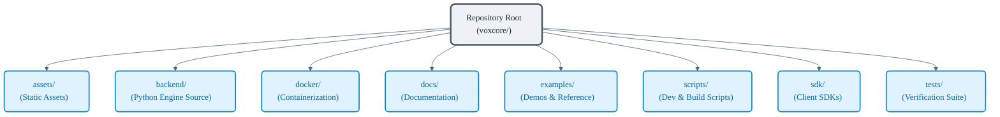
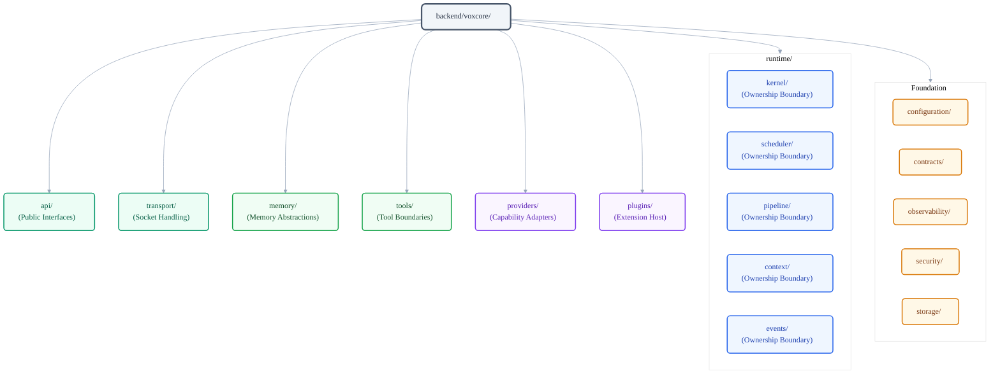

# VoxCore Source Tree Specification

This document defines the authoritative repository structure for VoxCore. It specifies the physical directory layout, package boundaries, naming conventions, and evolution rules of the codebase. 

This document answers the question: *Where shall every piece of source code live in the repository?* It shall not define runtime execution flows, communication protocols, module internals, or specific programming interfaces.

---

## 1. Purpose

The purpose of this document is to establish the physical layout of the VoxCore codebase. It serves as the single source of truth for directory organization. Developers, maintainers, and contributors must adhere to the structure defined herein to ensure the codebase remains modular, discoverable, and aligned with the architectural design defined in the System Architecture.

---

## 2. Repository Organization Philosophy

The physical structure of a repository is a direct reflection of its architectural health. VoxCore enforces a strict, design-driven directory layout to achieve the following goals:

- **Architectural Clarity**: The directory tree must communicate the system's design. A contributor should understand the core architectural components of VoxCore simply by browsing the repository structure, without needing to examine the underlying source code.
- **Discoverability**: Location rules must be intuitive. Code performing a specific function shall reside in a predictable directory.
- **High Modularity**: Boundaries between system layers must be reinforced physically by isolating them in distinct packages, preventing accidental leakage of implementation details.
- **Scalability**: The source tree must support the independent growth of backend runtime components, client SDKs, tests, and deployment infrastructure without creating organizational confusion.
- **Contributor Experience**: A clean, standard layout minimizes cognitive load, enabling new developers to onboard quickly and locate code changes easily.

---

## 3. Repository Design Principles

Every directory and package added to the repository must conform to the following design principles:

* **One Package, One Responsibility**: Each package shall own a single logical capability. Multi-purpose packages are prohibited.
* **High Cohesion**: Modules that frequently change together for the same logical reason must reside within the same package.
* **Low Coupling**: Packages must limit their external dependencies. Interaction between packages shall occur via stable, documented interfaces.
* **Stable Package Boundaries**: Packages must enforce encapsulated borders. Internal modules must remain private to the package.
* **Predictable Locations**: Code performing similar roles must occupy equivalent hierarchical positions across different layers.
* **Explicit Ownership**: Every package must have a designated responsibility mapping to an architectural component.
* **Shallow Directory Depth**: The directory structure should favor flat layouts. Nesting must not exceed three levels within the backend source tree.
* **No Miscellaneous Packages**: Creating catch-all directories (e.g., `misc/`, `common/`, `helpers/`) is prohibited.
* **No Generic Utilities**: Common helpers must reside within dedicated, domain-specific utility packages (e.g., `voxcore/backend/observability/logging`) rather than a single global `utils` package.
* **Architecture-Reflecting Physical Layout**: The physical source tree must mirror the logical layer groupings established in the System Architecture.
* **Repository Growth Policy**: No directory should be created only to organize files. Directories represent architectural ownership, not visual organization.

---

## 4. Top-Level Repository Structure

The top-level layout of the VoxCore repository separates the core backend runtime, client software development kits, testing frameworks, configurations, scripts, and documentation.

```
voxcore/
├── .github/
├── assets/
├── backend/
├── docker/
├── docs/
├── examples/
├── scripts/
├── sdk/
├── tests/
├── CHANGELOG.md
├── CONTRIBUTING.md
├── LICENSE
├── Makefile
├── pyproject.toml
├── README.md
├── ROADMAP.md
└── uv.lock
```

### Top-Level Directories

The repository must contain the following directories:

| Directory | Purpose |
| --- | --- |
| **`assets/`** | Contains static files, project logos, and diagrams referenced in the documentation. |
| **`backend/`** | Contains the core python runtime source code for the VoxCore engine. |
| **`docker/`** | Contains Dockerfiles, compose files, and containerization assets for local and production execution. |
| **`docs/`** | Holds all markdown documentation including SRS, System Architecture, and API specifications. |
| **`examples/`** | Contains reference implementations and integration demos demonstrating runtime capabilities. |
| **`scripts/`** | Utility scripts for builds, database migrations, CI tasks, and environment setups. |
| **`sdk/`** | Multi-language software development kits (e.g., Python, TypeScript) for client integration. |
| **`tests/`** | Unit, integration, and end-to-end tests validating system correctness. |

### Top-Level Configuration Files

The repository root must contain the following configuration files:

- **`pyproject.toml`**: The main configuration file for backend dependencies, packaging, linting, and testing tools.
- **`README.md`**: The project landing page, introduction, and quick-start instructions.
- **`ROADMAP.md`**: The project planning guide detailing future feature milestones.
- **`CHANGELOG.md`**: The log detailing changes, version updates, and migration notes.
- **`Makefile`**: Simple command wrappers for build, test, and formatting tasks.



---

## 5. Backend Source Tree

Every backend package represents an architectural ownership boundary rather than a deployment boundary or implementation convenience. Packages exist because the architecture requires them, not because the codebase has grown large.

The core engine is structured to mirror the runtime architecture layers. Nesting is kept shallow, exposing a clear division between public interfaces, core execution components, capability adapters, and foundation packages.

The layout of the `backend/` source tree is structured as follows:

```
backend/
└── voxcore/
    ├── api/
    ├── configuration/
    ├── contracts/
    ├── memory/
    ├── observability/
    ├── plugins/
    ├── providers/
    ├── runtime/
    │   ├── context/
    │   ├── events/
    │   ├── kernel/
    │   ├── pipeline/
    │   └── scheduler/
    ├── security/
    ├── storage/
    ├── tools/
    └── transport/
```

### Backend Package Responsibilities

Each package in the backend source tree has a designated capability and architectural boundary:

- **`voxcore/api/`**
  - **Purpose**: Defines public runtime interfaces including REST APIs, WebSocket routes, SDK bindings, and application entrypoints.
- **`voxcore/configuration/`**
  - **Purpose**: Owns runtime configuration abstractions, configuration sources, and configuration-related architectural boundaries.
- **`voxcore/contracts/`**
  - **Purpose**: Defines public protocol interfaces and base abstract classes. It shall not contain runtime logic.
- **`voxcore/memory/`**
  - **Purpose**: Owns runtime memory abstractions and memory-related package boundaries.
- **`voxcore/observability/`**
  - **Purpose**: Coordinates logging, system performance metrics, tracing spans, and error monitoring hooks.
- **`voxcore/plugins/`**
  - **Purpose**: Provides the extension host runtime enabling third-party modules to extend system capabilities.
- **`voxcore/providers/`**
  - **Purpose**: Houses external capability providers and vendor integration adapters.
- **`voxcore/runtime/`**
  - **Purpose**: Orchestrates core execution logic and encompasses the following sub-packages:
    - **`runtime/kernel/`**: Owns runtime lifecycle, bootstrap, dependency initialization, and runtime ownership boundaries.
    - **`runtime/scheduler/`**: Owns execution scheduling responsibilities.
    - **`runtime/pipeline/`**: Owns execution pipeline flow, streaming pipelines, and processing orchestrations.
    - **`runtime/context/`**: Owns session execution state, context scopes, and environment bindings.
    - **`runtime/events/`**: Owns event dispatching channels and pub-sub messaging boundaries.
- **`voxcore/security/`**
  - **Purpose**: Owns runtime security concerns and security-related architectural boundaries.
- **`voxcore/storage/`**
  - **Purpose**: Owns persistence abstractions and storage provider integrations.
- **`voxcore/tools/`**
  - **Purpose**: Owns tool abstractions and execution package boundaries.
- **`voxcore/transport/`**
  - **Purpose**: Owns transport protocols and runtime communication endpoints.



---

## 6. SDK Organization

To prevent dependency pollution and build-chain conflicts, client SDKs must reside in a dedicated top-level directory completely separated from the backend runtime. 

Each client language target must occupy its own subdirectory directly under the `sdk/` path:

```
sdk/
├── python/
└── typescript/
```

### SDK Structure Requirements

Every language SDK shall follow these structural rules:
- **Zero Runtime Dependencies on Backend**: SDKs are generated against stable public APIs. They must not import modules from the `backend/` directory. They must communicate exclusively via the public HTTP or WebSocket protocols.
- **Language Idioms**: Each SDK must conform to the packaging, naming conventions, and file structure rules standard to its language environment (e.g., standard `npm` package structures for TypeScript, and standard setup files for Python).

---

## 7. Tests Organization

The testing directory mirrors the architectural layers of the system. Test files must remain physically isolated from source modules, grouped by test type to separate rapid unit tests from complex end-to-end setups.

The directory layout for testing is defined as follows:

```
tests/
├── unit/
├── integration/
├── e2e/
├── fixtures/
└── helpers/
```

### Test Directory Responsibilities

- **`tests/unit/`**: Validates the logic of individual components in isolation. External dependencies and network access must be mocked or stubbed.
- **`tests/integration/`**: Verifies collaboration between multiple packages (e.g., interaction between the runtime and memory modules) without executing full network transports.
- **`tests/e2e/`**: Validates the complete runtime pipeline by launching the application and executing requests through the public API layers.
- **`tests/fixtures/`**: Stores static test files, mock payloads, pre-recorded audio files, and test settings.
- **`tests/helpers/`**: Contains shared assertion helper classes, mock servers, and test suite runners.

---

## 8. Documentation Organization

Engineering documentation is located in the `docs/` directory. It is organized into numbered folders representing progressively concrete design layers.

The directory layout for documentation is structured as follows:

```
docs/
├── 00-documentation-index.md
├── 01-software-requirements-specification.md
├── 02-system-architecture/
├── 03-package-architecture/
├── 04-module-design/
├── 05-api-specification/
└── 06-testing/
```

Documentation files must link to preceding design documents (e.g., a package specification must link to the corresponding system architecture component) to ensure traceability throughout the engineering process.

---

## 9. Repository Naming Conventions

Consistency in physical naming conventions is critical for discoverability. The following naming rules shall be enforced across the entire repository:

- **lowercase_snake_case**: All directory and file names in `backend/` and `tests/` must use lowercase alphanumeric characters separated by underscores.
- **Package Names**: Python packages in the source tree must use singular names representing their core capability (e.g., `voxcore/runtime`, not `voxcore/runtimes`).
- **No Abbreviations**: Package names should be spelled out in full to prevent ambiguity. Abbreviations must be avoided (e.g., use `voxcore/observability` instead of `voxcore/obs`).
- **Configuration Files**: Root configuration files must use the exact names expected by standard tools (e.g., `pyproject.toml`, `Makefile`).

---

## 10. Repository Evolution Rules

As VoxCore evolves, its directory structure should adapt to new requirements while preserving the architectural boundaries. Any physical layout changes must conform to the following evolution rules:

- **Introducing a New Top-Level Package**: A new package may only be introduced in the backend source tree when a capability does not fit within any existing package boundary, and its addition represents a new runtime concept defined in the System Architecture.
- **Splitting Packages**: An existing package should be split when its size exceeds typical modular bounds, or when it begins owning more than one primary responsibility.
- **Merging Packages**: Multiple packages may be merged when their boundary interactions become tightly coupled, or when their functional responsibilities merge under a simplified system model.
- **Immutable Package Names**: The core architectural package names in `backend/voxcore/` (such as `runtime/`, `api/`, and `providers/`) should remain stable. Renaming these packages is highly discouraged and shall require an approved Architecture Decision Record (ADR).

---

## 11. Traceability

Physical packages must not exist in isolation. Every source package and directory within the repository must trace back to:
- One or more logical components defined in the **System Architecture**.
- One or more functional or non-functional requirements defined in the **Software Requirements Specification (SRS)**.

Orphan packages (directories that contain source code but lack clear architectural mapping) are strictly prohibited. The package documentation (e.g., the package-specific design documents) must explicitly list these trace links.

---

## 12. Conclusion

The VoxCore source tree is the physical realization of the logical architecture. 

The Package Architecture documents define the approved organization of the VoxCore codebase. Implementation should conform to these documents unless an Architecture Decision Record explicitly supersedes them.

Every source file introduced into the repository should belong to exactly one package, every package should have one architectural owner, and every dependency should conform to the rules established in this documentation.

This ensures that the implementation remains a faithful realization of the System Architecture throughout the lifetime of the project.
