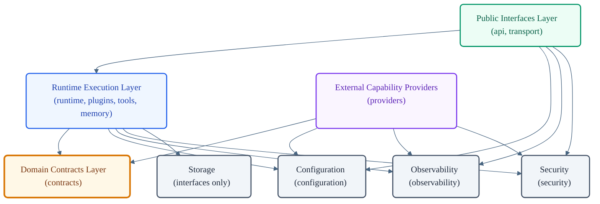
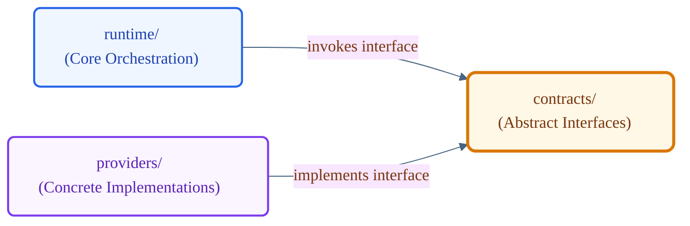
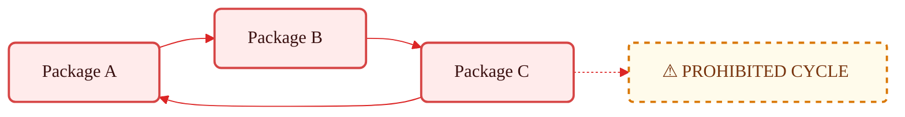

# VoxCore Package Dependency Rules

This document defines the authoritative dependency model for the VoxCore source code. It establishes the rules governing allowed and prohibited package dependencies, import directions, and visibility rules across the repository.

This document answers the question: *Which packages are permitted to depend on which other packages?* It shall not define runtime execution behavior, package responsibilities, communication protocols, implementation details, or specific source code import syntax.

---

## 1. Purpose

Package Architecture defines where source code lives. This document defines how packages may depend on one another. It establishes the dependency constitution of VoxCore, ensuring that the package layout remains modular and maintainable as the codebase scales. 

All code modifications must conform to the dependency boundaries and direction rules defined herein.

---

## 2. Why Dependency Rules Exist

In large-scale frameworks, the absence of explicit dependency rules leads to structural degradation:
- **Architecture Erosion**: Over time, high-level business logic packages depend on low-level infrastructure, leading to rigid designs.
- **Circular Imports**: Cyclic dependencies between packages cause runtime exceptions, initialization issues, and tightly bind independent domains.
- **Hidden Coupling**: Changes in one package cascade to unrelated packages, making refactoring high-risk and slow.
- **Unstable Dependencies**: High-stability core packages depending on low-stability external integrations are easily broken by changes in the integration layers.
- **Barrier to Scale**: The inability to evolve or test packages independently limits developer velocity and contributor autonomy.

Establishing a strict dependency hierarchy ensures packages remain decoupled, modular, testable, and capable of independent evolution.

---

## 3. Dependency Philosophy

Every dependency in the VoxCore source tree must satisfy the following principles:

* **Stable Dependency Direction**: Dependencies shall always point in the direction of stability. Stable packages (those whose interfaces change infrequently) must never depend on unstable packages (those containing concrete implementations or external drivers).
* **Abstractions First**: High-level packages must not depend on concrete implementations. They shall depend on abstract interfaces owned by contracts.
* **Unidirectional Imports**: Dependencies must flow in one direction only. Cyclic dependency trees, either direct or indirect, are strictly prohibited.
* **Encapsulated Internals**: Packages shall expose stable interfaces through designated public boundaries. Consumers must not import internal modules.
* **No Transitive Bypass**: Packages shall not utilize intermediate packages to bypass dependency rules or access prohibited abstractions.
* **No Reuse Convenience Dependencies**: A package shall never depend on another package merely because code reuse is convenient. Dependencies exist to model architectural relationships, not implementation convenience.

---

## 4. Dependency Direction

Dependencies within the repository must flow downwards through distinct structural layers, moving from delivery and interface packages, down through runtime orchestrators, and ending at contracts, persistence, and external adapters.

---

## 5. Valid Dependency Paths

To clarify import rules, developers must verify that their import paths conform to approved dependency chains:

### Valid Dependency Chains
- `api` → `runtime` → `contracts` → `providers` (Valid: Standard execution and adapter resolution)
- `api` → `runtime` → `storage` (Valid: Session persistence via runtime abstractions)
- `runtime` → `contracts` → `providers` (Valid: Decoupled interface execution)

### Prohibited Dependency Chains
- `api` → `providers` (Invalid: Bypasses orchestration and runtime layer)
- `runtime` → `transport` (Invalid: Inverts delivery direction)
- `providers` → `runtime` (Invalid: Drivers must not import execution kernel)

---

## 6. Dependency Matrix

The following matrix defines the permitted dependency rules between backend packages. Read rows as the source package attempting to import the target package in the columns.

| Source Package ↓ \ Target Package → | api | transport | runtime | memory | tools | providers | plugins | contracts | storage | observability | security | configuration |
| --- | :---: | :---: | :---: | :---: | :---: | :---: | :---: | :---: | :---: | :---: | :---: | :---: |
| **api** | ✕ | ✕ | ✓ | ✕ | ✕ | ✕ | ✕ | ◇ | ✕ | ✓ | ✓ | ✓ |
| **transport** | ✕ | ✕ | ✓ | ✕ | ✕ | ✕ | ✕ | ◇ | ✕ | ✓ | ✓ | ✓ |
| **runtime** | ✕ | ✕ | ✕ | ◇ | ◇ | ✕ | ✕ | ✓ | ◇ | ✓ | ✓ | ✓ |
| **memory** | ✕ | ✕ | ✕ | ✕ | ✕ | ✕ | ✕ | ✓ | ✕ | ✓ | ✕ | ✓ |
| **tools** | ✕ | ✕ | ✕ | ✕ | ✕ | ✕ | ✕ | ✓ | ✕ | ✓ | ✕ | ✓ |
| **providers** | ✕ | ✕ | ✕ | ✕ | ✕ | ✕ | ✕ | ✓ | ✕ | ✓ | ✓ | ✓ |
| **plugins** | ✕ | ✕ | ✕ | ✕ | ✕ | ✕ | ✕ | ✓ | ✕ | ✓ | ✓ | ✓ |
| **contracts** | ✕ | ✕ | ✕ | ✕ | ✕ | ✕ | ✕ | ✕ | ✕ | ✓ | ✕ | ✓ |
| **storage** | ✕ | ✕ | ✕ | ✕ | ✕ | ✕ | ✕ | ✓ | ✕ | ✓ | ✓ | ✓ |
| **observability** | ✕ | ✕ | ✕ | ✕ | ✕ | ✕ | ✕ | ✕ | ✕ | ✕ | ✕ | ✓ |
| **security** | ✕ | ✕ | ✕ | ✕ | ✕ | ✕ | ✕ | ✓ | ✕ | ✓ | ✕ | ✓ |
| **configuration** | ✕ | ✕ | ✕ | ✕ | ✕ | ✕ | ✕ | ✕ | ✕ | ✕ | ✕ | ✕ |

*Legend:*
- **`✓` Allowed**: Direct dependency permitted.
- **`◇` Restricted**: Allowed only through published interfaces/contracts.
- **`✕` Prohibited**: Importing is strictly forbidden.

---

## 7. Package Dependency Rules

Each package must strictly adhere to the following import guidelines:

### `voxcore/api/`
- **Allowed**: `runtime`, `observability`, `security`, `configuration`.
- **Restricted**: `contracts` (permitted only for interface consumption).
- **Prohibited**: `api`, `transport`, `memory`, `tools`, `providers`, `plugins`, `storage`.
- **Rationale**: `api` represents public runtime interfaces. It must initiate executions via the runtime layer, but it shall not access underlying core sub-systems (like tools, memory, or storage) or provider implementations directly.

### `voxcore/transport/`
- **Allowed**: `runtime`, `observability`, `security`, `configuration`.
- **Restricted**: `contracts` (permitted only for interface consumption).
- **Prohibited**: `api`, `transport`, `memory`, `tools`, `providers`, `plugins`, `storage`.
- **Rationale**: `transport` delivers messages, while `runtime` owns conversations. `transport` depends on `runtime` to dispatch incoming message streams and handles connections, but it must remain decoupled from specific integration drivers.

### `voxcore/runtime/`
- **Allowed**: `contracts`, `observability`, `security`, `configuration`.
- **Restricted**: `memory` (via abstractions), `tools` (via abstractions), `storage` (via abstractions).
- **Prohibited**: `api`, `transport`, `runtime`, `providers`, `plugins`.
- **Rationale**: The core runtime schedules work and coordinates pipelines. Runtime may depend on storage and memory abstractions exposed by their respective packages but shall not depend on provider-specific implementations. It discovers plugins via interfaces defined in contracts rather than direct imports.

### `voxcore/memory/`
- **Allowed**: `contracts`, `observability`, `configuration`.
- **Prohibited**: All other packages.
- **Rationale**: Memory owns runtime memory abstractions and memory-related package boundaries. Memory and Tools are runtime capability packages. They shall remain logically subordinate to Runtime even though they are physically separate packages. Memory must depend only on stable base contracts, observability logs, and configurations. It shall not import persistence engines or runtime states.

### `voxcore/tools/`
- **Allowed**: `contracts`, `observability`, `configuration`.
- **Prohibited**: All other packages.
- **Rationale**: Tools owns tool abstractions and execution package boundaries. Memory and Tools are runtime capability packages. They shall remain logically subordinate to Runtime even though they are physically separate packages. Tools must remain free of runtime, storage, or security dependencies, relying only on abstract contracts and settings.

### `voxcore/providers/`
- **Allowed**: `contracts`, `observability`, `security`, `configuration`.
- **Prohibited**: All other packages.
- **Rationale**: Providers houses external capability providers and vendor integration adapters. They must depend on domain contracts to implement required interfaces and utility frameworks, but they must not import core runtime systems.

### `voxcore/plugins/`
- **Allowed**: `contracts`, `observability`, `security`, `configuration`.
- **Prohibited**: All other packages.
- **Rationale**: Plugins provides the extension host runtime. Both tools and plugins depend on contracts to define their registration and execution interfaces, keeping plugins generic.

### `voxcore/contracts/`
- **Allowed**: `observability`, `configuration`.
- **Prohibited**: All other packages.
- **Rationale**: Contracts defines the base interfaces. To remain highly stable, it must not depend on any operational package in the system.

### `voxcore/storage/`
- **Allowed**: `contracts`, `observability`, `security`, `configuration`.
- **Prohibited**: All other packages.
- **Rationale**: Storage owns persistence abstractions and storage provider integrations. It must depend on domain interfaces in contracts and validation settings, but it shall not couple to specific runtime layers.

### `voxcore/observability/`
- **Allowed**: `configuration`.
- **Prohibited**: All other packages.
- **Rationale**: Observability coordinates logs, metrics, and spans. It must be universally importable; therefore, it must not depend on any package except global configuration.

### `voxcore/security/`
- **Allowed**: `contracts`, `observability`, `configuration`.
- **Prohibited**: All other packages.
- **Rationale**: Security owns runtime security concerns and security-related architectural boundaries, importing only domain contracts and global setup parameters.

### `voxcore/configuration/`
- **Allowed**: None.
- **Prohibited**: All other packages.
- **Rationale**: Configuration owns runtime configuration sources and configuration abstractions. It remains the most stable package in the repository.

---

## 8. Dependency Inversion

To maintain architectural boundaries, VoxCore enforces **Dependency Inversion**. High-level orchestrators and low-level drivers must communicate exclusively through abstract contracts.

- High-level core components (such as `runtime`) must not import concrete integrations from `providers`.
- Instead, `runtime` shall import and invoke interface definitions defined inside the stable `contracts` package.
- `providers` must import those same interfaces from `contracts` and implement them.
- During system boot, the dependency injector maps the concrete provider implementations into the runtime, keeping runtime and providers decoupled.

---

## 9. Circular Dependency Prevention

Circular dependencies (e.g., A imports B, B imports C, C imports A) violate the unidirectional flow of the package architecture. They impede code validation, break local testing suites, and cause boot errors.

- Direct circular dependencies must not be introduced under any circumstances.
- Indirect or transitive circular loops (traversing multiple intermediate packages) are strictly prohibited.
- All code submissions must be analyzed during continuous integration (CI) workflows using static analysis tools to verify the dependency graph remains acyclic.

---

## 10. Internal Visibility

Packages must strictly encapsulate their internal modules to maintain stable boundaries:
- A package shall expose its public capability set exclusively via a designated export entry point (such as `__init__.py` in Python or a main index file in TypeScript).
- Consumer packages must only import items exported by this public boundary.
- Directly importing internal files or sub-modules of another package (e.g., reaching past the root of a package into its private folder tree) is prohibited.

---

## 11. Dependency Review Checklist

When submitting or reviewing changes, developers and maintainers must verify that imports conform to these checks:

1. **Does the change introduce an import not allowed in the Dependency Matrix?**
2. **Does the change create a direct or indirect circular dependency cycle?**
3. **Does a runtime component depend on a concrete provider implementation instead of an abstract contract interface?**
4. **Does the new code import private or internal sub-modules of another package directly?**
5. **Is the dependency stable (does a high-stability package import a lower-stability module)?**
6. **Has a new package been introduced without updating the dependency matrix and obtaining ADR approval?**

---

## 12. Future Evolution

The dependency matrix defined in this document represents a frozen architectural contract. 
- Modification of allowed dependency paths shall require a formal Architecture Decision Record (ADR) and updates to the Dependency Matrix.
- New packages introduced to the repository must be added to the dependency matrix and individual rules, explicitly defining their allowed imports before code is merged.

---

## 13. Conclusion

A stable, unidirectional dependency hierarchy is essential for the long-term maintainability and scale of VoxCore. By preventing circular dependencies, enforcing dependency inversion, and restricting visibility, we ensure that the codebase remains clean, testable, and robust against architecture erosion throughout the lifecycle of the project.
