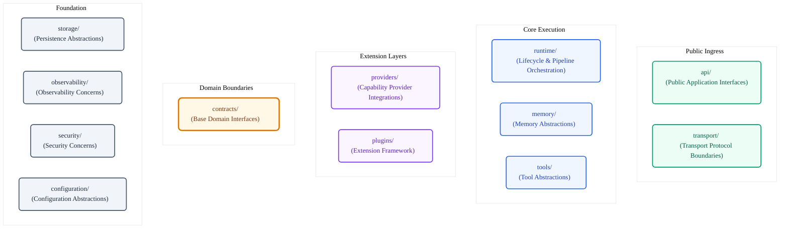
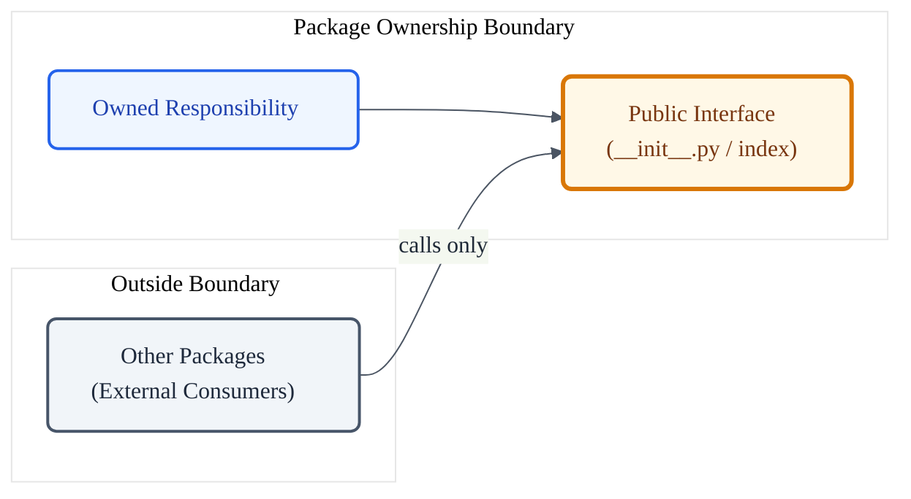

# VoxCore Package Responsibilities

This document defines the single, authoritative architectural responsibility of every package in the VoxCore source tree. It establishes the ownership boundaries, explicit non-responsibilities, and boundary protection rules governing the repository structure.

This document answers the question: *Which package owns which architectural responsibility?* It shall not define runtime execution pipelines, package dependency hierarchies, communication protocol specifications, low-level algorithms, or implementation source code.

---

## 1. Purpose

The Package Responsibilities document establishes the strict distribution of design ownership across the VoxCore repository. To prevent architectural erosion and maintain low coupling, each package must own a single, coherent architectural concern. 

No package shall duplicate or absorb the responsibilities assigned to another package. Developers and reviewers must reference these definitions to determine where new modules, features, or utilities belong in the source tree.

---

## 2. Why Package Ownership Matters

Without explicitly documented ownership boundaries, growing repositories degrade structurally due to common anti-patterns:
- **Duplicated Logic**: Similar helper routines, data structures, or adapters are implemented in multiple directories because ownership is unclear.
- **Misplaced Logic**: Business rules are written in delivery or driver layers, leading to brittle code that is difficult to refactoring or test in isolation.
- **Architecture Erosion**: Package boundaries dissolve as modules start performing auxiliary functions outside their core domain.
- **Oversized Packages**: Individual directories accumulate unrelated modules, turning clean folders into large, unmaintainable monoliths.
- **Contributor Confusion**: Developers cannot easily identify which package is responsible for a specific behavior, increasing onboarding time and pull request friction.

Defining clean ownership boundaries ensures the codebase remains modular, discoverable, and aligned with the architectural design throughout the lifetime of the project.

---

## 3. Ownership Philosophy

Every package in the VoxCore source tree shall adhere to the following ownership guidelines:

* **Single Responsibility Ownership**: A package must own exactly one architectural concern. 
* **Zero Responsibility Overlap**: No two packages shall share or duplicate the same responsibility.
* **Explicit Boundary Delineation**: Package scopes must be explicitly defined, including what the package is responsible for and what it must never own.
* **Cross-Cutting Isolation**: Shared utilities and cross-cutting concerns (e.g., logging, validation, configuration) must reside in dedicated foundation packages, never leaking into core execution modules.
* **Interface-Driven Encapsulation**: A package owns its internal behavior. It shall expose this behavior only through a stable public interface, hiding all private implementations from external consumers.
* **Architecture-Driven Distribution**: Package responsibilities must be derived directly from the logical layers defined in the System Architecture, never adjusted merely for implementation convenience.

---

## 4. Responsibility Matrix

The following matrix summarizes the architectural ownership boundaries for every backend package in the VoxCore repository.

| Package | Owns | Must Not Own |
| --- | --- | --- |
| **api** | Public application interfaces, inbound runtime requests, and external request translation. | Core execution logic, session memory, network socket streams, or database drivers. |
| **transport** | Transport protocols, low-level network communication interfaces, and raw data stream handling. | Conversation orchestration, tool definitions, session context state, or auth algorithms. |
| **runtime** | Core runtime lifecycle, runtime execution coordination, runtime scheduling, runtime execution pipeline, runtime context, and the runtime event system. | Concrete provider drivers, transport listener sockets, persistence queries, or security validations. |
| **memory** | Session runtime memory abstractions and conversation context storage structures. | Persistent database connections, external LLM calls, tool execution, or REST endpoints. |
| **tools** | Tool execution abstractions, action definition structures, and agent tool execution boundaries. | LLM model parsing, pipeline scheduling, socket transport, or security verification. |
| **providers** | External capability integrations and driver-specific adapters. | Main pipeline scheduling, session memory states, tools execution, or public API schemas. |
| **plugins** | Extension host runtime, plugin loader boundaries, and integration sandboxes. | Core execution kernel, tools registration, configuration files, or database clients. |
| **contracts** | System-wide abstract interfaces, domain protocol declarations, and base contracts. | Any operational logic, runtime state execution, or external network calls. |
| **storage** | Persistence abstractions, database adapters, and persistence driver integrations. | Active conversation state, transport socket streams, or API endpoint controllers. |
| **observability** | Metrics, logs, traces, spans, and debugging hook boundaries. | Runtime configuration loading, session state, transport frames, or authentication. |
| **security** | Encryption abstractions, token verification, and security boundaries. | REST api endpoints, database connections, pipeline schedulers, or system metrics. |
| **configuration** | Runtime configuration loading, configuration sources, and setting boundaries. | Active runtime state, data encryption keys, external api queries, or transport listeners. |

---

## 5. Individual Package Responsibilities

Every package must maintain the exact purpose, ownership, and boundaries defined below:

### `voxcore/api/`
- **Purpose**: Exposes public runtime entrypoints for client integrations.
- **Owns**:
  - Public application interfaces (REST endpoints and WebSocket events).
  - Inbound runtime requests.
  - External request translation.
- **Must Not Own**:
  - Main pipeline scheduling or execution logic.
  - Active conversation memory buffers.
  - Low-level network socket transport handles.
- **Rationale**: Isolating the public interface layer ensures that delivery protocols can change (e.g., adding gRPC or CLI bindings) without modifying the core execution engine.

### `voxcore/transport/`
- **Purpose**: Owns transport protocols and runtime communication endpoints.
- **Owns**:
  - Low-level protocol bindings and network socket handles.
  - Inbound and outbound raw network streams.
  - Transport-layer network communication boundaries.
- **Must Not Own**:
  - Conversation orchestration or session state.
  - Message content parsing or tool executions.
  - User authentication and access rules.
- **Rationale**: Network-level transport details must remain completely decoupled from the conversational runtime to support diverse network layers.

### `voxcore/runtime/`
- **Purpose**: Owns the core conversational runtime platform and coordinates runtime execution.
- **Owns**:
  - Runtime lifecycle (`runtime/kernel`).
  - Runtime execution coordination (`runtime/scheduler`).
  - Runtime scheduling (`runtime/scheduler`).
  - Runtime execution pipeline (`runtime/pipeline`).
  - Runtime context (`runtime/context`).
  - Runtime event system (`runtime/events`).
- **Must Not Own**:
  - Concrete provider drivers or external driver code.
  - Transport listening sockets.
  - Database queries and persistence integrations.
- **Rationale**: Isolating the runtime ensures the central execution kernel remains stable, regardless of changes to external providers, protocols, or storage engines.

### `voxcore/memory/`
- **Purpose**: Owns runtime memory abstractions and memory-related package boundaries.
- **Owns**:
  - Conversation memory abstractions.
  - Runtime memory policies.
  - Session-scoped memory ownership.
- **Must Not Own**:
  - Database connections or long-term file storage.
  - LLM model queries or API driver parsing.
  - Public API ingress schemas.
- **Rationale**: Memory handles active context during an active session, keeping the memory structures distinct from persistent storage databases.

### `voxcore/tools/`
- **Purpose**: Owns tool abstractions and execution package boundaries.
- **Owns**:
  - Tool abstractions.
  - Tool metadata.
  - Tool contracts.
  - Tool registration.
- **Must Not Own**:
  - Conversation pipeline scheduling.
  - Tool execution (this belongs to the Runtime).
  - Public endpoint configurations.
- **Rationale**: Tools represents the abstract definitions and contracts for actions, leaving execution responsibilities to the core runtime pipeline.

### `voxcore/providers/`
- **Purpose**: Houses external capability providers and vendor integration adapters.
- **Owns**:
  - Translation of internal domain abstractions to external vendor APIs.
  - External capability integrations.
  - External network interaction logic with vendor services.
- **Must Not Own**:
  - Central scheduling or streaming pipelines.
  - Public HTTP/WebSocket routes.
  - Active session memory states.
- **Rationale**: Isolating integration adapters under `providers` ensures vendor API changes do not propagate into the core runtime codebase.

### `voxcore/plugins/`
- **Purpose**: Provides the extension host runtime.
- **Owns**:
  - Extension framework.
  - Plugin lifecycle.
  - Plugin discovery.
  - Plugin registration.
- **Must Not Own**:
  - Core pipeline scheduler logic.
  - Core tool registration interfaces.
  - Persistent database configurations.
- **Rationale**: The plugin system acts as a generic extension host, executing external code without being coupled to specific runtime tools or pipelines.

### `voxcore/contracts/`
- **Purpose**: Defines public protocol interfaces and base abstract classes.
- **Owns**:
  - Abstract class interfaces.
  - System-wide domain protocol declarations.
  - Shared contract definitions.
- **Must Not Own**:
  - Any operational logic or state changes.
  - External network drivers.
  - Configuration loading code.
- **Rationale**: Keeping contracts completely stateless and interface-only provides a highly stable base layer that all packages can depend on without causing circular coupling.

### `voxcore/storage/`
- **Purpose**: Owns persistence abstractions and storage provider integrations.
- **Owns**:
  - Persistence abstractions.
  - Persistence services.
  - Storage provider integrations.
- **Must Not Own**:
  - Active conversation session buffers.
  - Public API controller schemas.
  - Raw socket transport listeners.
- **Rationale**: Persistence operations are decoupled from runtime memory buffers, isolating long-term storage mechanisms from volatile session structures.

### `voxcore/observability/`
- **Purpose**: Coordinates logging, system performance metrics, tracing spans, and error monitoring hooks.
- **Owns**:
  - Metrics tracking and tracing spans.
  - Logging interfaces and log dispatch handlers.
  - Error monitoring hooks and boundaries.
- **Must Not Own**:
  - Configuration sources or setting parsers.
  - Session execution logic.
  - User credentials or authentication scopes.
- **Rationale**: Observability must remain a passive support package, providing monitoring hooks without affecting application runtime behavior.

### `voxcore/security/`
- **Purpose**: Owns runtime security concerns and security-related architectural boundaries.
- **Owns**:
  - Encryption and decryption interfaces.
  - Token and credential validation boundaries.
  - Security configuration parameters.
- **Must Not Own**:
  - REST route logic or WebSocket protocol handlers.
  - Database integrations or persistence drivers.
  - Processing pipeline logic.
- **Rationale**: Security concerns are isolated to protect credentials and keys, ensuring validation logic remains untangled from transportation or delivery details.

### `voxcore/configuration/`
- **Purpose**: Owns runtime configuration sources and configuration abstractions.
- **Owns**:
  - Configuration abstractions.
  - Configuration sources.
  - Configuration ownership.
- **Must Not Own**:
  - Active conversation state.
  - Encryption key storage.
  - Network sockets.
- **Rationale**: As the most stable package, configuration defines validation boundaries for environmental values without depending on or knowing about operational sub-systems.

---

## 6. Ownership Boundaries

A package must own its behavior and its internal data boundaries. It shall not own or mutate the internal state of other packages:
- **Single Ownership Principle**: Every architectural responsibility shall have exactly one owning package. No architectural responsibility shall have multiple owners.
- **Boundary Protection**: Interaction between packages must occur exclusively through the target package's public interfaces. Directly modifying internal attributes of an external package is prohibited.
- **Leakage Prevention**: Implementation details of a package (such as a database client or external network driver) must not leak into consumer packages. The consumer package must interact only with the clean abstractions exposed by the owner.

---

## 7. Cross-Cutting Packages

Foundation packages (`observability`, `security`, `configuration`) are cross-cutting concerns.
- These packages must not drive the conversational runtime loop or manage active sessions.
- They serve as supporting layers, providing services (e.g., config parsing, metrics tracking, token verification) that other packages consume.
- To prevent circular coupling, cross-cutting packages must remain highly stable and must not depend on delivery or execution modules.

---

## 8. Ownership Conflict Resolution

When a new capability or module appears to belong to multiple packages, developers must resolve the conflict using the following process:

1. **Identify the Core Concern**: Analyze the primary goal of the module. If it implements external vendor integration, it belongs in `providers`. If it schedules execution, it belongs in `runtime`.
2. **Follow Dependency Rules**: Check if placing the code in a package violates the dependency matrix. If a package would require a prohibited dependency to house the code, that package is the wrong location.
3. **Prefer Extending Existing Abstractions**: If a package already handles a related capability, extend that package rather than creating a new boundary.
4. **Escalate with ADR**: If ownership remains ambiguous or requires splitting existing boundaries, developers shall raise an Architecture Decision Record (ADR) to clarify the design before implementation changes are merged.

---

## 9. Code Review Checklist

During pull request reviews, reviewers must verify compliance against the following ownership checks:

- **Is the new code placed in the single package that owns that architectural concern?**
- **Does this change cause a package to own multiple distinct concerns?**
- **Are internal implementation details of a package leaking out to consumer packages?**
- **Does this code duplicate a capability already owned by another package?**
- **Is a cross-cutting package (like security or observability) trying to drive runtime conversation state?**
- **Are all interactions with external packages routed through their stable public interfaces?**

---

## 10. Future Evolution

The package ownership assignments defined in this document represent a frozen design contract.
- Any change to package responsibilities, merging of package boundaries, or splitting of existing packages must undergo formal architectural review.
- Modifying these boundaries shall require an approved Architecture Decision Record (ADR) and subsequent updates to this document.

---

## 11. Conclusion

Explicit package ownership is essential to ensure that VoxCore remains modular, discoverable, and maintainable. By defining strict boundaries, documenting prohibited responsibilities, and isolating cross-cutting utilities, we guarantee that every piece of source code has a single designated owner throughout the project lifecycle.

---

## 12. Diagrams

### Package Ownership Map

### Ownership Boundary Principle

