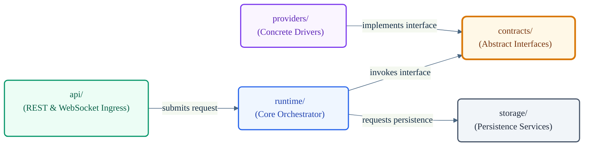
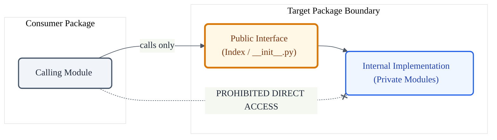

# VoxCore Package Communication

This document defines how packages collaborate with one another while respecting ownership boundaries and dependency rules. It establishes the permitted and prohibited interaction patterns, communication boundaries, and encapsulation rules across the repository.

This document answers the question: *How should packages communicate without violating architectural boundaries?* It shall not define runtime execution flows, scheduling routines, network protocol payload schemas, package dependency directions, low-level algorithms, or implementation source code.

---

## 1. Purpose

The Package Communication document establishes the rules for inter-package collaboration in VoxCore. While packages must collaborate to execute workflows, this collaboration must never compromise package encapsulation or bypass architectural boundaries. 

Communication exists solely to invoke the designated capabilities of an owning package, ensuring that logical components remain decoupled and maintainable throughout the lifetime of the project.

---

## 2. Why Communication Rules Matter

In complex software platforms, the lack of defined communication protocols between packages leads to systemic issues:
- **Tight Coupling**: Packages invoke each other's private sub-modules directly, turning a modular structure into a tightly bound monolith.
- **Hidden Dependencies**: Inter-package calls bypass main contracts, creating undocumented dependencies that break when modules are refactored.
- **Duplicated Logic**: Packages perform task operations belonging to other packages because they lack a clean mechanism to request those capabilities.
- **Boundary Leakage**: Low-level implementation details (such as database sessions or network sockets) are passed across layers, leaking private concerns.
- **Architecture Erosion**: The clean layers defined in the System Architecture dissolve as packages interact arbitrarily without following hierarchical design rules.
- **Testing Constraints**: The inability to isolate packages makes testing individual components in isolation difficult or impossible.

Formalizing communication boundaries guarantees that collaboration occurs cleanly, safely, and predictably.

---

## 3. Communication Philosophy

Every package interaction in the VoxCore source tree must satisfy the following principles:

* **Collaborative Interaction**: Packages shall collaborate to fulfill tasks, but they must not attempt to control or orchestrate one another's internal execution state.
* **Respect for Ownership**: A package shall only request capabilities owned by another package. It must never perform actions belonging to that domain itself.
* **Interface-Only Communication**: Packages must communicate exclusively through stable, published public interfaces. Reaching past the public interface is prohibited.
* **Encapsulation Preservation**: Package interactions must preserve data hiding. Private implementation details and internal state must never leak to consumers.
* **Unidirectional Collaboration**: Package collaborations must conform to the dependency direction. Reverse or circular collaboration loops are prohibited.
* **Abstractions First**: Packages should communicate through abstract interfaces defined in domain contracts, rather than depending directly on operational classes.

---

## 4. Communication Model

Package interaction in VoxCore follows a strict **Request-Response Model** based on ownership boundaries:

```
[Consumer Package] -- (1) Requests Capability --> [Owner Package]
[Consumer Package] <-- (2) Returns Domain Result -- [Owner Package]
```

- **Ownership Preservation**: The consumer package requests a capability; the owner package executes the request within its own boundary and returns a safe domain result. Ownership of the behavior and underlying resources never transfers.
- **No State Manipulation**: The consumer package shall not directly modify, mutate, or access the internal state variables of the owner package.
- **Request-Oriented Execution**: Interactions must remain request-driven. A package calls a public interface method and receives a return value. Active manipulation of one package by another is prohibited.

---

## 5. Allowed Communication Patterns

To collaborate safely, packages must use only the following approved communication patterns:

- **Public Interface Communication**: Packages shall communicate only through the stable public interface exposed by another package. The underlying implementation mechanism is language-specific and is intentionally outside the scope of this document.
- **Interface-Based Collaboration**: Designing components that consume abstract interfaces (defined in `contracts`) and invoking those interfaces at runtime.
- **Dependency Injection**: Package collaboration should be established by supplying required capabilities through declared abstractions rather than constructing dependencies internally.
- **Contract Implementations**: Packages implementing the abstract interfaces defined in `contracts` to expose their capabilities to the rest of the system.
- **Capability Requests**: Requesting a dedicated capability from a subordinate package (e.g., `runtime` requesting active conversation memory from `memory` via an interface) and receiving a structured domain model in response.

---

## 6. Prohibited Communication Patterns

The following interaction patterns violate the Package Architecture and must not be used:

- **Importing Internal Modules**: Reaching past the public entrypoint of a package to import its internal helper files or private classes.
- **Modifying Another Package's State**: Mutating the configurations, settings, or runtime attributes of another package directly.
- **Bypassing Runtime**: A delivery package (such as `api` or `transport`) communicating directly with database packages (`storage`) or capability integrations (`providers`), bypassing the runtime orchestration layer.
- **Bypassing Contracts**: High-level orchestrators interacting directly with low-level capability providers without utilizing the abstract interfaces defined in `contracts`.
- **Circular Collaboration**: Package A invoking Package B, which transitively invokes Package A to complete the same request.
- **Reaching into Implementation Details**: Passing database session variables, raw connection objects, or provider-specific SDK handles across package boundaries.
- **Convenience Shortcuts**: Accessing database logic or utility scripts directly in delivery controllers to avoid writing proper domain runtime mappings.

---

## 7. Package Collaboration Examples

The following table defines the purpose and scope of permitted collaborations between the major backend packages in VoxCore.

| Package | May Collaborate With | Purpose of Collaboration |
| --- | --- | --- |
| **api** | `runtime` | Submits inbound client requests to the execution kernel. |
| **transport** | `runtime` | Dispatches incoming raw communication streams to the execution pipeline. |
| **runtime** | `contracts` | Invokes abstract interfaces to drive memory, tools, and capability providers. |
| **runtime** | `storage` | Requests persistence capabilities through storage abstractions. |
| **providers** | `contracts` | Implements capability interfaces (e.g., speech or language model contracts). |
| **plugins** | `contracts` | Loads and manages extensions via defined plugin contracts. |
| **security** | `contracts` | Provides security-related capabilities through published interfaces. |

---

## 8. Public Interface Rule

Every package in the repository must enforce a strict public interface boundary:
- A package shall expose its public capability set exclusively via a designated export entry point (such as `__init__.py` in Python or a main index file in TypeScript).
- Consumer packages must only import items exported by this public boundary.
- Directly importing internal files or sub-modules of another package (e.g., reaching past the root of a package into its private folder tree) is prohibited.

---

## 9. Communication Ownership

Package communication must never transfer architectural ownership of capabilities or resources.
- When `runtime` requests active conversation context from `memory`, the `memory` package remains the sole owner of memory allocations and memory policies.
- When `runtime` requests persistence capabilities from `storage`, the `storage` package remains the sole owner of persistence behavior and persistence-related resources.
- The calling package must treat the returning domain result as a read-only or immutable representation, leaving data mutation and state management to the owner package.

---

## 10. Review Checklist

When validating pull requests, reviewers must verify that inter-package communication conforms to the following guidelines:

- **Is the interaction routed exclusively through the target package's public interface?**
- **Does the communication preserve package encapsulation, keeping private classes private?**
- **Is the dependency direction respected during the communication loop?**
- **Does the calling package attempt to mutate the internal state of the owner package directly?**
- **Are low-level implementation details (like connection variables or driver handles) leaking across boundaries?**
- **Does the collaboration bypass required layers (e.g., API directly calling a provider implementation)?**

---

## 11. Future Evolution

The communication rules defined in this document represent a frozen design contract.
- Any new communication mechanism, protocol integration, or cross-package pattern must undergo architectural review.
- Introducing a new communication channel shall require an approved Architecture Decision Record (ADR) and subsequent updates to this document.

---

## 12. Conclusion

Packages within VoxCore must collaborate through well-defined, stable public interfaces. By restricting communication patterns, enforcing dependency inversion, and protecting package boundaries, we guarantee that inter-package collaboration does not lead to tight coupling, ensuring the system remains modular, testable, and maintainable throughout its lifetime.

---

## 13. Diagrams

### Package Collaboration Model



### Public Interface Boundary


