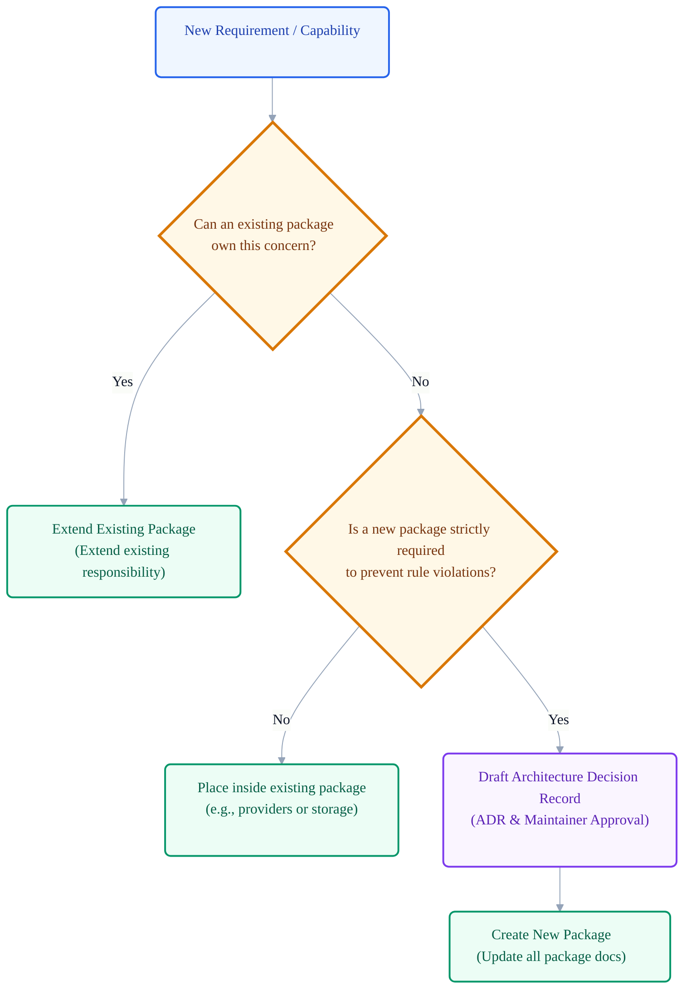
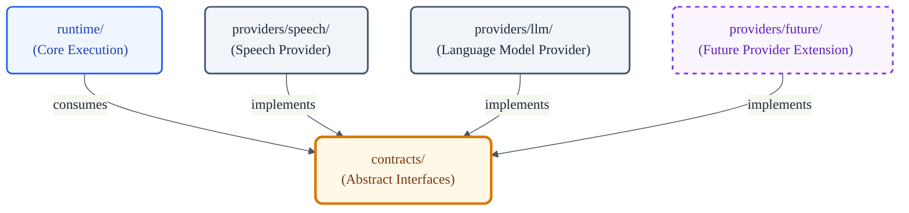
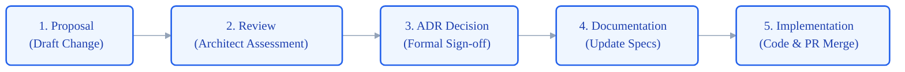

# VoxCore Package Extension Rules

This document defines how the package architecture may evolve safely over time. It establishes the rules for introducing new packages, sub-packages, capability providers, tools, plugins, system capabilities, and infrastructure packages without violating the approved architecture.

This document answers the question: *How may the package architecture evolve without compromising the existing architecture?* It shall not define runtime execution flows, scheduling patterns, communication protocol payload details, low-level algorithm implementations, or API schemas.

---

## 1. Purpose

The Package Extension Rules document governs the architectural evolution of the VoxCore repository. To prevent structural degradation, the codebase must evolve through a highly deliberate, controlled, and standardized process. 

The goal of this document is to ensure that VoxCore remains extensible for future AI requirements without sacrificing the consistency, encapsulation, and boundary constraints established by the Package Architecture.

---

## 2. Why Extension Rules Exist

Without strict rules governing architectural growth, modular systems face critical issues:
- **Architecture Erosion**: Uncoordinated updates gradually dissolve the boundaries between logical layers, reintroducing tight coupling.
- **Uncontrolled Growth**: Developers introduce new packages for minor, specialized utilities, resulting in a fragmented repository.
- **Inconsistent Package Creation**: Packages are created using ad-hoc naming, structural styles, or layout configurations.
- **Duplicated Capabilities**: Multiple packages are created to solve the same or highly similar problems due to poor awareness of existing package scopes.
- **Unstable Architecture**: The core package dependency rules and responsibilities undergo frequent changes, breaking stability for downstream developers.
- **Contributor Confusion**: Unregulated changes make it difficult for new contributors to understand where new code belongs, leading to architectural misalignments.

Establishing governance around system extensions ensures that VoxCore remains stable and clean as it grows.

---

## 3. Extension Philosophy

Every modification or addition to the VoxCore package architecture must adhere to the following principles:

* **Extend Before Replacing**: Developers shall extend existing packages and architectural abstractions before introducing new structures.
* **Reuse Before Creating**: Existing abstractions, utility functions, and configurations must be reused before introducing new components.
* **Preserve Ownership Boundaries**: New code must align with the single architectural concern of its target package. Responsibilities must never overlap.
* **Preserve Dependency Direction**: All package extensions must respect the unidirectional downward flow of dependencies. Bypassing layers is prohibited.
* **Preserve Communication Boundaries**: Collaboration must occur exclusively through published public interfaces, maintaining the encapsulation of internal modules.
* **Seamless Architecture Integration**: New capabilities must integrate smoothly into the existing architecture by implementing established contracts.
* **Last Resort Package Creation**: Creating a new package is the last resort, not the default solution. New packages require extensive justification and formal approval.

---

## 4. Extension Decision Process

Contributors must follow a structured evaluation sequence before attempting to introduce a new package, provider, tool, or plugin:

1. **Assess Ownership Compatibility**: Can an existing package logically own this responsibility? If the capability fits the scope of a current package, it must be placed there.
2. **Distinguish Capability from Implementation**: Is this a brand-new system capability, or is it a new implementation of an existing capability? If it is a new driver or implementation, it belongs in an existing package (e.g., `providers` or `storage`) rather than a new top-level package.
3. **Check for Existing Abstractions**: Does a contract or abstract interface already exist that represents this concern? If so, the new component must implement that abstraction.
4. **Evaluate Package Necessity**: Is a new package strictly required to prevent circular dependencies or to protect boundaries? A new package is only justified if housing the code in an existing package violates dependency rules.
5. **Verify Design Conformity**: Does the proposed change preserve all core architectural principles (unidirectional dependencies, public interface boundaries, and single responsibility)?

---

## 5. Adding New Packages

If the extension decision process confirms that a new package is necessary, the addition must adhere to the following rules:

- **Architectural Justification**: The new package must possess a single, unique, and clearly defined architectural responsibility that does not overlap with any existing package.
- **Zero Responsibility Duplication**: The package must not duplicate or assume responsibilities already assigned to other packages in the repository.
- **Authoritative Updates**: The new package must be added to all authoritative Package Architecture documents, including:
  - [Source Tree](01-source-tree.md) (defining layout and folders).
  - [Package Dependency Rules](02-package-dependency-rules.md) (defining its position in the dependency matrix).
  - [Package Responsibilities](04-package-responsibilities.md) (defining its Owns and Must Not Own bounds).
  - [Package Communication](05-package-communication.md) (defining its collaboration boundaries).
- **Formal Approval**: Introducing a new package shall require an approved Architecture Decision Record (ADR) signed off by the lead maintainers.

---

## 6. Adding New Providers

Providers are designed to extend the system's capabilities without changing its core architecture:
- **Capability Extension**: Providers (e.g., speech-to-text, text-to-speech, language models, embeddings, or future cognitive AI integrations) must reside inside the `providers` package.
- **Runtime Stability**: Adding a new provider must not require modifications to the core conversational `runtime`.
- **Contract Adherence**: Every provider must implement an abstract interface defined within the `contracts` package. Providers must not expose unique vendor-specific methods to runtime consumers; they must translate vendor APIs to fit the approved contract.

---

## 7. Adding New Plugins

Plugins extend the framework's capabilities through defined extension points:
- **Integration Constraints**: Plugins must integrate exclusively through the published extension points exposed by the plugin loader (`plugins`).
- **No Internals Modification**: Plugins must never modify or monkey-patch the internal code, state, or private classes of the `runtime` or other core packages.
- **Sandboxed Execution**: Plugins operate within their defined sandbox, using only public interfaces to interact with the core platform.

---

## 8. Adding New Tools

Tools provide execution capabilities within the conversational workflow:
- **Tool Integration**: Tools shall integrate with the runtime through the extension mechanisms defined by the Runtime Architecture.
- **Contract Enforcement**: Every tool must implement the base tool contracts defined in `contracts` and registration interfaces managed by `tools`.
- **Ownership Preservation**: Tools must respect boundary constraints. They shall not directly access or modify conversation memory or runtime scheduler states, querying them instead through the runtime orchestrator's public interface.

---

## 9. Adding New Capabilities

When the framework requires entirely new capabilities (such as Vision, OCR, Translation, Image Generation, Agent Scheduling, or Vector Search), they must be evaluated architecturally before any package changes are made:
- **Abstract Integration**: The capability must first be represented as an abstract interface within the `contracts` package.
- **Provider-Based Drivers**: Concrete implementations shall be placed within the appropriate implementation package (such as providers or storage) according to the architectural responsibility they fulfill.
- **Pipeline Orchestration**: The invocation of the capability must be orchestrated by the `runtime` pipeline.
- **Boundary Protection**: A new top-level package must not be created for a capability if it can be represented as a contract implementation inside `providers` or `storage`.

---

## 10. Architectural Governance

The VoxCore architecture evolves deliberately, not automatically. Any change that modifies package layout, dependency direction, or communication paths must go through the formal governance workflow:

1. **Proposal**: A developer creates a draft proposal outlining the required capability and architectural impact.
2. **Architectural Review**: Maintainers and software architects review the proposal to ensure it respects encapsulation and decoupling principles.
3. **Architecture Decision Record (ADR)**: An ADR is drafted, detailing the problem, context, options considered, and the final decision.
4. **Documentation Update**: The author updates the package architecture documents (`01-source-tree.md`, `02-package-dependency-rules.md`, `04-package-responsibilities.md`, `05-package-communication.md`, and this document).
5. **Implementation**: Code changes are implemented and merged only after documentation updates and the ADR are finalized and frozen.

---

## 11. Review Checklist

When verifying pull requests that extend the package structure, reviewers must check:

- **Is a new package strictly necessary, or can an existing package own this capability?**
- **Does the new component duplicate or overlap with any existing capabilities?**
- **Does the extension preserve all package dependency rules and communication boundaries?**
- **Has the contributor updated the Source Tree, Dependency Rules, Responsibilities, and Communication documents?**
- **If a new package is introduced, has an approved ADR been created and referenced?**
- **Does the new provider implement contracts defined in the contracts package without leaking vendor-specific structures?**
- **Does the change preserve the core runtime pipeline's stability?**

---

## 12. Future Evolution

As VoxCore grows, the architecture is expected to evolve to support new AI modalities. However, evolution must focus on increasing system clarity rather than adding complexity:
- Refactoring packages to improve cohesion is encouraged.
- Creating specialized package chains that violate layer hierarchies is prohibited.
- Maintainers must review the repository layout periodically to ensure developers are not accumulating misplaced logic in core folders.

---

## 13. Conclusion

The package extension rules guarantee that VoxCore remains highly extensible for future voice AI integrations while maintaining its strict structural integrity. By treating package creation as a last resort and enforcing interface-driven contracts for providers, plugins, and tools, we ensure the repository remains discoverable, maintainable, and robust.

---

## 14. Diagrams

### Extension Decision Flow

### Provider Extension Model

### Architecture Evolution Governance

