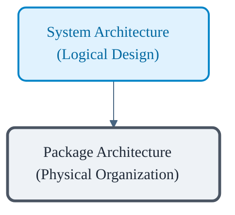
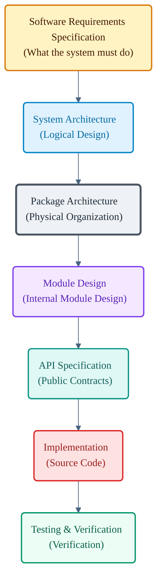

# VoxCore Package Architecture

This document is the entry point and navigation guide for the VoxCore package architecture documentation. It explains how the package architecture is structured, why it exists, its underlying engineering philosophy, and how to navigate the documents in this section.

This file is a navigation and orientation document. It shall not describe the implementation details of any specific package or module.

---

## 1. Purpose

Package Architecture defines the structural organization of the VoxCore source code. 

It specifies how the source tree is organized, how responsibilities are distributed across packages, how packages may depend on one another, how packages communicate, and how the codebase evolves while preserving the architectural boundaries established by the System Architecture.

Package Architecture bridges the gap between high-level architecture and implementation by translating architectural concepts into a maintainable repository structure.

Package Architecture is therefore the authoritative reference for organizing the VoxCore source tree prior to implementation.

---

## 2. Scope

The Package Architecture documentation defines the structural layout and relationship rules of all codebase components.

### In Scope

The following topics must be covered by the Package Architecture:
- **Repository Organization**: The physical directory structure of the repository.
- **Package Boundaries**: The criteria used to define where one package ends and another begins.
- **Package Responsibilities**: The designated role and operational boundary of each package.
- **Dependency Direction**: Rules governing which packages are allowed to import or depend on other packages.
- **Communication Rules**: The patterns and interfaces through which packages interact.
- **Package Extension Rules**: The protocols for adding new capabilities or third-party integrations.
- **Source Tree Organization**: The location and purpose of source directories, configuration files, and scripts.

### Out of Scope

The following topics are explicitly excluded from the Package Architecture and must be documented in other layers:
- **Algorithms**: Specific logical steps and performance characteristics of internal operations (belongs in Module Design).
- **Class Definitions**: Internal object-oriented structures, class hierarchies, and private methods (belongs in Module Design).
- **Function Signatures**: Explicit programming-language declarations of parameters and return types (belongs in Module Design).
- **API Schemas**: External HTTP and WebSocket payload schemas (belongs in API Specification and WebSocket Protocol).
- **Runtime Behavior**: Detailed sequencing of events and memory allocations during runtime execution (belongs in System Architecture).
- **Pipeline Execution**: The step-by-step orchestrations of processing pipelines (belongs in System Architecture).
- **Provider Implementations**: Code details for specific third-party service adapters (belongs in Implementation).

---

## 3. Relationship With System Architecture

System Architecture and Package Architecture are distinct layers of design that map logical concepts into physical structures.

- **System Architecture** defines the runtime components, execution pipelines, data flows, and abstract services. It answers the question: *How does the system work at runtime?*
- **Package Architecture** maps these logical runtime components into physical directories, modules, and import boundaries in the repository. It answers the question: *Where does the code live on disk?*

Every package in the repository shall correspond directly to one or more runtime components or architectural concerns defined in the System Architecture, ensuring a direct and traceable mapping from logical design to physical code.

---

## 4. Relationship With Other Documentation

Each documentation layer in VoxCore has a distinct responsibility to prevent duplication of information and maintain a clear chain of traceability.

| Documentation Layer | Responsibility |
| --- | --- |
| **Project README** | High-level landing page, introduction, and user-facing setup guide. |
| **Documentation Index** | Central directory mapping the entire engineering documentation suite. |
| **Software Requirements Specification (SRS)** | Defines what VoxCore must accomplish, detailing functional and non-functional requirements. |
| **System Architecture** | Defines how runtime components are organized, how they communicate, and how they scale. |
| **Package Architecture** | Defines where the source code lives, repository structure, package boundaries, and import paths. |
| **Module Design** | Defines how individual packages work internally, including class hierarchies, algorithms, and interfaces. |
| **API Specification** | Defines the public integration contracts (HTTP APIs, WebSocket events, and schemas). |
| **Implementation** | The actual source code written in Python and TypeScript. |
| **Testing & Verification** | Verification plans, unit tests, integration tests, and quality assurance workflows. |

---

## 5. Why Package Architecture Exists

In software projects where the file structure grows organically without explicit rules, several technical debt patterns emerge:
- **Circular Imports**: Package A imports Package B, which transitively imports Package A, leading to initialization errors and tight coupling.
- **Unclear Ownership**: Engineers do not know where a new feature or utility should live, leading to arbitrary file placement.
- **Duplicated Utilities**: Common helpers are implemented multiple times across different directories due to import limitations.
- **Oversized Modules**: Single files grow excessively large because boundaries between distinct domains are not enforced.
- **Difficult Navigation**: New contributors struggle to locate specific functionality within a disorganized directory structure.
- **Hidden Dependencies**: Packages depend on internal implementation details of other packages rather than stable interfaces.

Establishing a formal Package Architecture prevents these issues by enforcing logical boundaries, setting strict dependency directions, and making the codebase self-documenting.

### Package Architecture vs. Module Design

To prevent overlap, the distinction between Package Architecture and Module Design must remain clear:

| Aspect | Package Architecture | Module Design |
| --- | --- | --- |
| **Primary Question** | "Where does the code live?" | "How does the code work internally?" |
| **Scope** | Repository layout, package boundaries, and import restrictions. | Class hierarchies, function signatures, and internal algorithms. |
| **Boundary Focus** | Communication between packages. | Internal structure and flow of control within a single package. |
| **Ownership** | Distributes architecture-level responsibilities. | Defines implementation patterns for modules. |
| **Abstraction Level** | Repository and directory level. | Source file and code level. |

---

## 6. Package Architecture Design Principles

Every package in VoxCore should satisfy the following principles:

* **One Architectural Owner**: A package must have a single designated owner (component/module) responsible for its boundaries.
* **One Primary Responsibility**: A package must focus on a single domain or capability.
* **Stable Public Interfaces**: A package must expose its capabilities through a defined public boundary (e.g., `__init__.py` or index file) and keep internal modules encapsulated.
* **High Cohesion**: Elements within a package should be strongly related and change together.
* **Low Coupling**: A package should minimize its dependency on other packages, using stable abstractions where possible.
* **Explicit Dependencies**: Package dependencies must be explicitly defined and conform to the unidirectional import hierarchy.
* **Framework Independence**: Packages should remain independent of external frameworks where feasible, isolating core logic from delivery mechanisms.
* **Discoverability**: A package should be easily discoverable and intuitive to locate in the source tree.
* **Predictable Location**: Similar capabilities must occupy consistent locations in the repository structure.
* **Incremental Evolution**: Packages should be structured to support refactoring and expansion without breaking dependent imports.

---

## 7. Traceability Rules

Traceability must be maintained between the code structure and architectural design:
- Every package in the source tree shall trace back to exactly one runtime component or architectural responsibility defined in the System Architecture.
- Packages must not be created without a corresponding architectural concern.
- The documentation of each package must state which requirements in the SRS or components in the System Architecture it satisfies.

---

## 8. Reading Order

Readers must navigate the Package Architecture documentation in the following sequence:

| Order | Document | Purpose |
| --- | --- | --- |
| 1 | **README** (This Document) | Navigation, purpose, scope, and relationship mapping. |
| 2 | **01-source-tree** | Physical directory structure of the repository. |
| 3 | **02-package-dependency-rules** | Explicit rules governing allowed imports and dependency directions. |
| 4 | **03-package-guidelines** | Naming standards, conventions, and layout rules inside a package. |
| 5 | **04-package-responsibilities** | Detailed functional boundaries and definitions for each package. |
| 6 | **05-package-communication** | Defines how packages collaborate while preserving dependency boundaries. |
| 7 | **06-package-extension-rules** | Process for adding new packages or modifying existing ones. |

This reading order is designed to build understanding starting from the overall repository structure down to individual package execution rules and extension points.

---

## 9. Package Architecture Documentation Map

| Document | Primary Question |
| --- | --- |
| [README](README.md) | Why does the package architecture exist, and how is this documentation organized? |
| [01-source-tree](01-source-tree.md) | How are physical files and folders structured in the repository? |
| [02-package-dependency-rules](02-package-dependency-rules.md) | What are the import restrictions and dependency directions between packages? |
| [03-package-guidelines](03-package-guidelines.md) | What are the coding standards, file naming rules, and directory structures inside a single package? |
| [04-package-responsibilities](04-package-responsibilities.md) | Which package is responsible for which feature, domain, or system layer? |
| [05-package-communication](05-package-communication.md) | How do packages collaborate while preserving dependency boundaries? |
| [06-package-extension-rules](06-package-extension-rules.md) | How do developers add new packages or write pluggable extensions without breaking boundaries? |

---

## 10. Relationship Between Documentation Layers

The engineering documentation for VoxCore refines system design from abstract requirements down to concrete code verification. The Package Architecture serves as the key structural guide between runtime architecture design and low-level code implementation.

---

## 11. Documentation Principles

Every document in this directory must adhere to the following rules:
- **One Concern Per Document**: Each document shall focus on one primary question. Do not mix source tree layouts with interface guidelines or communication patterns.
- **Zero Duplication**: Documents shall not copy content from the SRS, System Architecture, or other package files. Reference them via markdown links instead.
- **Reference Instead of Repeat**: Provide direct links to related documents rather than explaining external concepts.
- **Keep Implementation Details Out**: Do not include actual Python or TypeScript classes, function signatures, algorithms, or API schemas. Focus entirely on structural organization.
- **Reflect System Architecture**: The packages defined here must map logically to the components designed in the System Architecture.
- **Support Module Design**: The rules and boundaries defined here must serve as the structural framework within which low-level Module Design takes place.

---

## 12. Future Evolution

As VoxCore grows, its package architecture must adapt to new requirements. 

A package should only be introduced when:
- An existing package would otherwise gain multiple responsibilities.
- The new capability has a stable architectural boundary.
- The dependency graph remains acyclic.
- The ownership model remains clear.

Creating packages for organizational convenience alone should be avoided.

### Evolutionary Workflow

Changes to packages or documentation must follow this workflow:
- **Package Additions**: Introducing a new package requires updating [01-source-tree](01-source-tree.md), [02-package-dependency-rules](02-package-dependency-rules.md), and [04-package-responsibilities](04-package-responsibilities.md) to define its boundaries and allowed imports.
- **Package Refactoring**: Merging or splitting packages requires updating all dependent files and ensuring that dependency direction rules are not violated.
- **Documentation Updates**: Architectural documentation shall be updated before implementation changes are merged. The documentation is considered the authoritative design source rather than a retrospective description of the implementation.
- **Compatibility**: Any change to package organization must maintain compatibility with existing extension patterns defined in the extension rules.

---

## 13. Conclusion

The Package Architecture is the authoritative blueprint for organizing the VoxCore codebase.

The Package Architecture documents define the approved organization of the VoxCore codebase. Implementation should conform to these documents unless an Architecture Decision Record explicitly supersedes them.

Every source file introduced into the repository should belong to exactly one package, every package should have one architectural owner, and every dependency should conform to the rules established in this documentation.

This ensures that the implementation remains a faithful realization of the System Architecture throughout the lifetime of the project.
