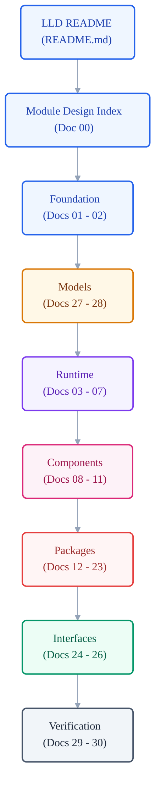

# VoxCore Module Design Index

This document serves as the authoritative navigation and organization index for the Low-Level Design (LLD) documentation layer of VoxCore. It maps the structure of all 31 module design documents, outlines reading strategies, and provides a clear guide for contributors navigating LLD specifications.

This document answers the question: *How is the Low-Level Design documentation organized, and how should contributors navigate it?* It does not define high-level architecture decisions, system-wide package dependencies, internal module code, or technology selections.

---

## 1. Purpose

The Module Design Index organizes the complete LLD documentation set. As VoxCore expands, the number of detailed module specs increases. This index ensures that all implementation blueprints are easily discoverable, preventing fragmented files and ensuring consistent system organization.

---

## 2. Scope

This index is dedicated to documentation organization and directory navigation.

### In Scope
This document defines:
- **Document Organization**: The grouping and categorization of LLD specifications.
- **Reading Order**: Recommended sequences for reviewing designs based on reader experience levels.
- **Document Responsibilities**: The designated concern of each LLD document.
- **Navigation**: Clear directory paths to locate active and planned specifications.

### Out of Scope
This document explicitly excludes:
- **Module Internals**: Internal modules, internal components, and internal collaborators.
- **Architecture**: Core subsystem definitions and global dependency matrices.
- **Implementation**: Actual source files and compilation rules.
- **Technology Decisions**: The technical rationale and technology selections themselves (documented in [02 Technology Decisions](02-technology-decisions.md)).

---

## 3. Relationship With README

Although both documents reside in the root of the LLD directory, they serve distinct navigation purposes:
- **[LLD README](README.md)** answers: *Why does the Low-Level Design layer exist?* It defines the abstract purpose, scope boundaries, and design principles of the design layer.
- **Module Design Index (This Document)** answers: *How is the LLD documentation organized?* It maps the physical files and groups them into logical categories for contributor navigation.

---

## 4. Documentation Organization

To maintain clarity, the LLD specifications are organized into the following categories:

* **Foundation**: Design guidelines, technology decisions, and cross-cutting expectations that apply universally to all modules.
* **Runtime**: Detailed designs of the core runtime kernel, execution contexts, schedulers, events, and pipelines.
* **Components**: Specific designs for managers, services, strategies, stores, and registries.
* **Packages**: Internal package structures, module groupings, and interfaces across different functional domains.
* **Interfaces**: Public contracts, boundary models, dependency injection, and error modeling.
* **Models**: Representation models of key runtime entities, state machines, and state transitions.
* **Verification**: Testability design, verification strategies, and the traceability matrix mapping designs back to requirements.

---

## 5. Reading Strategy

We recommend different reading strategies depending on the contributor's experience with the VoxCore codebase:

### Path A: First-Time Contributors
*For developers onboarding or building their first component in VoxCore.*
1. **[LLD README](README.md)** (Understanding LLD rules and philosophy).
2. **[00 Module Design Index](00-module-design-index.md)** (Reviewing this map).
3. **[01 Implementation Guidelines](01-implementation-guidelines.md)** (Reviewing coding standards and patterns).
4. **[02 Technology Decisions](02-technology-decisions.md)** (Reviewing framework and technology decisions).
5. **[27 Runtime Data Models](27-runtime-data-models.md)** (Learning structural runtime entities).
6. **[28 Runtime State Machines](28-runtime-state-machines.md)** (Understanding runtime state flows).
7. **Specific Module Design** (Focusing exclusively on the target module to be built, e.g., Runtime, Components, or Packages).

*Rationale*: First-time contributors must understand core guidelines, technology decisions, data models, and state machines before diving into the complex logic of specific runtime subsystems.

### Path B: Experienced Contributors
*For maintainers and architects reviewing pull requests or designing capability extensions.*
1. **[00 Module Design Index](00-module-design-index.md)** (Identifying file mappings).
2. **Specific Module Design** (Reviewing the targeted changes).
3. **[29 Testability Design](29-testability-design.md)** (Validating test coverage and verification approach).
4. **[30 Traceability Matrix](30-traceability-matrix.md)** (Updating the requirements-to-design mapping).

*Rationale*: Experienced developers require fast access to specific module files, using the index to navigate directly to their targets.

---

## 6. Complete Document Map

The following map lists every active, planned, or future specification within the Low-Level Design layer.

### Foundation
| Document | Status | Purpose | Answers |
| --- | --- | --- | --- |
| **[README](README.md)** | Active | Landing page and orientation guide. | Why does the LLD layer exist, and what are its principles? |
| **[00 Module Design Index](00-module-design-index.md)** | Active | Navigation and map hub. | How is the LLD documentation organized? |
| **[01 Implementation Guidelines](01-implementation-guidelines.md)** | Active | Coding standards, formatting rules, and component constraints. | What are the code formatting and naming rules? |
| **[02 Technology Decisions](02-technology-decisions.md)** | Active | Justifications for language, libraries, and frameworks. | Why were specific engineering frameworks chosen? |

### Runtime
| Document | Status | Purpose | Answers |
| --- | --- | --- | --- |
| **[03 Runtime Kernel](03-runtime-kernel.md)** | Proposed | Designs core execution loops and process boundaries. | How does the runtime coordinate execution loops? |
| **[04 Runtime Context](04-runtime-context.md)** | Proposed | Defines state sharing and scoping mechanisms. | How are variables and states scoped during runtimes? |
| **[05 Runtime Scheduler](05-runtime-scheduler.md)** | Proposed | Manages asynchronous tasks and resource allocations. | How are concurrent execution tasks prioritized? |
| **[06 Runtime Event Bus](06-runtime-event-bus.md)** | Proposed | Connects components through pub/sub event distribution. | How do decoupled components communicate? |
| **[07 Runtime Execution Pipeline](07-runtime-execution-pipeline.md)** | Proposed | Details stages of processing for data inputs. | How is data processed sequentially through runtime stages? |

### Components
| Document | Status | Purpose | Answers |
| --- | --- | --- | --- |
| **[08 Runtime Managers](08-runtime-managers.md)** | Proposed | Designs management and lifecycle coordination. | How are runtimes and services initialized and torn down? |
| **[09 Runtime Services](09-runtime-services.md)** | Proposed | Outlines background support services. | What background services support the execution engine? |
| **[10 Runtime Strategies](10-runtime-strategies.md)** | Proposed | Defines dynamic algorithms and policy decisions. | How are dynamic behaviors selected at runtime? |
| **[11 Stores and Registries](11-stores-and-registries.md)** | Proposed | Designs caching, in-memory states, and provider registries. | How are providers and states indexed and stored? |

### Packages
| Document | Status | Purpose | Answers |
| --- | --- | --- | --- |
| **[12 API Package](12-api-package.md)** | Proposed | Defines internal API layer modules and routes. | How is the API exposed to internal and external clients? |
| **[13 Runtime Package](13-runtime-package.md)** | Proposed | Implements structural code layouts for the runtime. | How is the runtime package organized internally? |
| **[14 Contracts Package](14-contracts-package.md)** | Proposed | Exposes interfaces and protocol specifications. | What interfaces must all implementing packages inherit? |
| **[15 Providers Package](15-providers-package.md)** | Proposed | Defines the internal organization of provider implementations and capability adapters. | How are third-party API providers integrated? |
| **[16 Storage Package](16-storage-package.md)** | Proposed | Defines the internal organization of persistence abstractions and storage implementations. | How is persistent data written, updated, and read? |
| **[17 Memory Package](17-memory-package.md)** | Proposed | Manages short-term and long-term conversation context memory. | How does the agent track conversational memory? |
| **[18 Tools Package](18-tools-package.md)** | Proposed | Implements the runtime tool loader and execution sandbox. | How are custom tools registered and safely executed? |
| **[19 Plugins Package](19-plugins-package.md)** | Proposed | Standardizes the dynamic extension plugin system. | How do plugins dynamically hook into execution pipelines? |
| **[20 Transport Package](20-transport-package.md)** | Proposed | Defines the internal organization of transport protocols and connection management components. | How is low-latency audio stream data transported? |
| **[21 Configuration Package](21-configuration-package.md)** | Proposed | Manages application environment settings and validation. | How is configuration loaded and validated across packages? |
| **[22 Security Package](22-security-package.md)** | Proposed | Manages secrets, encryption, and authentication. | How are API keys and tokens handled securely? |
| **[23 Observability Package](23-observability-package.md)** | Proposed | Implements telemetry, trace tracing, and metrics logging. | How are logs, metrics, and traces gathered? |

### Interfaces
| Document | Status | Purpose | Answers |
| --- | --- | --- | --- |
| **[24 Public Module Interfaces](24-public-module-interfaces.md)** | Proposed | Defines public interface boundaries between modules. | How do package modules expose public contracts? |
| **[25 Dependency Injection Design](25-dependency-injection-design.md)** | Proposed | Defines dependency composition, object lifetimes, and dependency resolution across the system. | How is dependency injection wired up at startup? |
| **[26 Error Model](26-error-model.md)** | Proposed | Outlines exception hierarchies and recovery actions. | How are errors categorized and recovered from? |

### Models
| Document | Status | Purpose | Answers |
| --- | --- | --- | --- |
| **[27 Runtime Data Models](27-runtime-data-models.md)** | Active | Defines the runtime data models, ownership, relationships, and lifecycle of core runtime entities. | What are the runtime data models, ownership relationships, and lifecycle of core runtime entities? |
| **[28 Runtime State Machines](28-runtime-state-machines.md)** | Proposed | Traces state transitions and boundary validations. | What states do sessions transition through? |

### Verification
| Document | Status | Purpose | Answers |
| --- | --- | --- | --- |
| **[29 Testability Design](29-testability-design.md)** | Proposed | Outlines strategy for unit and integration verification. | How is the codebase structured for mockability and testing? |
| **[30 Traceability Matrix](30-traceability-matrix.md)** | Proposed | Maps source implementation blocks to SRS requirements. | How is design completeness tracked against requirements? |

---

## 7. Dependency Order

Contributors must read the LLD documentation in **Dependency Order** rather than numeric sequence. Reviewing documents out of dependency order leads to confusion because downstream component designs assume knowledge of upstream foundation models.

The reading sequence must flow from base guidelines down to individual verification:

---

## 8. Traceability

Every implementation unit in VoxCore must trace back through the documentation hierarchy to its functional requirement:

1. **Implementation**: The source code (e.g., `backend/voxcore/runtime/kernel.py`).
2. **Low-Level Design**: The module specification outlining that unit's design (e.g., `03-runtime-kernel.md`).
3. **Package Architecture**: The relevant Package Architecture document.
4. **System Architecture**: The relevant System Architecture document.
5. **Software Requirements Specification**: The product capability justifying the component (e.g., `01-software-requirements-specification.md`).

This chain guarantees that no undocumented code is introduced and that all requirements are fully satisfied.

---

## 9. Contributor Guidance

When adding new capabilities or modifying existing modules, contributors must determine where to apply documentation updates using the following rules:
- **One Concern per Document**: If the change affects module structures, internal components, collaborators, or interfaces, it must go to the specific LLD file (e.g., `03-runtime-kernel.md` or `24-public-module-interfaces.md`).
- **Avoid Content Duplication**: Do not repeat package layouts in LLD files; reference the Package Architecture Source Tree document or high-level architecture instead.
- **Reference Over Repeat**: Provide direct markdown links to related documents rather than copying sections from the SRS or System Architecture.

---

## 10. Future Evolution

As the VoxCore platform grows, new LLD files may be introduced:
- **Unique Concern**: Every new LLD document must answer one distinct engineering question not covered by existing files.
- **Dependency Alignment**: The document must be positioned logically in the complete document map and dependency order.
- **Maintain Traceability**: The new design must trace directly back to approved Package and System Architecture layers.

---

## 11. Conclusion

The Module Design Index is the central navigation hub for the Low-Level Design layer. By defining clear categories, ordering reading flows, and providing contributor mapping rules, this index ensures the LLD documentation remains structured and easily navigable.
