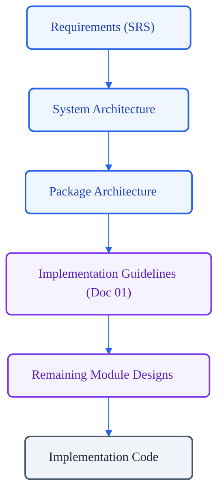
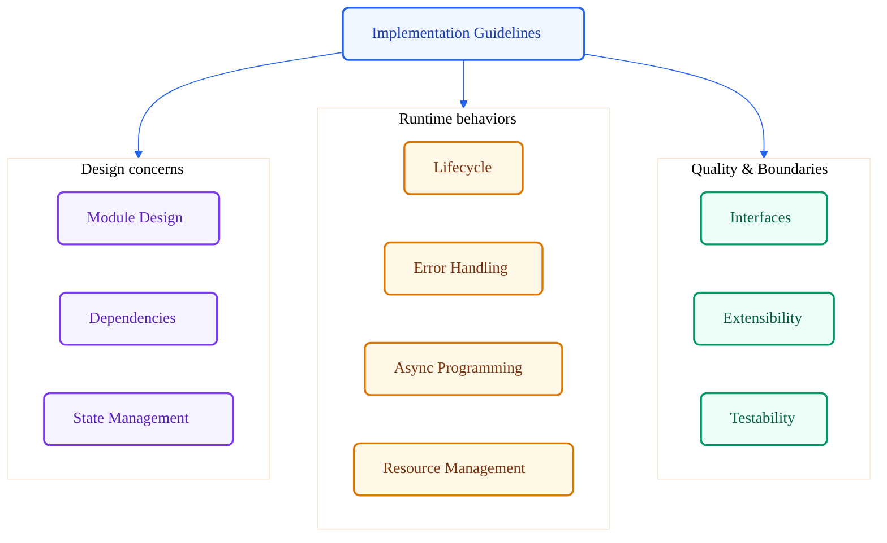

# VoxCore Implementation Guidelines

This document establishes the mandatory engineering principles and implementation rules that every source file and low-level design module in VoxCore shall follow. It defines the implementation requirements necessary to preserve the approved architecture.

This document answers exactly one question: *What implementation rules must every module follow in order to preserve the approved architecture?*

---

## 1. Purpose

The Implementation Guidelines exist to protect the architectural integrity of the VoxCore codebase throughout its lifecycle. Without unified, mandatory engineering guidelines, software systems suffer from progressive structural decay:
* **Architectural Erosion**: Ad-hoc development decisions gradually violate logical layers, introducing unauthorized dependency bypasses.
* **Inconsistent Implementation**: Divergent patterns for async execution, resource ownership, and error management make cross-module maintenance complex and error-prone.
* **Tight Coupling**: Modules import concrete classes directly rather than depending on abstractions, making isolated changes impossible.
* **Ambiguous Ownership**: Lack of explicit rules for mutable state and resources leads to memory leaks, race conditions, and initialization conflicts.

By establishing clear, enforceable implementation rules, this document guarantees that the codebase remains coherent, modular, and maintainable as new features are introduced.

---

## 2. Engineering Philosophy

To ensure implementation remains aligned with system goals, all developers shall adhere to the following core principles:

### Architecture First, Implementation Second
Design blueprints must be finalized and approved prior to writing source code. Developers shall not introduce classes, packages, or major interface modifications without matching Low-Level Design documentation. Code implementation must remain a translation of the approved design.

### Clarity over Cleverness
Code readability must always be prioritized over complex optimizations or compact syntax constructs. Developers must write explicit, self-documenting code. Clever tricks, undocumented assumptions, or dynamic magic imports that hide execution flows are prohibited.

### Composition over Complexity
Modules must build capabilities by composing simple, decoupled components rather than creating deep inheritance trees. Reusability shall be achieved through well-defined interface boundaries and object composition.

### Explicit Behaviour over Hidden Behaviour
System flows must be deterministic and fully visible. Magic behaviors, implicit contexts, global side effects, and hidden background threads are prohibited. Inputs, outputs, and lifecycle transitions must be declared and visible in code interfaces.

### Predictability over Convenience
Implementation patterns must remain highly consistent across all packages. Developers must not take shortcuts that violate dependency directions or bypass lifecycle checks for temporary convenience.

### Maintainability over Short-Term Speed
Design decisions must prioritize the ease of future modifications and readability over the speed of initial delivery. Shortcuts that accumulate technical debt are prohibited.

### Long-Term Consistency over Individual Preferences
Code layout, lifecycle patterns, and error management strategies must conform to these established guidelines. Personal coding preferences must yield to project-wide standardization.

---

## 3. Module Design Guidelines

Every module in the VoxCore repository must adhere to the following structural requirements:
* **Single Responsibility**: Every module shall possess exactly one reason to change. Modules combining different concerns (e.g., protocol transport and data model serialization) must be decomposed.
* **Clear Ownership**: Every component must have a single, explicitly defined owner component that manages its instantiation and teardown. Multi-owner configurations are prohibited.
* **Minimal Public Surface**: A module shall only expose interfaces and models required for its public contract. Internal helper modules and implementation details must remain private.
* **Internal Encapsulation**: Concrete implementations must remain hidden behind abstract boundaries. Collaborators must never access the internal variables of another module directly.
* **High Cohesion**: All functions and variables within a module must work together to fulfill a single, logical capability.
* **Low Coupling**: Modules must interact exclusively through abstract contracts, minimizing compile-time and runtime dependencies on concrete implementations.
* **Small Focused Modules**: File lengths and module sizes shall remain compact and focused. Monolithic modules must be broken down into smaller collaborating units.
* **Avoid Feature Creep**: Modules shall implement only the capabilities approved in the low-level design. Speculative features or unused hooks are prohibited.
* **Avoid Cross-Cutting Logic**: Cross-cutting concerns like security, observability, and storage must be handled by dedicated packages and injected as dependencies rather than being reinstituted inside individual modules.
* **Avoid Circular Relationships**: Direct or indirect circular dependencies between modules are strictly prohibited.
* **No Hidden Side Effects**: Modifying global variables or executing operations that affect other modules without explicit method calls is prohibited.

---

## 4. Dependency Management Guidelines

To ensure the system remains decoupled and modular, the following dependency management rules are mandatory:
* **Dependencies Shall Be Explicit**: All collaborators required by a module must be declared in its constructor. Implicit retrieval of dependencies through global contexts or environment lookups is prohibited.
* **Hidden Dependencies Prohibited**: Modules must not import concrete implementations of other packages directly if abstract interfaces are available.
* **Global Mutable State Prohibited**: Sharing mutable variables via global variables, singletons with public setters, or package-level shared state is prohibited.
* **Dependency Direction**: Dependency imports must flow in the direction approved in the Package Architecture. Downstream packages must never import modules from upstream packages.
* **Centralized Construction**: Modules must not instantiate their own collaborators. All object graphs and dependency resolution must be performed by centralized constructors or a dependency injection framework.
* **Depend Upon Abstractions**: High-level modules must depend on abstract interfaces. Concrete classes shall only be referenced during dependency registration and wiring.
* **Avoid Dependency Cycles**: Component dependency paths must form a directed acyclic graph (DAG).
* **Avoid Service Locators**: Relying on service locator patterns or registry objects to pull dependencies dynamically at runtime is prohibited.

---

## 5. State Management Guidelines

State corruption and race conditions are primary sources of system instability. The following rules govern state management:
* **Single Owner**: Every mutable state must be owned by exactly one parent component. No two components shall share direct write-access to the same mutable object.
* **Immutable Data Preferred**: All data structures passed across module boundaries (e.g., event payloads, DTOs, data models) must be immutable. Mutable structures must be deep-copied before crossing boundaries.
* **Shared Mutable State Minimized**: In-memory state sharing between concurrent tasks must be avoided. Communication must occur via message passing or structured events.
* **State Lifetime**: The lifespan of any mutable state must be tied directly to the lifetime of its owner component.
* **Explicit Transitions**: State changes within a component must occur through explicit, validated methods. Ad-hoc modification of state variables is prohibited.
* **No Orphan State**: All state variables must reside inside active, managed components. Storing unmanaged state at package levels is prohibited.
* **Explicit Cleanup**: Owners must release and clear all state resources (buffers, lists, caches) during teardown.

---

## 6. Lifecycle Guidelines

Stateful execution components must follow a standard, deterministic lifecycle to guarantee safe initialization and cleanup. Every stateful component shall implement the following phases:

```
[Instantiation] ──> Initialization ──> Ready ──> Active ──> Shutdown ──> Cleanup
```

1. **Initialization**: The component acquires configurations, registers listeners, and sets up empty internal data structures. External network calls or heavy resource allocations are prohibited in this phase.
2. **Ready**: The component is fully wired and configured, awaiting activation.
3. **Active**: The component is actively executing tasks, handling events, and processing data.
4. **Shutdown**: The component stops accepting new work, finishes current pipeline tasks, and pauses execution loops.
5. **Cleanup**: The component releases all acquired resources (connections, threads, memory buffers) and transitions to a terminated state.

All state transitions must be thread-safe and verified. Components must throw exceptions if methods are called when the component is in an invalid lifecycle state.

---

## 7. Error Handling Guidelines

Every module must handle failures predictably to prevent system crashes or silent corruption:
* **No Silent Ignorance**: Catching exceptions without logging, reporting, or executing fallback actions is prohibited.
* **Boundary Translation**: Low-level infrastructure errors (e.g., socket timeout, database driver error) must be caught and translated into high-level domain exceptions before crossing package boundaries.
* **Error Context Preservation**: When translating exceptions, the original error trace must be preserved and attached as the cause.
* **Explicit Failure Distinction**: Implementations must distinguish between recoverable failures (which trigger retry policies or fallbacks) and unrecoverable failures (which halt execution).
* **Logging Integration**: Errors must be logged with appropriate severity levels using the observability package. Logs must accompany, not replace, exception propagation.
* **No Implementation Exposure**: Internal database query patterns, connection details, or file paths must never be exposed in public exception messages.

---

## 8. Asynchronous Programming Guidelines

Asynchronous programming must remain structured, safe, and resource-efficient:
* **Explicit Async Boundaries**: Thread switches and task handoffs must occur through designated schedulers or event buses. Inline thread spawning is prohibited.
* **Cancellation Support**: Long-running asynchronous tasks must accept cancellation tokens and check them regularly to abort execution promptly.
* **Timeout Handling**: All network operations, IPC, and lock acquisitions must enforce explicit timeouts. Infinite waits are prohibited.
* **Deterministic Cleanup**: Asynchronous tasks must guarantee resource cleanup (e.g., closing streams, releasing locks) in `finally` blocks, even when cancelled.
* **No Fire-and-Forget**: Spawning unmanaged background tasks without capturing execution handles is prohibited. All spawned tasks must be tracked, and exceptions must be handled by the parent scheduler.
* **No Blocking Calls in Async**: Executing blocking CPU-bound or synchronous I/O operations directly inside async loops is prohibited. Such operations must be offloaded to dedicated thread pools.

---

## 9. Resource Management Guidelines

Resource allocation must follow strict patterns to avoid memory exhaustion or connection pool depletion:
* **Late Acquisition**: Resources (e.g., sockets, files, buffers) must be allocated as late as possible in the execution flow.
* **Early Release**: Resources must be closed and released as soon as they are no longer required, without waiting for garbage collection.
* **Explicit Ownership**: The component that instantiates a resource must be responsible for its closure. If ownership is transferred, the transfer must be explicitly documented in the design.
* **Cleanup Invariants**: All resource closures must occur inside structured cleanup blocks that execute regardless of whether the operations succeeded or failed.
* **Zero Resource Leakage**: Developers must run leak detection tools during verification to ensure zero residual memory buffers or unclosed sockets remain after module execution.

---

## 10. Public Interface Guidelines

Public boundaries are the primary defense against architectural drift:
* **Minimal Exposure**: Interfaces must expose only the minimum necessary functions required by clients.
* **Hide Implementation Details**: Interfaces must not expose private classes, concrete packages, or helper structures.
* **Stable Public Contracts**: Once an interface is approved and implemented, modifying its signature without deprecation paths is prohibited.
* **No Internal Model Exposure**: Internal data representations and entities must be mapped to public Data Transfer Objects (DTOs) before being returned through interface boundaries.
* **Behavioral Documentation**: Interface definitions must document invariants, lifecycle prerequisites, and exception expectations.

---

## 11. Extensibility Guidelines

System growth must occur without destabilizing existing features:
* **Prefer Extension**: New features should be implemented by adding new modules or implementing existing interfaces rather than modifying core package code.
* **Interface Adherence**: New implementations must strictly adhere to the behavior defined by the abstract contracts they implement.
* **Backward Compatibility**: Interface extensions must maintain backward compatibility for existing consumers.
* **Boundary Integrity**: Extended components must not bypass logical layers or import unauthorized packages.

---

## 12. Testability Guidelines

Testability is a core indicator of clean module design:
* **Dependency Replacement**: All external collaborators must be easily mockable or replaceable with test doubles during testing.
* **Isolated Modules**: Modules must be testable in isolation without initializing databases, networks, or file systems.
* **Deterministic Behavior**: Test execution must be repeatable and free of timing dependencies or sleep delays.
* **No Hidden State**: Tests must be able to reset module state fully between execution runs.
* **Test Public Behavior**: Verification must target the public interface contracts, not private methods or variables.
* **Mock Infrastructure**: Concrete infrastructure adapters (e.g., databases, transports) must be mocked using stable mocks to verify domain logic.

---

## 13. Review Checklist

Every pull request must be evaluated against this checklist before approval.

| Question | Why It Matters |
| --- | --- |
| **Does the implementation preserve architecture?** | Prevents architectural drift and logical layer violations. |
| **Is component ownership explicit?** | Prevents orphan components and memory/resource leakage. |
| **Are all dependencies declared explicitly?** | Eliminates hidden coupling and runtime dependency resolution failures. |
| **Is mutable state minimized and owned?** | Avoids concurrency bugs, race conditions, and state corruption. |
| **Are public interfaces minimal and stable?** | Reduces package coupling and simplifies integration. |
| **Are resource lifecycles completely managed?** | Prevents file handle exhaustion and memory leaks. |
| **Is async execution structured and cancellable?** | Prevents thread leakage and non-responsive application shutdown. |
| **Is the code testable in isolation?** | Guarantees test stability and long-term regression protection. |

---

## 14. Required Reference Tables

### Table 1: Documentation Relationships
| Document | Responsibility |
| --- | --- |
| **Software Requirements Specification (SRS)** | Defines what VoxCore must accomplish. |
| **System Architecture** | Defines logical runtime architecture. |
| **Package Architecture** | Defines physical package organization. |
| **LLD README** | Introduces the LLD layer. |
| **Module Design Index** | Organizes all LLD documents. |
| **Implementation Guidelines (This Document)** | Defines mandatory engineering rules for implementing every module. |
| **Technology Decisions** | Explains chosen technologies. |
| **Remaining LLD Documents** | Apply these implementation rules to individual modules. |

### Table 2: Implementation Rules Summary
| Area | Primary Rule |
| --- | --- |
| **Module Design** | Every module shall have a single responsibility and clean encapsulation. |
| **Dependency Management** | Collaborators must be explicit and injected; concrete imports are prohibited. |
| **State Management** | Every mutable state must have a single owner; immutability is preferred. |
| **Lifecycle** | Stateful components must implement a deterministic lifecycle (Init -> Ready -> Active -> Shutdown -> Cleanup). |
| **Error Handling** | Infrastructure errors must be translated at architectural boundaries. |
| **Asynchronous Exec** | Thread switches must go through explicit schedulers; background tasks must be tracked. |
| **Resource Management** | Resources must be acquired late, released early, and closed in structured cleanup blocks. |
| **Public Interfaces** | Contracts must be minimal, stable, and decoupled from internal models. |
| **Extensibility** | Systems must evolve by extending existing contracts rather than editing stable files. |
| **Testability** | Modules must support isolated testing through dependency injection and mocks. |

---

## 15. Required Diagrams

### Architecture-to-Implementation Flow

This diagram shows how these guidelines translate high-level requirements into the codebase.



### Implementation Rule Hierarchy

This diagram details the core engineering domains governed by this document.



---

## 16. Conclusion

These guidelines ensure that implementation remains faithful to the approved architecture throughout the evolution of VoxCore. By enforcing strict module design, explicit dependencies, structured state lifecycles, and isolated testing rules, the VoxCore code base remains scalable, robust, and maintainable.
