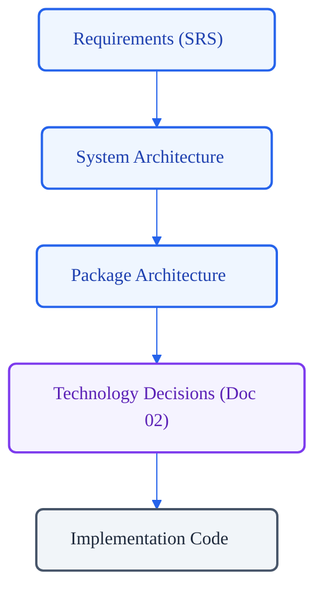

# VoxCore Technology Decisions

This document records the approved implementation technologies for VoxCore and the architectural reasoning behind their selection. It serves as the single source of truth for the codebase's technology stack.

This document answers exactly one question: *Which implementation technologies have been selected to realize the approved architecture, and why were they chosen?*

---

## 1. Purpose

Centralizing technology decisions prevents architectural drift, ensures technical alignment across development teams, and simplifies long-term maintenance. The benefits of a centralized, managed technology register include:
* **Consistency**: Every package and module uses the same library for identical concerns (e.g., serialization, logging, validation), avoiding fragmented implementation styles.
* **Easier Maintenance**: System-wide dependency upgrades can be scheduled and tested as unified blocks rather than package-by-package.
* **Simplifying Upgrades**: Clear lifecycle policies and compatibility maps ensure deprecations and version increments do not introduce breaking regressions.
* **Preventing Conflicting Implementations**: Enforcing a strict technology register prevents developers from introducing competing libraries (e.g., multiple HTTP clients or validation tools) into the workspace.

All future Low-Level Design (LLD) documents shall reference this document instead of restating or justifying technology selections.

---

## 2. Technology Selection Philosophy

Every technology selected for the VoxCore codebase must align with the following architectural evaluation principles:

### Framework Independence
Core business logic, state machines, and runtime models must remain decoupled from specific external frameworks. Frameworks shall only operate at package boundaries (e.g., API layers, transport adapters), allowing the core engine to function independently.

### Long-Term Maintainability
Selected libraries must show a history of stable releases, minimal API churn, and clear deprecation paths. High-turnover or speculative packages are prohibited.

### Mature Ecosystem
Preference shall be given to technologies with widespread production usage, established conventions, and extensive reference documentation.

### Active Community
Selected projects must possess an active maintainer group, regular commit histories, prompt security patches, and a large developer contributor base.

### Performance
Technologies must meet the latency and throughput requirements of real-time audio orchestration and concurrent pipeline processing without introducing unnecessary garbage collection overhead or blocking operations.

### Reliability
Libraries must exhibit high deterministic stability, low memory footprints, and robust error recovery mechanisms under continuous operations.

### Extensibility
Every technology must support pluggable backends, custom middleware, or adapter patterns to allow evolution without modifying library internals.

### Developer Experience
Preference shall be given to technologies that support rich static typing, comprehensive testing utilities, fast compilation or startup speeds, and robust IDE integration.

### Minimal Vendor Lock-In
Selected libraries must remain open source and independent of proprietary cloud services, enabling deployment on-premises or across diverse hosting providers.

### Cross-Platform Support
All development tools, packages, and runtimes must execute identically across Windows, macOS, and Linux environments.

---

## 3. Technology Categories

This section outlines the specific technologies approved for the implementation of VoxCore.

### 1. Programming Language
* **Purpose**: Core application runtime logic and system orchestration.
* **Selected Technology**: `Python`
* **Reason for Selection**: Extensive ecosystem for machine learning, speech processing, and async execution orchestration. High readability and rapid onboarding for developers.
* **Alternatives Considered**: `Go`, `Rust`
* **Why Alternatives Were Not Selected**: While both offer superior execution speed, their ecosystems for third-party model interaction and library integrations are less mature than Python's, which would increase development time.
* **Future Replacement**: Replacement of the entire language runtime is highly difficult and would require a complete rebuild. Critical execution components may be rewritten in C/Rust and exposed via Python bindings if CPU performance limits are hit.

### 2. Package Management
* **Purpose**: Dependency installation, environment locking, and virtual environment isolation.
* **Selected Technology**: `uv`
* **Reason for Selection**: Orders of magnitude faster installation and dependency resolution than pip. Provides deterministic environment locks out-of-the-box.
* **Alternatives Considered**: `Poetry`, `pipenv`
* **Why Alternatives Were Not Selected**: Poetry and pipenv resolve dependencies slowly and add significant complexity to CI/CD build runtimes.
* **Future Replacement**: High ease of replacement as it operates purely at tooling level. Standard `pip` and `virtualenv` remain fallback interfaces.

### 3. Dependency Management
* **Purpose**: Standard package distribution and metadata declaration.
* **Selected Technology**: `pyproject.toml` (standard Python packaging layout)
* **Reason for Selection**: Standardized configuration layout defined in PEP 518/621, compatible with modern builders and package managers.
* **Alternatives Considered**: `setup.py`, `setup.cfg`
* **Why Alternatives Were Not Selected**: These layouts are deprecated in modern Python packaging standards and introduce execution-time installation risks.
* **Future Replacement**: Moderate ease of replacement if Python packaging standards evolve.

### 4. Configuration Management
* **Purpose**: Environment variable parsing, validation, and configuration scoping.
* **Selected Technology**: `Pydantic Settings`
* **Reason for Selection**: Out-of-the-box support for loading configurations from environment variables and `.env` files with strict type validation.
* **Alternatives Considered**: `python-dotenv`, `dynaconf`
* **Why Alternatives Were Not Selected**: `python-dotenv` does not provide type validation; `dynaconf` is overly complex and does not integrate natively with typing tools.
* **Future Replacement**: High ease of replacement if configuration is isolated within a dedicated configuration package.

### 5. Validation
* **Purpose**: Runtime data validation, serialization, and type-checking boundaries.
* **Selected Technology**: `Pydantic` (v2)
* **Reason for Selection**: Highly optimized Rust-based validation core. Generates clear error structures and is natively supported by FastAPI.
* **Alternatives Considered**: `marshmallow`, `attrs`
* **Why Alternatives Were Not Selected**: Marshmallow has significant serialization overhead; `attrs` lacks built-in runtime validation for complex structures without custom hooks.
* **Future Replacement**: Moderate replacement difficulty; internal data schemas and models must wrap Pydantic validation boundaries to insulate core modules.

### 6. Web Framework
* **Purpose**: Public REST API and WebSocket connection endpoint exposure.
* **Selected Technology**: `FastAPI`
* **Reason for Selection**: Built-in support for ASGI, async execution, OpenAPI generation, and native integration with Pydantic for request validation.
* **Alternatives Considered**: `Flask`, `Django Ninja`
* **Why Alternatives Were Not Selected**: Flask is synchronous by default and lacks modern typing integration. Django Ninja is tied to Django core, introducing unnecessary database and layout overhead.
* **Future Replacement**: Moderate ease of replacement; the API package layer must isolate FastAPI controllers from internal business modules.

### 7. ASGI Server
* **Purpose**: Production web server hosting for async API and socket layers.
* **Selected Technology**: `Uvicorn`
* **Reason for Selection**: High-performance ASGI server implementation using `uvloop` for fast event coordination.
* **Alternatives Considered**: `Hypercorn`, `Daphne`
* **Why Alternatives Were Not Selected**: Daphne is significantly slower. Hypercorn lacks the extensive production track record and optimizations of Uvicorn.
* **Future Replacement**: High ease of replacement; swapped via configuration change in container runtimes.

### 8. HTTP Client
* **Purpose**: Making outbound asynchronous HTTP requests to external APIs and providers.
* **Selected Technology**: `httpx`
* **Reason for Selection**: Supports both synchronous and asynchronous request clients. Fully typing-compatible.
* **Alternatives Considered**: `aiohttp`, `requests`
* **Why Alternatives Were Not Selected**: `requests` is synchronous and blocks event loops. `aiohttp` has a verbose API and is not easily usable in synchronous test fixtures.
* **Future Replacement**: High ease of replacement if wrapped behind outbound transport interfaces.

### 9. Database ORM
* **Purpose**: SQL database interaction, query composition, and transaction management.
* **Selected Technology**: `SQLAlchemy` (v2.0)
* **Reason for Selection**: Industry-standard Python database library. Full async support, strong typing integrations, and flexible repository pattern support.
* **Alternatives Considered**: `Tortoise ORM`, `Peewee`
* **Why Alternatives Were Not Selected**: Tortoise ORM has a small ecosystem. Peewee does not support asynchronous execution.
* **Future Replacement**: Difficult; ORM queries must remain confined to the Storage Package layer to prevent DB leaks.

### 10. Database Migration
* **Purpose**: Schema evolution tracking and database version migrations.
* **Selected Technology**: `Alembic`
* **Reason for Selection**: Natively integrates with SQLAlchemy models, enabling autogeneration of schema migrations.
* **Alternatives Considered**: Custom migration scripts.
* **Why Alternatives Were Not Selected**: Custom scripts do not scale, lack rollback safety, and do not track schema histories reliably.
* **Future Replacement**: Moderate ease; migration tool is decoupled from application runtime code.

### 11. Logging
* **Purpose**: Structured logging output for application diagnostics.
* **Selected Technology**: `structlog`
* **Reason for Selection**: Compiles clean, machine-readable JSON logs for production aggregators while rendering human-readable logs during development.
* **Alternatives Considered**: Standard library `logging`
* **Why Alternatives Were Not Selected**: Standard logging requires complex custom formatters to output consistent JSON structures and runs slower in async environments.
* **Future Replacement**: High ease of replacement when isolated inside the Observability Package.

### 12. Metrics
* **Purpose**: Instrumentation and performance metrics collection (latencies, counts, rates).
* **Selected Technology**: `Prometheus Client`
* **Reason for Selection**: Clean integration with Prometheus metrics servers. Tiny overhead and standard format output.
* **Alternatives Considered**: `StatsD`
* **Why Alternatives Were Not Selected**: StatsD requires additional host daemons and is not standard across modern container platforms.
* **Future Replacement**: High ease if wrapped behind observability interfaces.

### 13. Tracing
* **Purpose**: Distributed request tracing and process execution analysis.
* **Selected Technology**: `OpenTelemetry SDK`
* **Reason for Selection**: CNCF standard for distributed tracing. Highly compatible with modern telemetry collectors (Jaeger, Datadog).
* **Alternatives Considered**: Vendor-specific SDKs.
* **Why Alternatives Were Not Selected**: Custom SDKs lock the architecture to specific SaaS telemetry vendors.
* **Future Replacement**: High ease when wrapped behind tracing wrappers.

### 14. Caching
* **Purpose**: Transient state storage, conversation locks, and high-speed key/value caching.
* **Selected Technology**: `Redis` (via `redis-py` async client)
* **Reason for Selection**: Exceptionally low latency, supports pub/sub patterns, and provides built-in TTL mechanisms.
* **Alternatives Considered**: `Memcached`, `SQLite` (in-memory)
* **Why Alternatives Were Not Selected**: Memcached does not support complex data structures; SQLite does not support distributed environments.
* **Future Replacement**: Moderate ease if accessed via a clean cache interface.

### 15. Testing
* **Purpose**: Unit, integration, and lifecycle test suite verification.
* **Selected Technology**: `pytest` & `pytest-asyncio`
* **Reason for Selection**: Standard Python testing tool. Supports powerful fixtures, clean assertions, and native async test execution.
* **Alternatives Considered**: `unittest` (standard library)
* **Why Alternatives Were Not Selected**: `unittest` uses verbose, class-centric code patterns and lacks async integrations.
* **Future Replacement**: High difficulty due to test suite size, though standard tooling shifts are rare.

### 16. Static Analysis
* **Purpose**: Linting, codebase analysis, and structural validation.
* **Selected Technology**: `Ruff` & `mypy`
* **Reason for Selection**: `Ruff` compiles linting rules at high speeds. `mypy` guarantees strict static type checks across modules.
* **Alternatives Considered**: `pylint`, `flake8`
* **Why Alternatives Were Not Selected**: `pylint` and `flake8` are slow and require maintaining multiple configurations.
* **Future Replacement**: High ease; tools run as local hooks and CI validation actions.

### 17. Formatting
* **Purpose**: Consistent formatting rules.
* **Selected Technology**: `Black` (or integrated `Ruff format`)
* **Reason for Selection**: Uncompromising format output. Eliminates arguments over syntax formatting conventions.
* **Alternatives Considered**: `autopep8`, `yapf`
* **Why Alternatives Were Not Selected**: These tools allow too many configuration variations, leading to code layout churn.
* **Future Replacement**: High ease; run-time formatting check.

### 18. Containerization
* **Purpose**: Unified packaging, isolation, and deployment environments.
* **Selected Technology**: `Docker`
* **Reason for Selection**: De-facto standard for containerized execution. Simplifies dependency control.
* **Alternatives Considered**: Bare-metal VM deployments.
* **Why Alternatives Were Not Selected**: VM environments introduce configuration drift and slow scaling.
* **Future Replacement**: Moderate ease; container specs compile to standard OCI images.

### 19. CI/CD
* **Purpose**: Continuous integration and deployment automated verification.
* **Selected Technology**: `Platform-agnostic configuration scripts` (e.g. GitHub Actions, GitLab CI/CD)
* **Reason for Selection**: Automated test loops run inside standard containers using the project's dependency registry.
* **Alternatives Considered**: Manual script builds.
* **Why Alternatives Were Not Selected**: Manual verification is prone to operator error.
* **Future Replacement**: High ease if build steps run inside standard OCI containers.

---

## 4. Technology Compatibility Matrix

This matrix provides a quick reference for the versioning and upgrade difficulty of approved technologies.

| Category | Technology | Version Policy | Purpose | Replacement Difficulty | Notes |
| --- | --- | --- | --- | --- | --- |
| **Language** | Python | `>=3.11, <3.13` | Core execution runtime. | Critical / Hard | Pin to LTS versions. |
| **Package Manager** | uv | Pin major version | Dependency locking. | Low / Easy | Upgrades run in CI pipelines. |
| **Validation** | Pydantic | `==2.*` | Struct validation. | Moderate | Lock to v2 to avoid migration. |
| **Web Framework** | FastAPI | `==0.*` | Public API layers. | Moderate | Insulated behind API package. |
| **ORM** | SQLAlchemy | `==2.*` | DB interaction. | Hard | Keep queries inside Storage. |
| **Cache** | Redis | `==7.*` | Transient state cache.| Moderate | Swapped via client adapters. |
| **Testing** | pytest | `==8.*` | Test runner. | Moderate | Affects CI pipeline scripts. |
| **Analysis** | Ruff | `==0.*` | Linting & style. | Low / Easy | Dev dependency. |

---

## 5. Technology Lifecycle Policy

Approved technologies shall only be modified, replaced, or deprecated under controlled conditions.

### Triggering Criteria for Replacement
A technology selection shall be re-evaluated and replaced if any of the following occur:
* **Security Risk**: The technology suffers from severe, unpatchable security vulnerabilities.
* **End of Life (EOL)**: The package is officially deprecated by its maintainers or lacks support for newer Python runtimes.
* **Performance Failure**: Benchmark testing reveals structural CPU, memory, or async bottlenecks that cannot be resolved through code optimization.
* **Abandonment**: The library goes 12 consecutive months without a public commit, release, or response to issues.
* **Ecosystem Shift**: A major architectural evolution occurs (e.g., standardizing WebRTC bindings) where a new library delivers significant efficiency gains.

### Migration Requirements
When replacing an approved technology, the following transition rules apply:
1. **Compatibility Layer**: An abstraction interface must wrap the new library. Consumers must never import the new library directly during transition.
2. **Parallel Verification**: The new implementation must pass the existing test suite in isolation before integration.
3. **Deprecation Timeline**: The old library must remain in the codebase as a deprecated option for at least one minor release cycle before deletion.

---

## 6. Dependency Introduction Policy

Uncontrolled dependency acquisition leads to dependency bloat and security exposures. Every developer must adhere to the following rules:
* **Justification**: Every new dependency must justify its addition. If a concern can be solved with standard Python libraries or existing packages, the dependency must not be added.
* **Duplicate Protection**: Libraries providing duplicate features are prohibited.
* **No Experimental Libraries**: Third-party packages must have a version release history of at least 6 months and be classified as production-ready.
* **Architectural Review**: Adding a dependency requires updating this document and obtaining approval from the Lead Architect.
* **No Speculative Abstractions**: Adding generic abstraction libraries that wrap existing libraries without immediate benefit is prohibited.

---

## 7. Versioning and Upgrade Policy

To guarantee deployment stability, VoxCore enforces the following version rules:
* **Semantic Versioning**: All internal packages shall follow Semantic Versioning (`MAJOR.MINOR.PATCH`).
* **LTS Dependency Preference**: When selecting external technologies, versions designated as Long-Term Support (LTS) must be prioritized.
* **Breaking Change Isolation**: External dependency updates that contain breaking API modifications must not be applied until adaptation interfaces are written and tested.
* **Security Patching**: Security patches must be applied within 14 days of publication.

---

## 8. Dependency Review Checklist

Developers must complete this checklist prior to proposing any technology or dependency changes.

| Question | Purpose |
| --- | --- |
| **Is this dependency necessary?** | Prevents package bloat by verifying if native libraries can fulfill the task. |
| **Does it duplicate existing functionality?** | Prevents overlapping libraries (e.g. using `aiohttp` when `httpx` is active). |
| **Is the project actively maintained?** | Avoids importing abandoned packages that will block runtime upgrades. |
| **Does it introduce vendor lock-in?** | Preserves platform independence and local testing capability. |
| **Does it support static type checking?** | Ensures type safety and validation with mypy. |
| **What is its performance overhead?** | Ensures execution loops are not slowed down by blocking actions. |

---

## 9. Required Reference Tables

### Table 1: Documentation Relationship
| Document | Responsibility |
| --- | --- |
| **Software Requirements Specification (SRS)** | Defines product capabilities. |
| **System Architecture** | Defines logical architecture. |
| **Package Architecture** | Defines package organization. |
| **Implementation Guidelines** | Defines engineering rules. |
| **Technology Decisions (This Document)** | Defines approved implementation technologies. |
| **Remaining LLD Documents** | Reference these technologies where applicable. |
| **Implementation** | Uses these technologies. |

### Table 2: Technology Decision Matrix (Core)
| Category | Technology | Reason | Alternatives |
| --- | --- | --- | --- |
| **Language** | Python | Machine learning ecosystem, rapid iteration. | Go, Rust |
| **Package Manager** | uv | Ultra-fast environments and locks. | Poetry, pip |
| **API Framework** | FastAPI | Native async execution and OpenAPI. | Flask, Django Ninja |
| **Database ORM** | SQLAlchemy | Strong async support and query tooling. | Tortoise ORM, Peewee |
| **Validation** | Pydantic | Rust-backed fast validation. | marshmallow, attrs |
| **Cache Storage** | Redis | Low latency, pub/sub, TTL keys. | Memcached, SQLite |

---

## 10. Required Diagrams

### Technology Decision Flow

This flowchart shows how high-level specifications filter down to approve concrete technologies.



### Technology Stack Overview

This diagram groups approved technologies by their core system responsibilities.

```mermaid
%%{init: {"theme": "base", "themeVariables": {"primaryColor": "#EFF6FF", "primaryTextColor": "#1E40AF", "primaryBorderColor": "#2563EB", "lineColor": "#2563EB", "fontFamily": "Inter, sans-serif"}}}%%
mindmap
  root((Technology Stack))
    Language:::langStyle
      Python
    Runtime:::frameworkStyle
      Uvicorn
      Docker
    Framework:::frameworkStyle
      FastAPI
    Communication:::langStyle
      httpx
    Storage:::storageStyle
      SQLAlchemy
      Redis
      Alembic
    Configuration:::langStyle
      Pydantic
    Observability:::obsStyle
      structlog
      Prometheus
      OpenTelemetry
    Testing:::testStyle
      pytest
      pytest-asyncio
    Tooling:::toolStyle
      uv
      Ruff
      mypy
      Black

  classDef langStyle fill:#EFF6FF,stroke:#2563EB,color:#1E40AF;
  classDef frameworkStyle fill:#F5F3FF,stroke:#7C3AED,color:#5B21B6;
  classDef storageStyle fill:#FFF8E7,stroke:#D97706,color:#78350F;
  classDef obsStyle fill:#ECFDF5,stroke:#059669,color:#065F46;
  classDef testStyle fill:#FEFBF0,stroke:#D97706,color:#B58900;
  classDef toolStyle fill:#F1F5F9,stroke:#475569,color:#1E293B;
```

---

## 11. Conclusion

Centralizing technology decisions ensures architectural consistency while allowing implementation details to evolve in a controlled manner. By establishing clear selection philosophies, compatibility matrices, lifecycle policies, and dependency reviews, VoxCore prevents vendor lock-in and structural decay throughout its lifecycle.
