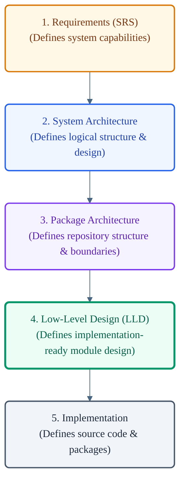

# VoxCore Low-Level Design

This document serves as the authoritative landing page and orientation guide for the Low-Level Design (LLD) documentation layer of VoxCore. It defines the purpose, philosophy, scope, and structural boundaries of the LLD, positioning it within the overall engineering documentation hierarchy.

This document is not a navigation index. All file listings and specific document maps reside in [Module Design Index](00-module-design-index.md).

---

## 1. Purpose

The Low-Level Design layer exists to bridge the gap between high-level architectural abstractions and the final concrete implementation of the codebase. It answers one central question:

*How does the approved architecture become an implementation-ready blueprint?*

By translating logical layers, system-wide principles, and physical package constraints into precise module guidelines, the LLD ensures that developers can build code that remains strictly aligned with the system's design.

---

## 2. Scope

The LLD layer provides a comprehensive design specification for individual modules and internal package structures prior to implementation.

### In Scope
The LLD documentation explicitly covers:
- **Module Design**: Internal module structure, interfaces, collaborations, and implementation boundaries within a package.
- **Internal Package Organization**: The internal module organization and component relationships inside individual packages.
- **Public Interfaces**: The public module interfaces, exposed capabilities, and public contracts exposed by a package boundary.
- **Internal Collaboration**: How private modules and components within the same package interact to fulfill a responsibility.
- **Runtime Models**: Structural representations of runtime entities such as `RuntimeContext`, `Session`, `Conversation`, `ToolExecution`, `ProviderCapability`, `Response`, and `AudioFrame`.
- **State Machines**: State transitions, transition triggers, and runtime state ownership for stateful execution components.
- **Implementation Constraints**: Lifecycle constraints, synchronization boundaries, execution invariants, ownership rules, and implementation expectations required to preserve the approved architecture.

### Out of Scope
The LLD documentation explicitly excludes:
- **Requirements**: Functional and non-functional requirements (belongs in [Software Requirements Specification](../01-software-requirements-specification.md)).
- **Architecture Decisions**: High-level design choices, logical structures, and component maps (belongs in [System Architecture](../02-system-architecture/README.md) or [Package Architecture](../03-package-architecture/README.md)).
- **Deployment**: Packaging, infrastructure provisioning, and container environments (belongs in [System Architecture](../02-system-architecture/README.md)).
- **API Schemas**: External HTTP and WebSocket payload schemas (belongs in Public Interfaces documentation).
- **Implementation Code**: Actual source code statements, package compilations, and language-specific logic (belongs in the Implementation layer).

---

## 3. Relationship With Existing Documentation

The engineering documentation is organized into a hierarchical stack, where each layer refines the decisions made in the layer above:



Each documentation layer refines the decisions of the layer above without redefining or contradicting them.

---

## 4. Relationship With Module Design Index

To navigate the Low-Level Design layer, readers must utilize the following document sequence:

```
LLD README (This Document) ──> Module Design Index ──> Individual Module Designs
```

- **LLD README**: Provides the architectural context, philosophy, and boundaries for this design layer.
- **Module Design Index**: Exposes the map of all active design documents and defines the recommended reading path across different modules.
- **Individual Module Designs**: Outlines the specific structural design, internal interactions, state machines, and interfaces for individual packages.

---

## 5. Why Low-Level Design Exists

High-level architecture specifies the system's boundaries and structural constraints, but it does not define the internal mechanics of individual modules. Without the LLD layer, implementation becomes prone to architectural drift:
- **Removing Ambiguity**: Architects design the interface collaborations and component interactions beforehand, eliminating guesswork for the developer.
- **Implementation Consistency**: Ensures all developers use identical patterns (e.g., state machines, factory abstractions, observer interfaces) across the codebase.
- **Maintainability**: Clear module design prevents internal coupling, making future refactoring safe and localized.
- **Predictable Ownership**: Establishes exactly which component owns which data structure and runtime state.
- **Contributor Onboarding**: Provides new developers with a clear blueprint of the system's modules, reducing onboarding friction.

---

## 6. Documentation Philosophy

The documentation-driven development philosophy divides engineering concerns into three distinct stages:

1. **Architecture** answers: *What is the system?* It defines the high-level layers, boundaries, dependencies, and communication constraints.
2. **Low-Level Design (LLD)** answers: *How will each architectural component be implemented?* It defines the internal design of modules, interfaces, runtime models, state ownership, and structural relationships required to realize the approved architecture.
3. **Implementation** answers: *Write the code.* It translates the LLD blueprint directly into functional programming language source files.

---

## 7. Relationship With Architecture

The LLD is subordinate to the system's architecture.
- **Derivation Rule**: Every LLD document must be derived directly from the approved System Architecture and Package Architecture specifications.
- **No Redefinition**: The LLD shall never change, alter, or redefine logical layers, package boundaries, dependency directions, or communication matrices.
- **Change Propagation**: If the System or Package Architecture is updated through an approved Architecture Decision Record (ADR), the corresponding LLD documents must be updated to align with the new design before code changes are implemented.

---

## 8. Relationship With Implementation

The completion of the LLD marks the transition from design to construction.
- **Mechanical Construction**: After the LLD is finalized, writing the source code should become largely mechanical.
- **No Architectural Guesswork**: Implementation should rarely require developers to make ad-hoc architectural decisions (such as creating new packages or altering communication patterns).
- **Compliance**: The source code must match the module boundaries, public interfaces, and structural relationships specified in the LLD.

---

## 9. Design Principles

Every module designed within the LLD layer must preserve the system's core design principles:
- **Single Responsibility**: Every module and component must have exactly one reason to change.
- **Explicit Ownership**: Data structures, resources, and runtime state must have a single, clearly designated owning component.
- **Low Coupling**: Modules must interact exclusively through stable public interfaces, hiding their internal structures.
- **High Cohesion**: Elements within a module must cooperate closely to execute a single, logical capability.
- **Framework & Provider Independence**: Abstract interfaces must remain free of framework-specific or vendor-specific terminology, ensuring the core platform remains decoupled.
- **Dependency Inversion**: High-level modules must depend on abstractions (interfaces) rather than concrete implementations.
- **Testability & Simplicity**: Designs must favor simplicity and readability to ensure they can be easily unit-tested in isolation.

---

## 10. Reading Strategy

When exploring the Low-Level Design of VoxCore, readers should follow this reading strategy:
1. **Start Here**: Review this README to understand the scope and philosophy of the LLD.
2. **Navigate to the Index**: Read the [Module Design Index](00-module-design-index.md) to view the complete list of module design documents.
3. **Follow the Recommended Order**: Access the specific module designs in the order recommended by the index.

---

## 11. Traceability

Every artifact in the VoxCore repository must maintain absolute traceability:

```
Requirements (SRS) ──> System Architecture ──> Package Architecture ──> Low-Level Design (LLD) ──> Implementation
```

Every module, interface, and test suite in the codebase must be traceable back to an LLD module specification, which in turn maps to a physical package responsibility, a logical architecture layer, and an approved product requirement.

---

## 12. Future Evolution

The LLD layer is a living design document that evolves as the platform grows.
- **Design Before Coding**: When adding new features or capabilities, the LLD must be extended and approved before any implementation begins.
- **ADR Synchronization**: Major updates to module structures or state machines must align with corresponding ADR updates to ensure architectural compliance.

---

## 13. Conclusion

The Low-Level Design README serves as the entry point for VoxCore's detailed module design specifications. By defining a clear blueprint for internal module organization, interface boundaries, runtime models, state ownership, and implementation structure, the LLD ensures that the final codebase remains a correct and maintainable realization of the approved system architecture.
