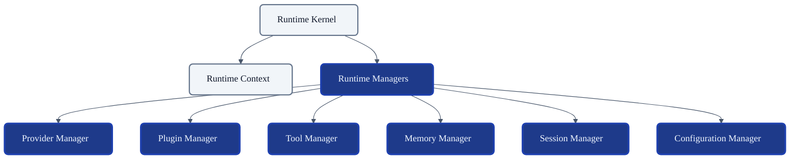
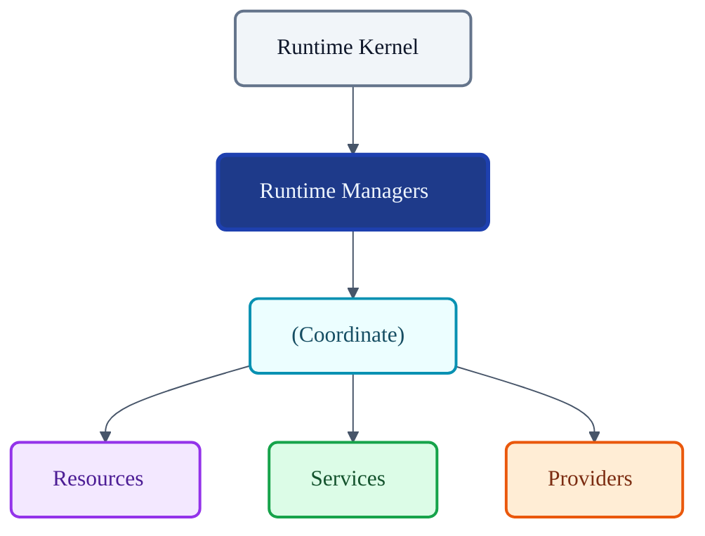
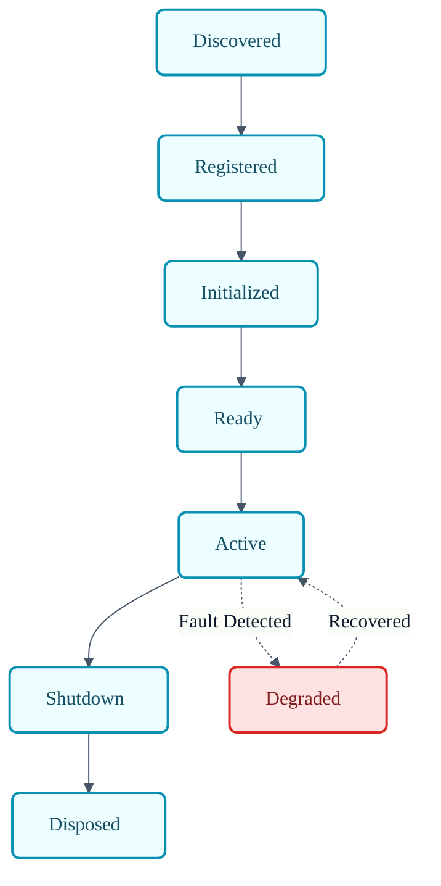
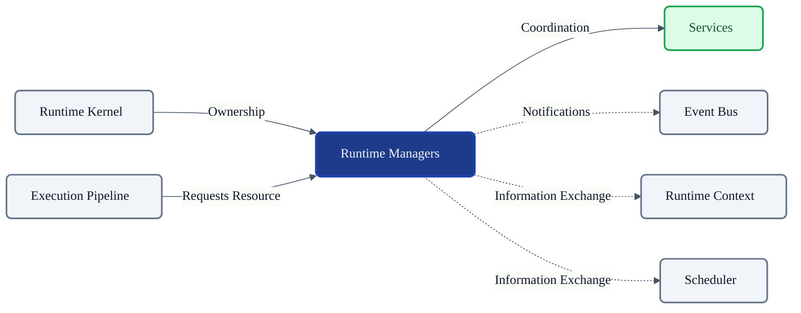

# VoxCore Runtime Managers

This document defines the architectural role, responsibilities, ownership boundaries, lifecycle, collaboration model, and extension points of Runtime Managers within VoxCore.

It answers exactly one engineering question: **"How are long-lived runtime resources coordinated and managed throughout the VoxCore runtime?"**

Runtime Managers coordinate runtime resources and subsystem lifecycles. They do not implement business capabilities. They do not execute runtime requests. They do not become service locators.

---

## 1. Purpose

Runtime Managers exist to provide centralized, predictable ownership of long-lived runtime infrastructure.

Without Managers:
* **Runtime ownership becomes fragmented**: Modules instantiate their own database connections or API clients ad hoc, leading to resource leaks.
* **Lifecycle logic becomes duplicated**: Every service writes custom initialization, polling, and teardown logic.
* **Startup and shutdown become inconsistent**: Resources are torn down while still processing active traffic, crashing the application.
* **Subsystem coordination becomes tightly coupled**: Components inject each other directly instead of relying on a standardized coordinator.
* **Resource ownership becomes unclear**: Nobody tracks which subsystem is responsible for closing memory stores or freeing file handles.

Managers provide centralized ownership of runtime resources while keeping implementations modular.

---

## 2. Manager Philosophy

The design of Runtime Managers adheres to the following principles:

* **Single Resource Owner**: Every long-lived resource (e.g., a connection pool, an active session) belongs to exactly one Manager.
* **Explicit Lifecycle**: Managers enforce strict initialization, readiness, and shutdown phases for the resources they coordinate.
* **Coordination Rather Than Implementation**: Managers organize and track components; they do not contain the algorithms that make those components function.
* **Minimal Knowledge**: A Manager knows *that* a resource exists and *how* to start/stop it, but not the internal business logic of that resource.
* **No Business Logic**: Managers do not parse prompts, manipulate strings, or evaluate domain rules.
* **Framework Independence**: Managers decouple resources from underlying DI (Dependency Injection) containers.
* **Provider Independence**: A Manager coordinates generic provider interfaces without knowing about AWS or OpenAI specifically.
* **Clear Ownership**: The architectural boundary between a coordinating Manager and an executing Service remains absolute.

---

## 3. Responsibilities

Managers explicitly distinguish between coordination (owned) and implementation (delegated).

| Responsibility | Description | Owned? |
| :--- | :--- | :--- |
| **Runtime resource ownership** | Holding the definitive reference to active resources. | **Yes** |
| **Lifecycle coordination** | Managing the start/stop state machine of resources. | **Yes** |
| **Registration** | Accepting and indexing new runtime resources. | **Yes** |
| **Initialization** | Firing bootstrap routines for registered resources. | **Yes** |
| **Shutdown** | Orchestrating graceful teardown of resources. | **Yes** |
| **Health monitoring** | Polling resources for readiness and liveness. | **Yes** |
| **Resource cleanup** | Ensuring memory and handles are released on teardown. | **Yes** |
| **Diagnostics coordination** | Aggregating health state for the Runtime Kernel. | **Yes** |
| **Business logic execution** | Modifying domain payloads (e.g., formatting text). | *Delegated* |
| **Capability implementation** | The actual logic interacting with an external API. | *Delegated* |

---

## 4. Manager Categories

VoxCore logically organizes Managers by the category of resource they coordinate.

### Provider Manager
* **Purpose**: Coordinates the lifecycle and availability of external AI model providers.
* **Responsibilities**: Registers provider adapters, manages connection health, and ensures providers are initialized before pipeline execution.
* **Collaborators**: `Runtime Execution Pipeline`, `Runtime Context`.
* **Ownership**: Owns provider registrations, not provider implementations.

### Plugin Manager
* **Purpose**: Coordinates dynamic extension modules.
* **Responsibilities**: Loads, validates, and initializes third-party or optional plugins at runtime.
* **Collaborators**: `Runtime Kernel`, `Event Bus`.
* **Ownership**: Owns the plugin lifecycle.

### Tool Manager
* **Purpose**: Coordinates tool registration and availability.
* **Responsibilities**: Catalogs available tools, validates schemas, and mounts them for pipeline use.
* **Collaborators**: `Providers`, `Runtime Context`.
* **Ownership**: Owns the registry of executable tools.

### Memory Manager
* **Purpose**: Coordinates the memory subsystem lifecycle.
* **Responsibilities**: Initializes vector stores, validates persistence connections, and tears down database handlers safely.
* **Collaborators**: `Execution Pipeline`.
* **Ownership**: Owns memory connections, not the algorithms for semantic search.

### Configuration Manager
* **Purpose**: Coordinates configuration availability and reload cycles.
* **Responsibilities**: Provides validated configuration states to subsystems and manages hot-reloads if supported.
* **Collaborators**: `Runtime Kernel`, `Runtime Context`.
* **Ownership**: Owns the global configuration state tree.

### Session Manager
* **Purpose**: Coordinates active runtime sessions.
* **Responsibilities**: Tracks active users/connections, orchestrates session timeouts, and cleans up abandoned sessions.
* **Collaborators**: `Runtime Context`, `Scheduler`.
* **Ownership**: Owns the lifecycle of active Session entities.

### Resource Manager
* **Purpose**: Coordinates shared, generic runtime resources (e.g., file caches, temp directories).
* **Responsibilities**: Provisions and reclaims physical host resources.
* **Collaborators**: `Runtime Kernel`.
* **Ownership**: Owns host-level resource allocation state.

---

## 5. Public Capabilities

Managers expose standardized conceptual capabilities:

### Register Resource
* **Purpose**: Adds a new resource to the Manager's coordination registry.
* **Inputs**: Resource interface, metadata.
* **Outputs**: Registration ID.
* **Preconditions**: Manager is initializing or ready.
* **Postconditions**: Resource is tracked.
* **Failure Conditions**: Validation failure, ID collision.

### Initialize Resource
* **Purpose**: Bootstraps the resource for active use.
* **Inputs**: Registration ID.
* **Outputs**: Success flag.
* **Preconditions**: Resource is registered but uninitialized.
* **Postconditions**: Resource is marked `Ready`.
* **Failure Conditions**: Resource throws initialization error.

### Shutdown Resource
* **Purpose**: Safely tears down the resource.
* **Inputs**: Registration ID.
* **Outputs**: None.
* **Preconditions**: Resource is tracked.
* **Postconditions**: Resource is `Disposed` and removed from active registry.
* **Failure Conditions**: Resource hangs during teardown.

### Lookup Registered Resource
* **Purpose**: Provides a verified reference to a coordinated resource.
* **Inputs**: Resource constraints or ID.
* **Outputs**: Resource reference.
* **Preconditions**: Resource is `Ready`.
* **Postconditions**: None.
* **Failure Conditions**: Resource unavailable or degraded.

### Query Manager Status
* **Purpose**: Aggregates the health of all managed resources.
* **Inputs**: None.
* **Outputs**: Health array.
* **Preconditions**: None.
* **Postconditions**: None.
* **Failure Conditions**: None.

### Reload Resource
* **Purpose**: Dynamically refreshes a resource without halting the process.
* **Inputs**: Registration ID.
* **Outputs**: Boolean success.
* **Preconditions**: Resource supports hot-reload.
* **Postconditions**: Resource configuration is updated.
* **Failure Conditions**: Reload validation fails.

### Validate Resource
* **Purpose**: Confirms the resource matches schema/interface requirements.
* **Inputs**: Resource reference.
* **Outputs**: Boolean.
* **Preconditions**: None.
* **Postconditions**: None.
* **Failure Conditions**: None.

---

## 6. Lifecycle Management

Managers coordinate specific lifecycle transitions, strictly adhering to the state machines defined in *Runtime State Machines* for their specific resource type (e.g., `Provider Instance`, `Plugin`, `MemoryContext`).

A generalized view of resource coordination includes:
* **Registration/Discovery**: Managers accept the resource and store metadata.
* **Initialization/Loading**: Managers trigger the start-up sequence of the resource.
* **Ready/Enabled**: Managers mark the resource as available for the Pipeline.
* **Active/Busy**: Resource is in use (often monitored via health pings).
* **Degraded/Unavailable**: Manager detects resource latency/failure and updates routing tables.
* **Shutdown/Flushing**: Manager triggers graceful termination logic.
* **Disposed/Unloaded**: Manager evicts the resource from memory.

Managers coordinate these transitions; they do not dictate the internal state of the resources beyond these bounds.

---

## 7. Ownership Rules

Ownership boundaries prevent Managers from turning into God Objects.

**Managers own:**
* Runtime registrations (the list of what exists).
* Lifecycle state (is it starting, running, or stopping?).
* Runtime resource metadata (IDs, versions, health flags).
* Coordination logic (the sequence of startup/shutdown).

**Managers reference:**
* `Runtime Context` (for ambient scope).
* `Scheduler` (if coordinating async shutdown tasks).
* `Event Bus` (to publish lifecycle events).
* `Services` (they reference the concrete capability implementations).

**Managers never own:**
* **Business data**: Managers do not parse NLP text or process audio.
* **Provider implementations**: Managers coordinate the interface, not the AWS SDK.
* **Execution pipeline**: Managers supply resources to the pipeline, but do not dictate the execution flow.
* **Request lifecycle**: Managers track long-lived resources, not individual transient requests.
* **Persistence**: Managers initialize database drivers, but do not execute SQL queries.

*Reason*: Violating these boundaries turns the Manager into a Service, destroying modularity.

---

## 8. Collaboration

### Runtime Kernel
* **Dependency Direction**: Kernel → Managers
* **Information Exchanged**: Initialization commands, global health polling, shutdown sequences.
* **Ownership**: Kernel manages the Managers.

### Runtime Context
* **Dependency Direction**: Managers → Context
* **Information Exchanged**: Global configurations required for resource initialization.
* **Ownership**: Managers read from the Context.

### Scheduler
* **Dependency Direction**: Managers → Scheduler
* **Information Exchanged**: Managers may submit async health-polling tasks.
* **Ownership**: Managers use the Scheduler as a utility.

### Event Bus
* **Dependency Direction**: Managers → Event Bus
* **Information Exchanged**: Broadcasts when a resource becomes degraded, ready, or shutdown.
* **Ownership**: Managers publish lifecycle telemetry.

### Execution Pipeline
* **Dependency Direction**: Pipeline → Managers
* **Information Exchanged**: The Pipeline requests validated resources (like a Provider) to execute a task.
* **Ownership**: Pipeline relies on Managers for safe resource access.

### Services & Providers
* **Dependency Direction**: Managers → Services/Providers
* **Information Exchanged**: Managers invoke lifecycle interfaces (`Initialize()`, `Shutdown()`) on the implementations.
* **Ownership**: Managers coordinate them; Services implement them.

---

## 9. Registration Model

The conceptual registration flow ensures safe resource tracking:

1. **Resource discovery**: The application bootstrapper or Plugin Manager locates resources.
2. **Registration**: The resource is passed to the appropriate Manager.
3. **Validation**: The Manager ensures the resource conforms to necessary interfaces and avoids ID collisions.
4. **Activation**: The Manager invokes initialization logic.
5. **Deactivation**: Upon shutdown or failure, the Manager blocks new traffic to the resource.
6. **Removal**: The resource is purged from the registry.

---

## 10. Health Management

Managers protect system stability via continuous health tracking.

* **Health verification**: Managers periodically poll registered resources (e.g., pinging a database).
* **Availability**: Managers track connection pool exhaustion.
* **Readiness**: Resources are withheld from the Execution Pipeline until initialization completes.
* **Failure detection**: Timeouts or exceptions trigger a state change to `Degraded`.
* **Recovery notification**: If a degraded resource heals, the Manager publishes a recovery event via the Event Bus.
* **Diagnostics**: Health states are aggregated and exposed for Observability tooling.

---

## 11. Manager Invariants

The following invariants must hold true under all conditions:

1. **Every runtime resource has exactly one Manager.** Shared ownership causes race conditions during teardown.
2. **Managers shall not implement business logic.** They organize components; they do not perform work.
3. **Managers shall own lifecycle coordination only.** They are not generic utility classes.
4. **Managers shall not directly execute requests.** Execution is strictly owned by the Pipeline.
5. **Registered resources shall have unique identities.** Required for deterministic lookup and routing.
6. **Managers shall release owned resources during shutdown.** No orphaned handles or memory leaks are permitted.
7. **Managers shall preserve registration consistency.** Concurrent registrations must not corrupt internal registries.

---

## 12. Failure Behaviour

* **Registration failure**: Invalid resources are rejected synchronously; the Manager remains healthy.
* **Initialization failure**: If a critical resource fails to boot, the Manager halts initialization and escalates to the Kernel to abort startup.
* **Runtime degradation**: If a provider connection drops, the Manager marks the resource `Degraded` and isolates it from the Pipeline until it recovers.
* **Resource loss**: If a resource crashes irrecoverably, the Manager removes it from the registry and publishes a failure event.
* **Shutdown failure**: If a resource hangs during `Shutdown`, the Manager enforces a hard timeout and forcefully drops the reference to guarantee process exit.
* **Recovery boundaries**: Managers attempt localized restarts (if configured) before escalating failure to the Kernel.

---

## 13. Extension Points

The architecture allows for extending Manager capabilities:
* **Additional manager categories**: New resource types (e.g., `CacheManager`) can be added without altering the Kernel.
* **Health monitors**: Injectable custom probes for verifying external API health.
* **Registration policies**: Rules defining whether duplicate resource registrations overwrite or reject.
* **Lifecycle hooks**: Subsystems can register callbacks for `OnResourceRegistered` or `OnResourceDegraded`.
* **Diagnostics & Metrics**: Exposing registry counts and teardown latencies to observability endpoints.

---

## 14. Design Constraints

The following constraints are mandatory:
* **Managers shall not execute business logic.**
* **Managers shall not become service locators.** Subsystems must not use Managers to bypass architectural boundaries to fetch random dependencies.
* **Managers shall not own Runtime Context.**
* **Managers shall not own Scheduler.**
* **Managers shall not own Execution Pipeline.**
* **Managers shall not persist runtime state.** (Saving memory to disk is a Service capability, not a Manager responsibility).
* **Managers shall remain cohesive.** A Provider Manager must not manage Session lifecycles.

---

## 15. Conclusion

Runtime Managers coordinate runtime resources and subsystem lifecycles while preserving explicit ownership, modularity, and architectural separation. By strictly divorcing lifecycle coordination from capability implementation, Managers ensure that VoxCore's long-lived infrastructure boots predictably, runs reliably, and shuts down safely without bleeding into the business logic.

---

## Required Tables

### Table 1: Documentation Relationships

| Document | Responsibility |
| :--- | :--- |
| **Runtime Kernel** | Governs runtime lifecycle. |
| **Runtime Context** | Provides execution environment. |
| **Runtime Scheduler** | Coordinates executable work. |
| **Runtime Event Bus** | Coordinates runtime communication. |
| **Runtime Execution Pipeline** | Executes runtime work. |
| **Runtime Managers (This Doc)** | Coordinate runtime resources. |
| **Runtime Services** | Provide reusable capabilities. |
| **Package Documents** | Implement concrete managers. |

### Table 2: Responsibilities Matrix

| Responsibility | Owner | Delegated To |
| :--- | :--- | :--- |
| **Resource tracking** | Manager | N/A |
| **Lifecycle transitions** | Manager | N/A |
| **Health polling** | Manager | N/A |
| **Shutdown orchestration** | Manager | N/A |
| **Business logic** | N/A | Services / Providers |
| **Request execution** | N/A | Execution Pipeline |
| **Task scheduling** | N/A | Scheduler |

### Table 3: Manager Categories

| Manager | Purpose | Owns | Collaborates With |
| :--- | :--- | :--- | :--- |
| **Provider Manager** | External AI integrations. | Provider Lifecycles | Pipeline, Context |
| **Plugin Manager** | Extension modules. | Plugin Registrations | Kernel, Event Bus |
| **Tool Manager** | Executable functions. | Tool Schemas/Registry| Providers, Context |
| **Memory Manager** | Dialog persistence. | DB connections | Pipeline, Services |
| **Session Manager** | User interaction state. | Session Lifecycles | Context, Scheduler |
| **Config Manager** | Global configurations. | Config State Tree | Kernel, Context |

### Table 4: Ownership Matrix

| Owns | References | Never Owns |
| :--- | :--- | :--- |
| Registrations | Runtime Context | Business Data |
| Lifecycle State | Scheduler | Provider Code |
| Metadata | Event Bus | Execution Pipeline |
| Coordination Logic| Services | Request Lifecycles |

### Table 5: Manager Invariants

| Invariant | Reason |
| :--- | :--- |
| **Single Manager per resource** | Prevents race conditions during teardown. |
| **No business logic in Manager**| Maintains architectural decoupling. |
| **Never executes requests** | Protects the Pipeline boundary. |
| **Unique resource identities** | Ensures deterministic lookup. |
| **Strict resource release** | Prevents memory/handle leaks on shutdown. |

### Table 6: Collaboration Matrix

| Subsystem | Relationship | Dependency Direction |
| :--- | :--- | :--- |
| **Runtime Kernel** | Commands Manager lifecycle. | Kernel → Managers |
| **Runtime Context** | Supplies global configurations. | Managers → Context |
| **Execution Pipeline** | Requests validated resources. | Pipeline → Managers |
| **Event Bus** | Receives health/lifecycle telemetry.| Managers → Event Bus |
| **Services/Providers** | Coordinated by Managers. | Managers → Services |

---

## Required Diagrams

### Diagram 1: Runtime Managers Within VoxCore

### Diagram 2: Manager Coordination Model

### Diagram 3: Manager Lifecycle

### Diagram 4: Manager Collaboration

