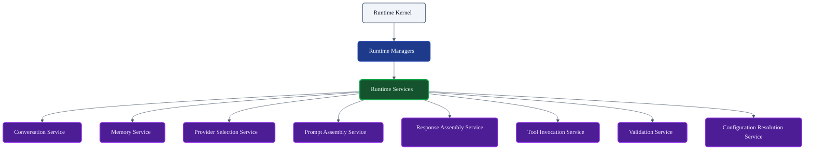
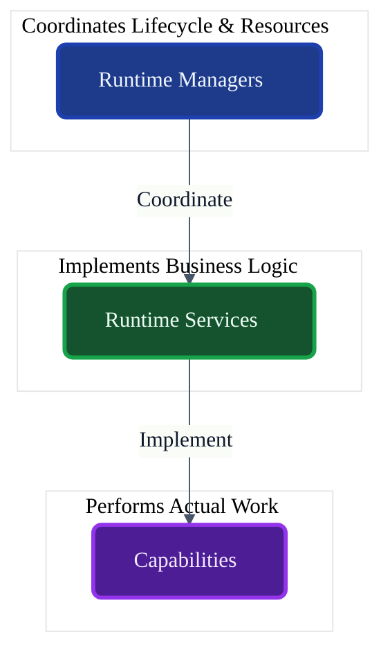
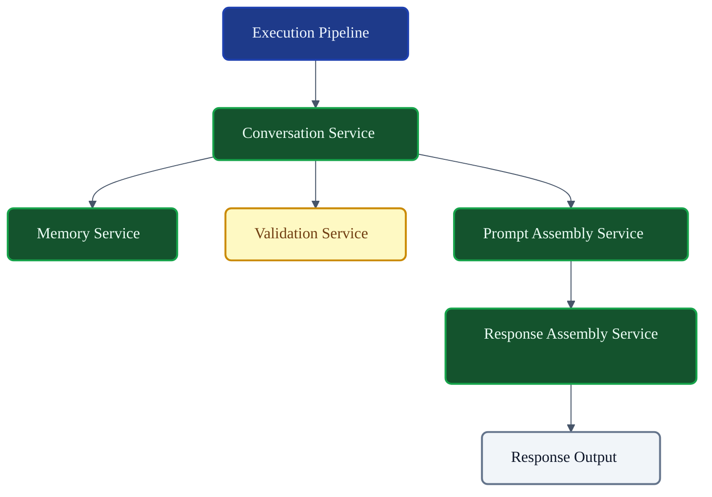
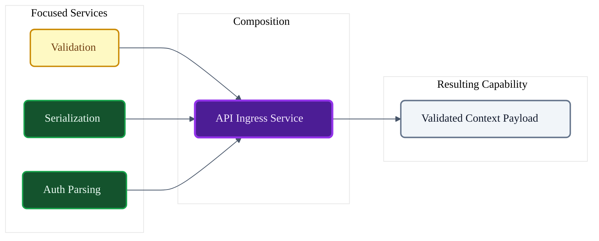

# VoxCore Runtime Services

This document defines the architectural role, responsibilities, ownership boundaries, lifecycle expectations, collaboration model, composition principles, and extension points of Runtime Services within VoxCore.

It answers exactly one engineering question: **"How are reusable runtime capabilities designed, organized, and consumed throughout the VoxCore runtime?"**

Runtime Services encapsulate reusable capabilities. They do not coordinate runtime lifecycle. They do not own runtime resources. They do not orchestrate execution. Those responsibilities belong to Runtime Managers, Runtime Kernel, and Runtime Scheduler.

---

## 1. Purpose

Runtime Services exist to encapsulate discrete, reusable units of execution logic.

Without reusable services:
* **Capability implementations become duplicated**: The logic to assemble an LLM prompt is rewritten in five different modules.
* **Business logic spreads across Managers**: Managers cease to be coordinators and bloat into God Objects containing data parsing and string manipulation.
* **Modules become tightly coupled**: Reusable features cannot be isolated, tested, or swapped independently.
* **Testing becomes difficult**: Mocking complex behaviors requires spinning up the entire Execution Pipeline.
* **Maintenance becomes expensive**: A bug in capability resolution must be hunted down across multiple packages instead of a single, focused service.

Runtime Services centralize reusable capabilities while remaining stateless whenever practical.

---

## 2. Service Philosophy

The design of Runtime Services adheres to the following principles:

* **Capability-Oriented Design**: A service exists to perform a specific, focused action (e.g., extracting memory contexts) rather than modeling a noun.
* **Single Responsibility**: A service must do exactly one thing well. If it parses configurations and formats strings, it must be split.
* **Reusable Behaviour**: Services are built to be called by multiple subsystems (Managers, Pipelines, or other Services).
* **Stateless by Default**: Services should take inputs, apply transformations, and return outputs without holding ongoing conversational or connection state.
* **Explicit Dependencies**: A service declares exactly what it needs to function via defined contracts, never through ambient or hidden service locators.
* **No Resource Ownership**: Services do not own database handles or connection pools (those belong to Managers).
* **No Lifecycle Coordination**: Services do not start or stop the runtime.
* **Composition over Duplication**: Complex behaviors emerge by chaining small, focused services rather than building monolithic utility classes.
* **Framework Independence**: Services do not rely on web frameworks or dependency injection annotations to function.

---

## 3. Responsibilities

Services explicitly distinguish between the logic they execute and the coordination they avoid.

| Responsibility | Description | Owned? |
| :--- | :--- | :--- |
| **Implement reusable capabilities** | Execute domain-specific logic. | **Yes** |
| **Validate inputs** | Ensure data payloads conform to expectations before processing. | **Yes** |
| **Coordinate dependent capabilities**| Chain smaller services together to form complex operations. | **Yes** |
| **Expose well-defined contracts** | Provide strictly typed interfaces for consumers. | **Yes** |
| **Transform runtime data** | Convert internal formats to external schemas (and vice versa). | **Yes** |
| **Enforce capability-specific rules** | Apply specific business constraints to the data payload. | **Yes** |
| **Coordinate lifecycle** | Starting/Stopping global infrastructure. | *Delegated* (Managers) |
| **Persist state** | Writing conversational history to databases. | *Delegated* (Stores) |
| **Determine algorithms** | Selecting the exact math/logic for a capability. | *Delegated* (Strategies) |

---

## 4. Service Categories

VoxCore logically organizes Services based on their operational domain.

### Conversation Service
* **Purpose**: Coordinates localized conversation operations on the domain models.
* **Responsibilities**: Evaluates conversation length limits and applies contextual truncation.
* **Collaborators**: `Memory Service`, `Validation Service`.
* **Dependencies**: Relies on defined conversation interfaces.
* **Ownership**: Owns the structural integrity logic of a `Conversation` payload.

### Memory Service
* **Purpose**: Provides high-level memory operations (e.g., semantic retrieval, summarization).
* **Responsibilities**: Formats query constraints and maps retrieval results back to standard prompt contexts.
* **Collaborators**: `Memory Manager`, `Stores`.
* **Dependencies**: Requires memory storage abstractions.
* **Ownership**: Owns the logic of formatting and applying memory contexts.

### Provider Selection Service
* **Purpose**: Resolves the optimal provider for a given execution constraint.
* **Responsibilities**: Evaluates model capabilities (e.g., token limits, vision support) against registered provider profiles.
* **Collaborators**: `Provider Manager`.
* **Dependencies**: Requires provider capability schemas.
* **Ownership**: Owns capability matching logic.

### Prompt Assembly Service
* **Purpose**: Builds formatted execution prompts from raw dialogue and system contexts.
* **Responsibilities**: Injects memories, appends tool schemas, and ensures token boundaries are respected.
* **Collaborators**: `Memory Service`, `Validation Service`.
* **Dependencies**: Requires domain models (Message, Context).
* **Ownership**: Owns the structure of the prompt payload.

### Response Assembly Service
* **Purpose**: Constructs normalized runtime responses from heterogeneous provider outputs.
* **Responsibilities**: Parses tool call signatures, extracts text, and wraps raw data into domain `Response` entities.
* **Collaborators**: `Validation Service`.
* **Dependencies**: Requires standard formatting schemas.
* **Ownership**: Owns output normalization.

### Tool Invocation Service
* **Purpose**: Coordinates the execution parameters for a registered tool.
* **Responsibilities**: Validates arguments against schemas and safely invokes the tool logic.
* **Collaborators**: `Tool Manager`.
* **Dependencies**: Requires tool registry access.
* **Ownership**: Owns argument validation logic for tools.

### Configuration Resolution Service
* **Purpose**: Computes inherited or overridden configuration values.
* **Responsibilities**: Merges global, session, and request-level configurations into a single valid state tree.
* **Collaborators**: `Configuration Manager`.
* **Dependencies**: Requires config hierarchy models.
* **Ownership**: Owns configuration resolution logic.

### Validation Service
* **Purpose**: Performs reusable structural validation across the runtime.
* **Responsibilities**: Asserts schema adherence, bounds checking, and type validation.
* **Collaborators**: Used universally.
* **Dependencies**: None.
* **Ownership**: Owns runtime invariant enforcement.

### Serialization Service
* **Purpose**: Transforms internal runtime objects for external transit or debugging.
* **Responsibilities**: Serializes/Deserializes domain models to JSON, Protobuf, etc.
* **Collaborators**: Observability subsystems.
* **Dependencies**: None.
* **Ownership**: Owns wire-format transformations.

---

## 5. Public Capabilities

Services expose well-defined operations.

### Resolve Capability
* **Purpose**: Finds an appropriate provider based on requirements.
* **Inputs**: Capability constraints (e.g., `RequiresVision=true`).
* **Outputs**: Provider Identity.
* **Preconditions**: Providers must be registered.
* **Postconditions**: Result matches all constraints.
* **Failure Conditions**: No matching provider found.

### Validate Input
* **Purpose**: Asserts payload integrity.
* **Inputs**: Data payload, Schema definition.
* **Outputs**: Boolean success, List of violations.
* **Preconditions**: None.
* **Postconditions**: Data remains unmodified.
* **Failure Conditions**: Malformed data structure.

### Build Response
* **Purpose**: Normalizes a raw LLM string into a domain object.
* **Inputs**: Raw string, Execution Metadata.
* **Outputs**: `Response` entity.
* **Preconditions**: Raw string is complete.
* **Postconditions**: Formatted entity is ready for Pipeline.
* **Failure Conditions**: Unparseable tool-call syntax.

### Invoke Tool
* **Purpose**: Executes a specific function safely.
* **Inputs**: Tool ID, Argument JSON.
* **Outputs**: Tool Result string.
* **Preconditions**: Tool is registered and active.
* **Postconditions**: Side-effects of the tool apply.
* **Failure Conditions**: Argument validation failure or tool panic.

---

## 6. Composition Rules

Services achieve complexity by composing simpler services together, avoiding monolithic structures.

* **Service composition**: A high-level service (e.g., `Conversation Service`) relies on focused lower-level services (`Validation Service`).
* **Dependency direction**: Dependencies must flow towards more generic, stateless services.
* **Service chaining**: Operations can be chained (e.g., Validate → Assemble → Serialize).
* **Capability delegation**: If a service encounters a task outside its core responsibility, it delegates to an injected collaborating service.
* **Avoid cyclic service dependencies**: Service A cannot depend on Service B if Service B depends on Service A. (Directed Acyclic Graphs only).

---

## 7. Dependency Rules

To preserve independence, Services must obey strict dependency constraints:

* **Services depend on abstractions**: They inject interfaces (e.g., `IValidationService`), not concrete classes.
* **Services shall never depend on Managers**: A Service may rely on data *provided* by a Manager, but it must not inject the Manager itself (prevents coupling to lifecycle mechanisms).
* **Services may collaborate with other Services through defined contracts**: Allowed, provided cycles are avoided.
* **Services shall not construct infrastructure**: A Service cannot instantiate a database connection.
* **Services shall not locate dependencies dynamically**: No global Service Locator patterns inside business logic.
* **Services shall remain independently testable**: A Service must be fully testable with pure unit tests using standard mocking frameworks.

---

## 8. Lifecycle Expectations

Unlike Managers, Services have lightweight lifecycles.

* **Construction**: Instantiated usually once at application startup.
* **Ready**: Available immediately upon instantiation.
* **Active**: Processing incoming capability requests concurrently.
* **Disposed**: Dereferenced during application shutdown.
* **Stateless preference**: Services should avoid holding instance variables that mutate per request. All request-specific state must be passed in via method arguments (e.g., passing the `RuntimeContext`).
* **Shared reuse**: A single Service instance should be safely shareable across multiple concurrent pipeline executions.

---

## 9. Collaboration

### Runtime Managers
* **Dependency Direction**: Managers → Services
* **Information Exchanged**: Managers invoke Services to execute logic on the resources they coordinate.
* **Ownership**: Managers coordinate; Services execute.

### Execution Pipeline
* **Dependency Direction**: Pipeline → Services
* **Information Exchanged**: The Pipeline delegates stages (like Prompt Assembly) to dedicated Services.
* **Ownership**: Pipeline orchestrates the flow; Services perform the steps.

### Strategies
* **Dependency Direction**: Services → Strategies
* **Information Exchanged**: Services inject interchangeable Strategy interfaces to execute variable algorithms (e.g., different chunking strategies for memory).
* **Ownership**: Services consume Strategies.

### Stores
* **Dependency Direction**: Services → Stores
* **Information Exchanged**: Services read/write domain state to persistent interfaces.
* **Ownership**: Services consume Stores.

### Providers & Plugins
* **Dependency Direction**: Providers/Plugins → Services
* **Information Exchanged**: Plugins use reusable Services (like Validation or Serialization) to build their own custom logic safely.
* **Ownership**: External modules depend inward on core Services.

---

## 10. Service Invariants

The following invariants must hold true under all conditions:

1. **A Service shall implement one primary capability.** Prevents the creation of "God Services" (`SystemHelperService`).
2. **A Service shall not own runtime resources.** Connection pools belong to Managers.
3. **A Service shall not coordinate runtime lifecycle.** Services do not start or stop the host process.
4. **Services shall communicate through defined contracts.** No reflection or dynamic typing hacks.
5. **Services shall remain replaceable.** A new package implementation must be able to swap out `ResponseAssemblyService` without breaking the system.
6. **Services shall remain deterministic for identical inputs where practical.** Pure functions are preferred over side-effect-heavy designs.

---

## 11. Failure Behaviour

* **Validation failure**: Services throw typed exceptions or return specific error models immediately upon detecting bad input.
* **Capability failure**: If an internal logic fault occurs, the Service halts its operation but relies on the caller (e.g., Execution Pipeline) to isolate the fault.
* **Dependency failure**: If an injected Strategy or Store fails, the Service propagates the error upward wrapped in contextual diagnostics.
* **Timeout / Cancellation**: Services must respect cancellation tokens passed via method arguments, halting loops or heavy computation early.
* **Recovery boundaries**: Services generally do not retry operations. Retries are the domain of the Scheduler or Pipeline.

---

## 12. Extension Points

The Service architecture allows for seamless extensions:
* **New service categories**: Domain expansions can introduce localized services (e.g., `AudioProcessingService`).
* **Capability extensions**: By implementing identical interfaces, external packages can override default behaviors.
* **Decorators**: Services can be wrapped in decorator patterns to inject transparent caching or retry logic.
* **Interceptors**: Middleware can intercept service invocations for auditing.
* **Instrumentation**: Observability tracing can wrap Service boundaries to measure execution latency.

---

## 13. Design Constraints

The following constraints are mandatory:
* **Services shall not become Managers.** They must not track global connection states.
* **Services shall not own runtime lifecycle.** They do not hook into the OS termination signals.
* **Services shall not own scheduling.** They do not maintain thread pools or queues.
* **Services shall not persist state directly.** They must delegate to `Store` abstractions.
* **Services shall not implement provider-specific logic.** OpenAI JSON parsing belongs in a specific Provider package, not a core Service.
* **Services shall remain cohesive.**
* **Minimal mutable state.** Thread-safety is paramount.

---

## 14. Conclusion

Runtime Services provide reusable capabilities while preserving modularity, explicit ownership, replaceability, and architectural consistency. By remaining stateless, focusing on singular capabilities, and refusing to usurp lifecycle or orchestration responsibilities, Services ensure that VoxCore's business logic remains infinitely testable and easily composable.

---

## Required Tables

### Table 1: Documentation Relationships

| Document | Responsibility |
| :--- | :--- |
| **Runtime Kernel** | Governs runtime lifecycle. |
| **Runtime Managers** | Coordinate runtime resources. |
| **Runtime Services (This Doc)** | Implement reusable capabilities. |
| **Runtime Strategies** | Provide interchangeable algorithms. |
| **Stores & Registries** | Persist or register runtime state. |
| **Package Documents** | Implement concrete services. |

### Table 2: Responsibilities Matrix

| Responsibility | Owner | Delegated To |
| :--- | :--- | :--- |
| **Implement capabilities** | Services | N/A |
| **Validate inputs** | Services | N/A |
| **Transform runtime data** | Services | N/A |
| **Coordinate lifecycle** | N/A | Managers |
| **Persist domain state** | N/A | Stores |
| **Algorithmic execution** | N/A | Strategies |

### Table 3: Service Categories

| Service | Purpose | Collaborates With |
| :--- | :--- | :--- |
| **Conversation Service** | Dialogue payload operations. | Memory, Validation |
| **Memory Service** | Context retrieval mapping. | Stores, Config |
| **Provider Selection** | Resolving execution targets. | Provider Manager |
| **Prompt Assembly** | Formatting LLM inputs. | Context, Models |
| **Response Assembly** | Formatting LLM outputs. | Validation |
| **Tool Invocation** | Safe function execution. | Validation, Context |
| **Validation Service** | Asserting structural integrity. | Universal |

### Table 4: Capability Matrix

| Capability | Purpose | Inputs | Outputs |
| :--- | :--- | :--- | :--- |
| **Validate Input** | Asserts structural integrity. | Data Payload | Boolean + Violations |
| **Resolve Provider** | Finds capability targets. | Requirements | Provider ID |
| **Build Prompt** | Creates execution text. | History, Config | Prompt Payload |
| **Serialize Object** | Formats data for transit. | Domain Object | String / Bytes |

### Table 5: Service Invariants

| Invariant | Reason |
| :--- | :--- |
| **Single capability focus** | Prevents monolithic utility bloat. |
| **No resource ownership** | Resources belong to Managers for safe teardown. |
| **Stateless default** | Enables thread-safe parallel pipeline executions. |
| **Defined interfaces** | Allows safe mocking, testing, and overriding. |
| **No cyclic dependencies** | Prevents stack overflows and unresolvable DI graphs. |

### Table 6: Collaboration Matrix

| Subsystem | Relationship | Dependency Direction |
| :--- | :--- | :--- |
| **Runtime Managers** | Coordinate via Services. | Managers → Services |
| **Execution Pipeline** | Executes stages via Services. | Pipeline → Services |
| **Strategies** | Interjected algorithms for Services. | Services → Strategies |
| **Stores** | Read/write targets for Services. | Services → Stores |
| **Providers/Plugins** | Consume reusable logic. | Providers → Services |

---

## Required Diagrams

### Diagram 1: Runtime Services Within VoxCore

### Diagram 2: Managers vs Services

### Diagram 3: Service Collaboration Model

### Diagram 4: Service Composition

