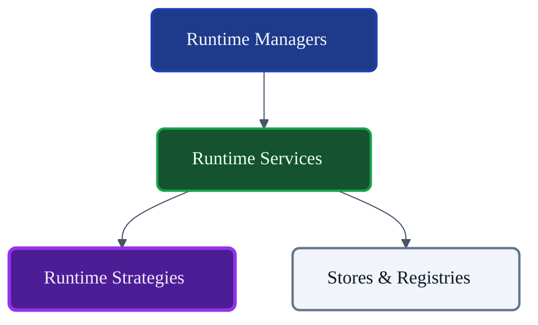
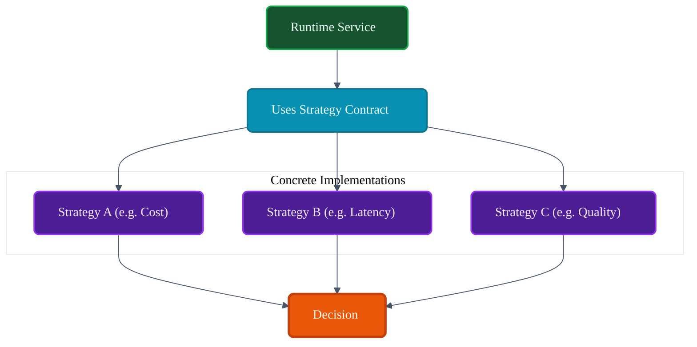
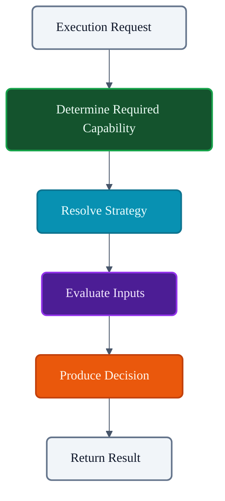
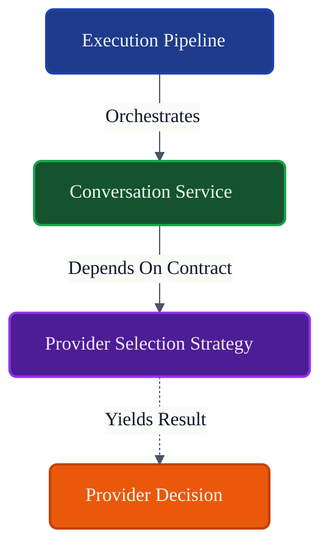

# VoxCore Runtime Strategies

This document defines the architectural role, responsibilities, ownership boundaries, lifecycle expectations, collaboration model, extensibility model, and design constraints of Runtime Strategies within VoxCore.

It answers exactly one engineering question: **"How are interchangeable runtime decision-making and algorithms designed, selected, and executed throughout VoxCore?"**

Runtime Strategies encapsulate replaceable decision logic. They provide alternative implementations for the same conceptual capability while preserving a stable contract. Strategies do not coordinate runtime resources. Strategies do not implement orchestration. Strategies do not persist runtime state.

---

## 1. Purpose

Runtime Strategies exist to isolate interchangeable decision-making from core capability implementations.

Without Strategies:
* **Services accumulate decision logic**: A `ProviderSelectionService` bloats with endless `if-else` blocks for every new routing heuristic.
* **Conditionals spread across the codebase**: Changing how tool arguments are validated requires modifying multiple files.
* **Algorithms become difficult to replace**: Customizing memory chunking for a specific project requires forking the entire Memory package.
* **Experimentation becomes risky**: Testing a new A/B prompt strategy threatens the stability of the main execution pipeline.
* **Extension requires modifying stable services**: The open-closed principle is violated continuously.

Runtime Strategies isolate decision-making behind stable contracts, enabling infinite variation without modifying the core Services.

---

## 2. Strategy Philosophy

The design of Runtime Strategies adheres to the following principles:

* **Encapsulated Decision Logic**: A Strategy represents a specific algorithm, heuristic, or policy isolated from the caller.
* **Replaceable Behaviour**: Any Strategy must be safely swappable with an alternative implementation matching the same contract.
* **Stable Contracts**: The interface defining the Strategy's inputs and outputs remains immutable, regardless of the internal complexity of the implementation.
* **Composition Over Conditional Logic**: Instead of writing `if (useAdvancedRouting)`, the Service injects an `IAdvancedRoutingStrategy`.
* **Single Responsibility**: A Strategy decides *one* thing (e.g., "Which provider is cheapest?"). It does not also decide "Which prompt to use?".
* **Algorithm Independence**: The runtime remains entirely agnostic to how a Strategy calculates its result.
* **Framework Independence**: Strategies do not depend on external dependency injection containers to function.
* **Provider Independence**: A retry strategy evaluates exceptions generically; it is not hardcoded to AWS error codes.
* **Testability**: Strategies must be purely testable as mathematical functions mapping inputs to decisions.

---

## 3. Responsibilities

Strategies explicitly distinguish between making a decision and orchestrating the result.

| Responsibility | Description | Owned? |
| :--- | :--- | :--- |
| **Encapsulate decision logic** | Wrap a specific algorithm or heuristic in a class. | **Yes** |
| **Evaluate runtime conditions** | Read inputs/metadata to formulate a choice. | **Yes** |
| **Choose among alternatives** | Pick a singular path from multiple valid options. | **Yes** |
| **Rank candidates** | Sort a list of valid options by a calculated weight. | **Yes** |
| **Apply configurable policies** | Execute retry, fallback, or timeout logic. | **Yes** |
| **Expose deterministic contracts** | Return typed decision structures. | **Yes** |
| **Support interchangeable implementations** | Multiple strategies share one interface. | **Yes** |
| **Orchestrate execution** | Triggering the actual provider based on the choice. | *Delegated* (Pipeline/Services) |
| **Coordinate resources** | Booting up the chosen provider. | *Delegated* (Managers) |

---

## 4. Strategy Categories

VoxCore organizes Strategies by the architectural decisions they encapsulate.

### Provider Selection Strategy
* **Purpose**: Determines the most appropriate provider.
* **Responsibilities**: Evaluates provider capabilities against task constraints (e.g., cost, latency, vision support).
* **Inputs**: Task requirements, Provider profiles.
* **Outputs**: Provider ID.
* **Selection Criteria**: Cost-based, Latency-based, Capability-based, Round-robin.
* **Collaborators**: `Provider Selection Service`.

### Model Selection Strategy
* **Purpose**: Chooses an execution model.
* **Responsibilities**: Selects the specific LLM/Audio model within a provider based on task context.
* **Inputs**: Context limits, desired output modality.
* **Outputs**: Model identifier string.
* **Selection Criteria**: Token budget, Task complexity.
* **Collaborators**: `Prompt Assembly Service`.

### Retry Strategy
* **Purpose**: Determines retry behaviour.
* **Responsibilities**: Calculates backoff intervals and retry budgets.
* **Inputs**: Attempt count, Exception type.
* **Outputs**: Boolean (Should Retry), Duration (Wait Time).
* **Selection Criteria**: Exponential backoff, Linear backoff, Jitter.
* **Collaborators**: `Execution Monitor`.

### Fallback Strategy
* **Purpose**: Determines fallback behaviour.
* **Responsibilities**: Decides which secondary provider/model to use when the primary fails.
* **Inputs**: Failed Provider ID, Original Task.
* **Outputs**: Alternate Provider ID.
* **Selection Criteria**: Redundancy rules.
* **Collaborators**: `Execution Pipeline`.

### Memory Retrieval Strategy
* **Purpose**: Determines retrieval policy.
* **Responsibilities**: Ranks and filters vector search results for inclusion in prompts.
* **Inputs**: Raw search results, Token budget.
* **Outputs**: Truncated/Ranked context strings.
* **Selection Criteria**: Recency, Relevance, Diversity.
* **Collaborators**: `Memory Service`.

### Tool Selection Strategy
* **Purpose**: Chooses tool candidates.
* **Responsibilities**: Filters the global tool registry down to a subset relevant to the current conversation.
* **Inputs**: Global tool list, Conversation context.
* **Outputs**: Allowed tool schemas.
* **Selection Criteria**: Contextual relevance, Security constraints.
* **Collaborators**: `Tool Invocation Service`.

### Prompt Composition Strategy
* **Purpose**: Determines prompt construction policy.
* **Responsibilities**: Decides the layout and ordering of system instructions vs. memories.
* **Inputs**: Context chunks, Dialogue history.
* **Outputs**: Formatted prompt array.
* **Selection Criteria**: Model-specific optimizations (e.g., Anthropic vs OpenAI structuring).
* **Collaborators**: `Prompt Assembly Service`.

### Response Ranking Strategy
* **Purpose**: Evaluates candidate responses.
* **Responsibilities**: Picks the best output if a provider generated multiple choices.
* **Inputs**: Array of provider outputs.
* **Outputs**: Single best response.
* **Selection Criteria**: Safety scores, Length, Coherence heuristics.
* **Collaborators**: `Response Assembly Service`.

### Scheduling Policy Strategy
* **Purpose**: Defines scheduling policy behaviour without implementing the scheduler.
* **Responsibilities**: Determines task priority and queue ordering.
* **Inputs**: Task queue state.
* **Outputs**: Task execution order.
* **Selection Criteria**: FIFO, Priority-based, Fair-share.
* **Collaborators**: `Runtime Scheduler`.

---

## 5. Strategy Selection Model

How does VoxCore know *which* Strategy to use at runtime?

1. **Strategy discovery**: Strategies are registered at startup within configuration profiles or plugin manifests.
2. **Strategy selection**: Services request a capability. The Dependency Injection container or Context Configuration resolves the interface to the currently configured concrete Strategy.
3. **Strategy replacement**: Administrators can swap a `CostBasedProviderStrategy` for a `LatencyBasedProviderStrategy` via configuration without altering any compiled Service code.
4. **Strategy composition**: Complex decisions (like Fallback) might internally invoke another Strategy (like Provider Selection).
5. **Default strategies**: Every capability ships with a safe, conservative default Strategy (e.g., `FIFOSchedulingStrategy`).
6. **Custom strategies**: External packages can inject proprietary decision logic by implementing the standard strategy interface.

---

## 6. Public Capabilities

Strategies expose standardized decision-making contracts.

### Evaluate
* **Purpose**: Assess a boolean condition.
* **Inputs**: Contextual payload.
* **Outputs**: Boolean.
* **Preconditions**: Valid inputs.
* **Postconditions**: Deterministic true/false.
* **Failure Conditions**: Missing required metadata.

### Select Candidate
* **Purpose**: Pick exactly one option from a list.
* **Inputs**: Array of Candidates.
* **Outputs**: Single Candidate.
* **Preconditions**: Array is not empty.
* **Postconditions**: The selected candidate exists in the original array.
* **Failure Conditions**: No candidate meets criteria.

### Rank Candidates
* **Purpose**: Order a list by preference.
* **Inputs**: Array of Candidates.
* **Outputs**: Sorted Array of Candidates with attached weights.
* **Preconditions**: None.
* **Postconditions**: Output size matches input size.
* **Failure Conditions**: None.

### Resolve Policy
* **Purpose**: Return configuration-like rules (e.g., Retry limits).
* **Inputs**: Error state.
* **Outputs**: Policy struct.
* **Preconditions**: None.
* **Postconditions**: Valid policy generated.
* **Failure Conditions**: None.

---

## 7. Composition Rules

* **Strategy composition**: Strategies can wrap other Strategies (e.g., a `ChainedToolSelectionStrategy` that applies a security filter Strategy, then a relevance filter Strategy).
* **Delegation**: If a Strategy cannot make a decision (e.g., scores are tied), it may delegate to a secondary fallback Strategy.
* **Nested strategies**: A `ProviderSelectionStrategy` may rely on a `CostCalculationStrategy`.
* **Policy composition**: Combining multiple heuristics into an aggregate score.
* **Avoid cyclic dependencies**: Strategy A must not depend on Strategy B if Strategy B depends on Strategy A.
* **No strategy shall directly invoke itself**: To prevent infinite recursion during evaluation.

---

## 8. Dependency Rules

* **Strategies depend on abstractions**: They receive inputs as generic domain models, not concrete database rows.
* **Strategies shall never depend on Managers**: A Strategy evaluates data; it does not check the lifecycle state of a connection pool.
* **Strategies shall not own Services**: A Strategy decides; it does not execute business logic to transform data.
* **Strategies may be consumed by Services**: This is their primary architectural relationship.
* **Strategies shall not construct infrastructure**: A Strategy must never open a network socket or file handle to evaluate a rule.
* **Strategies remain independently testable**: They must execute instantaneously in unit tests given static inputs.

---

## 9. Lifecycle Expectations

* **Construction**: Instantiated at startup, often as Singletons.
* **Availability**: Immediately ready; no boot sequence required.
* **Selection**: Invoked dynamically per-request by Services.
* **Execution**: Synchronous, fast, CPU-bound calculation.
* **Disposal**: Garbage collected at shutdown.
* **Reuse**: A single Strategy instance is shared across all concurrent Pipeline executions.
* **Stateless preference**: Strategies must not store request data in instance fields. All evaluation parameters must be passed in method arguments.

---

## 10. Collaboration

### Runtime Services
* **Dependency Direction**: Services → Strategies
* **Information Exchanged**: Services pass Context and candidates; Strategies return Decisions.
* **Ownership**: Services consume Strategies.

### Managers
* **Dependency Direction**: None directly. (Managers coordinate Services, which use Strategies).
* **Information Exchanged**: None.
* **Ownership**: Strictly decoupled.

### Execution Pipeline
* **Dependency Direction**: Pipeline → Strategies (via Services)
* **Information Exchanged**: Determines retry and fallback paths.
* **Ownership**: Pipeline consumes strategy decisions to shape execution flow.

### Providers & Tools
* **Dependency Direction**: None.
* **Information Exchanged**: Strategies evaluate metadata *about* providers, but do not interact with the providers themselves.
* **Ownership**: Strictly decoupled.

---

## 11. Strategy Invariants

The following invariants must hold true under all conditions:

1. **Every Strategy shall implement one decision responsibility.** (e.g., Do not mix Provider Selection with Prompt Assembly).
2. **Strategies shall remain interchangeable.** Consumers must only know the interface.
3. **Strategies shall expose stable contracts.** A change in a heuristic must not change the method signature.
4. **Strategies shall not own runtime resources.** They are pure computation.
5. **Strategies shall not persist state.** Evaluation history is emitted via Observability, not written to a database by the Strategy.
6. **Strategies shall remain deterministic for equivalent inputs where practical.** Randomization (like Jitter) must be explicitly isolated or seeded.

---

## 12. Failure Behaviour

* **Evaluation failure**: If a Strategy crashes due to a bug, it throws an exception that the consuming Service must catch.
* **Invalid inputs**: A Strategy must safely reject malformed candidate lists, returning a typed `EvaluationError`.
* **No suitable candidate**: If a `Select Candidate` Strategy finds zero matches, it returns a semantic `None` or `Empty` result rather than crashing.
* **Fallback invocation**: If a Strategy returns no result, the Service may invoke a distinct Fallback Strategy.
* **Dependency failure**: If a nested Strategy fails, the parent Strategy propagates the failure deterministically.
* **Recovery boundaries**: Strategies do not retry their own logic. They yield the failure to the Service.

---

## 13. Extension Points

* **New strategy categories**: Introducing a new architectural choice (e.g., `CacheEvictionStrategy`).
* **Custom strategies**: Users can write a `ProprietaryRoutingStrategy` and inject it via configuration.
* **Policy injection**: Altering strategy weights dynamically via config reloads.
* **Decorators**: Wrapping a Strategy to emit latency metrics or log decisions without altering the algorithm.
* **Diagnostics**: Emitting the "Reasoning" trace of *why* a Strategy made a decision to the Event Bus.

---

## 14. Design Constraints

The following constraints are mandatory:
* **Strategies shall not become Services.** They make choices, they do not assemble responses.
* **Strategies shall not coordinate runtime lifecycle.**
* **Strategies shall not own runtime resources.**
* **Strategies shall not implement providers.** They choose AWS; they do not invoke AWS.
* **Strategies shall not persist runtime state.**
* **Strategies shall remain cohesive.**
* **Minimal mutable state.** Thread-safety is absolute.

---

## 15. Conclusion

Runtime Strategies encapsulate interchangeable decision-making, enabling extensibility, experimentation, and clean separation of concerns throughout VoxCore. By preventing if-else sprawls inside Services, Strategies ensure that VoxCore's logic remains mathematically testable, infinitely customizable, and architecturally pristine.

---

## Required Tables

### Table 1: Documentation Relationships

| Document | Responsibility |
| :--- | :--- |
| **Runtime Managers** | Coordinate runtime resources. |
| **Runtime Services** | Compose reusable capabilities. |
| **Runtime Strategies (This Doc)**| Encapsulate interchangeable decision logic. |
| **Stores & Registries** | Persist or register runtime state. |
| **Package Documents** | Implement concrete strategy implementations. |

### Table 2: Responsibilities Matrix

| Responsibility | Owner | Delegated To |
| :--- | :--- | :--- |
| **Encapsulate decision logic** | Strategies | N/A |
| **Rank/Select alternatives** | Strategies | N/A |
| **Expose decision contracts** | Strategies | N/A |
| **Orchestrate execution flow**| N/A | Services / Pipeline |
| **Coordinate resource lifecycle**| N/A | Managers |
| **Transform runtime data** | N/A | Services |

### Table 3: Strategy Categories

| Strategy | Purpose | Consumed By |
| :--- | :--- | :--- |
| **Provider Selection** | Chooses best execution target. | Provider Selection Service |
| **Model Selection** | Chooses specific model variant. | Prompt Assembly Service |
| **Retry / Fallback** | Determines error recovery path. | Execution Pipeline |
| **Memory Retrieval** | Determines context ranking. | Memory Service |
| **Tool Selection** | Filters allowed tools. | Tool Invocation Service |
| **Response Ranking** | Evaluates candidate outputs. | Response Assembly Service |

### Table 4: Selection Matrix

| Strategy | Selection Criteria | Outputs |
| :--- | :--- | :--- |
| **Provider Selection** | Cost, Latency, Modality | Provider ID |
| **Retry Strategy** | Exception Type, Attempt # | Wait Duration, Boolean |
| **Memory Retrieval** | Relevance Score, Recency | Ranked Context Array |
| **Tool Selection** | Trust Level, Context Need | Filtered Schema List |

### Table 5: Strategy Invariants

| Invariant | Reason |
| :--- | :--- |
| **Decision isolation** | Prevents conditional bloat in Services. |
| **No resource ownership** | Ensures Strategies remain pure computation. |
| **Stable contracts** | Allows safe interchangeability via DI. |
| **No persistence** | Prevents Strategies from causing disk/network I/O bottlenecks. |
| **Stateless evaluation** | Ensures thread-safe concurrent pipeline evaluations. |

### Table 6: Collaboration Matrix

| Subsystem | Relationship | Dependency Direction |
| :--- | :--- | :--- |
| **Runtime Services** | Use Strategies to make choices. | Services → Strategies |
| **Execution Pipeline** | Evaluates retry/fallback. | Pipeline → Strategies |
| **Configuration** | Injects concrete Strategy logic. | Config → Strategies |
| **Observability** | Decorates Strategies for metrics. | Observability → Strategies |

---

## Required Diagrams

### Diagram 1: Runtime Strategies Within VoxCore

### Diagram 2: Capability vs Strategy

### Diagram 3: Strategy Selection Flow

### Diagram 4: Strategy Collaboration

