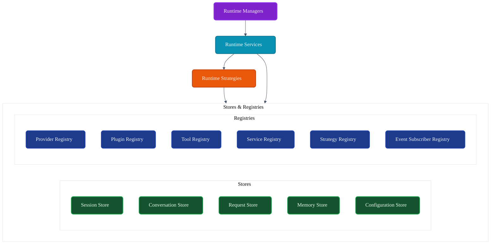
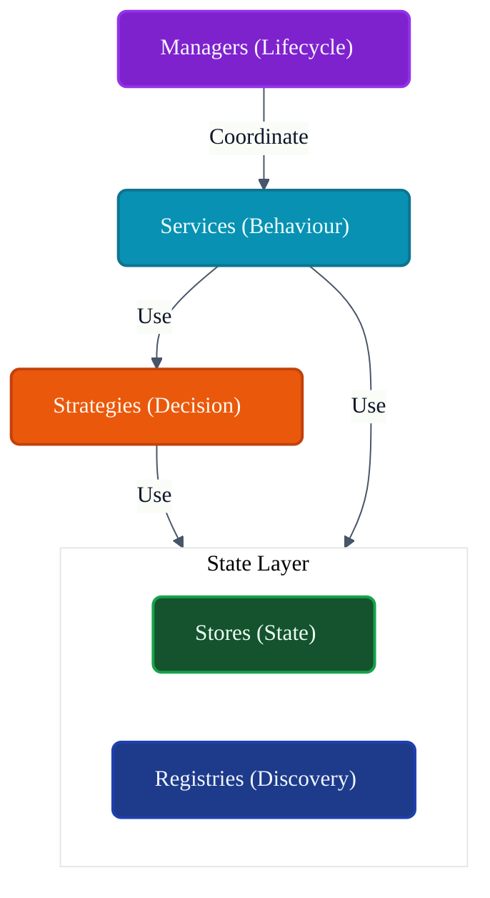
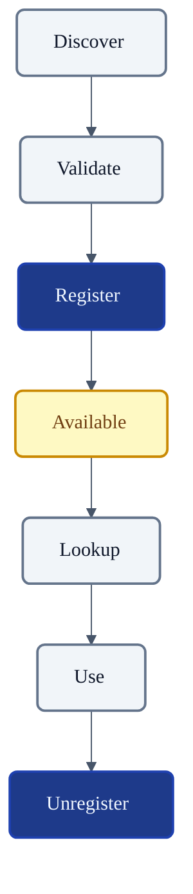
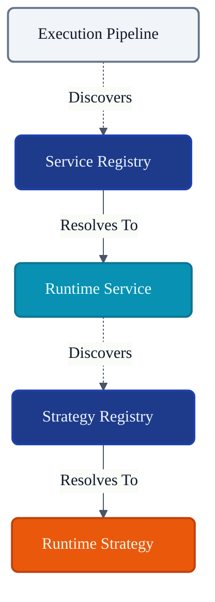
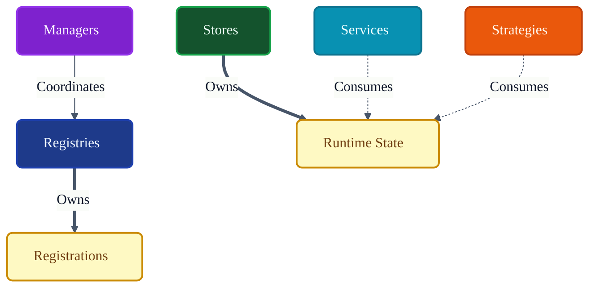

# VoxCore Stores and Registries

This document defines the architectural role, responsibilities, ownership boundaries, lifecycle expectations, collaboration model, consistency rules, extension model, and design constraints of Stores and Registries within VoxCore.

It answers exactly one engineering question: **"How is runtime state stored, indexed, registered, and retrieved throughout VoxCore?"**

Stores and Registries provide the authoritative location for runtime state and object registration. They do not execute business logic. They do not coordinate runtime lifecycle. They do not make runtime decisions. They do not orchestrate execution.

---

## 1. Purpose

Stores and Registries exist to decouple the ownership of runtime state from the components that execute behaviour.

Without them:
* **Runtime state becomes duplicated**: Multiple Services maintain isolated, out-of-sync copies of active Sessions.
* **Ownership becomes ambiguous**: It becomes unclear whether the Manager or the Service is responsible for updating conversational memory.
* **Lookups become inconsistent**: Services invent ad-hoc indexing structures (e.g., global static dictionaries) to find dependencies.
* **Registrations become scattered**: Finding available Providers or Plugins requires scanning across multiple decoupled lifecycle coordinators.
* **Lifecycle tracking becomes difficult**: Teardown routines cannot reliably determine which objects are still active in memory.

Stores and Registries provide centralized ownership of runtime state while preserving modularity.

---

## 2. Store & Registry Philosophy

The design adheres to the following principles:

* **Single Source of Truth**: For any given entity (e.g., a Session or a Registered Provider), there is exactly one authoritative index.
* **Explicit Ownership**: Stores own data. Registries own indexes of capabilities.
* **Controlled Mutability**: Mutations to runtime state are channeled through defined repository interfaces, never via direct property manipulation on ambient objects.
* **Deterministic Lookup**: Querying a Registry for a Strategy by ID must return exactly one result or a predictable `NotFound` failure.
* **Registration Before Use**: Capabilities (Tools, Providers) must be explicitly indexed in a Registry before the Pipeline can resolve them.
* **Clear Separation Between Storage and Behaviour**: A Store knows *how* to save a `Conversation`; it does not evaluate *why* it should be saved.
* **Framework Independence**: Stores provide an abstraction over data persistence; they do not expose ORM (Object-Relational Mapping) semantics directly.
* **Provider Independence**: Registries are agnostic to whether the registered provider is OpenAI or AWS Bedrock.

---

## 3. Responsibilities

Stores and Registries distinguish sharply between state maintenance and active behaviour.

| Responsibility | Description | Owned? |
| :--- | :--- | :--- |
| **Maintain runtime state** | Holding the definitive representations of active entities. | **Yes (Stores)** |
| **Maintain registrations** | Cataloging available capability implementations. | **Yes (Registries)** |
| **Support lookups** | Providing deterministic querying for IDs/Metadata. | **Yes** |
| **Validate registrations** | Ensuring objects conform to required schemas upon entry. | **Yes** |
| **Enforce uniqueness** | Rejecting duplicate IDs or conflicting state entries. | **Yes** |
| **Expose retrieval operations**| Serving references to requesting Managers or Services. | **Yes** |
| **Manage removal** | Purging state/registrations safely. | **Yes** |
| **Preserve consistency** | Maintaining referential integrity between linked states. | **Yes** |
| **Orchestrate execution** | Invoking registered Tools or Providers. | *Delegated* (Pipeline) |
| **Evaluate algorithms** | Sorting memories by relevance. | *Delegated* (Strategies) |

---

## 4. Store Categories

Stores maintain the authoritative state of transient and persistent runtime entities.

### Session Store
* **Purpose**: Maintains active runtime sessions.
* **Owned State**: User contexts, connection lifetimes, session correlation IDs.
* **Collaborators**: `Session Manager`.
* **Lifecycle**: Tied to the connection/user lifecycle.
* **Visibility**: Readable by Services via Context; writable by Session Manager.

### Conversation Store
* **Purpose**: Maintains conversation state references.
* **Owned State**: Dialogue history, appended messages, interaction turns.
* **Collaborators**: `Conversation Service`.
* **Lifecycle**: Exists beyond individual requests; appended iteratively.
* **Visibility**: Globally readable for Prompt Assembly.

### Request Store
* **Purpose**: Maintains active requests.
* **Owned State**: In-flight payload data, trace IDs, pending execution status.
* **Collaborators**: `Runtime Kernel`, `Scheduler`.
* **Lifecycle**: Highly transient; spans from dispatch to completion.
* **Visibility**: Internal to the Pipeline and Scheduler.

### Response Store
* **Purpose**: Maintains generated responses.
* **Owned State**: Generated outputs, token usage, tool results.
* **Collaborators**: `Response Assembly Service`.
* **Lifecycle**: Ephemeral; passed back to the user or appended to Conversation Store.
* **Visibility**: Exposed at execution boundaries.

### Memory Store
* **Purpose**: Maintains runtime memory references.
* **Owned State**: Vector embeddings, semantic contexts, knowledge graphs.
* **Collaborators**: `Memory Manager`, `Memory Service`.
* **Lifecycle**: Highly persistent.
* **Visibility**: Used by capability resolution and prompt assembly.

### Configuration Store
* **Purpose**: Maintains resolved configuration.
* **Owned State**: Global settings, feature flags, API keys.
* **Collaborators**: `Configuration Manager`.
* **Lifecycle**: Loaded at boot; updated on reload.
* **Visibility**: Read-only to all subsystems.

### Metadata Store
* **Purpose**: Maintains runtime metadata.
* **Owned State**: System health, active module versions, metrics limits.
* **Collaborators**: Observability subsystems.
* **Lifecycle**: Spans the lifetime of the process.
* **Visibility**: Used for diagnostics.

---

## 5. Registry Categories

Registries maintain the authoritative indexes of executable implementations.

### Provider Registry
* **Purpose**: Maintains available providers.
* **Registered Objects**: `ProviderInstance` configurations and health states.
* **Lookup Responsibilities**: Resolving IDs to concrete execution targets.
* **Ownership**: Owns the index of connected model providers.

### Plugin Registry
* **Purpose**: Maintains plugins.
* **Registered Objects**: Third-party extensions and capability modules.
* **Lookup Responsibilities**: Exposing plugin hooks and initialization statuses.
* **Ownership**: Owns the manifest of active plugins.

### Tool Registry
* **Purpose**: Maintains runtime tools.
* **Registered Objects**: Tool Schemas, arguments, and function references.
* **Lookup Responsibilities**: Matching Tool Names to executable schemas.
* **Ownership**: Owns the catalog of capabilities exposed to the LLM.

### Service Registry
* **Purpose**: Maintains runtime services.
* **Registered Objects**: Core service abstractions.
* **Lookup Responsibilities**: Resolving Service Interfaces to implementations.
* **Ownership**: Owns the composition mapping for the runtime.

### Strategy Registry
* **Purpose**: Maintains strategy implementations.
* **Registered Objects**: Decision algorithms and heuristic policies.
* **Lookup Responsibilities**: Resolving capability decisions to concrete logic.
* **Ownership**: Owns the catalog of interchangeable behaviours.

### Event Subscriber Registry
* **Purpose**: Maintains event subscriptions.
* **Registered Objects**: Event handlers mapping to specific topic strings.
* **Lookup Responsibilities**: Returning all handlers bound to an emitted event.
* **Ownership**: Owns the routing tables for the `Runtime Event Bus`.

---

## 6. Public Capabilities

Stores and Registries expose standardized operations to interact with state and catalogs.

### Register / Store
* **Purpose**: Inserts a new object or state entry.
* **Inputs**: Payload, Identity Key.
* **Outputs**: Boolean success.
* **Preconditions**: ID is unique (or explicit overwrite is allowed).
* **Postconditions**: Object is permanently indexed.
* **Failure Conditions**: Validation failure, uniqueness constraint violation.

### Unregister / Remove
* **Purpose**: Safely evicts an entry.
* **Inputs**: Identity Key.
* **Outputs**: Boolean success.
* **Preconditions**: Key exists.
* **Postconditions**: Object is purged; subsequent lookups fail.
* **Failure Conditions**: Reference integrity blocks deletion.

### Lookup / Retrieve
* **Purpose**: Fetches the authoritative object.
* **Inputs**: Identity Key / Search Constraints.
* **Outputs**: Object reference or Schema.
* **Preconditions**: None.
* **Postconditions**: Original state is not mutated.
* **Failure Conditions**: Key not found.

### Exists
* **Purpose**: Quickly checks for presence without fetching payloads.
* **Inputs**: Identity Key.
* **Outputs**: Boolean.
* **Preconditions**: None.
* **Postconditions**: None.
* **Failure Conditions**: None.

### Enumerate
* **Purpose**: Returns a list of all active entries.
* **Inputs**: Optional pagination/filters.
* **Outputs**: Array of Objects.
* **Preconditions**: None.
* **Postconditions**: None.
* **Failure Conditions**: None.

### Update
* **Purpose**: Modifies an existing state entry.
* **Inputs**: Identity Key, Partial Payload.
* **Outputs**: Updated Object.
* **Preconditions**: Key exists.
* **Postconditions**: State is durably mutated.
* **Failure Conditions**: Validation failure.

---

## 7. Ownership Rules

Ownership boundaries prevent Stores and Registries from accumulating behaviour.

**Stores own:**
* Runtime state (actual values and payloads).
* Runtime metadata (timestamps, version tags).
* Runtime references (foreign keys between states).

**Registries own:**
* Registrations (the act of cataloging an implementation).
* Discovery information (metadata required to find a capability).
* Lookup indexes (hash maps mapping IDs to functions).

**Stores reference:**
* Domain entities (Sessions, Tasks, Contexts).

**Registries reference:**
* Registered components (Services, Strategies, Tools).

**Stores shall never own:**
* **Business behaviour**: A Store holds a `Message`, it does not append it to a string.
* **Managers, Services, Strategies**: Stores only persist data models.

**Registries shall never own:**
* **Implementations**: They catalog pointers to functions; they do not execute them.
* **Runtime execution**: They provide the target to the Pipeline, but the Pipeline executes.
* **Scheduler state**: Queue depths are not cataloged in a generic Registry.

---

## 8. Consistency Rules

* **Uniqueness**: Registries strictly enforce that no two distinct Tools share the same `ToolName`. Stores enforce unique Primary Keys for Sessions.
* **Reference integrity**: A `Request Store` must not allow a request to be linked to a deleted `Session` ID.
* **Registration consistency**: A Provider cannot be registered if its required Strategy dependencies are missing.
* **Ownership consistency**: Only the `Memory Manager` is permitted to execute `Update` operations on the `Memory Store`; other components may only `Retrieve`.
* **State synchronization**: In-memory indexes must match durable storage if the Store wraps a persistent database.
* **Removal consistency**: Unregistering a Plugin automatically evicts all Tools that were registered by that Plugin.
* **Visibility consistency**: Lookups must remain deterministic regardless of concurrent Pipeline executions.

---

## 9. Lifecycle Expectations

* **Registration**: Objects are submitted. The Registry validates the schema and allocates index slots.
* **Activation**: The Store/Registry makes the object visible to concurrent `Lookup` queries.
* **Availability**: Objects remain passively available for constant, rapid querying.
* **Update**: Stores support frequent mutation of State; Registries treat registrations as largely immutable (requires unregistering and re-registering to change capabilities).
* **Removal**: Eviction purges the index. The Registry does not *dispose* the underlying memory of the component itself—it merely drops the reference.
* **Cleanup**: Stores ensure database locks or file handles are released when the runtime stops.
* **Disposal**: Controlled entirely by the Runtime Managers coordinating the host application.

---

## 10. Collaboration

### Runtime Managers
* **Dependency Direction**: Managers → Stores/Registries
* **Information Exchanged**: Managers initialize the Stores and push registrations into the Registries during boot.
* **Ownership**: Managers coordinate the Stores.

### Runtime Services
* **Dependency Direction**: Services → Stores/Registries
* **Information Exchanged**: Services fetch history from Stores and resolve dependencies from Registries.
* **Ownership**: Services consume Stores.

### Runtime Strategies
* **Dependency Direction**: Strategies → Stores
* **Information Exchanged**: Strategies may evaluate heuristics based on metadata pulled from Stores.
* **Ownership**: Strategies consume Stores.

### Execution Pipeline
* **Dependency Direction**: Pipeline → Registries
* **Information Exchanged**: Pipeline looks up the correct Provider or Tool schema before execution.
* **Ownership**: Pipeline consumes Registries.

---

## 11. Store & Registry Invariants

The following invariants must hold true under all conditions:

1. **Every registered component has one registry owner.** Prevents fragmented lookup tables.
2. **Every runtime object has one authoritative store.** (e.g., Session state must not be split across two disparate stores).
3. **Registrations are unique.** Name collisions crash the registration process immediately.
4. **Stores do not implement behaviour.** They are dumb repositories.
5. **Registries do not instantiate implementations.** They hold references to already-constructed instances or schemas.
6. **State ownership is explicit.** Components know who owns the data they are interacting with.
7. **Reference integrity is preserved.** Deleting a parent cascade-fails or cascade-deletes children cleanly.

---

## 12. Failure Behaviour

* **Duplicate registration**: Throws an immediate `RegistrationConflictError`.
* **Missing registration**: Fails cleanly with a semantic `NotFound` rather than returning a null pointer.
* **Lookup failure**: Network partitions to remote Stores yield `StorageUnavailableError`, prompting fallback strategies.
* **State inconsistency**: If a referenced foreign key vanishes, the Store must reject the transaction.
* **Removal failure**: If an object cannot be unregistered (e.g., currently locked by execution), the Registry marks it `Draining` and purges it later.
* **Diagnostics**: All validation rejections emit exact semantic reasons to the Observability subsystem.

---

## 13. Extension Points

* **Additional stores**: Hooking in a new `TelemetryStore` without disrupting session management.
* **Additional registries**: Adding a `PromptTemplateRegistry` for customized deployments.
* **Validation policies**: Injecting new schemas that Registries enforce before accepting new Tools.
* **Lookup policies**: Implementing fuzzy-matching or alias-resolution inside Registries.
* **Metrics**: Emitting cache-hit vs cache-miss ratios from Stores.

---

## 14. Design Constraints

The following constraints are mandatory:
* **Stores shall not implement business logic.**
* **Registries shall not coordinate runtime lifecycle.**
* **Stores shall not become caches for arbitrary data.** (State must map to defined domain entities).
* **Registries shall not instantiate implementations.** (No `new` keywords hidden inside Registry `Lookup` methods).
* **Stores shall remain cohesive.** (One store per major domain aggregate).
* **Registries shall remain cohesive.** (Do not mix Tools and Event Subscribers in the same index).
* **Minimal mutable state.** Registries should optimize for read-heavy concurrency.

---

## 15. Conclusion

Stores and Registries provide centralized ownership of runtime state and registrations while preserving modularity, consistency, discoverability, and architectural separation. By strictly divorcing the storage of state (`Where`) from the execution of capabilities (`What`), VoxCore ensures that data remains uncorrupted and dependencies remain infinitely resolvable without entangling business logic.

---

## Required Tables

### Table 1: Documentation Relationships

| Document | Responsibility |
| :--- | :--- |
| **Runtime Managers** | Coordinate runtime resources. |
| **Runtime Services** | Implement reusable capabilities. |
| **Runtime Strategies** | Encapsulate interchangeable decision logic. |
| **Stores & Registries (This Doc)** | Maintain runtime state and registrations. |
| **Package Documents** | Implement concrete stores and registries. |

### Table 2: Responsibilities Matrix

| Responsibility | Owner | Delegated To |
| :--- | :--- | :--- |
| **Maintain runtime state** | Stores | N/A |
| **Maintain registrations** | Registries | N/A |
| **Validate uniqueness** | Stores / Registries | N/A |
| **Execute business logic**| N/A | Services |
| **Evaluate choices** | N/A | Strategies |
| **Coordinate lifecycle** | N/A | Managers |

### Table 3: Store Categories

| Store | Purpose | Owned State |
| :--- | :--- | :--- |
| **Session Store** | Tracks active interactions. | Connection context, metadata |
| **Conversation Store**| Tracks dialogue history. | Message arrays, turns |
| **Request Store** | Tracks in-flight tasks. | Execution payloads |
| **Memory Store** | Tracks semantic context. | Vector embeddings, graphs |
| **Configuration Store**| Tracks global settings. | Config state tree |

### Table 4: Registry Categories

| Registry | Purpose | Registered Objects |
| :--- | :--- | :--- |
| **Provider Registry** | Discovers model backends. | Provider Instances |
| **Plugin Registry** | Discovers extensions. | Plugin Manifests |
| **Tool Registry** | Discovers capabilities. | Tool Schemas & Hooks |
| **Service Registry** | Discovers logic. | Service Interfaces |
| **Strategy Registry** | Discovers decisions. | Strategy Implementations |

### Table 5: Capability Matrix

| Capability | Purpose | Used By |
| :--- | :--- | :--- |
| **Register** | Index a new capability. | Managers / Plugins |
| **Store / Update** | Mutate runtime state. | Services / Pipeline |
| **Lookup** | Fetch capability by ID. | Pipeline / Services |
| **Retrieve** | Fetch state by Key. | Services / Strategies |

### Table 6: Ownership Matrix

| Owns | References | Never Owns |
| :--- | :--- | :--- |
| **Runtime State** | Domain Entities | Business Behaviour |
| **Registrations** | Capability Hooks | Implementations |
| **Indexes** | Execution IDs | Execution Logic |

### Table 7: Store & Registry Invariants

| Invariant | Reason |
| :--- | :--- |
| **Single authoritative store** | Prevents split-brain state corruption. |
| **Strict uniqueness** | Ensures lookups always resolve deterministically. |
| **No business behaviour** | Protects the boundary between Data and Logic. |
| **No instantiation in Registry**| Prevents Registries from acting as hidden Factories. |
| **Explicit reference integrity**| Prevents dangling pointers across distributed states. |

---

## Required Diagrams

### Diagram 1: Stores & Registries Within VoxCore

### Diagram 2: Managers, Services, Strategies, Stores

### Diagram 3: Registration Lifecycle

### Diagram 4: Lookup Model

### Diagram 5: Ownership Model

