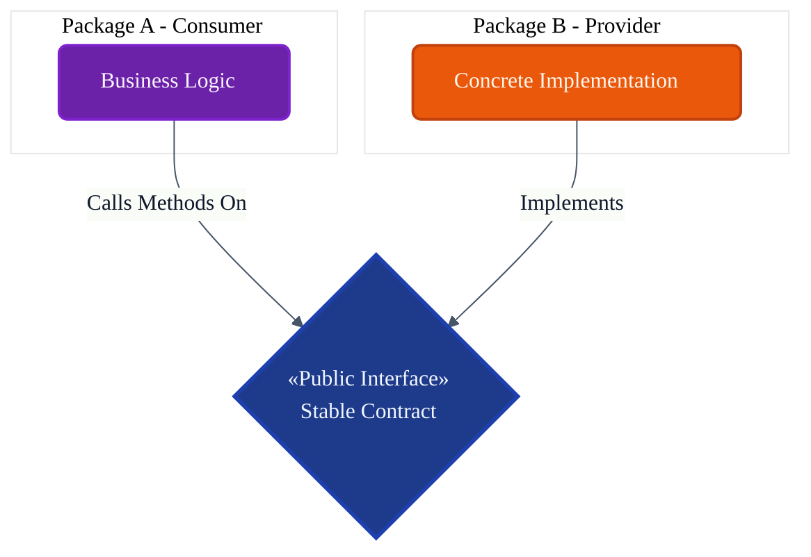
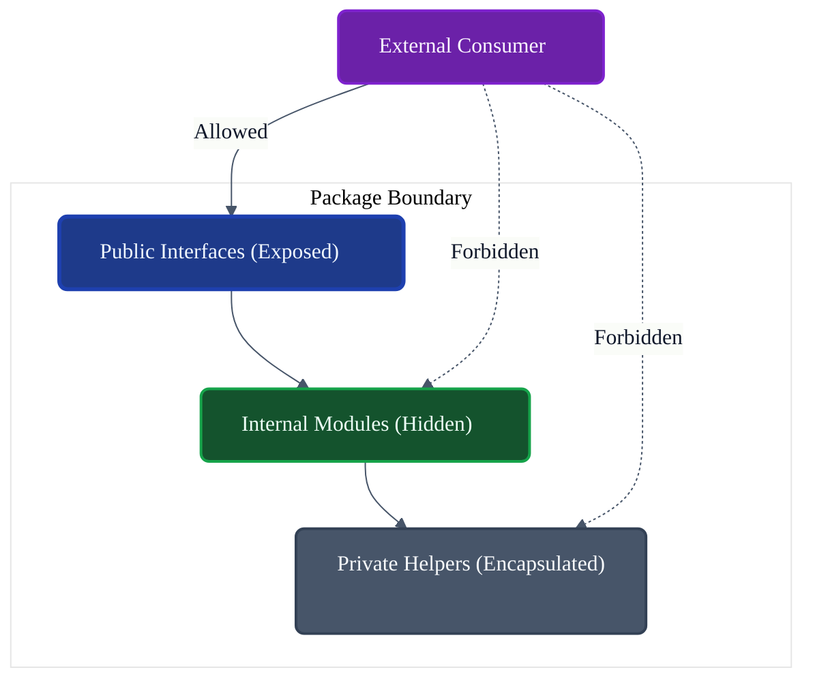
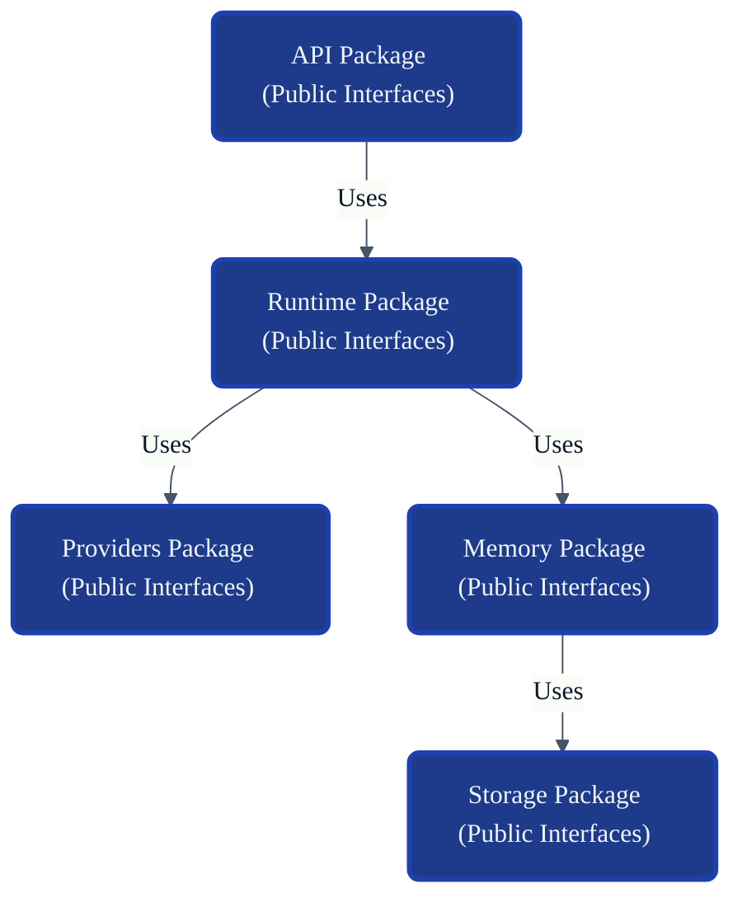

# VoxCore Public Module Interfaces

This document defines the design principles, ownership rules, visibility boundaries, interface categories, versioning strategy, dependency rules, and extension model for every public interface exposed by VoxCore packages.

It answers exactly one engineering question: **"What constitutes a public interface in VoxCore, and how must packages expose capabilities while preserving encapsulation and loose coupling?"**

This document establishes the universal architectural rules for all public interfaces in VoxCore. It does not define individual interfaces, but rather the structural constraints that every package-specific public boundary must follow.

---

## 1. Purpose

Explicit public interfaces exist to enforce the hard boundaries between architectural packages.

Without explicit public boundaries:
* **Packages become tightly coupled**: Changes in one package's database schema immediately break another package's logic.
* **Internal classes leak**: Consumers rely on undocumented, unstable internal state.
* **Refactoring becomes risky**: Without a stable API surface, replacing a module requires rewriting the entire system.
* **Dependency inversion weakens**: High-level modules become dependent on low-level implementation details.
* **Extension becomes difficult**: Third-party plugins cannot rely on stable contracts to mount their capabilities.

Public interfaces are the **only** supported communication mechanism between packages.

---

## 2. Interface Philosophy

The design and maintenance of all VoxCore interfaces adhere to the following principles:

* **Stable Boundaries**: A public interface is a promise. It must remain stable even when the underlying implementation is completely rewritten.
* **Encapsulation**: Interfaces never expose internal state, private helper classes, or framework-specific objects.
* **Minimal Public Surface**: A package exposes exactly what is required by its consumers and nothing more.
* **Dependency Inversion**: Consumers define the interfaces they need; providers implement them. This reverses the direction of dependency.
* **Implementation Hiding**: Consumers only know that an interface exists; they never know which concrete class implements it.
* **Backward Compatibility**: Interface evolution must be additive to prevent breaking downstream consumers.
* **Single Ownership**: Every interface belongs to exactly one logical domain/package.
* **Provider Independence**: Interfaces use abstract domain types (e.g., `Message`, `Role`) instead of vendor-specific types (e.g., `OpenAIMessage`).

---

## 3. Interface Categories

Interfaces are categorized by the architectural domain they serve.

| Category | Purpose | Primary Consumer | Primary Owner |
| :--- | :--- | :--- | :--- |
| **Runtime Interfaces** | Orchestration, state machine, pipeline coordination. | API, Plugins | Runtime Package |
| **Service Interfaces** | Reusable domain logic and capabilities. | Runtime Package | Service Packages |
| **Provider Interfaces** | AI generation and embedding abstractions. | Runtime, Plugins | Providers Package |
| **Storage Interfaces** | Persistence operations and repositories. | Memory, Runtime | Storage Package |
| **Memory Interfaces** | Context retrieval, ranking, and semantic search. | Runtime Package | Memory Package |
| **Tool Interfaces** | Executable actions and sandbox validation. | Runtime, Providers | Tools Package |
| **Plugin Interfaces** | Extensibility hooks and lifecycle definitions. | Third-Party Devs | Plugins Package |
| **Configuration Interfaces** | Typed settings and environment parameters. | All Packages | Configuration Pkg |
| **Security Interfaces** | Authentication, authorization, credentials. | API, Runtime | Security Package |
| **Observability Interfaces**| Logging, tracing, metrics, and health probes. | All Packages | Observability Pkg |

---

## 4. Visibility Rules

VoxCore strictly categorizes code visibility into the following levels:

* **Public**: Defined in the public boundary (e.g., `Contracts` or explicit `public/` directories). Accessible by any external package or plugin.
* **Package Internal**: Modules intended to be shared *within* a single package but hidden from the outside. Accessible only by sibling modules within the same package.
* **Private**: Encapsulated helper classes or variables. Accessible only by the declaring file or class.
* **Extension Interface**: A specific subset of Public interfaces designed explicitly for third-party Plugin authors to implement (e.g., `ITool`, `IProvider`). Accessible globally.
* **Experimental Interface**: Interfaces that are public but explicitly marked as unstable. Accessible globally, but subject to breaking changes without major version bumps.

---

## 5. Interface Ownership

* **One Owner**: Every public interface has exactly one owning package that dictates its evolution.
* **Implementations never own interfaces**: An HTTP Transport adapter implements `ITransport`, but the `Transport Package` or `Contracts Package` owns the interface.
* **Versioning**: Interfaces are versioned alongside their owning package.
* **Unambiguous Ownership**: If two packages both need an interface and neither clearly owns it, it belongs in the shared `Contracts` package.

---

## 6. Public Surface Design Rules

When defining a public interface in VoxCore, the following architectural rules apply:

* **Expose capabilities, not implementation**: An interface should read as `GenerateResponse(Prompt)`, not `SendHttpRequestToLLM(JSON)`.
* **Avoid leaking internal models**: Do not use ORM entities (e.g., SQLAlchemy models) as interface return types. Return abstract DTOs instead.
* **Prefer abstractions over concrete types**: Depend on `IList` or `IEnumerable`, not `ArrayList`.
* **Avoid cyclic interface dependencies**: Package A's interfaces must never depend on Package B's interfaces if Package B depends on Package A.
* **Keep interfaces cohesive**: Follow the Interface Segregation Principle (ISP). An interface should have a single responsibility.
* **Keep interfaces technology-independent**: Interfaces must never expose HTTP Request objects, WebSocket frames, or database connection pools.

---

## 7. Dependency Rules

* **Packages communicate only through public interfaces.** Direct instantiation of another package's concrete classes is forbidden.
* **Internal modules are never referenced externally.** An `import voxcore.runtime.internal.scheduler` statement is an architectural violation.
* **Concrete implementations never appear in public contracts.** Interface method signatures must only use primitives, DTOs, or other interfaces.
* **Contracts remain implementation-independent.** A public interface must not require the presence of a specific third-party library (e.g., `requests` or `pydantic`) to compile or be understood.

---

## 8. Versioning Strategy

* **Backward Compatibility**: Interfaces must not remove methods, alter signatures, or change the semantic meaning of existing methods in minor version updates.
* **Additive Evolution**: New capabilities are added via new methods (with default implementations if the language supports it) or entirely new interfaces (e.g., `IProviderV2`).
* **Deprecation**: Before removing an interface element, it must be marked with a `@Deprecated` equivalent for at least one major release cycle.
* **Breaking Changes**: Modifications that break implementing classes are restricted strictly to Major version releases.
* **Interface Stability**: `Extension Interfaces` (used by plugins) have a higher stability requirement than internal public interfaces.

---

## 9. Extension Model

* **Core Interfaces**: Used for internal package-to-package communication. Governed by core maintainers.
* **Extension Interfaces**: Exposed specifically for Plugin development. These form the public SDK of VoxCore.
* **Introducing Interfaces**: New public interfaces require architectural review to ensure they do not create cyclic dependencies.
* **Future Packages**: Any future package added to VoxCore must interact with the core runtime exclusively by implementing or consuming existing public interfaces.

---

## 10. Package Collaboration

Packages interact through a strict consumer/provider matrix. (Simplified view)

| Consumer | Consumes Interfaces From |
| :--- | :--- |
| **API** | Runtime, Transport, Security |
| **Runtime** | Providers, Memory, Tools, Security, Storage, Configuration |
| **Plugins** | Runtime (Extension Points), Configuration |
| **Providers** | Security (Credentials), Observability |
| **Storage** | Observability, Configuration |

*Note: All packages consume Configuration and Observability, but Configuration and Observability consume very few packages.*

---

## 11. Interface Invariants

The following invariants must hold true under all conditions:

1. **Every public interface has one owner.**
2. **No interface exposes internal state.**
3. **Interfaces remain technology-independent.** (No framework-specific classes in signatures).
4. **Interfaces never expose framework types.** (E.g., no raw Django Requests or FastAPI dependencies).
5. **Interfaces remain cohesive.** (Adherence to the Interface Segregation Principle).

---

## 12. Design Constraints

* **Interfaces shall remain implementation-independent.**
* **Interfaces shall remain stable.**
* **Interfaces shall not expose internal classes.**
* **Interfaces shall not leak vendor-specific concepts.** (An `IProvider` must not have an `max_openai_tokens` parameter).
* **Interfaces shall remain framework-neutral.**

---

## 13. Traceability

| Package | Public Interface Category | Primary Consumers |
| :--- | :--- | :--- |
| **Runtime** | Orchestration, State | API, Plugins |
| **Contracts** | Shared Abstractions | All Packages |
| **Security** | Auth, Credentials, Audits | API, Runtime, Providers |
| **Configuration**| Environment, Settings | All Packages |
| **Observability**| Telemetry, Health | All Packages |

---

## 14. Conclusion

Public interfaces define the stable communication boundaries of VoxCore, enabling loose coupling, independent evolution, and safe extension while preserving strict package encapsulation. By rigorously separating *what* a package does (its public interface) from *how* it does it (its internal implementation), VoxCore ensures long-term architectural health, allowing developers to swap databases, LLM providers, and network protocols without rewriting the core engine.

---

## Required Tables

### Table 1: Documentation Relationships

| Document | Responsibility |
| :--- | :--- |
| **Package Architecture** | Defines package boundaries. |
| **Package LLD Documents** | Define each package's internal organization. |
| **Contracts Package** | Defines shared abstractions. |
| **Public Module Interfaces (This Doc)** | Defines how packages expose stable public capabilities. |
| **Dependency Injection** | Explains how implementations are bound. |
| **Error Model** | Defines cross-package error contracts. |

### Table 2: Interface Categories

| Category | Purpose | Primary Consumer | Primary Owner |
| :--- | :--- | :--- | :--- |
| **Runtime Interfaces** | Engine coordination. | API, Plugins | Runtime Package |
| **Provider Interfaces** | LLM Abstractions. | Runtime | Providers Package |
| **Tool Interfaces** | External Actions. | Runtime | Tools Package |
| **Observability Interfaces**| Telemetry ingestion. | All Packages | Observability Pkg |

### Table 3: Visibility Levels

| Visibility | Accessible By | Purpose |
| :--- | :--- | :--- |
| **Public** | External Packages | Cross-package communication. |
| **Package Internal** | Same Package Only | Sharing logic within a boundary. |
| **Private** | Same Class/Module | Extreme encapsulation. |
| **Extension** | Third-Party Plugins | Formal SDK capabilities. |

### Table 4: Dependency Rules

| Rule | Reason |
| :--- | :--- |
| **Interfaces Only** | Prevents coupling to concrete implementations. |
| **Abstract Signatures** | Ensures framework independence. |
| **No Cyclic Interfaces** | Preserves DAG (Directed Acyclic Graph) architecture. |

### Table 5: Interface Invariants

| Invariant | Reason |
| :--- | :--- |
| **Implementation Hiding**| Consumers must not rely on undocumented behaviors. |
| **Single Ownership** | Prevents conflicts in interface evolution. |
| **Technology Neutral** | Protects the core from shifting dependencies. |

### Table 6: Traceability Matrix

| Interface Principle | Origin | Enforced By |
| :--- | :--- | :--- |
| **Dependency Inversion** | SOLID Principles | Contracts Package / DI |
| **Stable Boundaries** | System Evolution Req. | Code Review / Validation |
| **Implementation Hiding**| Encapsulation Req. | Language Modifiers (where available) |

---

## Required Diagrams

### Diagram 1: Public Interface Architecture

### Diagram 2: Visibility Boundary

### Diagram 3: Package Communication

