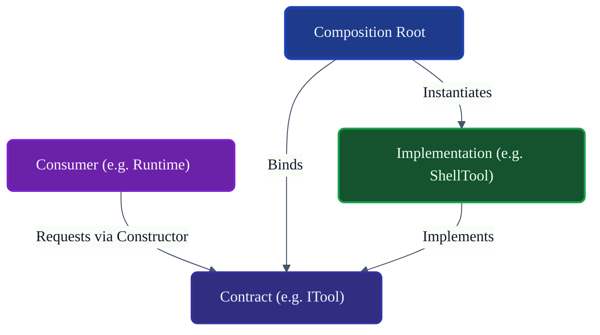
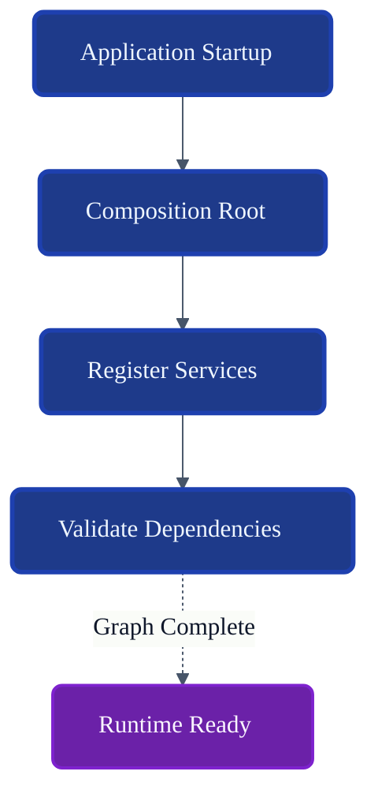
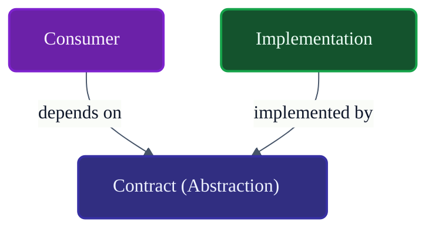
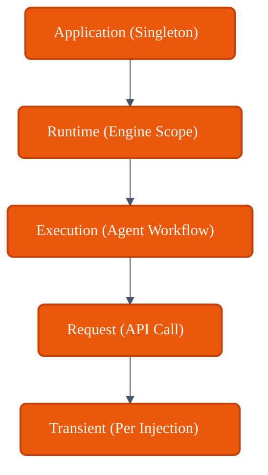
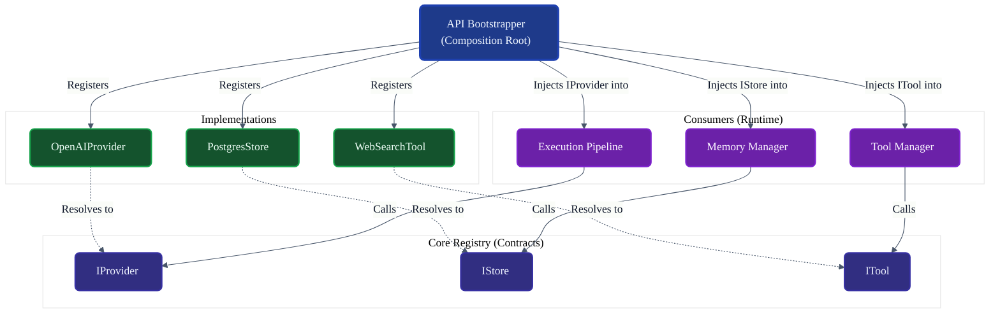

# VoxCore Dependency Injection Design

This document defines the dependency injection philosophy, composition model, service registration lifecycle, dependency resolution rules, ownership boundaries, lifecycle scopes, extension mechanisms, and implementation constraints for VoxCore.

It answers exactly one engineering question: **"How are concrete implementations connected to abstract contracts throughout VoxCore while preserving modularity, testability, and dependency inversion?"**

This document defines architectural dependency injection, not framework-specific dependency injection. It describes how implementations are composed and resolved without referencing concrete DI frameworks or container libraries.

---

## 1. Purpose

Dependency Injection exists to separate object creation from object usage.

Without DI:
* **Packages instantiate each other**: Hardcoded `new` (or `__init__`) calls tightly bind consumers to concrete implementations.
* **Implementations become tightly coupled**: Replacing a `PostgresStorage` with a `VectorStorage` requires rewriting hundreds of lines in the Runtime.
* **Testing becomes difficult**: Unit tests cannot easily mock dependencies without complex monkey-patching.
* **Provider replacement becomes expensive**: Swapping OpenAI for a local LLaMA model breaks the system.
* **Extension becomes fragile**: Third-party plugins cannot supply capabilities cleanly.

DI ensures that the `Runtime` consumes `ITool`, completely unaware of how the tool was constructed or what its internal dependencies are.

---

## 2. Design Philosophy

The dependency injection architecture adheres to the following principles:

* **Dependency Inversion**: High-level modules do not depend on low-level modules. Both depend on abstractions.
* **Composition Root**: There is exactly one place in the application where the object graph is constructed.
* **Single Registration**: An implementation is registered to an interface once; consumers request that interface endlessly.
* **Explicit Dependencies**: A class must explicitly request all its dependencies via its constructor. Hidden dependencies are forbidden.
* **Constructor Injection**: The only architecturally approved method of injecting dependencies is through constructor signatures.
* **No Service Locator**: Packages must never query a global container (e.g., `Container.Get[ITool]()`) to find their dependencies dynamically.
* **Framework Independence**: The rules of composition remain valid whether the container is managed by a library or manually stitched together.
* **Testability**: Every class can be instantiated in isolation by passing mock objects to its constructor.
* **Provider Independence**: Consumers request capabilities, completely ignorant of who provides them.

---

## 3. Composition Model

The composition of VoxCore follows a strict sequence:

1. **Composition Root**: The application entry point (e.g., API bootstrapper) establishes the boundaries.
2. **Service Registration**: Packages provide their implementations, binding them to Contracts.
3. **Dependency Resolution**: The system maps which interface resolves to which concrete class.
4. **Object Graph Construction**: Instances are created, and dependencies are injected into constructors in a topologically sorted order.
5. **Runtime Ready**: The completed, validated object graph is handed over to the Execution Pipeline.

---

## 4. Service Categories

Services mapped into the dependency graph fall into distinct architectural categories.

| Category | Purpose | Owner | Lifetime |
| :--- | :--- | :--- | :--- |
| **Core Services** | Foundational logic. | Runtime | Application |
| **Runtime Services** | Orchestration & Execution. | Runtime | Runtime / Execution |
| **Provider Services**| External LLM wrappers. | Providers | Application / Request |
| **Storage Services** | Database connections/repos. | Storage | Application |
| **Memory Services** | Retrieval and ranking rules. | Memory | Application |
| **Configuration Services**| Validated environment values. | Configuration | Application |
| **Security Services**| Policy evaluation engines. | Security | Application |
| **Observability Services**| Telemetry exporters. | Observability | Application |
| **Infrastructure Services**| Socket/Network adapters. | Transport | Application |

---

## 5. Service Registration

* **Registration Ownership**: A package is responsible for exposing its own implementations to the Composition Root.
* **Registration Order**: The order of registration must not matter. The container resolves the dependency graph topologically.
* **Duplicate Registrations**: The container must cleanly handle (e.g., override or collection-append) multiple implementations of the same interface.
* **Optional Services**: If a consumer can function without an interface, the constructor accepts it as optional, and registration is not strictly required.
* **Replaceable Services**: Plugins can register an implementation that overrides a default core implementation.
* **Default Implementations**: Fallback concrete classes are provided if no explicit override is registered.

---

## 6. Dependency Resolution

* **Resolution**: The act of matching an interface requested by a consumer to a concrete class registered by a provider.
* **Dependency Graph**: The entire map of "A requires B, B requires C". Must remain acyclic.
* **Constructor Dependencies**: Resolution strictly inspects the constructor signature to find what to inject.
* **Nested Dependencies**: If A requires B, and B requires C, the Composition Root automatically builds C, passes it to B, then passes B to A.
* **Validation**: The system must validate the entire object graph before booting. If a dependency is unresolvable, the application crashes immediately.
* **Missing Dependency Behaviour**: Halt boot process with a clear error indicating the missing interface.
* **Cyclic Dependency Detection**: If A requires B, and B requires A, boot must fail immediately.

---

## 7. Lifetime Management

Lifetimes define how long an injected object instance survives before it is destroyed and garbage collected.

### Application Lifetime
* **Purpose**: Singletons. Shared state across the entire process.
* **Creation**: At boot.
* **Disposal**: At process exit.
* **Owner**: Composition Root.

### Runtime Lifetime
* **Purpose**: State shared across all active agents within the VoxCore engine.
* **Creation**: When the Runtime Kernel initializes.
* **Disposal**: When the Engine shuts down.
* **Owner**: Runtime Package.

### Execution Lifetime
* **Purpose**: State shared during a single, long-running agentic workflow.
* **Creation**: When the workflow starts.
* **Disposal**: When the workflow completes or fails.
* **Owner**: Runtime Kernel.

### Request Lifetime
* **Purpose**: Ephemeral state attached to a single API call (e.g., HTTP request).
* **Creation**: Ingress.
* **Disposal**: Egress.
* **Owner**: Transport/API Package.

### Transient Lifetime
* **Purpose**: A brand-new instance is created every time the service is requested.
* **Creation**: Upon injection.
* **Disposal**: When the consumer is garbage collected.
* **Owner**: The Consumer.

---

## 8. Composition Root

The Composition Root is the single location where the object graph is constructed.

* **Single Composition Root**: Only the very top layer of the application (e.g., the executable bootstrapper) acts as the Composition Root.
* **Package Independence**: The Composition Root imports all packages to stitch them together, but packages never import the Composition Root.
* **Construction Order**: Classes are instantiated from the bottom of the graph (no dependencies) to the top (depends on everything).
* **Dependency Validation**: The Composition Root proves that the system can run before any traffic is accepted.
* **Startup Responsibilities**: It registers, resolves, validates, and locks the graph.

**Only the Composition Root constructs implementations. Everywhere else consumes abstractions.**

---

## 9. Public Composition Rules

* **Consumers never instantiate implementations**: `db = new PostgresStorage()` inside the Runtime is strictly forbidden.
* **Implementations register once**: Do not scatter registration code.
* **Contracts remain implementation-independent**: Interfaces must not have `@Inject` or similar framework annotations inside them.
* **Factories are used only where lifecycle requires them**: Use an `IProviderFactory` if you need to create instances dynamically at runtime (e.g., per-user connection), rather than injecting the concrete instance.
* **Avoid service locator**: Do not inject the Container itself into business logic to resolve dependencies manually.

---

## 10. Dependency Rules

* **Consumers depend on Contracts**: High-level modules only know about interfaces.
* **Contracts depend on nothing**: They are pure structural definitions.
* **Implementations depend on Contracts**: A concrete class implements the interface it fulfills.
* **Composition Root depends on implementations**: It must know about concrete classes to register them.
* **No cyclic dependencies**: The object graph must form a Directed Acyclic Graph (DAG).

---

## 11. Extension Model

* **Adding new implementations**: A new package provides a class implementing a Contract and adds it to the Composition Root.
* **Replacing implementations**: A Plugin registers a custom `IStrategy`, replacing the default one.
* **Multiple implementations**: Registering multiple `ITool` instances results in the consumer receiving a `List[ITool]`.
* **Optional implementations**: Core code degrades gracefully if an optional interface (e.g., `IMetrics`) has no registered implementation.
* **Plugin registrations**: Plugins are provided an `IExtensionRegistry` during boot to map their concrete classes to core Contracts safely.
* **Future extensibility**: Because composition is centralized, introducing a new architectural package requires zero changes to existing consumers.

---

## 12. Package Collaboration

* **Contracts**: Defines the vocabulary for collaboration.
* **Providers, Storage, Memory, Tools, Plugins**: Supply the concrete implementations (the "Providers" of logic).
* **Runtime**: The primary consumer of all the above. It requests Contracts via its constructors.
* **Configuration, Security, Observability**: Supply foundational cross-cutting concerns required by almost every other package.
* **API / Transport**: Consumes the Runtime to handle external requests.

All interaction happens via interfaces injected into constructors.

---

## 13. Design Constraints

* **DI shall remain framework-independent.**
* **DI shall not introduce service locator.**
* **DI shall not violate package boundaries.**
* **DI shall preserve dependency inversion.**
* **DI shall remain deterministic.** (Identical configuration yields an identical object graph).

---

## 14. Package Invariants

The following invariants must hold true under all conditions:

1. **Every dependency has one owner.** (The container manages the lifecycle of shared instances).
2. **Consumers depend only on abstractions.** (No concrete imports outside the Composition Root).
3. **Registrations are deterministic.** (Last-in-wins or explicitly declared priority for overrides).
4. **Composition Root is unique.** (There are not multiple disjoint containers floating around the architecture).
5. **Dependency graph is acyclic.** (Cyclic graphs crash the boot sequence immediately).

---

## 15. Traceability

| Service Category | Contracts Package | Implementation Package | Consumer Package |
| :--- | :--- | :--- | :--- |
| **Providers** | `IProvider` | Providers Package | Runtime |
| **Storage** | `IStore` | Storage Package | Memory, Runtime |
| **Tools** | `ITool` | Tools Package | Runtime |
| **Security** | `IAuthorization` | Security Package | API, Runtime |
| **Configuration**| `IConfiguration` | Configuration Package | All Packages |
| **Observability**| `ITelemetry` | Observability Package | All Packages |

---

## 16. Conclusion

Dependency Injection provides the composition mechanism that binds implementations to abstractions while preserving modularity, provider independence, testability, and long-term maintainability. By treating DI as a fundamental architectural design pattern rather than a framework feature, VoxCore ensures that its packages remain strictly decoupled, enabling boundless extension without modifying the core engine.

---

## Required Tables

### Table 1: Documentation Relationships

| Document | Responsibility |
| :--- | :--- |
| **Package Architecture** | Defines dependency directions. |
| **Contracts Package** | Defines abstractions. |
| **Public Module Interfaces**| Defines public boundaries. |
| **Package LLD Documents** | Define implementations. |
| **DI Design (This Doc)** | Defines how implementations are composed and resolved. |

### Table 2: Service Categories

| Category | Purpose | Owner | Lifetime |
| :--- | :--- | :--- | :--- |
| **Runtime Services** | Core engine orchestration. | Runtime | Application |
| **Provider Services**| External LLM wrappers. | Providers | Request/Execution|
| **Storage Services** | DB Connections. | Storage | Application |
| **Memory Services** | Retrieval logic. | Memory | Application |

### Table 3: Lifetime Scopes

| Scope | Lifetime | Owner |
| :--- | :--- | :--- |
| **Application** | Process start to finish (Singleton). | Composition Root |
| **Execution** | Duration of an Agent task. | Runtime Kernel |
| **Request** | Single API network call. | API / Transport |
| **Transient** | Ephemeral, per-injection. | Calling Consumer |

### Table 4: Dependency Rules

| Rule | Reason |
| :--- | :--- |
| **Constructor Only** | Guarantees dependencies are present before execution. |
| **No Service Locators**| Hiding dependencies makes testing and auditing impossible. |
| **Acyclic Resolution** | Circular dependencies indicate a design flaw. |

### Table 5: Package Invariants

| Invariant | Reason |
| :--- | :--- |
| **Single Composition Root**| Prevents scattered, fragmented object graphs. |
| **Contracts Unaware** | Interfaces must not contain DI annotations. |
| **Fail-Fast Resolution** | Missing dependencies crash at boot, not at runtime. |

### Table 6: Traceability Matrix

| Principle | Origin | Enforced By |
| :--- | :--- | :--- |
| **Dependency Inversion** | SOLID Principles | Composition Root |
| **Composition Root** | Mark Seemann (DI principles) | Bootstrapper |
| **No Service Locator** | Anti-pattern Avoidance | Code Review / Arch Rules|

---

## Required Diagrams

### Diagram 1: Dependency Injection Architecture

### Diagram 2: Composition Flow

### Diagram 3: Dependency Direction

### Diagram 4: Lifetime Model

### Diagram 5: End-to-End Composition Wiring

