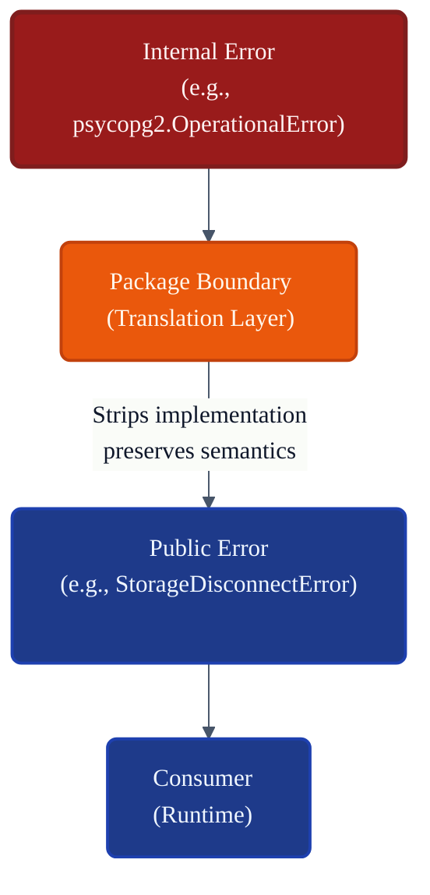
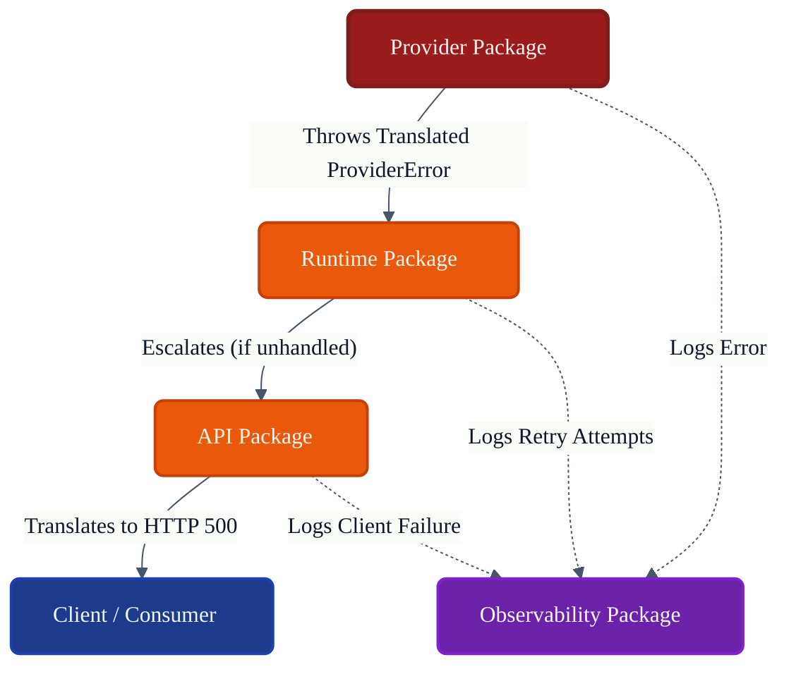
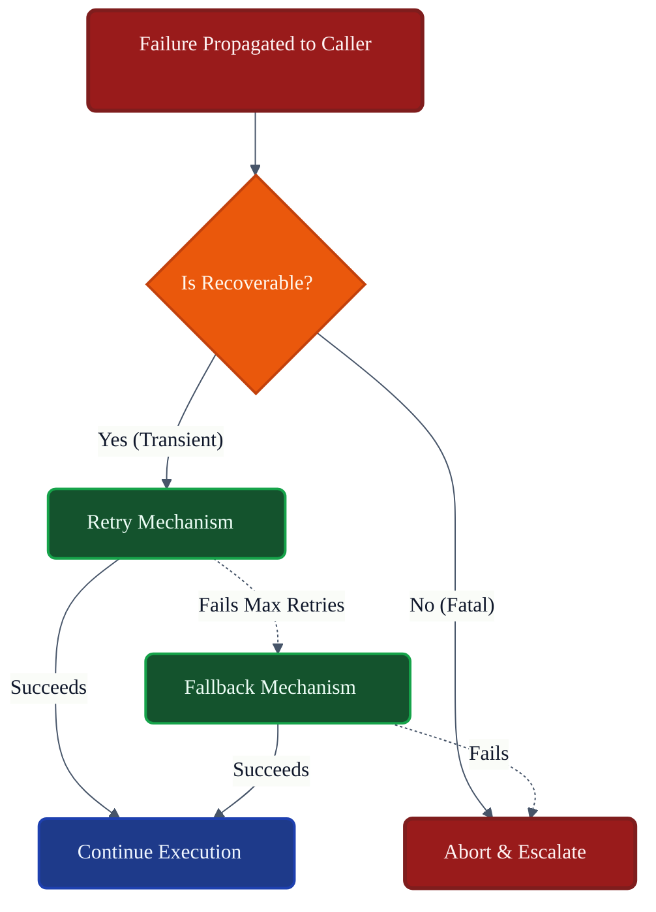
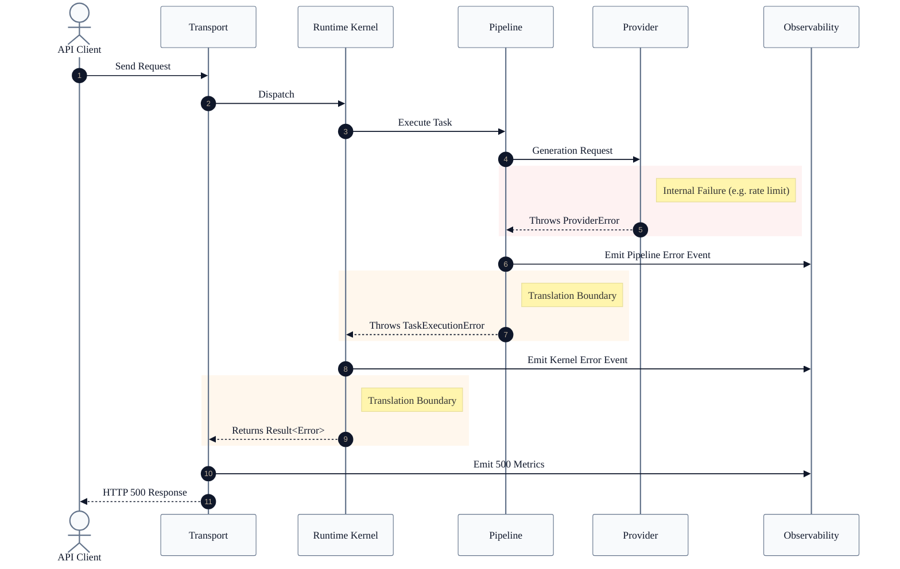

# VoxCore Error Model

This document defines the architectural model for failures across VoxCore, including error classification, propagation, ownership, translation, recovery boundaries, observability integration, retry semantics, and implementation constraints.

It answers exactly one engineering question: **"How are failures represented, propagated, translated, and handled consistently throughout VoxCore?"**

This document defines the architectural error model. It does not define programming language exception classes, nor does it define framework-specific exception handlers (like FastAPI exception handlers). It applies uniformly across all VoxCore packages.

---

## 1. Purpose

A unified error model exists to provide a common architectural language for failures.

Without a unified Error Model:
* **Packages invent incompatible errors**: `ProviderTimeout` and `StorageDisconnect` look entirely different, forcing consumers to write complex `if/else` ladders.
* **Retries become inconsistent**: One subsystem retries endlessly on auth failures, while another gives up immediately on safe network drops.
* **Diagnostics become fragmented**: Logs lack trace IDs, making it impossible to correlate a UI error to a specific database failure.
* **Recovery becomes unpredictable**: The Runtime does not know whether a Tool failure should crash the agent loop or gracefully degrade.
* **Interfaces become unstable**: Exposing `psycopg2.OperationalError` tightly couples the core engine to a specific database driver.

The Error Model ensures that failures cross package boundaries securely, predictively, and transparently.

---

## 2. Design Philosophy

The architecture of failures within VoxCore adheres to the following principles:

* **Explicit Failures**: Errors are a primary return path of an interface, not an afterthought. They must be handled or explicitly escalated.
* **Stable Error Contracts**: Packages define the errors they can emit as part of their public contract.
* **Error Translation at Boundaries**: A low-level failure (e.g., `TimeoutException`) must be translated before crossing a package boundary (e.g., `ProviderCommunicationError`).
* **Recoverable vs Non-Recoverable Errors**: Errors must self-report whether retrying the operation makes architectural sense.
* **Fail Fast**: If a catastrophic or non-recoverable error occurs, the system must abort the operation immediately rather than cascading into deeper failures.
* **No Information Leakage**: Error boundaries must strip away security-sensitive information (e.g., connection strings) before propagating to external consumers.
* **Observability Integration**: Every failure must be observable.
* **Deterministic Propagation**: The path an error takes from origin to consumer must be traceable and predictable.

---

## 3. Error Categories

Errors are classified by the architectural domain that owns and originates them.

| Category | Origin | Recoverable |
| :--- | :--- | :--- |
| **Runtime Errors** | Runtime Kernel (e.g., State Machine violations). | No |
| **Configuration Errors**| Configuration Package (e.g., Missing API keys). | No (Halts Boot) |
| **Provider Errors** | Providers Package (e.g., LLM context limits). | Partially |
| **Storage Errors** | Storage Package (e.g., Connection dropped). | Partially |
| **Memory Errors** | Memory Package (e.g., Vector index corruption). | No |
| **Tool Errors** | Tools Package (e.g., External API failed). | Yes |
| **Plugin Errors** | Plugins Package (e.g., Dependency unresolved). | No |
| **Transport Errors** | Transport Package (e.g., TCP socket timeout). | Yes |
| **Security Errors** | Security Package (e.g., Unauthorized access). | No |
| **Validation Errors** | Any boundary (e.g., Malformed input schemas). | No |
| **Internal System Errors**| Unknown/Unhandled native exceptions. | No |

---

## 4. Error Lifecycle

Failures follow a rigorous lifecycle from occurrence to recovery.

1. **Failure Occurs**: A low-level operation faults (e.g., a socket closes).
2. **Classified**: The module identifies the failure type (e.g., Transient vs Fatal).
3. **Captured**: Diagnostic context (stack traces, variables) is attached locally.
4. **Translated**: The failure is converted from a vendor-specific error to a VoxCore domain error.
5. **Propagated**: The error is returned/thrown across the public package boundary to the caller.
6. **Observed**: Observability records the translated error for metrics and logging.
7. **Handled**: The caller decides whether to Retry, Fallback, or Abort.

---

## 5. Error Ownership

* **Every failure has exactly one originating package.** If an HTTP request fails inside a Provider, the Providers package owns the resulting `ProviderCommunicationError`.
* **Intermediate packages may translate but never falsify ownership.** If the Runtime receives a `StorageError`, it must not wrap it into a generic `RuntimeError` that hides the storage origin.
* **Error ownership remains traceable.** Diagnostic identifiers ensure that a developer can trace a UI error directly back to the package that originated the failure.

---

## 6. Error Propagation

* **Local Propagation**: Inside a package, errors may retain implementation details (e.g., SQLAlchemy exceptions) for deep debugging.
* **Cross-Package Propagation**: Once an error leaves a package, it must conform to a stable contract.
* **Package Boundary Translation**: The boundary is a strict firewall. Implementation-specific errors are stopped and repackaged.
* **Consumer Visibility**: The consumer sees a semantic error ("The Agent failed to execute the tool") rather than an infrastructure error ("Subprocess piped broken pipe").
* **Context Preservation**: While implementation details are stripped, semantic context (TraceID, ComponentName) is meticulously preserved during propagation.

---

## 7. Boundary Translation

Translation is the most critical aspect of the VoxCore Error Model.

When a lower-level library fails, the failure must be caught at the package boundary. 

```text
Internal Failure (e.g., aiohttp.ClientConnectorError)
        ↓
Package Translation (Providers Package intercepts it)
        ↓
Public Error Contract (Converted to IProviderNetworkError)
        ↓
Consumer (Runtime receives IProviderNetworkError)
```

The Runtime Package is completely shielded from knowing that `aiohttp` is used under the hood. It only knows that a network error occurred while talking to a provider. This ensures that swapping network libraries does not require rewriting Runtime error handling logic.

---

## 8. Recovery Model

When an error is propagated to a caller, the caller must choose a recovery strategy based on the error's properties.

* **Retry**: Automatically re-attempt the operation if the error is classified as transient (e.g., network timeout).
* **Fallback**: Switch to a secondary mechanism (e.g., if OpenAI fails, fallback to Anthropic).
* **Degradation**: Continue execution but with reduced capabilities (e.g., if Memory retrieval fails, generate a response without historical context).
* **Abort**: Halt the current execution workflow entirely and bubble the error to the highest caller.
* **Ignore**: Proceed as if the error did not happen (applicable only to non-critical background telemetry).
* **Escalation**: When a package does not know how to handle an error, it translates it (if crossing a boundary) and passes it up the chain.

*(Note: The Error Model defines when these strategies are valid. It does not dictate the specific algorithms like Exponential Backoff).*

---

## 9. Retry Semantics

Failures self-report their retry suitability to prevent infinite loops and cascading failures.

| Retry Class | Purpose |
| :--- | :--- |
| **Never Retry** | Fatal errors, validation errors, or security violations. Retrying will always fail. |
| **Safe Retry** | Idempotent operations that failed due to transient infrastructure issues (e.g., reading from DB). |
| **Conditional Retry** | Non-idempotent operations where retry safety depends on external state (e.g., charging a credit card). |
| **Policy Controlled** | Retries dictated by an explicit strategy (e.g., 429 Rate Limit specifies a `Retry-After` window). |

---

## 10. Error Context

To be actionable, an error must carry structured context without leaking secrets.

* **Error Identifiers**: A unique code mapping to documentation (e.g., `VX-PRV-4001`).
* **Origin Package**: Explicit declaration of the package that generated the error.
* **Operation**: The specific action that failed (e.g., `RetrieveMemory`).
* **Correlation Identifiers**: Trace IDs linking the error to the user's initial request.
* **Diagnostic Metadata**: Safe key-value pairs (e.g., `{"provider": "openai", "model": "gpt-4"}`).
* **User-Safe Information**: A sanitized message suitable for display on a UI.
* **Developer Diagnostics**: Deep stack traces or internal state dumps. *These are extracted and sent to Observability, but never propagated to external clients (API).*

---

## 11. Collaboration
* **Initiator**: N/A
* **Owner**: N/A
* **Depends On**: N/A
* **Publishes**: N/A
* **Receives**: N/A
---

## 12. Dependency Rules

* **Errors propagate through public interfaces only.** An internal helper class exception must not bypass the package's public interface boundary.
* **Internal errors never leak implementation details.** Consumers depend on `IStorageError`, not SQL driver errors.
* **Packages translate errors only at boundaries.** Do not translate errors deep within the internal logic; translate them at the exit point.
* **Observability records failures but never changes them.** The telemetry system is a read-only consumer of error objects.

---

## 13. Package Invariants

The following invariants must hold true under all conditions:

1. **Every failure has one owner.**
2. **Translation preserves meaning.** (A rate limit must not be translated into a generic internal server error).
3. **Error contracts remain stable.** (Adding a new error type is a non-breaking change; altering an existing error's semantics is a breaking change).
4. **Implementation details never leak.** (No API keys or DB connection strings in error messages).
5. **Diagnostics remain available.** (Trace IDs are never dropped during boundary translation).

---

## 14. Design Constraints

* **Error model shall remain framework-independent.** (Do not define it around FastAPI `HTTPException`).
* **Error model shall remain language-independent.** (Do not rely exclusively on Python's exception hierarchy).
* **Error model shall remain implementation-independent.**
* **Error contracts shall remain stable.**
* **No package invents incompatible error semantics.** (All packages use the standard `Retry Class` definitions).

---

## 15. Traceability

| Error Category | Origin Package | Translated By | Observed By |
| :--- | :--- | :--- | :--- |
| **Provider Limits** | Providers Package | Providers Boundary | Observability |
| **Sandbox Crash** | Tools Package | Tools Boundary | Runtime, Observability |
| **Auth Revoked** | Security Package | Security Boundary | API, Observability |
| **DB Timeout** | Storage Package | Storage Boundary | Memory, Observability |

---

## 16. Conclusion

The Error Model provides a unified architectural approach to representing, propagating, translating, and observing failures across VoxCore. By enforcing strict boundary translations, stripping implementation details, and providing consistent retry semantics, the system remains decoupled, robust, and highly maintainable, ensuring that localized failures do not cascade into catastrophic system crashes.

---

## Required Tables

### Table 1: Documentation Relationships

| Document | Responsibility |
| :--- | :--- |
| **Runtime Package** | Produces execution failures. |
| **Providers Package** | Produces provider failures. |
| **Storage Package** | Produces persistence failures. |
| **Memory Package** | Produces retrieval failures. |
| **Security Package** | Produces authorization failures. |
| **Transport Package** | Produces communication failures. |
| **Public Module Interfaces**| Defines interface boundaries. |
| **Error Model (This Doc)** | Defines the architecture of failures. |

### Table 2: Error Categories

| Category | Origin | Recoverable |
| :--- | :--- | :--- |
| **Validation Error** | API / Contracts | No (Bad Input) |
| **Security Error** | Security Package | No |
| **Network Error** | Transport / Providers | Yes (Transient) |
| **Capacity Error** | Providers / Storage | Yes (Policy/Backoff) |
| **State Error** | Runtime Package | No (Logic Bug) |

### Table 3: Retry Categories

| Retry Class | Purpose |
| :--- | :--- |
| **Never Retry** | Terminal failure; escalate to user immediately. |
| **Safe Retry** | Idempotent network drop; automatic immediate retry. |
| **Conditional Retry** | Requires state validation before retrying. |
| **Policy Controlled** | Adheres to strict backoff windows (e.g., HTTP 429). |

### Table 4: Dependency Rules

| Rule | Reason |
| :--- | :--- |
| **Translate at Edges** | Prevents internal refactoring from breaking callers. |
| **Opaque Details** | Preserves provider independence. |
| **Correlate Always** | Allows operators to trace the blast radius of a failure. |

### Table 5: Package Invariants

| Invariant | Reason |
| :--- | :--- |
| **Fail-Fast** | Do not attempt to process data known to be corrupt. |
| **No Silent Drops** | If an error is ignored, it must still be logged. |
| **Sanitized Exports**| External API responses must strip stack traces. |

### Table 6: Traceability Matrix

| Principle | Origin | Enforced By |
| :--- | :--- | :--- |
| **Boundary Translation**| Hexagonal Architecture | Interface Adapters |
| **Idempotency Awareness**| Distributed Systems | Error Categories |
| **Trace Correlation** | Observability Req. | `correlation/` engine |

---

## Required Diagrams

### Diagram 1: Error Lifecycle

```mermaid
%%{init: {"theme": "base", "themeVariables": {"primaryColor": "#F8FAFC", "primaryTextColor": "#0F172A", "primaryBorderColor": "#64748B", "lineColor": "#475569", "fontFamily": "Inter, sans-serif"}}}%%
flowchart TD
    fail["Failure Occurs"]:::origin
    class["Classification"]:::origin
    cap["Context Captured"]:::origin
    trans["Boundary Translation"]:::translation
    prop["Propagation"]:::translation
    obs["Observation (Telemetry)"]:::observability
    rec["Recovery Decision"]:::recovery

    fail --> class
    class --> cap
    cap --> trans
    trans --> prop
    prop -. "Emits Context" .-> obs
    prop --> rec

    classDef origin fill:#991B1B,stroke:#7F1D1D,color:#FEF2F2,stroke-width:3px,rx:6px,ry:6px;
    classDef translation fill:#EA580C,stroke:#C2410C,color:#FFF7ED,stroke-width:2px,rx:6px,ry:6px;
    classDef observability fill:#6B21A8,stroke:#7E22CE,color:#FAF5FF,stroke-width:2px,rx:6px,ry:6px;
    classDef recovery fill:#14532D,stroke:#16A34A,color:#ECFDF5,stroke-width:2px,rx:6px,ry:6px;
```

### Diagram 2: Boundary Translation



### Diagram 3: Cross-Package Error Flow



### Diagram 4: Recovery Decision Model



### Diagram 5: End-to-End Error Flow


