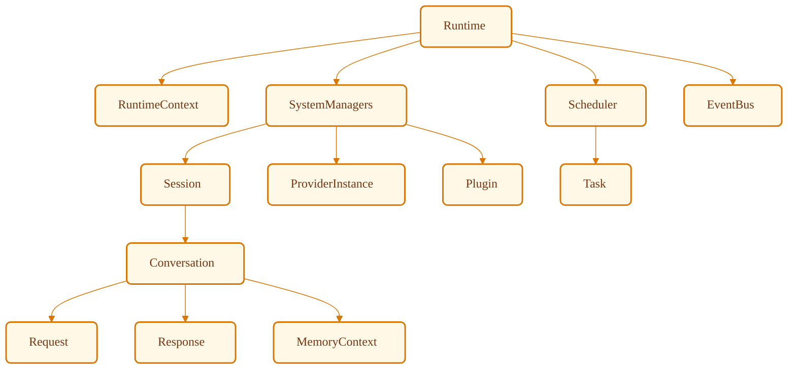
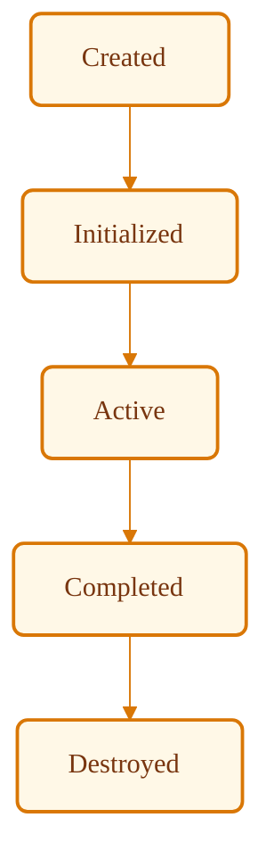
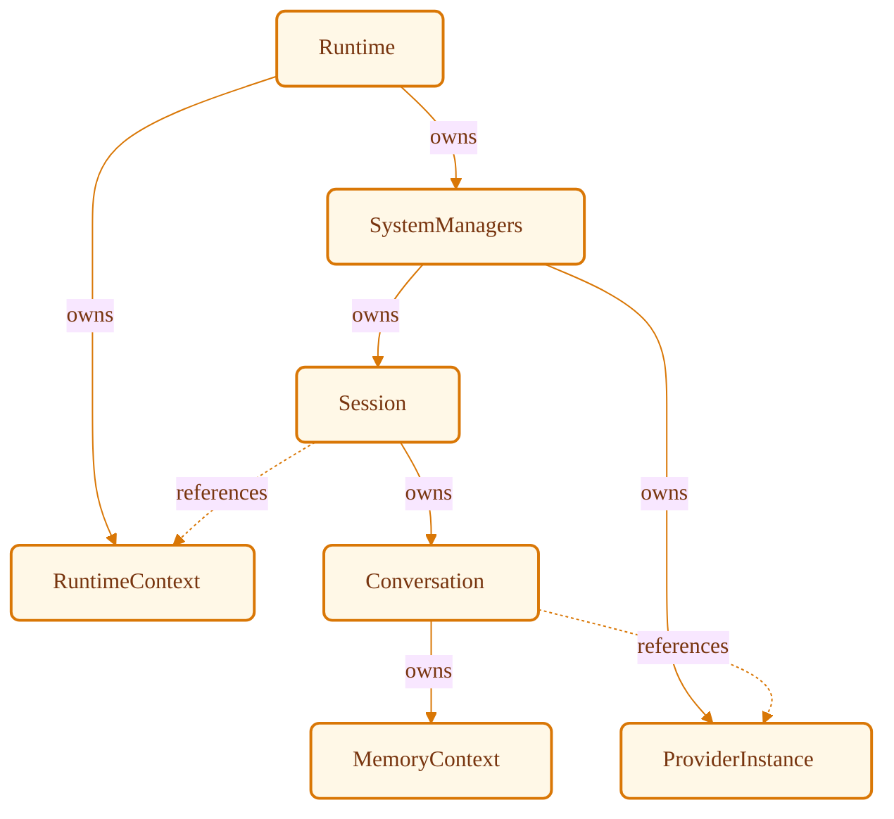

# VoxCore Runtime Data Models

This document defines the core runtime entities that exist when the VoxCore execution engine is active. It maps their internal data fields, establishes ownership, and defines their lifetime and mutability constraints.

This document answers exactly one question: *What runtime entities exist, what information do they own, and how do they relate to one another?*

This document does not define implementation classes, database schemas, ORM models, serialization formats, or API Data Transfer Objects (DTOs). It establishes the logical domain vocabulary used by all runtime subsystems.

---

## 1. Purpose

A single, authoritative definition of runtime models prevents structural and behavioral divergence across subsystems. Without a common runtime data model specification:
* **Terminology Drift**: Subsystems invent duplicate terms for the same conceptual execution entities (e.g., mixing "Session", "Context", and "Connection"), leading to API integration errors.
* **Ambiguous Ownership**: Lacking clear ownership boundaries, multiple modules attempt to modify or destroy identical resources, causing race conditions, orphan memory, and state corruption.
* **State Duplication**: Data values are copied and cached redundantly across modules instead of maintaining a single source of truth, causing synchronicity drift.
* **Interface Churn**: Module interfaces change constantly because there is no unified domain model to act as a stable contract between boundaries.

Every runtime component in the VoxCore repository shall conform to this modeling vocabulary.

---

## 2. Runtime Modeling Philosophy

All runtime entities must be designed and implemented in alignment with the following principles:

### Single Ownership
Every entity must have exactly one designated parent component that is authorized to initialize, modify, and destroy it. Components shall not have multi-parent ownership.

### Clear Identity
Every long-lived runtime entity must possess a unique, immutable identifier generated at creation. This identity must remain stable across all state transitions.

### Explicit Lifetime
An entity's creation, activation, completion, and destruction stages must follow deterministic paths managed by its owner. Implicit resource lifecycles are prohibited.

### Minimal Mutability
Entities shall be immutable by default. When mutability is required, state changes must be restricted to controlled transitions managed exclusively by the owner.

### Framework Independence
Runtime models must be declared using standard data-holding patterns, remaining entirely decoupled from web frameworks, event coordinators, or dependency injection utilities.

### Persistence Independence
Runtime models exist purely in transient memory during execution. They must remain decoupled from database schemas, SQL dialects, or storage drivers.

### Serialization Independence
Entities must not contain format-specific annotations (e.g., JSON decorators, Proto definitions). Data translation to exchange formats must occur at package boundaries.

---

## 3. Runtime Entity Overview

This section defines the structural contracts and responsibilities of the core runtime entities.

### Runtime
* **Represents**: The root executing process instance of the VoxCore application.
* **Contains**: Unique runtime identity, a reference to the active configuration, registered system managers, current system execution status, boot timestamp, and shutdown state flags.
* **Relationships**: Acts as the top-level root. Owns `RuntimeContext`, `Scheduler`, and `Event Bus`.
* **Lifetime**: Created at process start, destroyed when the application terminates.
* **Owner**: The main application execution entry point.
* **Visibility**: Public to system orchestration modules.

### RuntimeContext
* **Represents**: The global shared configuration, capability catalog, and registry provider interface for the running instance.
* **Contains**: Read-only system configurations, service locator references, runtime execution metadata, and system cancellation tokens.
* **Relationships**: Owned by the `Runtime`. References `SystemManager` instances (e.g., Session Manager, Provider Manager).
* **Lifetime**: Tied directly to the parent `Runtime` lifespan.
* **Mutability**: Immutable after initialization.
* **Owner**: `Runtime`
* **Visibility**: Publicly readable across all packages.

### SystemManager
* **Represents**: A stateful controller for a specific subsystem (e.g., SessionManager, ProviderManager, PluginManager).
* **Contains**: Manager identifier, subsystem configuration, internal state (e.g., index of active Sessions, connection pools), and lifecycle flags.
* **Relationships**: Registered within the `RuntimeContext`. Owns dynamic instances like `Session`, `ProviderInstance`, or `Plugin`.
* **Lifetime**: Initialized during runtime boot, destroyed during runtime teardown.
* **Mutability**: Controlled mutable (manages internal state maps safely).
* **Owner**: `Runtime`
* **Visibility**: Publicly readable across all packages via the Service Locator.

### Scheduler
* **Represents**: The execution engine's queue and task coordinator.
* **Contains**: Scheduler identifier, thread pool configuration, prioritized task queues, and execution concurrency state.
* **Relationships**: Owned by the `Runtime`. Owns and orchestrates `Task` entities.
* **Lifetime**: Created at runtime startup, drained and destroyed at shutdown.
* **Mutability**: Controlled mutable (queue state).
* **Owner**: `Runtime`
* **Visibility**: Internal to the execution orchestration modules.

### EventBus
* **Represents**: The central message broker routing transient events between decoupled modules.
* **Contains**: EventBus identifier, topic routing maps, and subscriber registry.
* **Relationships**: Owned by the `Runtime`. Transmits (but does not own) `Event` entities.
* **Lifetime**: Process lifetime.
* **Mutability**: Controlled mutable (subscriber tracking).
* **Owner**: `Runtime`
* **Visibility**: Public to all modules for publishing and subscribing.

### Session
* **Represents**: A single, isolated user interaction thread or execution session.
* **Contains**: Unique session identifier, parent `RuntimeContext` reference, active `Conversation` reference, local configurations, session execution state, timing metrics, and session-scoped metadata.
* **Relationships**: Owned by the `Runtime`. Owns exactly one `Conversation`.
* **Lifetime**: Created when a client connects or initiates an interaction, destroyed when the connection closes or times out.
* **Mutability**: Controlled mutable (session state changes).
* **Owner**: `Runtime` (via session manager).
* **Visibility**: Private to session orchestration components.

### Conversation
* **Represents**: The logical dialog thread, memory layers, and historical context of a `Session`.
* **Contains**: Conversation identifier, history references, active context memory pointers, and metadata records.
* **Relationships**: Owned by a `Session`. Owns `MemoryContext` and collections of `Request` and `Response` records.
* **Lifetime**: Initialized during session startup, destroyed upon session closure.
* **Mutability**: Controlled mutable (appending dialog history).
* **Owner**: `Session`
* **Visibility**: Internal to the session and memory packages.

### Request
* **Represents**: A logical execution intent submitted by a client (e.g., "Process NLP", "Start Listening"). Note: Continuous streaming data (like individual audio frames) are NOT modeled as Requests to avoid overhead; they are published directly as transient `Event` entities.
* **Contains**: Request identifier, timestamp, input format identifier, raw input payload reference, execution priority, and cancellation state.
* **Relationships**: Owned by `Conversation`. Triggers `Tasks`.
* **Lifetime**: Created upon client submission, destroyed when the final response is delivered or cancelled.
* **Mutability**: Immutable once instantiated, except for cancellation state changes.
* **Owner**: `Conversation`
* **Visibility**: Public to the execution pipelines.

### Response
* **Represents**: The output data or generated event stream produced by the execution engine.
* **Contains**: Response identifier, correlation request ID, execution status, output content references, metadata flags, and streaming state metrics.
* **Relationships**: Owned by `Conversation`. Generated by `Tasks`.
* **Lifetime**: Created during request execution, preserved in history, and destroyed when the host session is cleared.
* **Mutability**: Controlled mutable (during active chunk streaming).
* **Owner**: `Conversation`
* **Visibility**: Public to client-facing boundaries.

### ProviderCapability
* **Represents**: The functional specification and parameter schema of a capability exposed by an engine (e.g., text translation or audio synthesis constraints).
* **Contains**: Capability name, capability type, provider identification reference, version string, and parameter/schema constraint lists.
* **Relationships**: Owned by `ProviderInstance`. Referenced by the `Scheduler` for task allocation.
* **Lifetime**: Immutable. Created when the provider is registered.
* **Mutability**: Immutable.
* **Owner**: `ProviderInstance`
* **Visibility**: Publicly readable.

### ProviderInstance
* **Represents**: A loaded concrete provider driver integrated into the runtime.
* **Contains**: Provider identifier, capability references, active configuration, runtime health status, and connection state metrics.
* **Relationships**: Registered within the `RuntimeContext`. Manages `ProviderCapability` instances.
* **Lifetime**: Created at runtime initialization, destroyed during runtime teardown.
* **Mutability**: Controlled mutable (health and connection tracking).
* **Owner**: `Runtime` (via provider manager).
* **Visibility**: Internal to the providers package.

### ToolExecution
* **Represents**: A single invocation action of an external execution unit or custom tool.
* **Contains**: Tool identifier, input arguments, execution status, execution start/end timings, output result references, and execution error reports.
* **Relationships**: Created by `Tasks` during tool call execution.
* **Lifetime**: Instantiated at tool call execution, cleared when the parent task finishes or is logged.
* **Mutability**: Controlled mutable (during tool execution transitions).
* **Owner**: Parent `Task` (which is owned by the `Scheduler`).
* **Visibility**: Internal to the tools package.

### Plugin
* **Represents**: A dynamically loaded third-party expansion module.
* **Contains**: Plugin metadata, capability descriptors, registration state records, and lifecycle hook points.
* **Relationships**: Registered in `RuntimeContext`. Hooks into the `Event Bus`.
* **Lifetime**: Initialized during startup loading, unloaded during shutdown.
* **Mutability**: Controlled mutable (lifecycle states).
* **Owner**: `Runtime` (via plugin manager).
* **Visibility**: Public to extension controllers.

### MemoryContext
* **Represents**: The transient and long-term conversation history index.
* **Contains**: Active dialog window data, long-term memory references, and retrieval query metadata.
* **Relationships**: Owned by `Conversation`. Updated by the memory package.
* **Lifetime**: Co-exists with its parent `Conversation`.
* **Mutability**: Controlled mutable.
* **Owner**: `Conversation`
* **Visibility**: Internal to the memory package.

### Event
* **Represents**: A transient state transition, streaming data frame (e.g., real-time audio chunk), or notification record broadcast through the system.
* **Contains**: Event identifier, timestamp, event type identifier, correlation ID, source component, destination pattern, and immutable payload references.
* **Relationships**: Created by any component. Processed by the `EventBus`.
* **Lifetime**: Instantaneous. Reclaimed by memory management after handler invocation.
* **Mutability**: Strictly immutable.
* **Owner**: None (unowned value object, garbage collected after distribution).
* **Visibility**: Publicly readable.

### Task
* **Represents**: A unit of work queued for processing in the execution engine.
* **Contains**: Task identifier, correlation request ID, target conversation ID reference, priority index, execution status, dependency task IDs, owner task reference, and scheduler metadata.
* **Relationships**: Owned and scheduled by the `Scheduler`. Executes `ToolExecution` operations. Emits `Event` and `Response` entities bound to its correlation ID.
* **Lifetime**: Instantiated by the execution pipeline, destroyed when completed and checked by the scheduler.
* **Mutability**: Controlled mutable (status updates).
* **Owner**: `Scheduler`
* **Visibility**: Internal to execution and scheduling modules.

---

## 4. Entity Relationships

The lifecycle and communication paths between runtime entities are governed by strict relationship rules:
* **Instantiation Paths**: The `Runtime` acts as the root factory. It instantiates the `RuntimeContext` and active managers. Managers spawn `Sessions` and `ProviderInstances` dynamically. `Sessions` construct their child `Conversations` upon user verification.
* **Ownership Invariants**: If an owner entity is destroyed, all entities it owns must be recursively destroyed. For example, terminating a `Session` must immediately trigger the teardown of its `Conversation`, `MemoryContext`, and associated active `Requests`.
* **Reference Rules**: Entities that do not share an ownership relationship must interact using stable, read-only identifiers. For example, a `Task` must not hold a direct pointer to a `Session` object; it shall reference the session using its immutable `Session Identifier`.
* **Modification Authority**: An entity's internal state shall only be updated by its author, or by the manager that owns it. A downstream package must never modify an entity owned by an upstream package.

---

## 5. Ownership Matrix

The following table summarizes the creator, mutable status, and destruction mappings for each runtime entity:

| Runtime Entity | Owner | Mutable | Lifetime | Shared | Destroyed By |
| --- | --- | --- | --- | --- | --- |
| **Runtime** | Process Main | Controlled | Process | No | Main Thread |
| **RuntimeContext** | Runtime | No | Process | Yes (Read-Only) | Runtime |
| **SystemManager** | Runtime | Controlled | Process | Yes (Read-Only) | Runtime |
| **Scheduler** | Runtime | Controlled | Process | Yes (Read-Only) | Runtime |
| **EventBus** | Runtime | Controlled | Process | Yes (Read-Only) | Runtime |
| **Session** | Runtime | Controlled | Active Connection | No | SystemManager |
| **Conversation** | Session | Controlled | Active Session | No | Session |
| **Request** | Conversation | No | Execution | Yes (Read-Only) | Conversation |
| **Response** | Conversation | Controlled | Session | Yes (Read-Only) | Conversation |
| **ProviderCapability**| ProviderInstance| No | Provider Registration| Yes (Read-Only) | ProviderInstance |
| **ProviderInstance** | Runtime | Controlled | Process | Yes (Read-Only) | SystemManager |
| **ToolExecution** | Task | Controlled | Task Execution | No | Task |
| **Plugin** | Runtime | Controlled | Process | Yes (Read-Only) | SystemManager |
| **MemoryContext** | Conversation | Controlled | Active Session | No | Conversation |
| **Event** | None | No | Instantaneous | Yes (Read-Only) | Garbage Collector |
| **Task** | Scheduler | Controlled | Execution | No | Scheduler |

---

## 6. Identity Rules

To ensure references do not resolve to incorrect components, all entities must adhere to the following identity patterns:
* **Generation**: All entities must receive a universally unique identifier (UUIDv4) at instantiation. Random numbers, incremental integers, or developer-defined strings are prohibited.
* **Uniqueness**: Identifiers must be unique across all namespaces and process iterations.
* **Stability**: Once an identifier is generated, it must be immutable. Changing an entity's ID during execution is prohibited.
* **Equality Verification**: Two entity instances are considered equal if and only if their unique identifiers match. Comparison of non-identity variables to prove equality is prohibited.

---

## 7. Lifetime Rules

The operational life cycle of any entity consists of five phases:

```
Created ──> Initialized ──> Active ──> Completed ──> Destroyed
```

1. **Created**: Memory is allocated and a unique identity is generated.
2. **Initialized**: Configuration and parent relationships are bound.
3. **Active**: The entity is visible to the system and actively involved in execution loops.
4. **Completed**: The entity finishes its processing (e.g., a Task completes, a Request is fulfilled).
5. **Destroyed**: References are cleared and memory is reclaimed by the system.

During runtime shutdown, all active entities must transition from `Active` to `Completed` or `Destroyed` before the process terminates.

---

## 8. Mutability Rules

State corruption is prevented by enforcing strict mutability classifications:
* **Immutable**: `RuntimeContext`, `ProviderCapability`, `Request`, and `Event` must be immutable once created. They cannot contain setter methods or mutable arrays.
* **Controlled Mutable**: `Session`, `Conversation`, `Response`, `ProviderInstance`, `ToolExecution`, `Plugin`, `MemoryContext`, and `Task` are classified as controlled mutable. Their internal state must only transition through defined, validated lifecycle methods. Direct access to write variables is prohibited.

---

## 9. Visibility Rules

To maintain separation of concerns, the scope of visibility is restricted:
* **Public Runtime**: `RuntimeContext`, `Request`, `Response`, and `Event` are visible to all layers.
* **Internal Runtime**: `Session`, `Conversation`, `ProviderInstance`, `Plugin`, and `Task` are only visible within their respective package layers.
* **Private Ownership**: `ToolExecution` and `MemoryContext` are private to their direct parent owners.
* **Cross-Layer Modification Prohibited**: Downstream layers must not modify upstream data models.

---

## 10. Design Constraints

The following constraints are mandatory for all runtime designs:
* **No Duplicated Ownership**: An entity must never belong to more than one parent.
* **No Cyclic Ownership**: Circular ownership structures are strictly prohibited.
* **Single Authoritative Owner**: The owner component alone bears the responsibility for executing state transitions.
* **References Over Copies**: When referencing other entities, components must store the target entity's unique ID rather than copying the object.
* **UUID Resolution**: To access the actual state of a referenced entity, components must use the `RuntimeContext`'s Service Locator to fetch the appropriate `SystemManager` (e.g., `SessionManager`), and query it using the UUID.
* **Avoid Unnecessary Mutability**: Entities must remain immutable unless explicit state tracking is required.

---

## 11. Required Reference Tables

### Table 1: Documentation Relationships
| Document | Responsibility |
| --- | --- |
| **Software Requirements Specification (SRS)** | Defines required behavior. |
| **System Architecture** | Defines runtime architecture. |
| **Package Architecture** | Defines ownership boundaries. |
| **Implementation Guidelines** | Defines engineering rules. |
| **Technology Decisions** | Defines implementation technologies. |
| **Runtime Data Models (This Document)** | Defines runtime entities and their ownership. |
| **Runtime State Machines** | Defines lifecycle transitions for those entities. |
| **Runtime Kernel** | Uses these runtime entities. |

### Table 2: Runtime Entity Summary
| Entity | Purpose | Owner | Lifetime |
| --- | --- | --- | --- |
| **Runtime** | Root process coordinator. | Process Main | Process Lifetime |
| **RuntimeContext** | Read-only configuration access. | Runtime | Process Lifetime |
| **SystemManager** | Subsystem state and registry controller. | Runtime | Process Lifetime |
| **Scheduler** | Task queue and execution coordinator. | Runtime | Process Lifetime |
| **EventBus** | Message broker for transient events. | Runtime | Process Lifetime |
| **Session** | User interaction isolation. | Runtime | Active Connection |
| **Conversation** | Message history and memory wrapper. | Session | Active Session |
| **Request** | Client input execution trigger. | Conversation | Execution |
| **Response** | Output generator / stream. | Conversation | Active Session |
| **ProviderCapability**| Technical specs of provider engines. | ProviderInstance| Provider Lifecycle |
| **ProviderInstance** | Provider adapter instance. | Runtime | Process Lifetime |
| **ToolExecution** | Dynamic tool invocation log. | Task | Task Execution |
| **Plugin** | Extensibility plugin registration. | Runtime | Process Lifetime |
| **MemoryContext** | Short and long-term dialog index. | Conversation | Active Session |
| **Event** | System notification and streaming frame. | None | Instantaneous |
| **Task** | Queue execution unit. | Scheduler | Task Execution |

---

## 12. Required Diagrams

### Runtime Entity Relationships

This tree diagram shows the logical ownership structure of VoxCore's executing models.



### Runtime Entity Lifecycle

This flowchart traces the lifecycle stages of transient runtime entities.



### Ownership Flow

This diagram illustrates ownership (solid lines) versus logical reference mappings (dashed lines).



---

## 13. Conclusion

The runtime data models defined in this document establish the logical vocabulary used across every remaining subsystem of VoxCore. By enforcing strict ownership boundaries, immutable identities, explicit lifetimes, and clear visibility limits, these models ensure the execution engine behaves deterministically under all loads.
