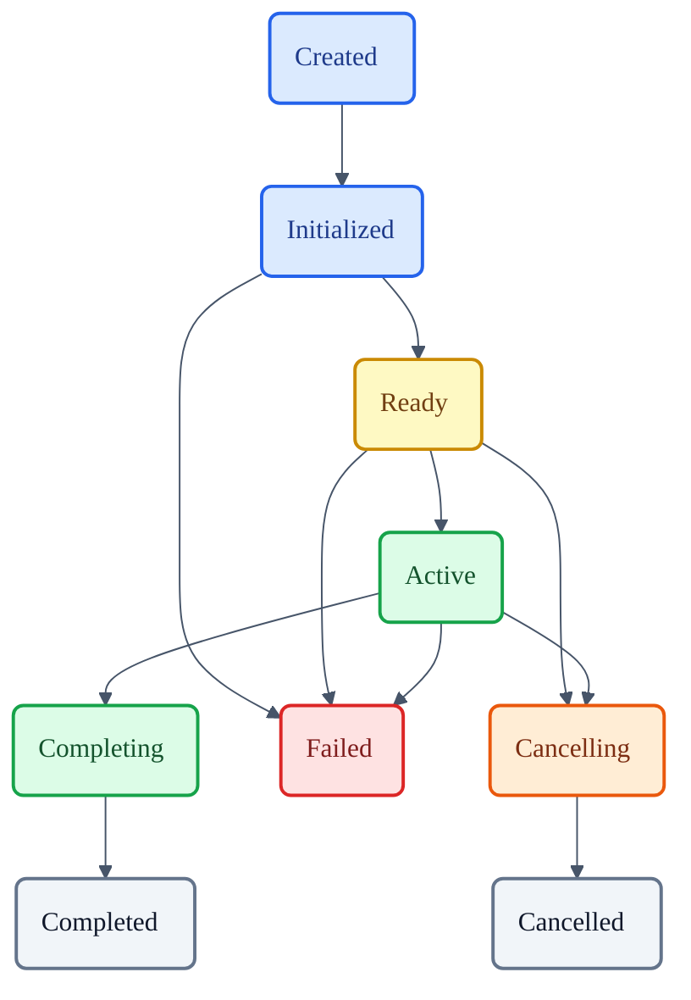
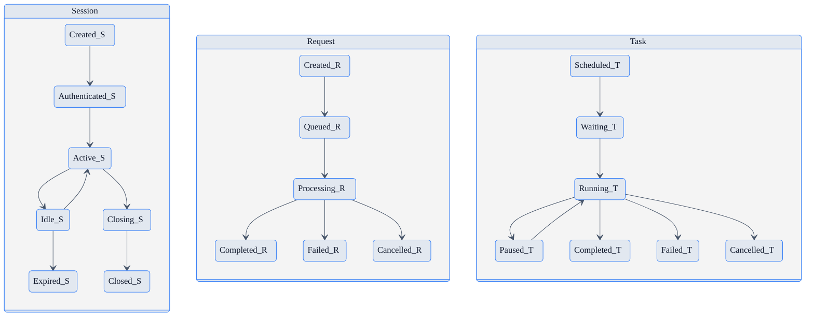
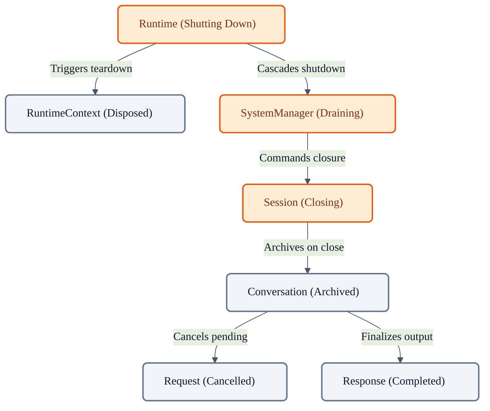

# VoxCore Runtime State Machines

This document defines the lifecycle of every stateful runtime entity defined in `27-runtime-data-models.md`. 

It answers exactly one engineering question: **"How do runtime entities transition through their lifecycle during system execution?"**

This document does NOT define algorithms, implementation code, or runtime scheduling. It only defines valid states, valid transitions, transition triggers, terminal states, and state invariants. Every runtime subsystem shall reference these state machines instead of inventing lifecycle behaviour.

---

## 1. Purpose

Explicit state machines exist to ensure the execution engine behaves deterministically. Without a unified, authoritative lifecycle specification:
* **Lifecycle ambiguity appears**: Modules disagree on whether a "stopped" entity can be restarted.
* **Illegal transitions occur**: Systems attempt to execute tasks that have already been cancelled or failed.
* **Ownership becomes inconsistent**: Managers drop references to entities that have not yet reached a terminal state.
* **Cleanup becomes unreliable**: Memory leaks occur because terminal states do not trigger resource reclamation.
* **Runtime behaviour becomes unpredictable**: Race conditions corrupt internal entity variables during concurrent transitions.

## 2. State Machine Philosophy

The lifecycle of all runtime entities must adhere to the following principles:

* **Explicit States**: An entity is always in exactly one well-defined state. Implicit or transient "in-between" states are prohibited.
* **Explicit Transitions**: State changes only occur through explicitly defined directional pathways.
* **Single Active State**: No entity may exist in multiple active states simultaneously.
* **Deterministic Behaviour**: For a given state and a given event, the resulting transition is strictly predictable.
* **No Hidden State Changes**: Mutating lifecycle status without invoking the formal transition validator is prohibited.
* **Terminal States are Final**: Once an entity reaches a terminal state (e.g., Completed, Failed, Cancelled), it must never transition back to an active or waiting state.
* **Every Transition has a Trigger**: A state machine does not advance on its own; transitions are triggered by external manager invocations or internal execution completions.
* **Every Transition has Validation Rules**: The system must validate entry and exit conditions before permitting a state change.

## 3. Common Lifecycle Pattern

Before defining individual state machines, VoxCore utilizes a common foundational lifecycle pattern. Individual entities may omit states that are not applicable to their domain.

**Generic Lifecycle Flow:**
`Created` → `Initialized` → `Ready` → `Active` → `Completing` → `Completed`

**Failure Path:**
`Active` / `Ready` → `Failed`

**Cancellation Path:**
`Ready` / `Active` → `Cancelling` → `Cancelled`

### Diagram 1: Common Runtime Lifecycle

This diagram illustrates the shared lifecycle used throughout VoxCore.

---

## 4. Individual State Machines

Each runtime entity defined in `27-runtime-data-models.md` possesses a specific lifecycle implementation based on the common pattern.

### Runtime Lifecycle

* **States**: `Created`, `Initializing`, `Ready`, `Running`, `Shutting Down`, `Stopped`, `Failed`
* **Purpose**: Coordinates the top-level process execution window.
* **Entry Conditions**: Boot command invoked by the OS.
* **Exit Conditions**: OS kill signal or graceful shutdown request.
* **Allowed Transitions**:
  * `Created` → `Initializing`
  * `Initializing` → `Ready` | `Failed`
  * `Ready` → `Running`
  * `Running` → `Shutting Down` | `Failed`
  * `Shutting Down` → `Stopped`
* **State Invariants**: When `Shutting Down`, no new requests shall be accepted.
* **Terminal?**: `Stopped` and `Failed` are terminal.

### RuntimeContext Lifecycle

* **States**: `Created`, `Populated`, `Sealed`, `Disposed`
* **Purpose**: Governs the writability of the global configuration payload.
* **Entry Conditions**: Instantiated by Runtime.
* **Exit Conditions**: Disposed during Runtime teardown.
* **Allowed Transitions**: `Created` → `Populated` → `Sealed` → `Disposed`
* **State Invariants**: Once `Sealed`, mutability is strictly prohibited.
* **Terminal?**: `Disposed` is terminal.

### SystemManager / Scheduler / EventBus Lifecycle

* **States**: `Created`, `Booting`, `Active`, `Draining`, `Terminated`
* **Purpose**: Governs subsystem capability availability.
* **Entry Conditions**: Bootstrapped by Runtime.
* **Exit Conditions**: Drained during Runtime `Shutting Down`.
* **Allowed Transitions**: `Created` → `Booting` → `Active` → `Draining` → `Terminated`
* **State Invariants**: Must be `Active` to accept owned entities (e.g., sessions, tasks).
* **Terminal?**: `Terminated` is terminal.

### Session Lifecycle

* **States**: `Created`, `Authenticated`, `Active`, `Idle`, `Closing`, `Closed`, `Expired`, `Cancelled`
* **Purpose**: Manages the connection viability of a single user interact thread.
* **Entry Conditions**: Client connection established.
* **Exit Conditions**: Client disconnects or inactivity timeout.
* **Allowed Transitions**:
  * `Created` → `Authenticated` | `Cancelled`
  * `Authenticated` → `Active`
  * `Active` ↔ `Idle`
  * `Active` | `Idle` → `Closing` | `Expired` | `Cancelled`
  * `Closing` → `Closed`
* **State Invariants**: `Idle` sessions shall maintain context but release active processing allocations.
* **Terminal?**: `Closed`, `Expired`, and `Cancelled` are terminal.

### Conversation Lifecycle

* **States**: `Created`, `Receiving Input`, `Processing`, `Generating Response`, `Completed`, `Archived`
* **Purpose**: Tracks the linear turn-taking phase of a dialog thread.
* **Entry Conditions**: Session instantiated or new dialog initiated.
* **Exit Conditions**: Dialog logically ends or session terminates.
* **Allowed Transitions**:
  * `Created` → `Receiving Input`
  * `Receiving Input` → `Processing`
  * `Processing` → `Generating Response`
  * `Generating Response` → `Receiving Input` | `Completed`
  * `Completed` → `Archived`
* **State Invariants**: `Processing` and `Generating Response` are mutually exclusive execution states.
* **Terminal?**: `Archived` is terminal.

### MemoryContext Lifecycle

* **States**: `Created`, `Loading`, `Active`, `Flushing`, `Closed`
* **Purpose**: Manages the load and flush state of conversation histories.
* **Entry Conditions**: Conversation created.
* **Exit Conditions**: Conversation completed.
* **Allowed Transitions**: `Created` → `Loading` → `Active` → `Flushing` → `Closed`
* **State Invariants**: Must be `Active` to accept historical appends.
* **Terminal?**: `Closed` is terminal.

### Request Lifecycle

* **States**: `Created`, `Queued`, `Processing`, `Completed`, `Cancelled`, `Failed`
* **Purpose**: Tracks the execution progression of a specific client intent.
* **Entry Conditions**: Intent received and parsed.
* **Exit Conditions**: Task graph completes execution.
* **Allowed Transitions**:
  * `Created` → `Queued`
  * `Queued` → `Processing` | `Cancelled`
  * `Processing` → `Completed` | `Failed` | `Cancelled`
* **State Invariants**: `Completed` requests must hold a valid reference to a corresponding `Response` generation cycle.
* **Terminal?**: `Completed`, `Cancelled`, and `Failed` are terminal.

### Response Lifecycle

* **States**: `Created`, `Generating`, `Streaming`, `Completed`, `Failed`, `Cancelled`
* **Purpose**: Tracks the output delivery progression.
* **Entry Conditions**: Target output identified by a processing Task.
* **Exit Conditions**: Output fully delivered to the client.
* **Allowed Transitions**:
  * `Created` → `Generating`
  * `Generating` → `Streaming` | `Completed` | `Failed`
  * `Streaming` → `Completed` | `Failed` | `Cancelled`
* **State Invariants**: Once `Completed`, no further chunks shall be appended.
* **Terminal?**: `Completed`, `Failed`, and `Cancelled` are terminal.

### Provider Instance Lifecycle

* **States**: `Loading`, `Ready`, `Busy`, `Unavailable`, `Failed`, `Unloading`
* **Purpose**: Manages the health and availability of an external capability driver.
* **Entry Conditions**: Instantiated by ProviderManager.
* **Exit Conditions**: System teardown or provider crash.
* **Allowed Transitions**:
  * `Loading` → `Ready` | `Failed`
  * `Ready` ↔ `Busy`
  * `Ready` | `Busy` → `Unavailable` | `Failed`
  * `Unavailable` → `Ready`
  * `Ready` | `Unavailable` | `Failed` → `Unloading`
* **State Invariants**: A `Busy` provider shall block exclusive capability locks.
* **Terminal?**: `Unloading` (leads to destruction).

### Tool Execution Lifecycle

* **States**: `Created`, `Waiting`, `Executing`, `Completed`, `Failed`, `Timed Out`, `Cancelled`
* **Purpose**: Tracks a discrete external function invocation.
* **Entry Conditions**: Task invokes a tool.
* **Exit Conditions**: Tool returns, errors, or times out.
* **Allowed Transitions**:
  * `Created` → `Waiting`
  * `Waiting` → `Executing` | `Cancelled`
  * `Executing` → `Completed` | `Failed` | `Timed Out` | `Cancelled`
* **State Invariants**: A `Completed` execution must possess an immutable result payload.
* **Terminal?**: `Completed`, `Failed`, `Timed Out`, and `Cancelled` are terminal.

### Plugin Lifecycle

* **States**: `Discovered`, `Loaded`, `Initialized`, `Enabled`, `Disabled`, `Unloaded`
* **Purpose**: Manages the active status of dynamic extensions.
* **Entry Conditions**: Detected by PluginManager.
* **Exit Conditions**: Disabled or system shutdown.
* **Allowed Transitions**:
  * `Discovered` → `Loaded`
  * `Loaded` → `Initialized`
  * `Initialized` ↔ `Enabled`
  * `Enabled` → `Disabled`
  * `Disabled` → `Unloaded`
* **State Invariants**: Only `Enabled` plugins shall intercept EventBus messages.
* **Terminal?**: `Unloaded` is terminal.

### Task Lifecycle

* **States**: `Scheduled`, `Waiting`, `Running`, `Paused`, `Completed`, `Cancelled`, `Failed`
* **Purpose**: Tracks discrete execution units within the Scheduler queue.
* **Entry Conditions**: Work unit emitted to Scheduler.
* **Exit Conditions**: Work completes or errors.
* **Allowed Transitions**:
  * `Scheduled` → `Waiting`
  * `Waiting` → `Running` | `Cancelled`
  * `Running` ↔ `Paused`
  * `Running` → `Completed` | `Failed` | `Cancelled`
* **State Invariants**: A `Waiting` task shall not consume execution threads.
* **Terminal?**: `Completed`, `Cancelled`, and `Failed` are terminal.

### Event Lifecycle

* **States**: `Created`, `Published`, `Delivered`, `Consumed`, `Expired`
* **Purpose**: Tracks transient message states across the bus.
* **Entry Conditions**: Instantiated by any component.
* **Exit Conditions**: Processed by subscribers or dropped.
* **Allowed Transitions**:
  * `Created` → `Published`
  * `Published` → `Delivered` | `Expired`
  * `Delivered` → `Consumed`
* **State Invariants**: Events are unowned value objects; their state reflects routing progression, not internal mutation.
* **Terminal?**: `Consumed` and `Expired` are terminal.

---

## 5. State Transition Rules

The following universal rules dictate how transitions must behave:

1. **No Superposition**: No entity may exist in multiple active states simultaneously.
2. **Forward Progression**: Backward transitions require explicit justification and are generally prohibited unless modeled as a cyclic state (e.g., `Idle` ↔ `Active`).
3. **Terminal Permanence**: Terminal states cannot transition further. Once terminal, the entity is marked for cleanup.
4. **Cancellation Priority**: Cancellation transitions always override waiting or active states and bypass standard completion logic.
5. **Diagnostic Preservation**: Failures must transition the entity to a `Failed` state while preserving diagnostic payloads and metrics for tracing.

---

## 6. Transition Ownership

* **Who initiates transitions?**: Transitions are initiated by the authoritative parent component or orchestrating manager.
* **Who validates transitions?**: The entity object itself validates whether a requested transition complies with its state machine definition.
* **Who records transitions?**: The owning Manager records major lifecycle shifts into the event bus for telemetry.
* **Who may reject transitions?**: The entity must reject invalid transition attempts (e.g., attempting to restart a `Completed` task) by returning a state-violation error.

---

## 7. State Invariants

State invariants dictate conditions that must always remain true during specific lifecycles. 

* A `Completed` request shall never re-enter `Processing`.
* A `Stopped` runtime shall own no `Active` tasks.
* A `Cancelled` tool execution shall immediately release owned network or socket resources.
* An `Idle` session shall maintain a valid identity reference to its conversation.
* A `Sealed` runtime context shall never accept new configuration properties.

---

## 8. Failure Handling

When a subsystem encounters an unrecoverable error during execution, the entity transitions to `Failed`.

* **Failure Transitions**: Must capture the exception trace, execution context, and timestamp before locking the state.
* **Recovery**: Once an entity enters `Failed`, it cannot be recovered in-place. If work must resume, a new entity must be instantiated.
* **Retry Eligibility**: Retry logic is governed by external orchestration, not the entity itself. The failed entity remains terminal.
* **Terminal Failures**: All child entities owned by a `Failed` parent must be cascaded into `Cancelled` or `Failed` states.
* **Diagnostic Preservation**: The garbage collector must not clear `Failed` entities until their telemetry has been flushed to the diagnostic logger.

---

## 9. Lifecycle Consistency Rules

System stability relies on absolute consistency between interdependent state machines.

1. **Parent Integrity**: Parent entities cannot terminate before all owned child entities have reached a terminal state.
2. **Child Constraints**: Child lifecycles cannot outlive their owners. If a Session is `Closed`, its Conversation must be `Archived`.
3. **Explicit Transfers**: Ownership transfers must be explicit and validate state stability during the transfer.
4. **Guaranteed Cleanup**: Cleanup always occurs. Transition to a terminal state triggers eventual memory reclamation. There are no orphan runtime entities.

---

## 10. Conclusion

This document establishes the canonical lifecycle definitions for every runtime entity in VoxCore. Every runtime subsystem shall implement these state machines consistently, rejecting implicit states and relying exclusively on the formal, deterministic pathways defined herein.

---

## Required Tables

### Table 1: Documentation Relationship

| Document | Responsibility |
| :--- | :--- |
| **Runtime Data Models** | Answers *"What exists?"* Defines runtime entities. |
| **Runtime State Machines (This Document)** | Answers *"How those entities evolve."* Defines lifecycle of runtime entities. |
| **Runtime Kernel** | Implements lifecycle orchestration. |
| **Runtime Scheduler** | Executes lifecycle transitions. |
| **Runtime Event Bus** | Publishes lifecycle events. |
| **Managers** | React to lifecycle changes. |

### Table 2: State Machine Summary

| Entity | Initial State | Terminal State(s) | Failure State |
| :--- | :--- | :--- | :--- |
| **Runtime** | `Created` | `Stopped` | `Failed` |
| **RuntimeContext** | `Created` | `Disposed` | N/A |
| **SystemManager** | `Created` | `Terminated` | N/A |
| **Scheduler** | `Created` | `Terminated` | N/A |
| **EventBus** | `Created` | `Terminated` | N/A |
| **Session** | `Created` | `Closed`, `Expired`, `Cancelled` | N/A |
| **Conversation** | `Created` | `Archived` | N/A |
| **MemoryContext** | `Created` | `Closed` | N/A |
| **Request** | `Created` | `Completed`, `Cancelled` | `Failed` |
| **Response** | `Created` | `Completed`, `Cancelled` | `Failed` |
| **Provider Instance**| `Loading` | `Unloading` | `Failed` |
| **Tool Execution** | `Created` | `Completed`, `Timed Out`, `Cancelled` | `Failed` |
| **Plugin** | `Discovered` | `Unloaded` | N/A |
| **Task** | `Scheduled` | `Completed`, `Cancelled` | `Failed` |
| **Event** | `Created` | `Consumed`, `Expired` | N/A |

### Table 3: Transition Rules

| Rule | Purpose |
| :--- | :--- |
| **No Superposition** | Prevents race conditions by ensuring a single active state. |
| **No Backward Flow** | Guarantees deterministic, forward-moving execution progress. |
| **Terminal Permanence** | Prevents zombie resources from re-entering active queues. |
| **Cancellation Override** | Ensures immediate termination of unnecessary processing. |
| **Diagnostic Preservation**| Retains necessary telemetry for debugging failed operations. |

### Table 4: State Invariant Summary

| Entity | Invariant | Reason |
| :--- | :--- | :--- |
| **Request** | A `Completed` request shall never re-enter `Processing`. | Prevents duplicated execution of client intents. |
| **Runtime** | A `Stopped` runtime shall own no `Active` tasks. | Ensures graceful and complete system termination. |
| **Tool Execution** | A `Cancelled` execution shall release owned resources. | Prevents socket and memory leaks from aborted tools. |
| **Session** | An `Idle` session shall maintain a valid UUID to its conversation. | Ensures context is not lost during user pauses. |
| **RuntimeContext** | A `Sealed` context shall never accept new configuration properties. | Guarantees thread-safe global configuration access. |

---

## Required Diagrams

### Diagram 2: Runtime Entity State Machines

This diagram visualizes the primary state flows for core runtime entities.

### Diagram 3: Lifecycle Relationships

This diagram illustrates how parent shutdown cascades to owned entities, enforcing lifecycle dependency.

