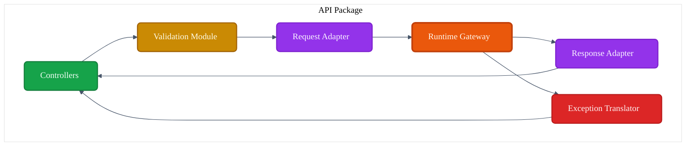
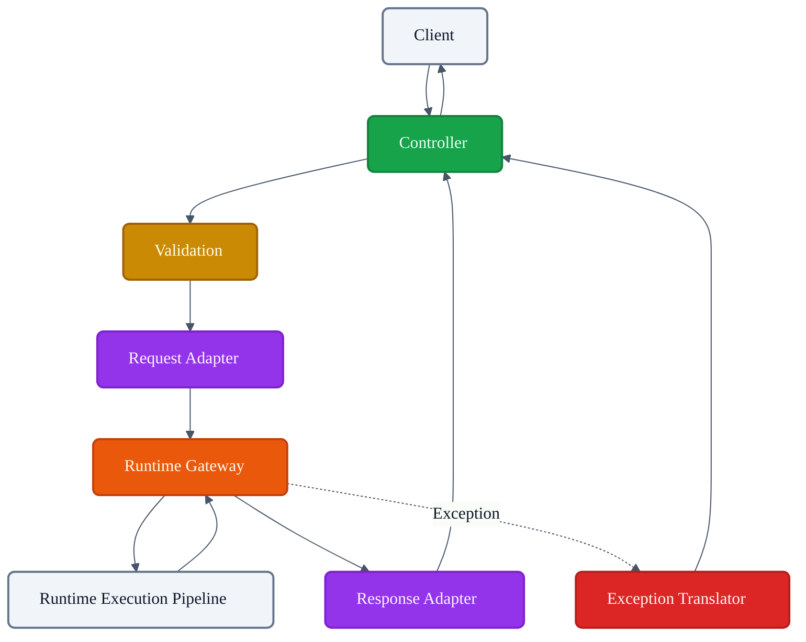

# VoxCore API Package

This document defines the internal design, responsibilities, module decomposition, public interfaces, internal collaboration, lifecycle expectations, dependency boundaries, extension points, and implementation constraints of the API package.

It answers exactly one engineering question: **"How is the API package internally organized to receive external requests and hand them to the VoxCore runtime?"**

The API package is the external entry point into VoxCore. It acts as an anti-corruption layer. It owns request reception and response delivery. It does not implement runtime logic. It does not execute requests. It does not coordinate runtime lifecycle. It does not implement providers.

---

## 1. Purpose

The API package isolates external transport protocols (e.g., HTTP, WebSockets, gRPC) from the internal VoxCore runtime architecture.

Without a dedicated API package:
* **Transport concerns leak into runtime**: Core runtime services become polluted with HTTP status codes and header parsing logic.
* **Framework dependencies spread**: Swapping FastAPI for another framework requires rewriting the entire Execution Pipeline.
* **Validation becomes inconsistent**: Invalid payloads crash the deep internal runtime instead of being rejected cleanly at the boundary.
* **Request handling becomes duplicated**: Every endpoint re-invents how to serialize domain responses into JSON.
* **Testing becomes difficult**: Testing core LLM routing logic requires mocking a live HTTP server.

The API package ensures that the VoxCore runtime remains pristine, entirely agnostic to how it is invoked over the network.

---

## 2. Package Philosophy

The design of the API Package adheres to the following principles:

* **Transport Isolation**: The rest of VoxCore shall not know if it was invoked via REST, CLI, or WebSocket.
* **Thin Controllers**: Controllers contain zero business logic. They simply receive, translate, and delegate.
* **Framework Containment**: All dependencies on web frameworks (e.g., FastAPI, Express) are strictly confined to this package.
* **Validation at the Boundary**: Malformed payloads are rejected immediately before they ever touch the runtime.
* **Runtime Independence**: The package interacts with the runtime strictly via abstract boundaries, never reaching into internal state arrays.
* **Stable Contracts**: The external OpenAPI/gRPC schema is versioned and stable, isolating clients from internal refactors.
* **No Business Logic**: Data parsing, prompt building, and model routing occur downstream in the Runtime.
* **Single Responsibility**: The package is solely responsible for translating between the outside world and the inside world.

---

## 3. Responsibilities

The API Package enforces a strict boundary between what it owns and what it delegates.

| Responsibility | Description | Owned? |
| :--- | :--- | :--- |
| **Receive external requests** | Bind incoming HTTP/Socket streams to local structs. | **Yes** |
| **Validate transport input** | Assert that JSON payloads match expected schemas. | **Yes** |
| **Translate transport models** | Convert DTOs (Data Transfer Objects) into domain `Request` models. | **Yes** |
| **Invoke runtime** | Hand off the domain request to the Runtime Gateway. | **Yes** |
| **Translate runtime results** | Convert domain `Response` models into DTOs. | **Yes** |
| **Map runtime errors** | Translate domain exceptions into HTTP 4xx/5xx status codes. | **Yes** |
| **Execute requests** | Fulfilling the actual prompt generation or tool call. | *Delegated* (Pipeline) |
| **Coordinate lifecycle** | Booting the backend databases and providers. | *Delegated* (Managers) |

---

## 4. Internal Module Decomposition

To achieve this isolation, the API package is logically decomposed into the following internal modules.

### Controllers
* **Purpose**: Receive external requests via the chosen transport protocol.
* **Responsibilities**: Route definition, parameter extraction, and invoking adapters.
* **Collaborators**: `Validation Module`, `Request Adapters`, `Response Adapters`, `Exception Translator`.
* **Ownership**: Owns the transport ingress/egress.

### Request Adapters
* **Purpose**: Convert transport models to runtime requests.
* **Responsibilities**: Maps external DTOs to the internal `Request` domain entity defined in *Runtime Data Models*.
* **Collaborators**: `Controllers`, `Runtime Gateway`.
* **Ownership**: Owns inbound data mapping.

### Response Adapters
* **Purpose**: Convert runtime responses to transport models.
* **Responsibilities**: Maps internal `Response` domain entities into JSON-serializable DTOs.
* **Collaborators**: `Controllers`, `Runtime Gateway`.
* **Ownership**: Owns outbound data mapping.

### Validation Module
* **Purpose**: Validate incoming data before processing.
* **Responsibilities**: Enforces structural limits (string lengths, required fields, basic type checking).
* **Collaborators**: `Controllers`.
* **Ownership**: Owns edge security and payload sanity.

### Exception Translator
* **Purpose**: Translate runtime failures into API responses.
* **Responsibilities**: Maps internal domain errors (e.g., `CapabilityResolutionError`) into standard transport errors (e.g., `HTTP 422 Unprocessable Entity`).
* **Collaborators**: `Controllers`, `Runtime Gateway`.
* **Ownership**: Owns external error representation.

### Runtime Gateway
* **Purpose**: Single abstraction used to invoke the runtime.
* **Responsibilities**: Defines the strict interface through which the API package hands work to the `Runtime Execution Pipeline` or `Runtime Kernel`.
* **Collaborators**: `Request Adapters`, `Runtime Execution Pipeline`.
* **Ownership**: Owns the boundary wall separating the API from the Runtime.

---

## 5. Public Interface

The API Package exposes conceptual capabilities to external clients.

### Accept Request
* **Purpose**: Receives a conversational or execution prompt.
* **Inputs**: Client JSON payload (Headers, Body).
* **Outputs**: Formatted Response JSON.
* **Preconditions**: Valid authorization token (if applicable).
* **Postconditions**: Execution is delegated to the runtime.
* **Failure Conditions**: Transport disconnect.

### Validate Request
* **Purpose**: Asserts payload schema.
* **Inputs**: Client JSON payload.
* **Outputs**: Boolean or 400 Bad Request.
* **Preconditions**: None.
* **Postconditions**: Guaranteed safe payload.
* **Failure Conditions**: Schema violation.

### Submit Runtime Request
* **Purpose**: Handoff to the backend.
* **Inputs**: Domain `Request`.
* **Outputs**: Domain `Response`.
* **Preconditions**: Payload is validated and mapped.
* **Postconditions**: Runtime pipeline takes ownership.
* **Failure Conditions**: Runtime saturation or timeout.

### Return Response
* **Purpose**: Transmit output to client.
* **Inputs**: Domain `Response`.
* **Outputs**: Formatted Response JSON.
* **Preconditions**: Runtime execution successful.
* **Postconditions**: Connection safely closed/flushed.
* **Failure Conditions**: Client disconnects during transit.

### Return Error
* **Purpose**: Transmit failure safely.
* **Inputs**: Domain Exception.
* **Outputs**: Standardized Error JSON.
* **Preconditions**: Caught exception.
* **Postconditions**: Error safely obfuscates internal stack traces.
* **Failure Conditions**: None.

### Health Endpoint
* **Purpose**: Probes runtime status for load balancers.
* **Inputs**: None.
* **Outputs**: System status map.
* **Preconditions**: None.
* **Postconditions**: None.
* **Failure Conditions**: Runtime Kernel reports degradation.

---

## 6. Request Processing Flow

The lifecycle of a single request strictly follows this conceptual path:

1. **Incoming Request**: Client hits an endpoint.
2. **Validation**: The payload is checked against schema boundaries. If invalid, jumps to Exception Translator.
3. **Request Adapter**: The JSON DTO is converted into a VoxCore `Request` entity.
4. **Runtime Gateway**: The mapped entity is passed across the boundary.
5. **Runtime Execution Pipeline**: (External to this package) The runtime processes the entity and returns a `Response` entity.
6. **Response Adapter**: The `Response` entity is mapped back to a JSON DTO.
7. **Outgoing Response**: The DTO is transmitted back to the client.

---

## 7. Dependency Rules

To preserve its role as an anti-corruption layer, the following rules are absolute:

* **Controllers shall not access runtime internals**: They must only ever call methods on the `Runtime Gateway`.
* **Adapters shall not contain business logic**: A Request adapter copies fields from A to B. It must not alter the conversational intent.
* **Validation shall occur before runtime invocation**: Bad data must never cross the Runtime Gateway.
* **No cyclic dependencies**: The API package depends on the Runtime interfaces; the Runtime shall *never* depend on the API package.
* **Framework code remains confined to the API package**: E.g., `fastapi.Request` objects must not be passed into the `Runtime Gateway`.

---

## 8. Error Handling

* **Validation errors**: Caught instantly in the API package. Returned to the client as syntax/schema errors (e.g., HTTP 400).
* **Runtime errors**: Caught by the `Runtime Gateway`, passed to the `Exception Translator`.
* **Unexpected failures**: Unhandled panics are caught at the Controller level and obfuscated into generic failures (e.g., HTTP 500) to prevent internal state leakage.
* **Transport translation**: The API package maps domain semantics to transport semantics. `ProviderUnavailableError` becomes `HTTP 503`.
* **Error propagation**: Errors do not propagate outward until they are sanitized by the Translator.

---

## 9. Collaboration
* **Initiator**: N/A
* **Owner**: N/A
* **Depends On**: N/A
* **Publishes**: N/A
* **Receives**: N/A
---

## 10. Package Invariants

The following invariants must hold true under all conditions:

1. **All requests pass through validation.** No raw payloads reach the Runtime.
2. **Runtime is accessed only through Runtime Gateway.** No backdoors into the Scheduler or Stores.
3. **Controllers remain thin.** Logic lives in Adapters and the Runtime.
4. **Transport models never cross package boundaries.** A JSON DTO must be converted to a Domain Entity before entering the Runtime Gateway.
5. **Business logic never exists inside the API package.**
6. **Framework dependencies never escape the package.**

---

## 11. Extension Points

The API package isolates transport, making it highly extensible:
* **Additional transport protocols**: A gRPC controller can be added alongside the HTTP controller, reusing the same Adapters and Gateway.
* **Additional controllers**: New admin endpoints can be bolted on.
* **Custom validators**: Injectable schema rules for specific client integrations.
* **Request interceptors**: Middleware for rate-limiting, CORS, or JWT validation.
* **Response interceptors**: Middleware for injecting unified tracking headers.
* **Versioning**: v1 and v2 API controllers can coexist, both mapping down to the same underlying Runtime Gateway.

---

## 12. Design Constraints

The following constraints are mandatory:
* **API package shall not execute business logic.**
  * *Exception (ADR-003)*: `websocket_controller.py` currently executes Silero VAD gating logic to optimize raw PCM microphone audio. This is a temporary architectural violation until the transport is migrated to WebRTC.
* **API package shall not access runtime internals.**
* **API package shall not own runtime state.** (e.g., Do not store session histories in the Controller).
* **API package shall not schedule work.**
* **API package shall remain framework-contained.** (No web framework annotations on domain models).

---

## 13. Conclusion

The API package provides a clean, stable transport boundary between external clients and the VoxCore runtime. By enforcing strict separation through thin controllers, robust validation, and dedicated adapters, it protects the runtime from transport complexities and framework churn, preserving architectural integrity.

---

## Required Tables

### Table 1: Documentation Relationships

| Document | Responsibility |
| :--- | :--- |
| **Package Architecture** | Defines API package ownership. |
| **Runtime Kernel** | Owns runtime lifecycle. |
| **Runtime Context** | Provides execution context. |
| **Runtime Execution Pipeline** | Executes requests. |
| **API Package (This Doc)** | Accepts external requests and forwards them. |
| **Public Module Interfaces** | Defines package contracts. |

### Table 2: Responsibilities Matrix

| Responsibility | Owner | Delegated To |
| :--- | :--- | :--- |
| **Receive external requests** | API Package | N/A |
| **Validate transport payload** | API Package | N/A |
| **Map to Domain Entities** | API Package | N/A |
| **Invoke Business Logic** | N/A | Runtime Pipeline |
| **Persist Data** | N/A | Runtime Stores |

### Table 3: Internal Modules

| Module | Purpose | Collaborates With |
| :--- | :--- | :--- |
| **Controllers** | Receive transport traffic. | Validation, Adapters |
| **Validation** | Enforce schema sanity. | Controllers |
| **Request Adapter** | Map DTO to Domain. | Controllers, Gateway |
| **Response Adapter** | Map Domain to DTO. | Controllers, Gateway |
| **Exception Translator** | Map Domain Error to HTTP. | Gateway, Controllers |
| **Runtime Gateway** | Strict boundary to backend. | Adapters, Runtime Pipeline |

### Table 4: Capability Matrix

| Capability | Purpose | Consumer |
| :--- | :--- | :--- |
| **Accept Request** | Receive incoming payloads. | External Clients |
| **Validate Request** | Assert schema correctness. | Controllers |
| **Submit Runtime Request**| Delegate execution. | Adapters (calling Gateway) |
| **Return Error** | Format failures safely. | Exception Translator |

### Table 5: Dependency Rules

| Rule | Reason |
| :--- | :--- |
| **Gateway is the only boundary** | Prevents tight coupling to internal subsystems. |
| **Framework containment** | Protects the domain from external library churn. |
| **No business logic** | Preserves single responsibility. |
| **No cyclic dependencies** | The runtime must not know the API exists. |

### Table 6: Package Invariants

| Invariant | Reason |
| :--- | :--- |
| **Mandatory Validation** | Prevents malformed data from poisoning the runtime. |
| **Transport Model Isolation** | Prevents API schemas from dictating Domain schemas. |
| **Thin Controllers** | Ensures testability and readability of routing code. |

---

## Required Diagrams

### Diagram 1: API Package Internal Architecture

### Diagram 2: Request Processing Flow

### Diagram 3: Dependency Boundaries

```mermaid
%%{init: {"theme": "base", "themeVariables": {"primaryColor": "#F8FAFC", "primaryTextColor": "#0F172A", "primaryBorderColor": "#64748B", "lineColor": "#475569", "fontFamily": "Inter, sans-serif"}}}%%
flowchart LR
    subgraph External [External Network]
        client["External Clients"]:::standard
    end
    
    subgraph API [API Package]
        ctrl["Controllers"]:::controller
        gw["Runtime Gateway"]:::gateway
    end
    
    subgraph Core [VoxCore Runtime]
        pipe["Execution Pipeline"]:::standard
        context["Context / State"]:::standard
    end

    client -- "HTTP / WebSocket (DTOs)" --> ctrl
    ctrl -. "Domain Entities" .-> gw
    gw -- "Abstract Interface Call" --> pipe
    pipe -. "Abstract Dependency" .-> context

    classDef controller fill:#16A34A,stroke:#15803D,color:#F0FDF4,stroke-width:2px,rx:6px,ry:6px;
    classDef gateway fill:#EA580C,stroke:#C2410C,color:#FFF7ED,stroke-width:3px,rx:6px,ry:6px;
    classDef standard fill:#F1F5F9,stroke:#64748B,color:#0F172A,stroke-width:2px,rx:6px,ry:6px;
```

