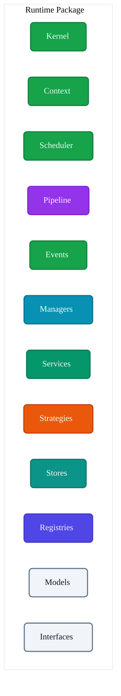
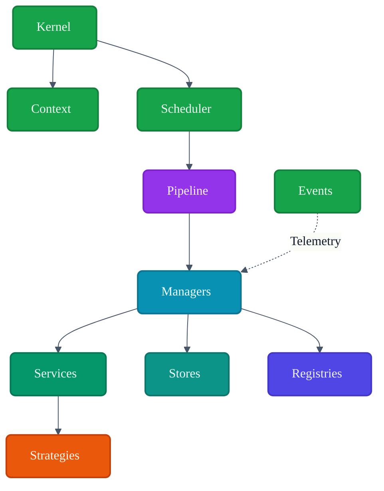
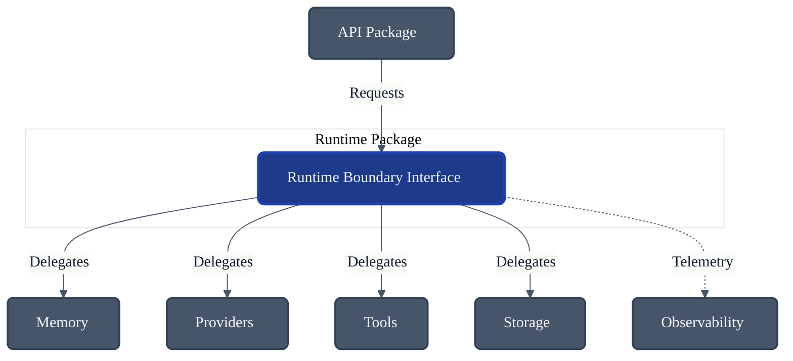
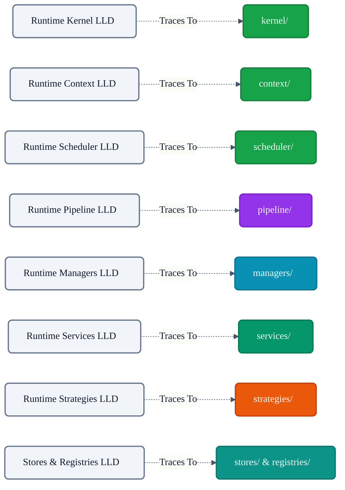

# VoxCore Runtime Package

This document defines the internal organization, module decomposition, public boundary, internal collaboration model, implementation constraints, and extension points of the Runtime package.

It answers exactly one engineering question: **"How is the voxcore/runtime package internally organized to implement the approved runtime architecture?"**

This document derives directly from the core conceptual LLDs (Kernel, Context, Scheduler, Event Bus, Execution Pipeline, Managers, Services, Strategies, Stores, and Registries). It does not redefine those concepts; it maps them into a coherent physical directory structure.

---

## 1. Purpose

The Runtime package is the physical realization of the VoxCore runtime architecture.

Without a dedicated runtime package:
* **Execution logic becomes fragmented**: Schedulers and Execution Pipelines end up scattered across API endpoints or Provider modules.
* **Lifecycle management becomes inconsistent**: Bootstrapping is duplicated across scripts instead of centralized in a Kernel.
* **Pipeline stages become tightly coupled**: Without a clear internal structure, Services directly import Schedulers, causing dependency cycles.
* **Runtime state becomes scattered**: Session state leaks into transport layers.
* **Orchestration leaks into unrelated packages**: The boundaries between *coordination* and *implementation* erode.

The Runtime package centralizes execution coordination while delegating specialized implementations (e.g., Providers, Transport) to other packages.

---

## 2. Runtime Package Philosophy

The physical structure of the `voxcore/runtime` package adheres to the following principles:

* **Centralized orchestration**: This package owns the "brain" of the application. Everything else is a limb.
* **Clear module ownership**: Every Python submodule (e.g., `runtime/pipeline/`) corresponds directly to an established architectural LLD document.
* **Internal cohesion**: Internal modules collaborate extensively with each other to orchestrate execution, hiding that complexity from the outside world.
* **Explicit collaboration**: Internal dependencies flow downward, from orchestration (Kernel) to decision logic (Strategies) and state (Stores).
* **Stable public boundary**: The rest of VoxCore accesses the runtime only through defined facade interfaces, never reaching directly into internal submodules.
* **Framework independence**: The package contains no knowledge of FastAPI, Flask, or web sockets.
* **Provider independence**: The package contains no knowledge of OpenAI, AWS, or specific LLM SDKs.
* **Separation of orchestration from implementation**: The package coordinates work but relies on external plugins or packages to actually perform domain-specific provider calls.

---

## 3. Responsibilities

The package enforces a strict boundary between what it owns and what it delegates.

| Responsibility | Description | Owned? |
| :--- | :--- | :--- |
| **Runtime lifecycle** | Bootstrapping and tearing down the application via Kernel. | **Yes** |
| **Execution pipeline**| Advancing tasks through processing stages safely. | **Yes** |
| **Scheduler** | Prioritizing and ordering dispatched tasks. | **Yes** |
| **Runtime context** | Propagating correlation IDs and execution scope. | **Yes** |
| **Event dispatch** | Routing asynchronous events between internal modules. | **Yes** |
| **Execution coordination**| Managing the interaction of Services and Strategies. | **Yes** |
| **Providers** | Translating domain prompts into external API HTTP calls. | *Delegated* |
| **Memory implementation**| Querying Postgres or Vector DBs directly. | *Delegated* |
| **Storage** | Physical disk I/O or S3 bucket management. | *Delegated* |
| **Transport** | Listening for HTTP requests (API package). | *Delegated* |
| **Security** | Auth token validation (Auth/API package). | *Delegated* |
| **Observability** | Exporting OpenTelemetry metrics to Grafana. | *Delegated* |

---

## 4. Internal Package Structure

The `voxcore/runtime/` package is logically and physically structured as follows:

### `kernel/`
* **Purpose**: Coordinates runtime initialization and lifecycle.
* **Responsibilities**: Bootstrapping, configuration binding, graceful shutdown.
* **Collaborators**: All internal modules.
* **Visibility**: Public boundary.
* **Dependencies**: Relies on `managers/` for initialization.

### `context/`
* **Purpose**: Represents the execution environment.
* **Responsibilities**: Correlation ID propagation, cancellation signals, ambient data scoping.
* **Collaborators**: Used universally across the runtime.
* **Visibility**: Public boundary.
* **Dependencies**: None.

### `scheduler/`
* **Purpose**: Coordinates execution timing.
* **Responsibilities**: Queue management, priority evaluation, dispatcher loops.
* **Collaborators**: `pipeline/`, `kernel/`.
* **Visibility**: Internal.
* **Dependencies**: Depends on Domain Task models.

### `pipeline/`
* **Purpose**: Executes runtime requests.
* **Responsibilities**: Stage-based transitions, error isolation, context preparation.
* **Collaborators**: `scheduler/`, `managers/`, `services/`.
* **Visibility**: Internal.
* **Dependencies**: Depends on `context/` and `managers/`.

### `events/`
* **Purpose**: Facilitates internal asynchronous communication.
* **Responsibilities**: Topic subscription, event delivery, routing.
* **Collaborators**: All internal modules.
* **Visibility**: Public boundary.
* **Dependencies**: None.

### `managers/`
* **Purpose**: Coordinate runtime resources.
* **Responsibilities**: Lifecycle tracking for Providers, Plugins, Sessions, etc.
* **Collaborators**: `kernel/`, `pipeline/`, `services/`.
* **Visibility**: Public boundary.
* **Dependencies**: Depends on `stores/` and `registries/`.

### `services/`
* **Purpose**: Implement reusable capabilities.
* **Responsibilities**: Prompt Assembly, Response Formatting, Tool Invocation logic.
* **Collaborators**: `pipeline/`, `managers/`, `strategies/`.
* **Visibility**: Internal (primarily).
* **Dependencies**: Depends on `strategies/` and `stores/`.

### `strategies/`
* **Purpose**: Encapsulate interchangeable decision logic.
* **Responsibilities**: Provider selection, Retry heuristics, Ranking algorithms.
* **Collaborators**: `services/`.
* **Visibility**: Internal (implementations can be injected externally).
* **Dependencies**: Depends on Domain models.

### `stores/`
* **Purpose**: Maintain runtime state.
* **Responsibilities**: Centralized storage for Sessions, Conversations, and active Tasks.
* **Collaborators**: `managers/`, `services/`.
* **Visibility**: Internal.
* **Dependencies**: None.

### `registries/`
* **Purpose**: Maintain runtime registrations.
* **Responsibilities**: Indexing available Providers, Plugins, and Tools.
* **Collaborators**: `managers/`, `pipeline/`.
* **Visibility**: Public boundary.
* **Dependencies**: None.

### `models/`
* **Purpose**: Defines standard domain entities specific to the Runtime.
* **Responsibilities**: Type hints, immutable data structs (e.g., Execution, Task).
* **Collaborators**: All modules.
* **Visibility**: Public boundary.

### `interfaces/`
* **Purpose**: Contains the abstract contracts for external injection.
* **Responsibilities**: Defines `IProvider`, `IStore`, `IStrategy`.
* **Collaborators**: All modules.
* **Visibility**: Public boundary.

---

## 5. Public Boundary

The Runtime package exposes a specific facade to external packages (like the API package).

### Initialize Runtime
* **Purpose**: Bootstraps the internal modules.
* **Inputs**: Configuration Profile.
* **Outputs**: None.
* **Preconditions**: Runtime is currently stopped.
* **Postconditions**: Registries are loaded; Managers are initialized.
* **Failure Conditions**: Invalid configuration; Missing required plugins.

### Start Runtime
* **Purpose**: Begins accepting traffic.
* **Inputs**: None.
* **Outputs**: Boolean.
* **Preconditions**: Runtime is Initialized.
* **Postconditions**: Scheduler begins polling.
* **Failure Conditions**: Event Bus fails to bind.

### Stop Runtime
* **Purpose**: Shuts down cleanly.
* **Inputs**: None.
* **Outputs**: None.
* **Preconditions**: Runtime is Active.
* **Postconditions**: All connections drained and Stores released.
* **Failure Conditions**: Hung tasks trigger a force-kill.

### Submit Request
* **Purpose**: Main entry point for user prompts.
* **Inputs**: Domain `Request`, `RuntimeContext`.
* **Outputs**: Domain `Response`.
* **Preconditions**: Runtime is Active.
* **Postconditions**: Task completes through the Execution Pipeline.
* **Failure Conditions**: Context cancelled; Validation fails.

### Cancel Request
* **Purpose**: Halts an in-progress request.
* **Inputs**: Request ID.
* **Outputs**: None.
* **Preconditions**: Task is currently in Scheduler or Pipeline.
* **Postconditions**: Context receives Abort signal.
* **Failure Conditions**: Task already completed.

### Publish Event
* **Purpose**: Allows external packages to emit telemetry.
* **Inputs**: `Event` Entity.
* **Outputs**: None.
* **Preconditions**: Runtime is Active.
* **Postconditions**: Event routed asynchronously.
* **Failure Conditions**: Bus saturation.

### Subscribe Event
* **Purpose**: Allows external packages to listen to internal lifecycle events.
* **Inputs**: Topic string, Callback Function.
* **Outputs**: Subscription ID.
* **Preconditions**: None.
* **Postconditions**: Callback is registered in `registries/`.
* **Failure Conditions**: Invalid callback signature.

### Query Runtime State
* **Purpose**: Read-only access to health.
* **Inputs**: None.
* **Outputs**: Health metrics map.
* **Preconditions**: None.
* **Postconditions**: Returns aggregated status from all Managers.
* **Failure Conditions**: None.

---

## 6. Internal Collaboration

The internal submodules collaborate strictly according to the rules defined in the LLDs:
* **Kernel ↔ Context**: Kernel seeds the global base context, but does not own request-level contexts.
* **Kernel ↔ Scheduler**: Kernel commands the Scheduler to start/stop the dispatch loops.
* **Scheduler ↔ Pipeline**: Scheduler determines priority; Pipeline executes the actual task.
* **Pipeline ↔ Managers**: Pipeline asks Managers for the correct `ProviderInstance` to fulfill a task.
* **Managers ↔ Services**: Managers coordinate the lifecycle of Services but delegate payload parsing to them.
* **Services ↔ Strategies**: Services evaluate heuristics (like Cost vs Latency) by delegating to Strategies.
* **Managers ↔ Stores**: Managers control the connection state of Stores, but do not write domain data.
* **Managers ↔ Registries**: Managers populate Registries during bootstrap.
* **Event Bus ↔ Managers**: Managers emit degradation alerts to the Event Bus.

---

## 7. Dependency Rules

* **Kernel shall not depend on Providers**: The Kernel only interacts with `interfaces/IProvider`.
* **Pipeline shall not access Storage directly**: The Pipeline relies on Services or Managers to hydrate context.
* **Managers shall depend on Services only through defined contracts**: Prevents tight coupling if a Service implementation is swapped.
* **Services shall not invoke Scheduler**: Business logic cannot re-queue tasks or alter global execution priorities.
* **Strategies shall not own runtime state**: Strategies compute decisions immutably; they do not write to Stores.
* **Stores shall not implement behaviour**: Stores remain dumb repositories holding State representations.
* **No cyclic dependencies**: The DAG (Directed Acyclic Graph) of the package always flows downward (Kernel → Pipeline → Services → Strategies → Stores).

---

## 8. Visibility Rules

* **Public modules**: `kernel/`, `context/`, `events/`, `models/`, `interfaces/`, `managers/`, `registries/`. These are exported via the top-level `__init__.py`.
* **Internal modules**: `pipeline/`, `scheduler/`, `services/`, `strategies/`, `stores/`. These are orchestrated internally by the Kernel and Managers and are generally hidden from external packages like API.
* **Private helpers**: Internal utility functions (e.g., specific string parsers) remain strictly within their localized directory.
* **Extension interfaces**: All contracts meant for external implementation reside exclusively in `interfaces/`.
* **Stable package exports**: Modifying the public boundary requires an architecture review, whereas modifying an internal module does not.

---

## 9. Runtime Package Lifecycle

The `runtime` package exposes a lifecycle managed by the `kernel/`.
* **Construction**: Package imported into memory.
* **Initialization**: Global registries populated, stores mounted.
* **Ready**: Initial configuration validated.
* **Active**: API package calls `Start Runtime`. Scheduler accepts traffic.
* **Shutdown**: API package calls `Stop Runtime`. Schedulers drain queues.
* **Disposed**: Connections severed; process ready to exit.

---

## 10. Collaboration With Other Packages

### API Package
* **Purpose**: Handles external transport.
* **Dependency Direction**: API → Runtime.
* **Information Exchanged**: DTOs mapped to Domain Requests.
* **Boundary Rules**: API only communicates via `Submit Request` boundary.

### Providers Package
* **Purpose**: Implements external LLM APIs (OpenAI, AWS).
* **Dependency Direction**: Providers → Runtime (`interfaces/`).
* **Information Exchanged**: Provider registers its capabilities during initialization.
* **Boundary Rules**: Providers conform to `IProvider`; Runtime remains ignorant of Provider internals.

### Plugins & Tools Package
* **Purpose**: Domain-specific logic.
* **Dependency Direction**: Plugins → Runtime (`interfaces/`).
* **Information Exchanged**: Plugins inject custom `Strategies` or `Tools` into Registries.
* **Boundary Rules**: Adherence to the `ITool` and `IPlugin` contracts.

### Observability Package
* **Purpose**: Diagnostics and Metrics.
* **Dependency Direction**: Observability → Runtime (`events/`).
* **Information Exchanged**: Subscribes to lifecycle events.
* **Boundary Rules**: Must not block the runtime execution loop.

---

## 11. Package Invariants

1. **Runtime owns orchestration only.** It does not own the web server or the database driver.
2. **Runtime never owns provider implementations.** It delegates strictly via `IProvider`.
3. **Runtime never owns transport.** It does not know what HTTP is.
4. **Runtime exposes only stable public interfaces.** Modules like `pipeline` are obscured from external access.
5. **Internal modules remain encapsulated.** The `Scheduler` cannot be hijacked by a random external module.
6. **No cross-package state mutation.** External packages cannot directly write to `stores/`; they must emit an event or submit a request.

---

## 12. Extension Points

* **New managers**: E.g., `CacheManager` added to `managers/`.
* **New services**: E.g., `AudioParsingService` added to `services/`.
* **New strategies**: External packages injecting a custom `PromptRoutingStrategy`.
* **New pipeline stages**: Configured via the `pipeline` coordinator.
* **New runtime events**: External packages defining custom domain events for the Bus.
* **New schedulers**: E.g., swapping to a distributed `RedisScheduler`.

---

## 13. Design Constraints

* **Runtime shall not implement provider-specific code.** (e.g., No references to `anthropic.Client`).
* **Runtime shall not implement transport protocols.** (e.g., No `fastapi.Request` parsing).
* **Runtime shall not perform persistence.** (e.g., No `import psycopg2` in the core runtime; injected via `IStore`).
* **Runtime shall remain provider-independent.**
* **Runtime shall remain framework-independent.**
* **Runtime shall not bypass package boundaries.** It must not read the private config files of the API package.

---

## 14. Traceability

This table proves that the internal directory structure is a 1-to-1 reflection of the approved Architecture.

| Runtime Module | Source LLD Document |
| :--- | :--- |
| `kernel/` | Runtime Kernel |
| `context/` | Runtime Context |
| `scheduler/` | Runtime Scheduler |
| `pipeline/` | Runtime Execution Pipeline |
| `events/` | Runtime Event Bus |
| `managers/` | Runtime Managers |
| `services/` | Runtime Services |
| `strategies/` | Runtime Strategies |
| `stores/` | Stores & Registries |
| `registries/` | Stores & Registries |
| `models/` | Runtime Data Models |

---

## 15. Conclusion

The Runtime package is the physical realization of the runtime architecture. Its internal organization faithfully implements the approved runtime design while preserving modularity, extensibility, and clear ownership boundaries. By translating conceptual architectural documents directly into python directories, VoxCore ensures that the codebase remains navigable, predictable, and structurally sound as it scales.

---

## Required Tables

### Table 1: Documentation Relationships

| Document | Responsibility |
| :--- | :--- |
| **Package Architecture** | Defines Runtime package ownership. |
| **Runtime Conceptual LLDs**| Defines behaviour (Kernel, Context, etc.). |
| **Runtime Package (This Doc)**| Maps concepts to physical implementation structure. |

### Table 2: Responsibilities Matrix

| Responsibility | Owner | Delegated To |
| :--- | :--- | :--- |
| **Execution Orchestration** | Runtime Package | N/A |
| **Lifecycle Command** | Runtime Package | N/A |
| **Transport Processing** | N/A | API Package |
| **Model Integration** | N/A | Providers Package |
| **Security Validation** | N/A | API / Security Package |

### Table 3: Internal Runtime Modules

| Module | Purpose | Collaborates With |
| :--- | :--- | :--- |
| **kernel/** | System lifecycle. | All modules |
| **pipeline/** | Execution flow. | Managers, Services, Scheduler |
| **managers/** | Resource tracking. | Registries, Stores |
| **services/** | Reusable capabilities. | Strategies, Stores |
| **strategies/** | Decision logic. | Services |

### Table 4: Public Capabilities

| Capability | Purpose | Consumer |
| :--- | :--- | :--- |
| **Start / Stop** | Command process state. | External Bootstrapper |
| **Submit Request**| Pass external data to engine.| API Package |
| **Publish Event** | Emit telemetry across bus. | All external packages |
| **Subscribe** | Listen to runtime events. | Observability / Plugins |

### Table 5: Package Dependency Rules

| Rule | Reason |
| :--- | :--- |
| **No cyclic dependencies** | Prevents import loops and logic tangles. |
| **Downward flow only** | Orchestration (Kernel) → Implementation (Services). |
| **Interfaces for I/O** | Protects the core from DB driver changes. |

### Table 6: Runtime Package Invariants

| Invariant | Reason |
| :--- | :--- |
| **Pure Orchestration** | No external APIs are called directly by the core. |
| **Hidden Internals** | External packages cannot bypass the Public Boundary. |
| **Agnostic Logic** | No HTTP or AWS specifics exist in the code. |

### Table 7: Traceability Matrix

| Runtime Module | Source LLD Document |
| :--- | :--- |
| `kernel/` | Runtime Kernel |
| `scheduler/` | Runtime Scheduler |
| `pipeline/` | Runtime Execution Pipeline |
| `stores/` | Stores & Registries |
| `managers/` | Runtime Managers |

---

## Required Diagrams

### Diagram 1: Runtime Package Internal Structure

### Diagram 2: Runtime Internal Collaboration

### Diagram 3: Runtime Package and External Packages

### Diagram 4: Runtime Traceability

