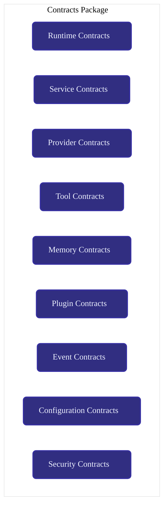
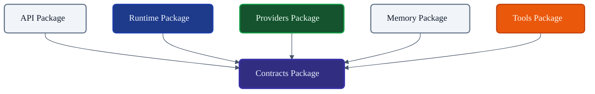
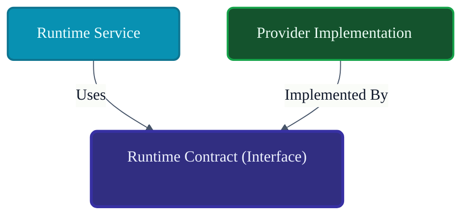
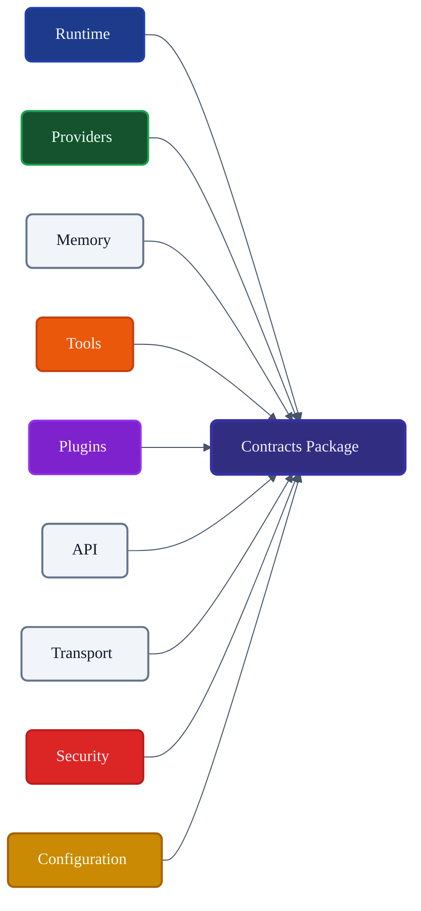

# VoxCore Contracts Package

This document defines the internal organization, responsibilities, public contracts, interface ownership, shared models, dependency rules, extension points, and implementation constraints of the Contracts package.

It answers exactly one engineering question: **"How is the Contracts package organized to provide stable, implementation-independent contracts shared across VoxCore?"**

The Contracts package is the architectural boundary package. It defines the language that packages use to communicate. It shall not contain implementation logic. It shall not contain runtime orchestration. It shall not contain provider-specific code. It shall not contain business behaviour.

---

## 1. Purpose

The Contracts package exists to decouple the definition of capabilities from their concrete implementations.

Without shared contracts:
* **Implementations become tightly coupled**: The Runtime package imports AWS-specific classes directly, locking the system to a single vendor.
* **Packages depend on concrete types**: Testing requires spinning up live database instances because mock interfaces do not exist.
* **Provider replacement becomes difficult**: Changing from OpenAI to Anthropic requires rewriting the entire Prompt Assembly Service.
* **Extension points become unstable**: Plugins cannot safely integrate because internal method signatures change unpredictably.

Contracts provide stable, implementation-independent boundaries. They allow VoxCore to achieve true Dependency Inversion, enabling maximum extensibility and safe parallel development.

---

## 2. Package Philosophy

The physical structure and contents of the `voxcore/contracts` package adhere to the following principles:

* **Stable Contracts**: Once an interface is defined, its method signatures must not change without a formal version bump or deprecation period.
* **Implementation Independence**: Contracts describe *what* must be done, never *how* it is done.
* **Dependency Inversion**: Core orchestrators (Runtime) depend inward on Contracts. Concrete plugins (Providers) depend inward on Contracts. Neither depends on the other.
* **Minimal Shared Types**: The package contains interfaces and pure data structures (models) required for communication. It does not contain helper functions.
* **Backward Compatibility**: Modifying a contract must not break existing plugin implementations maliciously.
* **Single Ownership**: The definition of an `IProvider` exists only in this package, preventing conflicting definitions across the codebase.
* **No Behaviour**: Files in this package contain abstract methods and structural types. They execute zero business logic.
* **Framework Independence**: Contracts never import third-party libraries (e.g., SQLAlchemy, FastAPI).

---

## 3. Responsibilities

The Contracts package enforces a strict boundary between defining an interface and fulfilling it.

| Responsibility | Description | Owned? |
| :--- | :--- | :--- |
| **Interface definitions** | Specifying the required methods for subsystems. | **Yes** |
| **Shared abstractions** | Base classes or structural types used across boundaries. | **Yes** |
| **Capability contracts** | Definitions of what Tools or Providers must support. | **Yes** |
| **Service contracts** | Interfaces defining core business logic boundaries. | **Yes** |
| **Shared runtime models** | Pure data structs passed between packages. | **Yes** |
| **Extension contracts** | Hooks that external plugins must implement. | **Yes** |
| **Implementations** | Actually connecting to a database or API. | *Delegated* |
| **Runtime coordination** | Deciding when a contract method is called. | *Delegated* |
| **Provider behaviour** | Formatting JSON for a specific LLM endpoint. | *Delegated* |

---

## 4. Internal Package Structure

The `voxcore/contracts/` package is logically and physically structured as follows:

### `services/`
* **Purpose**: Defines contracts for reusable core capabilities.
* **Owned contracts**: `IConversationService`, `IValidationService`.
* **Consumers**: Runtime Managers, other Services.
* **Dependencies**: `runtime/` (Data models).
* **Visibility**: Public boundary.

### `providers/`
* **Purpose**: Defines the boundaries for external execution targets.
* **Owned contracts**: `IProvider`, `ILLMProvider`, `IAudioProvider`.
* **Consumers**: Runtime Pipeline, Provider Selection Strategy.
* **Dependencies**: `runtime/`.
* **Visibility**: Public boundary.

### `tools/`
* **Purpose**: Defines schemas and execution hooks for executable functions.
* **Owned contracts**: `ITool`, `IToolRegistry`.
* **Consumers**: Tool Invocation Service, External Plugin Developers.
* **Dependencies**: `common/`.
* **Visibility**: Public boundary.

### `memory/`
* **Purpose**: Defines semantic storage and retrieval boundaries.
* **Owned contracts**: `IMemoryStore`, `IVectorAdapter`.
* **Consumers**: Memory Manager, Memory Service.
* **Dependencies**: `runtime/`.
* **Visibility**: Public boundary.

### `plugins/`
* **Purpose**: Defines lifecycle hooks for external extensions.
* **Owned contracts**: `IPlugin`, `IPluginManifest`.
* **Consumers**: Plugin Manager.
* **Dependencies**: `common/`.
* **Visibility**: Public boundary.

### `runtime/`
* **Purpose**: Defines core domain data models shared across boundaries.
* **Owned contracts**: `Request`, `Response`, `Execution`, `Task` (Pure structs only).
* **Consumers**: Universal.
* **Dependencies**: None.
* **Visibility**: Public boundary.

### `events/`
* **Purpose**: Defines the shape of asynchronous telemetry and signals.
* **Owned contracts**: `IEvent`, `IEventSubscriber`.
* **Consumers**: Runtime Event Bus, Observability.
* **Dependencies**: `common/`.
* **Visibility**: Public boundary.

### `configuration/`
* **Purpose**: Defines configuration schemas and loading interfaces.
* **Owned contracts**: `IConfigurationLoader`, `ConfigTree`.
* **Consumers**: Configuration Manager, Configuration Resolution Service.
* **Dependencies**: `common/`.
* **Visibility**: Public boundary.

### `security/`
* **Purpose**: Defines authorization and identity abstraction.
* **Owned contracts**: `IAuthorizer`, `Identity`.
* **Consumers**: API Package, Security Manager.
* **Dependencies**: `common/`.
* **Visibility**: Public boundary.

### `common/`
* **Purpose**: Shared primitives (enums, basic types) used across multiple contract directories.
* **Owned contracts**: Shared Enums, Error Types.
* **Consumers**: Other contract directories.
* **Dependencies**: None.
* **Visibility**: Public boundary.

---

## 5. Contract Categories

Contracts are categorized by their architectural intent.

### Service Contracts
* **Purpose**: Decouples the orchestration of the Runtime from the specific logic of a capability.
* **Consumers**: `Runtime Pipeline`, `Managers`.
* **Implementers**: `Runtime Package` (concrete services).
* **Must Never Contain**: Hardcoded LLM prompt strings or formatting algorithms.

### Provider Contracts
* **Purpose**: Standardizes how VoxCore communicates with external AI vendors.
* **Consumers**: `Provider Selection Service`, `Execution Pipeline`.
* **Implementers**: `Providers Package` (e.g., `voxcore-provider-openai`).
* **Must Never Contain**: AWS Boto3 types or HTTP Client semantics.

### Runtime Contracts
* **Purpose**: Ensures that all packages agree on the shape of a Request and a Response.
* **Consumers**: Universal (API, Pipeline, Providers).
* **Implementers**: None (These are pure structural records).
* **Must Never Contain**: Validation logic or state mutation methods.

### Tool Contracts
* **Purpose**: Allows third parties to safely inject functions into the LLM context.
* **Consumers**: `Tool Manager`.
* **Implementers**: `Plugins`, `Internal Tools`.
* **Must Never Contain**: Security bypasses or direct access to Kernel singletons.

### Memory Contracts
* **Purpose**: Decouples semantic retrieval from database engines (Postgres, ChromaDB).
* **Consumers**: `Memory Manager`, `Memory Service`.
* **Implementers**: `Memory Package`.
* **Must Never Contain**: SQL queries or connection pooling logic.

### Plugin Contracts
* **Purpose**: Provides lifecycle hooks (OnLoad, OnStart, OnStop) for extensions.
* **Consumers**: `Plugin Manager`.
* **Implementers**: Third-party packages.
* **Must Never Contain**: Business logic.

### Event Contracts
* **Purpose**: Decouples event emitters from event listeners.
* **Consumers**: `Event Bus`, `Observability Package`.
* **Implementers**: `Subscribers`.
* **Must Never Contain**: Routing algorithms.

### Configuration Contracts
* **Purpose**: Standardizes how settings are structured and parsed.
* **Consumers**: `Configuration Manager`.
* **Implementers**: `Configuration Package`.
* **Must Never Contain**: File I/O operations (e.g., opening `.yaml` files).

### Security Contracts
* **Purpose**: Decouples identity verification from identity providers.
* **Consumers**: `API Package`.
* **Implementers**: `Security Package`.
* **Must Never Contain**: JWT parsing libraries or hashing algorithms.

---

## 6. Public Package Boundary
* **Purpose**: N/A
* **Inputs**: N/A
* **Outputs**: N/A
* **Preconditions**: N/A
* **Postconditions**: N/A
* **Failure Conditions**: N/A
* **Side Effects**: N/A
* **Ownership**: N/A
* **Dependencies**: N/A
* **Thread Safety**: N/A
---

## 7. Dependency Rules

To function as the absolute center of the architectural dependency graph, the Contracts package adheres to strict rules:

* **Contracts shall depend on no implementation package**: The Contracts package cannot import from `runtime/`, `api/`, or `providers/`.
* **Contracts shall remain acyclic**: Internal contract directories must not create circular imports (e.g., `services/` depends on `providers/` depends on `services/`).
* **Implementations depend on Contracts**: All other packages in VoxCore point their dependency arrows toward the Contracts package.
* **Contracts shall not reference Providers**: `IProvider` must not mention `OpenAI` or `Anthropic` by name in its docstrings or attributes.
* **Contracts shall not reference Runtime implementation**: A Contract cannot type-hint a concrete class like `DefaultRuntimePipeline`.
* **Contracts shall not import Storage**: `IMemoryStore` cannot depend on a Postgres library.

---

## 8. Versioning and Compatibility

* **Backward compatibility**: The Contracts package defines the semantic versioning baseline for the entire ecosystem. Breaking an interface requires a major version bump.
* **Interface evolution**: To add capabilities, prefer extending interfaces (`IProviderV2`) or adding optional kwargs with safe defaults, rather than mutating stable method signatures.
* **Deprecation**: Deprecated methods must be flagged clearly and supported for at least one major release cycle.
* **Contract stability**: Stability is the highest priority. A rigid contract is better than a flexible implementation if it guarantees cross-package compatibility.

---

## 9. Collaboration
* **Initiator**: N/A
* **Owner**: N/A
* **Depends On**: N/A
* **Publishes**: N/A
* **Receives**: N/A
---

## 10. Package Invariants

The following invariants must hold true under all conditions:

1. **Contracts never implement behaviour.** There are no `def calculate_cost():` bodies in this package—only `pass` or `...`.
2. **Every contract has one owner.** Interface definitions are centralized here to prevent drift.
3. **Contracts remain framework-independent.** No `FastAPI` dependencies.
4. **Contracts remain provider-independent.** No `AWS SDK` dependencies.
5. **Contracts remain stable.** Modifications require architectural review.
6. **Contracts never depend on implementations.** Dependency Inversion must be maintained absolutely.

---

## 11. Extension Points

The Contracts package itself enables extensibility:
* **New contracts**: Adding `IAudioProvider` allows VoxCore to support voice models seamlessly.
* **New capability interfaces**: Adding `IStreamingResponse` expands the pipeline's capabilities without breaking synchronous execution.
* **Extension interfaces**: Providing new lifecycle hooks in `IPluginManifest` allows for richer third-party integrations.

---

## 12. Design Constraints

The following constraints are mandatory:
* **No implementations.**
* **No algorithms.**
* **No runtime orchestration.**
* **No persistence (No SQL/Filesystem logic).**
* **No framework APIs.**
* **No provider-specific code.**
* **Minimal shared types.** (Do not put random utility functions in `contracts/common/`).

---

## 13. Traceability

This table traces how architectural requirements mandate the existence of specific contracts.

| Contract Category | Originating Architecture | Primary Consumers |
| :--- | :--- | :--- |
| `services/` | Runtime Services LLD | Managers, Pipeline |
| `providers/` | System Architecture | Pipeline, Strategies |
| `tools/` | Package Architecture | Plugins, Tool Manager |
| `memory/` | Stores & Registries LLD | Memory Manager |
| `runtime/` | Runtime Data Models | Universal |
| `plugins/` | Package Responsibilities | Plugin Manager |

---

## 14. Conclusion

The Contracts package provides the stable architectural language that enables loose coupling, dependency inversion, extensibility, and provider independence across VoxCore. By containing zero implementation logic, it serves as the absolute center of the dependency graph, ensuring that no internal or external module becomes tightly coupled to a concrete implementation.

---

## Required Tables

### Table 1: Documentation Relationships

| Document | Responsibility |
| :--- | :--- |
| **Package Responsibilities** | Defines ownership of the Contracts package. |
| **Package Dependency Rules** | Defines which packages may depend on Contracts. |
| **Package Communication** | Defines communication through contracts. |
| **Runtime Services** | Consume contracts. |
| **Runtime Managers** | Consume contracts. |
| **Providers Package** | Implements contracts. |
| **Contracts Package (This Doc)**| Organizes and owns shared interfaces and contracts. |

### Table 2: Responsibilities Matrix

| Responsibility | Owner | Delegated To |
| :--- | :--- | :--- |
| **Interface Definitions** | Contracts Package | N/A |
| **Shared Data Models** | Contracts Package | N/A |
| **Implementation Logic** | N/A | Runtime, Providers, Stores |
| **Runtime Orchestration** | N/A | Runtime Kernel / Pipeline |
| **Persistence Operations** | N/A | Memory Package |

### Table 3: Contract Categories

| Category | Purpose | Implemented By | Consumed By |
| :--- | :--- | :--- | :--- |
| **Service Contracts** | Standardize core logic. | Runtime Package | Managers, Pipeline |
| **Provider Contracts** | Standardize LLM access. | Providers Package | Pipeline, Strategies |
| **Runtime Contracts** | Standardize payloads. | N/A (Structs) | Universal |
| **Tool Contracts** | Standardize function hooks. | Plugins | Tool Manager |
| **Memory Contracts** | Standardize vector search. | Memory Package | Memory Manager |

### Table 4: Dependency Rules

| Rule | Reason |
| :--- | :--- |
| **Zero Implementation Imports** | Ensures the Contracts package is independent. |
| **Dependency Inversion** | Both high-level (Runtime) and low-level (Providers) depend on Contracts. |
| **Acyclic internal structure** | Prevents compilation/import deadlocks. |

### Table 5: Package Invariants

| Invariant | Reason |
| :--- | :--- |
| **No Logic** | Contracts describe signatures, not algorithms. |
| **No 3rd-Party Frameworks** | Isolates VoxCore from external library deprecations. |
| **No Vendor Specifics** | OpenAI and Anthropic must share the same `IProvider`. |

### Table 6: Traceability Matrix

| Contract Category | Originating Architecture | Primary Consumers |
| :--- | :--- | :--- |
| `services/` | Runtime Services LLD | Managers, Pipeline |
| `providers/` | System Architecture | Pipeline, Strategies |
| `tools/` | Package Architecture | Plugins, Tool Manager |
| `memory/` | Stores & Registries LLD | Memory Manager |
| `runtime/` | Runtime Data Models | Universal |
| `plugins/` | Package Responsibilities | Plugin Manager |

---

## Required Diagrams

### Diagram 1: Contracts Package Structure

### Diagram 2: Dependency Direction

### Diagram 3: Dependency Inversion

### Diagram 4: Package Relationships

