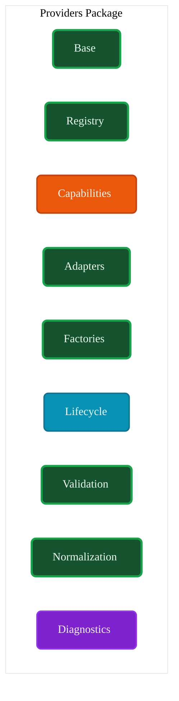
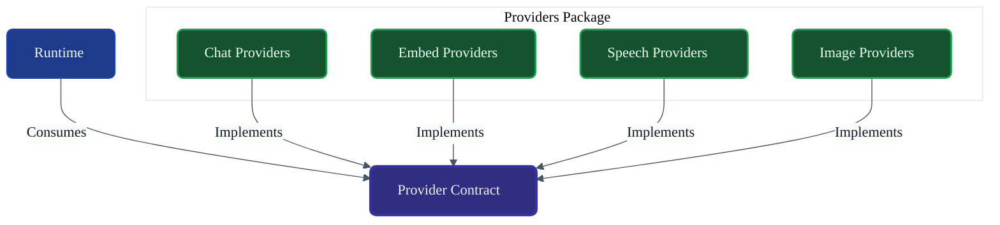
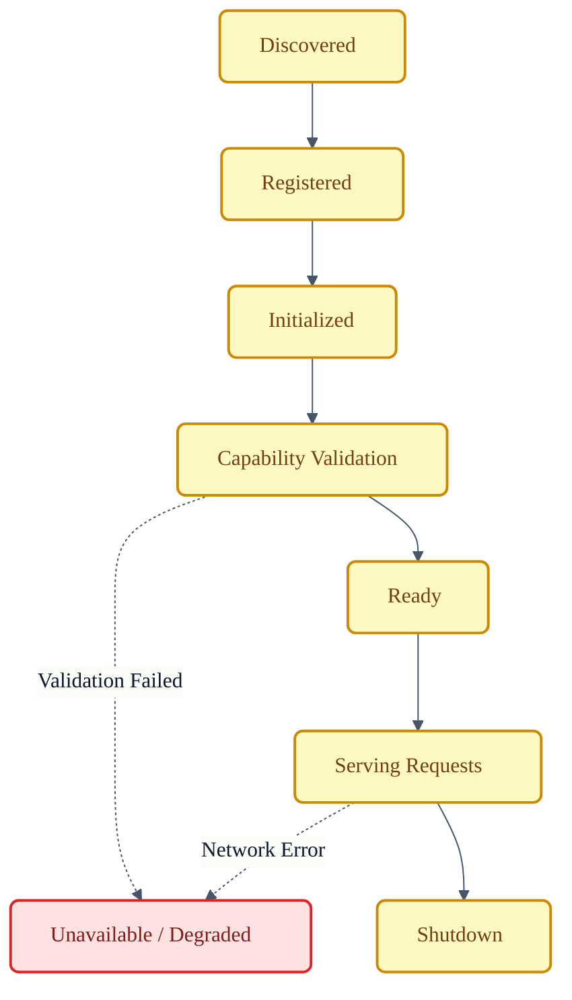
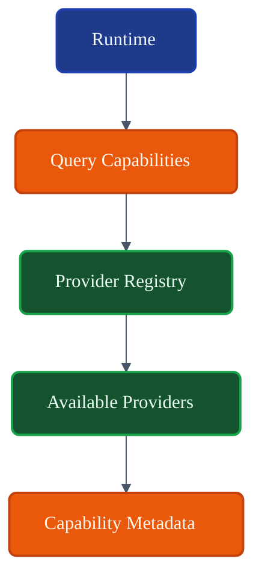
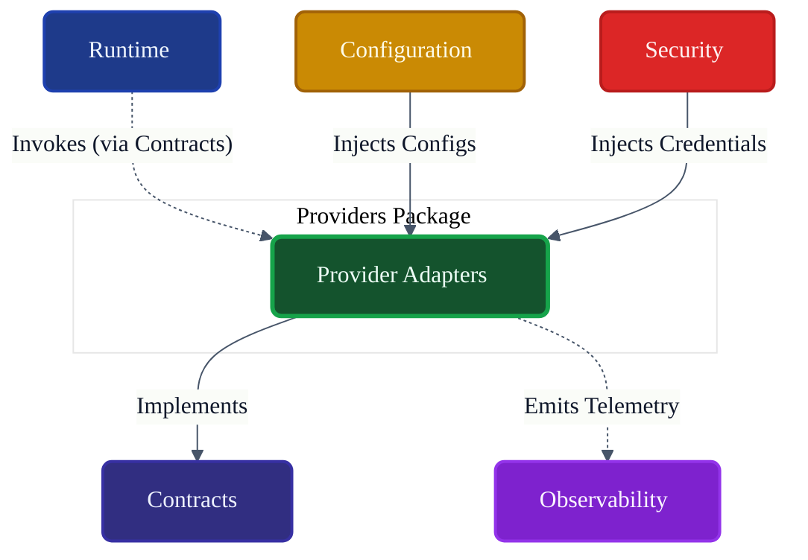

# VoxCore Providers Package

This document defines the internal organization, responsibilities, provider abstraction model, lifecycle integration, capability discovery, provider registration, collaboration model, and extension points of the Providers package.

It answers exactly one engineering question: **"How is the Providers package internally organized to integrate multiple AI providers while preserving provider independence throughout VoxCore?"**

The Providers package is responsible for implementing provider contracts and exposing AI capabilities to the Runtime through stable abstractions. It does not execute runtime orchestration, own runtime lifecycle, perform scheduling, implement transport protocols, expose HTTP endpoints, or perform persistence.

---

## 1. Purpose

The Providers package isolates all vendor-specific integration code (e.g., OpenAI SDKs, AWS Boto3, local model loaders) behind uniform abstractions.

Without a dedicated Providers package:
* **Provider-specific code spreads across the runtime**: The `Runtime Execution Pipeline` requires `if openai else if anthropic` branches to format prompts.
* **Replacing providers becomes difficult**: Swapping models requires a multi-package refactor.
* **Testing becomes harder**: Unit tests require live internet connections because vendor logic cannot be stubbed at a clean boundary.
* **Vendor lock-in increases**: The domain models become polluted with SDK-specific response attributes (like `finish_reason`).
* **Extensibility decreases**: Third-party plugins cannot cleanly introduce a new LLM provider.

The Providers package ensures that VoxCore remains fundamentally vendor-neutral.

---

## 2. Package Philosophy

The physical structure and implementation details of `voxcore/providers` adhere to the following principles:

* **Provider Independence**: The core engine of VoxCore must function identically regardless of whether the provider is remote or local.
* **Stable Contracts**: All providers implement the interfaces defined exclusively in the `Contracts` package.
* **Capability-Based Integration**: Providers are not queried by name (`GetOpenAI`), but by capability (`GetProviderFor(Streaming, Vision)`).
* **Vendor Isolation**: Vendor SDKs (e.g., `openai-python`) must not be imported anywhere outside this package.
* **Extensibility**: Adding a new provider requires adding a module in this package, not modifying the Runtime.
* **Framework Independence**: Provider implementations do not rely on API web frameworks (e.g., FastAPI).
* **Configuration-Driven Behaviour**: Endpoints, keys, and model names are resolved via the `Configuration` package, never hardcoded.
* **Single Responsibility**: Providers execute remote LLM queries and normalize responses. They do not manage conversation state.

---

## 3. Responsibilities

The package enforces a strict boundary between what it owns and what it delegates.

| Responsibility | Description | Owned? |
| :--- | :--- | :--- |
| **Implement provider contracts** | Concrete classes fulfilling `IProvider`. | **Yes** |
| **Advertise capabilities** | Stating supported features (Streaming, Tools, Vision). | **Yes** |
| **Initialize providers** | Setting up SDK clients using Configuration. | **Yes** |
| **Validate availability** | Ping/Health checks to external endpoints. | **Yes** |
| **Execute requests** | Transmitting mapped prompts to external APIs. | **Yes** |
| **Normalize responses** | Converting SDK-specific JSON to VoxCore `Response`. | **Yes** |
| **Report failures** | Translating HTTP 429 to `RateLimitError`. | **Yes** |
| **Expose metadata** | Providing cost and token metrics back to the runtime. | **Yes** |
| **Runtime orchestration** | Deciding *when* to call the provider. | *Delegated* (Runtime) |
| **Scheduling** | Queueing requests if rate limits are hit globally. | *Delegated* (Runtime) |
| **Transport** | Listening for the user's original request. | *Delegated* (API) |
| **Storage** | Persisting the prompt or response. | *Delegated* (Memory) |
| **Business logic** | Choosing *which* provider to use. | *Delegated* (Strategies) |

---

## 4. Internal Package Structure

The `voxcore/providers/` package is logically and physically structured to separate capability registration from SDK implementation.

### `base/`
* **Purpose**: Base classes and internal utilities shared across providers.
* **Responsibilities**: Abstract implementations that simplify contract fulfillment.
* **Collaborators**: `adapters/`.
* **Visibility**: Internal.
* **Dependencies**: `Contracts`.

### `registry/`
* **Purpose**: Internal cataloging of available provider implementations.
* **Responsibilities**: Holding references to loaded factories.
* **Collaborators**: `factories/`, `lifecycle/`.
* **Visibility**: Internal.
* **Dependencies**: None.

### `capabilities/`
* **Purpose**: Structures for defining and comparing provider capabilities.
* **Responsibilities**: Matching requested capabilities against advertised capabilities.
* **Collaborators**: `registry/`.
* **Visibility**: Internal.
* **Dependencies**: `Contracts`.

### `adapters/`
* **Purpose**: The actual vendor SDK implementations.
* **Responsibilities**: E.g., `OpenAIAdapter`, `AnthropicAdapter`.
* **Collaborators**: External network APIs.
* **Visibility**: Internal (Exported via Factories).
* **Dependencies**: Third-party SDKs, `normalization/`.

### `factories/`
* **Purpose**: Instantiation logic for adapters.
* **Responsibilities**: Injecting credentials and configuration into `adapters/`.
* **Collaborators**: `lifecycle/`.
* **Visibility**: Public Boundary.
* **Dependencies**: `adapters/`.

### `lifecycle/`
* **Purpose**: Coordinates the boot and shutdown of internal providers.
* **Responsibilities**: Validating SDK initialization, testing connections.
* **Collaborators**: `factories/`, `registry/`.
* **Visibility**: Public Boundary.
* **Dependencies**: `Contracts`.

### `validation/`
* **Purpose**: Asserts that payloads match provider-specific constraints before execution.
* **Responsibilities**: Enforcing token limits or rejecting unsupported media types early.
* **Collaborators**: `adapters/`.
* **Visibility**: Internal.
* **Dependencies**: None.

### `normalization/`
* **Purpose**: Converts vendor-specific outputs into Domain Contracts.
* **Responsibilities**: Translating `finish_reason: length` to `TruncatedResponseException`.
* **Collaborators**: `adapters/`.
* **Visibility**: Internal.
* **Dependencies**: `Contracts`.

### `diagnostics/`
* **Purpose**: Extracts telemetry from SDK clients.
* **Responsibilities**: Emitting token usage, latency, and HTTP retries.
* **Collaborators**: `adapters/`.
* **Visibility**: Internal.
* **Dependencies**: `Contracts`.

---

## 5. Provider Categories

Providers fall into distinct conceptual categories based on their modality and network topology.

### Chat Providers
* **Purpose**: Execute conversational completion requests.
* **Capabilities**: Streaming, Tool Calling, Multi-turn context.
* **Collaboration**: Invoked by the `Execution Pipeline`.
* **Initiator**: N/A
* **Owner**: N/A
* **Depends On**: N/A
* **Publishes**: N/A
* **Receives**: N/A
---

## 6. Provider Lifecycle

Providers map onto the Runtime State Machines via the following lifecycle stages:

1. **Discovery**: `factories/` are scanned to identify available adapters.
2. **Registration**: Providers are registered in the internal `registry/`.
3. **Initialization**: Credentials and configs are injected. (Managed by `lifecycle/`).
4. **Capability Advertisement**: The initialized provider states its capabilities (e.g., `SupportsStreaming=True`).
5. **Ready**: Network ping succeeds. Provider awaits requests.
6. **Unavailable**: Network partition; provider removed from routing.
7. **Degraded**: High latency or partial failures; provider throttled.
8. **Shutdown**: Graceful draining of active requests.
9. **Disposal**: Sockets and memory (for local models) are released.

---

## 7. Capability Model

The Capability Model is how VoxCore discovers what a provider can do without hardcoding vendor names.

* **Capability advertisement**: A provider returns a `CapabilityManifest` during Initialization.
* **Capability validation**: The `Runtime` queries the `Provider Registry` asking for a provider that satisfies a specific manifest (e.g., "Must support Vision and Tool Use").
* **Capability discovery**: Capabilities are queried dynamically at runtime, not statically compiled.
* **Capability negotiation**: If a provider supports 128k context but the config limits it to 64k, the lowest common denominator is advertised.
* **Capability compatibility**: If a feature is requested (e.g., `Streaming`) that a selected provider does not support, execution fails predictably before network calls are made.
* **Capability versioning**: As new modalities emerge (e.g., Video generation), new capability flags are added to the Contracts, and implemented in the Providers.
* **Capability metadata**: Exposes constraints (e.g., `MaxTokens=8192`, `CostPer1k=0.01`).

---

## 8. Public Package Boundary
* **Purpose**: The core execution wrapper.
* **Inputs**: Domain `Request`.
* **Outputs**: Domain `Response`.
* **Preconditions**: Provider is Ready; Request is Validated.
* **Postconditions**: Network call completes; output normalized.
* **Failure Conditions**: Rate limit, Network timeout, API Error.
* **Side Effects**: N/A
* **Ownership**: N/A
* **Dependencies**: N/A
* **Thread Safety**: N/A
---

## 9. Dependency Rules

To maintain strict provider independence:

* **Providers implement Contracts**: This package must implement `interfaces/IProvider`.
* **Providers shall never depend on Runtime internals**: Providers do not know about the `Execution Pipeline` or `Session Store`.
* **Providers shall never call Scheduler**: They do not manage their own background retry queues; they fail fast and let the Runtime handle retries.
* **Providers shall not access Storage directly**: Providers do not save responses to the database. They return the Response to the Pipeline.
* **Providers shall consume Configuration only through defined contracts**: They read from `IConfiguration`, not from local `.env` files.
* **Providers shall expose only provider abstractions**: A controller cannot request `OpenAIAdapter` by type; it must request `IProvider`.

---

## 10. Collaboration
* **Initiator**: N/A
* **Owner**: N/A
* **Depends On**: N/A
* **Publishes**: N/A
* **Receives**: N/A
---

## 11. Package Invariants

The following invariants must hold true under all conditions:

1. **Every provider implements a provider contract.** (No bespoke adapter patterns).
2. **Provider implementations remain isolated.** (Adapters do not share state).
3. **Runtime never depends on concrete providers.**
4. **Capabilities remain discoverable.** (No hidden capabilities).
5. **Provider metadata remains authoritative.** (The Provider defines its own limits, not the Runtime).
6. **No provider leaks vendor-specific abstractions outside the package.** (A `PydanticValidationError` from an OpenAI SDK must become a `ProviderValidationError` from Contracts).

---

## 12. Failure Behaviour

* **Initialization failure**: If API keys are missing, the provider refuses to transition to `Ready` and removes itself from routing.
* **Capability mismatch**: If forced to execute an unsupported capability, it immediately throws `CapabilityNotSupportedError`.
* **Authentication failure**: `401 Unauthorized` maps to `ProviderAuthError`, triggering an immediate alert.
* **Provider unavailable**: `503 Service Unavailable` maps to `ProviderOfflineError`, allowing the Runtime Strategy to fallback to another provider.
* **Timeout**: Maps to `ProviderTimeoutError`.
* **Rate limiting**: `429 Too Many Requests` maps to `ProviderRateLimitError` (including `Retry-After` headers).
* **Partial capability support**: Handled via Capability Negotiation during Discovery.
* **Recovery boundaries**: The Provider package *does not retry*. It reports failure. The Runtime Strategy handles retries.

---

## 13. Extension Points

The Providers package is designed for infinite horizontal extension:
* **New providers**: Drop in a new folder (e.g., `adapters/ollama/`) fulfilling `IProvider`.
* **New capability categories**: Defined in Contracts, implemented in existing adapters.
* **Diagnostics**: Adding detailed cost-tracking per token type.
* **Future provider families**: Supporting specialized robotic-control foundational models.

---

## 14. Design Constraints

* **Providers shall remain vendor-isolated.** (Do not mix AWS Bedrock code with OpenAI code).
* **Providers shall not contain runtime orchestration.**
* **Providers shall not expose SDK-specific types.** (No returning `openai.ChatCompletion`).
* **Providers shall remain replaceable.**
* **Providers shall not bypass Contracts.**
* **Providers shall remain framework-independent where practical.** (Avoid tying local model execution to specific web servers).

---

## 15. Traceability

| Provider Module | Derived From | Primary Consumer |
| :--- | :--- | :--- |
| `adapters/` | System Architecture (Vendor Isolation) | `factories/` |
| `capabilities/`| Package Architecture | Runtime Pipeline |
| `registry/` | Package Architecture | Runtime Managers |
| `normalization/`| Package Dependency Rules (Anti-corruption) | `adapters/` |
| `diagnostics/` | Observability Architecture | Observability Package |

---

## 16. Conclusion

The Providers package enables VoxCore to support multiple AI providers through stable contracts, capability discovery, and vendor isolation while preserving extensibility and provider independence. By wrapping all vendor-specific SDKs and HTTP semantics in a rigid normalization layer, VoxCore can seamlessly switch from cloud LLMs to local hardware without modifying a single line of Runtime orchestration logic.

---

## Required Tables

### Table 1: Documentation Relationships

| Document | Responsibility |
| :--- | :--- |
| **Package Responsibilities** | Defines Providers package ownership. |
| **Contracts Package** | Defines provider interfaces implemented by this package. |
| **Runtime Package** | Consumes provider contracts. |
| **Configuration Package** | Supplies provider configuration. |
| **Security Package** | Supplies credentials and security policies. |
| **Observability Package** | Collects provider metrics and diagnostics. |
| **Providers Package (This Doc)**| Defines the internal organization of provider integrations. |

### Table 2: Responsibilities Matrix

| Responsibility | Owner | Delegated To |
| :--- | :--- | :--- |
| **Implement external API calls** | Providers Package | N/A |
| **Normalize Vendor JSON** | Providers Package | N/A |
| **Advertise capabilities** | Providers Package | N/A |
| **Fallback & Retry Logic** | N/A | Runtime Strategies |
| **Execution Ordering** | N/A | Runtime Scheduler |

### Table 3: Provider Categories

| Category | Purpose | Capabilities |
| :--- | :--- | :--- |
| **Chat** | Text generation. | Streaming, Tool Calling |
| **Embedding** | Semantic vectors. | Batching, Dimensions |
| **Speech** | Audio IO. | TTS, STT, Diarization |
| **Local** | Hardware execution. | Low Latency, Privacy |
| **Remote** | Cloud APIs. | High Scale, Zero-Hardware |

### Table 4: Capability Matrix

| Capability | Description | Consumer |
| :--- | :--- | :--- |
| **Streaming** | Yields tokens progressively. | Runtime Pipeline |
| **Tool Calling** | Native function calling support. | Runtime Pipeline |
| **Vision** | Accepts image inputs. | Runtime Pipeline |

### Table 5: Dependency Rules

| Rule | Reason |
| :--- | :--- |
| **Must implement Contracts** | Enables Dependency Inversion. |
| **Never return SDK types** | Prevents vendor lock-in bleeding into Runtime. |
| **No cross-provider imports**| Ensures independent extensibility. |

### Table 6: Package Invariants

| Invariant | Reason |
| :--- | :--- |
| **Hidden SDKs** | Prevents the API from crashing if an SDK updates. |
| **Fail Fast** | Providers do not retry; they let the Runtime decide. |
| **Capability Driven** | Prevents hardcoding of vendor names in business logic. |

### Table 7: Traceability Matrix

| Provider Module | Origin | Consumer |
| :--- | :--- | :--- |
| `adapters/` | Provider Integration | Factory |
| `normalization/`| Anti-Corruption Layer | Adapters |
| `capabilities/` | Dynamic Discovery | Runtime |

---

## Required Diagrams

### Diagram 1: Providers Package Structure

### Diagram 2: Provider Integration Model

### Diagram 3: Provider Lifecycle

### Diagram 4: Capability Discovery

### Diagram 5: Package Collaboration

