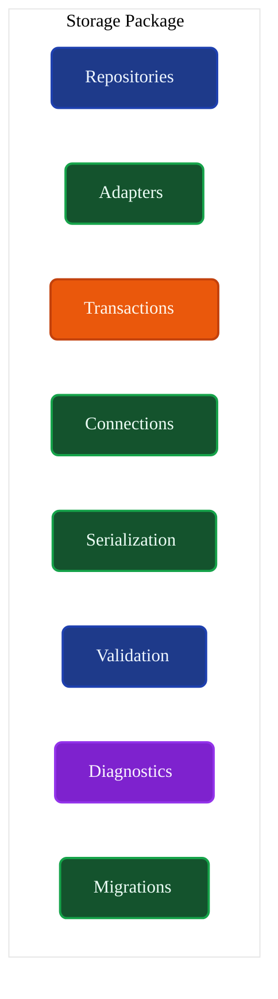
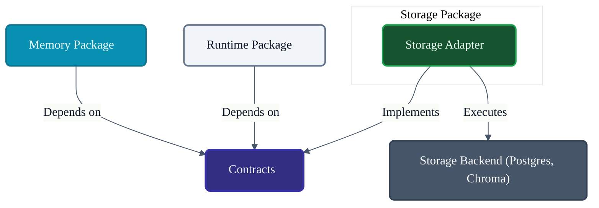
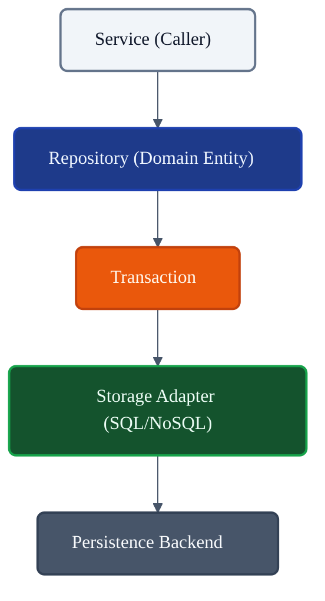
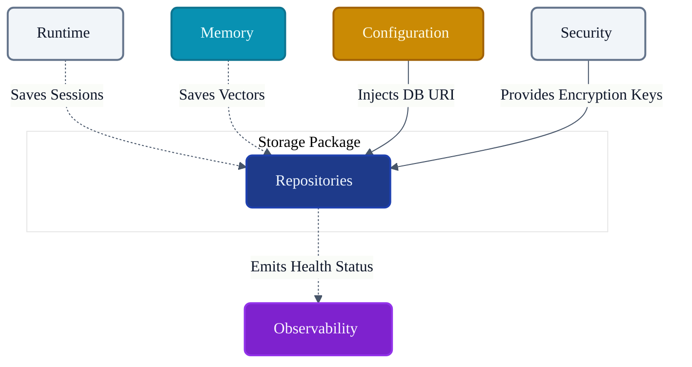

# VoxCore Storage Package

This document defines the internal organization, responsibilities, storage abstraction model, lifecycle expectations, repository organization, persistence boundaries, extension points, and implementation constraints of the Storage package.

It answers exactly one engineering question: **"How is the Storage package internally organized to provide provider-independent persistence services for VoxCore?"**

The Storage package provides persistence capabilities. It is responsible for storing, retrieving, updating, and deleting application data. It does not implement memory algorithms, coordinate runtime execution, implement business logic, execute providers, perform scheduling, or expose transport endpoints.

---

## 1. Purpose

The Storage package isolates persistence infrastructure (e.g., PostgreSQL, SQLite, ChromaDB, S3) behind stable contracts.

Without a dedicated Storage package:
* **Persistence leaks into business logic**: Core runtime services become polluted with SQL queries or ORM models.
* **Storage implementations become tightly coupled**: Swapping from SQLite to PostgreSQL requires rewriting the Memory package.
* **Switching storage technologies becomes difficult**: Migrating vectors from a local file to a cloud vector database disrupts the entire execution pipeline.
* **Testing becomes harder**: Unit tests cannot run without live databases.
* **Repositories become duplicated**: Multiple packages implement their own distinct methods to save session data, leading to state corruption.

The Storage package ensures that the rest of VoxCore remains completely storage-agnostic, interacting only with abstract Repositories.

---

## 2. Package Philosophy

The physical structure and implementation details of `voxcore/storage` adhere to the following principles:

* **Persistence Independence**: The caller (e.g., Memory Manager) does not know where the data is going, only that it is being safely stored.
* **Repository Pattern**: Data access is mediated through Repositories representing Domain Entities, not raw database tables.
* **Storage Provider Isolation**: Vendor-specific database drivers (e.g., `psycopg2`, `chromadb`) are confined to this package.
* **Single Source of Persisted Data**: An entity (like `Session`) is persisted through exactly one Repository.
* **Transaction Consistency**: Multiple storage operations can be grouped into atomic transactions.
* **Framework Independence**: Storage adapters avoid tying into web-framework-specific ORM extensions.
* **Replaceable Backends**: A File-based Storage Adapter can seamlessly replace a Postgres Storage Adapter.
* **Minimal Knowledge**: The Storage package knows *how* to save a vector; it does not know *what* semantic meaning the vector holds.

---

## 3. Responsibilities

The package enforces a strict boundary between persistence capabilities and the business logic that uses them.

| Responsibility | Description | Owned? |
| :--- | :--- | :--- |
| **Implement storage contracts** | Concrete fulfillment of `IMemoryStore`, `ISessionStore`. | **Yes** |
| **Repository implementations** | Mapping domain entities to underlying persistence models. | **Yes** |
| **Transaction coordination** | Ensuring atomicity across multiple repository writes. | **Yes** |
| **Persistence operations** | CRUD (Create, Read, Update, Delete) execution. | **Yes** |
| **Storage initialization** | Bootstrapping connection pools and file handles. | **Yes** |
| **Storage health** | Monitoring connection ping latency and pool saturation. | **Yes** |
| **Storage migrations** | Managing schema evolution conceptually. | **Yes** |
| **Connection management** | Opening/closing active sessions to the database. | **Yes** |
| **Memory reasoning** | Deciding which memories are relevant. | *Delegated* (Memory) |
| **Retrieval algorithms** | MMR, Cosine Similarity tuning. | *Delegated* (Memory) |
| **Runtime lifecycle** | Booting the VoxCore engine. | *Delegated* (Runtime) |
| **Provider logic** | Executing LLM prompt completion. | *Delegated* (Providers) |

---

## 4. Internal Package Structure

The `voxcore/storage/` package is logically and physically structured to separate persistence adapters from repository boundaries.

### `repositories/`
* **Purpose**: Implements the CRUD domain contracts.
* **Responsibilities**: Translates Domain Entities to/from Data Models.
* **Collaborators**: `adapters/`, `transactions/`.
* **Visibility**: Public boundary (via Interfaces).
* **Dependencies**: `Contracts`.

### `adapters/`
* **Purpose**: The physical engine implementations.
* **Responsibilities**: E.g., `PostgresAdapter`, `SQLiteAdapter`, `LocalVectorAdapter`.
* **Collaborators**: External database systems.
* **Visibility**: Internal.
* **Dependencies**: Third-party database SDKs.

### `transactions/`
* **Purpose**: Coordinates atomic operations.
* **Responsibilities**: Unit of Work pattern implementation; commit/rollback logic.
* **Collaborators**: `repositories/`, `adapters/`.
* **Visibility**: Public boundary.
* **Dependencies**: None.

### `migrations/`
* **Purpose**: Manages persistence schemas.
* **Responsibilities**: Tracking versioning of relational or document structures.
* **Collaborators**: `adapters/`.
* **Visibility**: Internal.
* **Dependencies**: None.

### `connections/`
* **Purpose**: Manages network ties to persistent stores.
* **Responsibilities**: Connection pooling, retry logic, connection lifecycle.
* **Collaborators**: `adapters/`.
* **Visibility**: Internal.
* **Dependencies**: None.

### `serialization/`
* **Purpose**: Converts Domain Entities into storable bytes/JSON/Rows.
* **Responsibilities**: Marshalling/Unmarshalling objects safely.
* **Collaborators**: `repositories/`.
* **Visibility**: Internal.
* **Dependencies**: None.

### `validation/`
* **Purpose**: Asserts storage-level constraints.
* **Responsibilities**: Checking foreign keys, uniqueness constraints before insertion.
* **Collaborators**: `repositories/`.
* **Visibility**: Internal.
* **Dependencies**: None.

### `diagnostics/`
* **Purpose**: Extracts telemetry from storage backends.
* **Responsibilities**: Emitting slow-query logs, pool saturation, I/O bottlenecks.
* **Collaborators**: `connections/`, `adapters/`.
* **Visibility**: Internal.
* **Dependencies**: `Contracts` (Events).

---

## 5. Storage Categories

Storage categories define the logical partitions of data required by VoxCore.

### Configuration Storage
* **Purpose**: Persist application state and settings.
* **Owned Data**: API Keys, System Preferences, Plugin Configs.
* **Collaborators**: `Configuration Package`.
* **Persistence Scope**: Global, highly persistent, read-heavy.

### Conversation Storage
* **Purpose**: Persist multi-turn dialogs.
* **Owned Data**: Chat histories, Contextual turns, Timestamps.
* **Collaborators**: `Runtime Stores`.
* **Persistence Scope**: Bound to Session ID, append-heavy.

### Memory Persistence Storage
* **Purpose**: Persist vector embeddings and semantic nodes.
* **Owned Data**: Floats, Metadata payloads, Graph edges.
* **Collaborators**: `Memory Package`.
* **Persistence Scope**: Long-term, dynamic similarity retrieval.

### Metadata Storage
* **Purpose**: Persist system-level operational data.
* **Owned Data**: Usage logs, Execution traces, Billing metrics.
* **Collaborators**: `Observability Package`.
* **Persistence Scope**: Archival, write-heavy.

### File Storage
* **Purpose**: Persist large binary blobs.
* **Owned Data**: Audio outputs, Image uploads, User attachments.
* **Collaborators**: `Runtime Stores`.
* **Persistence Scope**: Bound to URLs/Paths, blob retrieval.

---

## 6. Repository Model

The Repository Model is the conceptual bridge between VoxCore's Domain and the Storage Backend.

* **Repository ownership**: Every distinct Domain Aggregate (e.g., `Session`) has exactly one Repository (e.g., `ISessionRepository`).
* **CRUD responsibilities**: Repositories provide `Save`, `Get`, `List`, `Delete`. They do not provide arbitrary SQL query strings.
* **Aggregation boundaries**: Saving a `Conversation` automatically saves its child `Messages` via the Repository implementation; callers do not manually save child rows.
* **Transaction participation**: Repositories must enlist in an active `Transaction` if provided, allowing cross-repository atomicity.
* **Identity handling**: Repositories enforce UUID generation or primary-key mapping before insertion.
* **Consistency expectations**: The repository guarantees read-after-write consistency to the caller, abstracting eventual-consistency logic if the underlying backend requires it.

---

## 7. Storage Lifecycle

Storage components map to Runtime State Machines via the following lifecycle stages:

1. **Initialization**: Storage configurations parsed, driver loaded.
2. **Connection establishment**: Connection pools open; initial network handshake.
3. **Ready**: Pools are warm. Migrations are verified. Ready for traffic.
4. **Operational**: Actively serving CRUD requests.
5. **Degraded**: Connections dropping, retry thresholds exceeded, or slow I/O reported.
6. **Shutdown**: Graceful draining of pending transactions.
7. **Cleanup**: Pool termination, socket closure, WAL (Write-Ahead Log) flushing.

---

## 8. Public Package Boundary
* **Purpose**: Probe backend stability.
* **Inputs**: None.
* **Outputs**: `HealthStatus`.
* **Preconditions**: None.
* **Postconditions**: Emits latency telemetry.
* **Failure Conditions**: Connection dropped.
* **Side Effects**: N/A
* **Ownership**: N/A
* **Dependencies**: N/A
* **Thread Safety**: N/A
---

## 9. Dependency Rules

To maintain strict storage independence:

* **Storage implements Contracts**: This package must implement `interfaces/IStore`.
* **Storage shall not depend on Runtime internals**: Storage does not know about the `Execution Pipeline`.
* **Storage shall not implement business logic**: Storage does not evaluate whether a User is allowed to delete a Session. That is the Runtime's job.
* **Memory depends on Storage**: The Memory package calls Storage to save vectors. Storage *never* calls Memory.
* **Storage shall not call Providers**: Storage does not generate embeddings; it only saves them.
* **Storage shall remain persistence-focused**: Storage does not route API HTTP responses.

---

## 10. Collaboration
* **Initiator**: N/A
* **Owner**: N/A
* **Depends On**: N/A
* **Publishes**: N/A
* **Receives**: N/A
---

## 11. Package Invariants

The following invariants must hold true under all conditions:

1. **Every persisted object has one repository owner.** (Do not split aggregate saves).
2. **Repositories remain cohesive.** (`SessionRepository` handles sessions, not config keys).
3. **Storage never contains business logic.**
4. **Storage never performs memory reasoning.** (It only executes the vector math requested, it does not analyze the context).
5. **Persistence remains implementation-independent.** (Callers use `ISessionRepository`, not `PostgresSessionRepository`).
6. **No storage implementation leaks outside package boundaries.** (No returning SQLAlchemy objects to the Pipeline).

---

## 12. Failure Behaviour

* **Connection failure**: Managed internally via `connections/` retries. Escalates to `StorageOfflineError`.
* **Transaction failure**: Safely rolls back all pending operations before raising `TransactionFailedError`.
* **Repository failure**: Uniqueness violations raise `ConstraintViolationError`, masking the underlying SQL/DB error string.
* **Data consistency issues**: Optimistic locking raises `ConcurrencyConflictError`, prompting the Runtime to decide whether to retry.
* **Storage unavailable**: Triggers Circuit Breaker; fails fast on subsequent queries.
* **Recovery boundaries**: Storage Package attempts network retries, but hands semantic failure (e.g., "Row not found") back to the caller for resolution.

---

## 13. Extension Points

The Storage package is designed for infrastructural extension:
* **New storage providers**: Adding a `RedisAdapter` for high-speed caching.
* **New repositories**: Adding an `IToolLogRepository` for tracking capability usage.
* **Serialization strategies**: Adding Protobuf serialization alongside JSON.
* **Future storage engines**: Seamless migration from SQLite to PostgreSQL without modifying business code.

---

## 14. Design Constraints

* **Storage shall remain storage-focused.** (No prompt formatting).
* **Storage shall not implement runtime orchestration.**
* **Storage shall not implement provider logic.**
* **Storage shall not implement memory algorithms.** (It stores the nodes; Memory traverses the graph).
* **Storage shall remain technology-independent at the architectural boundary.**

---

## 15. Traceability

| Storage Module | Derived From | Primary Consumer |
| :--- | :--- | :--- |
| `repositories/`| System Architecture | Runtime Stores |
| `adapters/` | Package Architecture | Connections / Migrations |
| `transactions/`| Implementation Stability | Runtime Managers |
| `diagnostics/` | Observability Architecture | Observability Package |

---

## 16. Conclusion

The Storage package provides the persistence infrastructure of VoxCore while remaining isolated from runtime behaviour, memory reasoning, and provider implementations. By enforcing strict repository boundaries and isolating database drivers, VoxCore guarantees that its core engine remains highly portable, easily testable, and completely independent of the underlying persistence technology.

---

## Required Tables

### Table 1: Documentation Relationships

| Document | Responsibility |
| :--- | :--- |
| **Package Responsibilities** | Defines Storage package ownership. |
| **Contracts Package** | Defines storage contracts. |
| **Runtime Package** | Consumes persistence through contracts. |
| **Memory Package** | Uses Storage for persistence. |
| **Configuration Package** | Supplies storage configuration. |
| **Observability Package** | Monitors storage operations. |
| **Storage Package (This Doc)**| Defines persistence implementation organization. |

### Table 2: Responsibilities Matrix

| Responsibility | Owner | Delegated To |
| :--- | :--- | :--- |
| **CRUD Operations** | Storage Package | N/A |
| **Connection Pooling** | Storage Package | N/A |
| **Transaction Boundaries** | Storage Package | N/A |
| **Business Logic** | N/A | Runtime Services |
| **Memory Reasoning** | N/A | Memory Package |

### Table 3: Storage Categories

| Category | Purpose | Stored Data |
| :--- | :--- | :--- |
| **Configuration** | Static settings. | API Keys, Profiles |
| **Conversation** | Chat history. | Text, Metadata |
| **Memory** | Semantic space. | Vectors, Graph Edges |
| **File** | Blobs. | Audio/Image buffers |

### Table 4: Repository Matrix

| Repository | Aggregate | Consumer |
| :--- | :--- | :--- |
| **SessionRepo** | User Session | Runtime Managers |
| **VectorRepo** | Embedding vectors | Memory Package |
| **ConfigRepo** | System Settings | Configuration Package |

### Table 5: Dependency Rules

| Rule | Reason |
| :--- | :--- |
| **Must implement Contracts** | Enables Dependency Inversion. |
| **No Driver Leakage** | Prevents caller coupling to SQLAlchemy/Psycopg2. |
| **No Logic Evaluation** | Storage is a dumb repository. |

### Table 6: Package Invariants

| Invariant | Reason |
| :--- | :--- |
| **Strict Repository Ownership** | Prevents fragmented schema definitions. |
| **Atomic Transactions** | Prevents partial persistence corruption. |
| **Agnostic Boundary** | Callers do not know what backend is active. |

### Table 7: Traceability Matrix

| Storage Module | Origin | Consumer |
| :--- | :--- | :--- |
| `adapters/` | Infrastructure | Connection Pool |
| `repositories/`| Anti-Corruption Layer | Callers (Runtime/Memory) |
| `migrations/` | Lifecycle Stability | Initialization Bootstrapper |

---

## Required Diagrams

### Diagram 1: Storage Package Structure

### Diagram 2: Storage Architecture

### Diagram 3: Repository Model

### Diagram 4: Package Collaboration

