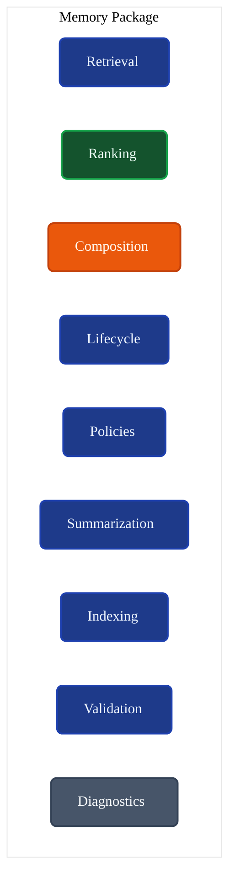
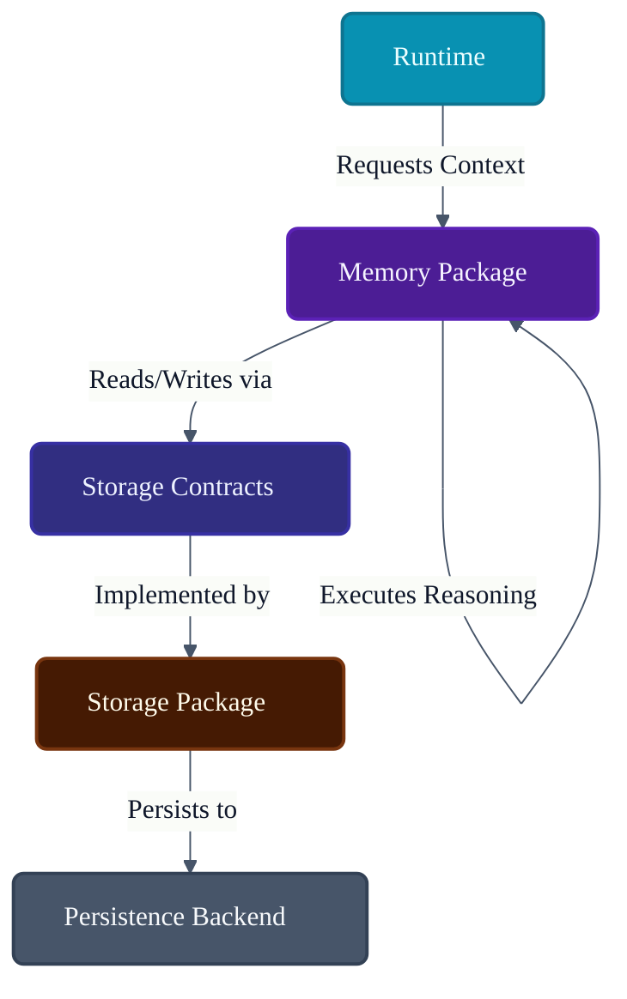
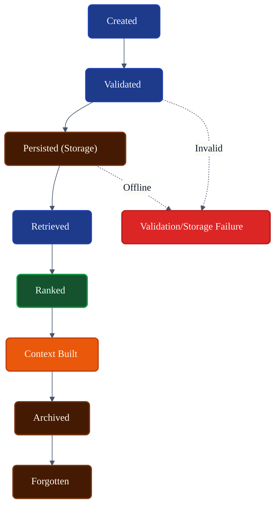
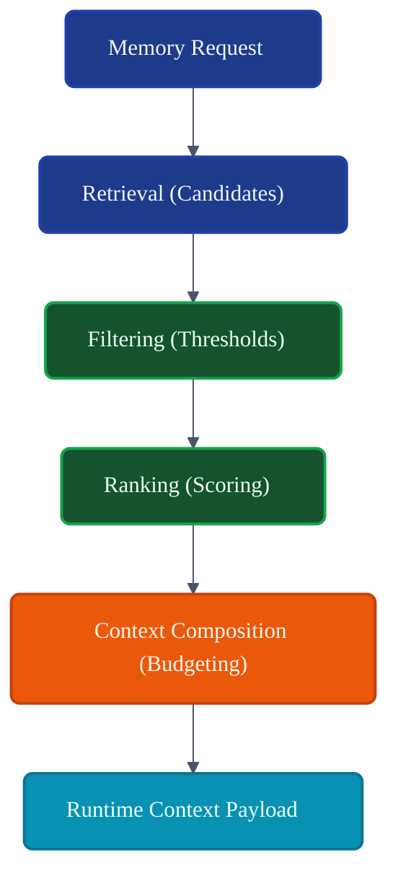
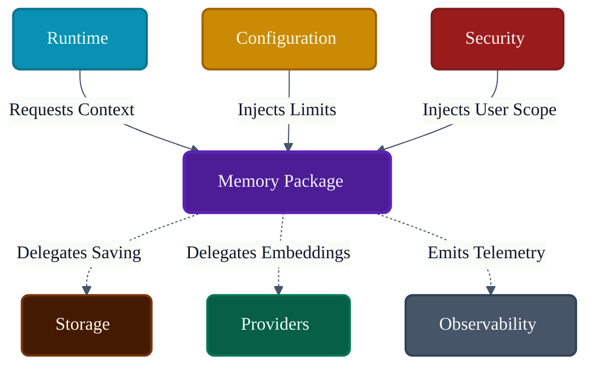

# VoxCore Memory Package

This document defines the internal organization, responsibilities, memory lifecycle, retrieval architecture, memory composition model, collaboration rules, extension points, and implementation constraints of the Memory package.

It answers exactly one engineering question: **"How is the Memory package internally organized to provide intelligent memory capabilities while remaining independent of persistence technologies?"**

The Memory package is responsible for transforming stored information into usable conversational context. It is not responsible for persistence implementation, database management, runtime orchestration, provider implementations, transport protocols, or scheduling.

---

## 1. Purpose

The Memory package transforms persisted information into relevant runtime context while remaining independent of storage technology.

Without a dedicated Memory package:
* **Retrieval logic spreads across services**: The `Execution Pipeline` becomes burdened with hardcoded vector similarity algorithms.
* **Conversation context becomes inconsistent**: Different AI providers receive fragmented or oversized context windows because there is no centralized assembly logic.
* **Memory policies become duplicated**: The rules for "forgetting" obsolete facts must be rewritten for every new persistence engine.
* **Storage becomes tightly coupled to reasoning**: Memory systems break if the underlying vector database is changed from local SQLite/Chroma to a cloud provider.
* **Future memory features become difficult to extend**: Adding hierarchical graph memory becomes impossible without rewriting the entire core engine.

The Memory package isolates the *reasoning* about what to remember and retrieve from the *mechanics* of how it is stored.

---

## 2. Package Philosophy

The physical structure and implementation details of `voxcore/memory` adhere to the following principles:

* **Memory as Knowledge**: Memory is not just data rows; it is semantically significant knowledge required to fulfill the user's intent.
* **Storage Independence**: The package knows *what* it needs to retrieve, but delegates *how* to find it on disk to the Storage package via Contracts.
* **Policy-Based Retrieval**: Deciding which memories are relevant is governed by swappable ranking and filtering policies, not hardcoded conditionals.
* **Context-Centric Design**: The ultimate goal of memory is to assemble a prompt Context that fits within an LLM's token limits while maximizing relevance.
* **Composable Memory**: Short-term, long-term, and semantic memories can be composed together dynamically.
* **Single Responsibility**: This package executes memory lifecycle and retrieval math. It does not execute providers or manage HTTP sessions.
* **Provider Independence**: The memory system does not depend on the OpenAI API for embeddings; it requests embeddings through the Provider abstractions.
* **Deterministic Boundaries**: Memory operations must fail cleanly if context assembly exceeds maximum token thresholds.

---

## 3. Responsibilities

The package enforces a strict boundary between intelligent retrieval and the persistence layer.

| Responsibility | Description | Owned? |
| :--- | :--- | :--- |
| **Memory retrieval** | Requesting semantic matches or historical records. | **Yes** |
| **Context assembly** | Combining retrieved memories into a final prompt payload. | **Yes** |
| **Memory ranking** | Scoring candidate memories for relevance (e.g., Recency vs Similarity).| **Yes** |
| **Memory summarization**| Condensing old conversations into dense summaries. | **Yes** |
| **Memory lifecycle** | Managing creation, validation, archiving, and forgetting. | **Yes** |
| **Forgetting policies** | Deciding when a memory is obsolete. | **Yes** |
| **Memory validation** | Ensuring memories conform to schema before persisting. | **Yes** |
| **Memory diagnostics** | Emitting retrieval latency and context hit-rates. | **Yes** |
| **Persistence** | Writing the actual floats to a vector DB. | *Delegated* (Storage) |
| **Storage engines** | Managing PostgreSQL/ChromaDB. | *Delegated* (Storage) |
| **Embeddings generation**| Converting text to vectors. | *Delegated* (Providers) |
| **Runtime scheduling** | Deciding when a request executes. | *Delegated* (Runtime) |
| **Provider execution** | Sending the assembled context to the LLM. | *Delegated* (Providers) |

---

## 4. Internal Package Structure

The `voxcore/memory/` package is logically and physically structured to separate retrieval policies from context assembly.

### `retrieval/`
* **Purpose**: Fetches raw candidate memories.
* **Responsibilities**: Invoking Storage repositories to fetch vectors or recent conversation turns.
* **Collaborators**: `Storage Contracts`.
* **Visibility**: Public Boundary.
* **Dependencies**: `Contracts`.

### `ranking/`
* **Purpose**: Scores and sorts candidate memories.
* **Responsibilities**: Applying relevance policies (e.g., recency decay, semantic distance scoring).
* **Collaborators**: `retrieval/`, `composition/`.
* **Visibility**: Internal.
* **Dependencies**: None.

### `composition/`
* **Purpose**: Assembles the final context payload.
* **Responsibilities**: Truncating memory lists to fit token budgets; deduplicating facts.
* **Collaborators**: `ranking/`, `summarization/`.
* **Visibility**: Public Boundary.
* **Dependencies**: `Contracts` (Runtime Models).

### `lifecycle/`
* **Purpose**: Manages the state transitions of a memory.
* **Responsibilities**: Triggering creation, archiving, and deletion workflows.
* **Collaborators**: `policies/`, `Storage Contracts`.
* **Visibility**: Internal.
* **Dependencies**: `Contracts`.

### `policies/`
* **Purpose**: Rules engines for memory behaviour.
* **Responsibilities**: E.g., `EvictionPolicy` determines if an unaccessed memory should be forgotten.
* **Collaborators**: `lifecycle/`.
* **Visibility**: Internal.
* **Dependencies**: None.

### `summarization/`
* **Purpose**: Condenses large memory blocks.
* **Responsibilities**: Formatting requests for the LLM to summarize past turns into a dense block.
* **Collaborators**: `Provider Contracts`, `composition/`.
* **Visibility**: Internal.
* **Dependencies**: `Contracts`.

### `indexing/`
* **Purpose**: Prepares new information for storage.
* **Responsibilities**: Chunking text, requesting embeddings from Providers, extracting metadata.
* **Collaborators**: `Provider Contracts`, `Storage Contracts`.
* **Visibility**: Internal.
* **Dependencies**: `Contracts`.

### `validation/`
* **Purpose**: Ensures memory integrity.
* **Responsibilities**: Verifying token limits and metadata structures before indexing.
* **Collaborators**: `indexing/`.
* **Visibility**: Internal.
* **Dependencies**: None.

### `diagnostics/`
* **Purpose**: Emits telemetry regarding memory performance.
* **Responsibilities**: Logging context size, retrieval latency, and cache hits.
* **Collaborators**: `Event Contracts`.
* **Visibility**: Internal.
* **Dependencies**: `Contracts`.

---

## 5. Memory Categories

VoxCore reasons about different types of memory. The Memory package manages the policies for these distinct categories.

### Conversation Memory
* **Purpose**: Immediate chat history.
* **Lifetime**: Tied to the active session.
* **Usage**: Injected directly into the prompt to provide immediate context.
* **Owner**: Memory Package (policies), Storage Package (persistence).
* **Consumers**: Context Assembly.

### Session Memory
* **Purpose**: Ephemeral state for the current interaction.
* **Lifetime**: Expires when the session ends.
* **Usage**: Storing current UI state or intermediate tool results.
* **Owner**: Memory Package.
* **Consumers**: Runtime Services.

### Long-Term Memory
* **Purpose**: Persistent facts about the user or domain.
* **Lifetime**: Indefinite, until explicitly forgotten or evicted by policy.
* **Usage**: Background context retrieval.
* **Owner**: Memory Package.
* **Consumers**: Context Assembly.

### Working Memory
* **Purpose**: High-priority scratchpad for the current reasoning chain.
* **Lifetime**: Highly transient (per-request or per-task).
* **Usage**: Holding the intermediate steps of an agentic workflow.
* **Owner**: Memory Package.
* **Consumers**: Context Assembly.

### Knowledge Memory
* **Purpose**: Static, read-only domain documentation (RAG).
* **Lifetime**: Immutable, tied to the knowledge base release.
* **Usage**: Grounding the LLM in factual, external data.
* **Owner**: External integrations (wrapped by Memory package).
* **Consumers**: Context Assembly.

### Semantic Memory
* **Purpose**: Vector-based conceptual associations.
* **Lifetime**: Dynamic, continuously updated.
* **Usage**: Similarity search to find conceptually related past conversations.
* **Owner**: Memory Package.
* **Consumers**: Context Assembly.

---

## 6. Memory Lifecycle

The lifecycle of a single Memory unit represents how intelligence transitions from raw data to actionable context.

1. **Created**: Information is parsed from a prompt or tool result.
2. **Validated**: Memory schemas and chunk sizes are checked (`validation/`).
3. **Persisted**: Memory is handed off to `Storage Contracts` to be saved to disk.
4. **Retrieved**: Memory is fetched by `retrieval/` based on a new prompt.
5. **Ranked**: Scored for relevance by `ranking/`.
6. **Composed**: Injected into the final `RuntimeContext` by `composition/`.
7. **Archived**: Memory is summarized and moved to cold storage (delegated to Storage).
8. **Forgotten**: Memory is permanently purged based on an `EvictionPolicy`.

The Memory package orchestrates this flow, but relies on the Storage package to fulfill steps 3, 7, and 8.

---

## 7. Retrieval Model

The retrieval model governs how the Memory package discovers relevant context without dictating specific database algorithms.

* **Retrieval Requests**: The caller asks for "memories relevant to 'apples'".
* **Retrieval Policies**: The package decides whether to use Semantic Search, Keyword Search, or Time-based lookup.
* **Candidate Discovery**: The Memory package queries the Storage package via Contracts, retrieving 100 possible matches.
* **Relevance Evaluation**: The `ranking/` module scores the 100 matches.
* **Ranking**: Matches are sorted descending by score (combining cosine similarity score from Storage with recency bias from Memory).
* **Filtering**: Memories failing threshold checks (e.g., score < 0.7) are discarded.
* **Context Composition**: The top 5 remaining memories are passed to context assembly.

*(Note: The Memory package does not implement the HNSW vector math; it merely processes the results returned by the Storage adapter).*

---

## 8. Context Assembly

Context Assembly is the process of fitting retrieved memories into the rigid token limits of an LLM.

* **Context Aggregation**: Combining Conversation Memory (recent turns), Semantic Memory (retrieved facts), and Working Memory (scratchpad).
* **Context Ordering**: Ensuring system prompts appear first, followed by retrieved facts, followed by recent conversation, to optimize LLM attention mechanisms.
* **Duplication Handling**: Deduplicating facts if Semantic Memory retrieves something already present in Working Memory.
* **Size Constraints**: Strictly enforcing token budgets (e.g., dropping the oldest semantic memories if the prompt exceeds 8192 tokens).
* **Prioritization**: Working Memory takes precedence over Semantic Memory during truncation.
* **Metadata Preservation**: Ensuring source citations (e.g., "From Document A") remain attached to the assembled text.

---

## 9. Public Package Boundary
* **Purpose**: Health check.
* **Inputs**: None.
* **Outputs**: Memory utilization metrics.
* **Preconditions**: None.
* **Postconditions**: Emits diagnostics.
* **Failure Conditions**: None.
* **Side Effects**: N/A
* **Ownership**: N/A
* **Dependencies**: N/A
* **Thread Safety**: N/A
---

## 10. Dependency Rules

To maintain strict storage and provider independence:

* **Memory depends on Contracts**: Memory implements `IMemoryService` and uses `IStore`.
* **Memory depends on Storage abstractions**: It uses `IStore`, never `PostgresAdapter`.
* **Memory never depends on storage implementations**: The `Memory` package must not import `voxcore/storage/adapters/`.
* **Memory never calls provider SDKs**: It requests summaries via `IProvider`, never via `openai.ChatCompletion`.
* **Memory never performs persistence directly**: It does not open files or SQL connections.
* **Memory remains storage-independent**: The package must compile and test even if the entire Storage package is mocked.

---

## 11. Collaboration
* **Initiator**: N/A
* **Owner**: N/A
* **Depends On**: N/A
* **Publishes**: N/A
* **Receives**: N/A
---

## 12. Package Invariants

The following invariants must hold true under all conditions:

1. **Memory never owns persistence.**
2. **Memory never exposes storage implementations.** (Never return a database Row; always return a `MemoryNode` struct).
3. **Every memory operation follows a defined lifecycle.** (Validation cannot be bypassed).
4. **Context assembly is deterministic for identical inputs where practical.** (If given the exact same retrieved memories and token budget, it must assemble the exact same context string).
5. **Memory policies remain replaceable.** (Ranking algorithms can be swapped via Configuration).
6. **Memory remains provider-independent.** (It does not care if OpenAI or local hardware generates the summary).

---

## 13. Failure Behaviour

* **Retrieval failure**: If Storage times out, Memory catches the error, emits a warning, and returns an empty list, allowing the Runtime to proceed with limited context rather than crashing.
* **Missing memory**: Handled gracefully; an empty result is a valid state.
* **Storage unavailable**: Triggers Circuit Breaker; falls back to immediate Conversation Memory only.
* **Ranking failure**: If scoring math panics (e.g., NaN vectors), the invalid candidate is dropped from the list.
* **Context assembly failure**: If the budget is too small to even fit the System Prompt, an explicit `ContextBudgetExceededError` is thrown back to the Runtime.
* **Policy failure**: If a forgetting policy throws, the memory is preserved (fail-safe to retain data).

---

## 14. Extension Points

The Memory package is designed for intelligent extensibility:
* **New memory categories**: Adding `EpisodicMemory` for specific user event tracking.
* **New retrieval policies**: Implementing a `HyDE` (Hypothetical Document Embeddings) retrieval strategy in `retrieval/`.
* **New ranking policies**: Injecting a cross-encoder ranking policy into `ranking/` to rerank semantic matches.
* **New summarization strategies**: Adding hierarchical summarization for massive document ingestion.

---

## 15. Design Constraints

* **Memory shall not implement persistence.**
* **Memory shall not implement vector databases.**
* **Memory shall not own runtime orchestration.** (It does not execute the user's prompt, it only prepares the context for it).
* **Memory shall remain provider-independent.**
* **Memory shall not expose storage technologies.**
* **Memory shall remain cohesive.** (Do not mix session authentication tokens into semantic memory nodes).

---

## 16. Traceability

| Memory Module | Derived From | Primary Consumer |
| :--- | :--- | :--- |
| `retrieval/` | System Architecture (RAG) | `composition/` |
| `ranking/` | Memory Intelligence Req. | `composition/` |
| `composition/`| Runtime Pipeline LLD | Runtime Package |
| `lifecycle/` | State Machine LLD | Memory APIs |
| `policies/` | Extensibility Guidelines | `ranking/`, `lifecycle/` |

---

## 17. Conclusion

The Memory package provides VoxCore's intelligent memory capabilities while remaining completely independent of persistence technologies. It transforms stored knowledge into relevant runtime context through well-defined retrieval, ranking, and composition responsibilities. By isolating reasoning (Memory) from infrastructure (Storage), VoxCore ensures that its intelligence layer can evolve with advanced AI research without being dragged down by database migrations.

---

## Required Tables

### Table 1: Documentation Relationships

| Document | Responsibility |
| :--- | :--- |
| **Package Responsibilities** | Defines Memory package ownership. |
| **Contracts Package** | Defines memory contracts. |
| **Storage Package** | Persists memory data. |
| **Runtime Package** | Requests memory capabilities. |
| **Providers Package** | Consumes assembled context. |
| **Memory Package (This Doc)**| Defines internal organization of the memory subsystem. |

### Table 2: Responsibilities Matrix

| Responsibility | Owner | Delegated To |
| :--- | :--- | :--- |
| **Retrieval Intelligence** | Memory Package | N/A |
| **Context Assembly** | Memory Package | N/A |
| **Ranking/Scoring** | Memory Package | N/A |
| **Persistence I/O** | N/A | Storage Package |
| **Embeddings Generation** | N/A | Providers Package |

### Table 3: Memory Categories

| Category | Purpose | Lifetime | Consumer |
| :--- | :--- | :--- | :--- |
| **Conversation** | Chat history | Session-bound | Context Assembly |
| **Working** | Agent scratchpad | Task-bound | Context Assembly |
| **Semantic** | Vector knowledge | Persistent | Context Assembly |
| **Knowledge** | Static RAG docs | Immutable | Context Assembly |

### Table 4: Retrieval Responsibilities

| Stage | Responsibility | Owner |
| :--- | :--- | :--- |
| **Query Formulation** | Defining search parameters. | Memory Package (`retrieval/`) |
| **Vector Similarity** | Finding mathematical neighbors. | Storage Package |
| **Scoring / Ranking** | Applying relevance heuristics. | Memory Package (`ranking/`) |
| **Budget Enforcement** | Truncating to fit LLM limits. | Memory Package (`composition/`) |

### Table 5: Dependency Rules

| Rule | Reason |
| :--- | :--- |
| **Storage Independence** | Memory must not depend on `voxcore/storage/adapters/`. |
| **Provider Independence** | Memory requests embeddings via `IProvider`. |
| **Acyclic Context** | Memory must not invoke the Runtime Pipeline recursively. |

### Table 6: Package Invariants

| Invariant | Reason |
| :--- | :--- |
| **Pure Reasoning** | Memory calculates context; it does not write to disk directly. |
| **Fail-Safe Retrieval** | Missing storage data yields empty lists, not system panics. |
| **Deterministic Truncation** | Token budgets are enforced mathematically. |

### Table 7: Traceability Matrix

| Memory Module | Origin | Consumer |
| :--- | :--- | :--- |
| `retrieval/` | RAG Architecture | `composition/` |
| `composition/`| Prompt Engineering limits | Runtime Pipeline |
| `summarization/`| Context Compression reqs | `lifecycle/` |

---

## Required Diagrams

### Diagram 1: Memory Package Structure

### Diagram 2: Memory Architecture

### Diagram 3: Memory Lifecycle

### Diagram 4: Context Assembly Flow

### Diagram 5: Package Collaboration

