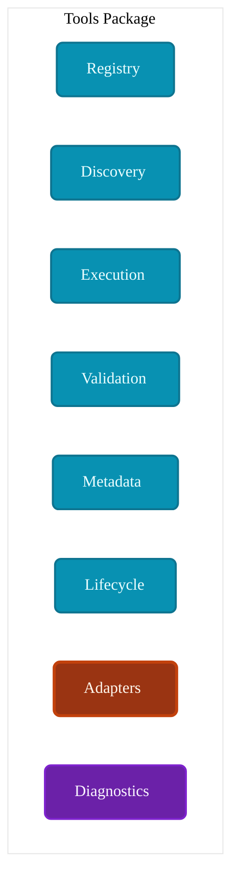
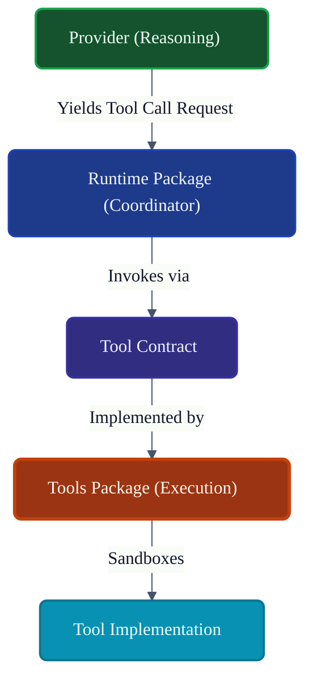
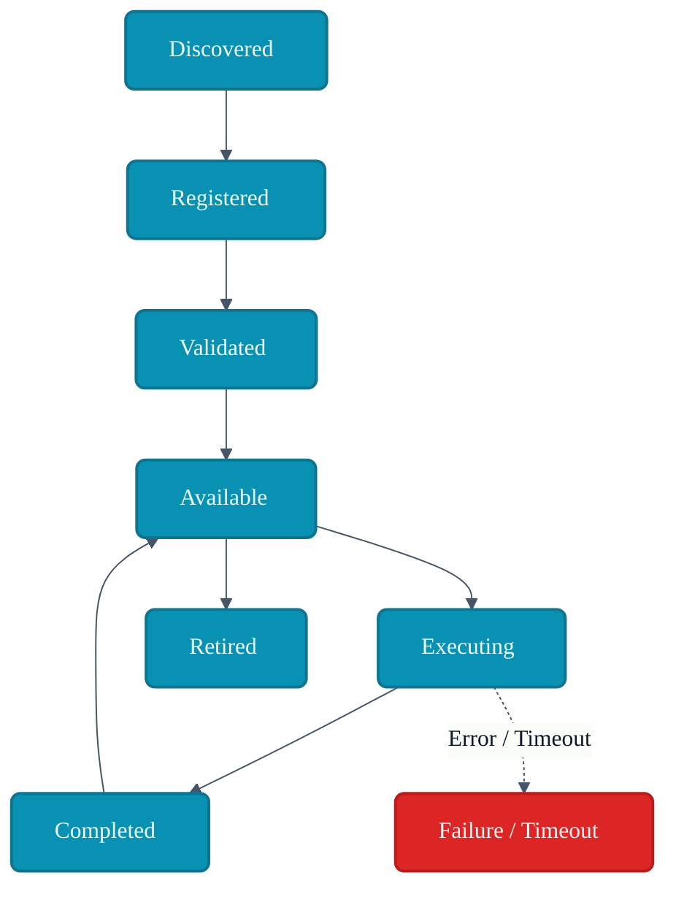
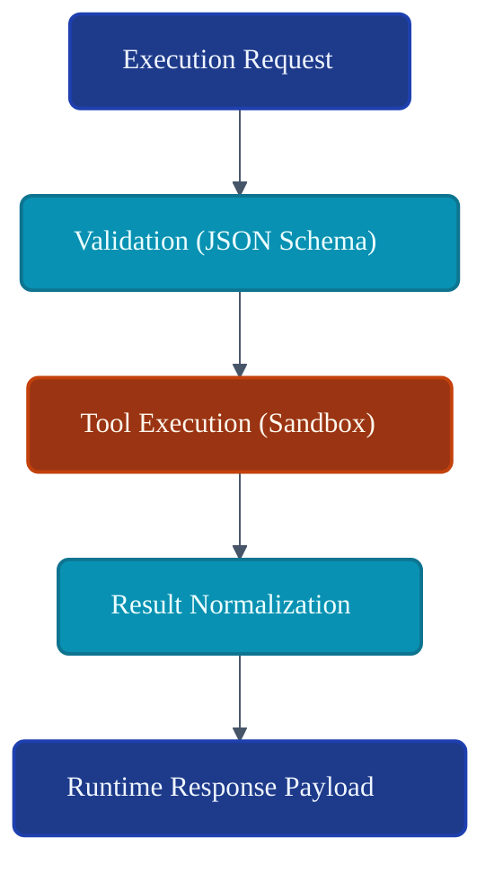
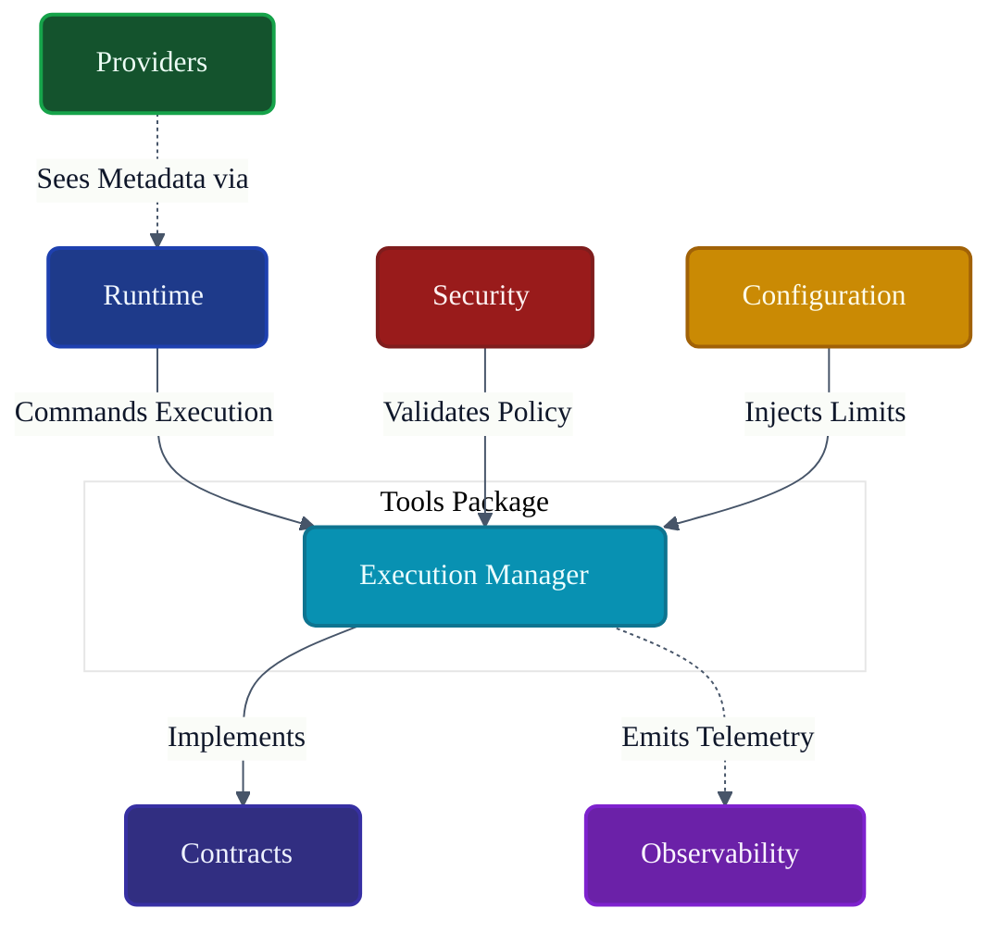

# VoxCore Tools Package

This document defines the internal organization, responsibilities, tool lifecycle, tool discovery, execution model, validation model, collaboration rules, extension points, and implementation constraints of the Tools package.

It answers exactly one engineering question: **"How is the Tools package internally organized to provide a secure, extensible, and provider-independent tool execution framework for VoxCore?"**

The Tools package provides runtime access to executable tools through stable abstractions. It is responsible for tool registration, tool discovery, tool validation, tool execution, tool metadata, tool lifecycle, and execution result normalization. It is not responsible for runtime orchestration, provider implementations, scheduling, transport, persistence, or conversation memory.

---

## 1. Purpose

The Tools package isolates executable capabilities behind stable contracts, preventing the runtime from being coupled to specific external integrations.

Without a dedicated Tools package:
* **Tool implementations spread across the runtime**: API clients, file system operators, and calculators get scattered into the Memory or Providers packages.
* **Providers become tightly coupled to actions**: The OpenAI provider executes a python script directly, breaking provider independence.
* **Permissions become inconsistent**: Without a centralized execution funnel, security boundaries are bypassed.
* **Discovery becomes difficult**: The LLM cannot query a dynamic list of available functions.
* **Extensibility decreases**: Third-party developers cannot safely inject new capabilities.

The Tools package ensures that all actions executed on behalf of the AI follow a strict, deterministic, and secure lifecycle governed by the Runtime.

---

## 2. Package Philosophy

The physical structure and implementation details of `voxcore/tools` adhere to the following principles:

* **Tool Independence**: Tools perform single, cohesive actions (e.g., `FetchWeather`). They do not implement AI logic.
* **Capability-Based Execution**: Tools are discovered and executed by their abstract capability definitions, not tied to a specific framework.
* **Registration Before Execution**: No tool can be executed unless it has been formally discovered, validated, and registered.
* **Provider Independence**: A tool must execute identically regardless of whether the request originated from OpenAI, a Local LLM, or a manual HTTP endpoint.
* **Explicit Metadata**: Every tool must provide strict parameter schemas (JSON Schema/OpenAPI) enabling the LLM to understand its constraints.
* **Security First**: Execution requires explicit validation against security policies.
* **Framework Independence**: Tool execution does not depend on a specific web server or orchestration framework.
* **Replaceable Implementations**: A `SearchTool` implementation can be swapped from Google to Bing without altering the rest of the runtime.

---

## 3. Responsibilities

The package enforces a strict boundary between action execution and runtime orchestration.

| Responsibility | Description | Owned? |
| :--- | :--- | :--- |
| **Implement tool contracts** | Providing concrete structures for `ITool`. | **Yes** |
| **Register tools** | Maintaining a catalog of available actions. | **Yes** |
| **Discover tools** | Parsing plugins/directories to find tool definitions. | **Yes** |
| **Validate execution** | Ensuring arguments match the tool's schema. | **Yes** |
| **Execute tools** | Invoking the actual python function or HTTP call. | **Yes** |
| **Normalize results** | Formatting raw tool outputs into Domain Responses. | **Yes** |
| **Expose metadata** | Providing JSON schemas for the Provider package. | **Yes** |
| **Manage tool lifecycle** | Tracking tool availability and deprecation. | **Yes** |
| **Runtime orchestration** | Deciding *when* a tool should be run. | *Delegated* (Runtime) |
| **Provider reasoning** | Generating the tool-call arguments. | *Delegated* (Providers) |
| **Persistence** | Storing tool execution logs. | *Delegated* (Storage) |
| **Scheduling** | Queueing slow tools. | *Delegated* (Runtime) |
| **Security policy decisions** | Deciding if a specific user is authorized. | *Delegated* (Security) |

---

## 4. Internal Package Structure

The `voxcore/tools/` package is logically and physically structured to separate tool discovery from execution.

### `registry/`
* **Purpose**: Central catalog of available tools.
* **Responsibilities**: Holding references to registered capabilities and resolving them by name.
* **Collaborators**: `discovery/`, `metadata/`.
* **Visibility**: Public Boundary.
* **Dependencies**: None.

### `discovery/`
* **Purpose**: Identifies new tools.
* **Responsibilities**: Scanning directories or plugin manifests to load tool descriptors.
* **Collaborators**: `registry/`, `lifecycle/`.
* **Visibility**: Internal.
* **Dependencies**: None.

### `execution/`
* **Purpose**: The runtime sandbox for tool invocation.
* **Responsibilities**: Wrapping tool callbacks, enforcing timeouts, capturing exceptions.
* **Collaborators**: `adapters/`, `validation/`.
* **Visibility**: Public Boundary.
* **Dependencies**: `Contracts`.

### `validation/`
* **Purpose**: Asserts argument correctness.
* **Responsibilities**: Checking runtime arguments against the tool's JSON Schema before invocation.
* **Collaborators**: `execution/`.
* **Visibility**: Internal.
* **Dependencies**: None.

### `metadata/`
* **Purpose**: Describes tool capabilities to the outside world.
* **Responsibilities**: Generating provider-agnostic schemas describing inputs/outputs.
* **Collaborators**: `registry/`.
* **Visibility**: Internal.
* **Dependencies**: None.

### `lifecycle/`
* **Purpose**: Manages the state of registered tools.
* **Responsibilities**: Enabling, disabling, or retiring tools.
* **Collaborators**: `registry/`.
* **Visibility**: Internal.
* **Dependencies**: None.

### `adapters/`
* **Purpose**: Concrete implementations of built-in tools.
* **Responsibilities**: E.g., `FileSystemAdapter`, `HttpClientAdapter`.
* **Collaborators**: `execution/`.
* **Visibility**: Internal.
* **Dependencies**: Standard libraries.

### `diagnostics/`
* **Purpose**: Telemetry for execution.
* **Responsibilities**: Emitting execution latency, failure rates, and argument sizes.
* **Collaborators**: `execution/`.
* **Visibility**: Internal.
* **Dependencies**: `Contracts` (Events).

---

## 5. Tool Categories

Tools are grouped by the nature of the action they perform, influencing their security and execution profile.

### System Tools
* **Purpose**: Interact with the host operating system.
* **Execution Scope**: Shell commands, process management.
* **Consumers**: Core Automation Agents.
* **Security Considerations**: High risk; requires strict sandboxing.

### File Tools
* **Purpose**: Read/Write to disk.
* **Execution Scope**: Specific allowed directories.
* **Consumers**: Document analysis, code generation.
* **Security Considerations**: Path traversal mitigation required.

### Network Tools
* **Purpose**: Make HTTP requests or socket connections.
* **Execution Scope**: Outbound REST/GraphQL APIs.
* **Consumers**: Web search, external integrations.
* **Security Considerations**: SSRF (Server-Side Request Forgery) protection.

### Data Processing Tools
* **Purpose**: Mathematical or data transformations.
* **Execution Scope**: Memory-bound compute (e.g., Pandas operations).
* **Consumers**: Data analysis agents.
* **Security Considerations**: CPU/Memory exhaustion limits (Timeouts).

### Integration Tools
* **Purpose**: Connect to specific SaaS platforms.
* **Execution Scope**: API operations (e.g., Jira, Slack).
* **Consumers**: Enterprise workflows.
* **Security Considerations**: Credential injection handled securely.

### Utility Tools
* **Purpose**: Simple functional helpers.
* **Execution Scope**: Timers, calculators, string formatters.
* **Consumers**: All agents.
* **Security Considerations**: Low risk.

---

## 6. Tool Lifecycle

Tools transition through a strict lifecycle mapped to the Runtime State Machines.

1. **Discovery**: The `discovery/` module locates the tool manifest.
2. **Registration**: The tool is mounted into the `registry/`.
3. **Validation**: The tool's JSON schema is validated for structural integrity.
4. **Available**: The tool is ready to be executed.
5. **Execution Requested**: Runtime asks to run the tool.
6. **Executing**: The `execution/` module invokes the payload.
7. **Completed**: The result is normalized and returned (or failed).
8. **Retired**: The tool is disabled (e.g., plugin unloaded).

---

## 7. Discovery & Registration Model

* **Tool Discovery**: Tools can be discovered statically (hardcoded built-ins) or dynamically (loaded from a Plugin directory).
* **Registration**: Tools are registered via an explicit interface (`IRegistry.Register(ITool)`).
* **Metadata Publication**: Upon registration, the tool publishes its parameter schema (e.g., `{ "type": "object", "properties": { "query": { "type": "string" } } }`).
* **Uniqueness**: Tools must register with a globally unique identifier (e.g., `system.file.read`).
* **Version Compatibility**: Tools may expose version metadata, but the registry resolves by the active configured version.

---

## 8. Execution Model

The Execution Model guarantees that tools cannot crash the runtime.

1. **Execution Request**: The Runtime provides a Tool ID and a JSON payload of arguments.
2. **Validation**: `validation/` compares the JSON payload against the tool's registered schema. (Fails fast if invalid).
3. **Execution**: The `execution/` module invokes the underlying function within an isolation boundary.
4. **Result Normalization**: Raw strings, JSON objects, or error stack traces are wrapped in a standard `ToolExecutionResult`.
5. **Response Delivery**: The result is handed back to the Runtime to be evaluated by the LLM Provider.

**Constraints**:
* **Timeout Handling**: Every execution must have an upper time bound.
* **Cancellation**: Tools must respect cancellation tokens passed by the Runtime.
* **Isolation**: Panics within a tool must be caught and converted to failed execution results.
* **Result Ownership**: The tool execution result is owned by the Runtime, to be stored or passed to the Provider.

---

## 9. Public Package Boundary
* **Purpose**: Fetches the JSON schema for Provider injection.
* **Inputs**: Tool ID.
* **Outputs**: `ToolMetadata`.
* **Preconditions**: Tool exists.
* **Postconditions**: None.
* **Failure Conditions**: ID not found.
* **Side Effects**: N/A
* **Ownership**: N/A
* **Dependencies**: N/A
* **Thread Safety**: N/A
---

## 10. Dependency Rules

To maintain strict execution independence:

* **Tools implement Contracts**: Tools implement `ITool` and expose data via `Contracts`.
* **Tools shall never invoke Providers**: A tool does not call OpenAI to summarize its output; that is the Runtime's job.
* **Providers shall never execute Tools directly**: The OpenAI adapter must yield a `ToolCallRequest` to the Runtime; it cannot invoke `tool.execute()`.
* **Runtime coordinates all execution**: The Runtime Pipeline calls `Execute Tool`.
* **Tools shall not own runtime lifecycle**: Tools cannot shut down the VoxCore kernel.
* **Tools shall remain provider-independent**: The tool does not know if OpenAI or Gemini requested its execution.

---

## 11. Collaboration
* **Initiator**: N/A
* **Owner**: N/A
* **Depends On**: N/A
* **Publishes**: N/A
* **Receives**: N/A
---

## 12. Package Invariants

The following invariants must hold true under all conditions:

1. **Every tool has one registration owner.** (No duplicate IDs).
2. **Every execution follows the defined lifecycle.** (You cannot bypass Validation).
3. **Tool metadata is authoritative.** (The tool schema defines what the Provider sees).
4. **Execution remains isolated.** (A crashed tool must not crash the VoxCore kernel).
5. **Providers never directly invoke tools.** (Strict broker pattern enforced by the Runtime).
6. **Tool implementations remain replaceable.** (A `ReadWebpage` tool can be swapped from `requests` to `Playwright` without API changes).

---

## 13. Failure Behaviour

* **Registration failure**: If a plugin attempts to load a malformed tool, it is rejected and logged; the system boots without it.
* **Validation failure**: If the LLM hallucinates an argument, the Validation module fails immediately, returning a formatting error to the LLM.
* **Execution failure**: Handled safely. Exceptions are serialized into a `ToolExecutionResult` indicating failure, allowing the LLM to understand what went wrong and retry.
* **Permission denied**: Security rejects the invocation. Returns a clean authorization error.
* **Timeout**: Execution module aborts the thread/process and returns a timeout error.
* **Cancellation**: Follows the same path as timeout, yielding control back to the Runtime.
* **Recovery boundaries**: Tools do not retry themselves. The Runtime Strategy determines if a failed tool call should be retried.

---

## 14. Extension Points

The Tools package is designed for massive horizontal extension:
* **New tool categories**: Developers can inject custom plugins (e.g., `KubernetesTools`).
* **Execution policies**: Adding Docker/WASM sandboxing around Python execution.
* **Validation policies**: Adding custom validation constraints beyond standard JSON Schema.
* **Metadata extensions**: Expanding schemas to support specialized Provider UI rendering hints.

---

## 15. Design Constraints

* **Tools shall remain provider-independent.**
* **Tools shall not coordinate runtime execution.** (A tool cannot invoke another tool recursively; it must yield a request back to the Runtime).
* **Tools shall not implement scheduling.** (It executes immediately when asked).
* **Tools shall not expose runtime internals.**
* **Tools shall remain cohesive.** (A single tool does one thing well).
* **No concrete implementation shall leak outside package boundaries.** (Callers interact with `ITool`, never `BashCommandTool`).

---

## 16. Traceability

| Tool Module | Derived From | Primary Consumer |
| :--- | :--- | :--- |
| `registry/` | Package Architecture | Runtime Pipeline |
| `metadata/` | Provider Integration Req. | Providers Package (via Runtime) |
| `execution/` | System Security/Isolation | Runtime Pipeline |
| `validation/` | Robustness Guidelines | `execution/` |
| `adapters/` | Extensibility Req. | `registry/` |

---

## 17. Conclusion

The Tools package provides a secure, extensible, and provider-independent framework for executable capabilities. By enforcing a strict architectural separation between Providers (which decide *what* to do), the Runtime (which decides *when* to do it), and Tools (which decide *how* to do it), VoxCore ensures that executing actions remains safe, deterministic, and infinitely extensible.

---

## Required Tables

### Table 1: Documentation Relationships

| Document | Responsibility |
| :--- | :--- |
| **Package Responsibilities** | Defines Tools package ownership. |
| **Contracts Package** | Defines tool contracts. |
| **Runtime Package** | Coordinates tool execution. |
| **Providers Package** | Requests tool usage through Runtime. |
| **Security Package** | Validates execution permissions. |
| **Observability Package** | Records tool diagnostics. |
| **Tools Package (This Doc)** | Defines registration, execution, and lifecycle. |

### Table 2: Responsibilities Matrix

| Responsibility | Owner | Delegated To |
| :--- | :--- | :--- |
| **Tool Execution** | Tools Package | N/A |
| **Schema Validation**| Tools Package | N/A |
| **Metadata Generation**| Tools Package | N/A |
| **Execution Trigger** | N/A | Runtime Pipeline |
| **Argument Generation**| N/A | Providers Package |

### Table 3: Tool Categories

| Category | Purpose | Consumer |
| :--- | :--- | :--- |
| **System** | OS level operations. | Automation Agents |
| **File** | Disk read/write. | RAG / Code Agents |
| **Network** | Web interactions. | Web Search Agents |
| **Integration**| SaaS APIs. | Workflow Agents |
| **Utility** | Math, Strings. | All Agents |

### Table 4: Execution Lifecycle

| Stage | Owner | Outcome |
| :--- | :--- | :--- |
| **Requested** | Runtime | Payload created. |
| **Validated** | Tools Package | Schema confirmed. |
| **Executing** | Tools Package | Action performed. |
| **Completed** | Tools Package | Result normalized. |

### Table 5: Dependency Rules

| Rule | Reason |
| :--- | :--- |
| **Implement Contracts** | Prevents concrete implementation coupling. |
| **No Provider Access** | Ensures tool code remains provider-agnostic. |
| **Isolated Execution** | Prevents crashed tools from crashing VoxCore. |

### Table 6: Package Invariants

| Invariant | Reason |
| :--- | :--- |
| **Broker Pattern** | Providers NEVER invoke tools directly. |
| **Authoritative Metadata**| LLMs can only see what the Tool explicitly publishes. |
| **Bounded Timeouts** | Prevents hanging threads. |

### Table 7: Traceability Matrix

| Tool Module | Origin | Consumer |
| :--- | :--- | :--- |
| `registry/` | Extensibility | Runtime |
| `execution/` | Stability/Security | Runtime |
| `validation/` | Provider Hallucination Def. | Execution |

---

## Required Diagrams

### Diagram 1: Tools Package Structure

### Diagram 2: Tool Execution Architecture

### Diagram 3: Tool Lifecycle

### Diagram 4: Tool Execution Flow

### Diagram 5: Package Collaboration

