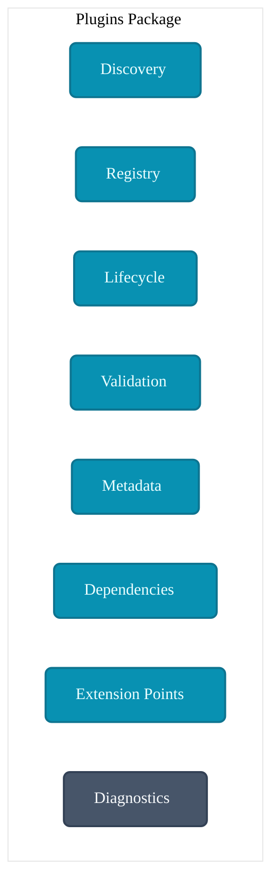
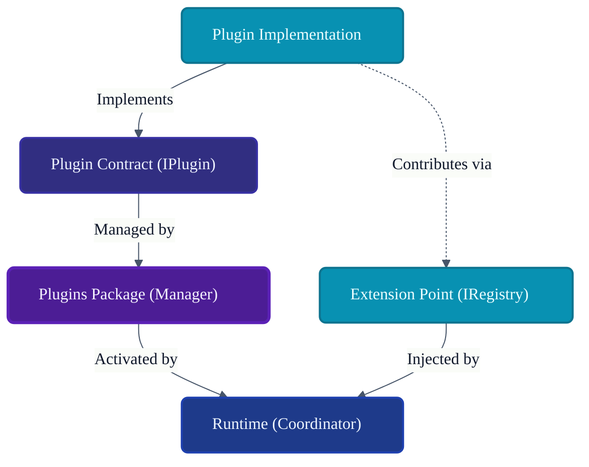
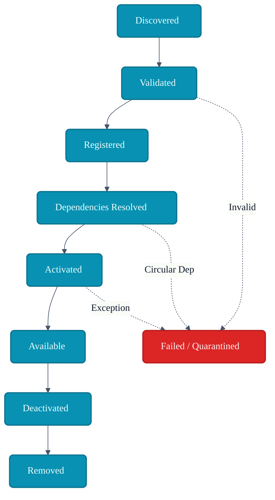
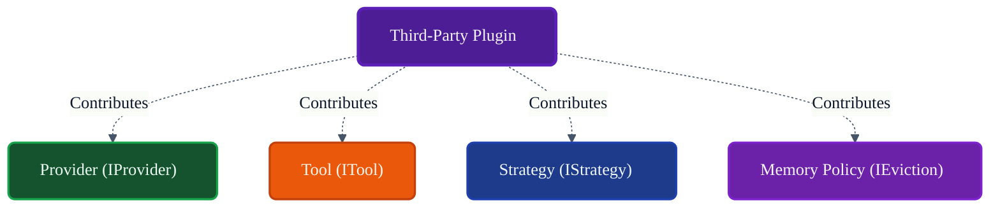
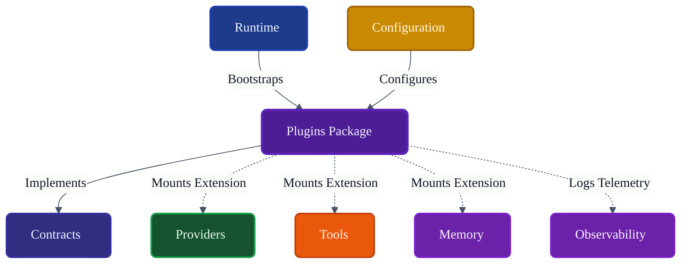

# VoxCore Plugins Package

This document defines the internal organization, plugin lifecycle, discovery model, registration process, dependency model, extension architecture, collaboration rules, and implementation constraints of the Plugins package.

It answers exactly one engineering question: **"How is the Plugins package internally organized to support modular runtime extensions while preserving the stability and independence of the VoxCore core?"**

The Plugins package provides the extensibility mechanism for VoxCore. Plugins may contribute capabilities to the Runtime, but they never modify the Runtime itself. The package is responsible for discovery, validation, lifecycle, registration, activation, metadata, dependency management, and unloading. It is not responsible for runtime orchestration, provider implementation, tool execution, storage, transport, or scheduling.

---

## 1. Purpose

The Plugins package enables modular extensibility while preserving the integrity of the core runtime.

Without a dedicated Plugins package:
* **Extensions require modifying core code**: Adding a new vector database support requires PRs to the core VoxCore repository.
* **Third-party integrations become tightly coupled**: External contributions compromise the stability of the core engine.
* **Optional features cannot be isolated**: Unused features (like specialized domain prompt templates) bloat the runtime.
* **Platform evolution slows**: Upgrading the core framework breaks hardcoded third-party tools.
* **Experimentation becomes risky**: Testing a new LLM provider model risks breaking stable production pipelines.

The Plugins package allows VoxCore to evolve infinitely without destabilizing its foundations.

---

## 2. Package Philosophy

The physical structure and implementation details of `voxcore/plugins` adhere to the following principles:

* **Extension Without Modification**: Plugins contribute new capabilities (e.g., registering a new `IProvider`) but cannot override core Runtime behaviour.
* **Contract-Based Integration**: Plugins communicate with VoxCore exclusively through the `Contracts` package.
* **Runtime Independence**: The Runtime coordinates execution; plugins only supply the implementations to be executed.
* **Explicit Registration**: No plugin is loaded implicitly. All plugins must be formally discovered, validated, and registered.
* **Controlled Lifecycle**: Plugins follow a strict boot and shutdown sequence identical to core components.
* **Capability Isolation**: A crashed plugin must fail gracefully without crashing the VoxCore kernel.
* **Framework Independence**: Plugin architecture does not rely on heavy Web/DI framework specifics (e.g., Spring/FastAPI hooks).
* **Backward Compatibility**: Plugin contracts remain stable, allowing older plugins to function across minor VoxCore version upgrades.

---

## 3. Responsibilities

The package enforces a strict boundary between platform extensibility and runtime orchestration.

| Responsibility | Description | Owned? |
| :--- | :--- | :--- |
| **Discover plugins** | Scanning directories or manifests for extensions. | **Yes** |
| **Validate plugins** | Checking manifest signatures and version compatibility. | **Yes** |
| **Register plugins** | Keeping a central ledger of loaded extensions. | **Yes** |
| **Activate plugins** | Triggering plugin initialization hooks. | **Yes** |
| **Deactivate plugins** | Running graceful shutdown hooks. | **Yes** |
| **Expose metadata** | Providing plugin author, version, and capability list. | **Yes** |
| **Manage dependencies** | Ensuring Plugin A loads before Plugin B if required. | **Yes** |
| **Monitor lifecycle** | Emitting events on plugin crashes or slow boots. | **Yes** |
| **Runtime execution** | Orchestrating execution pipelines. | *Delegated* (Runtime) |
| **Provider execution** | Sending LLM HTTP requests. | *Delegated* (Providers) |
| **Tool execution** | Sandboxing and running actions. | *Delegated* (Tools) |
| **Persistence** | Writing to disks/DBs. | *Delegated* (Storage) |
| **Scheduling** | Queueing workflows. | *Delegated* (Runtime) |

---

## 4. Internal Package Structure

The `voxcore/plugins/` package is logically and physically structured to separate discovery from lifecycle management.

### `discovery/`
* **Purpose**: Identifies available plugins.
* **Responsibilities**: File-system scanning, manifest parsing, dynamic module loading.
* **Collaborators**: `validation/`, `metadata/`.
* **Visibility**: Internal.
* **Dependencies**: None.

### `registry/`
* **Purpose**: Central catalog of loaded extensions.
* **Responsibilities**: Holding references to activated plugins and their exported capabilities.
* **Collaborators**: `lifecycle/`.
* **Visibility**: Public Boundary.
* **Dependencies**: `Contracts`.

### `lifecycle/`
* **Purpose**: Coordinates plugin state transitions.
* **Responsibilities**: Booting, initializing, deactivating, and unloading plugins.
* **Collaborators**: `dependencies/`, `registry/`.
* **Visibility**: Public Boundary.
* **Dependencies**: `Contracts`.

### `validation/`
* **Purpose**: Ensures plugin integrity before loading.
* **Responsibilities**: Verifying API version compatibility, checking manifest completeness.
* **Collaborators**: `discovery/`.
* **Visibility**: Internal.
* **Dependencies**: None.

### `metadata/`
* **Purpose**: Describes plugin identity.
* **Responsibilities**: Managing plugin Name, Version, Author, and Contributed Capabilities.
* **Collaborators**: `discovery/`.
* **Visibility**: Internal.
* **Dependencies**: None.

### `dependencies/`
* **Purpose**: Calculates safe activation ordering.
* **Responsibilities**: Resolving DAGs (Directed Acyclic Graphs) of plugin dependencies; detecting circular dependencies.
* **Collaborators**: `lifecycle/`.
* **Visibility**: Internal.
* **Dependencies**: None.

### `extension_points/`
* **Purpose**: The mounting targets for plugin capabilities.
* **Responsibilities**: Providing the safe hooks where a Plugin injects a Tool, Provider, or Policy.
* **Collaborators**: `registry/`, `Runtime`, `Tools`, `Providers`.
* **Visibility**: Public Boundary.
* **Dependencies**: `Contracts`.

### `diagnostics/`
* **Purpose**: Observability for extension code.
* **Responsibilities**: Emitting plugin load times, failure rates, and memory footprints.
* **Collaborators**: `lifecycle/`.
* **Visibility**: Internal.
* **Dependencies**: `Contracts` (Events).

---

## 5. Plugin Categories

Plugins are categorized by the primary capability they contribute to the system.

### Provider Plugins
* **Purpose**: Adds support for a new AI vendor.
* **Contributed Capabilities**: Custom `IProviderFactory` and `IProvider`.
* **Consumers**: Providers Package / Runtime.
* **Lifecycle**: Initialized before the Execution Pipeline boots.

### Tool Plugins
* **Purpose**: Adds executable actions.
* **Contributed Capabilities**: One or more `ITool` instances.
* **Consumers**: Tools Package.
* **Lifecycle**: Registered during boot; executed on demand.

### Memory Plugins
* **Purpose**: Alters memory ranking or adds vector DB support.
* **Contributed Capabilities**: `IEvictionPolicy`, `IStore` adapters.
* **Consumers**: Memory Package, Storage Package.
* **Lifecycle**: Loaded before Memory Service initializes.

### Strategy Plugins
* **Purpose**: Adds custom decision-making logic.
* **Contributed Capabilities**: Fallback strategies, routing rules.
* **Consumers**: Runtime Package.
* **Lifecycle**: Replaces default runtime strategies during boot.

### Prompt Plugins
* **Purpose**: Contributes domain-specific system prompts.
* **Contributed Capabilities**: Prompt templates.
* **Consumers**: Memory Package (Context Assembly).
* **Lifecycle**: Passive contribution.

### Event Plugins
* **Purpose**: Listens to runtime events for external integrations.
* **Contributed Capabilities**: Event Bus Subscribers.
* **Consumers**: Runtime Event Bus.
* **Lifecycle**: Active listeners initialized during boot.

### Observability Plugins
* **Purpose**: Exports telemetry to specific sinks.
* **Contributed Capabilities**: Custom Loggers, OpenTelemetry exporters.
* **Consumers**: Observability Package.
* **Lifecycle**: Booted extremely early.

### Integration Plugins
* **Purpose**: Complex workflows wrapping multiple capabilities.
* **Contributed Capabilities**: Combines Providers, Tools, and Memory into a cohesive agent setup.
* **Consumers**: Runtime.
* **Lifecycle**: Phased initialization.

---

## 6. Plugin Lifecycle

Plugins map to the Runtime State Machines through the following explicit stages:

1. **Discovery**: `discovery/` finds `manifest.json` on disk.
2. **Validation**: `validation/` checks VoxCore API compatibility version.
3. **Registration**: Added to `registry/` in a "Loaded" state.
4. **Dependency Resolution**: `dependencies/` sorts the initialization order.
5. **Activation**: `lifecycle/` calls `IPlugin.Activate()`. The plugin registers its tools/providers with `extension_points/`.
6. **Available**: Plugin is actively participating in the runtime.
7. **Deactivation**: `IPlugin.Deactivate()` is called; plugin unmounts its tools/providers.
8. **Removal**: Plugin is removed from `registry/`.

Failure branches (e.g., circular dependency detected, activation throws an exception) immediately transition the plugin to a `Failed` state, preventing `Available` status.

---

## 7. Discovery & Registration Model

* **Discovery**: Relies on defined entry points (e.g., Python `entry_points`, a specific `plugins/` directory, or explicit configuration paths).
* **Manifest Evaluation**: Every plugin must supply metadata (Name, Version, VoxCoreVersion, Dependencies).
* **Metadata Validation**: The system rejects plugins targeting future/incompatible major versions of VoxCore.
* **Dependency Validation**: If Plugin A requires Plugin B, the system ensures Plugin B is present and activated first.
* **Registration**: Validated plugins are held in memory before activation.
* **Activation Ordering**: A topological sort guarantees safe initialization.
* **Uniqueness**: Plugins are identified by a unique namespace (e.g., `com.voxcore.plugins.github`).

---

## 8. Extension Model

Plugins extend the platform through Contracts, not through direct Runtime modification.

When a Plugin activates, it is passed an `IExtensionRegistry` (part of Contracts).
If a plugin wants to add a Tool, it calls:
`extensionRegistry.RegisterTool(new GithubSearchTool())`

* **Providers**: Contributed to the Providers Package via Extension Points.
* **Tools**: Contributed to the Tools Package registry.
* **Strategies**: Injected into the Runtime Strategies registry.
* **Memory Policies**: Injected into the Memory package policies list.
* **Event Subscribers**: Registered to the Runtime Event Bus.

At no point does a plugin modify the source code, classes, or running instances of the core VoxCore engine directly.

---

## 9. Public Package Boundary
* **Purpose**: Ensures plugin is structurally sound.
* **Inputs**: Plugin Path / Manifest.
* **Outputs**: Validation Result.
* **Preconditions**: None.
* **Postconditions**: None.
* **Failure Conditions**: Malformed manifest.
* **Side Effects**: N/A
* **Ownership**: N/A
* **Dependencies**: N/A
* **Thread Safety**: N/A
---

## 10. Dependency Rules

To maintain strict platform stability:

* **Plugins implement Contracts**: Plugins must implement `IPlugin` from the Contracts package.
* **Plugins shall never modify Runtime internals**: Python monkey-patching core components is strictly forbidden.
* **Plugins shall never bypass package boundaries**: A plugin cannot instantiate `RuntimeExecutionPipeline` directly.
* **Plugins shall never directly invoke Scheduler**: They contribute Tasks, but do not manipulate the Scheduler's event loop.
* **Plugins shall not depend on concrete Providers**: A plugin cannot import `OpenAIAdapter`. It must use `IProvider`.
* **Plugins remain independently deployable**: A plugin can be deleted from disk without breaking the core system.

---

## 11. Collaboration
* **Initiator**: N/A
* **Owner**: N/A
* **Depends On**: N/A
* **Publishes**: N/A
* **Receives**: N/A
---

## 12. Package Invariants

The following invariants must hold true under all conditions:

1. **Every plugin implements a plugin contract.** (No arbitrary scripts allowed).
2. **Every plugin has one registration owner.** (Unique Namespaces).
3. **Plugins remain isolated.** (A crashed plugin during boot is caught and quarantined).
4. **Plugins contribute capabilities through extension points only.** (No direct injection into private variables).
5. **Plugin metadata remains authoritative.** (The manifest dictates load order).
6. **Plugin activation follows the defined lifecycle.** (Activation cannot be skipped).

---

## 13. Failure Behaviour

* **Discovery failure**: Invalid manifests are logged as warnings and skipped. The platform continues booting.
* **Validation failure**: Incompatible API versions are explicitly rejected.
* **Dependency conflict**: Circular dependencies (`A->B->A`) abort the loading of the involved plugins.
* **Activation failure**: If `IPlugin.Activate()` throws an exception, the plugin transitions to `Failed`, and any capabilities it partially registered are rolled back via `Deactivate()`.
* **Initialization failure**: Same as Activation failure.
* **Version incompatibility**: Rejected during validation phase.
* **Unexpected failure**: Sandboxed during execution; causes graceful degradation.
* **Recovery boundaries**: The Plugin package does not retry activation. A failed plugin requires user intervention/reconfiguration.

---

## 14. Extension Points

The Plugins package itself is extensible:
* **New plugin categories**: Defining new metadata tags for discovery.
* **New extension interfaces**: Creating `IStoragePlugin` to allow dynamic database injection.
* **Lifecycle hooks**: Allowing plugins to subscribe to `PreBoot` and `PostShutdown` events.
* **Validation policies**: Custom security signing (e.g., rejecting unsigned plugins).

---

## 15. Design Constraints

* **Plugins shall remain isolated.**
* **Plugins shall not modify Runtime internals.**
* **Plugins shall not bypass Contracts.**
* **Plugins shall not coordinate runtime execution.** (Plugins provide the gears; Runtime turns them).
* **Plugins shall remain independently removable.** (Uninstalling a plugin must cleanly unregister its tools).
* **Plugins shall remain cohesive.**

---

## 16. Traceability

| Plugin Module | Derived From | Primary Consumer |
| :--- | :--- | :--- |
| `discovery/` | Extensibility Req. | Runtime Bootstrapper |
| `dependencies/`| System Stability | `lifecycle/` |
| `extension_points/` | Dependency Inversion | External Plugin Authors |
| `validation/` | Security / Stability | `discovery/` |

---

## 17. Conclusion

The Plugins package enables modular platform evolution through controlled extension points while preserving Runtime stability, architectural boundaries, and long-term maintainability. By treating plugins as strictly defined capability contributors rather than core modifiers, VoxCore can safely integrate diverse Tools, Providers, and Policies from third-party developers without compromising its internal orchestration.

---

## Required Tables

### Table 1: Documentation Relationships

| Document | Responsibility |
| :--- | :--- |
| **Package Responsibilities** | Defines Plugins package ownership. |
| **Contracts Package** | Defines plugin contracts and extension interfaces. |
| **Runtime Package** | Coordinates plugin lifecycle. |
| **Providers Package** | Plugins may contribute provider implementations. |
| **Tools Package** | Plugins may contribute tool implementations. |
| **Memory Package** | Plugins may contribute memory policies. |
| **Observability Package** | Records plugin diagnostics. |
| **Plugins Package (This Doc)**| Defines discovery, lifecycle, and architecture. |

### Table 2: Responsibilities Matrix

| Responsibility | Owner | Delegated To |
| :--- | :--- | :--- |
| **Plugin Discovery** | Plugins Package | N/A |
| **Dependency Sorting** | Plugins Package | N/A |
| **Activation Invocation**| Plugins Package | N/A |
| **Tool Execution** | N/A | Tools Package |
| **Provider Execution** | N/A | Providers Package |

### Table 3: Plugin Categories

| Category | Purpose | Contributed Capability |
| :--- | :--- | :--- |
| **Provider** | Adds AI backends. | `IProvider` |
| **Tool** | Adds executable actions. | `ITool` |
| **Memory** | Alters retrieval/storage. | `IEvictionPolicy`, `IStore` |
| **Strategy** | Custom orchestration logic. | `IStrategy` |
| **Observability**| Telemetry export. | `ILogger`, `IMetricSink` |

### Table 4: Plugin Lifecycle

| Stage | Owner | Outcome |
| :--- | :--- | :--- |
| **Discovered** | Plugins Package | Manifest parsed. |
| **Validated** | Plugins Package | Compatibility confirmed. |
| **Activated** | Plugins Package | Capabilities contributed. |
| **Deactivated** | Plugins Package | Capabilities removed. |

### Table 5: Dependency Rules

| Rule | Reason |
| :--- | :--- |
| **Implement Contracts** | Prevents core coupling. |
| **No Core Modification**| Preserves runtime stability. |
| **No Private Imports** | Ensures backward compatibility across versions. |

### Table 6: Package Invariants

| Invariant | Reason |
| :--- | :--- |
| **Strict DAG Resolution**| Prevents boot deadlocks (circular dependencies). |
| **Sandboxed Activation** | A crashing plugin does not crash the kernel. |
| **Contract-Only Extension**| Forces explicit capability declaration. |

### Table 7: Traceability Matrix

| Plugin Module | Origin | Consumer |
| :--- | :--- | :--- |
| `extension_points/` | Architectural Isolation | Plugin Authors |
| `lifecycle/` | State Machine Logic | Runtime |
| `metadata/` | Discovery Reqs | `validation/` |

---

## Required Diagrams

### Diagram 1: Plugins Package Structure

### Diagram 2: Plugin Extension Architecture

### Diagram 3: Plugin Lifecycle

### Diagram 4: Capability Contribution

### Diagram 5: Package Collaboration

