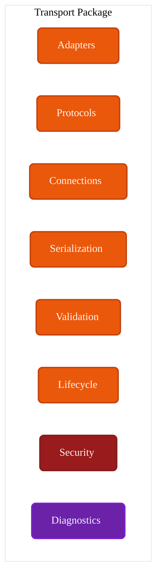
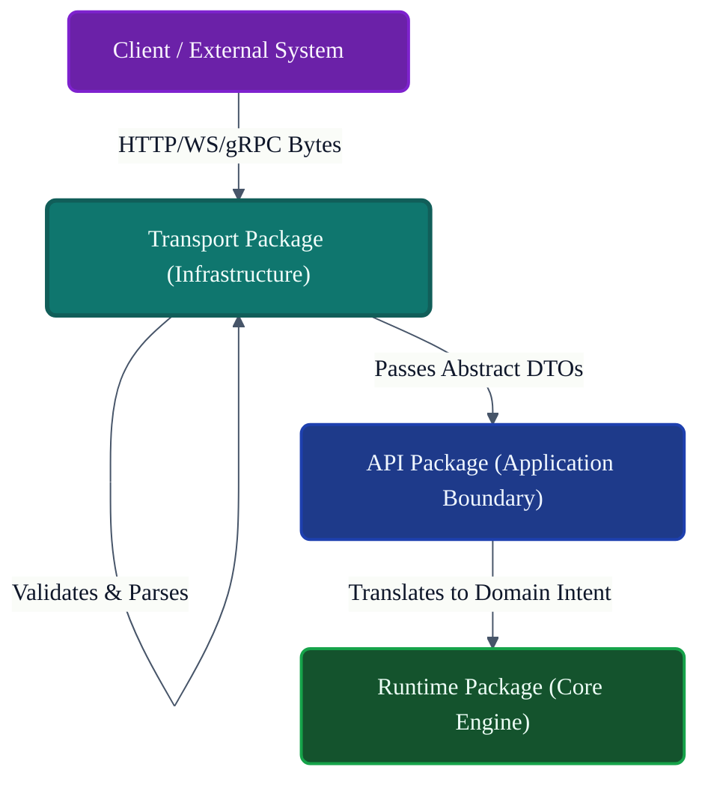
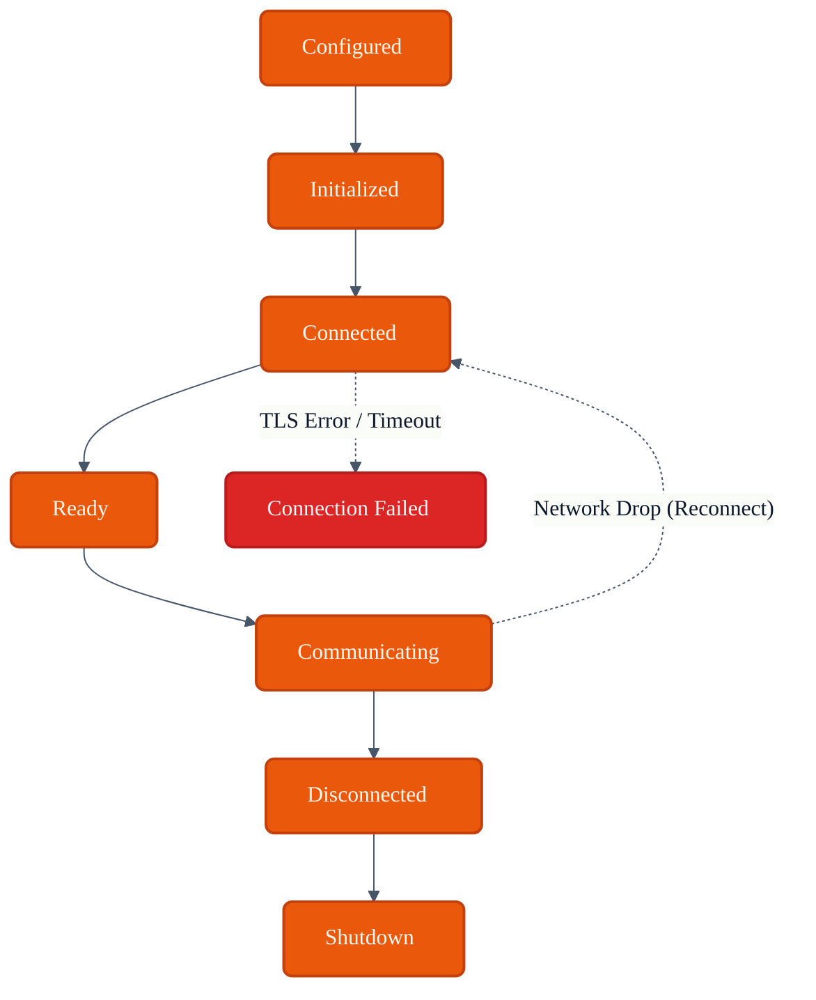
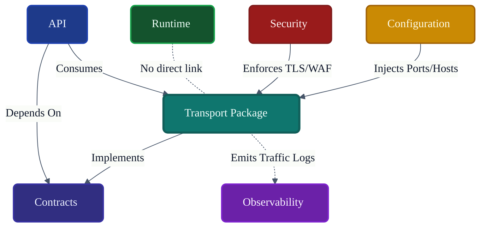

# VoxCore Transport Package

This document defines the internal organization, communication abstractions, protocol adapters, request/response transport model, lifecycle expectations, extension points, and implementation constraints of the Transport package.

It answers exactly one engineering question: **"How is the Transport package internally organized to provide technology-independent communication infrastructure for VoxCore?"**

The Transport package provides communication infrastructure. It is responsible for communication protocols, transport adapters, serialization boundaries, connection management, transport lifecycle, and transport diagnostics. It is not responsible for runtime orchestration, request execution, business logic, provider implementation, persistence, or memory reasoning.

---

## 1. Purpose

The Transport package isolates communication technologies behind stable contracts, cleanly separating *how* data moves across the network from *what* that data means.

Without a dedicated Transport package:
* **Protocol-specific logic spreads across the system**: Controllers in the API package become burdened with low-level socket management and chunk encoding.
* **Changing communication technology becomes expensive**: Migrating a service from REST (HTTP/1.1) to gRPC or WebSockets requires rewriting API endpoints and domain models.
* **Serialization leaks into business code**: The core Engine parses JSON strings instead of operating on validated Domain Entities.
* **Testing transport independently becomes difficult**: Testing network latency or retry limits requires spinning up the entire Runtime Package.

The Transport package manages the physical delivery of bytes so the API package can focus purely on application boundaries.

---

## 2. Package Philosophy

The physical structure and implementation details of `voxcore/transport` adhere to the following principles:

* **Transport Independence**: High-level packages do not know if a message arrived via HTTP, WebSocket, or a local UNIX socket.
* **Protocol Isolation**: Parsing HTTP headers or SSE (Server-Sent Events) framing remains strictly inside this package.
* **Stable Communication Contracts**: All inbound and outbound data flows through uniform `ITransport` interfaces defined in the Contracts package.
* **Connection Lifecycle Ownership**: Managing connection pools, backoff retries, and socket keep-alives belongs here, not in the application logic.
* **Framework Independence**: The package implements raw transport protocols without coupling to heavy web frameworks (e.g., Django, FastAPI).
* **Replaceable Protocol Adapters**: A new protocol (like MCP - Model Context Protocol) can be added by implementing a new adapter without altering core logic.
* **Serialization Boundary**: Bytes are converted to Data Transfer Objects (DTOs) here, establishing a clean frontier before the API layer.
* **Single Responsibility**: This package delivers messages. It does not evaluate the business meaning of the message.

---

## 3. Responsibilities

The package enforces a strict boundary between network infrastructure and application endpoints.

| Responsibility | Description | Owned? |
| :--- | :--- | :--- |
| **Implement transport contracts**| Fulfill interfaces defined in `Contracts`. | **Yes** |
| **Manage connections** | TCP sockets, WebSocket sessions, keep-alives. | **Yes** |
| **Serialize requests** | Convert outgoing DTOs to JSON/Protobuf/Bytes. | **Yes** |
| **Deserialize responses** | Parse incoming streams/bytes into DTOs. | **Yes** |
| **Manage protocol adapters** | HTTP, SSE, gRPC protocol implementations. | **Yes** |
| **Expose transport diagnostics** | Emit latency, bandwidth, and drop-rate telemetry. | **Yes** |
| **Normalize communication failures**| Translate `SocketTimeout` to `TransportError`. | **Yes** |
| **Request execution** | Handling the business intent of the request. | *Delegated* (Runtime) |
| **Runtime orchestration** | Sequencing the AI pipeline. | *Delegated* (Runtime) |
| **Business logic** | Validating user permissions on domain resources. | *Delegated* (API) |
| **Provider reasoning** | Connecting to external LLMs. | *Delegated* (Providers) |
| **Persistence** | Storing chat histories. | *Delegated* (Storage) |

---

## 4. Internal Package Structure

The `voxcore/transport/` package is logically and physically structured to separate byte transmission from protocol definitions.

### `adapters/`
* **Purpose**: Concrete implementations of communication protocols.
* **Responsibilities**: E.g., `HttpTransportAdapter`, `WebSocketAdapter`.
* **Collaborators**: `protocols/`, `connections/`.
* **Visibility**: Internal (Exposed via Interfaces).
* **Dependencies**: Native networking libraries.

### `protocols/`
* **Purpose**: Defines framing and encoding standards.
* **Responsibilities**: E.g., chunking logic for SSE (Server-Sent Events) or parsing MCP streams.
* **Collaborators**: `serialization/`, `adapters/`.
* **Visibility**: Internal.
* **Dependencies**: None.

### `connections/`
* **Purpose**: Manages network socket state.
* **Responsibilities**: Connection pooling, heartbeats, reconnect algorithms (Exponential Backoff).
* **Collaborators**: `adapters/`.
* **Visibility**: Internal.
* **Dependencies**: None.

### `serialization/`
* **Purpose**: Translates wire formats to code.
* **Responsibilities**: JSON parsing, Protobuf unmarshalling.
* **Collaborators**: `protocols/`.
* **Visibility**: Public Boundary (Used by adapters).
* **Dependencies**: `Contracts` (DTO schemas).

### `validation/`
* **Purpose**: Network-level payload checks.
* **Responsibilities**: Verifying `Content-Length` limits, rejecting malformed JSON before full parsing.
* **Collaborators**: `serialization/`.
* **Visibility**: Internal.
* **Dependencies**: None.

### `lifecycle/`
* **Purpose**: Controls the boot and shutdown of listeners and pools.
* **Responsibilities**: Graceful termination of active connections during shutdown.
* **Collaborators**: `connections/`, `adapters/`.
* **Visibility**: Public Boundary.
* **Dependencies**: None.

### `security/`
* **Purpose**: Transport-Layer protection.
* **Responsibilities**: TLS termination, certificate pinning, CORS, rate limiting.
* **Collaborators**: `adapters/`.
* **Visibility**: Internal.
* **Dependencies**: `Security Package`.

### `diagnostics/`
* **Purpose**: Emits network telemetry.
* **Responsibilities**: Logging bytes-in/out, active socket counts, latency jitter.
* **Collaborators**: `connections/`, `Event Bus`.
* **Visibility**: Internal.
* **Dependencies**: `Contracts`.

---

## 5. Transport Categories

Transport adapters fall into conceptual categories based on their network behaviour.

### HTTP Transport
* **Purpose**: Stateless request/response cycles.
* **Consumer**: REST APIs, Webhooks.

### WebSocket Transport
* **Purpose**: Persistent, full-duplex bidirectional streams.
* **Consumer**: Real-time voice agents, live chat applications.

### Server-Sent Events (SSE)
* **Purpose**: Unidirectional server-to-client streaming.
* **Consumer**: Token-by-token LLM text streaming to frontend clients.

### gRPC Transport
* **Purpose**: High-performance, binary RPC.
* **Consumer**: Inter-service microservice communication.

### MCP Transport
* **Purpose**: Model Context Protocol implementations.
* **Consumer**: Desktop IDE integrations and standard agentic toolchains.

### Internal Runtime Transport
* **Purpose**: In-memory message passing.
* **Consumer**: Subsystem communication bypassing the network stack completely.

---

## 6. Transport Lifecycle

Connections follow a strict lifecycle mapped to the Runtime State Machines.

1. **Configuration**: TLS certs and port bindings are parsed.
2. **Initialization**: Sockets are bound; connection pools are pre-warmed.
3. **Connected**: A client handshakes with the Transport adapter.
4. **Ready**: Security (TLS) is negotiated; stream is open.
5. **Data Exchange**: Bytes are transmitted and received.
6. **Disconnected**: Client drops, or server initiates graceful close.
7. **Shutdown**: Server halts; active connections are drained; sockets closed.

If a connection drops during Data Exchange, the `connections/` module may attempt reconnection transparently before failing back to the API package.

---

## 7. Communication Model

The Communication Model dictates how bytes become actionable requests.

* **Request Transmission**: The API package hands a DTO to the Transport package.
* **Serialization**: The DTO is converted to JSON or binary.
* **Protocol Abstraction**: The protocol layers framing (e.g., adding HTTP headers or WebSocket opcodes).
* **Response Reception**: The raw socket receives bytes.
* **Deserialization**: The bytes are validated and parsed back into a DTO.
* **Transport Error Handling**: Network drops (e.g., `ECONNRESET`) are caught, retried internally if safe, and finally surfaced as a generalized `TransportError` to the API.

---

## 8. Public Package Boundary
* **Purpose**: Security check on raw bytes.
* **Inputs**: Raw Byte Array.
* **Outputs**: Boolean.
* **Preconditions**: None.
* **Postconditions**: None.
* **Failure Conditions**: Exceeds max length, Malformed syntax.
* **Side Effects**: N/A
* **Ownership**: N/A
* **Dependencies**: N/A
* **Thread Safety**: N/A
---

## 9. Dependency Rules

To maintain strict communication independence:

* **Transport implements Contracts**: The `API` package depends on `ITransport`, implemented here.
* **Transport shall never invoke Runtime internals directly**: Transport does not route messages to the Execution Pipeline. It hands messages to the API layer.
* **Transport shall remain protocol-independent**: The API layer cannot import `WebSocketFrame`; it imports `Message`.
* **Transport shall not implement business logic**: It does not care if the user's prompt violates policy. It only cares if the JSON is valid.
* **API depends on Transport**: API defines the endpoints; Transport serves them.
* **Transport shall not own Runtime Context**: It does not manage Session IDs or memory states.

---

## 10. Collaboration
* **Initiator**: N/A
* **Owner**: N/A
* **Depends On**: N/A
* **Publishes**: N/A
* **Receives**: N/A
---

## 11. Package Invariants

The following invariants must hold true under all conditions:

1. **Every communication uses a transport abstraction.** (No raw `socket.send()` in the API package).
2. **Protocol adapters remain replaceable.** (HTTP can be swapped for gRPC).
3. **Transport never contains business logic.**
4. **Serialization remains isolated.** (No JSON parsing in the Execution Pipeline).
5. **Transport never owns runtime execution.** (It does not spawn Agent tasks).
6. **Transport remains technology-independent at the architectural boundary.**

---

## 12. Failure Behaviour

* **Connection failure**: Socket level errors are caught, logged in `diagnostics/`, and translated to `ConnectionFailedError`.
* **Serialization failure**: Malformed JSON results in an immediate `400 Bad Request` equivalent before reaching the API layer.
* **Protocol error**: E.g., Invalid HTTP headers drop the connection silently to prevent DOS attacks.
* **Timeout**: Enforced strictly at the socket level. Closes the connection and surfaces a `TransportTimeoutError`.
* **Disconnected peer**: Detected via heartbeats; cleanly shuts down local resources and fires a `PeerDisconnectedEvent`.
* **Recovery boundaries**: Transport attempts TCP retries, but hands application-level failures back to the API.

---

## 13. Extension Points

The Transport package is designed for infrastructural extension:
* **New transport protocols**: Adding native WebRTC for ultra-low latency voice.
* **New serialization formats**: Supporting MessagePack for edge device communication.
* **Connection policies**: Adding adaptive backoff strategies.
* **Diagnostics**: Adding detailed packet inspection metrics.

---

## 14. Design Constraints

* **Transport shall remain protocol-focused.**
* **Transport shall not implement Runtime behaviour.**
* **Transport shall not implement business logic.**
* **Transport shall remain framework-independent.** (Do not lock the entire architecture into Starlette or Express).
* **Transport shall isolate communication technologies.** (Do not leak `aiohttp` or `requests` objects outside the package).

---

## 15. Traceability

| Transport Module | Derived From | Primary Consumer |
| :--- | :--- | :--- |
| `adapters/` | System Architecture | `connections/` |
| `serialization/` | API Integration Req. | API Package |
| `lifecycle/` | Network Resilience | App Bootstrapper |
| `security/` | Platform Security Req. | `adapters/` |

---

## 16. Conclusion

The Transport package provides the communication infrastructure of VoxCore while isolating protocol-specific concerns from the Runtime and higher-level application logic. By cleanly separating the *mechanism* of data delivery (Transport) from the *meaning* of the data (API and Runtime), VoxCore can seamlessly evolve to support modern streaming, RPC, and agentic protocols without undergoing massive architectural rewrites.

---

## Required Tables

### Table 1: Documentation Relationships

| Document | Responsibility |
| :--- | :--- |
| **Package Responsibilities** | Defines Transport package ownership. |
| **Contracts Package** | Defines transport contracts. |
| **API Package** | Uses transport infrastructure. |
| **Runtime Package** | Receives translated runtime requests. |
| **Configuration Package** | Supplies transport configuration. |
| **Security Package** | Applies transport security policies. |
| **Observability Package** | Records transport diagnostics. |
| **Transport Package (This Doc)**| Defines communication infrastructure. |

### Table 2: Responsibilities Matrix

| Responsibility | Owner | Delegated To |
| :--- | :--- | :--- |
| **Socket Management** | Transport Package | N/A |
| **Payload Serialization** | Transport Package | N/A |
| **Protocol Framing (SSE)**| Transport Package | N/A |
| **Endpoint Routing** | N/A | API Package |
| **Business Logic** | N/A | Runtime Package |

### Table 3: Transport Categories

| Category | Purpose | Consumer |
| :--- | :--- | :--- |
| **HTTP** | Stateless RPC | REST APIs |
| **WebSocket** | Stateful duplex streaming | Live Agents |
| **SSE** | Server-to-Client streaming | Text Generators |
| **Internal** | Memory-bound messaging | Subsystem workers |

### Table 4: Communication Responsibilities

| Responsibility | Owner | Consumer |
| :--- | :--- | :--- |
| **TLS Termination** | Security Module (Transport) | External Clients |
| **Chunk Decoding** | Protocol Adapters | Serialization |
| **DTO Hydration** | Serialization | API Package |

### Table 5: Dependency Rules

| Rule | Reason |
| :--- | :--- |
| **Isolate Libraries** | Higher layers cannot import `websockets` or `httpx`. |
| **Implement Contracts** | Enables API to remain transport-agnostic. |
| **No Logic** | Transport does not evaluate payload intent. |

### Table 6: Package Invariants

| Invariant | Reason |
| :--- | :--- |
| **Strict Framing** | Malformed protocol headers fail immediately. |
| **Graceful Drain** | Connections must not be forcefully killed if a clean shutdown is requested. |
| **Opaque Transport**| The API layer sees `Request`, not `HttpRequest`. |

### Table 7: Traceability Matrix

| Transport Module | Origin | Consumer |
| :--- | :--- | :--- |
| `connections/` | Network Resilience | `lifecycle/` |
| `protocols/` | Protocol Standards | `adapters/` |
| `validation/` | Security (DDoS mitigation)| `serialization/` |

---

## Required Diagrams

### Diagram 1: Transport Package Structure

### Diagram 2: Communication Architecture

### Diagram 3: Transport Lifecycle

### Diagram 4: Package Collaboration

