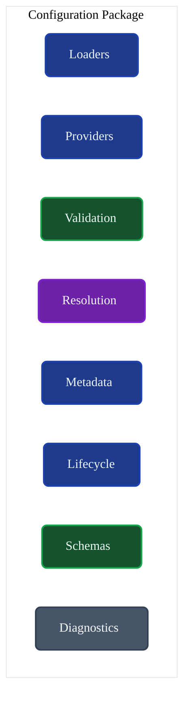
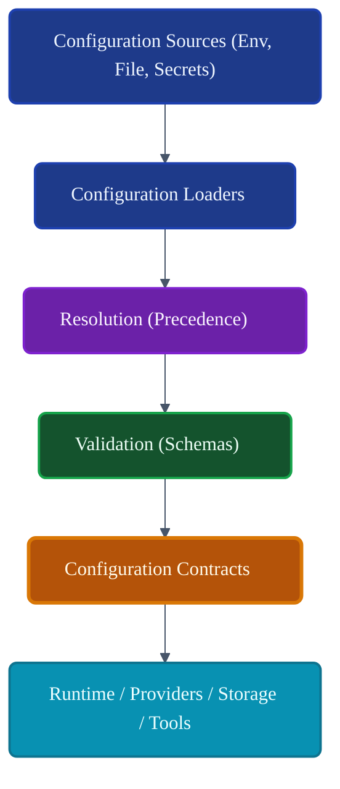
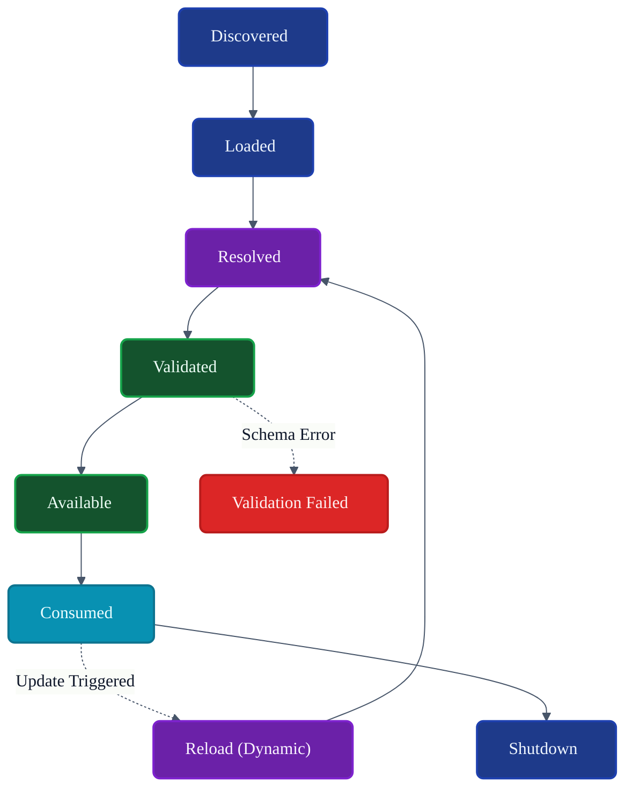
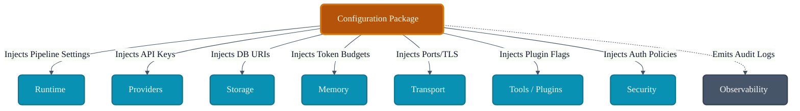

# VoxCore Configuration Package

This document defines the internal organization, configuration lifecycle, configuration providers, validation model, configuration resolution, dependency boundaries, extension points, and implementation constraints of the Configuration package.

It answers exactly one engineering question: **"How is the Configuration package internally organized to provide centralized, validated, and provider-independent configuration management throughout VoxCore?"**

The Configuration package is responsible for configuration loading, configuration validation, configuration resolution, configuration lifecycle, configuration providers, configuration metadata, and configuration access. It is not responsible for runtime orchestration, business logic, provider execution, persistence, transport, or scheduling.

---

## 1. Purpose

The Configuration package centralizes configuration management while keeping configuration values strictly independent from runtime behaviour.

Without a centralized Configuration package:
* **Configuration becomes duplicated**: Multiple packages implement their own `.env` parsers.
* **Validation becomes inconsistent**: API keys are checked lazily during execution rather than proactively at boot, causing unexpected runtime crashes.
* **Environment management becomes fragile**: Shifting from local development to cloud deployment requires rewriting business logic.
* **Configuration leaks into business code**: The core Engine begins querying the OS environment directly (`os.environ`).
* **Testing becomes difficult**: Tests cannot easily inject mock configuration values without polluting the global environment.

The Configuration package ensures that the entire platform boots with a valid, conflict-free, and securely resolved set of parameters.

---

## 2. Package Philosophy

The physical structure and implementation details of `voxcore/configuration` adhere to the following principles:

* **Centralized Configuration**: All parameters, credentials, and thresholds are managed by this package. No subsystem bypasses it.
* **Validation Before Use**: The system refuses to boot if required configuration is missing or malformed.
* **Immutable Runtime Configuration**: Once resolved and validated during boot, configuration objects passed to consumers remain read-only.
* **Explicit Ownership**: The package owns the configuration structure, not the behaviour it configures.
* **Provider Independence**: A module does not know if its config came from a local file, a CLI flag, or an external Secrets Manager.
* **Framework Independence**: Resolving configuration does not rely on heavy Web Framework specific features.
* **Configuration Through Contracts**: Consumers request `IConfiguration`, ensuring strict type safety.
* **Single Source of Truth**: Conflicting values across different environments are resolved deterministically into one final value.

---

## 3. Responsibilities

The package enforces a strict boundary between defining values and executing behaviour.

| Responsibility | Description | Owned? |
| :--- | :--- | :--- |
| **Load configuration** | Fetching values from files, env, or secrets managers. | **Yes** |
| **Validate configuration** | Ensuring types, ranges, and required fields are correct. | **Yes** |
| **Resolve configuration** | Merging multiple sources deterministically by precedence. | **Yes** |
| **Expose contracts** | Providing strongly typed interfaces (e.g., `IProviderConfig`). | **Yes** |
| **Manage lifecycle** | Handling initial load and safe reloading operations. | **Yes** |
| **Provide metadata** | Documenting what configuration keys exist. | **Yes** |
| **Detect invalid config** | Failing fast during boot if validation fails. | **Yes** |
| **Expose diagnostics** | Auditing configuration source overrides safely. | **Yes** |
| **Runtime orchestration** | Booting the Execution Pipeline. | *Delegated* (Runtime) |
| **Behaviour implementation**| Enforcing logic based on config flags. | *Delegated* (Runtime) |
| **Provider execution** | Sending HTTP requests to LLMs. | *Delegated* (Providers) |
| **Persistence** | Connecting to the database. | *Delegated* (Storage) |
| **Transport** | Binding to a network port. | *Delegated* (Transport) |

---

## 4. Internal Package Structure

The `voxcore/configuration/` package is logically and physically structured to separate loading mechanisms from validation schemas.

### `loaders/`
* **Purpose**: Retrieves raw data from external sources.
* **Responsibilities**: Parsing files, querying the environment, or contacting secret vaults.
* **Collaborators**: `providers/`, `resolution/`.
* **Visibility**: Internal.
* **Dependencies**: None.

### `providers/`
* **Purpose**: Concrete implementations of configuration sources.
* **Responsibilities**: E.g., `EnvProvider`, `YamlProvider`, `AWSSecretsProvider`.
* **Collaborators**: `loaders/`.
* **Visibility**: Internal.
* **Dependencies**: Native/External SDKs.

### `validation/`
* **Purpose**: Enforces schema correctness.
* **Responsibilities**: Type casting, constraint checking, required field enforcement.
* **Collaborators**: `schemas/`, `resolution/`.
* **Visibility**: Internal.
* **Dependencies**: None.

### `resolution/`
* **Purpose**: Merges multiple configuration sources.
* **Responsibilities**: Applying precedence rules (e.g., Env overrides File).
* **Collaborators**: `loaders/`, `validation/`.
* **Visibility**: Internal.
* **Dependencies**: None.

### `metadata/`
* **Purpose**: Describes the configuration shape.
* **Responsibilities**: Exposing available keys and descriptions for CLI help or documentation.
* **Collaborators**: `schemas/`.
* **Visibility**: Public Boundary.
* **Dependencies**: None.

### `lifecycle/`
* **Purpose**: Coordinates the boot up sequence of configuration parsing.
* **Responsibilities**: Orchestrating Load -> Resolve -> Validate -> Lock.
* **Collaborators**: `resolution/`.
* **Visibility**: Public Boundary.
* **Dependencies**: `Contracts`.

### `diagnostics/`
* **Purpose**: Audits configuration state.
* **Responsibilities**: Emitting logs about which provider supplied which key (while redacting secrets).
* **Collaborators**: `resolution/`.
* **Visibility**: Internal.
* **Dependencies**: `Contracts` (Events).

### `schemas/`
* **Purpose**: Defines the expected shape of the configuration.
* **Responsibilities**: Data structures detailing required inputs.
* **Collaborators**: `validation/`.
* **Visibility**: Internal.
* **Dependencies**: None.

---

## 5. Configuration Sources

Configuration sources define where raw values originate. The system resolves these sources transparently.

### Default Configuration
* **Purpose**: Defines fallback values baked into the platform.
* **Priority**: Lowest.

### File-Based Configuration
* **Purpose**: Static deployment configurations (e.g., `config.yaml`, `voxcore.toml`).
* **Priority**: Medium.

### Environment Configuration
* **Purpose**: Host-level environment variables (e.g., Docker container vars).
* **Priority**: High (overrides files).

### Runtime Overrides
* **Purpose**: Ephemeral overrides provided via application boot flags (CLI).
* **Priority**: Highest.

### Secret Providers
* **Purpose**: Secure retrieval of sensitive keys (AWS Secrets Manager, HashiCorp Vault).
* **Priority**: Highest (for secret-specific keys).

---

## 6. Configuration Lifecycle

Configuration undergoes a strict lifecycle during system boot, mapped to the Runtime State Machines.

1. **Discovery**: The `lifecycle/` manager identifies which `providers/` are active.
2. **Loading**: Raw keys/values are pulled from all active sources.
3. **Validation**: The raw data is type-checked against defined `schemas/`.
4. **Resolution**: Conflicting keys are resolved based on priority rules.
5. **Available**: The final configuration object is assembled and locked in memory.
6. **Consumed**: Higher-level packages (Runtime, Storage) request their slices of the configuration.
7. **Reload**: (Optional) If dynamic reconfiguration is supported, the cycle repeats and emits an update event.
8. **Shutdown**: Configuration instances are dropped.

---

## 7. Validation Model

Configuration is strictly validated before the Runtime is allowed to boot.

* **Schema Validation**: The raw configuration dictionary must match predefined schema classes.
* **Required Values**: If a required key (e.g., `OPENAI_API_KEY`) is missing, boot is aborted.
* **Optional Values**: Missing optional values are safely ignored.
* **Default Resolution**: Missing optional values without overrides fall back to explicit defaults.
* **Type Validation**: A port defined as `"8080"` (string) is coerced to `8080` (integer). If coercion fails, boot is aborted.
* **Consistency Validation**: Cross-field checks (e.g., `MinTokens` must be <= `MaxTokens`).

---

## 8. Resolution Model

When multiple sources provide the same key, VoxCore resolves them deterministically.

* **Configuration Precedence**: CLI Flags > Environment > Secrets > YAML > Defaults.
* **Configuration Merging**: Deep-merging of nested structures (e.g., combining default logging paths with custom logging levels).
* **Configuration Lookup**: Consumers request structured objects (e.g., `StorageConfig`), not flat strings (`"db_host"`).
* **Resolved Configuration**: The final, merged, and validated output.
* **Configuration Immutability**: Once resolved, the `IConfiguration` object passed to consumers cannot be modified by the consumer.
* **Configuration Visibility**: Passwords and keys are redacted when exposed to diagnostics.

---

## 9. Public Package Boundary
* **Purpose**: Hot-swaps settings without rebooting the kernel.
* **Inputs**: None.
* **Outputs**: Boolean success.
* **Preconditions**: System is running.
* **Postconditions**: Connected consumers are notified.
* **Failure Conditions**: Invalid new configuration.
* **Side Effects**: N/A
* **Ownership**: N/A
* **Dependencies**: N/A
* **Thread Safety**: N/A
---

## 10. Dependency Rules

To maintain strict independence:

* **Configuration implements Contracts**: This package provides implementations for `IConfiguration`.
* **Packages consume configuration through Contracts**: Runtime requests `IConfiguration`, not `YamlConfigLoader`.
* **Configuration shall never invoke Runtime**: It provides values; it does not trigger agent execution.
* **Configuration shall never depend on Providers**: It supplies the API keys, but does not import Provider SDKs.
* **Configuration shall not contain business logic**: It does not evaluate if a configuration is *operationally correct* for a specific user prompt.
* **Configuration remains independent**: It sits at the base of the dependency tree, reliant only on native libraries.

---

## 11. Collaboration
* **Initiator**: N/A
* **Owner**: N/A
* **Depends On**: N/A
* **Publishes**: N/A
* **Receives**: N/A
---

## 12. Package Invariants

The following invariants must hold true under all conditions:

1. **Configuration has one authoritative owner.** (Values are never parsed independently by other packages).
2. **Configuration is validated before consumption.** (Consumers can trust the data types).
3. **Consumers never modify configuration.** (Passed configurations are read-only).
4. **Configuration contracts remain stable.** (Adding a new config source does not break the `IConfiguration` interface).
5. **Configuration remains provider-independent.**
6. **Configuration metadata is authoritative.** (If a key is not in the Schema, it is dropped).

---

## 13. Failure Behaviour

* **Missing configuration**: If required, the system panics and halts boot immediately. If optional, system falls back to defaults.
* **Invalid values**: Validation strictly rejects type mismatches (e.g., providing a string `"true"` instead of a boolean). Halts boot.
* **Conflicting configuration**: Handled seamlessly by the Precedence/Resolution rules.
* **Resolution failure**: Extremely rare; typically caused by internal merging bugs. Halts boot.
* **Reload failure**: If a dynamic reload yields invalid configuration, the system rejects the update and retains the previously validated configuration.
* **Recovery boundaries**: Configuration failures are fatal during initialization. No automatic retry is attempted for invalid schemas.

---

## 14. Extension Points

The Configuration package is designed to support diverse environments:
* **New configuration providers**: Adding a `AzureKeyVaultProvider`.
* **New validation policies**: Adding strict regex constraints to specific fields.
* **New configuration sources**: Fetching configuration from an external GraphQL endpoint.
* **New schemas**: Defining specific configurations for newly created Plugins.

---

## 15. Design Constraints

* **Configuration shall remain behaviour-independent.**
* **Configuration shall not own runtime lifecycle.** (It does not boot the application, it is booted *by* the application).
* **Configuration shall remain immutable after initialization unless explicitly supporting reload.**
* **Configuration shall not expose implementation-specific formats.** (Consumers receive Python `dataclasses` or generic Objects, not JSON blobs).
* **Configuration shall remain cohesive.**

---

## 16. Traceability

| Configuration Module | Derived From | Primary Consumer |
| :--- | :--- | :--- |
| `resolution/` | Predictability Req. | `validation/` |
| `validation/` | Fail-Fast Architecture | `lifecycle/` |
| `providers/` | Environment Independence | `loaders/` |
| `schemas/` | Type Safety Req. | `validation/` |

---

## 17. Conclusion

The Configuration package provides centralized, validated, and provider-independent configuration management while preserving architectural boundaries and ensuring predictable system behaviour. By enforcing strict schemas and deterministic resolution early in the boot process, VoxCore guarantees that consumers across the system operate on secure, typed, and immutable configuration data.

---

## Required Tables

### Table 1: Documentation Relationships

| Document | Responsibility |
| :--- | :--- |
| **Package Responsibilities** | Defines Configuration package ownership. |
| **Contracts Package** | Defines configuration contracts. |
| **Runtime Package** | Consumes runtime configuration. |
| **Providers Package** | Consumes provider configuration. |
| **Storage Package** | Consumes storage configuration. |
| **Transport Package** | Consumes transport configuration. |
| **Security Package** | Consumes security configuration. |
| **Configuration Package (This Doc)**| Defines loading, validation, and resolution. |

### Table 2: Responsibilities Matrix

| Responsibility | Owner | Delegated To |
| :--- | :--- | :--- |
| **Source Parsing** | Configuration Package | N/A |
| **Type Validation** | Configuration Package | N/A |
| **Precedence Resolution**| Configuration Package | N/A |
| **Executing Pipelines** | N/A | Runtime Package |
| **Opening Sockets** | N/A | Transport Package |

### Table 3: Configuration Sources

| Source | Purpose | Priority |
| :--- | :--- | :--- |
| **CLI / Runtime** | Ephemeral overrides. | Highest |
| **Environment Variables**| Host-level settings. | High |
| **Secrets Manager** | Secure sensitive data. | High (for secrets) |
| **Files (YAML/JSON)** | Static deployments. | Medium |
| **Defaults** | Application safety nets. | Lowest |

### Table 4: Configuration Lifecycle

| Stage | Owner | Outcome |
| :--- | :--- | :--- |
| **Loaded** | Configuration Package | Raw strings collected. |
| **Resolved** | Configuration Package | Conflicts merged. |
| **Validated** | Configuration Package | Types confirmed. |
| **Consumed** | Other Packages | Configuration utilized. |

### Table 5: Dependency Rules

| Rule | Reason |
| :--- | :--- |
| **Implement Contracts** | Prevents core from coupling to `ConfigLoader`. |
| **No Logic Evaluation** | Configuration provides values, not actions. |
| **Single Truth** | Packages must not parse `.env` files themselves. |

### Table 6: Package Invariants

| Invariant | Reason |
| :--- | :--- |
| **Fail-Fast Boot** | Invalid configurations must crash early, not later. |
| **Immutable Hand-off** | Consumers cannot alter the global configuration state. |
| **Redacted Secrets** | Diagnostics must not leak parsed passwords. |

### Table 7: Traceability Matrix

| Configuration Module | Origin | Consumer |
| :--- | :--- | :--- |
| `resolution/` | Determinism Req. | `validation/` |
| `validation/` | System Stability | Core System Bootstrapper |
| `metadata/` | Observability Req. | CLI/Documentation generators |

---

## Required Diagrams

### Diagram 1: Configuration Package Structure

### Diagram 2: Configuration Flow

### Diagram 3: Configuration Lifecycle

### Diagram 4: Package Collaboration

