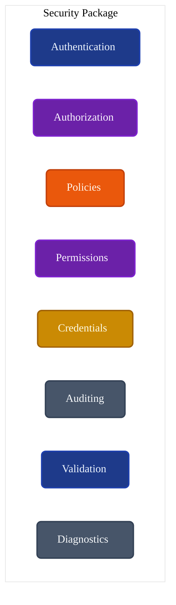
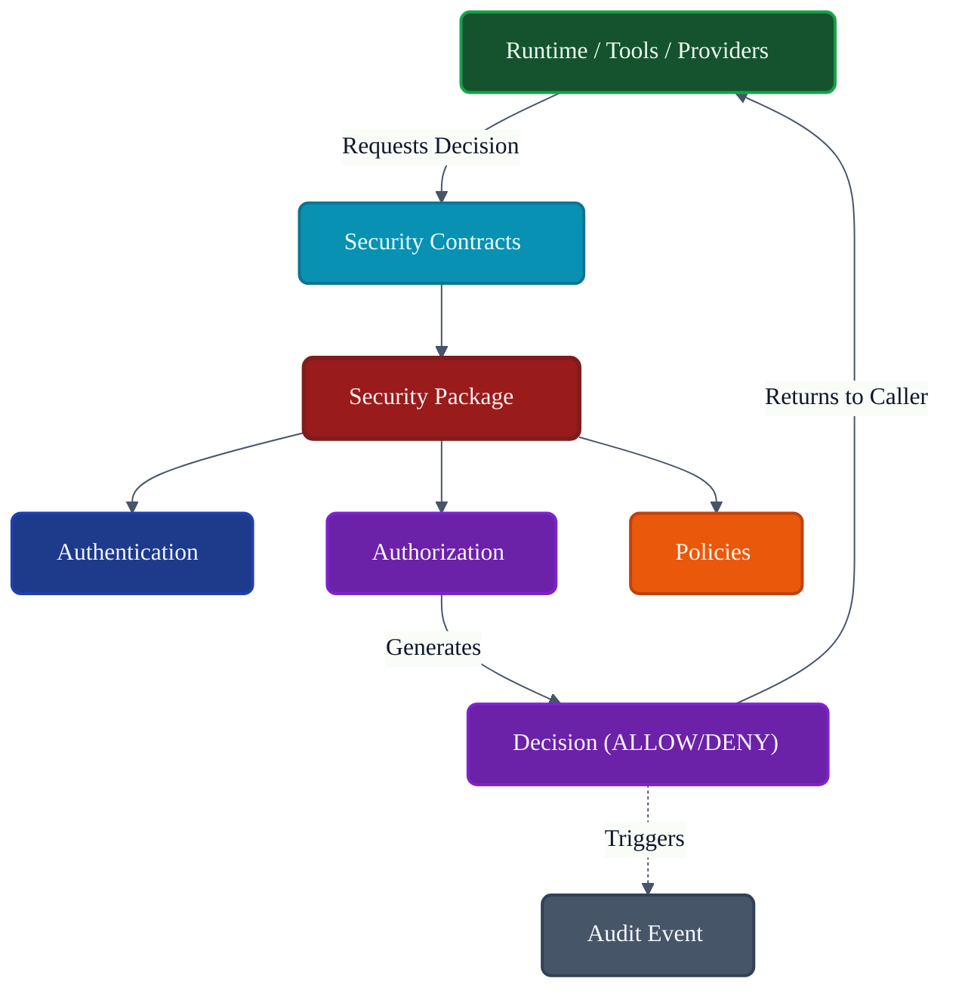
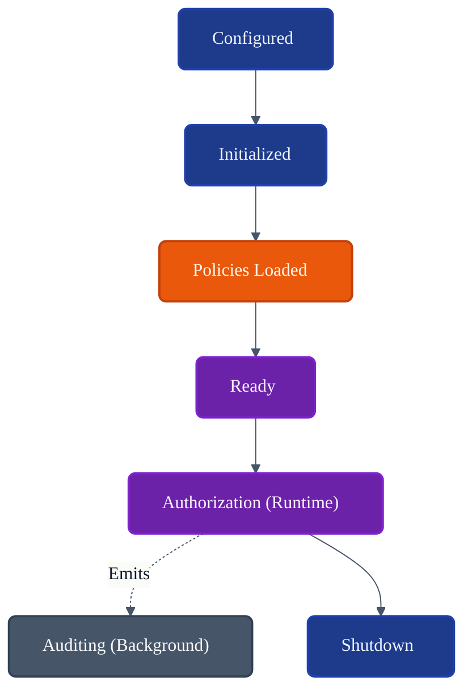
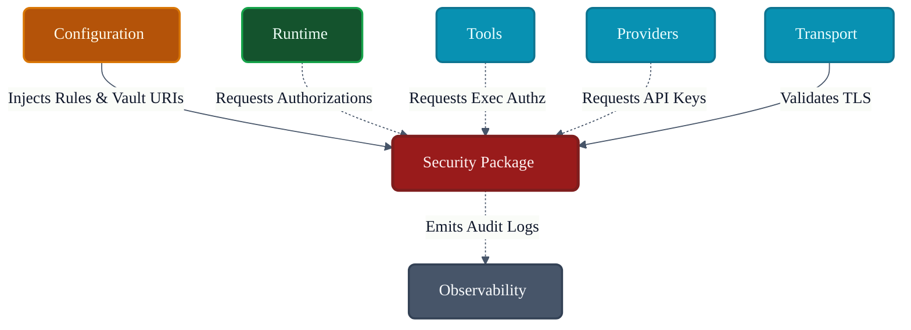

# VoxCore Security Package

This document defines the internal organization, security architecture, policy enforcement model, authorization framework, validation mechanisms, lifecycle integration, dependency boundaries, extension points, and implementation constraints of the Security package.

It answers exactly one engineering question: **"How is the Security package internally organized to provide centralized, extensible, and technology-independent security services throughout VoxCore?"**

The Security package is responsible for authentication integration, authorization, permission validation, policy enforcement, secret handling interfaces, credential lifecycle, request security validation, security diagnostics, and audit event generation. It is not responsible for runtime orchestration, provider execution, tool execution, transport implementation, persistence, or business logic.

---

## 1. Purpose

The Security package centralizes security policy enforcement while remaining independent of specific security technologies and algorithms.

Without centralized security:
* **Authorization becomes inconsistent**: Different controllers in the API might enforce different rules for the same domain object.
* **Permissions become duplicated**: Logic to check if a user "owns" an agent is copied into Tools, Memory, and Runtime packages.
* **Credentials leak across packages**: Raw API keys are passed around in logs or plain text fields instead of abstract handles.
* **Auditing becomes incomplete**: Tracking who executed what tool is impossible if enforcement is decentralized.
* **Security rules become difficult to maintain**: Updating a policy requires auditing the entire codebase.

The Security package ensures that all security decisions originate from one place, ensuring consistent, maintainable, and extensible protection across the entire platform.

---

## 2. Package Philosophy

The physical structure and implementation details of `voxcore/security` adhere to the following principles:

* **Security by Design**: Security is not an afterthought or a middleware wrapper; it is deeply integrated into the lifecycle of every request.
* **Centralized Policy Enforcement**: Only this package decides if an action is permitted. Other packages only *request* decisions.
* **Least Privilege**: The package defaults to `DENY`. Access must be explicitly granted.
* **Explicit Authorization**: Tools, Providers, and Runtime must proactively ask for authorization before execution.
* **Credential Isolation**: Keys, tokens, and passwords are never exposed directly to business logic. The system uses opaque handles/abstractions.
* **Framework Independence**: The package abstracts away JWTs, OAuth flows, and identity providers into generic Contracts.
* **Provider Independence**: Policies evaluate abstract roles and claims, completely unaware if the underlying Identity Provider is Okta, Auth0, or local DB.
* **Auditability**: Every security decision (Pass or Fail) is recorded.
* **Single Responsibility**: This package enforces rules; it does not define the business workflow.

---

## 3. Responsibilities

The package enforces a strict boundary between evaluating policies and executing logic.

| Responsibility | Description | Owned? |
| :--- | :--- | :--- |
| **Validate identities** | Confirm a request originates from a known entity. | **Yes** |
| **Authorize operations** | Decide if an identity can perform an action. | **Yes** |
| **Evaluate permissions** | Check specific constraints (e.g., "owns file X"). | **Yes** |
| **Manage credential access** | Securely resolve API keys for external services. | **Yes** |
| **Enforce policies** | Apply global security rules (e.g., block malicious IPs). | **Yes** |
| **Expose contracts** | Provide `ISecurityContext` to other packages. | **Yes** |
| **Generate audit events** | Emit records of access grants and denials. | **Yes** |
| **Expose diagnostics** | Provide telemetry on security failure rates. | **Yes** |
| **Runtime orchestration** | Running the agent loop. | *Delegated* (Runtime) |
| **Persistence** | Storing user accounts. | *Delegated* (Storage) |
| **Transport** | Negotiating TLS. | *Delegated* (Transport) |
| **Provider execution** | Sending prompts to LLMs. | *Delegated* (Providers) |
| **Tool execution** | Running external functions. | *Delegated* (Tools) |

---

## 4. Internal Package Structure

The `voxcore/security/` package is logically and physically structured to separate identity verification from policy enforcement.

### `authentication/`
* **Purpose**: Identity verification abstractions.
* **Responsibilities**: Adapting external identity tokens (e.g., JWT) into internal `ISecurityContext` objects.
* **Collaborators**: `permissions/`.
* **Visibility**: Internal.
* **Dependencies**: None.

### `authorization/`
* **Purpose**: Core decision engine.
* **Responsibilities**: Receiving authorization requests and coordinating with Policies and Permissions.
* **Collaborators**: `policies/`, `permissions/`, `auditing/`.
* **Visibility**: Public Boundary.
* **Dependencies**: None.

### `policies/`
* **Purpose**: Global rules and constraints.
* **Responsibilities**: Enforcing multi-tenant isolation, IP restrictions, and environment-wide security rules.
* **Collaborators**: `authorization/`.
* **Visibility**: Internal.
* **Dependencies**: `Configuration Package`.

### `permissions/`
* **Purpose**: Resource-level access control.
* **Responsibilities**: Evaluating ABAC (Attribute-Based Access Control) or RBAC (Role-Based Access Control) rules for specific actions.
* **Collaborators**: `authorization/`.
* **Visibility**: Internal.
* **Dependencies**: None.

### `credentials/`
* **Purpose**: Safe handling of sensitive values.
* **Responsibilities**: Resolving opaque credential references into usable keys just-in-time for Providers/Tools.
* **Collaborators**: `validation/`.
* **Visibility**: Public Boundary.
* **Dependencies**: `Configuration Package`.

### `auditing/`
* **Purpose**: Non-repudiation and security tracking.
* **Responsibilities**: Formatting and dispatching events regarding access decisions.
* **Collaborators**: `authorization/`.
* **Visibility**: Internal.
* **Dependencies**: `Observability Package`.

### `validation/`
* **Purpose**: Input security checks.
* **Responsibilities**: Sanitizing security-critical inputs (e.g., verifying safe paths for file tools).
* **Collaborators**: `credentials/`, `policies/`.
* **Visibility**: Internal.
* **Dependencies**: None.

### `diagnostics/`
* **Purpose**: Security system health.
* **Responsibilities**: Emitting metrics on failed logins, unauthorized access attempts.
* **Collaborators**: `Event Bus`.
* **Visibility**: Internal.
* **Dependencies**: `Contracts`.

---

## 5. Security Domains

The package organizes its functionality into distinct conceptual domains.

### Authentication
* **Purpose**: Answers "Who is making this request?" by parsing tokens or session data into an abstract `Identity`.

### Authorization
* **Purpose**: Answers "Is this Identity allowed to do this?"

### Permission Evaluation
* **Purpose**: Answers "Does this specific Identity have the `read` permission on `Resource_ID_123`?"

### Credential Access
* **Purpose**: Safely retrieves the `OPENAI_API_KEY` for the Runtime without logging it or exposing it to the UI.

### Policy Enforcement
* **Purpose**: Applies unconditional rules (e.g., "Deny all requests from region X regardless of user permissions").

### Audit Events
* **Purpose**: Creates an immutable record of every `ALLOW` or `DENY` decision.

### Secret Resolution
* **Purpose**: Translates an environment reference (like `SECRET:db_pass`) into actual bytes at the last possible moment.

---

## 6. Security Lifecycle

Security components follow a strict lifecycle mapped to the Runtime State Machines.

1. **Configuration**: Security settings (e.g., auth endpoints, credential vaults) are injected by the Configuration package.
2. **Initialization**: Security managers and evaluators are instantiated.
3. **Policy Loading**: Global security policies (e.g., RBAC definitions) are loaded into memory.
4. **Ready**: The system is prepared to accept access requests.
5. **Authorization**: During runtime, the API/Runtime actively queries the Security package.
6. **Auditing**: Every decision during the Authorization phase generates an Audit Event.
7. **Shutdown**: Security caches are cleared, and auditing queues are flushed.

---

## 7. Authorization Model

The Authorization model is the core capability of the Security package.

* **Identity Validation**: A raw request is mapped to a verified `ISecurityContext`.
* **Authorization Requests**: A package (e.g., Tools) requests permission: `Authorize(Context, Action="Execute", Resource="ShellTool")`.
* **Policy Matching**: Global policies are evaluated first (e.g., "Is the system in lockdown mode?").
* **Permission Evaluation**: Granular permissions are checked (e.g., "Does this context have the `tool.execute` role?").
* **Decision Generation**: A deterministic `ALLOW` or `DENY` is returned to the caller.
* **Audit Recording**: The decision, the context, the action, and the resource are packaged into a `SecurityAuditEvent` and emitted.

---

## 8. Credential Management

* **Credential Access**: External API keys are required by Providers (e.g., OpenAI) and Tools (e.g., GitHub).
* **Credential Isolation**: The Runtime never sees the raw API key. It passes a `CredentialReference` to the Provider.
* **Secret Resolution**: The Provider asks the Security package to resolve the `CredentialReference` just before making the HTTP request.
* **Rotation Awareness**: Credentials can be rotated in the background without restarting the Runtime.
* **Lifecycle Ownership**: The Security package owns the safe handling and wiping of credential memory. *Note: Concrete secret providers (e.g., AWS Secrets Manager clients) are injected via Plugins or Configuration.*

---

## 9. Public Package Boundary
* **Purpose**: Health check for security infrastructure.
* **Inputs**: None.
* **Outputs**: Status Object.
* **Preconditions**: None.
* **Postconditions**: None.
* **Failure Conditions**: Key Vault unreachable.
* **Side Effects**: N/A
* **Ownership**: N/A
* **Dependencies**: N/A
* **Thread Safety**: N/A
---

## 10. Dependency Rules

To maintain strict enforcement integrity:

* **Security implements Contracts**: Exposes `ISecurityManager`, `IAuthorizationPolicy`.
* **Security depends on Configuration**: Configuration dictates *where* the Identity Provider is; Security enforces it.
* **Runtime requests security decisions**: Runtime executes the pipeline, but pauses to ask Security if the next step is allowed.
* **Providers never bypass Security**: Providers must request `ResolveCredential` via Contracts.
* **Tools never bypass authorization**: Tool execution is wrapped in an `Authorize()` check.
* **Security shall never invoke Runtime orchestration**: Security does not trigger workflows. It only answers questions.

---

## 11. Collaboration
* **Initiator**: N/A
* **Owner**: N/A
* **Depends On**: N/A
* **Publishes**: N/A
* **Receives**: N/A
---

## 12. Package Invariants

The following invariants must hold true under all conditions:

1. **Every protected operation requires authorization.** (Fail-safe defaults; un-annotated endpoints default to DENY).
2. **Security policies have one authoritative owner.** (Logic is never duplicated in the API controllers).
3. **Credentials never leak outside security abstractions.** (Logs and telemetry automatically redact sensitive data).
4. **Audit events are generated for security-relevant operations.** (Non-repudiation is guaranteed).
5. **Security remains provider-independent.** (The system does not care if JWTs come from Azure AD or AWS Cognito).
6. **Security decisions are deterministic for identical inputs where practical.**

---

## 13. Failure Behaviour

* **Authentication failure**: Invalid tokens result in immediate 401 Unauthorized equivalent. No further processing occurs.
* **Authorization failure**: Lack of permissions results in a 403 Forbidden equivalent and an Audit Event.
* **Credential unavailable**: If a secret vault goes offline, operations requiring that secret fail securely (fail closed).
* **Policy conflict**: If two policies contradict, the most restrictive policy (DENY) always wins.
* **Configuration error**: Invalid security configuration (e.g., malformed RBAC file) halts the boot process entirely.
* **Audit failure**: If the audit sink is unreachable, the system may halt or degrade gracefully based on configuration (fail-closed auditing).
* **Recovery boundaries**: Security failures are fatal for the specific request. The system does not "retry" an unauthorized action.

---

## 14. Extension Points

The Security package is designed for modular enhancement:
* **New authentication providers**: Adding SAML or biometric adapters.
* **New authorization policies**: Implementing custom OPA (Open Policy Agent) integration.
* **New permission evaluators**: Adding relationship-based access control (ReBAC).
* **New credential providers**: Integrating with CyberArk or HashiCorp Vault.
* **New audit sinks**: Pushing audit logs directly to a SIEM.

---

## 15. Design Constraints

* **Security shall remain policy-focused.**
* **Security shall not implement runtime orchestration.**
* **Security shall not expose credentials.** (No global variable holding raw keys).
* **Security shall not contain business logic.**
* **Security shall remain framework-independent.**
* **Security shall remain cohesive.**

---

## 16. Traceability

| Security Module | Derived From | Primary Consumer |
| :--- | :--- | :--- |
| `authorization/`| Zero Trust Architecture | Runtime / API |
| `credentials/` | Secure Enclave Req. | Providers / Tools |
| `auditing/` | Compliance / Non-Repudiation | Observability |
| `policies/` | Multi-Tenant Isolation | `authorization/` |

---

## 17. Conclusion

The Security package provides centralized, extensible, and technology-independent security enforcement for VoxCore while preserving architectural boundaries and ensuring consistent authorization, credential management, and auditing. By forcing all packages to request decisions rather than implement their own security logic, VoxCore guarantees a robust, predictable, and fully auditable security posture.

---

## Required Tables

### Table 1: Documentation Relationships

| Document | Responsibility |
| :--- | :--- |
| **Package Responsibilities** | Defines Security package ownership. |
| **Contracts Package** | Defines security contracts. |
| **Configuration Package** | Supplies security configuration. |
| **Runtime Package** | Requests authorization decisions. |
| **Transport Package** | Applies transport security requirements. |
| **Providers Package** | Consumes credential services. |
| **Tools Package** | Requests execution authorization. |
| **Observability Package** | Records audit and security events. |
| **Security Package (This Doc)**| Defines policy enforcement architecture. |

### Table 2: Responsibilities Matrix

| Responsibility | Owner | Delegated To |
| :--- | :--- | :--- |
| **Policy Evaluation** | Security Package | N/A |
| **Credential Resolution**| Security Package | N/A |
| **Audit Event Generation**| Security Package | N/A |
| **Log Storage (SIEM)** | N/A | Observability Package |
| **Workflow Execution** | N/A | Runtime Package |

### Table 3: Security Domains

| Domain | Purpose | Consumer |
| :--- | :--- | :--- |
| **Authentication** | Validates Identity. | API / Transport |
| **Authorization** | Enforces Permissions. | Runtime / Tools |
| **Credentials** | Protects Secrets. | Providers / Tools |
| **Auditing** | Non-Repudiation. | Observability |

### Table 4: Authorization Responsibilities

| Stage | Owner | Outcome |
| :--- | :--- | :--- |
| **Configuration** | Security Package | Policies loaded into memory. |
| **Request Authz** | Calling Package | Halts execution to request decision. |
| **Evaluation** | Security Package | Checks context against policies. |
| **Decision** | Security Package | Returns ALLOW or DENY. |
| **Audit** | Security Package | Emits telemetry of the decision. |

### Table 5: Dependency Rules

| Rule | Reason |
| :--- | :--- |
| **Centralized Enforcement**| Prevents scattered, inconsistent security checks. |
| **Default Deny** | Protects against accidental exposure. |
| **Abstract Contexts** | Prevents tying business logic to JWT specifics. |

### Table 6: Package Invariants

| Invariant | Reason |
| :--- | :--- |
| **Opaque Credentials** | Raw keys must never appear in business logic or logs. |
| **Immutable Audits** | A decision must result in a permanent record. |
| **Fail-Closed** | A crashed policy evaluator defaults to DENY. |

### Table 7: Traceability Matrix

| Security Module | Origin | Consumer |
| :--- | :--- | :--- |
| `authorization/`| Application Security | Platform Wide |
| `authentication/`| Identity Verification | Transport / API |
| `validation/` | Input Sanitization | External Clients |

---

## Required Diagrams

### Diagram 1: Security Package Structure

### Diagram 2: Security Decision Flow

### Diagram 3: Security Lifecycle

### Diagram 4: Package Collaboration

