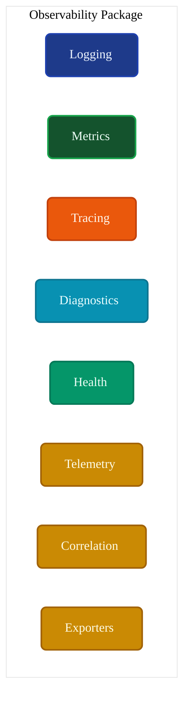
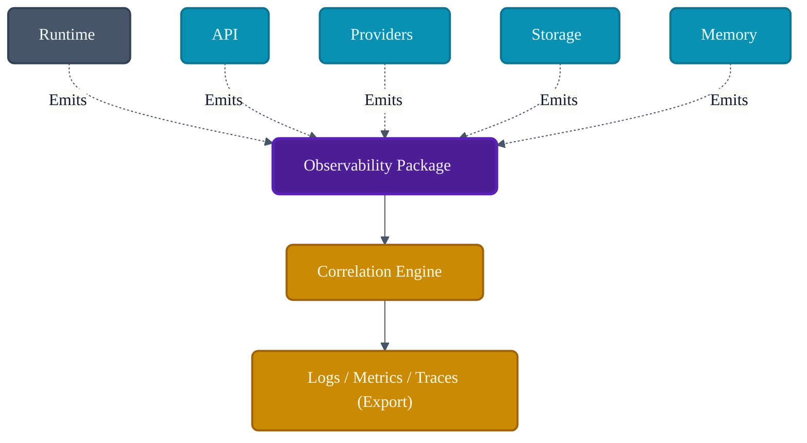
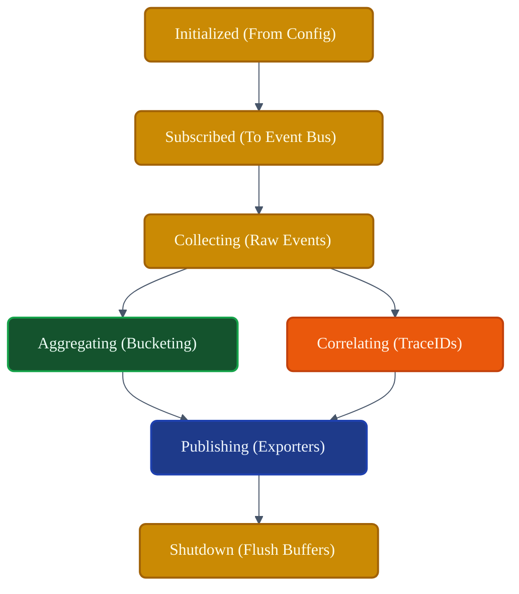
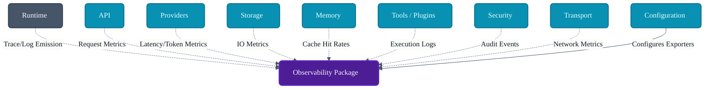

# VoxCore Observability Package

This document defines the internal organization, telemetry architecture, logging model, metrics collection, tracing model, diagnostics framework, health monitoring, dependency boundaries, extension points, and implementation constraints of the Observability package.

It answers exactly one engineering question: **"How is the Observability package internally organized to provide comprehensive visibility into VoxCore without influencing runtime behaviour?"**

The Observability package is responsible for logging, metrics, tracing, diagnostics, health reporting, telemetry collection, event correlation, and monitoring interfaces. It is not responsible for runtime orchestration, business logic, provider execution, security enforcement, persistence, transport, or scheduling.

---

## 1. Purpose

The Observability package provides complete visibility into the platform's internal state while remaining entirely independent of execution logic.

Without centralized observability:
* **Diagnostics become fragmented**: Each subsystem logs directly to `stdout` in different formats.
* **Logs become inconsistent**: Correlating a Tool failure with the LLM prompt that triggered it becomes impossible without a unified Trace ID.
* **Failures become difficult to investigate**: Silent drops in API connections are missed because no component aggregates timeout metrics.
* **Monitoring becomes incomplete**: Infrastructure dashboards lack granular agent-level metrics.
* **System behaviour becomes opaque**: The system functions as a black box, making long-term optimization guesswork.

The Observability package acts as the nervous system of VoxCore, sensing and reporting on everything while never interfering with the system's actions.

---

## 2. Package Philosophy

The physical structure and implementation details of `voxcore/observability` adhere to the following principles:

* **Passive Observation**: Observability observes. It never changes system behaviour, aborts requests, or modifies inputs.
* **Single Telemetry Pipeline**: All packages emit telemetry through a unified API defined in Contracts.
* **Structured Diagnostics**: Logs are emitted as structured data (JSON), not concatenated strings, enabling machine parsing.
* **Correlation Over Duplication**: A single `TraceID` links a user's web request down to the lowest database query, preventing duplicated context logging.
* **Framework Independence**: The package abstracts away specific exporters (e.g., Prometheus, Datadog, Jaeger).
* **Provider Independence**: A metric is recorded as `llm_token_latency`, independent of whether it came from OpenAI or a local LLaMA model.
* **Low Overhead**: Telemetry collection must never become a bottleneck for the Runtime. Emitting events is asynchronous.
* **Separation of Observation and Behaviour**: No business logic relies on reading a log or a metric to make a decision.

---

## 3. Responsibilities

The package enforces a strict boundary between collecting data and executing logic.

| Responsibility | Description | Owned? |
| :--- | :--- | :--- |
| **Collect logs** | Aggregating structured debug/info/error messages. | **Yes** |
| **Collect metrics** | Recording counters, gauges, and histograms. | **Yes** |
| **Collect traces** | Managing distributed spans and causality graphs. | **Yes** |
| **Collect health** | Probing component liveness and readiness. | **Yes** |
| **Correlate telemetry** | Linking logs and metrics to a unified Trace ID. | **Yes** |
| **Expose diagnostics** | Providing endpoints/sinks for internal system state. | **Yes** |
| **Aggregate telemetry** | Buffering and batching telemetry for efficient export. | **Yes** |
| **Expose contracts** | Fulfilling `ILogger`, `IMetrics`, `ITracer`. | **Yes** |
| **Runtime execution** | Operating the Agent Loop. | *Delegated* (Runtime) |
| **Business logic** | Deciding the next action based on context. | *Delegated* (API) |
| **Security decisions** | Validating user permissions. | *Delegated* (Security) |
| **Provider execution** | Communicating with external LLMs. | *Delegated* (Providers) |
| **Persistence** | Storing chat histories permanently. | *Delegated* (Storage) |

---

## 4. Internal Package Structure

The `voxcore/observability/` package is logically and physically structured to separate telemetry collection from telemetry export.

### `logging/`
* **Purpose**: Structured log processing.
* **Responsibilities**: Formatting, filtering, and buffering application logs.
* **Collaborators**: `correlation/`, `exporters/`.
* **Visibility**: Internal.
* **Dependencies**: None.

### `metrics/`
* **Purpose**: Quantitative measurement aggregation.
* **Responsibilities**: Maintaining in-memory counters, gauges, and histograms (e.g., `active_sessions`, `request_latency`).
* **Collaborators**: `exporters/`.
* **Visibility**: Internal.
* **Dependencies**: None.

### `tracing/`
* **Purpose**: Distributed execution tracking.
* **Responsibilities**: Propagating Trace IDs, creating Spans, and measuring operation durations.
* **Collaborators**: `correlation/`, `exporters/`.
* **Visibility**: Internal.
* **Dependencies**: None.

### `diagnostics/`
* **Purpose**: Internal system introspection.
* **Responsibilities**: Profiling memory, tracking thread counts, dumping stack traces on fatal errors.
* **Collaborators**: `logging/`.
* **Visibility**: Internal.
* **Dependencies**: None.

### `health/`
* **Purpose**: Component status monitoring.
* **Responsibilities**: Polling subsystem readiness and aggregating liveness indicators.
* **Collaborators**: `exporters/`.
* **Visibility**: Public Boundary.
* **Dependencies**: None.

### `telemetry/`
* **Purpose**: Unified ingestion point.
* **Responsibilities**: The facade that implements `ITelemetry` from Contracts, bridging incoming events to logging, metrics, and tracing.
* **Collaborators**: `logging/`, `metrics/`, `tracing/`.
* **Visibility**: Public Boundary.
* **Dependencies**: `Contracts`.

### `correlation/`
* **Purpose**: Data enrichment.
* **Responsibilities**: Automatically attaching `TraceID`, `SessionID`, and `TenantID` to all logs and metrics emitted during an active context.
* **Collaborators**: `telemetry/`.
* **Visibility**: Internal.
* **Dependencies**: None.

### `exporters/`
* **Purpose**: External data delivery.
* **Responsibilities**: Formatting and dispatching telemetry to sinks (e.g., stdout, OpenTelemetry Collector, Prometheus).
* **Collaborators**: `logging/`, `metrics/`, `tracing/`.
* **Visibility**: Internal.
* **Dependencies**: `Configuration`.

---

## 5. Observability Domains

The package organizes telemetry into distinct conceptual domains.

### Logging
* **Purpose**: High-fidelity, discrete textual records of system events.
* **Consumer**: Operators, Developers, Log Aggregation Systems (ELK/Splunk).
* **Data Ownership**: Observability owns the formatting and export; Packages own the content.

### Metrics
* **Purpose**: Aggregated numerical data over time (e.g., requests per second, error rates).
* **Consumer**: Monitoring dashboards, Auto-scalers.
* **Data Ownership**: Observability owns the aggregation bins.

### Distributed Tracing
* **Purpose**: Tracking the causal chain of operations across boundaries.
* **Consumer**: Performance profilers, APM tools.
* **Data Ownership**: Observability owns the Span lifecycle and ID propagation.

### Health Monitoring
* **Purpose**: Binary or categorical representation of system availability (Up, Down, Degraded).
* **Consumer**: Load balancers, Kubernetes readiness probes.
* **Data Ownership**: Observability polls; Packages provide their own status.

### Diagnostics
* **Purpose**: Deep internal introspection (heap dumps, thread states).
* **Consumer**: Core Developers debugging critical failures.
* **Data Ownership**: Observability entirely.

### Telemetry Correlation
* **Purpose**: Ensuring Log X, Metric Y, and Trace Z share the same contextual identifiers.
* **Consumer**: Observability Exporters.
* **Data Ownership**: Observability entirely.

### Audit Event Collection
* **Purpose**: Special routing for `SecurityAuditEvents` ensuring 100% durability and tamper evidence.
* **Consumer**: SIEM (Security Information and Event Management).
* **Data Ownership**: Security owns the event; Observability owns the delivery.

---

## 6. Observability Lifecycle

Observability components follow a strict lifecycle mapped to the Runtime State Machines.

1. **Initialization**: Exporters, buffers, and correlation engines are instantiated based on configuration.
2. **Telemetry Subscription**: Observability binds to the Runtime Event Bus to passively listen for telemetry.
3. **Collection**: Raw logs, metrics, and traces are received from other packages.
4. **Aggregation**: Metrics are bucketed; logs are enriched with correlation IDs.
5. **Correlation**: Context variables are applied universally across the current execution scope.
6. **Exposure**: Data is pushed (via HTTP/gRPC to a collector) or pulled (via a `/metrics` HTTP endpoint).
7. **Shutdown**: Buffers are forcefully flushed to ensure no telemetry is lost before the process exits.

---

## 7. Telemetry Model

* **Telemetry Production**: Any package can emit telemetry via `Contracts.ITelemetry`.
* **Telemetry Collection**: The Observability package buffers incoming telemetry to prevent blocking the main execution thread.
* **Normalization**: Custom fields are mapped to a standard schema (e.g., standardizing `user_id` vs `uid`).
* **Aggregation**: High-frequency metrics (e.g., token generation) are batched before export.
* **Correlation**: Context (TraceID) injected at the API boundary implicitly wraps all subsequent emissions down the call stack.
* **Exposure**: Data is serialized for the specific exporter configured.

*Note: Telemetry producers NEVER depend on telemetry consumers. A Tool does not know if its log is going to stdout or Datadog.*

---

## 8. Health Monitoring

* **Health Probes**: External systems query the Observability package for system health.
* **Readiness**: Is the system ready to accept traffic? (Returns False during boot or heavy degradation).
* **Liveness**: Is the process fundamentally running? (Returns False if deadlocked).
* **Component Health**: Subsystems (Storage, Providers) report their individual connectivity status.
* **Dependency Health**: Tracks the uptime of external LLMs or databases.
* **Degraded State Reporting**: The system may be alive but missing a non-critical Plugin, returning `Degraded` instead of `Down`.

---

## 9. Public Package Boundary
* **Purpose**: Pull-based metric exposure (e.g., for Prometheus).
* **Inputs**: Format requirement.
* **Outputs**: Formatted Metric String.
* **Preconditions**: None.
* **Postconditions**: None.
* **Failure Conditions**: None.
* **Side Effects**: N/A
* **Ownership**: N/A
* **Dependencies**: N/A
* **Thread Safety**: N/A
---

## 10. Dependency Rules

To maintain strict enforcement integrity:

* **Observability implements Contracts**: Exposes `ILogger`, `IMetrics`, `ITelemetry`.
* **Observability shall never invoke Runtime behaviour**: It does not trigger workflows or retry failed actions.
* **Packages emit telemetry only through Contracts**: They do not import `prometheus_client` or `logging`.
* **Observability shall remain passive**: It listens and exports.
* **Observability shall not coordinate execution**: It has no concept of the Agent Loop.
* **Observability shall not contain business logic**: It does not care *why* a prompt failed, only that the `prompt_failure` metric was incremented.

---

## 11. Collaboration
* **Initiator**: N/A
* **Owner**: N/A
* **Depends On**: N/A
* **Publishes**: N/A
* **Receives**: N/A
---

## 12. Package Invariants

The following invariants must hold true under all conditions:

1. **Observability never changes system behaviour.** (A failed log export must not crash a user request).
2. **Telemetry is append-only from the package perspective.** (Past metrics cannot be rewritten).
3. **Logs, metrics, and traces remain independent concerns.** (They can be routed to different sinks).
4. **Telemetry contracts remain stable.** (Updating from Datadog to New Relic requires zero changes to the `Runtime`).
5. **Diagnostics remain provider-independent.**
6. **Every component may emit telemetry, but only Observability owns its processing.**

---

## 13. Failure Behaviour

* **Telemetry loss**: If buffers overflow under extreme load, telemetry is silently dropped to protect the Runtime. Observability must never OOM the system.
* **Metric collection failure**: If an exporter (e.g., Prometheus) is unreachable, metrics are retained in-memory up to a configured threshold.
* **Logging failure**: If stdout/disk is full, logs are discarded.
* **Trace collection failure**: Traces are dropped if the collector is down.
* **Exporter unavailable**: Fails gracefully; logs an internal diagnostic warning but does not disrupt the application.
* **Diagnostics degradation**: If internal profiling becomes too heavy, it automatically disables itself.
* **Recovery boundaries**: Observability is entirely fail-safe. If the package crashes internally, the rest of VoxCore continues to run blindly.

---

## 14. Extension Points

The Observability package is designed for infrastructural extension:
* **New telemetry exporters**: Adding an OpenTelemetry gRPC exporter.
* **New metrics**: Creating custom domain-specific aggregations without modifying the generic engine.
* **New tracing integrations**: Supporting AWS X-Ray format.
* **New health probes**: Adding a deep-inspection health check for a custom vector database.
* **Future monitoring integrations**: Native support for desktop IDE telemetry (MCP logs).

---

## 15. Design Constraints

* **Observability shall remain passive.**
* **Observability shall never coordinate runtime behaviour.**
* **Observability shall not influence execution decisions.**
* **Observability shall remain provider-independent.**
* **Observability shall remain framework-independent.** (Avoid hard-locking to specific monitoring SDKs in the core).
* **Observability shall remain cohesive.**

---

## 16. Traceability

| Observability Module | Derived From | Primary Consumer |
| :--- | :--- | :--- |
| `telemetry/` | Decoupling Req. | All Packages |
| `correlation/` | Debuggability Req. | `exporters/` |
| `health/` | Infrastructure Req. | Load Balancers |
| `exporters/` | Flexibility Req. | External Dashboards |

---

## 17. Conclusion

The Observability package provides centralized visibility into the VoxCore platform through logging, metrics, tracing, diagnostics, and health monitoring while remaining completely independent of runtime behaviour. By guaranteeing that telemetry collection is passive, non-blocking, and abstracted behind Contracts, VoxCore ensures deep operational insight without risking the stability or performance of the core agentic runtime.

---

## Required Tables

### Table 1: Documentation Relationships

| Document | Responsibility |
| :--- | :--- |
| **Package Responsibilities** | Defines Observability package ownership. |
| **Contracts Package** | Defines observability contracts. |
| **Runtime Package** | Emits runtime telemetry. |
| **Providers Package** | Emits provider telemetry. |
| **Tools Package** | Emits execution telemetry. |
| **Security Package** | Emits audit events. |
| **Storage Package** | Emits persistence metrics. |
| **Configuration Package** | Configures observability. |
| **Observability Package (This Doc)**| Defines processing, diagnostics, and monitoring. |

### Table 2: Responsibilities Matrix

| Responsibility | Owner | Delegated To |
| :--- | :--- | :--- |
| **Log Formatting** | Observability Package | N/A |
| **Metric Aggregation** | Observability Package | N/A |
| **Trace Propagation**| Observability Package | N/A |
| **Telemetry Generation**| N/A | All Other Packages |
| **Application Logic**| N/A | Runtime / API |

### Table 3: Observability Domains

| Domain | Purpose | Consumer |
| :--- | :--- | :--- |
| **Logging** | Discrete event text. | Developers / Splunk |
| **Metrics** | Numerical aggregations. | Dashboards / Scalers |
| **Tracing** | Causal chain visualization. | APM Tools |
| **Health** | Component liveness checks. | Kubernetes / LBs |
| **Diagnostics** | Internal profiling. | Core Maintainers |

### Table 4: Telemetry Flow

| Stage | Producer | Consumer |
| :--- | :--- | :--- |
| **Emission** | Runtime, Providers, Tools | Observability (telemetry facade) |
| **Correlation** | Observability (internal) | Observability (internal) |
| **Aggregation** | Observability (internal) | Observability (internal) |
| **Exporting** | Observability (exporters) | External Sinks (Datadog/Prometheus) |

### Table 5: Dependency Rules

| Rule | Reason |
| :--- | :--- |
| **Passive Listening** | Prevents Observability from creating infinite loops. |
| **Abstract Emission**| Prevents coupling the Runtime to OpenTelemetry SDKs. |
| **Fail-Safe Processing**| Telemetry failure must never crash the application. |

### Table 6: Package Invariants

| Invariant | Reason |
| :--- | :--- |
| **Append-Only** | Telemetry represents history; it cannot be altered. |
| **No Reverse Flow** | Observability never sends control commands back to Runtime. |
| **Isolated Buffers** | Prevents metric spikes from consuming all system RAM. |

### Table 7: Traceability Matrix

| Observability Module | Origin | Consumer |
| :--- | :--- | :--- |
| `metrics/` | Operational Visbility | Exporters / Dashboards |
| `tracing/` | Distributed Arch Req. | APM / Developers |
| `telemetry/` | Dependency Inversion | All VoxCore Packages |

---

## Required Diagrams

### Diagram 1: Observability Package Structure

### Diagram 2: Platform Telemetry Flow

### Diagram 3: Observability Lifecycle

### Diagram 4: Package Collaboration

