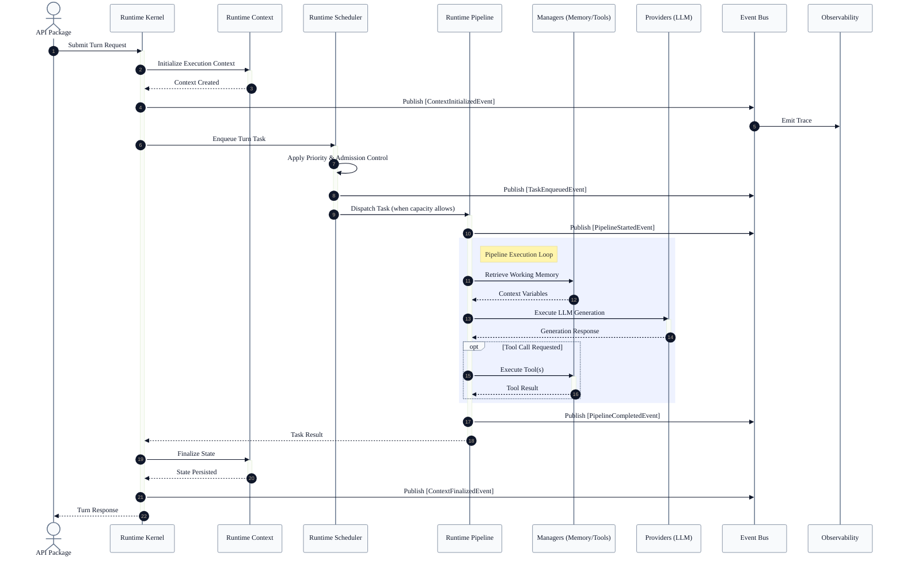

# Master Runtime Sequence

This document provides the definitive end-to-end execution flow of the VoxCore runtime. It demonstrates how a single external request propagates through the internal subsystems, highlighting lifecycle synchronization and ownership boundaries.

It answers exactly one engineering question: **"How do the distinct runtime subsystems coordinate to fulfill an execution turn without violating encapsulation?"**

---

## 1. End-to-End Sequence Diagram

The following diagram illustrates the master execution sequence of a single Agent turn.

---

## 2. Lifecycle Synchronization

The VoxCore runtime strictly isolates state machine ownership. When a state transition occurs in one subsystem, it must be synchronized with other subsystems solely via the `Event Bus`. 

*No subsystem directly mutates the state machine of another subsystem.*

### Synchronization Sequence

1. **Pipeline Completes Execution**
   * **Owner**: `Runtime Pipeline`
   * **Action**: Transitions its internal stage to `Completed` or `Failed`.
   * **Emission**: Dispatches `PipelineCompletedEvent` to the Event Bus.

2. **Scheduler Reclaims Capacity**
   * **Owner**: `Runtime Scheduler`
   * **Trigger**: Observes the `PipelineCompletedEvent` or receives explicit task resolution from the Pipeline promise.
   * **Action**: Transitions the Task state from `Running` to `Completed`. Removes the task from the active queue.

3. **Event Bus Fans Out**
   * **Owner**: `Event Bus`
   * **Trigger**: Continues delivering events to all passive subscribers.
   * **Action**: Delivers termination events to the `Observability` package for latency calculation and metric flushing.

4. **Kernel Finalizes Turn**
   * **Owner**: `Runtime Kernel`
   * **Trigger**: Receives control flow back from the Scheduler/Pipeline promise chain.
   * **Action**: Transitions the Session state. Instructs the `Runtime Context` to commit state changes to storage.

### Ownership Matrix

| State Machine | Owned By | Mutated By | Synchronized Via |
| :--- | :--- | :--- | :--- |
| **System Lifecycle** | `Runtime Kernel` | Kernel Internals | `SystemStateEvent` |
| **Session Lifecycle** | `Runtime Kernel` | Kernel Internals | `SessionStateEvent` |
| **Task Queue State** | `Runtime Scheduler` | Scheduler Internals | `TaskStateEvent` |
| **Pipeline Stage** | `Runtime Pipeline` | Pipeline Internals | `PipelineStageEvent` |
| **Context State** | `Runtime Context` | Pipeline / Kernel | `ContextStateEvent` |
