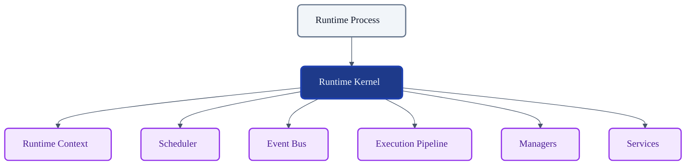
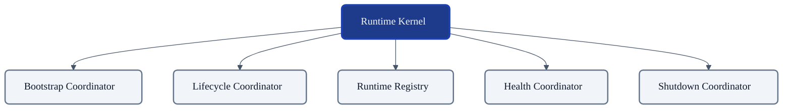
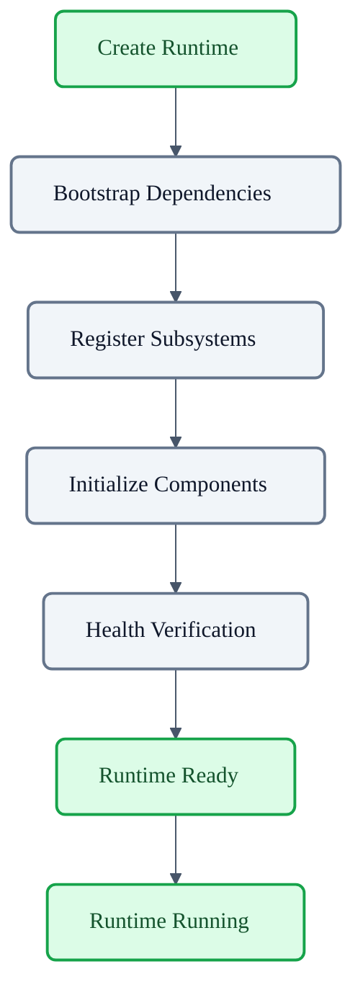
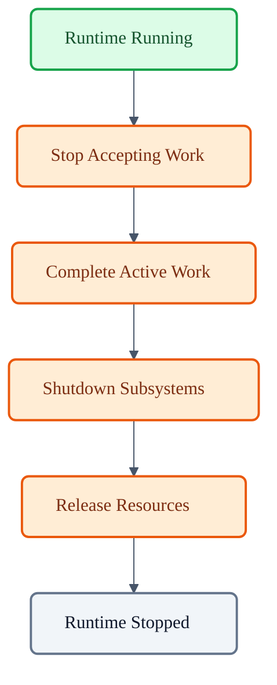

# VoxCore Runtime Kernel

This document defines the internal design, responsibilities, ownership boundaries, lifecycle, public interface, internal modules, and collaboration model of the Runtime Kernel. 

It answers exactly one engineering question: **"How is the Runtime Kernel internally designed to coordinate and govern the execution of the VoxCore runtime?"**

This document shall NOT define scheduling algorithms, event routing, pipeline execution, provider implementations, or runtime context internals. The Runtime Kernel is the orchestration core of the runtime—not the implementation of every runtime subsystem.

---

## 1. Purpose

The Runtime Kernel exists to provide centralized orchestration while preserving subsystem independence. 

Without a Runtime Kernel:
* **Subsystem startup becomes inconsistent**: Modules initialize in unpredictable orders, causing dependency violations.
* **Ownership becomes fragmented**: No single entity is responsible for the overall lifecycle of the execution environment.
* **Shutdown becomes unreliable**: Subsystems may terminate prematurely while others are still processing work, leading to corrupted states or memory leaks.
* **Runtime coordination becomes distributed**: Bootstrapping and health checks become scattered across unrelated components.
* **Lifecycle management becomes difficult**: Diagnosing process-level failures becomes impossible due to a lack of centralized authority.

---

## 2. Runtime Kernel Philosophy

The design of the Runtime Kernel must adhere to the following principles:

* **Centralized Orchestration**: The Kernel acts as the single authoritative conductor for starting, stopping, and verifying the runtime execution state.
* **Distributed Responsibility**: While orchestration is centralized, the actual workload (scheduling, event routing) is distributed to specialized subsystems.
* **Explicit Ownership**: The Kernel explicitly owns the lifecycle progression of the runtime environment, ensuring transitions follow defined state machines.
* **Minimal Knowledge**: The Kernel must know *that* a subsystem exists and how to start/stop it, but must not know *how* that subsystem implements its internal logic.
* **Lifecycle Governance**: Every transition of the runtime process is validated and driven by the Kernel.
* **Framework Independence**: The Kernel remains completely agnostic to web frameworks, persistence layers, and dependency injection libraries.
* **Subsystem Isolation**: Subsystems are orchestrated by the Kernel but execute in isolation, interacting only through defined interfaces (like the Event Bus).
* **Controlled Coordination**: Interactions during startup, shutdown, and health verifications are strictly sequenced and governed.

---

## 3. Responsibilities

The Runtime Kernel explicitly distinguishes between responsibilities it owns and operations it delegates.

| Responsibility | Description | Owned? |
| :--- | :--- | :--- |
| **Runtime initialization** | Bootstrapping the application execution environment. | **Yes** |
| **Runtime shutdown** | Sequencing graceful termination of all runtime components. | **Yes** |
| **Runtime lifecycle coordination** | Validating and executing state machine transitions for the `Runtime`. | **Yes** |
| **Runtime subsystem registration** | Maintaining a registry of active, verified subsystems. | **Yes** |
| **Startup sequencing** | Ensuring dependencies start in the correct dependency graph order. | **Yes** |
| **Shutdown sequencing** | Ensuring modules drain and terminate in reverse initialization order. | **Yes** |
| **Runtime readiness verification** | Polling subsystems to confirm the runtime is ready for external traffic. | **Yes** |
| **Task Execution** | Orchestrating and completing individual units of work. | *Delegated* |
| **Message Routing** | Pushing events between decoupled subsystems. | *Delegated* |
| **Session Management** | Handling user connections and connection states. | *Delegated* |

---

## 4. Internal Module Decomposition

To achieve its orchestration goals, the Runtime Kernel is logically divided into specialized internal modules. These represent conceptual groupings of responsibility, not necessarily discrete implementation classes.

### RuntimeBootstrapCoordinator
* **Purpose**: Manages the initial process start sequence and dependency graph resolution.
* **Responsibilities**: Invokes startup routines, reads bootstrap configurations, and instantiates core subsystems.
* **Collaborators**: `RuntimeRegistry`, `RuntimeLifecycleCoordinator`.
* **Ownership**: Owns the transient transition from `Created` to `Initializing`.

### RuntimeLifecycleCoordinator
* **Purpose**: Enforces the formal state machine transitions for the `Runtime` entity.
* **Responsibilities**: Validates state changes, ensures invariants hold, and commands state shifts.
* **Lifecycle ownership**: Strictly implements the `Runtime` lifecycle defined in *Runtime State Machines*.

### RuntimeRegistry
* **Purpose**: Maintains stable references to active, validated runtime subsystems.
* **Responsibilities**: Stores and retrieves references to the Scheduler, Event Bus, Managers, and Context.
* **Constraints**: It does not own subsystem implementation; it only holds their interface references for coordination.

### RuntimeHealthCoordinator
* **Purpose**: Monitors runtime readiness and subsystem health across the execution window.
* **Responsibilities**: Aggregates subsystem readiness probes, triggers recovery escalation on degradation, and updates the `RuntimeContext` health flag.

### RuntimeShutdownCoordinator
* **Purpose**: Orchestrates the graceful teardown of the execution environment.
* **Responsibilities**: Blocks new traffic, drains queues, commands subsystem termination, and releases process locks.

---

## 5. Public Interface

The Runtime Kernel exposes a minimal set of conceptual operations to the hosting application process.

### Initialize Runtime
* **Purpose**: Boots the kernel and registers subsystems.
* **Inputs**: Bootstrap configurations.
* **Outputs**: Initialized `Runtime` entity.
* **Preconditions**: Process is starting; no existing Kernel instance is running.
* **Postconditions**: Subsystems are instantiated and registered; State is `Initializing`.
* **Failure conditions**: Invalid configuration or dependency resolution failure.

### Start Runtime
* **Purpose**: Commands the kernel to become active and begin accepting work.
* **Inputs**: None.
* **Outputs**: Boolean readiness confirmation.
* **Preconditions**: Runtime is `Ready`.
* **Postconditions**: Runtime is `Running`; subsystems are accepting traffic.
* **Failure conditions**: Health verification fails.

### Stop Runtime
* **Purpose**: Commands the kernel to cease accepting new work and prepare for shutdown.
* **Inputs**: None.
* **Outputs**: None.
* **Preconditions**: Runtime is `Running`.
* **Postconditions**: Runtime is `Shutting Down`; ingress is blocked.
* **Failure conditions**: N/A (Stopping is a forced internal state).

### Shutdown Runtime
* **Purpose**: Forces complete termination and resource cleanup.
* **Inputs**: Grace period timeout.
* **Outputs**: None.
* **Preconditions**: Runtime is `Shutting Down`.
* **Postconditions**: Runtime is `Stopped`.
* **Failure conditions**: Subsystem hangs, resulting in a hard kill.

### Query Runtime Status
* **Purpose**: Returns the aggregate health and lifecycle state of the engine.
* **Inputs**: None.
* **Outputs**: Current lifecycle state and health vector.
* **Preconditions**: None.
* **Postconditions**: None (read-only).

### Register Runtime Component
* **Purpose**: Mounts a dynamically loaded subsystem into the Kernel.
* **Inputs**: Component interface reference.
* **Outputs**: Registration success flag.
* **Preconditions**: Runtime is `Initializing`.
* **Postconditions**: Component is added to the `RuntimeRegistry`.
* **Failure conditions**: Identity collision or incompatible interface.

### Deregister Runtime Component
* **Purpose**: Removes a subsystem from the orchestration graph.
* **Inputs**: Component identity.
* **Outputs**: None.
* **Preconditions**: Runtime is `Shutting Down` or component has crashed.
* **Postconditions**: Component reference is removed.

---

## 6. Internal Collaboration

The internal modules coordinate sequentially to manage the runtime environment:

1. The host invokes the **Bootstrap Coordinator**, which prepares the memory space and instantiates core interfaces.
2. The **Bootstrap Coordinator** commands the **Lifecycle Coordinator** to transition the state to `Initializing`.
3. Subsystems are instantiated and passed to the **Runtime Registry** for cataloging.
4. The **Health Coordinator** is triggered to poll all registered subsystems. Once readiness is verified, it signals the **Lifecycle Coordinator**.
5. The **Lifecycle Coordinator** transitions the state to `Running`.
6. Upon receiving an OS termination signal, the **Shutdown Coordinator** takes over, queries the **Runtime Registry** for all active components, and orchestrates teardown before commanding the **Lifecycle Coordinator** to set the state to `Stopped`.

---

## 7. Lifecycle

The Runtime Kernel strictly governs the transitions of the `Runtime` entity, deferring to the *Runtime State Machines* specification.

* **Creation**: `Created` state, instantiated by the `BootstrapCoordinator`.
* **Initialization**: `Initializing` state, subsystems are registered; controlled by `LifecycleCoordinator`.
* **Readiness**: `Ready` state, health checks pass, waiting to start.
* **Running**: `Running` state, active execution phase; monitored by `HealthCoordinator`.
* **Shutdown**: `Shutting Down` state, teardown sequence; driven by `ShutdownCoordinator`.
* **Stopped**: `Stopped` state, terminal success state.
* **Failed**: `Failed` state, terminal failure state; triggered if initialization or shutdown irrecoverably crashes.

---

## 8. Ownership Boundaries

This distinction dictates what logic is permitted inside the Kernel.

**The Runtime Kernel explicitly OWNS:**
* The runtime lifecycle (`Runtime` entity state transitions).
* Subsystem registration and cataloging.
* High-level execution orchestration (startup/shutdown sequencing).
* Global readiness and health state aggregation.

**The Runtime Kernel explicitly DOES NOT OWN:**
* Scheduler implementation (queueing algorithms, thread pools).
* Event routing (pub/sub topology, message delivery).
* Provider logic (adapter interactions, network calls).
* Pipeline execution (graph traversal, node execution).
* Memory management (conversation history, context windows).

---

## 9. Collaboration With Runtime Subsystems

The Kernel orchestrates subsystems via defined interfaces.

### Runtime Context
* **Relationship**: The Kernel populates the Context during initialization.
* **Information Exchanged**: Configurations, capability flags.
* **Ownership**: Owned by the Kernel.
* **Dependency Direction**: Kernel → Context.

### Scheduler
* **Relationship**: The Kernel starts and stops the Scheduler.
* **Information Exchanged**: Lifecycle commands, thread pool health.
* **Ownership**: Orchestrated by the Kernel.
* **Dependency Direction**: Kernel → Scheduler.

### Event Bus
* **Relationship**: The Kernel registers the Event Bus and publishes major lifecycle shifts to it.
* **Information Exchanged**: System events (e.g., `Runtime.Started`).
* **Ownership**: Orchestrated by the Kernel.
* **Dependency Direction**: Kernel ↔ Event Bus (Bidirectional during events).

### Execution Pipeline
* **Relationship**: The Kernel verifies pipeline readiness but does not invoke it directly.
* **Information Exchanged**: Health status.
* **Ownership**: Delegated to Managers.
* **Dependency Direction**: Kernel → Pipeline.

### Managers & Services
* **Relationship**: The Kernel mounts Managers (Session, Provider) and Services (Observability, Security).
* **Information Exchanged**: Registration identities, teardown signals.
* **Ownership**: Orchestrated by the Kernel.
* **Dependency Direction**: Kernel → Managers.

---

## 10. Runtime Invariants

The following invariants must hold true under all conditions:

1. **Only one Runtime Kernel instance may coordinate a runtime.** Multiple kernels would cause port collisions, corrupted registries, and split-brain lifecycle states.
2. **A subsystem shall not become Active before registration.** The Kernel cannot safely orchestrate or shut down uncatalogued components.
3. **Shutdown shall complete in reverse startup order.** Dependent services must be terminated before the core services they rely upon to prevent cascading connection errors.
4. **Registered components shall have unique identities.** Identity collisions in the `RuntimeRegistry` will corrupt routing and health checks.
5. **Runtime lifecycle transitions shall follow Runtime State Machines.** Bypassing formal transition validators corrupts internal determinism.
6. **No subsystem may outlive the Runtime.** The process must not exit while background threads or resources remain active.

---

## 11. Extension Points

Future capabilities can be mounted into the Kernel at specific conceptual extension points:
* **Health Checks**: Custom readiness and liveness probes can be registered into the `HealthCoordinator`.
* **Lifecycle Hooks**: External modules can register callbacks (e.g., `OnPreShutdown`, `OnPostInitialize`) into the `LifecycleCoordinator`.
* **Runtime Monitors**: Telemetry adapters can attach to the `ShutdownCoordinator` to flush metrics before final termination.
* **Diagnostics**: Dump generators can hook into the failure transition path.

*(Note: These are independent of the dynamic Plugin Architecture, which is managed by the Plugin Manager, not the Kernel).*

---

## 12. Failure Behaviour

* **Initialization Failure**: If a core subsystem fails to boot, the Kernel shall halt the startup sequence, release already-acquired resources, and transition the runtime to `Failed`.
* **Runtime Degradation**: If the `HealthCoordinator` detects subsystem lag or instability, the Kernel shall emit a degradation event but remain `Running`.
* **Subsystem Failure**: If a registered subsystem crashes during execution, the Kernel shall attempt isolated restart (if permitted) or escalate to a graceful `Shutdown`.
* **Shutdown Failure**: If a subsystem hangs during termination, the `ShutdownCoordinator` shall enforce a hard timeout and forcefully abandon the subsystem to guarantee process exit.
* **Recovery Boundaries**: The Kernel does not retry individual tasks; it only manages process-level and subsystem-level recovery.

---

## 13. Design Constraints

The following constraints are mandatory for the implementation of the Runtime Kernel:

* **No business logic**: It shall not contain prompt engineering, NLP logic, or domain rules.
* **No provider-specific behaviour**: It shall not contain code specific to OpenAI, AWS, or specific LLMs.
* **No scheduling implementation**: It shall not manage thread pools or task queues internally.
* **No event processing**: It shall not implement routing logic or message filtering.
* **No direct persistence**: It shall not connect directly to databases or ORMs.
* **No runtime data duplication**: It shall reference `Runtime Data Models` rather than redefining custom entities.
* **Minimal mutable state**: Its state must be restricted exclusively to the variables required for lifecycle and registry management.

---

## 14. Conclusion

The Runtime Kernel is the orchestration boundary of VoxCore. It acts as the central conductor, ensuring that the execution environment starts cleanly, runs safely, and stops gracefully. By explicitly owning coordination and delegating all specialized execution logic, the Kernel maintains absolute authority over the process lifecycle while remaining entirely decoupled from the business domain.

---

## Required Tables

### Table 1: Documentation Relationships

| Document | Responsibility |
| :--- | :--- |
| **Runtime Data Models** | Defines runtime entities. |
| **Runtime State Machines** | Defines lifecycle behaviour. |
| **Runtime Kernel (This Document)** | Defines orchestration and ownership. |
| **Runtime Context** | Defines shared execution context. |
| **Runtime Scheduler** | Executes scheduled work. |
| **Runtime Event Bus** | Coordinates runtime events. |
| **Runtime Execution Pipeline** | Processes execution requests. |
| **Runtime Managers** | Manage subsystem lifecycles. |

### Table 2: Responsibilities Matrix

| Responsibility | Owned By | Delegated To |
| :--- | :--- | :--- |
| **Runtime initialization** | Runtime Kernel | N/A |
| **Runtime shutdown** | Runtime Kernel | N/A |
| **Lifecycle coordination** | Runtime Kernel | N/A |
| **Subsystem registration** | Runtime Kernel | N/A |
| **Startup sequencing** | Runtime Kernel | N/A |
| **Health verification** | Runtime Kernel | N/A |
| **Task Execution** | N/A | Scheduler |
| **Message Routing** | N/A | Event Bus |
| **Session Management** | N/A | Session Manager |
| **Capability execution** | N/A | Provider Managers |

### Table 3: Subsystem Collaboration Matrix

| Subsystem | Relationship | Dependency Direction | Owned? |
| :--- | :--- | :--- | :--- |
| **Runtime Context** | Bootstrapped during initialization. | Kernel → Context | Yes |
| **Scheduler** | Orchestrated for startup/shutdown. | Kernel → Scheduler | Yes |
| **Event Bus** | Receives lifecycle events. | Kernel ↔ Event Bus | Yes |
| **Execution Pipeline** | Health verified by Kernel. | Kernel → Pipeline | No (Delegated to Managers) |
| **Managers** | Registered and coordinated. | Kernel → Managers | Yes |
| **Services** | Initialized as foundational utilities. | Kernel → Services | Yes |

### Table 4: Runtime Invariants

| Invariant | Reason |
| :--- | :--- |
| **Only one Kernel instance** | Prevents split-brain orchestration and port collisions. |
| **No Active before registration** | Ensures the Kernel can safely govern all running systems. |
| **Reverse shutdown sequence** | Prevents cascading connection failures during termination. |
| **Unique component identities** | Prevents registry corruption and routing errors. |
| **Strict state machine usage** | Preserves determinism; prevents illegal transitions. |
| **No subsystems outlive Runtime** | Guarantees resource reclamation and clean process exit. |

---

## Required Diagrams

### Diagram 1: Runtime Kernel Position Within Runtime

This diagram shows the Runtime Kernel as the central orchestration authority governing the subsystems.

### Diagram 2: Runtime Kernel Internal Modules

This tree diagram illustrates the logical decomposition of the Kernel's internal responsibilities.

### Diagram 3: Runtime Startup Sequence

This flowchart illustrates the ordered orchestration sequence governed by the Kernel during initialization.

### Diagram 4: Graceful Shutdown Flow

This flowchart illustrates the reverse termination sequence governed by the Kernel.

