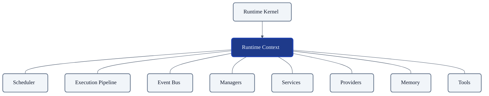
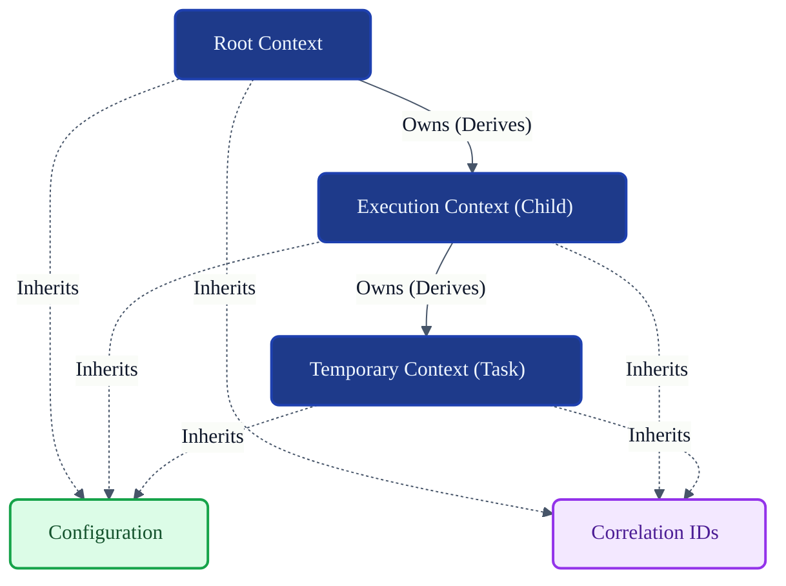
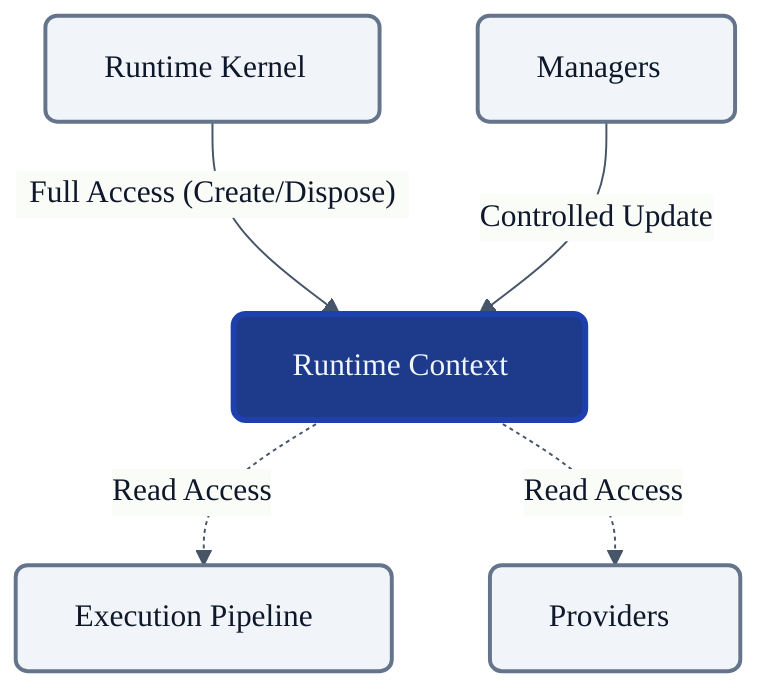

# VoxCore Runtime Context

This document defines the internal design, responsibilities, ownership, composition, lifecycle, visibility rules, and collaboration model of the Runtime Context.

It answers exactly one engineering question: **"How is execution context represented, owned, propagated, and managed throughout the VoxCore runtime?"**

The Runtime Context is not merely a data container. It is the authoritative execution environment shared by cooperating runtime subsystems. It provides execution state, but does not orchestrate runtime behaviour.

---

## 1. Purpose

The Runtime Context exists to provide a centralized, consistent execution environment for all subsystems. 

Without a centralized execution context:
* **Execution state becomes fragmented**: Modules construct custom context objects, preventing consistent telemetry and trace propagation.
* **Ownership becomes unclear**: Memory allocations and cancellation states lose definitive boundaries, leading to memory leaks.
* **Duplicated state appears**: Identical configuration or session metadata is redundantly cached across different packages.
* **Runtime coordination becomes inconsistent**: Cancellation signals and deadlines fail to propagate across subsystem boundaries.
* **Modules become tightly coupled**: Subsystems resort to directly querying one another for environmental data instead of relying on a shared context standard.

The Runtime Context centralizes execution state while preserving subsystem independence.

---

## 2. Runtime Context Philosophy

The design of the Runtime Context adheres to the following principles:

* **Single Source of Execution State**: It acts as the definitive source of truth for the current environment, configurations, and active session boundaries.
* **Explicit Ownership**: The context distinguishes definitively between data it *owns* (e.g., cancellation tokens) and data it *references* (e.g., configurations).
* **Minimal Shared Mutable State**: State that requires concurrent updates is strictly minimized and locked behind controlled mutation patterns.
* **Controlled Visibility**: Subsystems are only granted access to the specific context segments required for their operations.
* **Lifecycle Alignment**: A context instance shares the exact lifecycle bounds of the execution scope it represents.
* **Context Is Not A Service Locator**: It provides execution state and environment boundaries; it shall not be used to resolve dependencies or invoke services.
* **Framework Independence**: It is decoupled from web frameworks, HTTP request contexts, or RPC context implementations.
* **Thread/Task Safety by Design**: It is structurally safe for concurrent reads across asynchronous boundaries.

---

## 3. Responsibilities

The Runtime Context carries specific state responsibilities, clearly distinguishing between what it owns and what it merely references.

| Responsibility | Description | Owned? |
| :--- | :--- | :--- |
| **Execution metadata** | Timestamps, deadlines, and current phase tracking. | **Yes** |
| **Current session reference** | Pointer to the active `Session` identity. | *No (Referenced)* |
| **Conversation reference** | Pointer to the active `Conversation` identity. | *No (Referenced)* |
| **Cancellation context** | The signal mechanism to abort ongoing execution. | **Yes** |
| **Configuration reference** | Pointer to the active global and session configurations. | *No (Referenced)* |
| **Runtime metadata** | Information regarding the hosting process (version, node ID). | *No (Referenced)* |
| **Correlation identifiers** | Tracing IDs binding the execution to a specific client request. | **Yes** |
| **Security context reference** | Permissions, claims, or authentication boundaries. | *No (Referenced)* |
| **Current execution scope** | The logical boundary (e.g., Session scope vs Request scope). | **Yes** |

---

## 4. Internal Composition

The Runtime Context is a composition of logical parts representing the execution environment.

### Execution Metadata
* **Purpose**: Tracks transient metrics of the execution window, such as initiation timestamps and timeout deadlines.
* **Ownership**: Owned by the Runtime Context.
* **Mutable?**: Immutable after instantiation (except explicitly tracked updates).
* **Lifetime**: Scoped to the Context lifetime.
* **Visibility**: Publicly readable.
* **Collaborators**: Used by Execution Pipeline and Scheduler for deadline enforcement.

### Session Reference
* **Purpose**: Identifies the user interaction thread generating the current workload.
* **Ownership**: References an external `Session` entity.
* **Mutable?**: Immutable (a Context cannot change its bound Session).
* **Lifetime**: Points to a longer-lived `Session`.
* **Visibility**: Readable by components requiring user-isolation.
* **Collaborators**: Managers and Security.

### Conversation Reference
* **Purpose**: Identifies the specific dialog memory thread.
* **Ownership**: References an external `Conversation` entity.
* **Mutable?**: Immutable.
* **Lifetime**: Points to an active `Conversation`.
* **Visibility**: Readable by Pipeline and Providers.
* **Collaborators**: Memory and Tool subsystems.

### Configuration Reference
* **Purpose**: Exposes the active parameters governing subsystem behavior.
* **Ownership**: References external configurations managed by the Runtime Kernel.
* **Mutable?**: Immutable (read-only reference).
* **Lifetime**: Exceeds the Context lifetime.
* **Visibility**: Publicly readable.
* **Collaborators**: Used by all subsystems.

### Cancellation Context
* **Purpose**: Propagates abort signals gracefully across asynchronous boundaries.
* **Ownership**: Owned by the Runtime Context.
* **Mutable?**: Controlled Mutable (can transition to cancelled).
* **Lifetime**: Scoped to the Context.
* **Visibility**: Read access for checking cancellation status.
* **Collaborators**: Scheduler, Providers, and Pipeline.

### Correlation Information
* **Purpose**: Links disparate execution steps back to a single root trace.
* **Ownership**: Owned by the Runtime Context.
* **Mutable?**: Immutable.
* **Lifetime**: Propagates down to child contexts.
* **Visibility**: Publicly readable.
* **Collaborators**: Observability and Logging subsystems.

### Runtime Metadata
* **Purpose**: Provides host environment details (e.g., node identity, process uptime).
* **Ownership**: References external Kernel state.
* **Mutable?**: Immutable reference.
* **Lifetime**: Bound to the host process.
* **Visibility**: Read-only.
* **Collaborators**: Diagnostics.

### Diagnostics Context
* **Purpose**: Accumulates non-critical telemetry and execution breadcrumbs.
* **Ownership**: Owned by the Runtime Context.
* **Mutable?**: Controlled Mutable (append-only).
* **Lifetime**: Scoped to the Context.
* **Visibility**: Update access restricted to authorized modules.
* **Collaborators**: Observability and Tools.

---

## 5. Public Capabilities

The Runtime Context exposes the following conceptual operations:

### Create Context
* **Purpose**: Instantiates a new root execution environment.
* **Inputs**: Configuration references, initial metadata, correlation IDs.
* **Outputs**: A new Runtime Context instance.
* **Preconditions**: Runtime is active.
* **Postconditions**: Context is ready for propagation.
* **Failure conditions**: Invalid or missing required references.

### Fork Context / Derive Context
* **Purpose**: Creates a child context inheriting parent properties but allowing independent cancellation or local metadata.
* **Inputs**: Parent context, child-specific metadata.
* **Outputs**: A new derived Runtime Context.
* **Preconditions**: Parent context is active and not cancelled.
* **Postconditions**: Child context references parent correlation IDs.
* **Failure conditions**: Parent is already disposed.

### Read Context
* **Purpose**: Safely extracts environment variables and references.
* **Inputs**: Metadata key or reference type.
* **Outputs**: The requested value.
* **Preconditions**: Context is active.
* **Postconditions**: State remains unchanged.
* **Failure conditions**: Key does not exist.

### Attach Metadata
* **Purpose**: Appends diagnostic or execution telemetry.
* **Inputs**: Key, Value pair.
* **Outputs**: None.
* **Preconditions**: Context is active and mutability is permitted.
* **Postconditions**: Metadata is appended to the Diagnostics Context.
* **Failure conditions**: Storage limit reached or key conflict.

### Cancel Context
* **Purpose**: Signals that the associated execution should immediately abort.
* **Inputs**: Cancellation reason.
* **Outputs**: None.
* **Preconditions**: Context is active.
* **Postconditions**: Context is cancelled; signal propagates to derived contexts.
* **Failure conditions**: Context is already cancelled or disposed.

### Dispose Context
* **Purpose**: Releases resources held by the context (e.g., unlinking cancellation listeners).
* **Inputs**: None.
* **Outputs**: None.
* **Preconditions**: Execution scope completes.
* **Postconditions**: Context is disposed and unusable.
* **Failure conditions**: N/A.

---

## 6. Ownership Rules

This section explicitly defines the boundary of what the Context may govern.

* **Owns**: Execution metadata, correlation identifiers, local diagnostics, and cancellation state.
* **References**: `Session` identities, `Conversation` identities, global Configurations, `Security` boundaries.
* **Must Never Own**: The Context must never own business data (e.g., NLP payloads), persistent storage connectors, provider implementations, schedulers, execution pipelines, tool configurations, or memory persistence implementations. 
  
*Reason*: If the Context owns business data or pipeline logic, it transforms from an execution environment into a monolithic orchestrator, violating the single responsibility principle and breaking the architecture.

---

## 7. Visibility Rules

Visibility dictates which subsystems can view or mutate the context.

* **Runtime Kernel**: Full visibility. Capable of constructing and tearing down root contexts.
* **Execution Pipeline**: Read access to contextual state. Cannot mutate core context boundaries.
* **Managers**: Controlled updates. Permitted to append localized metadata.
* **Providers**: Read-only access to configuration and cancellation tokens.
* **Tools**: Limited contextual access restricted to their specific execution sandbox.
* **Plugins**: Explicitly granted visibility only; cannot read raw context unless authorized by the Plugin Manager.

---

## 8. Context Propagation

Context must safely traverse asynchronous execution boundaries.

* **Root Context**: Created by the Runtime Kernel at the start of a logical unit (e.g., process boot or session initiation).
* **Derived Context (Child)**: Created when work is parallelized or handed off. Inherits the correlation IDs and references of the parent.
* **Temporary Context**: A tightly scoped context created for a transient operation, strictly bounded by a deadline.
* **Cancellation propagation**: When a parent context is cancelled, all derived child contexts must recursively and immediately receive the cancellation signal.
* **Metadata propagation**: Child contexts inherit parent metadata but may append their own isolated metadata without polluting the parent.
* **Isolation boundaries**: Derived contexts ensure that local mutations or localized cancellations do not affect sibling or parent execution threads.

---

## 9. Mutability Rules

| Runtime Context Element | Mutable | Owner | Reason |
| :--- | :--- | :--- | :--- |
| **Execution Metadata** | Immutable | Context | Time and boundaries are fixed at scope creation. |
| **Current Session** | Reference Only | External | A context applies to exactly one static session. |
| **Configuration** | Immutable Ref | External | Configurations cannot change mid-execution. |
| **Correlation IDs** | Immutable | Context | Trace identity must remain stable across the graph. |
| **Cancellation Token**| Controlled Mutable| Context | State must transition from active to cancelled via signal. |
| **Diagnostics Metadata**| Controlled Mutable| Context | Requires append-only logic to track execution breadcrumbs.|

---

## 10. Lifecycle

The lifecycle of the Runtime Context maps directly to the definitions in *Runtime State Machines*.

* **Creation**: Instantiated by the Runtime Kernel or a delegating Manager.
* **Initialization**: Populated with required references and correlation IDs.
* **Active**: Readily propagated across subsystems during workload execution.
* **Cancelled**: A signal terminates the execution window; subsequent reads fail fast.
* **Disposed**: Resources and listener hooks are released.
* **Destroyed**: Memory reclaimed by garbage collection.

Ownership transitions only occur during derivation (forking), where the parent retains ownership of the child context's lifetime bounds.

---

## 11. Collaboration

### Runtime Kernel
* **Dependency Direction**: Kernel → Context
* **Information Exchanged**: Root configurations and lifecycle boundaries.
* **Ownership**: Kernel manages the root contexts.

### Scheduler
* **Dependency Direction**: Scheduler → Context
* **Information Exchanged**: Deadlines and cancellation checks.
* **Ownership**: Reads context state to govern task execution.

### Execution Pipeline
* **Dependency Direction**: Pipeline → Context
* **Information Exchanged**: Correlation IDs, session references.
* **Ownership**: Propagates the context between node stages.

### Managers & Providers
* **Dependency Direction**: Manager/Provider → Context
* **Information Exchanged**: Global constraints, configuration reads.
* **Ownership**: References context strictly for localized logic constraints.

### Memory & Event Bus
* **Dependency Direction**: Memory/Bus → Context
* **Information Exchanged**: Telemetry, trace IDs.
* **Ownership**: Uses context to append accurate correlation headers to outputs.

---

## 12. Context Invariants

The following invariants must hold true under all conditions:

1. **Every execution owns exactly one active Runtime Context.** Code must not execute outside of a defined environmental boundary.
2. **Context ownership shall be explicit.** Child contexts are bound strictly to their parent's lifecycle.
3. **Context lifetime shall never exceed Runtime lifetime.** Contexts represent transient execution and must be disposed on shutdown.
4. **Configuration references are immutable.** Contexts must provide consistent views of configuration; mid-execution config swapping is prohibited.
5. **Cancellation propagates downward.** A cancelled parent instantly cancels all derived children; a cancelled child does not cancel a parent.
6. **No circular context references.** Contexts form strict directed acyclic graphs (DAGs) during derivation.
7. **Business state shall not be stored in Runtime Context.** Prompts, user inputs, and AI responses belong in `Request` or `Conversation` models, not the environment context.

---

## 13. Extension Points

The Runtime Context permits architectural extensions in the following conceptual areas:
* **Future metadata**: Custom diagnostic payloads can be registered via standard metadata interfaces.
* **Additional execution scopes**: System expansions can introduce new derived scope types without breaking root context structures.
* **Tracing**: Correlation logic can integrate seamlessly with external OpenTelemetry or distributed tracing libraries.
* **Custom contextual information**: Through strict key-value diagnostics structures, subsystems can store transient breadcrumbs safely.

---

## 14. Design Constraints

The following constraints are mandatory:
* **No business logic.** The context does not interpret the data it carries.
* **No provider implementation.** The context is entirely agnostic to AI or external capability vendors.
* **No persistence.** Contexts are purely in-memory and transient.
* **No networking.** Contexts do not execute network requests or hold raw sockets.
* **No scheduler implementation.** Contexts hold deadlines, but do not enforce queue logic.
* **No service locator behaviour.** Subsystems must not use the Context to resolve singletons or dependencies.
* **No hidden ownership.** All referenced components must be strictly managed by their respective explicit managers.
* **Minimal mutable state.** Thread-safety must be guaranteed by structural immutability wherever possible.

---

## 15. Conclusion

The Runtime Context provides the shared execution environment while maintaining clear ownership, visibility, and lifecycle boundaries. It strictly isolates environmental metadata from business logic, ensuring that execution telemetry, cancellation signals, and subsystem configurations flow predictably across the VoxCore architecture without tightly coupling the orchestrating modules.

---

## Required Tables

### Table 1: Documentation Relationships

| Document | Responsibility |
| :--- | :--- |
| **Runtime Data Models** | Defines `RuntimeContext` as a runtime entity. |
| **Runtime State Machines** | Defines `RuntimeContext` lifecycle. |
| **Runtime Kernel** | Creates and governs `RuntimeContext`. |
| **Runtime Context (This Document)** | Defines execution environment design. |
| **Runtime Scheduler** | Uses `RuntimeContext`. |
| **Execution Pipeline** | Uses `RuntimeContext`. |
| **Managers** | Read and update contextual state through defined boundaries. |

### Table 2: Responsibilities Matrix

| Responsibility | Owner | Mutable |
| :--- | :--- | :--- |
| **Execution metadata** | Context | Immutable |
| **Cancellation context** | Context | Controlled |
| **Correlation identifiers**| Context | Immutable |
| **Diagnostics Context** | Context | Controlled |
| **Session reference** | Manager | Reference |
| **Conversation reference** | Manager | Reference |
| **Configuration reference**| Kernel | Reference |

### Table 3: Ownership Matrix

| Context Element | Owner | Reference | Lifetime |
| :--- | :--- | :--- | :--- |
| **Cancellation Context** | Runtime Context | Self | Bound to Context |
| **Execution Metadata** | Runtime Context | Self | Bound to Context |
| **Correlation Information**| Runtime Context | Self | Propagates to children |
| **Session Data** | Session Manager | Pointer | Lives beyond Context |
| **Configuration** | Runtime Kernel | Pointer | Lives beyond Context |

### Table 4: Mutability Matrix

| Element | Mutable | Reason |
| :--- | :--- | :--- |
| **Execution Metadata** | Immutable | Boundaries and times are fixed at creation. |
| **Configuration** | Immutable Ref | Prevents unpredictable behavior mid-execution. |
| **Correlation IDs** | Immutable | Trace tracking must remain stable. |
| **Cancellation Token** | Controlled | Must support transitioning to an aborted state. |
| **Diagnostics Metadata** | Controlled | Requires append-only accumulation of telemetry. |

### Table 5: Visibility Matrix

| Subsystem | Visibility | Modification Rights |
| :--- | :--- | :--- |
| **Runtime Kernel** | Full Access | Create/Dispose |
| **Scheduler** | Read Access | None |
| **Execution Pipeline** | Read Access | Append Metadata |
| **Providers** | Read Access | None |
| **Event Bus** | Read Access | None |
| **Managers** | Full Access | Controlled Update |

---

## Required Diagrams

### Diagram 1: Runtime Context Position Within Runtime

This diagram illustrates the Runtime Context acting as the shared execution environment accessible by operational subsystems.

### Diagram 2: Runtime Context Composition

This tree diagram visualizes the logical composition of the context.

```mermaid
%%{init: {"theme": "base", "themeVariables": {"primaryColor": "#F8FAFC", "primaryTextColor": "#0F172A", "primaryBorderColor": "#64748B", "lineColor": "#475569", "fontFamily": "Inter, sans-serif"}}}%%
flowchart TD
    context["Runtime Context"]:::context

    execMeta["Execution Metadata"]:::metadata
    sessRef["Session Reference"]:::reference
    convRef["Conversation Reference"]:::reference
    confRef["Configuration Reference"]:::reference
    cancel["Cancellation Context"]:::ownership
    corr["Correlation Information"]:::metadata
    runMeta["Runtime Metadata"]:::reference
    diag["Diagnostics Context"]:::metadata

    context --> execMeta
    context --> sessRef
    context --> convRef
    context --> confRef
    context --> cancel
    context --> corr
    context --> runMeta
    context --> diag

    classDef context fill:#1E3A8A,stroke:#1E40AF,color:#EFF6FF,stroke-width:3px,rx:6px,ry:6px;
    classDef metadata fill:#F3E8FF,stroke:#9333EA,color:#4C1D95,stroke-width:2px,rx:6px,ry:6px;
    classDef reference fill:#DCFCE7,stroke:#16A34A,color:#14532D,stroke-width:2px,rx:6px,ry:6px;
    classDef ownership fill:#DBEAFE,stroke:#2563EB,color:#1E3A8A,stroke-width:2px,rx:6px,ry:6px;
```

### Diagram 3: Context Propagation

This diagram illustrates how contexts are derived and how references are inherited versus explicitly owned.

### Diagram 4: Visibility Boundaries

This diagram visualizes which subsystems have read-only, controlled mutation, or full access.

