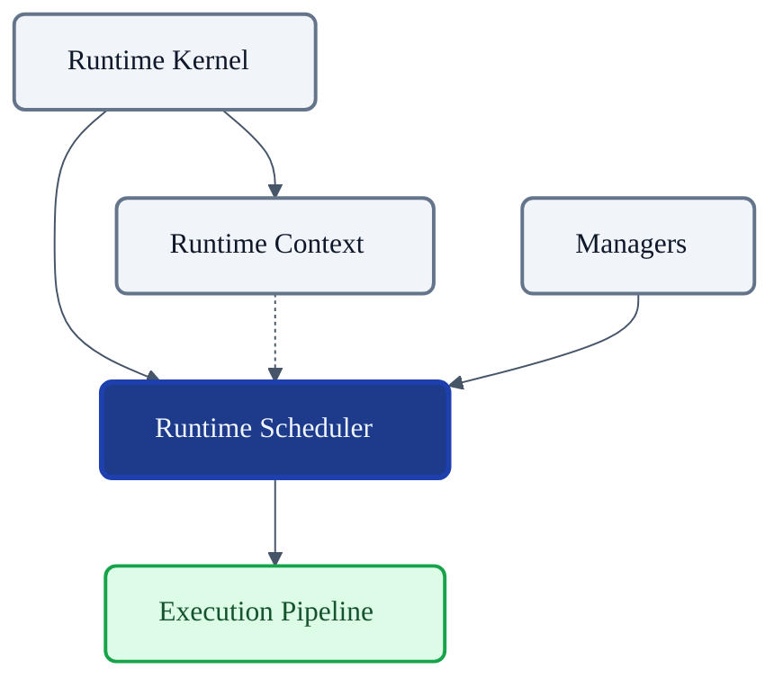
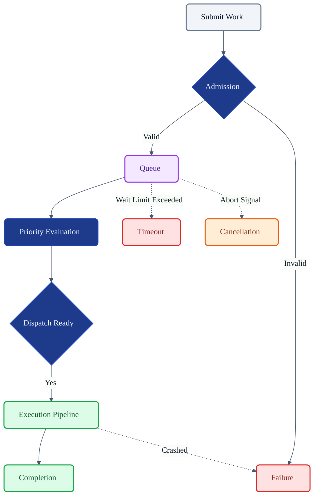
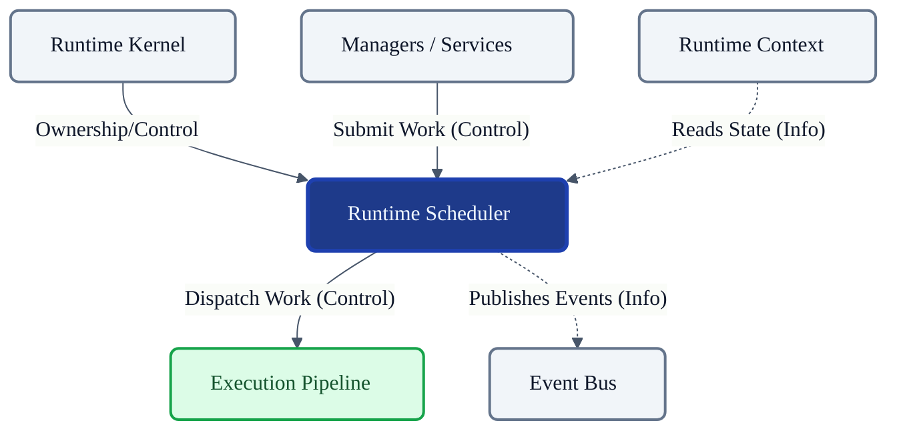

# VoxCore Runtime Scheduler

This document defines the internal design, responsibilities, ownership boundaries, scheduling model, lifecycle, collaboration model, and extension points of the Runtime Scheduler.

It answers exactly one engineering question: **"How does the VoxCore runtime schedule, coordinate, prioritize, and manage executable work?"**

The Runtime Scheduler does not execute business logic. It does not implement pipeline stages. It does not implement providers. It strictly coordinates the execution of work while preserving ordering, fairness, cancellation, resource efficiency, and lifecycle consistency.

---

## 1. Purpose

The Runtime Scheduler provides centralized, deterministic coordination of executable work.

Without centralized scheduling:
* **Execution order becomes inconsistent**: Tasks run randomly without regard for dependencies or priorities.
* **Starvation occurs**: High-volume, low-priority tasks overwhelm critical system operations.
* **Cancellation becomes unreliable**: Tasks cannot be safely intercepted before dispatch, leading to wasted execution cycles.
* **Prioritization becomes ad hoc**: Subsystems invent their own scheduling queues, splitting resources inefficiently.
* **Concurrency becomes uncontrolled**: Unbounded parallelism crashes the host process or hits hard provider rate-limits.
* **Resource utilization becomes unpredictable**: System bottlenecks cannot be monitored or governed centrally.

The Scheduler provides deterministic coordination while remaining independent of execution logic.

---

## 2. Scheduling Philosophy

The design of the Runtime Scheduler must adhere to the following principles:

* **Deterministic Scheduling**: The decision of which task runs next is mathematically predictable based on queue state, priority, and constraints.
* **Explicit Ownership**: The Scheduler owns the queues and the admission process. Other subsystems submit work, but never touch internal queues.
* **Fair Resource Utilization**: Coordination logic prevents single sessions or aggressive providers from monopolizing execution resources.
* **Controlled Concurrency**: The Scheduler enforces concurrency boundaries to prevent CPU/memory exhaustion.
* **Cancellation First**: Cancellation signals are instantly evaluated. Cancelled tasks are discarded from queues before dispatch.
* **Execution Independence**: The Scheduler does not care *what* a task does, only *when* it is allowed to do it.
* **Predictable Ordering**: The Scheduler respects explicit dependency graphs and chronological ordering within identical priority bands.
* **Framework Independence**: It is decoupled from underlying language async primitives or thread pool implementations.
* **Scalable Coordination**: It minimizes contention locks, ensuring that coordination logic does not become a bottleneck itself.

---

## 3. Responsibilities

The Runtime Scheduler explicitly distinguishes between responsibilities it owns and operations it delegates. The Scheduler owns coordination—not execution.

| Responsibility | Description | Owned? |
| :--- | :--- | :--- |
| **Accept executable work** | Receives `Task` entities for admission. | **Yes** |
| **Prioritize work** | Assigns execution priority based on rules. | **Yes** |
| **Queue management** | Owns and organizes waiting tasks. | **Yes** |
| **Dispatch work** | Signals that a task is permitted to run. | **Yes** |
| **Coordinate cancellation** | intercepts tasks before dispatch if aborted. | **Yes** |
| **Handle scheduling deadlines** | Enforces queue wait-time maximums. | **Yes** |
| **Monitor scheduling state** | Tracks queue depth, latency, and throughput. | **Yes** |
| **Notify lifecycle changes** | Emits state transitions (Queued, Dispatched). | **Yes** |
| **Coordinate retries** | Enqueuing failed tasks based on retry policies. | **Yes** |
| **Execute logic** | Running the actual node, provider, or capability. | *Delegated* |

---

## 4. Scheduling Model

The conceptual scheduling model operates through a logical sequence:

1. **Work Submission**: Managers or the Pipeline submit `Task` entities representing discrete work.
2. **Queue Admission**: The Scheduler validates constraints. Invalid tasks are immediately failed.
3. **Prioritization**: The Scheduler assigns a priority bucket (e.g., Critical, Normal, Background).
4. **Dependency Resolution**: The Scheduler evaluates if the task is blocked by unfinished prerequisite tasks.
5. **Queue Assignment**: The task waits in the designated priority queue.
6. **Dispatch Readiness**: The Scheduler identifies the highest-priority unblocked task.
7. **Execution Assignment**: The Scheduler hands the task to the Execution Pipeline.
8. **Completion Notification**: The Pipeline informs the Scheduler the task finished.
9. **Cancellation**: If a cancellation signal arrives, the Scheduler removes the task from the queue and marks it Cancelled.
10. **Timeout**: If a task waits too long in the queue, it is evicted and marked Failed (Timeout).
11. **Cleanup**: State references are removed from the Scheduler's memory.

---

## 5. Internal Module Decomposition

To achieve its goals, the Runtime Scheduler logically decomposes into specialized modules.

### Task Admission Coordinator
* **Purpose**: Validates incoming work submissions.
* **Responsibilities**: Checks task integrity, prevents duplicate submissions, and rejects malformed work.
* **Collaborators**: `Priority Coordinator`, `Queue Manager`.
* **Ownership**: Owns the transition to `Queued` or immediate rejection.

### Scheduling Queue Manager
* **Purpose**: Maintains the internal structure of waiting tasks.
* **Responsibilities**: Organizes tasks into priority tiers and enforces queue depth limits.
* **Collaborators**: `Dispatch Coordinator`, `Cancellation Coordinator`.
* **Ownership**: Owns the `Waiting` state of tasks.

### Priority Coordinator
* **Purpose**: Determines relative execution priority.
* **Responsibilities**: Evaluates task metadata against policies to assign priority tiers and manage starvation prevention (priority escalation).
* **Collaborators**: `Task Admission Coordinator`.
* **Ownership**: Owns prioritization logic.

### Dispatch Coordinator
* **Purpose**: Determines when work may legally execute.
* **Responsibilities**: Checks concurrency limits, dependency graphs, and hands tasks to the Pipeline.
* **Collaborators**: `Queue Manager`, Execution Pipeline.
* **Ownership**: Owns the transition to `Dispatched`.

### Timeout Coordinator
* **Purpose**: Enforces maximum scheduling wait times.
* **Responsibilities**: Scans queues for expired tasks and evicts them.
* **Collaborators**: `Queue Manager`.
* **Ownership**: Owns queue-level timeout failures.

### Cancellation Coordinator
* **Purpose**: Ensures cancelled work does not execute.
* **Responsibilities**: Listens to the Runtime Context for abort signals and removes matching tasks from queues before dispatch.
* **Collaborators**: `Queue Manager`, `Runtime Context`.
* **Ownership**: Owns pre-dispatch cancellation logic.

### Scheduling Monitor
* **Purpose**: Provides scheduler diagnostics.
* **Responsibilities**: Aggregates queue depths, wait times, and dispatch rates for health reporting.
* **Collaborators**: `Runtime Kernel` (via Health Coordinator).
* **Ownership**: Owns internal telemetry state.

---

## 6. Public Capabilities

The Runtime Scheduler exposes the following conceptual operations:

### Submit Work
* **Purpose**: Registers a new Task for future execution.
* **Inputs**: `Task` entity, `RuntimeContext`.
* **Outputs**: Task Identity.
* **Preconditions**: Scheduler is active. Task is not already queued.
* **Postconditions**: Task is admitted and enqueued.
* **Failure Conditions**: Queue full, malformed task, Scheduler pausing/stopped.

### Cancel Work
* **Purpose**: Aborts a pending task.
* **Inputs**: Task Identity.
* **Outputs**: Boolean success.
* **Preconditions**: Task exists in queue.
* **Postconditions**: Task is removed and state is Cancelled.
* **Failure Conditions**: Task already dispatched or not found.

### Pause Scheduling
* **Purpose**: Halts new dispatches while keeping queues intact.
* **Inputs**: None.
* **Outputs**: None.
* **Preconditions**: Scheduler is active.
* **Postconditions**: No tasks are transitioned to Dispatched.
* **Failure Conditions**: None.

### Resume Scheduling
* **Purpose**: Unpauses dispatch operations.
* **Inputs**: None.
* **Outputs**: None.
* **Preconditions**: Scheduler is paused.
* **Postconditions**: Dispatch loop resumes.
* **Failure Conditions**: None.

### Query Task Status
* **Purpose**: Checks the scheduling phase of a specific task.
* **Inputs**: Task Identity.
* **Outputs**: Lifecycle State.
* **Preconditions**: None.
* **Postconditions**: None (read-only).
* **Failure Conditions**: Task unknown.

### Query Scheduler Status
* **Purpose**: Returns aggregate queue and dispatch health.
* **Inputs**: None.
* **Outputs**: Queue depths, active dispatches, pause status.
* **Preconditions**: None.
* **Postconditions**: None.
* **Failure Conditions**: None.

### Register Scheduling Policy
* **Purpose**: Injects custom prioritization rules dynamically.
* **Inputs**: Policy interface definition.
* **Outputs**: Success flag.
* **Preconditions**: Scheduler is in `Initializing` state.
* **Postconditions**: Priority Coordinator applies the new rules.
* **Failure Conditions**: Conflicting or malformed policy.

---

## 7. Queue Management

The Scheduler absolutely owns all scheduling queues. 

* **Queue admission**: Validation happens before a task enters a queue.
* **Queue ordering**: Internal ordering is strictly governed by the Priority Coordinator.
* **Queue visibility**: Queues are entirely opaque to external subsystems. Managers cannot read the queue directly.
* **Queue ownership**: Exclusively owned by the `Queue Manager`.
* **Queue lifecycle**: Bound to the lifecycle of the Scheduler itself.
* **Queue cleanup**: Automatically removes references upon task completion, cancellation, or failure.
* **Queue isolation**: Tasks for different sessions may share a priority queue, but isolation is enforced at the dispatch level.

*Rule:* Other subsystems may submit work but shall not manipulate queue internals.

---

## 8. Prioritization Rules

Prioritization determines structural queue ordering, not scheduling algorithms.

* **Priority levels**: Tasks are slotted into discrete bands (e.g., High, Normal, Low).
* **Priority escalation**: To prevent starvation, tasks dwelling in lower queues may have their priority escalated after a deadline threshold.
* **Fair scheduling**: The Scheduler alternates dispatch between sessions of equal priority to prevent a single high-volume session from monopolizing the runtime.
* **Starvation prevention**: Evaluated periodically by the Priority Coordinator.
* **Deadline awareness**: Tasks explicitly nearing their contextual deadlines receive prioritization boosts.
* **Dependency awareness**: Tasks with unmet dependencies are kept out of active priority queues until unblocked.
* **Resource awareness**: The Scheduler checks host resource constraints before prioritizing heavy computational tasks.

---

## 9. Task Lifecycle Integration

The Scheduler coordinates explicit transitions on the `Task` entity as defined in *Runtime State Machines*.

The Scheduler directly owns and commands these transitions:
* **Scheduled** → **Waiting** (Handled by Queue Manager upon admission)
* **Waiting** → **Running** (Handled by Dispatch Coordinator)
* **Running** ↔ **Paused** (Handled by Dispatch Coordinator for throttling)
* **Waiting** → **Cancelled** (Handled by Cancellation Coordinator, pre-dispatch)
* **Waiting** → **Failed** (Handled by Timeout Coordinator, queue timeouts)

The Pipeline informs the Scheduler to release queue resources upon:
* **Running** → **Completed** / **Failed** / **Cancelled**

---

## 10. Collaboration

### Runtime Kernel
* **Dependency Direction**: Kernel → Scheduler
* **Information Exchanged**: Lifecycle commands (start, stop, pause), global health polling.
* **Ownership**: Kernel manages the Scheduler.

### Runtime Context
* **Dependency Direction**: Scheduler → Context
* **Information Exchanged**: Cancellation signals, trace/correlation IDs, configuration timeouts.
* **Ownership**: Scheduler reads the Context.

### Execution Pipeline
* **Dependency Direction**: Scheduler → Pipeline
* **Information Exchanged**: Dispatched work items. The Pipeline returns completion status.
* **Ownership**: Pipeline executes what the Scheduler hands it.

### Managers & Services
* **Dependency Direction**: Managers → Scheduler
* **Information Exchanged**: Work submissions (`Tasks`).
* **Ownership**: Managers submit to the Scheduler.

### Event Bus
* **Dependency Direction**: Scheduler → Event Bus
* **Information Exchanged**: Global scheduling events (e.g., Task Queued, Task Dispatched).
* **Ownership**: Scheduler publishes to the Bus.

---

## 11. Scheduling Invariants

The following invariants must hold true under all conditions:

1. **Every scheduled task shall have one owner.** Work must not be duplicated across multiple dispatch threads.
2. **Tasks shall not execute before admission.** Bypassing the queue mechanism violates concurrency constraints.
3. **Completed tasks shall not return to waiting state.** Work flows unidirectionally; retries must create new Task instances.
4. **Cancelled tasks shall not be dispatched.** Interception before execution is mandatory to save CPU cycles.
5. **Queue ownership remains exclusive to Scheduler.** No external manager may peek, push, or pop from the queues directly.
6. **Execution order shall respect scheduling constraints.** Dependency graphs must never be violated in favor of load balancing.

---

## 12. Failure Behaviour

* **Queue overflow**: If task submissions exceed max depth, the Admission Coordinator shall reject new tasks immediately with a `Backpressure` error.
* **Scheduling failure**: Internal coordination errors result in the Task being safely evicted and marked `Failed`, triggering a system alert.
* **Dispatch failure**: If the Execution Pipeline rejects a dispatched task, the Scheduler marks it `Failed` and does not auto-requeue without a strict retry policy.
* **Timeout**: Un-dispatched tasks exceeding contextual limits are evicted to prevent silent hangs.
* **Cancellation**: Immediate eviction from queues without executing Pipeline logic.
* **Subsystem unavailability**: If the Pipeline crashes, the Scheduler pauses dispatch and accumulates tasks up to queue limits.
* **Scheduler degradation**: The Monitoring module flags high latency to the Kernel, which may scale or throttle incoming requests.

---

## 13. Extension Points

The Scheduler remains architecture-neutral to allow future extensions:
* **Scheduling policies**: Injectable rules for priority evaluation.
* **Priority models**: Expanding from simple tiers (High/Med/Low) to dynamic weighted scoring.
* **Queue implementations**: Swapping in-memory queues for Redis-backed distributed queues without altering the public interface.
* **Monitoring**: Hooking advanced telemetry exporters into the Scheduling Monitor.
* **Metrics & Diagnostics**: Granular reporting for tracing wait-time anomalies.

---

## 14. Design Constraints

The following constraints are mandatory:
* **Scheduler shall not execute business logic.**
* **Scheduler shall not implement providers.**
* **Scheduler shall not implement pipeline stages.**
* **Scheduler shall not own Runtime Context.**
* **Scheduler shall not own runtime entities.**
* **Scheduler shall not manage persistent database state.**
* **Minimal mutable scheduling state:** Locking and state mutation must be optimized strictly for low-latency dispatch.

---

## 15. Conclusion

The Runtime Scheduler provides deterministic coordination of executable work while remaining independent from execution logic and business behaviour. By strictly owning the queues and delegating execution to the Pipeline, the Scheduler ensures fair resource utilization, prevents starvation, guarantees pre-dispatch cancellation, and provides a stable core for managing VoxCore's concurrent operations.

---

## Required Tables

### Table 1: Documentation Relationships

| Document | Responsibility |
| :--- | :--- |
| **Runtime Data Models** | Defines `Task` runtime entity. |
| **Runtime State Machines** | Defines `Task` lifecycle. |
| **Runtime Kernel** | Owns Scheduler lifecycle. |
| **Runtime Context** | Supplies execution context. |
| **Runtime Scheduler (This Doc)** | Coordinates executable work. |
| **Runtime Execution Pipeline** | Executes scheduled work. |
| **Managers** | Submit work to Scheduler. |
| **Event Bus** | Publishes scheduling events. |

### Table 2: Responsibilities Matrix

| Responsibility | Owner | Delegated To |
| :--- | :--- | :--- |
| **Accept work (Admission)** | Scheduler | N/A |
| **Queue management** | Scheduler | N/A |
| **Prioritization** | Scheduler | N/A |
| **Dispatch** | Scheduler | N/A |
| **Execution** | N/A | Execution Pipeline |
| **Provider invocation** | N/A | Execution Pipeline |
| **Business logic** | N/A | Execution Pipeline |

### Table 3: Scheduling Capability Matrix

| Capability | Purpose | Owner |
| :--- | :--- | :--- |
| **Submit Work** | Registers a new Task into the queue. | Admission Coordinator |
| **Cancel Work** | Aborts a pending Task before execution. | Cancellation Coordinator |
| **Pause/Resume** | Toggles the dispatch loop flow. | Dispatch Coordinator |
| **Query Status** | Reads task or queue health state. | Scheduling Monitor |

### Table 4: Scheduling Invariants

| Invariant | Reason |
| :--- | :--- |
| **Single task owner** | Prevents duplicate simultaneous executions. |
| **No execution before admission**| Enforces system resource constraints centrally. |
| **No queued cancelled tasks** | Saves CPU cycles by dropping aborted work immediately. |
| **Exclusive queue ownership** | Protects scheduling integrity from rogue subsystems. |
| **Strict dependency ordering** | Ensures correct logic flow for blocked tasks. |

### Table 5: Collaboration Matrix

| Subsystem | Relationship | Dependency Direction |
| :--- | :--- | :--- |
| **Runtime Kernel** | Governs lifecycle of Scheduler. | Kernel → Scheduler |
| **Runtime Context** | Supplies config, cancel signals. | Scheduler → Context |
| **Execution Pipeline** | Receives dispatched Tasks. | Scheduler → Pipeline |
| **Managers** | Submit Tasks. | Managers → Scheduler |
| **Event Bus** | Receives lifecycle events. | Scheduler → Event Bus |

---

## Required Diagrams

### Diagram 1: Scheduler Position Within Runtime

### Diagram 2: Scheduling Flow

### Diagram 3: Scheduler Internal Modules

```mermaid
%%{init: {"theme": "base", "themeVariables": {"primaryColor": "#F8FAFC", "primaryTextColor": "#0F172A", "primaryBorderColor": "#64748B", "lineColor": "#475569", "fontFamily": "Inter, sans-serif"}}}%%
flowchart TD
    scheduler["Runtime Scheduler"]:::scheduler

    admission["Task Admission Coordinator"]:::monitoring
    manager["Queue Manager"]:::queue
    priority["Priority Coordinator"]:::monitoring
    dispatch["Dispatch Coordinator"]:::monitoring
    timeout["Timeout Coordinator"]:::failure
    cancel["Cancellation Coordinator"]:::cancellation
    monitor["Scheduling Monitor"]:::monitoring

    scheduler --> admission
    scheduler --> manager
    scheduler --> priority
    scheduler --> dispatch
    scheduler --> timeout
    scheduler --> cancel
    scheduler --> monitor

    classDef scheduler fill:#1E3A8A,stroke:#1E40AF,color:#EFF6FF,stroke-width:3px,rx:6px,ry:6px;
    classDef queue fill:#F3E8FF,stroke:#9333EA,color:#4C1D95,stroke-width:2px,rx:6px,ry:6px;
    classDef cancellation fill:#FFEDD5,stroke:#EA580C,color:#7C2D12,stroke-width:2px,rx:6px,ry:6px;
    classDef failure fill:#FEE2E2,stroke:#DC2626,color:#7F1D1D,stroke-width:2px,rx:6px,ry:6px;
    classDef monitoring fill:#F1F5F9,stroke:#64748B,color:#0F172A,stroke-width:2px,rx:6px,ry:6px;
```

### Diagram 4: Scheduler Collaboration

