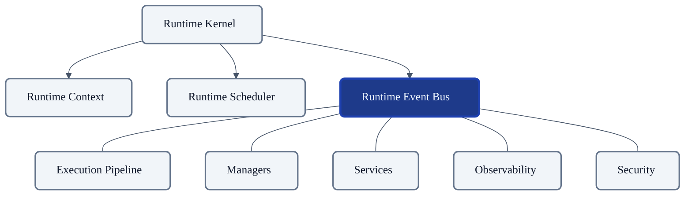
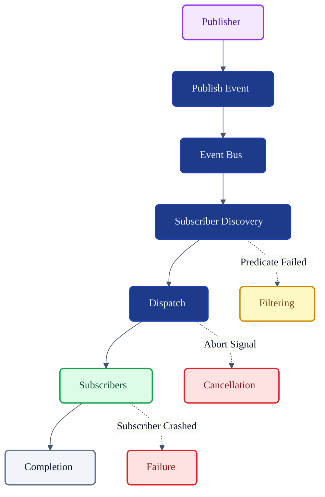
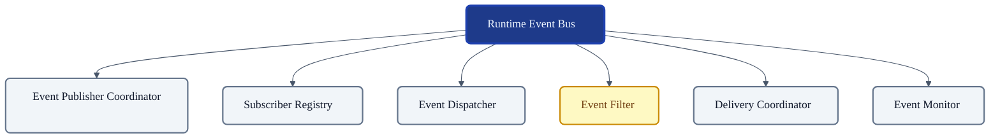
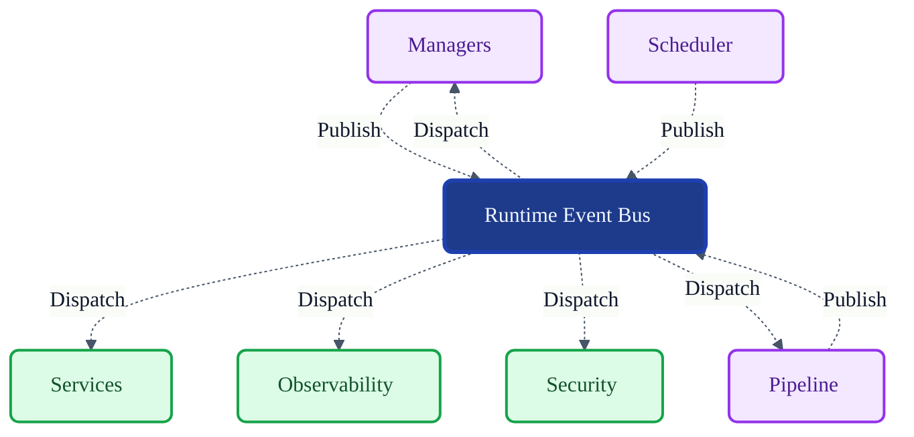

# VoxCore Runtime Event Bus

This document defines the internal architecture, responsibilities, ownership boundaries, event lifecycle integration, communication model, extension points, and collaboration rules of the Runtime Event Bus.

It answers exactly one engineering question: **"How do independent runtime subsystems communicate through events while remaining loosely coupled?"**

The Runtime Event Bus is an internal runtime communication mechanism. It is not a distributed message broker, external streaming platform, network transport, persistence mechanism, or workflow engine. It exists solely to coordinate communication between runtime subsystems while preserving modularity.

---

## 1. Purpose

The Runtime Event Bus exists to facilitate asynchronous, decoupled communication across the VoxCore runtime architecture.

Without an Event Bus:
* **Runtime components become tightly coupled**: Every subsystem must hold hard references to every other subsystem.
* **Components require direct references**: Adding a new observability module requires modifying the core pipeline to call it directly.
* **Lifecycle coordination becomes difficult**: Broadcasting system-wide state changes (e.g., shutdown signals) requires manual traversal of object trees.
* **Extensibility decreases**: New plugins cannot passively listen to existing execution flows.
* **Runtime notifications become inconsistent**: Without a centralized router, telemetry, logging, and metrics scatter unpredictably across subsystems.

The Event Bus enables modular communication while preserving subsystem independence.

---

## 2. Event Communication Philosophy

The design of the Runtime Event Bus must adhere to the following principles:

* **Loose Coupling**: Publishers must never know who is listening, and subscribers must never know who published the event.
* **Event-Driven Coordination**: State changes are communicated via events, allowing passive reaction rather than active polling.
* **Explicit Ownership**: The bus explicitly owns the registry of subscribers and the dispatch logic, but does not own the events themselves.
* **Publisher Independence**: Publishing an event shall not block the publisher’s primary execution path indefinitely.
* **Subscriber Independence**: A slow or crashed subscriber must not crash the publisher or the Event Bus itself.
* **No Hidden Communication**: If a subsystem needs to broadcast state, it must do so through the Event Bus. Side-channel communication is prohibited.
* **Deterministic Event Flow**: Events are routed predictably based on explicit subscriptions and filtering rules.
* **Framework Independence**: The Event Bus is an architectural pattern, free from tight coupling to external libraries like Redis or Kafka.
* **Minimal Event Knowledge**: The bus does not inspect or care about the business payload inside the event.

---

## 3. Responsibilities

The Runtime Event Bus distinguishes clearly between what it orchestrates and what it ignores. It owns communication—not business processing.

| Responsibility | Description | Owned? |
| :--- | :--- | :--- |
| **Accept published events** | Exposes a secure endpoint for subsystems to emit events. | **Yes** |
| **Register subscribers** | Maintains a mapping of topics to listeners. | **Yes** |
| **Remove subscribers** | Safely detaches listeners upon subsystem teardown. | **Yes** |
| **Dispatch events** | Routes published events to all matching subscribers. | **Yes** |
| **Preserve ordering guarantees** | Ensures chronological delivery where architecturally required. | **Yes** |
| **Coordinate event propagation** | Manages fan-out across multiple listeners. | **Yes** |
| **Monitor event processing** | Tracks throughput and dispatch latency. | **Yes** |
| **Support filtering** | Evaluates rules before dispatching to specific subscribers. | **Yes** |
| **Publish lifecycle notifications**| Broadcasts its own lifecycle status. | **Yes** |
| **Execute business logic** | Processing the actual event payload. | *Delegated* |

---

## 4. Event Communication Model

The conceptual event communication lifecycle operates as follows:

1. **Event Creation**: A subsystem (e.g., Pipeline) instantiates an `Event` entity.
2. **Event Publication**: The subsystem submits the `Event` to the Event Bus.
3. **Subscriber Discovery**: The bus queries its internal registry for matching listeners.
   * *Branch (Filtered events)*: Listeners failing the filter predicates are skipped.
4. **Dispatch**: The bus pushes the event to eligible subscribers.
5. **Subscriber Processing**: The subscriber reacts to the event payload.
   * *Branch (Failed delivery)*: If a subscriber crashes, the bus isolates the fault.
6. **Completion**: The event dispatch lifecycle ends.
   * *Branch (Cancelled events)*: If an abort signal is detected mid-dispatch, pending deliveries may be halted.

---

## 5. Internal Module Decomposition

To achieve modular communication, the Event Bus logically decomposes into the following internal modules.

### Event Publisher Coordinator
* **Purpose**: Accepts and normalizes published events.
* **Responsibilities**: Validates event structure and triggers the discovery phase.
* **Collaborators**: `Subscriber Registry`, `Event Dispatcher`.
* **Ownership**: Owns the initial acceptance of the event into the bus.

### Subscriber Registry
* **Purpose**: Maintains active listener registrations.
* **Responsibilities**: Adds, removes, and indexes subscribers by topic or category.
* **Collaborators**: `Event Filter`.
* **Ownership**: Exclusively owns the mapping of topics to subscriber references.

### Event Dispatcher
* **Purpose**: Coordinates the physical push of events to subscribers.
* **Responsibilities**: Iterates over eligible listeners and executes the delivery mechanism.
* **Collaborators**: `Delivery Coordinator`.
* **Ownership**: Owns the execution of the fan-out loop.

### Event Filter
* **Purpose**: Determines eligible subscribers based on dynamic predicates.
* **Responsibilities**: Evaluates event metadata against subscriber filtering rules.
* **Collaborators**: `Subscriber Registry`, `Event Dispatcher`.
* **Ownership**: Owns filtering logic.

### Delivery Coordinator
* **Purpose**: Tracks dispatch progress and enforces isolation boundaries.
* **Responsibilities**: Ensures a failing subscriber does not halt the entire dispatcher loop.
* **Collaborators**: `Event Monitor`.
* **Ownership**: Owns delivery state and fault isolation.

### Event Monitor
* **Purpose**: Collects diagnostics and health metrics.
* **Responsibilities**: Aggregates latency, throughput, and error rates.
* **Collaborators**: `Runtime Kernel` (Health Coordinator).
* **Ownership**: Owns internal telemetry.

---

## 6. Public Capabilities

The Runtime Event Bus exposes the following conceptual operations:

### Publish Event
* **Purpose**: Broadcasts an event to the runtime.
* **Inputs**: `Event` entity.
* **Outputs**: Boolean acceptance status.
* **Preconditions**: Event Bus is running.
* **Postconditions**: Event is accepted and queued for dispatch.
* **Failure Conditions**: Malformed event, Bus is stopped.

### Register Subscriber
* **Purpose**: Attaches a listener to a specific topic or category.
* **Inputs**: Subscriber interface, Topic/Filter criteria.
* **Outputs**: Subscription ID.
* **Preconditions**: Event Bus is running or initializing.
* **Postconditions**: Subscriber receives future matching events.
* **Failure Conditions**: Invalid subscriber interface.

### Unregister Subscriber
* **Purpose**: Detaches a listener.
* **Inputs**: Subscription ID.
* **Outputs**: Success flag.
* **Preconditions**: Subscription ID exists.
* **Postconditions**: Subscriber no longer receives events.
* **Failure Conditions**: Unknown ID.

### Query Event Status
* **Purpose**: Checks the dispatch state of a specific event.
* **Inputs**: Event ID.
* **Outputs**: Dispatch status (Pending, Completed, Failed).
* **Preconditions**: Event was published recently.
* **Postconditions**: None (read-only).
* **Failure Conditions**: Event not found (expired from memory).

### Query Subscriber Status
* **Purpose**: Evaluates the health of registered listeners.
* **Inputs**: None.
* **Outputs**: List of active subscribers and fault counts.
* **Preconditions**: None.
* **Postconditions**: None.
* **Failure Conditions**: None.

### Pause / Resume Event Processing
* **Purpose**: Temporarily halts or resumes the Dispatcher loop.
* **Inputs**: None.
* **Outputs**: None.
* **Preconditions**: Authorized lifecycle command.
* **Postconditions**: Dispatching is suspended or resumed.
* **Failure Conditions**: Invalid state transition.

---

## 7. Event Ownership

This section explicitly defines the boundary of what the Event Bus governs.

* **The Event Bus owns**:
  * The subscriber registry (the list of who is listening).
  * Dispatch coordination (the act of pushing the event).
  * Event routing metadata (topics, filters).
  * The dispatch lifecycle state.

* **The Event Bus references**:
  * `Runtime Context` (for correlation and cancellation scoping).
  * `Runtime Scheduler` (if dispatching requires scheduling a task).
  * `Event` runtime entities (it holds them transiently during dispatch).

* **The Event Bus must never own**:
  * **Business data**: It does not parse or modify the LLM prompts or audio chunks inside the event.
  * **Provider state**: It does not track connection pools to external APIs.
  * **Pipeline execution**: It does not determine the next step in the pipeline graph.
  * **Runtime tasks**: It dispatches events, but does not execute scheduled computation tasks.
  * **Persistent storage**: It does not save events to a database for long-term audit (that is the job of an Observability subscriber).

*Reason*: If the Event Bus parses business data or executes tasks, it morphs into a monolithic workflow engine, destroying the loose coupling it was built to protect.

---

## 8. Event Ordering

The Event Bus defines strict ordering guarantees only within its architectural boundaries.

* **Publication order**: Events submitted by a single publisher thread are accepted in the order they are received.
* **Dispatch order**: Events are dispatched to subscribers in chronological order of publication within a specific topic.
* **Subscriber independence**: The bus does not guarantee that Subscriber A finishes processing before Subscriber B receives the event.
* **Ordering scope**: Guarantees apply per-topic and per-session.
* **Deterministic processing**: The Event Bus ensures dispatch logic is repeatable and predictable, avoiding race conditions in the fan-out phase.

*(Implementation algorithms are explicitly excluded from this specification.)*

---

## 9. Event Filtering

To minimize unnecessary dispatch overhead, the Event Bus supports conceptual filtering.

* **Subscription filtering**: Subscribers only receive events for topics they explicitly registered for.
* **Event category filtering**: Subscribers can listen to broad categories (e.g., `Error.*` or `Audio.*`).
* **Capability filtering**: Events tagged with specific system requirements can be filtered before reaching incompatible listeners.
* **Context-aware filtering**: Events belonging to a cancelled `RuntimeContext` may be aggressively filtered out before dispatch.

---

## 10. Lifecycle Integration

The Event Bus coordinates specific transitions for the `Event` entity, deferring to *Runtime State Machines*.

* **Created**: Instantiated by the publisher.
* **Published**: Handled by the Event Publisher Coordinator.
* **Queued**: (Transient state during high load).
* **Dispatched**: Handled by the Event Dispatcher as it begins fan-out.
* **Delivered**: Handled by Delivery Coordinator as it hits subscriber boundaries.
* **Consumed**: Transferred completely to the Subscriber.
* **Completed**: The Event Bus drops its reference.

If faults occur:
* **Cancelled**: Dropped prior to dispatch due to context abortion.
* **Failed**: Delivery failed to all eligible subscribers.
* **Expired**: Dropped due to TTL limits (if supported).

The Event Bus strictly owns the transitions from `Published` through `Delivered` / `Completed`.

---

## 11. Collaboration

### Runtime Kernel
* **Dependency Direction**: Kernel → Event Bus
* **Information Exchanged**: Initialization commands, teardown signals, health probes.
* **Ownership**: Kernel manages the lifecycle of the Event Bus.

### Runtime Context
* **Dependency Direction**: Event Bus → Context
* **Information Exchanged**: Cancellation tokens, correlation IDs for tracing dispatched events.
* **Ownership**: Event Bus references the Context.

### Runtime Scheduler
* **Dependency Direction**: Event Bus → Scheduler (Optional)
* **Information Exchanged**: If async subscriber delivery requires a discrete thread, the bus submits a scheduling request.
* **Ownership**: Event Bus submits work; Scheduler owns execution.

### Execution Pipeline, Managers, Services
* **Dependency Direction**: Subsystems ↔ Event Bus
* **Information Exchanged**: Subsystems act as Publishers (emitting state) and Subscribers (reacting to state).
* **Ownership**: Subsystems depend on the bus for loose communication.

### Observability & Security
* **Dependency Direction**: Observability/Security → Event Bus
* **Information Exchanged**: Passive subscription to audit and telemetry events.
* **Ownership**: Read-only subscription.

---

## 12. Event Bus Invariants

The following invariants must hold true under all conditions:

1. **Every published event has exactly one publisher.** Traceability mandates clear origin attribution.
2. **An event shall never be dispatched before publication.** Prevents time-travel logical errors in asynchronous environments.
3. **Subscribers shall remain independent.** The failure, delay, or internal state of Subscriber A shall not affect Subscriber B.
4. **The Event Bus shall never execute business logic.** It is a router, not a processor.
5. **Delivery shall respect ordering guarantees.** Within a defined scope (like a single conversation), events must dispatch in publication order.
6. **No direct subsystem references required for communication.** Subsystems communicate purely by publishing/subscribing, preventing cyclical dependencies.

---

## 13. Failure Behaviour

* **Subscriber failure**: If a subscriber throws an unhandled exception, the Delivery Coordinator isolates the fault, logs the error, and continues delivering the event to remaining subscribers.
* **Dispatch failure**: If the internal dispatcher crashes, the bus emits a critical health alert and pauses to prevent memory corruption.
* **Unknown subscriber**: Unregistering an unknown ID safely results in a no-op.
* **Invalid event**: The Publisher Coordinator immediately rejects events missing mandatory routing headers.
* **Duplicate publication**: If detected via ID, duplicates are silently dropped to ensure idempotency.
* **Delivery timeout**: A slow subscriber will be abandoned if it exceeds delivery thresholds, protecting the dispatcher loop.
* **Event cancellation**: Pending events tied to a cancelled `RuntimeContext` are immediately purged.
* **Recovery boundaries**: Faults are isolated to the offending subscriber; the bus itself is designed to never crash from bad payload data.

---

## 14. Extension Points

The Event Bus remains architecture-neutral to allow future extensions:
* **Event filters**: Injecting custom regex or payload-sniffing predicates.
* **Subscriber policies**: Defining rules for synchronous vs. asynchronous delivery per subscriber.
* **Dispatch strategies**: Plugging in batched or debounced delivery mechanisms.
* **Diagnostics & Monitoring**: Attaching external telemetry exporters to the Event Monitor.
* **Instrumentation**: Wrapping the dispatcher with OpenTelemetry spans.

---

## 15. Design Constraints

The following constraints are mandatory:
* **The Event Bus shall not execute business logic.**
* **The Event Bus shall not own runtime entities.**
* **The Event Bus shall not persist events.** (No database integrations inside the bus).
* **The Event Bus shall not implement distributed messaging.** (No Kafka/RabbitMQ clones).
* **The Event Bus shall not implement scheduling.** (It uses the Runtime Scheduler for that).
* **The Event Bus shall remain transport-independent.** (It operates in process memory).
* **Minimal mutable state.** (The registry is the primary mutable state, optimized for high read throughput).

---

## 16. Conclusion

The Runtime Event Bus enables loosely coupled communication between runtime subsystems while preserving architectural boundaries, deterministic communication, and subsystem independence. By remaining strictly an in-memory coordination mechanism and refusing to implement business logic or external persistence, it acts as the high-speed nervous system of VoxCore without becoming a monolithic bottleneck.

---

## Required Tables

### Table 1: Documentation Relationships

| Document | Responsibility |
| :--- | :--- |
| **Runtime Data Models** | Defines `Event` runtime entity. |
| **Runtime State Machines** | Defines `Event` lifecycle. |
| **Runtime Kernel** | Owns Event Bus lifecycle. |
| **Runtime Context** | Supplies execution context. |
| **Runtime Scheduler** | Coordinates task execution. |
| **Runtime Event Bus (This Doc)** | Coordinates runtime event communication. |
| **Execution Pipeline** | Publishes and consumes runtime events. |
| **Managers** | Publish lifecycle events. |
| **Services** | Subscribe to relevant runtime events. |

### Table 2: Responsibilities Matrix

| Responsibility | Owner | Delegated To |
| :--- | :--- | :--- |
| **Accept published events** | Event Bus | N/A |
| **Register subscribers** | Event Bus | N/A |
| **Dispatch events** | Event Bus | N/A |
| **Coordinate propagation** | Event Bus | N/A |
| **Filter evaluation** | Event Bus | N/A |
| **Business logic execution**| N/A | Subsystems / Pipeline |
| **Event persistence** | N/A | Observability Services |

### Table 3: Capability Matrix

| Capability | Purpose | Owner |
| :--- | :--- | :--- |
| **Publish Event** | Ingresses new events to the runtime. | Publisher Coordinator |
| **Register/Unregister** | Manages active listeners. | Subscriber Registry |
| **Pause/Resume** | Toggles the dispatch mechanism. | Event Dispatcher |
| **Query Status** | Reads registry or dispatch health. | Event Monitor |

### Table 4: Ownership Matrix

| Owned Resource | Owner | Referenced By |
| :--- | :--- | :--- |
| **Subscriber Registry** | Event Bus | Dispatcher, Filter |
| **Dispatch Lifecycle** | Event Bus | Monitors |
| **Event Routing Metadata**| Event Bus | Dispatcher |
| **Runtime Context** | (External) | Event Bus |
| **Event Entities** | (External/Transient) | Event Bus |

### Table 5: Event Bus Invariants

| Invariant | Reason |
| :--- | :--- |
| **Single publisher origin** | Ensures traceability and root cause analysis. |
| **No dispatch before publish** | Prevents temporal logic errors. |
| **Independent subscribers** | Protects the system from localized subscriber crashes. |
| **No business logic in Bus** | Maintains architectural loose coupling. |
| **Strict internal ordering** | Ensures sequential sanity for downstream processors. |
| **No direct subsystem refs** | Enforces the pub/sub decoupling mandate. |

### Table 6: Collaboration Matrix

| Subsystem | Relationship | Dependency Direction |
| :--- | :--- | :--- |
| **Runtime Kernel** | Governs Event Bus lifecycle. | Kernel → Event Bus |
| **Runtime Context** | Supplies correlation and cancellation. | Event Bus → Context |
| **Runtime Scheduler** | Coordinates underlying async work. | Event Bus → Scheduler |
| **Pipeline/Managers** | Publishes and consumes events. | Subsystems ↔ Event Bus |
| **Observability** | Passively consumes telemetry events. | Observability → Event Bus |

---

## Required Diagrams

### Diagram 1: Runtime Event Bus Position

### Diagram 2: Event Communication Flow

### Diagram 3: Runtime Event Bus Internal Modules

### Diagram 4: Subsystem Communication Through Event Bus

