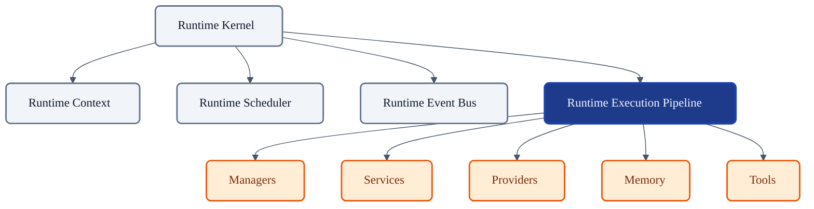
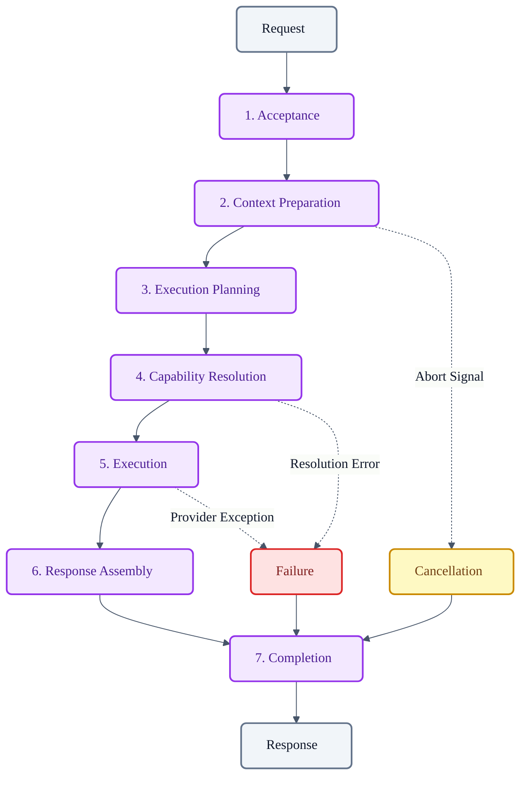
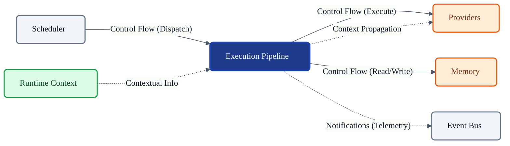

# VoxCore Runtime Execution Pipeline

This document defines the internal architecture, execution stages, ownership boundaries, lifecycle integration, extensibility model, and collaboration rules of the Runtime Execution Pipeline.

It answers exactly one engineering question: **"How does VoxCore process a runtime request from acceptance to completion?"**

The Runtime Execution Pipeline is responsible for executing runtime work. It is not responsible for scheduling, orchestration, event communication, provider implementations, or persistent storage. Those responsibilities belong to their dedicated runtime subsystems.

---

## 1. Purpose

The Runtime Execution Pipeline exists to standardize the processing of executable requests within the VoxCore architecture.

Without a centralized execution pipeline:
* **Request handling becomes inconsistent**: Different modules parse, validate, and execute requests using custom, incompatible flows.
* **Execution logic becomes duplicated**: Context setup, metric tracking, and capability resolution must be rewritten for every new endpoint or feature.
* **Context propagation becomes unreliable**: Trace IDs and cancellation signals get lost when execution jumps between disconnected components.
* **Extension becomes difficult**: There is no standard interface to inject middleware, tracing, or filtering logic.
* **Debugging becomes fragmented**: Unhandled errors crash varying parts of the system with inconsistent stack traces.
* **Lifecycle integration becomes inconsistent**: Tasks may finish executing but fail to notify the Scheduler, leaving phantom tasks in queues.

The pipeline standardizes execution while remaining entirely independent of *what* exactly is being executed.

---

## 2. Pipeline Philosophy

The design of the Runtime Execution Pipeline must adhere to the following principles:

* **Stage-Based Execution**: Every request flows through discrete, ordered conceptual stages.
* **Single Responsibility Per Stage**: A stage handles exactly one phase (e.g., capability resolution or response assembly) and delegates the rest.
* **Deterministic Flow**: Executions follow a mathematically predictable path; branching logic is contained entirely within defined stages.
* **Explicit Stage Ownership**: The Pipeline owns the progression between stages, not the internal business logic of the active stage.
* **Context Preservation**: The Pipeline ensures that `RuntimeContext` is safely propagated across asynchronous boundaries at every stage.
* **Cancellation Awareness**: The Pipeline actively polls the Context for abort signals between stage transitions to halt work early.
* **Failure Isolation**: Exceptions thrown by Providers or Tools are caught, wrapped in standard diagnostics, and escalated gracefully.
* **Extensibility**: Middleware can be injected into the pipeline transitions without modifying core pipeline logic.
* **Framework Independence**: The Pipeline relies solely on the VoxCore domain architecture, eschewing external orchestration libraries.

---

## 3. Responsibilities

The Pipeline explicitly distinguishes between responsibilities it owns and operations it delegates.

| Responsibility | Description | Owned? |
| :--- | :--- | :--- |
| **Accept executable work** | Receives Dispatched tasks from the Scheduler. | **Yes** |
| **Validate execution context**| Ensures the task is legally bound to a context. | **Yes** |
| **Coordinate stage transitions**| Moves work from one pipeline step to the next. | **Yes** |
| **Propagate execution context**| Passes correlation and abort signals to stages. | **Yes** |
| **Manage execution cancellation**| Intercepts and stops transitions if aborted. | **Yes** |
| **Aggregate execution results**| Collects outputs from underlying providers. | **Yes** |
| **Report execution outcome** | Notifies the Scheduler/Bus upon completion. | **Yes** |
| **Implement providers** | Actually calling OpenAI or AWS APIs. | *Delegated* |
| **Determine task timing** | Knowing *when* a request should start. | *Delegated* |

---

## 4. Pipeline Architecture

The execution of a single request structurally moves through 7 conceptual stages.

### Stage 1: Request Acceptance
* **Purpose**: Ingress the dispatched task into the Pipeline.
* **Responsibilities**: Validates the Task payload and binds it to a local Execution scope.
* **Inputs**: Dispatched `Task`.
* **Outputs**: Validated local `Execution` structure.

### Stage 2: Context Preparation
* **Purpose**: Mount the necessary environment.
* **Responsibilities**: Derives a child `RuntimeContext` specific to this execution attempt, inheriting correlation IDs.

### Stage 3: Execution Planning
* **Purpose**: Identify the required operational steps based on the request payload.
* **Responsibilities**: Parses the request to determine if it requires LLM generation, Tool invocation, or Memory retrieval.

### Stage 4: Capability Resolution
* **Purpose**: Bind the plan to concrete Provider Managers.
* **Responsibilities**: Queries the Service Locator/Managers to find the correct `ProviderInstance` capable of fulfilling the work.

### Stage 5: Execution
* **Purpose**: Actual runtime work occurs.
* **Responsibilities**: The Pipeline hands the payload to the resolved Provider/Tool. The Pipeline waits for completion. *(Note: The Pipeline does not know how the Provider executes).*

### Stage 6: Response Assembly
* **Purpose**: Format the raw Provider output into a standardized `Response`.
* **Responsibilities**: Aggregates output data, appends diagnostics, and constructs the final Response entity.

### Stage 7: Completion
* **Purpose**: Finalize the execution lifecycle.
* **Responsibilities**: Fires completion events to the Event Bus, releases the child Context, and notifies the Scheduler that the task is finished.

---

## 5. Internal Module Decomposition

To orchestrate this flow, the Pipeline logically decomposes into internal modules.

### Pipeline Coordinator
* **Purpose**: Acts as the main entry point and driver.
* **Responsibilities**: Receives tasks and commands the `Stage Coordinator`.
* **Collaborators**: `Runtime Scheduler`, `Stage Coordinator`.
* **Ownership**: Owns the overall execution wrapper.

### Stage Coordinator
* **Purpose**: Enforces sequential stage progression.
* **Responsibilities**: Validates inputs/outputs between stages and halts execution if cancellation is detected mid-transition.
* **Collaborators**: All stage modules.
* **Ownership**: Owns stage-to-stage transitions.

### Execution Context Adapter
* **Purpose**: Handles context propagation.
* **Responsibilities**: Derives child contexts, injects diagnostic metadata, and links trace correlation IDs.
* **Collaborators**: `Runtime Context`.
* **Ownership**: Owns execution boundary scoping.

### Capability Resolver
* **Purpose**: Bridges the Pipeline to external Managers.
* **Responsibilities**: Translates an execution plan into a concrete manager/provider invocation.
* **Collaborators**: `Managers` (Provider/Tool/Memory).
* **Ownership**: Owns resolution logic.

### Execution Monitor
* **Purpose**: Safeguards the active Execution stage.
* **Responsibilities**: Enforces timeouts and wraps provider panics/exceptions safely.
* **Collaborators**: `Runtime Context`.
* **Ownership**: Owns fault isolation during Execution.

### Response Aggregator
* **Purpose**: Normalizes outputs.
* **Responsibilities**: Converts heterogeneous provider results into domain `Response` entities.
* **Collaborators**: `Stage Coordinator`.
* **Ownership**: Owns response payload formatting.

### Completion Coordinator
* **Purpose**: Cleans up resources.
* **Responsibilities**: Signals the Scheduler to release the queue slot and fires Event Bus metrics.
* **Collaborators**: `Runtime Scheduler`, `Runtime Event Bus`.
* **Ownership**: Owns execution teardown.

---

## 6. Public Capabilities

The Runtime Execution Pipeline exposes the following conceptual operations:

### Execute Request
* **Purpose**: Process a formally dispatched task.
* **Inputs**: Dispatched `Task`, `RuntimeContext`.
* **Outputs**: `Response` entity or `Error`.
* **Preconditions**: Task is admitted and dispatched by the Scheduler.
* **Postconditions**: Task is Completed or Failed; Response is returned.
* **Failure Conditions**: Validation failure, Provider crash, Context aborted.

### Cancel Execution
* **Purpose**: Halts an in-progress execution.
* **Inputs**: Task ID.
* **Outputs**: None.
* **Preconditions**: Execution is actively running in a stage.
* **Postconditions**: Execution throws an abort signal and jumps to Completion.
* **Failure Conditions**: Execution already finished.

### Query Execution Status
* **Purpose**: Checks which stage a specific execution is currently evaluating.
* **Inputs**: Task ID.
* **Outputs**: Stage Name.
* **Preconditions**: None.
* **Postconditions**: None.
* **Failure Conditions**: ID not found.

*(Note: Capabilities like "Retry" or "Resume" are fundamentally owned by the Scheduler/Managers, not the Pipeline itself).*

---

## 7. Context Propagation

The Pipeline enforces context propagation strictly.

* **Context acquisition**: The Pipeline extracts the parent `RuntimeContext` attached to the incoming Task.
* **Context propagation**: The Pipeline generates a derived (child) context specifically for the execution attempt, passing it into every stage and down to Providers.
* **Metadata propagation**: Any metrics or trace spans generated by Providers are appended to this child context.
* **Cancellation propagation**: Between every stage transition, the Pipeline checks the child context for an abort signal. If detected, progression stops.
* **Isolation boundaries**: A crashed provider corrupts only the local child context, protecting the parent session context.

---

## 8. Stage Transition Rules

The Pipeline relies on the lifecycle rules defined in *Runtime State Machines*.

* **Valid transitions**: Stages must progress linearly (1 → 2 → 3 → 4 → 5 → 6 → 7).
* **Invalid transitions**: Skipping Stage 4 (Resolution) and attempting Stage 5 (Execution) is an architectural fault and results in an immediate crash.
* **Cancellation**: If a cancellation is detected at any stage, the flow immediately branches to Stage 7 (Completion).
* **Failure**: If an unhandled exception occurs (e.g., in Stage 5), the pipeline catches it, skips Stage 6, constructs a Failed Response, and proceeds to Stage 7.
* **Completion**: Stage 7 always executes, regardless of success, failure, or cancellation, to ensure resource release.

---

## 9. Collaboration

### Runtime Kernel
* **Dependency Direction**: Kernel → Pipeline
* **Information Exchanged**: Initialization, Teardown signals.
* **Ownership**: Kernel manages the Pipeline instance.

### Runtime Context
* **Dependency Direction**: Pipeline → Context
* **Information Exchanged**: Trace IDs, abort signals, configurations.
* **Ownership**: Pipeline derives contexts for execution scopes.

### Runtime Scheduler
* **Dependency Direction**: Scheduler → Pipeline
* **Information Exchanged**: Hand-off of Dispatched tasks; return of Completion signals.
* **Ownership**: Scheduler delegates the active execution to the Pipeline.

### Runtime Event Bus
* **Dependency Direction**: Pipeline → Event Bus
* **Information Exchanged**: Publication of telemetry, state changes, and responses.
* **Ownership**: Pipeline uses Bus to communicate outwards passively.

### Managers & Providers
* **Dependency Direction**: Pipeline → Managers/Providers
* **Information Exchanged**: Payload handoff for business logic execution.
* **Ownership**: Pipeline orchestrates Managers to do the heavy lifting.

---

## 10. Pipeline Invariants

The following invariants must hold true under all conditions:

1. **Every execution owns one child Runtime Context.** Without context, correlation is impossible.
2. **Stages execute sequentially.** Out-of-order execution corrupts capability resolution.
3. **Execution shall preserve context.** Providers must not strip correlation IDs from their outputs.
4. **Failures shall preserve diagnostics.** Crashes must be wrapped in standard error structures with trace links before termination.
5. **Cancellation propagates downstream.** The Pipeline must stop immediately upon detecting an abort signal; it must not wait for the provider to finish.
6. **Pipeline shall not own providers.** Resolving a provider delegates execution to the external manager.
7. **Pipeline shall not own scheduler state.** It cannot alter queue depths or manually re-queue a task.
8. **No stage bypasses lifecycle validation.** Acceptance and Completion stages must wrap every execution.

---

## 11. Failure Behaviour

* **Validation failure**: If Stage 1 fails (e.g., malformed payload), execution immediately aborts and returns a validation error.
* **Capability failure**: If Stage 4 cannot find a provider, the pipeline fails with an `UnsupportedCapability` error.
* **Execution failure**: If a provider panics in Stage 5, the Execution Monitor catches it, logs the trace, and transitions to Stage 7 with a `ProviderError`.
* **Cancellation**: Jumps directly to Stage 7, yielding a `Cancelled` state.
* **Diagnostic preservation**: All failures append their exception traces to the child `RuntimeContext` before disposal.
* **Recovery boundaries**: The Pipeline does not auto-retry. Retries are a scheduling concern; the Pipeline merely reports the failure.

---

## 12. Extension Points

The Pipeline remains architecture-neutral to allow future extensions:
* **New pipeline stages**: Injectable middleware (e.g., Pre-Execution Validation) can be inserted via the `Stage Coordinator`.
* **Execution interceptors**: Plugins can wrap Stage 5 to inject prompts, sanitize outputs, or modify headers.
* **Diagnostics & Metrics**: Telemetry hooks fire into the Event Bus at every stage transition.
* **Tracing**: OpenTelemetry spans are opened at Stage 1 and closed at Stage 7 automatically.

---

## 13. Design Constraints

The following constraints are mandatory:
* **Pipeline shall not schedule work.**
* **Pipeline shall not communicate directly between unrelated subsystems.** It must use the Event Bus.
* **Pipeline shall not own runtime lifecycle.**
* **Pipeline shall not own provider implementations.** It must remain ignorant of OpenAI, Anthropic, or AWS SDKs.
* **Pipeline shall not persist runtime state.** Storage belongs to Memory or Observability subsystems.
* **Pipeline stages shall remain cohesive.** A stage must perform exactly one conceptual operation.

---

## 14. Conclusion

The Runtime Execution Pipeline standardizes runtime execution while preserving modularity, extensibility, deterministic behaviour, and architectural consistency. By clearly defining stages and boundaries, the Pipeline ensures that business logic (Providers) remains fully isolated from orchestration logic (Scheduler/Kernel), allowing VoxCore to safely execute complex interactions without monolithic coupling.

---

## Required Tables

### Table 1: Documentation Relationships

| Document | Responsibility |
| :--- | :--- |
| **Runtime Data Models** | Defines Request, Response, ToolExecution, ProviderInstance. |
| **Runtime State Machines** | Defines lifecycle of executable runtime entities. |
| **Runtime Kernel** | Owns runtime lifecycle. |
| **Runtime Context** | Supplies execution context. |
| **Runtime Scheduler** | Coordinates execution timing. |
| **Runtime Event Bus** | Coordinates runtime communication. |
| **Runtime Execution Pipeline (This Doc)** | Executes runtime requests. |
| **Managers** | Supply runtime services. |
| **Services** | Implement reusable runtime capabilities. |

### Table 2: Responsibilities Matrix

| Responsibility | Owner | Delegated To |
| :--- | :--- | :--- |
| **Accept executable work** | Pipeline | N/A |
| **Validate execution context** | Pipeline | N/A |
| **Coordinate stage transitions** | Pipeline | N/A |
| **Aggregate execution results** | Pipeline | N/A |
| **Determine execution timing** | N/A | Scheduler |
| **Implement AI/Tool behavior** | N/A | Providers / Managers |
| **Persist conversational memory** | N/A | Memory Manager |

### Table 3: Pipeline Stage Summary

| Stage | Purpose | Input | Output | Owner |
| :--- | :--- | :--- | :--- | :--- |
| **1. Acceptance** | Ingress and validate. | Dispatched Task | Execution Scope | Pipeline |
| **2. Context Prep**| Spawn child context. | Parent Context | Child Context | Pipeline |
| **3. Planning** | Determine required logic. | Request Payload | Execution Plan | Pipeline |
| **4. Capability** | Bind plan to Managers. | Execution Plan | Provider Reference | Pipeline |
| **5. Execution** | Actual logic occurs. | Payload & Provider | Raw Result | Managers |
| **6. Assembly** | Format final data. | Raw Result | Response Entity | Pipeline |
| **7. Completion** | Teardown and notify. | Response Entity | Final Signal | Pipeline |

### Table 4: Pipeline Invariants

| Invariant | Reason |
| :--- | :--- |
| **Sequential stage execution** | Ensures capabilities are resolved before execution. |
| **Context derivation required** | Protects parent session correlation from child faults. |
| **Failures preserve diagnostics**| Ensures observability into provider crashes. |
| **No auto-retries in Pipeline** | Retries are a scheduling concept, not execution. |
| **Must not own providers** | Maintains agnostic architectural decoupling. |

### Table 5: Collaboration Matrix

| Subsystem | Relationship | Dependency Direction |
| :--- | :--- | :--- |
| **Runtime Scheduler** | Hands off tasks; receives completion. | Scheduler → Pipeline |
| **Runtime Context** | Used to derive execution boundaries. | Pipeline → Context |
| **Runtime Event Bus** | Used to broadcast stage transitions. | Pipeline → Event Bus |
| **Managers / Providers** | Invoked during Stage 5. | Pipeline → Managers |
| **Memory Manager** | Invoked if execution requires recall. | Pipeline → Memory |

---

## Required Diagrams

### Diagram 1: Execution Pipeline Position Within Runtime



### Diagram 2: Request Execution Flow



### Diagram 3: Pipeline Internal Architecture

```mermaid
%%{init: {"theme": "base", "themeVariables": {"primaryColor": "#F8FAFC", "primaryTextColor": "#0F172A", "primaryBorderColor": "#64748B", "lineColor": "#475569", "fontFamily": "Inter, sans-serif"}}}%%
flowchart TD
    pipeline["Runtime Execution Pipeline"]:::pipeline

    coord["Pipeline Coordinator"]:::standard
    stageCoord["Stage Coordinator"]:::stage
    adapter["Context Adapter"]:::context
    resolver["Capability Resolver"]:::manager
    monitor["Execution Monitor"]:::notification
    aggregator["Response Aggregator"]:::stage
    complete["Completion Coordinator"]:::standard

    pipeline --> coord
    pipeline --> stageCoord
    pipeline --> adapter
    pipeline --> resolver
    pipeline --> monitor
    pipeline --> aggregator
    pipeline --> complete

    classDef pipeline fill:#1E3A8A,stroke:#1E40AF,color:#EFF6FF,stroke-width:3px,rx:6px,ry:6px;
    classDef stage fill:#F3E8FF,stroke:#9333EA,color:#4C1D95,stroke-width:2px,rx:6px,ry:6px;
    classDef context fill:#DCFCE7,stroke:#16A34A,color:#14532D,stroke-width:2px,rx:6px,ry:6px;
    classDef manager fill:#FFEDD5,stroke:#EA580C,color:#7C2D12,stroke-width:2px,rx:6px,ry:6px;
    classDef notification fill:#F1F5F9,stroke:#64748B,color:#0F172A,stroke-width:2px,rx:6px,ry:6px;
    classDef standard fill:#F1F5F9,stroke:#64748B,color:#0F172A,stroke-width:2px,rx:6px,ry:6px;
```



### Diagram 4: Pipeline Collaboration



### Diagram 5: Pipeline Stage Lifecycle

```mermaid
%%{init: {"theme": "base", "themeVariables": {"primaryColor": "#F8FAFC", "primaryTextColor": "#0F172A", "primaryBorderColor": "#64748B", "lineColor": "#475569", "fontFamily": "Inter, sans-serif"}}}%%
flowchart LR
    accepted["Accepted"]:::stage
    prepared["Prepared"]:::stage
    planned["Planned"]:::stage
    resolved["Resolved"]:::stage
    executing["Executing"]:::stage
    assembling["Assembling"]:::stage
    completed["Completed"]:::stage

    failed["Failed"]:::failure
    cancelled["Cancelled"]:::cancellation

    accepted --> prepared --> planned --> resolved --> executing --> assembling --> completed
    
    executing -. "Error" .-> failed
    planned -. "Abort" .-> cancelled

    failed --> completed
    cancelled --> completed

    classDef stage fill:#F3E8FF,stroke:#9333EA,color:#4C1D95,stroke-width:2px,rx:6px,ry:6px;
    class.failure fill:#FEE2E2,stroke:#DC2626,color:#7F1D1D,stroke-width:2px,rx:6px,ry:6px;
    classDef cancellation fill:#FEF9C3,stroke:#CA8A04,color:#713F12,stroke-width:2px,rx:6px,ry:6px;
```
